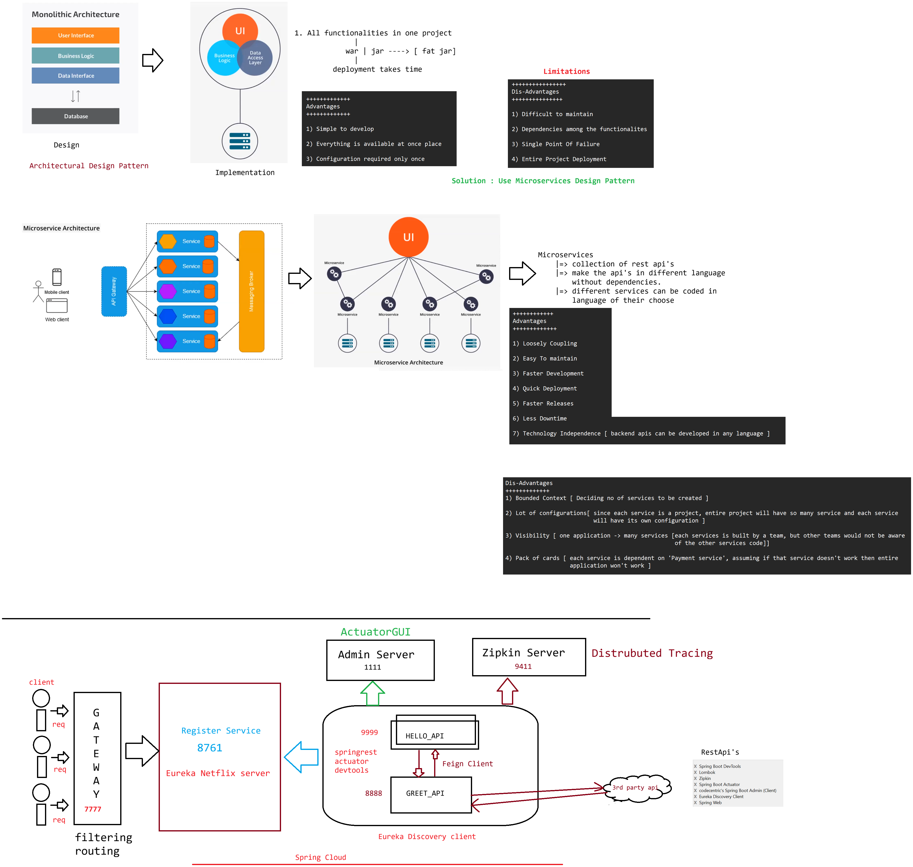

# Day-64 — 10-09-2026 — Microservices Architecture

---

## 🏗️ Monolithic vs Microservices

These are architectural design patterns to build our application.

---

## 📦 What is Monolith Architecture

- If we develop all the functionalities in a single project then it is called as Monolith architecture based application
- We will package our application as a jar/war to deploy into server
- As monolith application contains all functionalities, it will become fat jar/war

### Advantages

1. Simple to develop
2. Everything is available at one place
3. Configuration required only once

### Disadvantages

1. Difficult to maintain
2. Dependencies among the functionalities
3. Single Point Of Failure
4. Entire Project Deployment

****** To overcome the problems of Monolith, Microservices architecture came into market ******

---

## 🧩 What Microservices Is (and Is Not)

- Microservices is **not** a programming language
- Microservices is **not** a framework
- Microservices is **not** a Specification API
- Microservices **is** an architectural design pattern
- Microservices suggesting to develop application functionalities with loosely coupling
- In Microservices architecture we don't develop all the functionalities in a single project. We will divide project functionalities into several REST APIs

********************* Note: One REST API is called as one Microservice ************************

- Microservices architecture based project means collection of REST APIs
- Microservices is not related to only Java. Any programming language specific project can use Microservices Architecture

### Advantages

1. Loosely Coupling
2. Easy To maintain
3. Faster Development
4. Quick Deployment
5. Faster Releases
6. Less Downtime
7. Technology Independence [backend APIs can be developed in any language]

### Disadvantages

1. Bounded Context [deciding no of services to be created]
2. Lot of configurations [since each service is a project, entire project will have so many services and each service will have its own configuration]
3. Visibility [one application → many services; each service is built by a team, but other teams would not be aware of the other services' code]
4. Pack of cards [each service is dependent on 'Payment service'; assuming if that service doesn't work then entire application won't work]

---

## 🏛️ Microservices Architecture Components

- We don't have any fixed architecture for Microservices
- People are customizing microservices architecture according to their requirement
- Most of the projects will use below components in Microservices Architecture

1. Service Registry (Eureka Server)
2. Services (REST APIs)
3. Interservice Communication (FeignClient)
4. API Gateway (Zuul Proxy)
5. Admin Server
6. Sleuth & Zipkin Server

---

## 📒 Service Registry

- Service Registry acts as DB of services available in the project
- It provides the details of all the services which are registered with Service Registry
- We can identify how many services available in the project
- We can identify how many instances available for each service
- We can use **Eureka Server** as service registry
- Eureka Server provided by **Spring Cloud Netflix** library

---

## 🔌 Services

- Services means REST APIs / Microservices
- Services contains backend business logic
- In the project, some services will interact with DB
- In the project, some services will interact with third party REST API (external communication)
- In the project, some services will interact with another services within the project (inter-service communication)
- For inter-service communication we will use Feign Client
- To distribute the load, we can run one service with Multiple Instances (Load Balancing)

**Note:** We will register every service with Service Registry

---

## 🚪 API Gateway

- API Gateway is used to manage our backend APIs of the project
- API Gateway acts as mediator between end users and backend APIs
- API Gateway can filter logic to decide request processing
- API Gateway will contain Routing logic (which request should go to which REST API)
- API Gateway also will be registered with Service Registry
- **Spring Cloud Gateway** we can use as API Gateway

---

## 🖥️ Admin Server

- It is used to monitor and manage all backend APIs' actuator endpoints at one place
- Register backend APIs to Admin server
- Admin server provides user interface to monitor API actuator endpoints

---

## 📍 Zipkin Server

- Used for distributed tracking
- It is used for monitoring which API is taking more time to process our request
- We can track failure point also

---

## 🤖 AI Points

1. **Production consideration:** Plan bounded contexts carefully—too many tiny services explode ops cost; too few recreate a distributed monolith.
2. **Industry practice:** Standard Spring Cloud stack: Eureka registry, Feign for sync inter-service calls, Gateway for routing, Admin + Zipkin for ops visibility.
3. **Common mistake:** Equating “microservices” with a framework or language—it's an architecture of loosely coupled deployable APIs.
4. **Interview insight:** Contrast monolith SPOF / fat deployables with independently deployable REST services and technology independence.
5. **Modern Spring Boot connection:** Netflix Zuul is legacy; Spring Cloud Gateway is the current gateway; Zipkin pairs with Micrometer Tracing (formerly Sleuth).

---

## 💻 My Codes

  
## 🖼️ Image

