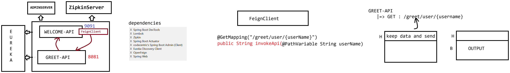

# Day-66 — 16-09-2026 — FeignClient Examples

---

## 🧩 Microservices Ports Recap

| Component | Port |
| --- | --- |
| Eureka Server | 8761 |
| Admin Server | 1111 |
| Zipkin Server | 9411 |
| RestApis | 8081, 9091 |

At the starter class add 2 annotations:

- `@EnableDiscoveryClient`
- `@EnableFeignClients`

---

## 📜 Rules for Writing a FeignClient

1. Create an interface
2. Annotate the interface with `@FeignClient`

```java
FeignClient(name='SERVICE-PROVIDER-NAME')
FeignClient(value="GREET",url="http://lh:8081/")
```

3. Write methods by referring to the service provider API calls

```java
	eg:     @GetMapping("/greet/user/{userName}")
		public String invokeApi(@PathVariable String userName)

		@PostMapping("/greet/saveEmployee")
		public String saveuserApi( @RequestBody Employee employee)
```

### Consumer

```java
	      @GetMapping("/save")
	      public String testApi(){
			Employee emp = new Employee();
			emp.setEid(10); emp.setEname("sachin"); emp.setEaddr("MI");
			String response = client.saveUserApi(emp)
			return response;
	      }
```

### Provider

```java
          @PostMapping("/greet/saveEmployee")
	  public String  saveEmployee(@RequestBody Employee employee)
	  {
		return "Employee saved with id : "+employee.getId();

	  }
```

Feign maps the consumer interface method to the provider’s HTTP contract (same path, verb, and body/path variables).

---

## 🤖 AI Points

1. **Production consideration:** Prefer `name`/`value` aligned with Eureka service id for discovery; hard-coded `url=` bypasses load balancing and fails over poorly.
2. **Industry practice:** Enable `@EnableFeignClients` once on the consumer app; one interface per provider API surface.
3. **Common mistake:** Mismatching Feign method signatures vs provider (`@PathVariable` names, `@RequestBody` types, path strings)—runtime 404/400.
4. **Interview insight:** OpenFeign is a declarative HTTP client—annotate an interface like a controller, Spring generates the proxy.
5. **Modern Spring Boot connection:** Spring Cloud OpenFeign integrates with load balancer and Micrometer (`feign-micrometer`) for Zipkin spans across service hops.

---

## 💻 My Codes


  
## 🖼️ Image


