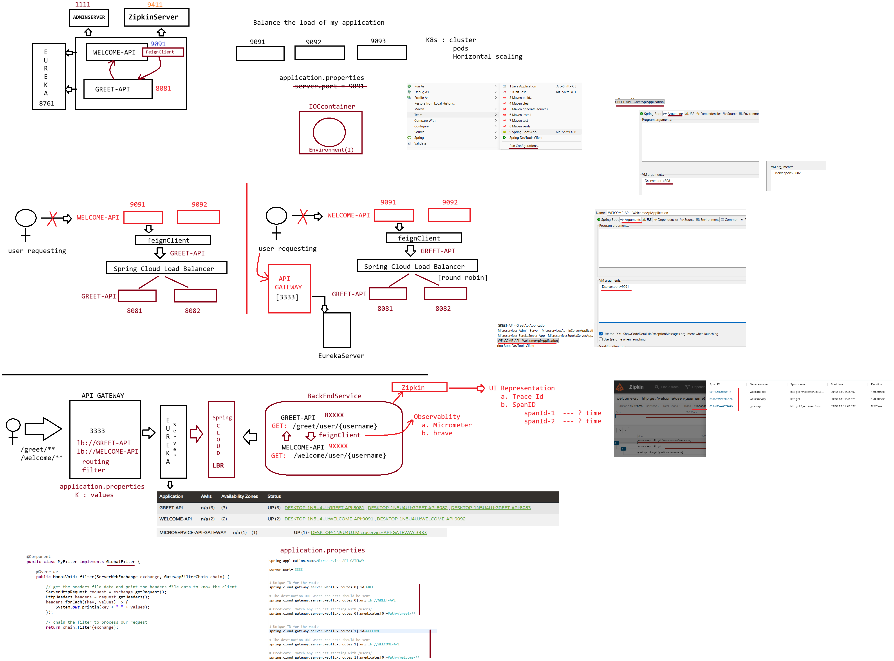

# Day-67 — 18-09-2026 — Loadbalancer API Gateway Trace ID Span Idusing Zipkin

---

## 🧩 Microservices Recap

- Design pattern to build applications in loosely coupled manner
- With Spring Cloud we are building microservices

| Component | Role / Port |
| --- | --- |
| EurekaServer | 8761 — all services should be registered |
| AdminServer | 1111 — Actuator aggregation |
| ZipkinServer | Monitoring GUI — **trace-Id**, **span-id** |
| WELCOME-API | 9091 — uses Feign Client |
| GREET-API | 8081 |

---

## 🔗 FeignClient

- We just write an interface and inside the interface we write a method which gets mapped to an ENDPOINT
- `@EnableFeignClients` should be applied at the starter class

```java
	    @FeignClient
	    interface FeignGreetClient{

		@GetMapping("/greet/user/{userName}")
		public String invokeApi(@PathParam String userName);

		@PostMapping("/greet/employee/save)
		public String saveEmployee(@RequestBody Employee employee);	
	    }
```

---

## 🏷️ Annotations Used

| Annotation | Where | Meaning |
| --- | --- | --- |
| `@EnableDiscoveryClient` | Starter class | Application is a client to Eureka server |
| `@EnableFeignClients` | Starter class | Application will use FeignClient to get response from other services |
| `@EnableEurekaServer` | Starter class | Application is a Eureka server |
| `@EnableAdminServer` | Starter class | Application is an Admin server |

---

## ⚙️ application.properties

```properties
#should be used when application behaves like a client to admin server 
spring.boot.admin.client.url = http://localhost:1111
```

### Starters used (Spring Cloud)

- zipkin-client
- admin-server
- admin-client
- eureka-client
- eureka-server

---

## 🚪 Steps to Build API Gateway

### a. Starters

- Devtools, Eureka client, Gateway (reactive gateway)

```xml
		<dependency>
			<groupId>org.springframework.cloud</groupId>
			<artifactId>spring-cloud-starter-gateway-server-webflux</artifactId>
		</dependency>
```

### b. Enable `@EnableDiscoveryClient` at the starter class level

### c. Go to `application.properties` and set the routing information

### d. Write filter logic using `GlobalFilter` (I)

---

## 📍 Working with Zipkin Server

### a. WELCOME-API

```xml
		<dependency>
			<groupId>org.springframework.boot</groupId>
			<artifactId>spring-boot-starter-zipkin</artifactId>
		</dependency>
		<dependency>
			<groupId>org.springframework.cloud</groupId>
			<artifactId>spring-cloud-starter-openfeign</artifactId>
		</dependency>
		<dependency>
			<groupId>io.github.openfeign</groupId>
			<artifactId>feign-micrometer</artifactId>
		</dependency>
```

```properties
management.tracing.sampling.probability=1.0
```

### b. GREET-API

```xml
		<dependency>
			<groupId>org.springframework.boot</groupId>
			<artifactId>spring-boot-starter-zipkin</artifactId>
		</dependency>
```

```properties
management.tracing.sampling.probability=1.0
```

### c. Start the servers

1. Eureka
2. Admin
3. Zipkin: `java -jar zipkin****.exe` (executable jar)
4. Services
   - greet
   - welcome
5. API Gateway

### Sample requests

```text
request ::  http://localhost:33333/welcome/user/dhoni

request :: http://localhost:9411
		response -----> runquery
				  |
				GUI response involving traceId and spanId
```

Load balancing is implied via Eureka-registered multiple instances + Gateway / Feign client-side balancer; Zipkin correlates the hop with **traceId** / **spanId**.

---

## 🤖 AI Points

1. **Production consideration:** Set `management.tracing.sampling.probability` thoughtfully—`1.0` is for labs; production usually samples a fraction to control volume.
2. **Industry practice:** Spring Cloud Gateway (WebFlux) + Eureka discovery routes `/welcome/**` to WELCOME-API; Feign + `feign-micrometer` propagates trace context.
3. **Common mistake:** Starting Zipkin/Gateway after calling services once—missing spans because tracing exporters were not up or sampling was zero.
4. **Interview insight:** One **traceId** ties the whole request; each service hop adds a **spanId**—Zipkin UI visualizes latency and failure points.
5. **Modern Spring Boot connection:** Prefer Micrometer Tracing + Zipkin Brave/OTel exporters over older Sleuth-only starters while keeping the same Gateway/Eureka topology.

---

## 💻 My Codes


  
## 🖼️ Image


