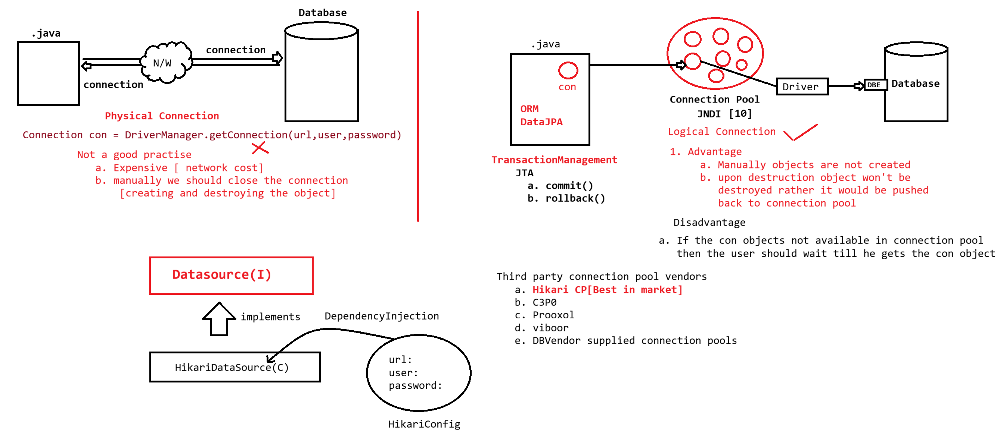

# Exception Handling
## try–catch–finally

```java
try {

} catch (Exception e) {

} finally {

}
```
---
# Try-with-Resources

```java
try (R1; R2; R3) {
    // use resources
}
```
## Resources Used

- `Statement` → extends `AutoCloseable` → `void close()`
- `Connection` → extends `AutoCloseable` → `void close()`
- `ResultSet` → extends `AutoCloseable` → `void close()`
---
# Connection Pooling
## a. MySQL Connection Pooling
### MySQL Class Used

```java
MysqlConnectionPoolDataSource
```
---
## Example: MySQL Connection Pool

```java
package in.pw.test;

import java.sql.Connection;
import java.sql.ResultSet;
import java.sql.SQLException;
import java.sql.Statement;

import com.mysql.cj.jdbc.MysqlConnectionPoolDataSource;

public class ConnectionPoolApp {

    public static void main(String[] args) {

        MysqlConnectionPoolDataSource dataSource =
                new MysqlConnectionPoolDataSource();

        dataSource.setUrl("jdbc:mysql://localhost:3306/ioi_24b2_batch");
        dataSource.setUser("root");
        dataSource.setPassword("root123");

        try (Connection connection = dataSource.getConnection();
             Statement stmt = connection.createStatement();
             ResultSet rst = stmt.executeQuery("select * from student")) {

            System.out.println("SID\tSNAME\tSAGE");
            while (rst.next()) {
                System.out.println(
                        rst.getInt(1) + "\t" +
                        rst.getString(2) + "\t" +
                        rst.getInt(3)
                );
            }

        } catch (SQLException e) {
            e.printStackTrace();
        }
    }
}
```
---
# Maven: Transitive Dependency Management

```
A → B → C
```

- Maven automatically brings **A, B, and C JARs** into the project.
---
# HikariCP Connection Pooling
## DBConnection Class

```java
package in.pw.ioi;

import java.sql.Connection;

import com.zaxxer.hikari.HikariConfig;
import com.zaxxer.hikari.HikariDataSource;

public class DBConnection {

    public static HikariDataSource ds;

    static {
        HikariConfig config = new HikariConfig();
        config.setJdbcUrl("jdbc:mysql:///ioi_24b2_batch");
        config.setUsername("root");
        config.setPassword("root123");

        config.setMinimumIdle(5);        // idle connections kept ready
        config.setMaximumPoolSize(10);   // max connections
        config.setConnectionTimeout(30000); // wait for free connection

        ds = new HikariDataSource(config);
    }

    public static Connection getConnection() throws Exception {
        return ds.getConnection();
    }
}
```
---
# Maven Configuration
## pom.xml

```xml
<project xmlns="http://maven.apache.org/POM/4.0.0"
         xmlns:xsi="http://www.w3.org/2001/XMLSchema-instance"
         xsi:schemaLocation="http://maven.apache.org/POM/4.0.0
                             https://maven.apache.org/xsd/maven-4.0.0.xsd">

  <modelVersion>4.0.0</modelVersion>

  <groupId>in.pw.ioi</groupId>
  <artifactId>HikariCpConnectionPool</artifactId>
  <version>1.0</version>

  <build>
    <plugins>
      <plugin>
        <groupId>org.apache.maven.plugins</groupId>
        <artifactId>maven-compiler-plugin</artifactId>
        <version>3.14.0</version>
        <configuration>
          <release>21</release>
        </configuration>
      </plugin>
    </plugins>
  </build>

  <dependencies>

    <dependency>
      <groupId>com.zaxxer</groupId>
      <artifactId>HikariCP</artifactId>
      <version>7.0.2</version>
    </dependency>

    <dependency>
      <groupId>com.mysql</groupId>
      <artifactId>mysql-connector-j</artifactId>
      <version>8.3.0</version>
    </dependency>

    <dependency>
      <groupId>org.slf4j</groupId>
      <artifactId>slf4j-simple</artifactId>
      <version>2.0.9</version>
    </dependency>

  </dependencies>

</project>
```
---

___
### **My Practice :**
1. 