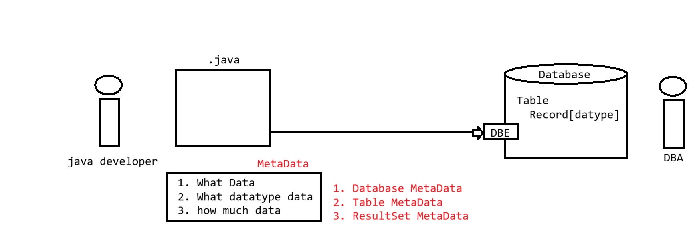

# DatabaseMetaData and ResultSetMetaData
---
## DatabaseMetaData

- Used to get **database-level information**
- Obtained from `Connection` object
---
## Example 1: Fetching Table Information Using DatabaseMetaData
### Code

```java
package in.pw.test;

import java.sql.Connection;
import java.sql.DatabaseMetaData;
import java.sql.DriverManager;
import java.sql.ResultSet;
import java.sql.SQLException;

public class DatabaseMetaDataApp {

    public static void main(String[] args) {

        try (Connection con =
                DriverManager.getConnection(
                        "jdbc:mysql:///ioi_24b2_batch?user=root&password=root123")) {

            DatabaseMetaData dbMetaData = con.getMetaData();

            String catalog = null;
            String schemaPattern = null;
            String tableNamePattern = null;
            String types[] = null;

            ResultSet resultSet =
                    dbMetaData.getTables(
                            catalog,
                            schemaPattern,
                            tableNamePattern,
                            types);

            int count = 0;
            while (resultSet.next()) {
                System.out.println(resultSet.getString(3));
                count++;
            }

            System.out.println("Total no of tables is : " + count);

        } catch (SQLException e) {
            e.printStackTrace();
        }
    }
}
```
---
## Output Logic

- Prints **table names**
- Prints **total number of tables**
---
# ResultSetMetaData

- Used to get **column-level information**
- Obtained from `ResultSet` object
---
## Example 2: Fetching Column Information Using ResultSetMetaData
### Code

```java
package in.pw.test;

import java.sql.Connection;
import java.sql.DriverManager;
import java.sql.ResultSet;
import java.sql.ResultSetMetaData;
import java.sql.SQLException;
import java.sql.Statement;

public class DatabaseMetaDataApp {

    public static void main(String[] args) {

        try (Connection con =
                     DriverManager.getConnection(
                             "jdbc:mysql:///ioi_24b2_batch?user=root&password=root123");
             Statement stmt = con.createStatement();
             ResultSet rst = stmt.executeQuery("select * from student")) {

            ResultSetMetaData rsdMetaData = rst.getMetaData();

            System.out.println("ColumnCount is : "
                    + rsdMetaData.getColumnCount());

            for (int i = 1; i < rsdMetaData.getColumnCount(); i++) {
                System.out.print("Column No : " + i + "\t");
                System.out.print("ColumnName is : "
                        + rsdMetaData.getColumnName(i) + "\t");
                System.out.println("ColumnType is : "
                        + rsdMetaData.getColumnClassName(i));
            }

        } catch (SQLException e) {
            e.printStackTrace();
        }
    }
}
```
---
## Output Logic

- Displays:
    - Column count
    - Column number
    - Column name
    - Column type
---

___
### **My Practice :**
1. 