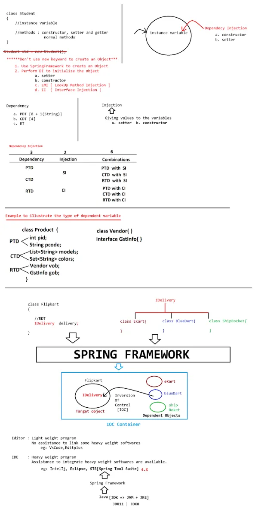

# Core Java
## a. Pillars of OOPs

- Encapsulation
- Inheritance
- Polymorphism
- Abstraction
## b. Exception Handling
## c. Multithreading
## d. Collections

- List
- Set
- Map
- Properties
---
# Advanced Java
## a. JDBC

- Java Database Connectivity
## b. Web Applications

- Servlet
- JSP
---
# Frameworks

- Hibernate (ORM)
- Spring
- Spring Boot
---
# Tools
_(Project Management Tool / Build Tool)_

- Maven
- Gradle
---
# Spring
## a. Spring Core
---
# DI vs IoC
**Dependency Injection (DI)** vs **Inversion of Control (IoC)**

- Managed by Spring Container
---

# Dependency

- A **variable (instance variable)** existing inside a class (Spring Bean)    
---
# Types of Dependencies (3)
## 1. Primitive Type Dependency (PTD)

- Datatypes:  
    `byte, short, int, long, float, double, boolean, char, String`
- If a variable is created using any of the above, it is called **PTD**
---
## 2. Collection Type Dependency (CTD)
_(java.util)_

- List
- Set
- Map (Interface)
- Properties (Class)
---
## 3. Reference Type Dependency (RTD)

- If a **class or interface** is used as a datatype to create a variable
---
# Injection
_(Providing data to variables after object creation)_
## Types of Injection (4)
---
## 1. Setter Injection (SI)

- Object is created using **default constructor**
- Data is injected using **setter method**

```java
class A {
    int id;

    void setId(int id) {
        this.id = id;
    }
}

A oa = new A();
oa.setId(10);
```
---
## 2. Constructor Injection (CI)

- Object creation and data injection using **parameterized constructor**

```java
class A {
    int id;

    A(int id) {
        this.id = id;
    }
}

A oa = new A(10);
```
---
## 3. Lookup Method Injection (LMI)
## 4. Interface Injection (II)
---
# Interview Questions & Answers
## Q) What is Dependency Injection?
**A)**
- Injecting all dependencies into the dependent class
- Creating objects from independent to dependent classes and linking them
- Creating objects and linking them based on relationship
---
## Q) How many types of Dependencies in Spring?
**A)**
- Total **3 types**

    - PTD        
    - CTD
    - RTD
---
## Q) What is Injection and how many types are there in Spring?
**A)**
- Injection means **providing data to dependencies**
- Total Injection Types: **4**
- Spring supports: **3** (SI, CI, LMI)
- Mostly used: **2** (SI, CI)
---
# Required Software
## 1. JDK
- Version: **17** (also 8 / 11)
```
https://www.oracle.com/java/technologies/javase/jdk17-archive-downloads.html
```
---
## 2. STS (Spring Tool Suite)

```
https://spring.io/tools
```
### Installation Steps

- Choose OS-based link
- Wait for download to finish
- Double-click the JAR file
- Choose JDK-based extract
- Open extracted folder  
    _(example: sts-4.15.3.RELEASE)_
- Double-click **SpringToolSuite4**
- Create a new workspace folder  
    _(example: D:\IOISB2024B2)_
- Click **Launch**
---

___
### **My Practice :**
1. 