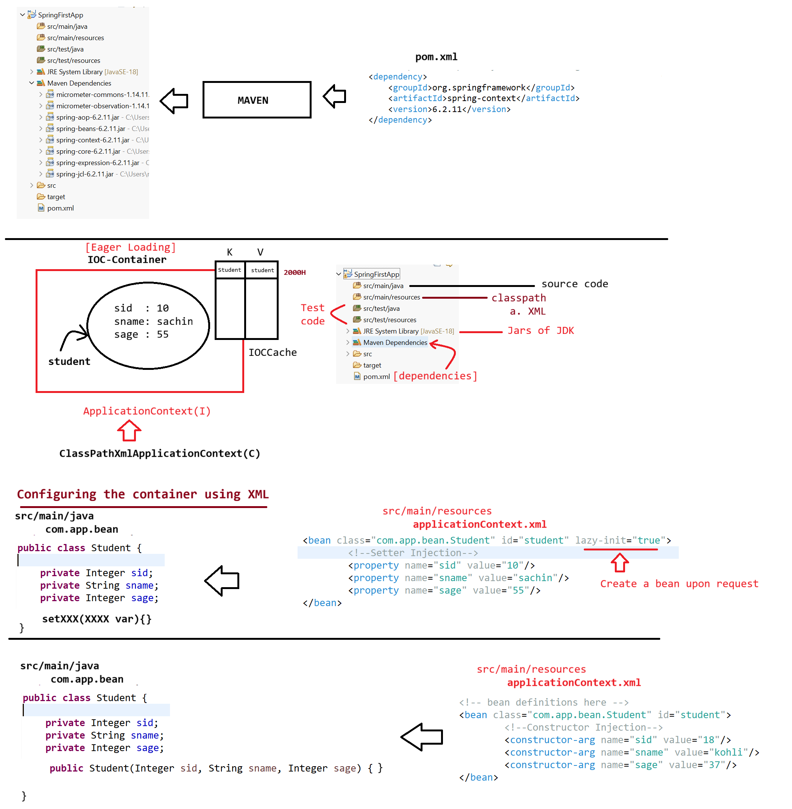

# Spring Container
## Responsibilities of Spring Container

1. Find / scan classes
2. Create objects
3. Provide data and link objects
4. Destroy objects / container
---
## Inputs to Spring Container
Spring container takes **two inputs**:

1. **Spring Bean**
    - A class that follows rules given by Spring container
2. **Spring Configuration**
    - XML
    - Java
    - Annotation
---
# Maven
- Maven downloads **relevant JAR files** and keeps them in the project

```text
Project ⇒ JARs (JDK : JRE) + JARs (Spring : Maven dependencies)
```

- Maven is a **build tool**
- Helps in **project management and releasing builds**
- Coordinates:
    
    - **G** → GroupId
    - **A** → ArtifactId
    - **V** → Version
        

```text
groupId-artifactId-version.jar
```
---
# Example 1: Setter Injection
---
## Student.java

```java
package com.app.bean;

public class Student {

    private Integer sid;
    private String sname;
    private Integer sage;

    static {
        System.out.println("Student.class file is loading by SpringF/w....");
    }

    public Student() {
        System.out.println("Student Object is created by SpringF/w...");
        System.out.println(this.toString());
    }

    public void setSid(Integer sid) {
        System.out.println("SID is injected by SpringF/w using setter");
        this.sid = sid;
    }

    public void setSname(String sname) {
        System.out.println("SNAME is injected by SpringF/w using setter");
        this.sname = sname;
    }

    public void setSage(Integer sage) {
        System.out.println("SAGE is injected by SpringF/w using setter");
        this.sage = sage;
        System.out.println(this.toString());
    }

    @Override
    public String toString() {
        return "Student [sid=" + sid + ", sname=" + sname + ", sage=" + sage + "]";
    }
}
```
---
## applicationContext.xml (Setter Injection)

```xml
<?xml version="1.0" encoding="UTF-8"?>
<beans xmlns="http://www.springframework.org/schema/beans"
       xmlns:xsi="http://www.w3.org/2001/XMLSchema-instance"
       xsi:schemaLocation="
        http://www.springframework.org/schema/beans
        http://www.springframework.org/schema/beans/spring-beans.xsd">

    <bean class="com.app.bean.Student" id="student" lazy-init="true">
        <property name="sid" value="10"/>
        <property name="sname" value="sachin"/>
        <property name="sage" value="55"/>
    </bean>

</beans>
```
---
## TestApp.java

```java
package com.app;

import org.springframework.context.ApplicationContext;
import org.springframework.context.support.AbstractApplicationContext;
import org.springframework.context.support.ClassPathXmlApplicationContext;

import com.app.bean.Student;

public class TestApp {

    public static void main(String[] args) {

        System.out.println("Starting the container");
        ApplicationContext container =
                new ClassPathXmlApplicationContext("applicationContext.xml");

        Student std1 = container.getBean(Student.class);
        System.out.println("****************************************");
        System.out.println(std1);

        Student std2 = container.getBean(Student.class);
        System.out.println("****************************************");
        System.out.println(std2);

        ((AbstractApplicationContext) container).close();
        System.out.println("Closing the container....");
    }
}
```
---
## Output (Setter Injection)

```text
Starting the container
Student.class file is loading by SpringF/w....
Student Object is created by SpringF/w...
Student [sid=null, sname=null, sage=null]
SID is injected by SpringF/w using setter
SNAME is injected by SpringF/w using setter
SAGE is injected by SpringF/w using setter
Student [sid=10, sname=sachin, sage=55]
****************************************
Student [sid=10, sname=sachin, sage=55]
****************************************
Student [sid=10, sname=sachin, sage=55]
Closing the container....
```
---
# Example 2: Constructor Injection
---
## Student.java

```java
package com.app.bean;

public class Student {

    private Integer sid;
    private String sname;
    private Integer sage;

    static {
        System.out.println("Student.class file is loading by SpringF/w....");
    }

    public Student(Integer sid, String sname, Integer sage) {
        super();
        System.out.println("Student Object is created using Constructor by SpringF/w...");
        this.sid = sid;
        this.sname = sname;
        this.sage = sage;
        System.out.println(this.toString());
    }

    @Override
    public String toString() {
        return "Student [sid=" + sid + ", sname=" + sname + ", sage=" + sage + "]";
    }
}
```
---
## applicationContext.xml (Constructor Injection)

```xml
<?xml version="1.0" encoding="UTF-8"?>
<beans xmlns="http://www.springframework.org/schema/beans"
       xmlns:xsi="http://www.w3.org/2001/XMLSchema-instance"
       xsi:schemaLocation="
        http://www.springframework.org/schema/beans
        http://www.springframework.org/schema/beans/spring-beans.xsd">

    <bean class="com.app.bean.Student" id="student">
        <constructor-arg name="sid" value="18"/>
        <constructor-arg name="sname" value="kohli"/>
        <constructor-arg name="sage" value="37"/>
    </bean>

</beans>
```
---
## TestApp.java

```java
package com.app;

import org.springframework.context.ApplicationContext;
import org.springframework.context.support.AbstractApplicationContext;
import org.springframework.context.support.ClassPathXmlApplicationContext;

import com.app.bean.Student;

public class TestApp {

    public static void main(String[] args) {

        System.out.println("Starting the container");
        ApplicationContext container =
                new ClassPathXmlApplicationContext("applicationContext.xml");

        Student std1 = container.getBean(Student.class);
        System.out.println("****************************************");
        System.out.println(std1);

        ((AbstractApplicationContext) container).close();
        System.out.println("Closing the container....");
    }
}
```
---
## Output (Constructor Injection)

```text
Starting the container
Student.class file is loading by SpringF/w....
Student Object is created using Constructor by SpringF/w...
Student [sid=18, sname=kohli, sage=37]
****************************************
Student [sid=18, sname=kohli, sage=37]
Closing the container....
```
---

___
### **My Practice :**
1. 