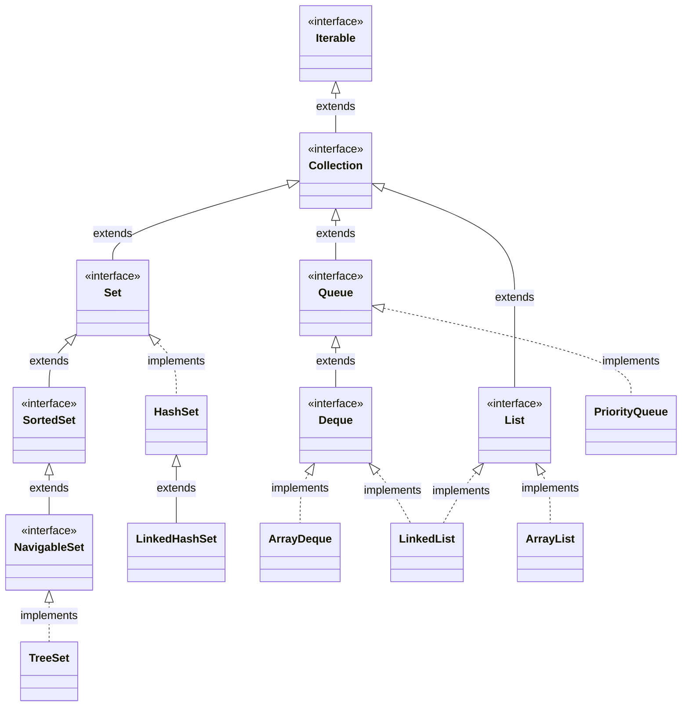

# 📦 Collections in Java

> Digitized from handwritten mentor notes.

## 📚 Table of Contents

- [📦 Collections in Java](#-collections-in-java)
- [📖 Variable Approach](#-variable-approach)
- [📖 Array Approach](#-array-approach)
- [🧩 Collections Framework (JDK 1.2)](#-collections-framework-jdk-12)
- [🧩 ArrayList](#-arraylist)
- [🔗 LinkedList](#-linkedlist)
- [📋 Inbuilt Methods of ArrayList & LinkedList](#-inbuilt-methods-of-arraylist--linkedlist)
- [⚠️ Limitations of ArrayList](#️-limitations-of-arraylist)
- [↔️ ArrayDeque](#️-arraydeque)
- [🔗 LinkedList Insertion Efficiency](#-linkedlist-insertion-efficiency)
- [📊 Array vs ArrayList Preference](#-array-vs-arraylist-preference)
- [⛰️ PriorityQueue](#️-priorityqueue)
- [🔍 Search Operation Inefficiency](#-search-operation-inefficiency)
- [🌳 TreeSet](#-treeset)
- [#️⃣ HashSet](#️-hashset)
- [🔗 LinkedHashSet](#-linkedhashset)
- [📊 Collection Comparisons](#-collection-comparisons)
- [🧬 Collections Hierarchy](#-collections-hierarchy)
- [📋 Summary Table](#-summary-table)
- [🛠️ Classes Usage / Features](#️-classes-usage--features)
- [🔄 Accessing Objects Present Within the Collection](#-accessing-objects-present-within-the-collection)
- [🏹 Lambda Expressions in Java](#-lambda-expressions-in-java)
- [📜 Legacy Classes](#-legacy-classes)
- [⚡ Fail Fast and Fail Safe](#-fail-fast-and-fail-safe)
- [📊 Sorting of Simple Objects](#-sorting-of-simple-objects)
- [🧩 Generics](#-generics)

---

<!-- Source: Page 1 -->

## 📖 Variable Approach

* Traditional approach of storing the data by creating variables is a good approach provided small amount of data has to be stored.

**variable Approach**

```java
int a;    int e;    int i;    int m;    int aa;
int b;    int f;    int j;    :         int ab;
int c;    int g;    int k;    :         :
int d;    int h;    int l;    int z;    int ax;
```

```text
42nd student
{
    ap = 45;
    System.out.println(ap); // 45

    ap → [ 45 ]
}
```

### ⚠️ Limitations of Variable Approach

* If large amount of data has to be stored then the variable approach fails because of the following limitations.
- Creation is tedious & inefficient.
- Accessing the data is difficult.
- Length of the code increases.
- Suitable to store only small amount of data.

---

## 📖 Array Approach

* To overcome the above limitations, we have to use the array approach to store large amount of data because of the following advantages.
- Creation is simple.
- Accessing the data is easy.
- Length of the code reduces.
- Suitable to store large volume of data.

**Array approach**

```java
int[] a = new int[50];
```

```text
42nd student
{
    a[41] = 45;
    System.out.println(a[41]); // 45
}
```

### 🧠 Array Memory Diagram

```text
   a
┌──────┐
│ 1000 │ ──────► 1000
└──────┘         ┌───┬───┬───┬───┬─────┬────┬─────┬────┐
                 │ 0 │ 1 │ 2 │ 3 │ ... │ 41 │ ... │ 49 │
                 └───┴───┴───┴───┴─────┴────┴─────┴────┘
                                        │
                                       45
```

### ⚠️ Limitations of Array Approach

* However, the array approach of storing the data also has the following limitations.
- The size of an array is always fixed. It can not dynamically grow or shrink in size during the program execution.
- Arrays can store only homogeneous type of data. It can not store heterogeneous type of data.
- Arrays always expect contiguous memory location on the RAM. It can not utilize dispersed vacant memory location.

```java
int[] a = new int[5];
a[0] = 10;
a[1] = 45.5;   // ┐
a[2] = "CAT";  // │ heterogeneous data — type mismatch
a[3] = 'A';    // │
a[4] = true;   // ┘
a[5] = 30;     // ← fixed size — index out of bounds
```

### 🧠 RAM Contiguous Memory Diagram

```text
┌──────────────────── RAM ────────────────────┐
│  [occupied]     [vacant]                    │
│                                             │
│  [occupied]     [vacant]     [vacant]       │
│                                             │
│         a ──► ┌───┬───┬───┬───┬───┐         │
│               │ 0 │ 1 │ 2 │ 3 │ 4 │         │
│               └───┴───┴───┴───┴───┘         │
│                 ↑ contiguous block required │
│                                             │
│  [vacant]       [vacant]                    │
└─────────────────────────────────────────────┘
```

---

<!-- Source: Page 2 -->

## 🧩 Collections Framework (JDK 1.2)

* In order to overcome the disadvantages of array approach, in JDK 1.2 Joshua Bloch provided collections framework which contains a set of 7 concrete classes.

* The seven concrete collection classes are,

1. ArrayList
2. LinkedList
3. ArrayDeque
4. PriorityQueue
5. TreeSet
6. HashSet
7. LinkedHashSet

---

## 🧩 ArrayList

### 1) ArrayList class:

```java
import java.util.ArrayList;
class Launch
{
    public static void main(String[] args)
    {
        ArrayList al = new ArrayList();
        al.add(10);
        al.add(45.5f);
        al.add(75.60);
        al.add('Z');
        al.add(true);
        al.add("RJT");
        System.out.println(al);
    }
}
```

**Output:**

```text
[10, 45.5, 75.60, Z, true, RJT]
```

### 🧠 Internal Structure — Dynamic Array

```text
   al
┌──────┐
│ 1000 │ ──────► 1000
└──────┘         ┌────┬──────┬───────┬───┬──────┬─────┬───┬───┬───┬───┐
                 │ 10 │ 45.5 │ 75.60 │ Z │ true │ RJT │   │   │   │   │
                 └────┴──────┴───────┴───┴──────┴─────┴───┴───┴───┴───┘
                   0     1      2     3    4      5    6   7   8   9

                        "Dynamic Array"
```

### ⚙️ Capacity Calculation

```text
Default capacity = 10

New capacity = 50% more than old capacity.
             = old capacity + 50% of old capacity
             = 10 + 5
             = 15

New capacity = 15 + 7
             = 22
```

* ArrayList internally makes use of dynamic array.

* Hence, two of the limitations of the array approach namely,
  - size being fixed.
  - not being able to store heterogeneous data,
  
  can be easily overcome using the ArrayList class as shown above.

* However, ArrayList still expects contiguous memory location on the RAM as it makes use of dynamic array internally.

---

## 🔗 LinkedList

### 2) LinkedList class:

* LinkedList internally makes use of "doubly linked list" DS. Hence, it does not expect contiguous memory locations instead it can utilize dispersed memory location on the RAM (through pointers).

* Hence, all the limitations of the array DS can be overcome by using the LinkedList class.

---

<!-- Source: Page 3 -->

```java
import java.util.LinkedList;
class Launch
{
    public static void main(String[] args)
    {
        LinkedList ll = new LinkedList();
        ll.add(10);
        ll.add(45.5f);
        ll.add('Z');
        ll.add(true);
        ll.add("GQT");
        System.out.println(ll);
    }
}
```

**Output:**

```text
[10, 45.5, Z, true, GQT]
```

### 🧠 Doubly Linked List Diagram

Node structure: `[ prev | data | next ]`  
(`N` = null)

```text
ll ──► [ N | 10 | • ] ←──► [ • | 45.5 | • ] ←──► [ • | Z | • ]
             (0)                 (1)                   (2)
       ←──► [ • | true | • ] ←──► [ • | GQT | N ]
                  (3)                   (4)

              "Doubly Linked List"
              [ prev | data | next ]
```

**Linked List types:**

1. Singly LL
2. Doubly LL ✓
3. Circular LL

---

## 📋 Inbuilt Methods of ArrayList & LinkedList

### Inbuilt methods of ArrayList class & LinkedList class:

1. `add(elem)` → Adds the element to the end of the ArrayList.
2. `add(index, elem)` → Adds the element at the specified index.
3. `set(index, elem)` → replaces the element at the specified index.
4. `addAll(collection)` → adds all the elements from the collection to the end of this list.  
   `addAll(index, collection)`
5. `contains(elem)` → returns true if the element is present in the list, else false.
6. `containsAll(collection)` → Returns true if all the elements of the specified collection are present in this list, else false.
7. `indexOf(elem)` → returns the index of the specified element.
8. `lastIndexOf(elem)` → returns the index of the last occurrence of specified element.
9. `get(index)` → returns the element at the specified index.
10. `clear()` → removes all the elements from the list.
11. `isEmpty()` → checks if the collection is empty or not.
12. `size()` → returns the number of elements present in the collection.
13. `remove(index)` → Removes the element at the specified index in the list.  
    `remove(elem)` → Removes the specified element from the list.  
    `removeAll(collection)` → Removes all the elements of the specified collection from the list.
14. `retainAll(collection)` → Only such elements will be retained in the list which are also present in the specified collection.

---

<!-- Source: Page 4 -->

## ⚠️ Limitations of ArrayList

### Limitations of the ArrayList:

```java
ArrayList al = new ArrayList();

al.add(10);       // al → [ 10 ]                        0.1 μs
                         0

al.add(20);       // al → [ 10 | 20 ]                   0.1 μs
                         0    1

al.add(30);       // al → [ 10 | 20 | 30 ]              0.1 μs
                         0    1    2

al.add(40);       // al → [ 10 | 20 | 30 | 40 ]         0.1 μs
                         0    1    2    3

al.add(2, 25);    // al → [ 10 | 20 | 25 | 30 | 40 ]    0.3 μs
                         0    1    2    3    4

al.add(0, 5);     // al → [ 5 | 10 | 20 | 25 | 30 | 40 ]  0.6 μs
                         0   1    2    3    4    5
```

* ArrayList is extremely efficient at performing rear-end insertion. However it is inefficient at performing insertion at intermediary positions and it is extremely inefficient at performing front-end insertion.

* The limitation of front-end insertion being inefficient in ArrayList can be overcome using the ArrayDeque class.

---

## ↔️ ArrayDeque

### 3) ArrayDeque class:

* ArrayDeque internally makes use of "double ended queue DS".
* Default capacity is 16 (increases as a power of 2).

### 🧠 Structure Relationships

```text
                  Array
                 /     \
                /       \
         FILO/LIFO       LILO/FIFO
          "Stack"         "Queue"
             |
      ✗ Random-insertion
      ✗ Random-deletion
```

**Queue [FIFO / LILO]**

```text
deletion (front-end) ←── [ 10 | 20 | 30 | 40 | 50 ] ←── insertion (rear-end)
                            ^                   ^
                        head/front          tail/rear
```

**Double-ended Queue**

```text
deletion  ←──          [ 10 | 20 | 30 | 40 | 50 ]          ──► insertion
   &      ──►                                             ←──      &
insertion                   ^                   ^               deletion
                          head                tail
```

* A double-ended queue is equally efficient at performing insertion at both front-end as well as rear-end.

### 🧩 ArrayDeque Insertion Timing

```java
                     H  T
                     ^  ^
ArrayDeque ad = new ArrayDeque();

ad.add(10);        // ad → [ 10 ]                0.1 μs
                          ^  ^
                       head  tail   (index 0)

ad.add(20);        // ad → [ 10 | 20 ]           0.1 μs
                          ^    ^
                       head(0) tail(1)

ad.add(30);        // ad → [ 10 | 20 | 30 ]      0.1 μs
                          ^          ^
                       head(0)     tail(2)
```

---

<!-- Source: Page 5 -->

```java
ad.addLast(40);    // ad → [ 10 | 20 | 30 | 40 ]           0.1 μs
                          0    1    2    3
                          ^              ^
                        head           tail

ad.addFirst(5);    // ad → [ 5 | 10 | 20 | 30 | 40 ]       0.1 μs
                          0   1    2    3    4             (No shifting)
                          ^                  ^
                        head               tail

ad.add(2, 25);     // ad → [ 5 | 10 | 25 | 20 | 30 | 40 ]  0.4 μs
                          0   1    2    3    4    5
                          ^                       ^
                        head                    tail
```

* As noticed, ArrayDeque is inefficient at performing insertion at intermediary positions.

* If insertion operation must be equally efficient at any given random position then LinkedList class can be used.

---

## 🔗 LinkedList Insertion Efficiency

### LinkedList class (Doubly linked list):

* LinkedList internally makes use of doubly linked list DS and hence it is efficient at performing insertion at any given position.

```java
LinkedList ll = new LinkedList();
ll.add(10);
ll.add(20);
ll.add(30);
ll.addLast(40);
ll.addFirst(5);
ll.add(2, 15);
```

### 🧠 Doubly Linked List After Insertions

```text
ll ──► [ N | 5 | • ] ←──► [ • | 10 | • ] ←──► [ • | 15 | • ]
             0.2 μs             0.2 μs              0.2 μs
       ←──► [ • | 20 | • ] ←──► [ • | 30 | • ] ←──► [ • | 40 | N ]
                  0.2 μs              0.2 μs              0.2 μs
```

Left → right node data: `5 → 10 → 15 → 20 → 30 → 40`

### 🧩 Design a Stack Using LinkedList

```java
LinkedList ll = new LinkedList();
ll.push(10);
ll.push(20);
ll.push(30);
System.out.println(ll); // [30, 20, 10]
ll.pop();
System.out.println(ll); // [20, 10]
```

```text
┌────┐
│ 30 │  ← top
├────┤
│ 20 │
├────┤
│ 10 │
└────┘
  ll
```

---

<!-- Source: Page 6 -->

## 📊 Array vs ArrayList Preference

**Q:** When should we prefer using an array over ArrayList?

**Ans:** Whenever we have to store the data of same type in the primitive form and we also know exactly the size of the data then it is preferable to use arrays over ArrayList, since arrays are more efficient.

**Information known:**

1. size of the data = 15
2. Homogeneous type of data = int

### 🧩 Using ArrayList (Dynamic Array)

```java
ArrayList al = new ArrayList();
al.add(10);   // => al.add(Integer.valueOf(10));   // Auto-Boxing
al.add(20);   // => al.add(Integer.valueOf(20));
al.add(30);   // => al.add(Integer.valueOf(30));
// ...
al.add(110);
al.add(140);
al.add(150);
```

### 🧠 ArrayList Resizing Diagram

```text
   al
┌──────┐
│ 1000 │ ──────► 1000   (stored in object form)
└──────┘         ┌────┬────┬────┬────┬────┬────┬────┬────┬────┬─────┐
                 │ 10 │ 20 │ 30 │ 40 │ 50 │ 60 │ 70 │ 80 │ 90 │ 100 │
                 └────┴────┴────┴────┴────┴────┴────┴────┴────┴─────┘
                   0    1    2    3    4    5    6    7    8    9
                                                         ✗ Not enough memory.

allocate new object with 50% more capacity of the old object
copy all the elements from old object into new object
assign the new reference

   al
┌──────┐
│1000✗ │
│ 2000 │ ──────► 2000
└──────┘         ┌────┬────┬────┬────┬────┬────┬────┬────┬────┬─────┬─────┬─────┬─────┬─────┬─────┐
                 │ 10 │ 20 │ 30 │ 40 │ 50 │ 60 │ 70 │ 80 │ 90 │ 100 │ 110 │ 120 │ 130 │ 140 │ 150 │
                 └────┴────┴────┴────┴────┴────┴────┴────┴────┴─────┴─────┴─────┴─────┴─────┴─────┘
                   0    1    2    3    4    5    6    7    8    9    10    11    12    13    14
                   └──────────── copied from old object ────────────┘
```

### 🧩 Using Array

```java
int[] arr = new int[15];
arr[0] = 10;
arr[1] = 20;
arr[2] = 30;
// ...
arr[13] = 140;
arr[14] = 150;
```

```text
   arr
┌──────┐
│ 1000 │ ──────► 1000   (stored in primitive form)
└──────┘         ┌────┬────┬────┬────┬────┬────┬────┬────┬────┬─────┬─────┬─────┬─────┬─────┬─────┐
                 │ 10 │ 20 │ 30 │ 40 │ 50 │ 60 │ 70 │ 80 │ 90 │ 100 │ 110 │ 120 │ 130 │ 140 │ 150 │
                 └────┴────┴────┴────┴────┴────┴────┴────┴────┴─────┴─────┴─────┴─────┴─────┴─────┘
                   0    1    2    3    4    5    6    7    8    9    10    11    12    13    14
```

### Converting Array into ArrayList and ArrayList into an Array

*(Assignment)*

> **📌 Note:** All of the 7 collection classes can not store primitive data, they can only store objects. If a primitive is given to a collection class then it is automatically converted into an object (auto-boxing) by using the corresponding wrapper class.

---

<!-- Source: Page 7 -->

### 🧩 Autoboxing Example

```java
// Eg:
ArrayList al = new ArrayList();
al.add(10);      // => al.add(Integer.valueOf(10));    // add(Object x)
al.add(20.5f);   // => al.add(Float.valueOf(20.5f));
al.add(45.56);   // => al.add(Double.valueOf(45.56));
```

---

## ⛰️ PriorityQueue

### 4) PriorityQueue class:

* PriorityQueue internally makes use of "Min-Heap" DS.
* A PriorityQueue is used when the objects are supposed to be processed based on the priority.
* Example:
  - Task scheduling by OS.
  - Emergency rooms in a hospital etc.
* In PriorityQueue, the highest priority object (least minimum) would be readily available at the front of the queue.

```java
PriorityQueue pq = new PriorityQueue();
pq.add(100);
pq.add(50);
pq.add(150);
pq.add(25);
pq.add(75);
pq.add(125);
pq.add(175);
System.out.println(pq); // [25, 50, 125, 100, 75, 150, 175]
```

### 🧠 Min-Heap Transformation Stages

**I.** Adding 100, then 50:

```text
  (100)          =>          (50)
  /                          /
(50)                       (100)
```

**II.** Adding 150:

```text
      (50)
     /    \
  (100)  (150)
```

**III.** Adding 25:

```text
      (50)                (50)                (25)
     /    \       =>     /    \       =>     /    \
  (100)  (150)        (25)  (150)        (50)  (150)
  /                   /                  /
(25)               (100)              (100)
```

**IV.** Adding 75:

```text
         (25)
        /    \
     (50)   (150)
     /  \
 (100) (75)
```

**V.** Adding 125:

```text
         (25)                      (25)
        /    \                    /    \
     (50)   (150)      =>      (50)   (125)
     /  \    /                 /  \    /
 (100)(75)(125)            (100)(75)(150)
```

**VI.** Adding 175 (final heap):

```text
              (25)
            /      \
         (50)      (125)
         /  \      /   \
     (100) (75) (150) (175)
```

---

<!-- Source: Page 8 -->

## 🔍 Search Operation Inefficiency

* All the collection classes discussed so far though in their own way are efficient at performing insertion operation, they are highly inefficient at performing search operation as shown below.

### Search operation

**Data:** 100, 50, 150, 25, 75, 125, 175

### 1. ArrayList (Dynamic Array):

```text
al → [ 100 | 50 | 150 | 25 | 75 | 125 | 175 ]
       0     1    2     3    4    5     6
              ↑↑↑↑↑↑↑↑↑↑↑↑↑↑↑↑↑↑↑↑↑↑↑↑↑↑↑
                    Key = 200
                    (compared with every element)

7 - elements
7 - comparisons
```

### 2. LinkedList (Doubly Linked List):

```text
ll → [N|100|•] ↔ [•|50|•] ↔ [•|150|•] ↔ [•|25|•] ↔ [•|75|•] ↔ [•|125|•] ↔ [•|175|N]
                    ↑↑↑↑↑↑↑↑↑↑↑↑↑↑↑↑↑↑↑↑↑↑↑↑↑↑↑↑↑↑↑↑↑↑↑↑↑↑↑↑↑↑↑↑↑↑↑↑↑↑↑↑↑↑↑↑↑↑↑
                                          Key = 200

7 - elements
7 - comparisons
```

### 3. ArrayDeque (Double-ended Queue):

```text
ad → [ 100 | 50 | 150 | 25 | 75 | 125 | 175 ]
       0     1    2     3    4    5     6
              ↑↑↑↑↑↑↑↑↑↑↑↑↑↑↑↑↑↑↑↑↑↑↑↑↑↑↑
                    Key = 200

7 - elements
7 - comparisons
```

### 4. PriorityQueue (Min-Heap):

```text
Key = 200 ──► every node compared

              (20)
            /      \
         (50)      (125)
         /  \      /   \
     (100) (75) (150) (175)

7 - elements
7 - comparisons
```

### Worst-case Time Complexity:

```text
n - elements => n - comparisons.

[Big-oh] O(n)
```

---

<!-- Source: Page 9 -->

## 🌳 TreeSet

### 5) TreeSet [Balanced Binary Search Tree (BST)]:

**Data:** 100, 50, 150, 25, 75, 125, 175

```text
              100
           /        \
         50          150
        /  \        /   \
      25    75    125   175
```

**Search:** Key = 200 → path `100 → 150 → 175`  
**Result:** 7 - elements, 3 - comparisons.

**Data:** 100, 50, 150, 25, 75, 125, 175, 15, 40, 60, 80, 120, 135, 160, 180

```text
                        100
                   /            \
                 50              150
               /    \          /     \
             25      75      125     175
            / \     / \     /  \     /  \
          15  40  60  80  120 135  160 180
```

**Search:** Key = 200 → path `100 → 150 → 175 → 180`  
**Result:** 15 - elements, 4 - comparisons.

### ⚙️ Complexity Derivation

| No. of elements (n) | No. of comparisons (x) |
| --- | --- |
| 7 ≈ 8 = 2³ | 3 - comparisons |
| 15 ≈ 16 = 2⁴ | 4 - comparisons |
| ⋮ | ⋮ |
| 65535 ≈ 65536 = 2¹⁶ | 16 - comparisons |
| n - elements | log n - comparisons |

```text
n = 2^x
Raise log₂ on B.S. (Both Sides):
log n = log 2^x
log n = x · log₂ 2
log n = x · 1
x = log n
```

**∴ For n elements, O(log n)**

* TreeSet class internally makes use of Balanced Binary Search Tree DS using "Red-Black Tree" algorithm. Hence it is efficient at performing search operations.

**Data:** 10, 20, 30, 40, 50, 60, 70

**Skewed - Binary Search Tree**

```text
10 → 20 → 30 → 40 → 50 → 60 → 70
Key = 200 compared with every node
[ 7 - elements, 7 - comparisons ]
```

**Red-Black Tree Algorithm → Balanced Binary Search Tree**

```text
              40
           /      \
         20        60
        /  \      /  \
      10   30   50   70

Key = 200 → 40 → 60 → 70
[ 7 - elements, 3 - comparisons ]
```

---

<!-- Source: Page 10 -->

### 🧩 TreeSet Program & In-order Traversal

```java
import java.util.TreeSet;
class Launch
{
    public static void main(String[] args)
    {
        TreeSet ts = new TreeSet();
        ts.add(100);
        ts.add(50);
        ts.add(150);
        ts.add(25);
        ts.add(75);
        ts.add(125);
        ts.add(175);

        System.out.println(ts); // [25, 50, 75, 100, 125, 150, 175]
    }
}
```

```text
In-order Traversal

              LVR
             (100)
           /        \
        LVR          LVR
       (50)         (150)
       /  \         /   \
    LVR   LVR    LVR   LVR
   (25)  (75)  (125)  (175)
```

**Tree Traversal Techniques:**

1. Pre-order Traversal (VLR)
2. In-order Traversal (LVR) ✓
3. Post-order Traversal (LRV)

* When the elements of a TreeSet object are displayed, it would get displayed using **"in-order traversal"** and hence the data will be accessed in the sorted order.

* TreeSet must be used whenever in the project, search operation on the data must be efficient and also the sorted order of data is important.

### 📋 Few Inbuilt Methods of TreeSet Class

```java
import java.util.TreeSet;
class Launch
{
    public static void main(String[] args)
    {
        TreeSet ts = new TreeSet();
        ts.add(100);
        ts.add(50);
        ts.add(150);
        ts.add(25);
        ts.add(75);
        ts.add(125);
        ts.add(175);

        System.out.println(ts);              // [25, 50, 75, 100, 125, 150, 175]

        System.out.println(ts.tailSet(75));  // [75, 100, 125, 150, 175]
        System.out.println(ts.headSet(75));  // [25, 50]

        System.out.println(ts.ceiling(119)); // 125
        System.out.println(ts.higher(119));  // 125

        System.out.println(ts.ceiling(125)); // 125
        System.out.println(ts.higher(125));  // 150

        System.out.println(ts.floor(70));    // 50
        System.out.println(ts.lower(70));    // 50
    }
}
```

---

<!-- Source: Page 11 -->

```java
        System.out.println(ts.floor(75));    // 75
        System.out.println(ts.lower(75));    // 50
```

---

## #️⃣ HashSet

### 6) HashSet class [Hashing]:

**Data:** 100, 50, 150, 25, 75, 125, 175, 65

### ⚙️ Hash Function — (sum of digits) % 10

| Value | Calculation | Bucket |
| --- | --- | --- |
| 100 | 1+0+0 = 1 % 10 = **1** | 1 |
| 50 | 5+0 = 5 % 10 = **5** | 5 |
| 150 | 1+5+0 = 6 % 10 = **6** | 6 |
| 25 | 2+5 = 7 % 10 = **7** | 7 |
| 75 | 7+5 = 12 % 10 = **2** | 2 |
| 125 | 1+2+5 = 8 % 10 = **8** | 8 |
| 175 | 1+7+5 = 13 % 10 = **3** | 3 |
| 65 | 6+5 = 11 % 10 = **1** → collision; then **1 + 3 = 4** → unique location | 4 |

**Search — Key = 200:**

```text
2 + 0 + 0 = 2 % 10 = 2
Compare the key with the element present at 2nd location.
∴ 1 - comparison
"key not found"
```

### 🧠 Hash Table Diagram

```text
Hash Table
 index:  0    1    2    3    4    5    6    7    8    9
       ┌────┬────┬────┬────┬────┬────┬────┬────┬────┬────┐
bucket │    │100 │ 75 │175 │ 65 │ 50 │150 │ 25 │125 │    │
       └────┴────┴────┴────┴────┴────┴────┴────┴────┴────┘
                         unique location ↑
```

**Load Factor = 0.75 @ 75%.** It doubles in size.  
**For n elements, O(1)**

* HashSet class internally makes use of the Hashing algorithm. Hashing algorithm would contain a Hash Function and an associated Hash table with it.

* The duty of the Hash Function is to calculate the bucket location on the Hash table into which the data has to be stored.

* If two or more data is hashed to the same bucket location then we call it as collision of data.

* One of the responsibilities of the hash function is to calculate the bucket location in such a manner that collision does not occur.

* The Hash function would maintain a load factor which is 0.75 @ 75%. As more and more data is stored in the hash table, the chances of collision increases and hence the moment the capacity of the hash table is filled to 75% of its capacity, automatically its size will be doubled.

---

<!-- Source: Page 12 -->

### 🧩 HashSet Program

```java
import java.util.HashSet;
class Launch
{
    public static void main(String[] args)
    {
        HashSet hs = new HashSet();
        hs.add(100);
        hs.add(50);
        hs.add(150);
        hs.add(25);
        hs.add(75);
        hs.add(125);
        hs.add(175);

        System.out.println(hs); // [50, 100, 150, 25, 75, 125, 175]
    }
}
```

* As noticed in the above program, in the case of HashSet, the **order of insertion** is not preserved.

* If order of insertion has to be preserved along with search operation being extremely efficient then we must make use of a class called the LinkedHashSet class.

---

## 🔗 LinkedHashSet

### 7) LinkedHashSet class:

* It internally makes use of "hashing algorithm".
* If LinkedHashSet class is used, the order of insertion is preserved.

```java
import java.util.LinkedHashSet;
class Launch
{
    public static void main(String[] args)
    {
        LinkedHashSet lhs = new LinkedHashSet();
        lhs.add(100);
        lhs.add(50);
        lhs.add(150);
        lhs.add(25);
        lhs.add(75);
        lhs.add(125);
        lhs.add(175);

        System.out.println(lhs); // [100, 50, 150, 25, 75, 125, 175]
                                 // order of insertion is preserved
    }
}
```

---

<!-- Source: Page 13 -->

## 📊 Collection Comparisons

### Array vs ArrayList

| Array | ArrayList |
| --- | --- |
| It was introduced in Java from JDK 1.0 | It was introduced in Java JDK 1.2 |
| It can store only homogeneous type of data. | It can store heterogeneous type of data. |
| Size is fixed. | Size can increase & decrease dynamically. |
| NO inbuilt methods to manipulate the data stored inside the array. | Inbuilt methods are available to manipulate with the data stored inside the ArrayList. |
| Both primitive type of data as well as objects can be stored | Only objects can be stored. |

**Commonality** → Both Arrays & ArrayList expect contiguous memory locations on the RAM.

### ArrayList vs ArrayDeque

| ArrayList | ArrayDeque |
| --- | --- |
| Internally makes use of dynamic array. | Internally makes use of double ended queue. |
| It is good at performing rear end insertion. | It is good at performing rear & front end insertion. |
| Not suitable for front & intermediary position insertion. | Not suitable to perform intermediary position insertion. |

### ArrayList vs LinkedList

| ArrayList | LinkedList |
| --- | --- |
| Internally makes use of dynamic array. | Internally makes use of doubly linked list. |
| Suitable for performing rear end insertion. | Suitable for performing insertion at all given position. |
| Can not utilize dispersed memory locations. | Can utilize dispersed memory locations. |
| Descending iterator can not be used for iterating the elements. | Descending iterator can be used. |

### ArrayDeque vs LinkedList

| ArrayDeque | LinkedList |
| --- | --- |
| Internally makes use of double ended queue. | Internally makes use of doubly linked list. |
| Suitable for front & rear insertion. | Suitable for insertion at any given position. |
| Can not utilize dispersed memory locations. | Can utilize dispersed memory locations. |

---

<!-- Source: Page 14 -->

### ArrayDeque vs PriorityQueue

| ArrayDeque | PriorityQueue |
| --- | --- |
| Internally makes use of double ended queue | Internally makes use of Min-heap data structure. |
| Highest priority object is not readily available at the front | Highest priority object is readily available at the front of the queue. |
| Can not utilize dispersed memory locations. | Can utilize dispersed memory locations. |

### HashSet vs TreeSet

| HashSet | TreeSet |
| --- | --- |
| Internally makes use of hashing | Internally makes use of balanced binary search tree. |
| Search time complexity is O(1) | Search time complexity is O(log₂ n) |
| Data cannot be accessed in the sorted order | Data can be accessed in the sorted order. |

### HashSet vs LinkedHashSet

| HashSet | LinkedHashSet |
| --- | --- |
| Order of insertion is not preserved | Order of insertion is preserved |
| HashSet is the parent class of LinkedHashSet | LinkedHashSet is the child class of HashSet. |

---

<!-- Source: Page 15 -->

## 🧬 Collections Hierarchy



```text
<<Iterable>>
      │ extends
<<Collection>>
   ┌──┼──────────────┐
   │  │              │
<<Set>>  <<Queue>>  <<List>>
   │        │          │
   │        │          ├── ArrayList (implements)
   │        │          └── LinkedList (implements)
   │        │
   │        ├── PriorityQueue (implements)
   │        └── <<Deque>>
   │               ├── ArrayDeque (implements)
   │               └── LinkedList (implements)
   │
   ├── HashSet (implements)
   │      └── LinkedHashSet (extends)
   └── <<SortedSet>>
          └── <<NavigableSet>>
                 └── TreeSet (implements)

Solid arrow = extends / inheritance
Dashed arrow = implements
```

---

<!-- Source: Page 16 -->

## 📋 Summary Table

### Summary:

| Collection classes | Internal D.S | Preserves order of insertion | Permits duplicate values | Accepts null values |
| --- | --- | --- | --- | --- |
| 1. ArrayList | Dynamic Array | ✓ | ✓ | ✓ |
| 2. LinkedList | Doubly Linked List | ✓ | ✓ | ✓ |
| 3. ArrayDeque | Double-ended queue | ✓ | ✓ | ✗ |
| 4. PriorityQueue | Min-Heap | ✗ | ✓ | ✗ |
| 5. TreeSet | Balanced Binary Search Tree | ✗ | ✗ | ✗ |
| 6. HashSet | Hashing | ✗ | ✗ | ✓ |
| 7. LinkedHashSet | Hashing + Doubly Linked List | ✓ | ✗ | ✓ |

---

## 🛠️ Classes Usage / Features

### classes usage/Features

- **ArrayList** → Suitable at performing rear end insertion.
- **LinkedList** → Suitable at performing insertion at any given position.
- **ArrayDeque** → Suitable at performing insertion at both front and rear end.
- **PriorityQueue** → The highest priority object is readily available at the front of the queue.
- **TreeSet** → Suitable at performing search operation efficiently with a search time complexity of O(log₂ n) and also data can be accessed in the sorted order.
- **HashSet** → Extremely efficient at performing search operation with a search time complexity of O(1).
- **LinkedHashSet** → Extremely efficient at performing search operations with a search time complexity of O(1) and also preserves the order of insertion.

---

<!-- Source: Page 17 -->

## 🔄 Accessing Objects Present Within the Collection

**IMP** Accessing objects present within the collection:

### 1) Accessing using 'for-loop'

```java
import java.util.*;
class Launch
{
    public static void main(String[] args)
    {
        ArrayList x = new ArrayList();
        x.add(100);
        x.add(50);
        x.add(150);
        x.add(25);
        x.add(75);
        x.add(125);
        x.add(175);

        System.out.println(x);
        for(int i = 0; i <= x.size() - 1; ++i)
        {
            System.out.println(x.get(i));
        }
    }
}
```

**Output:**

```text
[100, 50, 150, 25, 75, 125, 175]
100
50
150
25
75
125
175
```

* for-loop mechanism is used to access the data (objects) present only within List based classes. This is because for-loop requires the index position of the data stored which is maintained only by List based classes.

### 2) Accessing using enhanced for-loop

```java
ArrayList x = new ArrayList();
x.add(100);
x.add(50);
x.add(150);
x.add(25);
x.add(75);
x.add(125);
x.add(175);

// System.out.println(x);   ← struck through in notes
for(Object obj : x)
{
    System.out.println(obj);
}
```

**Output:**

```text
100
50
150
25
75
125
175
```

```text
obj ←── each element in turn from the collection
        [100] [50] [150] [25] ... [75] [125] [175]
```

⇒ Enhanced for-loop mechanism can be used to access the objects present in all collection classes.

---

<!-- Source: Page 18 -->

### 3) Accessing using Iterator:

```java
ArrayList a = new ArrayList();
a.add(100);
a.add(50);
a.add(150);
a.add(25);
a.add(75);
a.add(125);
a.add(175);

Iterator itr = a.iterator();
while(itr.hasNext() == true)
{
    System.out.println(itr.next());
}
```

```text
   a          1000
┌──────┐
│ 1000 │ ──► [ 100 | 50 | 150 | 25 | 75 | 125 | 175 ]
└──────┘       0     1    2     3    4    5     6
               ^     ^    ^     ^    ^    ^     ^
              itr   itr  itr   itr  itr  itr   itr
                     [Iterator - cursor]
```

**Output:**

```text
100
50
150
25
75
125
175
```

### 4) Accessing using ListIterator:

#### Approach 1: Forward direction

```java
ArrayList a = new ArrayList();
a.add(100);
a.add(50);
a.add(150);
a.add(25);
a.add(75);
a.add(125);
a.add(175);

ListIterator itr = a.listIterator();
while(itr.hasNext() == true)
{
    System.out.println(itr.next());
}
```

```text
a → 1000 → [ 100 | 50 | 150 | 25 | 75 | 125 | 175 ]
            ^
           itr   hasNext() / next() → walks forward
```

**Output:**

```text
100
50
150
25
75
125
175
```

#### Approach 2: Reverse direction

```java
ArrayList a = new ArrayList();
a.add(100);
a.add(50);
a.add(150);
a.add(25);
a.add(75);
a.add(125);
a.add(175);

ListIterator itr = a.listIterator(a.size());
while(itr.hasPrevious() == true)
{
    System.out.println(itr.previous());
}
```

```text
a → 1000 → [ 100 | 50 | 150 | 25 | 75 | 125 | 175 ]
                                                           ^
                                                          itr
                                              hasPrevious() / previous() ← walks backward
```

**Output:**

```text
175
125
75
25
150
50
100
```

---

<!-- Source: Page 19 -->

### 5) Accessing using descendingIterator() [LinkedList & ArrayDeque / TreeSet]

```java
LinkedList x = new LinkedList();
x.add(100);
x.add(50);
x.add(150);
x.add(25);
x.add(75);
x.add(125);
x.add(175);

Iterator itr = x.descendingIterator();
while(itr.hasNext() == true)
{
    System.out.println(itr.next());
}
```

```text
   x          1000
┌──────┐
│ 1000 │ ──► [ 100 | 50 | 150 | 25 | 75 | 125 | 175 ]
└──────┘       0     1    2     3    4    5     6
                                                    ^
                                                   itr (starts at end)
```

**Output:**

```text
175
125
75
25
150
50
100
```

---

## 🏹 Lambda Expressions in Java

### NOTE: lambda expressions in Java:

*(Java 8 Functional Programming)*

```java
interface Calculator          // Functional Interface
{
    int squareIt(int n);
}
```

**Traditional approach:**

```java
class Calc implements Calculator
{
    int squareIt(int n)
    {
        return n * n;
    }
}

Calc cal = new Calc();
System.out.println(cal.squareIt(5));
```

**Lambda Expression approach:**

```java
Calculator calc = (x) -> { x * x };   // Lambda Expression
System.out.println(calc.squareIt(5));
```

**Output:**

```text
25
```

### 6) Accessing using forEach() method:

```java
ArrayList x = new ArrayList();
x.add(100);
x.add(50);
x.add(150);
x.add(25);
x.add(75);
x.add(125);
x.add(175);

x.forEach(obj -> System.out.println(obj));  // lambda expression
```

**Output:**

```text
100
50
150
25
75
125
175
```

---

<!-- Source: Page 20 -->

### NOTE:

**for-each loop**

```java
for(Object obj : x)
{
    System.out.println(obj);
}
```

⇒ **forEach() method [Java 8]** (`<<Iterable>>`)

```java
x.forEach(obj -> System.out.println(obj));
```

### 7) Accessing using Enumeration:

```java
Vector x = new Vector();
x.add(100);
x.add(50);
x.add(150);
x.add(25);
x.add(75);
x.add(125);
x.add(175);

Enumeration itr = x.elements();
while(itr.hasMoreElements() == true)
{
    System.out.println(itr.nextElement());
}
```

**Output:**

```text
100
50
150
25
75
125
175
```

### 📊 Iteration Capability Table

| class | for-loop | Enhanced for-loop | forEach() method | Iterator | ListIterator | Descending Iterator | Enumeration |
| --- | :---: | :---: | :---: | :---: | :---: | :---: | :---: |
| ArrayList | ✓ | ✓ | ✓ | ✓ | ✓ | ✗ | ✗ |
| LinkedList | ✓ | ✓ | ✓ | ✓ | ✓ | ✓ | ✗ |
| ArrayDeque | ✗ | ✓ | ✓ | ✓ | ✗ | ✓ | ✗ |
| PriorityQueue | ✗ | ✓ | ✓ | ✓ | ✗ | ✗ | ✗ |
| TreeSet | ✗ | ✓ | ✓ | ✓ | ✗ | ✓ | ✗ |
| HashSet | ✗ | ✓ | ✓ | ✓ | ✗ | ✗ | ✗ |
| LinkedHashSet | ✗ | ✓ | ✓ | ✓ | ✗ | ✗ | ✗ |

---

<!-- Source: Page 21 -->

## 📜 Legacy Classes

### Legacy classes:

*(28/5/23)*

Prior to collections are introduced into Java, James Gosling and his team had created 4 set of classes for storage & retrieval of objects.
The classes are shown below,

```text
                    <<Enumeration>>

        <<List>>  JDK 1.2                 <<Map>>  JDK 1.2
              ↑ (implements / dashed)            ↑ (dashed)
           Vector                          (A) Dictionary
         Dynamic Array                           ↑ (extends)
              ↑ add()                         Hashtable
           Stack                             unique value
         FILO / LIFO                              ↑ put()
         * push()                              Properties
         * pop()                                  ↑ load()
              ↑ push()
```

* Standalone interface: `<<Enumeration>>`
* `Stack` extends `Vector`; `Vector` implements `<<List>>` (JDK 1.2)
  - Vector → Dynamic Array / `add()`
  - Stack → FILO / LIFO / `push()` / `pop()`
* `Properties` extends `Hashtable` extends `(A) Dictionary`; linked to `<<Map>>` (JDK 1.2)
  - Hashtable → unique value / `put()`
  - Properties → `load()`

However, these classes had few disadvantages.

1. They were not user friendly as they lacked a central unifying theme.
2. All of these classes were synchronized & hence multithreading could not be achieved.

Because of the above disadvantages collections was introduced into Java from JDK 1.2.

Collections based classes have central unifying theme and are also non-synchronized hence multithreading would be achieved [multithreading friendly].

Though these classes still exist in Java & yet nobody uses them hence it is called as **'legacy classes'**.

---

<!-- Source: Page 22 -->

## ⚡ Fail Fast and Fail Safe

### Fail fast and fail safe:

```java
class Demo
{
    public static void main(String[] args)
    {
        ArrayList al = new ArrayList();
        al.add(10);
        al.add(20);
        al.add(30);
        al.add(40);
        al.add(50);
        al.add(60);
        al.add(70);

        for(int i = 0; i <= al.size() - 1; i++)
        {
            System.out.println(al.get(i));
            al.add(99); // structural modification
        }
    }
}
```

```text
al → [10][20][30][40][50][60][70][99][99][99][99].......
      0   1   2   3   4   5   6   7   8   9  10
```

If for-loop is used to access data present in a collection then if the structural modification is attempted, for-loop is incapable of identifying this.

**structural modification** refers to an attempt to modify a collection while it is being accessed.

structural modification would affect the performance of the application and hence it must be prevented. However for-loop is incapable of identifying structural modification and does not immediately halt its execution if structural modification is attempted. Hence, it is better to use iterator as shown below.

```java
public class Demo
{
    public static void main(String[] args)
    {
        ArrayList al = new ArrayList();
        al.add(10);
        al.add(20);
        al.add(30);
        al.add(40);
        al.add(50);
        al.add(60);

        Iterator itr = al.iterator();
        while(itr.hasNext() == true)
        {
            System.out.println(itr.next());
            al.add(99);
        }
    }
}
```

---

<!-- Source: Page 23 -->

**Output:**

```text
10
Exception in thread "main" java.lang.ConcurrentModificationException
```

As noticed above when Iterator is used to access ArrayList, the moment structural modification is attempted Iterator would immediately fail in its execution by generating an exception called **'ConcurrentModificationException'**.

Hence, Iterator mechanism is called as **'fail fast'** mechanism.

If structural modification must be prevented and at the same time an exception must also not be generated then we must make use of the **'fail safe'** mechanism.

In order to do this we must make use of classes present in `java.util.concurrent` package.

All the classes present in the package are **'fail safe'** classes whereas, all the classes present in the `java.util` package are **'fail fast'** classes.

```java
import java.util.*;
import java.util.concurrent.CopyOnWriteArrayList;

public class Demo
{
    public static void main(String[] args)
    {
        CopyOnWriteArrayList al = new CopyOnWriteArrayList();
        al.add(10);
        al.add(20);
        al.add(30);
        al.add(40);
        al.add(50);
        al.add(60);

        Iterator itr = al.iterator();
        while(itr.hasNext() == true)
        {
            System.out.println(itr.next());
            al.add(99);
        }
    }
}
```

**Output:**

```text
10
20
30
40
50
60
```

### 🧠 Fail-Safe Clone Diagram

```text
itr →  [10][20][30][40][50][60]     ← original (al)
        0   1   2   3   4   5
              |
              | cloned
              ↓
       [10][20][30][40][50][60][99][99]---   ← clone
        0   1   2   3   4   5   6   7
```

---

<!-- Source: Page 24 -->

### 📊 Fail Fast vs Fail Safe

| Fail fast | Fail safe |
| --- | --- |
| It would result in termination of the program by generating an Exception if structural modification is attempted. | Does not terminate the program by generating an Exception if structural modification is attempted. |
| No clone is used. | A clone is used. |
| All the classes present in `java.util` package exhibits this behavior. | All the classes present in `java.util.concurrent` package exhibits this behavior. |
| Structural modification is not allowed. | Structural modification is allowed. |

---

## 📊 Sorting of Simple Objects

### Sorting of simple objects:

To sort simple objects we have 2 approaches.

1. Using TreeSet class.
2. Using Collections.sort() method.

### 1) Using TreeSet class:

```java
public class Demo
{
    public static void main(String[] args)
    {
        TreeSet ts = new TreeSet();
        ts.add(100);
        ts.add(50);
        ts.add(150);
        ts.add(25);
        ts.add(75);
        ts.add(125);
        ts.add(175);

        System.out.println(ts); // [25, 50, 75, 100, 125, 150, 175]
    }
}
```

### 2) Using Collections.sort() method:

```java
public class Demo
{
    public static void main(String[] args)
    {
        ArrayList al = new ArrayList();
        al.add(100);
        al.add(50);
        al.add(150);
        al.add(25);
        al.add(75);
        al.add(125);
        al.add(175);

        System.out.println(al); // [100, 50, 150, 25, 75, 125, 175]
        Collections.sort(al);
        System.out.println(al); // [25, 50, 75, 100, 125, 150, 175]
    }
}
```

---

<!-- Source: Page 25 -->

* As noticed in the above example `sort()` is a static method which is present in the Collections class and it can be used to sort objects.

* `sort()` method can only be used to sort homogeneous data. It cannot be used to sort heterogeneous data. If heterogeneous data is attempted to be sorted, then it would generate an exception called as **'ClassCastException'** as shown below,

```java
import java.util.*;
public class Demo
{
    public static void main(String[] args)
    {
        ArrayList al = new ArrayList();
        al.add(100);
        al.add(50);
        al.add(150);
        al.add("RAMA");
        al.add("SITA");
        al.add("RAVANA");
        al.add(175);

        System.out.println(al); // [100, 50, 150, RAMA, SITA, RAVANA, 175]
        Collections.sort(al);
        System.out.println(al); // ClassCastException
    }
}
```

* Exceptions result in the abrupt termination of the program hence must be avoided at all cost. As a programmer it is better to have compilation mistakes instead of exceptions. This can be achieved by making use of concept of generics.

* Generics in Java is similar to templates in C++.

---

## 🧩 Generics

**Eg 1:**

```java
public class Demo
{
    public static void main(String[] args)
    {
        ArrayList<Integer> al = new ArrayList<Integer>();
        al.add(100);
        al.add(50);
        al.add(150);
        al.add("RAMA");   // # Error
        al.add("SITA");   // # Error
        al.add("RAVANA"); // Error
        al.add(175);

        System.out.println(al);
        Collections.sort(al);
        System.out.println(al);
    }
}
```
