# ☕ Core Java Notes

> Converted from handwritten mentor notes.
> Source documents are preserved page-by-page during transcription.

**Sources:**
- `raw-pdfs/Core Java till Strings (Latest).pdf` (PDF 1, 266 pages)
- `raw-pdfs/Method Overloading with Widening and Autoboxing.pdf` (PDF 2, 6 pages)

## 📚 Table of Contents

  - [Communication](#communication)
  - [Program / Software](#program-software)
  - [Computers](#computers)
  - [Organization of computer: (Von Neumann architecture)](#organization-of-computer-von-neumann-architecture)
  - [Computer Architecture (Von Neumann)](#computer-architecture-von-neumann)
  - [Classification of programming languages](#classification-of-programming-languages)
    - [1940's — Machine level language (MLL) / Low level language](#1940s-machine-level-language-mll-low-level-language)
    - [1950's — Assembly level language (ALL)](#1950s-assembly-level-language-all)
    - [1960's – present — High-level language (HLL)](#1960s-present-high-level-language-hll)
  - [Client / Server via DNS](#client-server-via-dns)
  - [Programming Paradigm:-](#programming-paradigm)
  - [Popular HLL (1960's)](#popular-hll-1960s)
  - [1972](#1972)
  - [1979](#1979)
  - [(OOP)](#oop)
  - [1991 — Java origins](#1991-java-origins)
  - [Components of a program](#components-of-a-program)
  - [Open source vs Closed source](#open-source-vs-closed-source)
  - [Software](#software)
  - [Versions of Java](#versions-of-java)
- [Memory Organization of a Computer :-](#memory-organization-of-a-computer)
  - [some of the popular app developed using Java.](#some-of-the-popular-app-developed-using-java)
  - [Speed / cost vs storage capacity](#speed-cost-vs-storage-capacity)
  - [8GB RAM](#8gb-ram)
- [Object file v/s executable file.](#object-file-vs-executable-file)
  - [Object file vs. Executable file](#object-file-vs-executable-file)
  - [NOTE: Library files (.lib) vs. header file (.h)](#note-library-files-lib-vs-header-file-h)
- [Measurement units of memory.](#measurement-units-of-memory)
- [Compiler v/s Interpreter](#compiler-vs-interpreter)
  - [compilation](#compilation)
  - [Interpretation](#interpretation)
  - [Compilation :-](#compilation)
  - [Interpretation :-](#interpretation)
  - [H/W Eng:-](#hw-eng)
  - [S/W Eng:-](#sw-eng)
  - [Platform Dependency](#platform-dependency)
  - [Platform Independent](#platform-independent)
- [Failure of C language :-](#failure-of-c-language)
- [Success of Java.](#success-of-java)
- [Object - Orientation.](#object-orientation)
  - [Orientation](#orientation)
  - [Real world perspectives](#real-world-perspectives)
- [Principles of object-orientation:](#principles-of-object-orientation)
  - [Eg:](#eg)
    - [1. Student Object](#1-student-object)
    - [2. Dog Object](#2-dog-object)
  - [Syntax for fields (variables)](#syntax-for-fields-variables)
  - [Syntax for methods (functions)](#syntax-for-methods-functions)
  - [Printing output :](#printing-output)
  - [Reading Input :](#reading-input)
  - [Analogy: Blueprint → Object](#analogy-blueprint-object)
  - [Fan Object](#fan-object)
  - [Naming Convention:-](#naming-convention)
- [Naming Convention in Java.](#naming-convention-in-java)
- [Input-Output in Java [Streams]](#input-output-in-java-streams)
  - [Input:](#input)
- [Guesser game Application in Java](#guesser-game-application-in-java)
  - [Java program for Guesser Game Application](#java-program-for-guesser-game-application)
  - [Object memory diagram](#object-memory-diagram)
- [📌 Main method in Java](#main-method-in-java)
  - [C program:](#c-program)
  - [Java Program:](#java-program)
  - [NOTE:](#note)
- [📌 Program 1: Command Line Arguments in Java](#program-1-command-line-arguments-in-java)
  - [Program 2:](#program-2)
  - [Different ways of printing command line arguments](#different-ways-of-printing-command-line-arguments)
  - [Determining the number of command line arguments received.](#determining-the-number-of-command-line-arguments-received)
  - [Example 2:-](#example-2)
  - [Example 3: Passing space as command line data](#example-3-passing-space-as-command-line-data)
  - [Alternative syntax of main() method](#alternative-syntax-of-main-method)
- [📌 Keywords / Identifiers / operators / Literals / comments](#keywords-identifiers-operators-literals-comments)
  - [Keyword in Java](#keyword-in-java)
- [📌 Variables in Java](#variables-in-java)
  - [Identifiers in Java](#identifiers-in-java)
  - [Rules for defining identifiers](#rules-for-defining-identifiers)
  - [Literals in Java](#literals-in-java)
  - [Operators in Java](#operators-in-java)
  - [Comments in Java](#comments-in-java)
  - [Types of comments in Java](#types-of-comments-in-java)
  - [Data Types in Java](#data-types-in-java)
  - [Job Application (Java)](#job-application-java)
  - [Integer Data Type](#integer-data-type)
  - [Eg1: `byte a = 45;`](#eg1-byte-a-45)
  - [Eg2: `short a = 12354;`](#eg2-short-a-12354)
  - [Eg3: `short a = -12354;`](#eg3-short-a-12354)
  - [Eg 4: `int a = -102768;`](#eg-4-int-a-102768)
  - [Prefixes associated with integer literals](#prefixes-associated-with-integer-literals)
    - [1) Decimal (Base-10)](#1-decimal-base-10)
    - [2) Octal (Base-8)](#2-octal-base-8)
    - [3). Hexadecimal (base-16)](#3-hexadecimal-base-16)
    - [4). Binary (base-2)](#4-binary-base-2)
- [📌 BigInteger class in Java](#biginteger-class-in-java)
  - [Real Number Data Types](#real-number-data-types)
  - [How real number data is stored in memory?](#how-real-number-data-is-stored-in-memory)
  - [Example 2: `float a = -24.17f;`](#example-2-float-a-2417f)
  - [Example 3: `double a = 844.125d;`](#example-3-double-a-844125d)
  - [Example 4: `float a = 0.17f;`](#example-4-float-a-017f)
- [Precision of real number data types:](#precision-of-real-number-data-types)
  - [Ex1:](#ex1)
  - [Ex2:](#ex2)
  - [Ex1:](#ex1)
  - [Ex2:](#ex2)
- [Floating point literals](#floating-point-literals)
- [Range of real number datatypes:](#range-of-real-number-datatypes)
- [strictfp keyword in Java : [Introduced in Java 1.2 version]](#strictfp-keyword-in-java-introduced-in-java-12-version)
- [Character datatypes](#character-datatypes)
  - [Character Encoding](#character-encoding)
  - [ASCII char set](#ascii-char-set)
- [UNICODE CHARSET](#unicode-charset)
  - [Code Points](#code-points)
  - [char](#char)
  - [Important ASCII / unicode characters:-](#important-ascii-unicode-characters)
- [Escape Sequences in Java:](#escape-sequences-in-java)
  - [Example 1:](#example-1)
  - [Example 2:](#example-2)
  - [Example 3:](#example-3)
- [Escape Sequences in Java [Control sequences]](#escape-sequences-in-java-control-sequences)
- [Yes @ no type of data:](#yes-no-type-of-data)
- [Summary of Datatypes in Java](#summary-of-datatypes-in-java)
- [Operators in Java](#operators-in-java)
  - [Unary operator:](#unary-operator)
  - [Incrementation operator:](#incrementation-operator)
  - [Decrementation operator:](#decrementation-operator)
  - [Example 1: Pre-increment](#example-1-pre-increment)
  - [Example 2: Post-increment](#example-2-post-increment)
  - [Example 3: Assignment with Pre-increment](#example-3-assignment-with-pre-increment)
  - [Example 4: Assignment with Post-increment](#example-4-assignment-with-post-increment)
  - [Example 5: Multiple Pre-increments](#example-5-multiple-pre-increments)
  - [Example 6: Multiple Post-increments](#example-6-multiple-post-increments)
  - [Example 7:](#example-7)
  - [Example 8:](#example-8)
  - [Example 9:](#example-9)
  - [Example 10:](#example-10)
  - [Example 11:](#example-11)
  - [Example 12:](#example-12)
  - [Example 13:](#example-13)
  - [++ across data types](#across-data-types)
- [Mathematical Assignment operators](#mathematical-assignment-operators)
  - [Eg 1:](#eg-1)
  - [Eg 2:](#eg-2)
  - [Eg 3:](#eg-3)
  - [Eg 5:](#eg-5)
  - [Eg 6:](#eg-6)
  - [Eg 7:](#eg-7)
- [Wrap-around behavior / Cyclic nature of Data types](#wrap-around-behavior-cyclic-nature-of-data-types)
  - [Eg 1:](#eg-1)
  - [Eg 2:](#eg-2)
  - [Eg 3:](#eg-3)
- [Precedence and associativity of operators](#precedence-and-associativity-of-operators)
  - [Eg 1:](#eg-1)
- [In Programming:](#in-programming)
  - [Eg2:-](#eg2)
  - [Anatomy of a Statement](#anatomy-of-a-statement)
- [Usage of Special Symbols in Identifiers](#usage-of-special-symbols-in-identifiers)
- [Usage of underscore special symbol in literals](#usage-of-underscore-special-symbol-in-literals)
- [Statically-typed vs Dynamically-typed programming languages](#statically-typed-vs-dynamically-typed-programming-languages)
- [Strongly-typed vs Weakly-typed programming languages](#strongly-typed-vs-weakly-typed-programming-languages)
- [`var` keyword in Java:](#var-keyword-in-java)
- [Type casting or Type conversion in Java](#type-casting-or-type-conversion-in-java)
  - [Implicit Type-casting](#implicit-type-casting)
  - [Explicit Type-casting](#explicit-type-casting)
  - [Example:](#example)
- [Determining the type of an expression:](#determining-the-type-of-an-expression)
  - [Eg 1:](#eg-1)
  - [Eg 2:](#eg-2)
  - [Eg 3:](#eg-3)
  - [Eg 4:](#eg-4)
- [Special cases:](#special-cases)
  - [Ex 5:-](#ex-5)
  - [Ex 6: Incrementation / Decrementation operators.](#ex-6-incrementation-decrementation-operators)
  - [Ex 7: Mathematical assignment operator.](#ex-7-mathematical-assignment-operator)
- [Ex 8: out of range values](#ex-8-out-of-range-values)
  - [Example: Casting 128 to byte](#example-casting-128-to-byte)
  - [Example: Casting 325 to byte](#example-casting-325-to-byte)
  - [Example: Casting 527 to byte](#example-casting-527-to-byte)
  - [Example: Casting 53756 to short](#example-casting-53756-to-short)
  - [Example: Incrementing a byte at its limit](#example-incrementing-a-byte-at-its-limit)
- [Ex 9: Character Arithmetic and Casting](#ex-9-character-arithmetic-and-casting)
- [Ex 10: Casting byte to char](#ex-10-casting-byte-to-char)
- [Rule 11](#rule-11)
- [Truncation / Rounding towards zero](#truncation-rounding-towards-zero)
  - [NOTE: Division operation](#note-division-operation)
  - [Mathematically:](#mathematically)
  - [Programmatically:](#programmatically)
    - [Eg 12 — Integer Division](#eg-12-integer-division)
    - [Eg 13 — Floating-point division](#eg-13-floating-point-division)
  - [More floating-point division examples](#more-floating-point-division-examples)
  - [NOTE: Signs in integer division](#note-signs-in-integer-division)
  - [WAJP to find the quotient & remainder for the given numerator & denominator](#wajp-to-find-the-quotient-remainder-for-the-given-numerator-denominator)
- [Control constructs in Java](#control-constructs-in-java)
  - [Default flow vs altered flow](#default-flow-vs-altered-flow)
  - [Control constructs / structure / statements](#control-constructs-structure-statements)
- [Decision making statements / conditional statements in Java](#decision-making-statements-conditional-statements-in-java)
  - [Simple-if](#simple-if)
    - [NOTE: Relational operator](#note-relational-operator)
    - [Execution flow diagram](#execution-flow-diagram)
    - [General syntax](#general-syntax)
  - [WAJP to check if two numbers are equal](#wajp-to-check-if-two-numbers-are-equal)
  - [if-else](#if-else)
    - [General syntax](#general-syntax)
  - [WAJP to check if a given number is a +ve or -ve number](#wajp-to-check-if-a-given-number-is-a-ve-or-ve-number)
  - [short hand if-else : (Ternary operator / conditional operator)](#short-hand-if-else-ternary-operator-conditional-operator)
  - [NOTE: Dependent vs Independent blocks](#note-dependent-vs-independent-blocks)
    - [Dependent blocks](#dependent-blocks)
    - [Independent blocks](#independent-blocks)
  - [if-else-if statement (if-else-if ladder)](#if-else-if-statement-if-else-if-ladder)
  - [General syntax](#general-syntax)
  - [WAP to assign a grade based on the test score](#wap-to-assign-a-grade-based-on-the-test-score)
- [Nested-if statement](#nested-if-statement)
  - [General syntax](#general-syntax)
  - [WAJP to check if a person is eligible to donate blood or not](#wajp-to-check-if-a-person-is-eligible-to-donate-blood-or-not)
  - [WAJP to display the name of the month based on the month number](#wajp-to-display-the-name-of-the-month-based-on-the-month-number)
- [Logical operators](#logical-operators)
  - [Truth Table](#truth-table)
    - [AND](#and)
    - [OR](#or)
    - [NOT](#not)
  - [case 1](#case-1)
  - [case 2](#case-2)
  - [case 3](#case-3)
  - [NOTE](#note)
  - [Ex 1: AND operator](#ex-1-and-operator)
  - [Ex 2: OR operator](#ex-2-or-operator)
  - [Ex 3: NOT operator](#ex-3-not-operator)
- [Short circuit operators [ && (AND), || (OR) ]](#short-circuit-operators-and-or)
  - [&& v/s &](#vs)
    - [Ex 1](#ex-1)
    - [Ex 2](#ex-2)
  - [|| V/s |](#vs)
    - [Ex 3](#ex-3)
    - [Ex 4](#ex-4)
  - [NOTE](#note)
- [Interview Programs using if-else statements](#interview-programs-using-if-else-statements)
  - [NOTE: Short-circuit Evaluation](#note-short-circuit-evaluation)
  - [1). WAJP to check if a given number is an even number or an odd number](#1-wajp-to-check-if-a-given-number-is-an-even-number-or-an-odd-number)
  - [NOTE: Even Numbers Definition](#note-even-numbers-definition)
  - [2). FizzBuzz Program](#2-fizzbuzz-program)
  - [3). WAJP to check if a given year is a leap year or not](#3-wajp-to-check-if-a-given-year-is-a-leap-year-or-not)
  - [4). Write a Java program to count the number of digits in a given number](#4-write-a-java-program-to-count-the-number-of-digits-in-a-given-number)
  - [Approach 2](#approach-2)
  - [Approach 3 : (It is valid for both +ve & -ve number)](#approach-3-it-is-valid-for-both-ve-ve-number)
  - [count the no of digits in a given -ve number](#count-the-no-of-digits-in-a-given-ve-number)
- [Switch statements in Java](#switch-statements-in-java)
  - [WAJP to display the name of the month for the given month](#wajp-to-display-the-name-of-the-month-for-the-given-month)
  - [General syntax:](#general-syntax)
  - [Allowed arguments types for switch statements:](#allowed-arguments-types-for-switch-statements)
  - [WAJP to display the no. of days in a month for the given month number:](#wajp-to-display-the-no-of-days-in-a-month-for-the-given-month-number)
  - [WAJP to print if a given character is a vowel or a consonant.](#wajp-to-print-if-a-given-character-is-a-vowel-or-a-consonant)
  - [WAJP to print the subjects of a particular branch in a specific year.](#wajp-to-print-the-subjects-of-a-particular-branch-in-a-specific-year)
- [Pattern Programming in Java](#pattern-programming-in-java)
  - [Program 1a:](#program-1a)
  - [Program 1b:](#program-1b)
  - [Program 2a:](#program-2a)
  - [Program 2b:](#program-2b)
  - [Loops:](#loops)
  - [3 Common entities:](#3-common-entities)
  - [Program 2c:](#program-2c)
  - [Program 2d:](#program-2d)
  - [Program 2e:](#program-2e)
  - [Program 3: Square Pattern](#program-3-square-pattern)
- [Nested-Loops](#nested-loops)
  - [Building the square pattern (expanded logic):](#building-the-square-pattern-expanded-logic)
- [Jump statement](#jump-statement)
  - [`break` statement:](#break-statement)
  - [Labeled `break` statement:](#labeled-break-statement)
- [Continue statement:](#continue-statement)
  - [Labeled continue statement:](#labeled-continue-statement)
- [Object Orientation in Java — object creation (Instantiation)](#object-orientation-in-java-object-creation-instantiation)
  - [NOTE:](#note)
  - [⇒ 3 different ways of creating an object using the `new` keyword.](#3-different-ways-of-creating-an-object-using-the-new-keyword)
  - [Five different ways of creating an object in Java.](#five-different-ways-of-creating-an-object-in-java)
  - [Valid ways of declaring the class in Java.](#valid-ways-of-declaring-the-class-in-java)
  - [NOTE:](#note)
  - [⇒ value type assignment v/s Reference type assignment.](#value-type-assignment-vs-reference-type-assignment)
  - [Value-type assignment:](#value-type-assignment)
  - [Reference-type assignment:](#reference-type-assignment)
  - [NOTE:](#note)
  - [NOTE:](#note)
  - [Pointer:](#pointer)
  - [Primitive variable v/s Reference variable](#primitive-variable-vs-reference-variable)
- [Java Architecture](#java-architecture)
  - [JDK v/s JRE v/s JVM v/s JIT](#jdk-vs-jre-vs-jvm-vs-jit)
  - [JDK:](#jdk)
  - [JRE:](#jre)
  - [JVM:](#jvm)
  - [JIT:](#jit)
  - [Architecture of JVM:](#architecture-of-jvm)
- [Life cycle of a Java Program.](#life-cycle-of-a-java-program)
- [JVM memory (JVM Runtime Data Areas)](#jvm-memory-jvm-runtime-data-areas)
- [Local variables v/s Instance variables](#local-variables-vs-instance-variables)
  - [Local variables:](#local-variables)
  - [Program 1 a:](#program-1-a)
  - [Scope of Local variables](#scope-of-local-variables)
  - [Program 2a:](#program-2a)
  - [Program 2b:](#program-2b)
  - [Program 2c:](#program-2c)
  - [Program 2d:](#program-2d)
- [Instance variables:](#instance-variables)
  - [Program 1](#program-1)
  - [Memory diagram (single object)](#memory-diagram-single-object)
  - [Program 3:](#program-3)
  - [Memory diagram (two objects)](#memory-diagram-two-objects)
  - [Program 3:](#program-3)
  - [Memory diagram (value transitions)](#memory-diagram-value-transitions)
- [Scope and lifetime of the variable:](#scope-and-lifetime-of-the-variable)
- [NOTE: Default values:](#note-default-values)
- [Types of variables:](#types-of-variables)
  - [Local variables](#local-variables)
  - [Instance variables](#instance-variables)
  - [Local variables vs Instance variables (comparison)](#local-variables-vs-instance-variables-comparison)
- [Functions in C Language](#functions-in-c-language)
  - [Programming Paradigms:](#programming-paradigms)
  - [Need of Functions:](#need-of-functions)
    - [Unstructured style](#unstructured-style)
    - [Structured style](#structured-style)
  - [Syntax of Functions:](#syntax-of-functions)
  - [Function Declaration:](#function-declaration)
  - [Function call:](#function-call)
- [2 Major Advantages of Functions:](#2-major-advantages-of-functions)
  - [1. Modularity](#1-modularity)
    - [Unstructured style](#unstructured-style)
    - [Structured style](#structured-style)
- [Assignment: Program to find the square of a number](#assignment-program-to-find-the-square-of-a-number)
  - [2) Reusability:](#2-reusability)
  - [Loops v/s Functions](#loops-vs-functions)
    - [Loop (consecutive repetition)](#loop-consecutive-repetition)
    - [Function (repetition at different points)](#function-repetition-at-different-points)
  - [Advantages of Functions:](#advantages-of-functions)
  - [NOTE: Header files (.h) v/s Library files (.lib)](#note-header-files-h-vs-library-files-lib)
- [Methods in Java :-](#methods-in-java)
- [method definition in Java:](#method-definition-in-java)
- [Classification of methods:](#classification-of-methods)
  - [4 types of methods (by input / output)](#4-types-of-methods-by-input-output)
  - [Type 1: method with no parameters & no return value](#type-1-method-with-no-parameters-no-return-value)
  - [JVM Memory diagram](#jvm-memory-diagram)
  - [Type-2: Method with no parameter but return value](#type-2-method-with-no-parameter-but-return-value)
  - [JVM Memory diagram](#jvm-memory-diagram)
  - [Type 3: Method with parameters & no return value](#type-3-method-with-parameters-no-return-value)
  - [JVM Memory diagram](#jvm-memory-diagram)
  - [Type 4: method with parameters and return value:](#type-4-method-with-parameters-and-return-value)
  - [JVM Memory diagram](#jvm-memory-diagram)
- [NOTE:](#note)
- [Parameter passing techniques:](#parameter-passing-techniques)
  - [1. Pass by value:](#1-pass-by-value)
  - [2. Pass by Reference:](#2-pass-by-reference)
  - [Pass by value (call by value):](#pass-by-value-call-by-value)
  - [Pass by Reference (call by Reference):](#pass-by-reference-call-by-reference)
- [Method signature:](#method-signature)
- [Assignment: WAJP to swap two numbers](#assignment-wajp-to-swap-two-numbers)
  - [Using a third variable](#using-a-third-variable)
  - [=> Without using third variable:](#without-using-third-variable)
- [Method Overloading](#method-overloading)
  - [c language:](#c-language)
  - [C program code:](#c-program-code)
  - [Advantages of method overloading:](#advantages-of-method-overloading)
  - [Java Program code:](#java-program-code)
  - [Decision (compilation) vs Execution (Runtime)](#decision-compilation-vs-execution-runtime)
  - [What is overloaded in method overloading?](#what-is-overloaded-in-method-overloading)
  - [NOTE:](#note)
- [Method overloading with Type Promotion:-](#method-overloading-with-type-promotion)
  - [1. Overloaded methods with one parameter.](#1-overloaded-methods-with-one-parameter)
    - [Example 1:](#example-1)
    - [Example 2:](#example-2)
  - [NOTE:](#note)
    - [Example 3:](#example-3)
  - [II. Overloaded methods with two parameters:](#ii-overloaded-methods-with-two-parameters)
    - [Example 1:](#example-1)
    - [Example 2:](#example-2)
  - [III. Overloaded methods with three parameters:](#iii-overloaded-methods-with-three-parameters)
    - [Example 1:](#example-1)
    - [method 2:](#method-2)
  - [1. Find all the factors of a given number:](#1-find-all-the-factors-of-a-given-number)
  - [2. Find whether a number is a prime number or not.](#2-find-whether-a-number-is-a-prime-number-or-not)
  - [3) Display all the prime numbers b/w 1 & 100.](#3-display-all-the-prime-numbers-bw-1-100)
  - [4) Display all the prime numbers in the given range.](#4-display-all-the-prime-numbers-in-the-given-range)
  - [5) Count the number of prime numbers in the given range.](#5-count-the-number-of-prime-numbers-in-the-given-range)
- [Can we have multiple main() methods within a single class? or Can main() method be overloaded in Java?](#can-we-have-multiple-main-methods-within-a-single-class-or-can-main-method-be-overloaded-in-java)
  - [NOTE:](#note)
- [Can we have multiple main() methods with the same signature in a Java program?](#can-we-have-multiple-main-methods-with-the-same-signature-in-a-java-program)
  - [NOTE:](#note)
  - [NOTE:](#note)
- [Wrapper classes in Java :-](#wrapper-classes-in-java)
  - [Primitive Data type](#primitive-data-type)
  - [Wrapper classes](#wrapper-classes)
- [Converting Primitive values into objects (Boxing):](#converting-primitive-values-into-objects-boxing)
  - [i) Using the constructor (Java 1.0v)](#i-using-the-constructor-java-10v)
  - [ii) Using the valueOf() method (Java 5.0v)](#ii-using-the-valueof-method-java-50v)
  - [NOTE:](#note)
- [Converting objects into primitive values (Un-boxing):](#converting-objects-into-primitive-values-un-boxing)
  - [NOTE:](#note)
  - [Boxing](#boxing)
  - [unboxing](#unboxing)
  - [Auto-boxing (Java 5):](#auto-boxing-java-5)
  - [Auto-unBoxing](#auto-unboxing)
- [Wrapper classes Hierarchy (Inbuilt Inheritance)](#wrapper-classes-hierarchy-inbuilt-inheritance)
  - [Method Overloading with auto-boxing and widening](#method-overloading-with-auto-boxing-and-widening)
    - [Rule 1: Method overloading with widening primitive types.](#rule-1-method-overloading-with-widening-primitive-types)
    - [Rule 2: Method overloading with widening reference types.](#rule-2-method-overloading-with-widening-reference-types)
  - [NOTE:](#note)
    - [Rule 3: Method Overloading with auto-boxing :](#rule-3-method-overloading-with-auto-boxing)
    - [Rule 4: Method overloading with auto-unboxing](#rule-4-method-overloading-with-auto-unboxing)
    - [Rule 5: Method overloading with widening & auto-boxing.](#rule-5-method-overloading-with-widening-auto-boxing)
    - [Rule 6: Method overloading with widening and auto-unboxing.](#rule-6-method-overloading-with-widening-and-auto-unboxing)
    - [Rule 7a: Widening and auto-boxing can not work together.](#rule-7a-widening-and-auto-boxing-can-not-work-together)
    - [Rule 7b: Autoboxing followed by widening can work together.](#rule-7b-autoboxing-followed-by-widening-can-work-together)
    - [Rule 8: Auto-unboxing with widening can work together.](#rule-8-auto-unboxing-with-widening-can-work-together)
- [Type Hierarchy & Widening / Boxing Diagram](#type-hierarchy-widening-boxing-diagram)
  - [Interview Programs on method overloading:](#interview-programs-on-method-overloading)
    - [Example 1:](#example-1)
    - [Example 2:](#example-2)
- [Arrays in Java :-](#arrays-in-java)
  - [Traditional / conventional / variable approach of storing the data :](#traditional-conventional-variable-approach-of-storing-the-data)
  - [Modern / Array approach of storing the data](#modern-array-approach-of-storing-the-data)
  - [What is an array?](#what-is-an-array)
  - [Types of Arrays](#types-of-arrays)
  - [=> 1-Dimensional Regular Array](#1-dimensional-regular-array)
  - [NOTE:](#note)
  - [=> 2-Dimensional Regular Array:](#2-dimensional-regular-array)
  - [Memory map:](#memory-map)
  - [Array of Arrays](#array-of-arrays)
  - [NOTE:](#note)
  - [Dimensionality in an array:](#dimensionality-in-an-array)
  - [=> 3-Dimensional Regular Array :-](#3-dimensional-regular-array)
  - [Memory map:](#memory-map)
  - [Length: In a 3-D Array,](#length-in-a-3-d-array)
  - [=> 4-Dimensional Regular Array :-](#4-dimensional-regular-array)
  - [Memory map:](#memory-map)
    - [Length: In a 4-D array](#length-in-a-4-d-array)
- [Jagged Arrays](#jagged-arrays)
  - [Advantages of jagged array:](#advantages-of-jagged-array)
  - [=> 2-D Jagged array:](#2-d-jagged-array)
  - [VI a scenario:](#vi-a-scenario)
  - [VI b. Scenario:](#vi-b-scenario)
  - [VI c scenario:](#vi-c-scenario)
- [Arrays Programming :-](#arrays-programming)
  - [=> 1-D Regular array :-](#1-d-regular-array)
  - [Repetitive approach:](#repetitive-approach)
  - [Optimized approach:](#optimized-approach)
  - [2-D Regular array:](#2-d-regular-array)
  - [=> 2-Dimensional Jagged Array:](#2-dimensional-jagged-array)
  - [=> 3-D Regular Array](#3-d-regular-array)
  - [⇒ 3-dimensional jagged array:](#3-dimensional-jagged-array)
  - [Initializing the array:](#initializing-the-array)
  - [Can we use array without initialization?](#can-we-use-array-without-initialization)
- [Creating an object's array in Java:](#creating-an-objects-array-in-java)
  - [Different ways to declare and initialize an array:](#different-ways-to-declare-and-initialize-an-array)
  - [1-D Array:](#1-d-array)
    - [Declaration:](#declaration)
    - [Initialization / Instantiation:](#initialization-instantiation)
  - [2-D Array:](#2-d-array)
    - [Declaration:](#declaration)
    - [Initialization / Instantiation:](#initialization-instantiation)
  - [3-D Array:](#3-d-array)
    - [Declaration:](#declaration)
    - [Initialization / Instantiation:](#initialization-instantiation)
    - [Literal initialization](#literal-initialization)
  - [Declaring multiple array variables:](#declaring-multiple-array-variables)
  - [Determining the dimensionality of array variables:](#determining-the-dimensionality-of-array-variables)
- [for-each loop / advanced for-loop / enhanced for-loop](#for-each-loop-advanced-for-loop-enhanced-for-loop)
  - [1-D array:](#1-d-array)
    - [Ex 1:](#ex-1)
    - [Example 2:](#example-2)
  - [2-D Array:](#2-d-array)
  - [3-D Array:](#3-d-array)
- [Limitations of for-each loop:](#limitations-of-for-each-loop)
  - [1) for-each loops are not appropriate when we have to modify the array.](#1-for-each-loops-are-not-appropriate-when-we-have-to-modify-the-array)
  - [2) for-each loop doesn't provide the index value of the element.](#2-for-each-loop-doesnt-provide-the-index-value-of-the-element)
  - [Approach 2:](#approach-2)
  - [Approach 3:](#approach-3)
  - [Approach 4:](#approach-4)
- [Graphical representation of asymptotic notation](#graphical-representation-of-asymptotic-notation)
- [Binary search algorithm:](#binary-search-algorithm)
- [Analysis of binary search algorithm](#analysis-of-binary-search-algorithm)
  - [3) `for-each` loop Limitations - Direction](#3-for-each-loop-limitations-direction)
  - [4) `for-each` loop Limitations - Step Size](#4-for-each-loop-limitations-step-size)
  - [for-each loop:](#for-each-loop)
  - [Summary of for-each loop limitations:](#summary-of-for-each-loop-limitations)
- [[IMP] Interview Programs on arrays](#imp-interview-programs-on-arrays)
  - [1) WAJP to compute the sum of all the elements present in an array.](#1-wajp-to-compute-the-sum-of-all-the-elements-present-in-an-array)
- [Arrays class in Java:](#arrays-class-in-java)
  - [1) Arrays.copyOf(): Program to copy all the elements from one array into another.](#1-arrayscopyof-program-to-copy-all-the-elements-from-one-array-into-another)
    - [Approach 1: (reference copy)](#approach-1-reference-copy)
    - [Approach 2: (element-by-element copy)](#approach-2-element-by-element-copy)
    - [Approach 3: Using `Arrays.copyOf()`](#approach-3-using-arrayscopyof)
  - [2) Arrays.fill()](#2-arraysfill)
  - [3) Arrays.sort()](#3-arrayssort)
  - [4) Arrays.binarySearch()](#4-arraysbinarysearch)
  - [5) comparing two arrays :](#5-comparing-two-arrays)
    - [① Equality operator (`==`)](#①-equality-operator)
  - [2) `equals()`](#2-equals)
  - [3) `compare()`](#3-compare)
  - [4. mismatch()](#4-mismatch)
- [Disadvantages of arrays in Java](#disadvantages-of-arrays-in-java)
  - [1) The size of an array is always fixed it cannot dynamically grow or shrink in size during the program execution.](#1-the-size-of-an-array-is-always-fixed-it-cannot-dynamically-grow-or-shrink-in-size-during-the-program-execution)
  - [2) Arrays also can store only homogeneous type of data. It can not store heterogeneous type of data.](#2-arrays-also-can-store-only-homogeneous-type-of-data-it-can-not-store-heterogeneous-type-of-data)
  - [3) Arrays always expect contiguous memory location on the RAM. They can not utilize dispersed vacant memory locations.](#3-arrays-always-expect-contiguous-memory-location-on-the-ram-they-can-not-utilize-dispersed-vacant-memory-locations)
  - [Different exceptions associated with arrays:](#different-exceptions-associated-with-arrays)
  - [4. OutOfMemoryError:](#4-outofmemoryerror)
- [varargs method in Java:](#varargs-method-in-java)
  - [Approach 1: Using method overloading](#approach-1-using-method-overloading)
  - [Approach 2: Using arrays.](#approach-2-using-arrays)
  - [Approach 3: Using varargs method.](#approach-3-using-varargs-method)
  - [Pros:](#pros)
  - [Rules of using varargs:](#rules-of-using-varargs)
  - [Method Overloading with varargs:](#method-overloading-with-varargs)
- [Strings in Java :-](#strings-in-java)
  - [Handling Character Data:](#handling-character-data)
  - [Handling String Data:](#handling-string-data)
  - [Types of strings](#types-of-strings)
- [Immutable strings:](#immutable-strings)
  - [Different ways of creating immutable string in Java:](#different-ways-of-creating-immutable-string-in-java)
  - [Different ways of comparing strings in Java](#different-ways-of-comparing-strings-in-java)
  - [Different ways of concatenating string in Java.](#different-ways-of-concatenating-string-in-java)
- [memory allocations for strings in Java:](#memory-allocations-for-strings-in-java)
  - [Program 1:](#program-1)
  - [Program 2:](#program-2)
  - [Program 3:](#program-3)
  - [Program 1:](#program-1)
  - [Program 2:](#program-2)
  - [Program 1:](#program-1)
  - [Program 2:](#program-2)
  - [Program 1:](#program-1)
  - [Program 2:](#program-2)
  - [Program 3:](#program-3)
  - [Program 4:](#program-4)
  - [Program 1:](#program-1)
  - [Program 2:](#program-2)
  - [Program 3:](#program-3)
  - [Program 4:](#program-4)
  - [Program 5:](#program-5)
- [String interning :](#string-interning)
  - [Program 1:](#program-1)
  - [Program 2:](#program-2)
  - [Program 3:](#program-3)
- [compareTo() method](#compareto-method)
  - [=> compareToIgnoreCase() method:](#comparetoignorecase-method)
- [String class in-built methods](#string-class-in-built-methods)
  - [Program 1:](#program-1)
  - [Program 2:](#program-2)
  - [Program 3: `regionMatches()`](#program-3-regionmatches)
    - [(a)](#a)
    - [(b)](#b)
  - [Program 4:](#program-4)
    - [a)](#a)
    - [b)](#b)
  - [Program 5: `StringJoiner` class (1.8 v)](#program-5-stringjoiner-class-18-v)
  - [Program 6: `split()`](#program-6-split)
    - [a)](#a)
    - [b)](#b)
    - [c) convert a word into individual characters.](#c-convert-a-word-into-individual-characters)
    - [d) convert a sentence into individual words.](#d-convert-a-sentence-into-individual-words)
    - [e)](#e)
  - [Program 7: `replace()`](#program-7-replace)
  - [Program 8: `trim()` v/s `strip()`](#program-8-trim-vs-strip)
  - [Program 9: `isEmpty()` v/s `isBlank()`](#program-9-isempty-vs-isblank)
    - [1)](#1)
    - [2)](#2)
    - [3)](#3)
  - [Program 10: Converting the character array to string & vice-versa.](#program-10-converting-the-character-array-to-string-vice-versa)
  - [Application of `toCharArray()`:](#application-of-tochararray)
- [String Programming:](#string-programming)
  - [1) Program to repeat a string n times](#1-program-to-repeat-a-string-n-times)
    - [Approach 1:](#approach-1)
    - [Approach 2:](#approach-2)
    - [Approach 3:](#approach-3)
    - [Approach 4: `repeat()` (Java 11)](#approach-4-repeat-java-11)
  - [2) Program to copy a string into another string. [character by character]](#2-program-to-copy-a-string-into-another-string-character-by-character)
    - [Approach 1:](#approach-1)
    - [Approach 2:](#approach-2)
    - [Approach 3: copying a string character-by-character (forward direction)](#approach-3-copying-a-string-character-by-character-forward-direction)
    - [Approach 4: copying a string character-by-character in reverse direction.](#approach-4-copying-a-string-character-by-character-in-reverse-direction)
  - [3) Program to reverse a string:](#3-program-to-reverse-a-string)
  - [4) Program to reverse a sentence.](#4-program-to-reverse-a-sentence)
  - [5) Program to reverse the individual words of a sentence while preserving their positions.](#5-program-to-reverse-the-individual-words-of-a-sentence-while-preserving-their-positions)
    - [Approach 1:](#approach-1)
    - [Approach 2: using traditional for-loop.](#approach-2-using-traditional-for-loop)
  - [6) Program to reverse the sentence without reversing the individual words.](#6-program-to-reverse-the-sentence-without-reversing-the-individual-words)
  - [7) Program to convert a string from lowercase to uppercase without using `toUpperCase()`.](#7-program-to-convert-a-string-from-lowercase-to-uppercase-without-using-touppercase)
  - [8) Program to convert a string from uppercase to lowercase without using `toLowerCase()`.](#8-program-to-convert-a-string-from-uppercase-to-lowercase-without-using-tolowercase)
  - [9) Program to convert the string into the opposite case.](#9-program-to-convert-the-string-into-the-opposite-case)
  - [10) Program to convert a sentence into opposite case.](#10-program-to-convert-a-sentence-into-opposite-case)
  - [Notable methods of Character wrapper class:](#notable-methods-of-character-wrapper-class)
  - [11) Program to count the following in the given string:](#11-program-to-count-the-following-in-the-given-string)
  - [12) Program to check whether a given string is a palindrome or not](#12-program-to-check-whether-a-given-string-is-a-palindrome-or-not)
    - [Ex 1:](#ex-1)
    - [Ex 2:](#ex-2)
    - [Approach 2:](#approach-2)
  - [13) Program to sort a string alphabetically.](#13-program-to-sort-a-string-alphabetically)
  - [14) Program to check if 2 strings are Anagrams or not.](#14-program-to-check-if-2-strings-are-anagrams-or-not)
  - [15) Program to check if a given string is PANGRAM or not.](#15-program-to-check-if-a-given-string-is-pangram-or-not)
  - [16) Program to print the unique / not repeated character in a string.](#16-program-to-print-the-unique-not-repeated-character-in-a-string)
  - [17) Program to print the duplicate elements in the given string.](#17-program-to-print-the-duplicate-elements-in-the-given-string)
  - [18) Program to count the character appearing once / non repeated characters in a string.](#18-program-to-count-the-character-appearing-once-non-repeated-characters-in-a-string)
  - [19) Program to count the duplicate characters in the given string.](#19-program-to-count-the-duplicate-characters-in-the-given-string)
  - [20) Program to find the frequency of each character in the given string.](#20-program-to-find-the-frequency-of-each-character-in-the-given-string)
    - [(a) Alternate approach (nested loop / visited marker):](#a-alternate-approach-nested-loop-visited-marker)
  - [Q1) Program to check whether the given string is unique string or not.](#q1-program-to-check-whether-the-given-string-is-unique-string-or-not)
  - [22) Program to find the maximum occurrence of a character in the given string.](#22-program-to-find-the-maximum-occurrence-of-a-character-in-the-given-string)
  - [23) Program to find the minimum occurrence of a character in the given string.](#23-program-to-find-the-minimum-occurrence-of-a-character-in-the-given-string)
    - [Approach 2: Not recommended](#approach-2-not-recommended)
    - [Approach 3:](#approach-3)
  - [24) Program to find the missing character in the given string.](#24-program-to-find-the-missing-character-in-the-given-string)
  - [25) Program to print a substring of a given string.](#25-program-to-print-a-substring-of-a-given-string)
- [Programming assignments:](#programming-assignments)
  - [26) Program to verify if a given IPv4 address is valid or invalid.](#26-program-to-verify-if-a-given-ipv4-address-is-valid-or-invalid)
- [Mutable string](#mutable-string)
  - [Immutability (String) vs Mutability (StringBuffer / StringBuilder)](#immutability-string-vs-mutability-stringbuffer-stringbuilder)
  - [Different ways of creating mutable string](#different-ways-of-creating-mutable-string)
    - [Example 2: (`StringBuilder` — memory map same as previous)](#example-2-stringbuilder-memory-map-same-as-previous)
    - [Ex 1:](#ex-1)
    - [Ex 2: (`StringBuilder` — same as Ex 1)](#ex-2-stringbuilder-same-as-ex-1)
  - [`ensureCapacity(int minimumCapacity)`:](#ensurecapacityint-minimumcapacity)
    - [Ex 1:](#ex-1)
    - [Ex 2: (`StringBuilder` — same)](#ex-2-stringbuilder-same)
  - [In-built methods of `StringBuffer` / `StringBuilder` class.](#in-built-methods-of-stringbuffer-stringbuilder-class)
    - [Program 1:](#program-1)
    - [Program 2:](#program-2)
    - [Program 3:](#program-3)
    - [Program 4:](#program-4)
    - [Program 5:](#program-5)
- [Differences b/w StringBuffer & StringBuilder classes.](#differences-bw-stringbuffer-stringbuilder-classes)
  - [Conversion between different types of strings](#conversion-between-different-types-of-strings)
    - [From String to StringBuffer & StringBuilder:](#from-string-to-stringbuffer-stringbuilder)
    - [From StringBuffer / StringBuilder to String:](#from-stringbuffer-stringbuilder-to-string)
    - [From StringBuffer to StringBuilder & vice-versa:](#from-stringbuffer-to-stringbuilder-vice-versa)
  - [Scanning a word, a sentence & a character from the keyboard.](#scanning-a-word-a-sentence-a-character-from-the-keyboard)
    - [For a word:](#for-a-word)
    - [For Sentence:](#for-sentence)
    - [For character:](#for-character)
    - [Mixed input & buffer behavior:](#mixed-input-buffer-behavior)
- [Converting primitive data to string & vice-versa.](#converting-primitive-data-to-string-vice-versa)
  - [Primitive to string:](#primitive-to-string)
  - [string to Primitive/object:](#string-to-primitiveobject)
  - [C strings vs Java strings](#c-strings-vs-java-strings)
- [🧱 Wrapper Classes Hierarchy (Inbuilt Inheritance)](#wrapper-classes-hierarchy-inbuilt-inheritance)
  - [📌 Method Overloading with Auto-boxing and Widening](#method-overloading-with-auto-boxing-and-widening)
    - [📋 Rule 1: Method overloading with widening primitive type](#rule-1-method-overloading-with-widening-primitive-type)
    - [📋 Rule 2: Method overloading with widening reference type](#rule-2-method-overloading-with-widening-reference-type)
    - [🧩 Counter-example (invalid)](#counter-example-invalid)
    - [📋 Rule 3: Method overloading with auto-boxing](#rule-3-method-overloading-with-auto-boxing)
    - [📋 Rule 4: Method overloading with auto-unboxing](#rule-4-method-overloading-with-auto-unboxing)
    - [📋 Rule 5: Method overloading with widening and auto-boxing](#rule-5-method-overloading-with-widening-and-auto-boxing)
    - [📋 Rule 6: Method overloading with widening and auto-unboxing](#rule-6-method-overloading-with-widening-and-auto-unboxing)
    - [📋 Rule 7a: Widening and auto-boxing cannot work together](#rule-7a-widening-and-auto-boxing-cannot-work-together)
    - [📋 Rule 7b: Autoboxing followed by widening can work together](#rule-7b-autoboxing-followed-by-widening-can-work-together)
    - [📋 Rule 8: Auto-unboxing with widening can work together](#rule-8-auto-unboxing-with-widening-can-work-together)
  - [🔗 Wrapper Classes, Primitives, Widening and Autoboxing Diagram](#wrapper-classes-primitives-widening-and-autoboxing-diagram)
  - [🧩 Interview Programs on Method Overloading](#interview-programs-on-method-overloading)
    - [🧩 Example 1](#example-1)
    - [🧩 Example 2](#example-2)

---

<!-- Source: PDF 1, Page 1 -->

13/10/22

### Communication

```text
  (person)  <---- communication ---->  (person)
              native spoken languages
```

```text
  (person)  <---- communication ---->  [computer]
              programming language
```

### Program / Software

```text
  (person) --Programming language--> +------------------+
                                     | instruction 1    |
                                     | instruction 2    |
                                     |       :          |
                                     +------------------+
                                            Program
                                               |
                                               v
                                    software / application (app)

         (grammar) PL          eng (alphabets)
                ^                     ^
                |                     |
         +------+---------------------+------+
         |            Program                |
         +-----------------------------------+
                        | i/p
                        v
                   +----------+
                   | execute  |  ----o/p---->
                   +----------+
                       / \
                      /"Dumb"\
```

### Computers

```text
computers
 ├── stored program   [Eg. modern-day computer - PC etc]
 └── Fixed-program    [Eg. calculator]
```

- A **computer** is an electronically programmable device.
- A **program** is a set of instructions that is given as input to the computer to perform some task.
- A **software** / an application is a collection of many programs.

### Organization of computer: (Von Neumann architecture)

John Von Neumann, a mathematician and physicist described a computer architecture based in 1945 known as **von Neumann architecture** @ **Princeton** architecture which consists of,

1) Input unit
2) Processing unit
3) memory unit
4) output unit

---

<!-- Source: PDF 1, Page 2 -->

14/10/22

### Computer Architecture (Von Neumann)

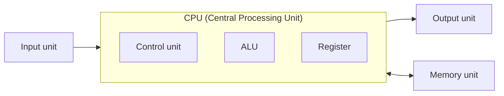

### Classification of programming languages

```text
        +-----------+
        | μp / CPU  |
        | 0's & 1's | ----o/p---->
        +-----------+
              ^
              |
  semiconductor technology device
```

```text
Transistor
 ├── PNP
 └── NPN
       |
    voltages
     ├── 0V   (low)  →  0
     └── +5V  (high) →  1
```

#### 1940's — Machine level language (MLL) / Low level language

```text
11010110
11011001
11010011
```

#### 1950's — Assembly level language (ALL)

```text
MOV AX, 5H
MOV BX, 15H
ADD AX, BX
```

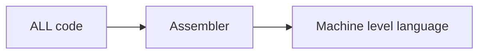

#### 1960's – present — High-level language (HLL)

`[c, c++, C#, Java ...]`

```java
int a = 10;
int b = 20;
int c = a + b;
print(c);
```

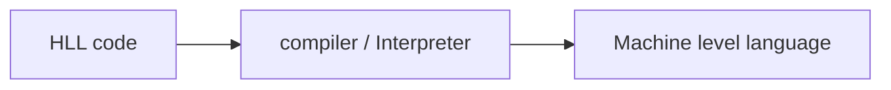

---

<!-- Source: PDF 1, Page 3 -->

17/10/22

| 1940's — MLL | 1950's — ALL | 1960's — HLL |
| :--- | :--- | :--- |
| Binary Sequence | Mnemonics | Symbols & english-like statements |
| 11010101 → OPCODE | ADD | + |
| 101101101 | SUB | - |
| 11001010 | MUL | * |
| 10111010 | DIV | / |
| | MOV | = |
| | JMP | int |
| | | float |

### Client / Server via DNS

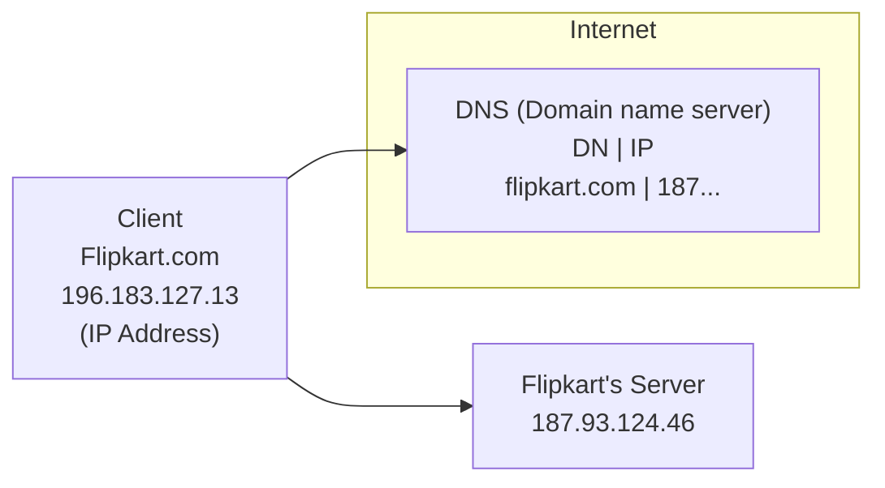

- An **assembler** is a system software which takes ALL program as input and converts it into MLL code.
- A **compiler** or an **interpreter** is a system software which takes HLL program code as input and converts it into MLL code.

### Programming Paradigm:-

1) unstructured / non-structured programming — single block (function).
2) structured / procedure-oriented programming (POP) — multiple block (functions).
3) object-oriented programming (OOP) — classes & objects.

---

<!-- Source: PDF 1, Page 4 -->

### Popular HLL (1960's)

**BCPL** (Basic Combined Programming Language)

```text
  +--------+         +--------+
  | BCPL   |  ---->  |   B    |
  | ████90%|         | █ 20%  |
  +--------+         +--------+
```

### 1972

**C** — Dennis Ritchie in Bell labs, USA.

- Structured / POP.

```text
+----------------------------------+     unstructured
| large & complex task             |     eg: FORTRAN
|  { }   { }   { }   { }           |
|   |     |     |     |            |     void main()
|   v     v     v     v            |     {
| function / routine /             |         ...
| module / procedure / method      |     }
+----------------------------------+     1000 lines of code
                                           small & simple task

-> Data ↓
-> function ↑
* Extremely fast
```

### 1979

**Bjarne Stroustrup**
Bell lab, USA

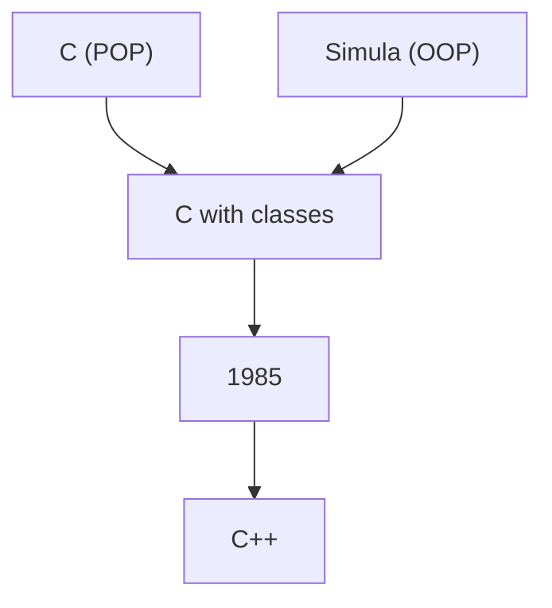

### (OOP)

```text
+----------------------------------+
|  (sub-task)  (sub-task)          |
|  (sub-task)  (Data x) (sub-task) |
+----------------------------------+
              |
              v
      Objects (encapsulation)

-> Data ↑ (abstraction)
-> functions ↓
```

---

<!-- Source: PDF 1, Page 5 -->

### 1991 — Java origins

**James Gosling** — "Green team" (11 members)

1990s — Internet, **Sun Microsystem**, California, USA [Silicon valley]

1. Platform independent
2. OOP
3. Freely available
4. Open source

**Naming evolution:**

```text
C++ → C++++ → Oak → Green → Silk → Java ☕
```

**2010:** IBM ✗ → **Oracle corporate** ✓ → closed source

### Components of a program

- Data
- Functions

### Open source vs Closed source

```text
Open Source (Java)              Closed Source (Java Oracle)
  people contribute               outside contribution blocked ✗
  features into the circle        (Oracle-controlled circle)
```

### Software

```text
Software
 ├── System Software
 │     Interface b/w app s/w & system.
 │     maintains the system resources & gives the path to AS to run.
 │     with SS, the system cannot run.  [Eg: OS, compiler etc]
 │     general purpose s/w
 └── Application Software (AS)
       s/w that runs as per user request.
       runs on the platform which is provided by SS.
       [Eg: Instagram, whatsapp etc]  Java, Python
       specific purpose s/w
```

Netscape browser — 1990s

18/10/22

### Versions of Java

- β-version — 1995
- Java 1.0 — 1996
- Java 1.1 — 1997
- Java 1.2 — 1998  
  *(~1-year interval)*
- Java 1.3 — 2000
- Java 1.4 — 2002
- Java 5 — 2004
- Java 6 — 2006  
  *(~2-year interval)*
- Oracle corp. — 2010 (acquisition)
- Java 7 — 2011
- Java 8 — 2014  
  *(~3-year interval)*
- Java 9 — Sept, 2017
- Java 10 — Mar, 2018
- Java 11 — Sept, 2018
- Java 12 — Mar, 2019
- Java 13 — Sept, 2019
- Java 14 — Mar, 2020  
  *(~6-month release cycle)*

---

<!-- Source: PDF 1, Page 6 -->

- Java 15 — Sept, 2020
- Java 16 — Mar, 2021
- Java 17 — Sept, 2021
- Java 18 — Mar, 2022
- Java 19 — Sept, 2022  
  *(6 months)*

## Memory Organization of a Computer :-

```text
 Input Device ---->  +---------------------------+  <----> Cache memory
                     | μP / CPU (i8 or i9)        |         8MB - 32MB (SRAM)
                     |  Registers | Data          |         Semi-conductor device
                     | Semi-conductor technology  |
                     | device                     |
                     +-------------+-------------+
                                   | BUS
                                   v
                     +---------------------------+     electricity →
                     | RAM / Main / Primary      |     Operating system [OS]
                     | memory (DRAM)             |
                     | 1960s  IBM [1966]         |
                     | Byte [Data]               |
                     | Adv: Fast, compact,       |
                     |      noise free           |
                     | Dis: Volatile, Expensive, |
                     |      Less storage [GB]    |
                     | Semi-conductor technology |
                     | device                    |
                     +-------------+-------------+
                                   | BUS
                          Loading ↑ | ↓ saving
                                   v
                     +---------------------------+
                     | Hard Disk Drive (HDD) /   |  ← Internet (Data)
                     | Secondary memory          |
                     | 1950s  IBM [1956]         |
                     | File [Data]               |
                     | Partition                 |
                     | Adv: non-volatile,        |
                     |      Less expensive,      |
                     |      more storage [TB]    |
                     | Disad: slow, Bulky, noisy |
                     | Electro-Mechanical        |
                     | technology device         |
                     | [Electricity-magnetism]   |
                     +---------------------------+

 SSD [Solid-state drive] (Semiconductor) [flash memory]     Drivers

                     ----> Output Device (O/P device)
```

---

<!-- Source: PDF 1, Page 7 -->

20/10/22

### some of the popular app developed using Java.

* Spotify [music streaming app]
* Twitter [social media app]
* Opera mini [web browser]
* Cash App [mobile payment service]
* Facebook
* Instagram
* WhatsApp
* Signal
* Netflix
* Amazon
* Uber. etc

### Speed / cost vs storage capacity

```text
Speed / cost  ---------------------->

Register [CPU]  >>  cache memory  >>  RAM  >>  HDD

<----------------------  storage capacity
```

* We have 2 types of memory device within a computer because we have 6 expectations from the memory unit. They are,

1. Extremely fast in execution
2. non-volatile
3. Inexpensive
4. more storage capacity
5. compact in size
6. Less noisy

There is not a single memory device that can satisfy all the 6 expectation of a computer memory. Hence, we have 2 memory device in a computer, namely

- **Primary memory** also known as RAM @ main memory.
- **Secondary memory** also known as HDD [Hard Disk Drive]

---

<!-- Source: PDF 1, Page 8 -->

* **File** is a storage location on the **HDD** where data can be stored.
* **Byte** is a storage location on the **RAM** where data can be stored.
* **Register** is a storage location within the **processor** where data can be stored.
* **Loading** is the process of taking a copy of the data from the **hard disk** and placing it onto the **RAM**. The purpose of loading is to process the data i.e. to use / run / execute any program [Applications].
* **Saving** is the process of taking a copy of the data from the **RAM** & placing it onto the **HDD**. The purpose of saving is to store the data permanently.
* A **RAM** is a collection of bytes

### 8GB RAM

```text
+------------------------------------------+
| 8GB RAM                                  |
|  [0] [1] [2] [3]   ← Address / reference |
|  [4] [5] [6] [7]                         |
|  [8] ...                                 |
|                                          |
|     286756721                            |
|        [45]  ← Data                      |
|                                          |
|                   [7,999,999,999]        |
+------------------------------------------+
```

```text
RAM
 ├── DRAM (main memory)  → [capacitors & few transistors]
 └── SRAM (cache memory) → [transistors]
```

**VLSI**

8 GB  
8 Giga bytes  
8 × 10⁹ bytes = 8000000000 bytes  
1 byte = 8 bits

```text
+---+---+---+---+---+---+---+---+
| 0 | 1 |   |   |   |   |   |   |   ← 1 byte
+---+---+---+---+---+---+---+---+
  |           |
  v           v
 bit        1 nibble
[Binary     ↓
 digit]     4-bits
```

---

<!-- Source: PDF 1, Page 9 -->

## Object file v/s executable file.

**Inbuild functions.**

- `printf();`
- `scanf();`
- `getch();`
- `clrscr();` etc

```text
 scanf();   /≡\
             5

 printf();  /≡\
```

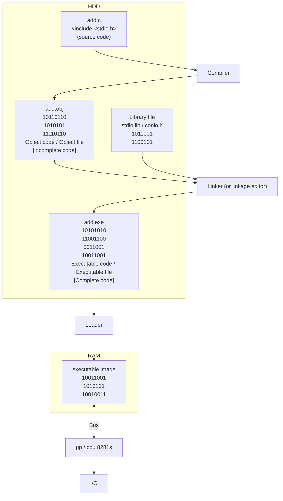

---

<!-- Source: PDF 1, Page 10 -->

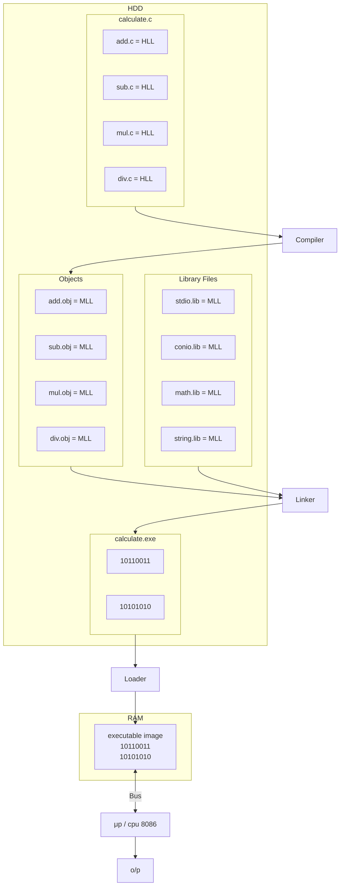

---

<!-- Source: PDF 1, Page 11 -->

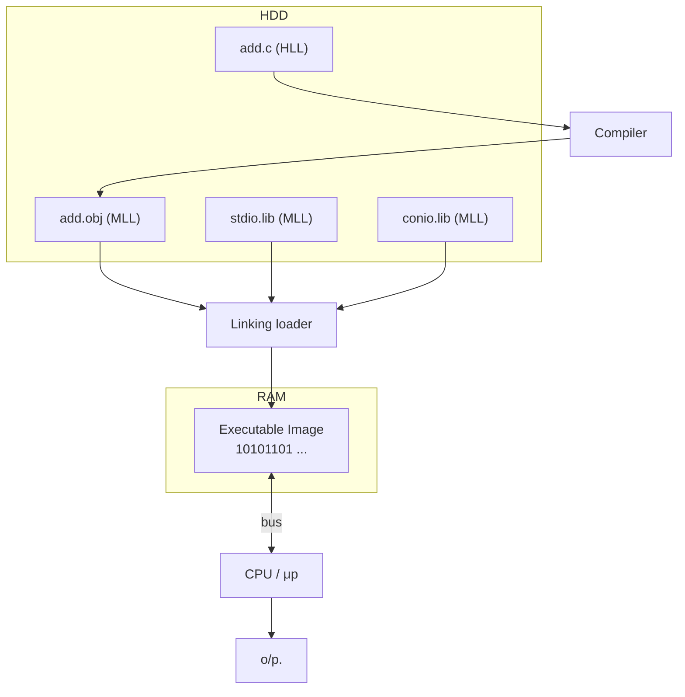

### Object file vs. Executable file

| Object file | Executable file |
| :--- | :--- |
| [IMP] It is an incomplete file | It is a complete file. |
| The code from library file is not included. | The code from library file is included. |
| It is the o/p of compiler | It is the o/p of linker. |
| It occupies less space on HDD | It occupies more space on HDD. |
| It cannot be executed | It can be executed. |

### NOTE: Library files (.lib) vs. header file (.h)

**Library files (.lib)** — Contains the **function definition** in MLL.

```c
int add(int a, int b)
{
    return a+b;
}
/* (MLL) */
```

**⇒ header file (.h)** — Contains the **Function prototype**.

```c
int add(int, int);
```

```c
#include<stdio.h>
void main()
{
    int res = add(10, 20); // function call
    printf("%d", res);
}
```

---

<!-- Source: PDF 1, Page 12 -->

21/10/22

## Measurement units of memory.

- 1 bit = Binary digit
- 4 bits = nibble
- 8 bits = 1 byte
- 1024 byte = 1 KB [Kilo Byte]
- 1024 KB = 1 MB [Mega Byte]
- 1024 MB = 1 GB [Giga Byte]
- 1024 GB = 1 TB [Tera Byte]
- 1024 TB = 1 PB [Peta Byte]
- 1024 PB = 1 EB [Exa Byte]
- 1024 EB = 1 ZB [Zetta Byte]
- 1024 ZB = 1 YB [Yotta Byte]
- 1024 YB = 1 Bronto Byte
- 1024 Brontobyte = 1 Geop Byte

## Compiler v/s Interpreter

### compilation

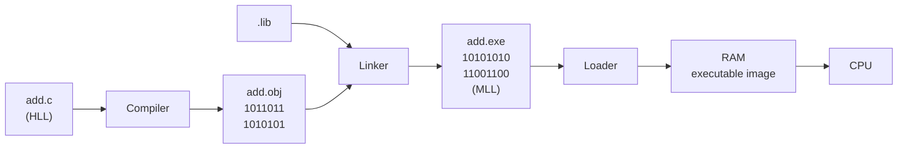

- C, C++, etc are purely compiled language.

### Interpretation

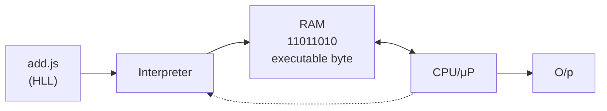

- JS, Ruby, Perl, PHP etc are purely interpreted languages.

---

<!-- Source: PDF 1, Page 13 -->

### Compilation :-

It is the process of converting HLL code into MLL code using compiler as the software.  
During compilation process, the entire HLL code is converted into MLL code in one go.

### Interpretation :-

It is the process of converting HLL code into MLL code using interpreter as a software.  
During interpretation process, each HLL instruction is converted into MLL code instruction-by-instruction.

| compiler | Interpreter |
| :--- | :--- |
| Entire HLL code is converted into MLL code in one shot. | HLL code is converted into MLL code instruction by instruction, one at a time. |
| The process of execution is faster | The process of execution is slower. |
| Debugging is difficult. | Debugging is easy. |
| Intermediate code will be generated. | Intermediate code will not be generated. |
| source file is not needed for multiple execution | Source file is required for every execution. |
| MLL code will be stored on the HDD. | MLL code will not be stored on the HDD. Rather, it will be directly loaded on to the RAM. |
| Eg of pure compiled languages — C, C++, C#, etc | Eg. of pure interpreted languages — JS, PHP, Perl, Ruby, etc |

**NOTE :-** Java is a hybrid programming language as it is both compiled & interpreted.

---

<!-- Source: PDF 1, Page 14 -->

### H/W Eng:-

**Platform** → H/W + S/W

`[ μP + OS ]`

**Eg:-**

- Intel i9 + windows 10
- AMD Ryzen 9 + Linux
- IBM Power 10 + Macintosh OS

### S/W Eng:-

**Platform** → S/W → OS

`[ OS ]`

**Eg:** Windows 10, Linux, Macintosh OS

### Platform Dependency

```text
whatsapp (c) / Windows
 ├── ✗ Linux
 ├── ✗ MacOS
 └── ✓ Windows
```

### Platform Independent

```text
whatsapp (Java) / Windows
 ├── ✓ MacOS
 ├── ✓ Linux
 └── ✓ Windows
```

## Failure of C language :-

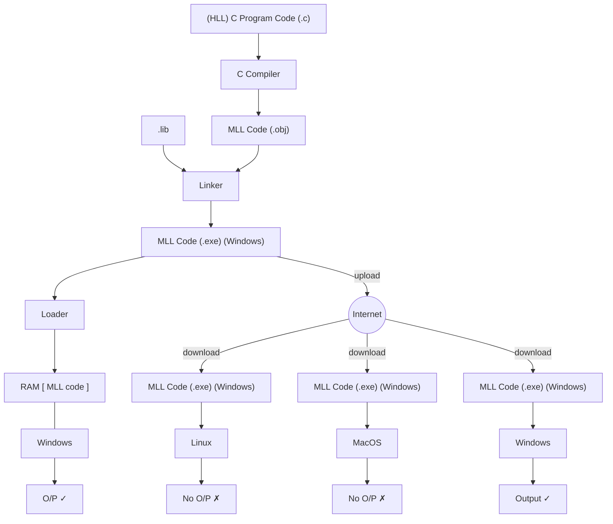

---

<!-- Source: PDF 1, Page 15 -->

24/10/22

## Success of Java.

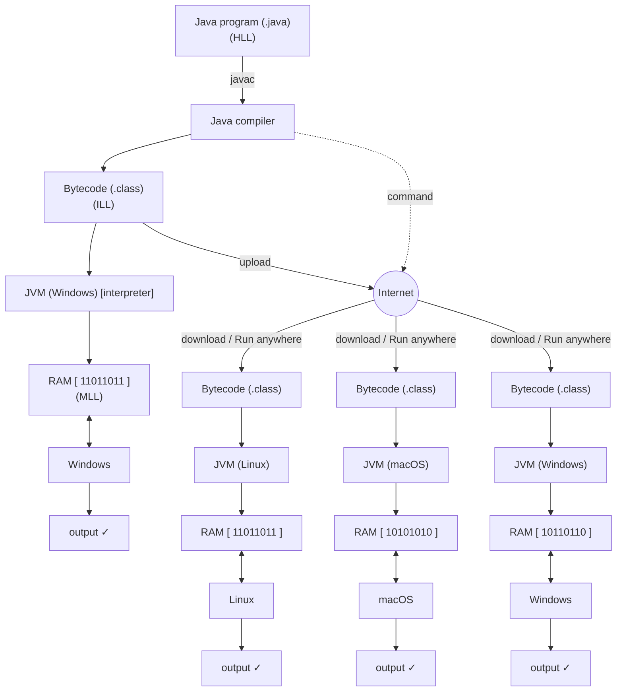

1). Secure code ~~(Hacker)~~  
2) Platform independent

---

<!-- Source: PDF 1, Page 16 -->

* Java is a platform independent programming language. when a HLL Java program is compiled using the Java compiler, the Java compiler could convert the HLL code into bytecode. This bytecode is the intermediate level code which is neither in HLL nor in MLL, they are **inbetween both**.

* Bytecode is the '**secure code**' & it is '**platform independent**'. Hence, it is best suited to be transported over the internet.

* ^(coded using C) **JVM** [Java Virtual Machine] is used to convert the bytecode into MLL code. JVM is a '**platform dependent**' software. Hence, we can not have a single JVM for **all OS**.

27/10/22

## Object - Orientation.

Object Orientation refers to the perspective of looking at this real world has a **collection of objects**.

### Orientation

* Point of view
* Perspective [the way of looking at something].

```text
      Saint         Optimist
        o          (half-filled)
       /|\             o
       / \            /|\
        |             / \
     [ Maya ]          |
                _______|_______
               |               |
   Chemist     |   (Liquid)    |     Pessimist
      o        |~~~~~~~~~~~~~~~|    (half-empty)
     /|\       |_______________|         o
     / \       |               |        /|\
      |        |    (Empty)    |        / \
    [ H2O ]    |_______________|         |
                       |
                       v
                   (alcohol?)
                       |
                       o
                      /|\
                      / \
                    Drunkard
```

---

<!-- Source: PDF 1, Page 17 -->

### Real world perspectives

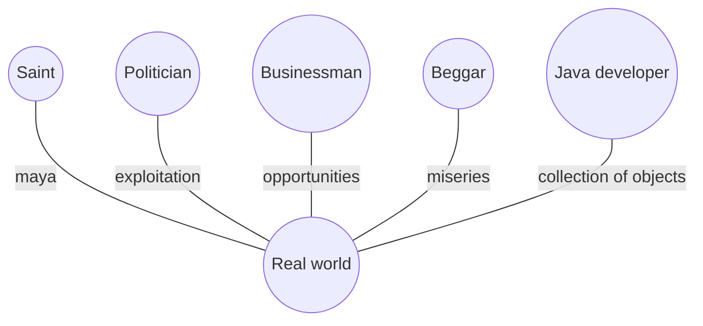

## Principles of object-orientation:

1. The world is a collection of objects.
2. Every object in the world is a useful object. No object is a useless object.
3. Every object is in constant interaction with other objects. No object is in isolation.
4. Every object belongs to a type. The type is technically called as a **class**. class does not exist in reality, only the objects exist in reality.
5. Every object has 2 parts, namely
    * **Has-part**: It refers to the state @ properties of an object. It is handled using fields **[variables]**.
    * **Does-part**: It refers to the behaviors or activities of an object. It is handled using methods **[functions]**.

### Eg:

#### 1. Student Object

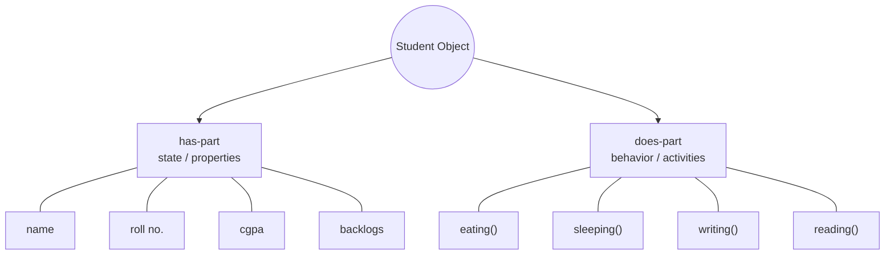

*(Fields) (Methods)*

#### 2. Dog Object

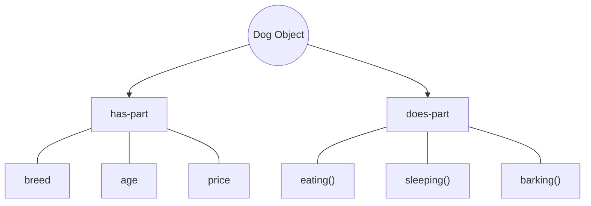

---

<!-- Source: PDF 1, Page 18 -->

### Syntax for fields (variables)

```java
data_type variable_name;   // ② data_type    ① variable_name
```

eg:- `int roll_no;`

### Syntax for methods (functions)

```java
return_type method_name (parameters)   // ④ return_type (output)
{                                      // ① method_name
                                       // ② parameters (input) * optional
    // body of the method              // ③ (behavior / activity)
}
```

eg:-

```java
void eating()
{
    // activity
}
```

### Printing output :

- C — `printf("Hello, world!");`
- C++ — `cout << "Hello, world!";`
- C# — `Console.WriteLine("Hello, world!");`
- JavaScript — `console.log("Hello, world!");`
- Python — `print("Hello, world!")`
- Java —
  - `System.out.println("Hello, world!");`
  - `System.out.print("Hello, world!");`
  - `System.out.printf("Hello, world!");`

### Reading Input :

- C — `scanf("%d", &a);`
- C++ — `cin >> a;`
- C# — `a = Console.ReadLine();`
- JavaScript — `a = prompt();`
- Python — `a = input();`
- Java —
  - `Scanner scan = new Scanner(System.in);`
  - `a = scan.next();`

---

<!-- Source: PDF 1, Page 19 -->

28/10/22

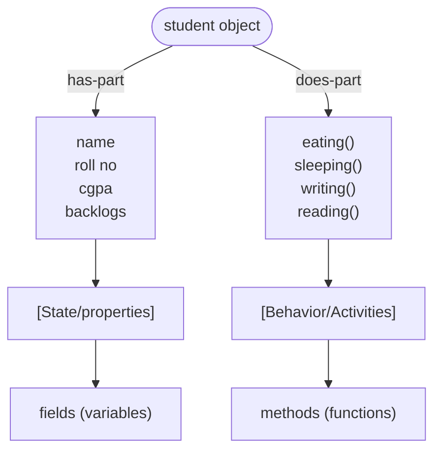

```java
class student
{
    String name;
    int roll_no;
    float cgpa;
    boolean backlogs;
    // ← has-part

    void eating()
    {
        System.out.println("student is eating...");
    }

    void sleeping()
    {
        System.out.println("student is sleeping...");
    }

    void writing()
    {
        System.out.println("student is writing...");
    }

    void reading()
    {
        System.out.println("student is reading...");
    }
    // ← does-part
}
```

### Analogy: Blueprint → Object

```text
+------------------+           mason          _|_
| Blueprint of a   |             o           /   \
| house            |    --->    /|\   --->  |  _  |
+------------------+            / \         |_|_|_|
                                         (Real-life house)
```

---

<!-- Source: PDF 1, Page 20 -->

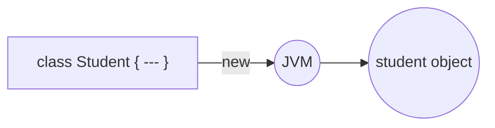

```java
// object creation
Student s1 = new Student();
s1.writing();
s1.writing();

Student s2 = new Student();
s2.eating();
```

```text
  s1 ──reference handle──> (Student)
  s2 ────────────────────> (Student)
```

- A **class** is a blueprint of an object.
- An **object** is a real life entity.

### Fan Object

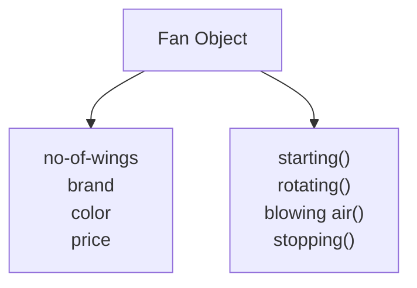

| f₁ | f₂ | f₃ |
| :--- | :--- | :--- |
| starting() | starting() | starting() |
| stopping() | rotating() | rotating() |
| | | blowing air() |
| | | stopping() |

```java
class Fan
{
    int no_of_wings;
    string brand;
    string color;
    float price;
```

---

<!-- Source: PDF 1, Page 21 -->

```java
    void starting()
    {
        System.out.println(" Fan is starting ");
    }
    void rotating()
    {
        System.out.println(" Fan is rotating");
    }
    void blowingAir()
    {
        System.out.println(" Fan is blowing the air");
    }
    void stopping()
    {
        System.out.println(" Fan is stopping ");
    }
}
```

```java
fan f1 = new fan();   // annotation: Fan (PascalCase)
f1.starting();
f1.stoping();

fan f2 = new fan();
f2.starting();
f2.rotating();

fan f3 = new fan();
f3.starting();
f3.rotating();
f3.blowingAir();
f3.stopping();
```

* Java is a **case-sensitive** programming language.

### Naming Convention:-

1. **PascalCase** convention
2. **camelCase** convention
3. **kebab-case** convention
4. **snake_case** convention

---

<!-- Source: PDF 1, Page 22 -->

31/10/22

## Naming Convention in Java.

1. **className** → **PascalCase** convention
    - Eg: `Fan` — Noun
    - Eg: `ElectricFan`
2. **variableName** → **camelCase** convention
    - Eg: `noOfWings` — Noun
    - Eg: `priceOfTheFan`
3. **methodName** → **camelCase** convention
    - Eg: `blowingAir()` — verb [Action] (...ing)
    - Eg: `blowingColdAir()`
4. **InterfaceName** → **PascalCase** convention
    - Eg: `Runnable` — Adjective (...able)

## Input-Output in Java [Streams]

*[Streams]* = collection of data in a sequence

```text
          Monitor
         ↑       ↑
   System.out  System.err
     (stream)   (stream)
         ↑       ↑
    +------------------+
    |  Java Program    |
    |  Scanner (scan)  | ← System.in (stream) ← Keyboard
    |  inbuilt class   |
    +------------------+
```

```text
+---------------------------+
| java     (folder/package) |
|  +----------------------+ |
|  | util (folder/package)| |
|  |  +-----------------+ | |
|  |  | class Scanner   | | |
|  |  |  nextInt()      | | |
|  |  |  nextFloat()    | | |
|  |  |  nextDouble()   | | |
|  |  |  nextBoolean()  | | |
|  |  |  next()         | | |
|  |  |  nextLine()     | | |
|  |  +-----------------+ | |
|  +----------------------+ |
+---------------------------+
```

**To display output messages:**

```java
System.out.println("Hello, World!");
```

**To display error messages:**

```java
System.err.println("Invalid Input!");
```

### Input:

```java
import java.util.Scanner;

Scanner scan = new Scanner(System.in);
int num = scan.nextInt();
```

---

<!-- Source: PDF 1, Page 23 -->

## Guesser game Application in Java

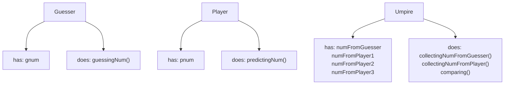

### Java program for Guesser Game Application

```java
class Guesser
{
    int gnum;
    int guessingNum()
    {
        System.out.println("Guesser, kindly guess a number!");
        Scanner scan = new Scanner(System.in);
        gnum = scan.nextInt();
        return gnum;
    }
}

class Player
{
    int pnum;
    int predictingNum()
    {
        System.out.println("Player, kindly predict a number!");
        Scanner scan = new Scanner(System.in);
        pnum = scan.nextInt();
        return pnum;
    }
}
```

---

<!-- Source: PDF 1, Page 24 -->

```java
class Umpire
{
    int numFromGuesser;
    int numFromPlayer1;
    int numFromPlayer2;
    int numFromPlayer3;

    void collectingNumFromGuesser()
    {
        Guesser g = new Guesser();
        numFromGuesser = g.guessingNum();
    }

    void collectingNumFromPlayers()
    {
        Player p1 = new Player();
        Player p2 = new Player();
        Player p3 = new Player();

        numFromPlayer1 = p1.predictingNum();
        numFromPlayer2 = p2.predictingNum();
        numFromPlayer3 = p3.predictingNum();
    }

    void comparing()
    {
        if (numFromPlayer1 == numFromGuesser)
        {
            System.out.println("Player1 has won the game!");
        }
        else if (numFromPlayer2 == numFromGuesser)
        {
            System.out.println("Player2 has won the game!");
        }
        else if (numFromPlayer3 == numFromGuesser)
        {
            System.out.println("Player3 has won the game!");
        }
        else
        {
            System.out.println("Game lost, Try again!");
        }
    }
}
```

---

<!-- Source: PDF 1, Page 25 -->

```java
class GuesserGameApp
{
    public static void main(String[] args)
    {
        // JVM
        Umpire u = new Umpire();
        u.collectingNumFromGuesser();
        u.collectingNumFromPlayer();
        u.comparing();
    }
}
```

**O/p:**

```text
Guesser, kindly guess a number!
5
Player, kindly predict a number!
2
Player, kindly predict a number!
3
Player, kindly predict a number!
5
Player3 has won the game!
```

### Object memory diagram

```text
        Umpire object (u)
   +---------------------------+
   | numFromGuesser  [ 5 ]     |
   | numFromPlayer1  [ 2 ]     |
   | numFromPlayer2  [ 3 ]     |
   | numFromPlayer3  [ 5 ]     |
   +---------------------------+

   Guesser (g)          Player p1        Player p2        Player p3
   +-----------+        +---------+      +---------+      +---------+
   | gnum [5]  |        | pnum[2] |      | pnum[3] |      | pnum[5] |
   +-----------+        +---------+      +---------+      +---------+
```


---

<!-- Source: PDF 1, Page 26 -->

## 📌 Main method in Java

**Date:** 2/11/22

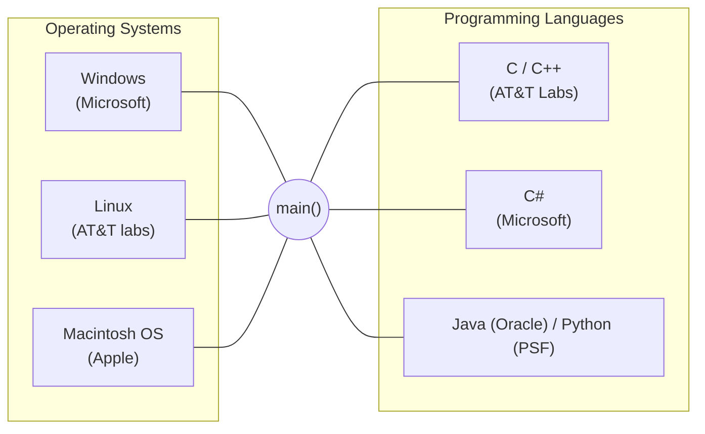

The most important software in a computer is the operating system (OS). As the name suggests it makes the system operational.

For any OS to handover the control of execution to a program written in any programming language, **main function** must be present.

Every method / function must have the following 4 components:

1. Name
2. Input
3. Activity
4. Output

```text
  output name (input)          return-type name (parameter)
  {                      <==>  {
    Activity / task              // body of the method
  }                            }
```

### C program:

```c
#include <stdio.h>
int main()
{
  printf("Welcome to GQT");
  return 0;
}
```

```text
OS  -.->  int main()
```

**O/P:** welcome to GQT

---

<!-- Source: PDF 1, Page 27 -->

### Java Program:

```java
import java.lang.*;  // optional
class Launch
{
    public static void main(String[] args)
    {
        System.out.println("Welcome to GQR");
    }
}
```

```mermaid
flowchart LR
    subgraph create["Object creation (optional path)"]
        L["Launch l = new Launch();"]
        OBJ(("Launch object"))
        L --> OBJ
        OBJ -.->|"l.main()"| MAIN
    end

    subgraph runtime["OS / JVM path"]
        OS["OS"]
        JVM["JVM"]
        OS --- JVM
        JVM -->|"control + data"| CALL["Launch.main();"]
    end

    MAIN["public static void main(...)"]
```

**o/p:**

```text
Welcome to GQR
```

```mermaid
flowchart TD
    subgraph java["java"]
        subgraph util["util"]
            Scanner["Scanner"]
        end
        subgraph lang["lang"]
            System["System"]
            String["String"]
        end
    end
    Default["default packages"] --> lang
```

### NOTE:

- **main() method** is the **entry point** / **starting point** of execution within a **program**.
- **main() method** should be declared as **public** so that it becomes **visible** to the **OS [JVM]**.
- **main() method** should be declared as **static** so that it becomes **accessible** to the **OS** without **creating** an object of the **enclosing class**.
  - [to access the class (/ to use), we create the object]
- **void** is the **return type** of the main() method & it can not be changed. In other words, main method can not **return** a value.
- **main** is the **name** of the method to which **control** of execution will be handed over to.
- **`String[] args`** is the **mandatory parameter** of the main() method which is used to **collect** **Command Line Argument**.

Hence, the standard signature of main() method is,

```java
public static void main(String[] args)
```

---

<!-- Source: PDF 1, Page 28 -->

**Date:** 03/11/22

```text
┌─────────────────────────────────────┐
│ F:\OCTBATCH\Launch.java             │  ← Source File
│                                     │
│ class Launch {                      │
│   public static void main(String[] args) { │
│     System.out.println("Welcome to EAT!"); │
│   }                                 │
│ }                                   │
└─────────────────────────────────────┘
              │
              │ javac
              ▼
        ┌───────────────┐
        │ Java Compiler │
        └───────────────┘
              │
              ▼
┌─────────────────────────────────────┐
│ F:\OCTBATCH\Launch.class            │  ← Java class file
│ Byte code (IL)                      │
└─────────────────────────────────────┘
              │
              │ java
              ▼
┌─────────────────────────────────────┐
│ JVM [Interpreter]                   │
└─────────────────────────────────────┘
              │
              ▼
┌─────────────────────────────────────┐
│ RAM: 10110011                       │  <=>  ┌─────────┐
└─────────────────────────────────────┘       │ µP      │ ← I/P
                                              │         │ → O/P
                                              └─────────┘
```

```text
┌─ Command Prompt ────────────────────┐
│ F:\OCTBATCH\> javac Launch.java     │
│ F:\OCTBATCH\> java Launch           │
│ Welcome to EAT!                     │
│ F:\OCTBATCH\>                       │
└─────────────────────────────────────┘
         │
         │ control of execution
         ▼
      (source / main)
```

---

<!-- Source: PDF 1, Page 29 -->

## 📌 Program 1: Command Line Arguments in Java

*(control of execution + data)*

```text
┌─ Command Prompt. ──────────────────────────────┐
│ F:/OCTBATCH/> javac Launch.java                │
│ F:/OCTBATCH/> java Launch Sachin Ramesh Tendulkar │
│                      └──────── Data / command ─┘ │
│                            line arguments        │
│ Welcome to GQT!                                │
│ Sachin                                         │
│ Ramesh                                         │
│ Tendulkar                                      │
│ F:/OCTBATCH/>                                   │
└────────────────────────────────────────────────┘
```

```java
// Launch.java
class Launch
{
    public static void main(String[] args)
    {
        System.out.println("Welcome to GQT!");
        System.out.println(args[0]);
        System.out.println(args[1]);
        System.out.println(args[2]);
    }
}
```

`String[] args` — args is an array of strings

```text
args →  |   0    |   1    |    2     |
        | Sachin | Ramesh | Tendulkar|
```

```text
Data
  │
  ▼
arguments

i/p → method
         │
         ▼
      parameter
```

- Command line arguments are the data sent from the command prompt to the Java program at the time of execution.
- In the Java program, main() method receives the command line argument using the `String[] args` parameter.

---

<!-- Source: PDF 1, Page 30 -->

**Date:** 04/11/22

args is an array of strings which is used to collect command line argument.

```java
// launch.java
class Launch
{
    public static void main(String[] args)
    {
        System.out.println("welcome to GQT!");
        System.out.print(args[0]);
        System.out.print(args[1]);
        System.out.print(args[2]);
        // (OR) System.out.print(args[0] + " " + args[1] + " " + args[2]);
        // "sachin" + " " + "Ramesh" + " " + "Tendulkar"
        // "sachin Ramesh Tendulkar"
    }
}
```

```text
args →  |   0    |   1    |    2     |
        | sachin | Ramesh | Tendulkar|
```

### Program 2:

```text
F:/OCTBATCH/> javac launch.java
F:/OCTBATCH/> java Launch sachin Ramesh Tendulkar
Welcome to GQT!
sachin Ramesh Tendulkar
F:/OCTBATCH/>
```

```mermaid
flowchart TD
    SO["System.out"] --> PL[println()]
    SO --> P[print()]
    SO --> PF[printf()]
```

---

<!-- Source: PDF 1, Page 31 -->

### Different ways of printing command line arguments

**command line execution:**

```text
java Launch Sachin Ramesh Tendulkar
```

**1.**

```java
System.out.println(args[0]);
System.out.println(args[1]);
System.out.println(args[2]);
```

**output:**

```text
Sachin
Ramesh
Tendulkar
```

**2.**

```java
System.out.println(args[0] + args[1] + args[2]);
```

**output:** `SachinRameshTendulkar`

**3.**

```java
System.out.print(args[0]);
System.out.print(args[1]);
System.out.print(args[2]);
```

**output:** `SachinRameshTendulkar`

**4.**

```java
System.out.print(args[0] + args[1] + args[2]);
```

**output:** `SachinRameshTendulkar`

**5.**

```java
System.out.print(args[0] + " " + args[1] + " " + args[2]);
```

**output:** `Sachin Ramesh Tendulkar`

**6.**

```java
System.out.print(args[2] + " @ " + args[0] + " $ " + args[0]);
```

**output:** `Tendulkar @ Sachin $ Sachin`

**7.**

```java
System.out.println("args[0]");
```

**output:** `args[0]`

---

<!-- Source: PDF 1, Page 32 -->

**8.**

```java
System.out.println(args);
```

**output:** `[java.lang.String @ 60d4e`

**9.** **Date:** 05/11/22

```java
System.out.println("args");
```

**output:** `args`

**10.**

```java
System.out.println(args.length);
```

**output:** `3`

### Determining the number of command line arguments received.

**1)** `java Launch` ↵

```java
System.out.print(args.length);
```

**o/p:** `0`

```text
          1000
  args   +-------------------+
 +----+  |                   |
 |1000|->|  length [ 0 ]     |
 +----+  |                   |
         +-------------------+
```

**2)** `java Launch sachin` ↵

```java
System.out.print(args.length);
```

**o/p:** `1`

```text
          2000
  args   +-----------------------+
 +----+  |         0             |
 |2000|->|    +----------+       |
 +----+  |    |  sachin  |       |
         |    +----------+       |
         |  length [ 1 ]         |
         +-----------------------+
```

**3)** `java Launch sachin Ramesh Tendulkar` ↵

```java
System.out.print(args.length);
```

**o/p:** `3`

```text
          3000
  args   +-------------------------------------------+
 +----+  |         0            1            2       |
 |3000|->|    +----------+-----------+-------------+ |
 +----+  |    |  sachin  |  Ramesh   |  Tendulkar  | |
         |    +----------+-----------+-------------+ |
         |  length [ 3 ]                             |
         +-------------------------------------------+
```

---

<!-- Source: PDF 1, Page 33 -->

**4.** `java Launch Virat Kohli Sharma Anushka Padukone Rai`

```java
System.out.print(args.length);
```

**o/p:** `6`

1. Number of args: Infinite
2. System Dependent
3. Memory Dependent
4. Depends on the size of RAM
5. Depends on the size of Heap

```text
┌─ System ──────────────────────────────────────────────┐
│ ┌─ RAM ─────────────────────────────────────────────┐ │
│ │ ┌─ Heap ────────────────────────────────────────┐ │ │
│ │ │                                               │ │ │
│ │ │  args   4000                                  │ │ │
│ │ │ +----+                                        │ │ │
│ │ │ |4000|──► | 0     | 1     | 2      | 3       | │ │ │
│ │ │ +----+    | Virat | Kohli | Sharma | Anushka | │ │ │
│ │ │           | 4        | 5   |                   │ │ │
│ │ │           | Padukone | Rai |                   │ │ │
│ │ │           length [ 6 ]                         │ │ │
│ │ └───────────────────────────────────────────────┘ │ │
│ └───────────────────────────────────────────────────┘ │
└───────────────────────────────────────────────────────┘
```

- Infinite number of command line argument can be sent to the main() method.
- If no arguments are sent then the size of the args array is **'zero'**.

**Q:** If no command line arguments are sent then is the `String[] args` parameter of main() method optional or mandatory?

**Ans:** The `String[] args` parameter of main() method is a **mandatory** parameter of main() method even if no command line arguments are passed.

---

<!-- Source: PDF 1, Page 34 -->

```text
user1:  java Launch
        Welcome to GQT!

user2:  java Launch Sachin Ramesh
        Welcome to GQT!
              │ control + data
              ▼
```

```java
// Launch.java
class Launch
{
    public static void main(String[] args)
    {
        System.out.println("Welcome to GQT!");
    }
}
```

```text
javac Launch.java  →  Launch.class (Byte codes)
```

> **Note:** If `String[] args` parameter is omitted then during execution the following error is generated. **Error: main method not found.**

JVM will hand over the control of execution only to such a main() method whose signature is:

```java
public static void main(String[] args)
```

**Q:** What happens if the program is expecting command line argument but no command line arguments are sent to it?

**Ans:** An exception called as `ArrayIndexOutOfBoundsException`.

```text
java Launch
Exception: ArrayIndexOutOfBoundsException : 0
              ↑ Abrupt termination.
```

```java
// Launch.java
class Launch
{
    public static void main(String[] args)
    {
        System.out.print(args[0]);
        System.out.print(args[1]);
        System.out.print(args[2]);
    }
}
```

```text
  args   1000
 +----+
 |1000|──► ( array object )
 +----+      index 0 → [ X ]
             length 0
```

---

<!-- Source: PDF 1, Page 35 -->

### Example 2:-

```text
┌─ Command Prompt ──────────────────────────────┐
│ java Launch Sachin                            │
│ Sachin                                        │
│ Exception: ArrayIndexOutOfBoundsException : 1 │
└───────────────────────────────────────────────┘
         ↑ Abrupt termination
         │ (from args[1] access)
```

```java
// Launch.java
class Launch
{
    public static void main(String[] args)
    {
        System.out.print(args[0]);
        System.out.print(args[1]);
        System.out.print(args[2]);
    }
}
```

```text
  args   2000
 +----+
 |2000|──► | 0      | 1 (invalid) |
 +----+    | Sachin | [ X ]       |
           length : 1
```

- Mistakes → Compilation → Errors
- Mistakes → Execution → Exceptions

### Example 3: Passing space as command line data

```text
java Launch "Global Quest Technologies" Bangalore India
            └──────── data ────────────┘
                     delimiters = spaces
                     (= With double quote)

Global Quest Technologies
Bangalore
India
```

```java
// Launch.java
class Launch
{
    public static void main(String[] args)
    {
        System.out.println(args[0]);
        System.out.println(args[1]);
        System.out.println(args[2]);
    }
}
```

```text
args →  | 0                         | 1         | 2     |
        | Global Quest Technologies | Bangalore | India |
```

---

<!-- Source: PDF 1, Page 36 -->

*) Without double quotes:

```text
args →  |    0   |   1   |      2       |     3     |   4   |
        | Global | Quest | Technologies | Bangalore | India |
```

Any type of data can be sent as command line arguments. However, the data will be stored in the form of string type.

```text
┌─ command prompt ──────────────────────────────────────────┐
│              [------------- string ---------------]       │
│ java Launch  Sachin     T      18      22.5     true      │
│                │        │       │        │        │       │
│                ▼        ▼       ▼        ▼        ▼       │
│             string    char     int     float   boolean    │
│                                                           │
│ 1822.5                                                    │
└───────────────────────────────────────────────────────────┘
```

```java
// Launch.java
class Launch
{
    public static void main(String[] args)
    {
        System.out.println(args[2] + args[3]);
                //  "18" + "22.5"
                //  "1822.5"
    }
}
```

**memory map:**

```text
args →  |   0    | 1 |  2 |  3   |  4   |
        | Sachin | T | 18 | 22.5 | true |
```

**NOTE on `+` operator:**

- Addition: `10 + 20 = 30`
- Concatenation: `"Sachin" + "Ramesh" = "SachinRamesh"`

**Date:** 06/11/22

### Alternative syntax of main() method

1. `public static void main(String[] args)`
2. `static public void main(String[] args)`
3. `public static void main(String []args)`
4. `public static void main(String args[])`
5. `public static void main(String... args)`  // ellipse (varargs)
6. `public static void main(String[] gqt)`   // any name
7. `final synchronized strictfp public static void main(final String[] args)`

---

<!-- Source: PDF 1, Page 37 -->

## 📌 Keywords / Identifiers / operators / Literals / comments

**Legend:**

1. ① Keywords (Reserved words)
2. ② Identifiers
3. ③ operators
4. ④ Literals (constants)

```java
import /*①*/ java.util.Scanner /*②*/;
// This is a sample program
class /*①*/ Addition /*②*/ {
    // This method performs addition operation on 2 numbers
    void /*①*/ add /*②*/ () {
        Scanner /*②*/ scan /*②*/ = /*③*/ new /*①*/ Scanner /*②*/ (System /*②*/ .in /*②*/);
        System.out.println("Enter the 1st number:" /*④*/);
        int /*①*/ num1 /*②*/ = /*③*/ scan.nextInt /*②*/ ();
        System.out.println("Enter the 2nd number : " /*④*/);
        int /*①*/ num2 /*②*/ = /*③*/ scan.nextInt /*②*/ ();

        if /*①*/ (num1 /*②*/ > /*③*/ 0 /*④*/ && /*③*/ num2 /*②*/ < /*③*/ 100 /*④*/) { // condition checking
            // Indentation
            int /*①*/ res /*②*/ = /*③*/ num1 /*②*/ + /*③*/ num2 /*②*/;
            System.out.println("The result is : " /*④*/ + /*③*/ res /*②*/);
        }
        else /*①*/ {
            System.out.println("invalid input " /*④*/);
        }
    }
}

class /*①*/ Launch /*②*/ {
    // main method is needed for execution
    public /*①*/ static /*①*/ void /*①*/ main /*②*/ (String /*②*/ [] args /*②*/) {
        Addition /*②*/ a /*②*/ = /*③*/ new /*①*/ Addition /*②*/ ();
        a.add /*②*/ ();
    }
}
```

### Keyword in Java

Keywords are such special words whose meaning is already known to the compiler.
Keywords are also called as **reserved words** as they are "**reserved from use**". In other words, keywords can not be used as **identifiers**.

---

<!-- Source: PDF 1, Page 38 -->

```mermaid
flowchart TD
    RW["Reserved words (70)"]
    RW --> KW["Keywords (67)"]
    RW --> RL["Reserved Literals (3)"]
    KW --> UK["used keywords (65)"]
    KW --> UNK["unused keywords (2)"]
```

| Category | Keywords / Literals |
| :--- | :--- |
| **Data type related keywords** | `byte`, `short`, `int`, `long`, `float`, `double`, `char`, `boolean`, `void`, `var`, `enum` |
| **Control flow related keywords** | `if`, `else`, `switch`, `case`, `default`, `yield`, `for`, `while`, `do`, `break`, `continue`, `return` |
| **Modifier related keywords** | `public`, `protected`, `private`, `static`, `final`, `abstract`, `synchronized`, `transient`, `volatile`, `native` |
| **Exception handling related** | `try`, `catch`, `finally`, `throw`, `throws`, `assert` |
| **Class related keywords** | `class`, `interface`, `extends`, `implements`, `package`, `import`, `exports`, `module`, `open`, `opens`, `provides`, `requires`, `uses`, `with`, `to`, `transitive`, `sealed`, `non-sealed`, `permits`, `record` |
| **Object related keywords** | `new`, `instanceof`, `super`, `this` |
| **Special symbol keyword** | `_` (underscore) |
| **Literals related** (Reserved Literals) | `true`, `false`, `null` |
| **unused keywords** | `goto`, `const` |
| **obsolete keywords** | `strictfp` |

---

<!-- Source: PDF 1, Page 39 -->

## 📌 Variables in Java

A variable is a name given to a memory location on the RAM. It acts as a container to store the data.

> variable ↓ 'vary' + 'able'

```text
┌─ RAM (8GB) ─────────────────────────────────────┐      ┌────────┐
│ ░░░ ░░░ ░░░ ░░░                                 │ <==> │ μP     │
│                                                 │      └────────┘
│ address: 214056789                              │
│         ┌────┐                                  │
│      a →│ 55 │ → then changed to 75             │
│         └────┘                                  │
│ address: 214056790                              │
│         ┌────┐                                  │
│         │    │                                  │
│         └────┘                                  │
│              ...                                │
│ address: 7999999999                             │
└─────────────────────────────────────────────────┘
```

```java
int a = 55;
// ...
System.out.println(a); // 55
a = 75;
System.out.println(a); // 75
```

### Identifiers in Java

An identifier is a **unique** name given to a programming entity such as class name, method name, variable name etc.

```java
class Addition      // → Identifier
{
    void add()      // → Identifier
    {
        int num1 = scan.nextInt();  // num1 → Identifier
        // ...
    }
}
```

### Rules for defining identifiers

- The only permitted characters for creating an identifier are `a-z`, `A-Z`, `0-9`, `$`, `_`

  - `class Guesser@Game` → ❌
  - `void collect#Num_From()` → ❌
  - `int num-From-Guesser;` → ❌

- An identifier cannot start with a digit.

  - `int temp8;` → ✔
  - `int _temp;` → ✔
  - `int $temp;` → ✔
  - `int 1temp;` → ❌

---

<!-- Source: PDF 1, Page 40 -->

- It is not permitted to use any of the reserved words as identifiers.

  **Eg:**

  - `int if = 45;` → ❌
  - `int void = 23;` → ❌
  - `int Void = 56;` → ✔
  - `int class = 75;` → ❌
  - `int Scanner = 89;` → ✔

- Identifiers are case-sensitive.

  **Eg:**

  ```java
  int temp = 10;
  int TEMP = 20;
  System.out.println(temp); // 10
  System.out.println(TEMP); // 20
  ```

- There is no limit on the length of an identifier. It is recommended to use an optimum length 4-15 characters.

> **NOTE:** All the variable names are identifiers but not all identifiers are variable.

### Literals in Java

Literals are the constant values that appear directly in the program. The literal can be assigned to a variable.

**Eg:**

```java
int a = 10;           // 10 → Literal
int b = 20;           // 20 → Literal
System.out.println(" Hello, World ! ");  // string → Literal
```

> **NOTE:** `_` (underscore) special symbol is permitted only for numerical literals starting from **java 7**

**Eg:**

- `int fees = 25,000 ;` → ❌
- `int fees = 25_000 ;` → ✔

```text
┌─────────┐
│ fee     │
│ 25000   │
└─────────┘
```

The purpose of this special symbol in a literal is to improve the readability of the code.

### Operators in Java

Operators are used to perform operations on variables and values.

**Eg:** `int res = 10 + 20;`

```java
int a = 10;
int b = 20;
int res = a + b;
//        ^   ^  → operands
//          +    → addition operator
```

---

<!-- Source: PDF 1, Page 41 -->

Depending on the number of operands, operators are classified into 3 categories:

1. Unary operator
2. Binary operator
3. Ternary operator.

### Comments in Java

Comments are used to improve the readability of the program code by providing additional information about the code.

**Eg:-**

```java
// This class represents the guesser character
class Guesser
{
    // This field represents the number guessed by Guesser
    int gnum;
    // This method represents the behavior of the Guesser.
    int guessingNum()
    {
        // ...
    }
}
```

However, the information specified as comments will be ignored by the compiler at the time of compilation. It means, the compiled code will not have any information specified as comments.

```text
┌──────────────────────────┐     ┌─────────────────┐     ┌──────────────────────────┐
│ .java source code        │ ==> │ javac           │ ==> │ .class Byte code         │
│ [with comments]          │     │ Java compiler   │     │ [without comments]       │
│ Source file              │     └─────────────────┘     │ class file               │
└──────────────────────────┘                             └──────────────────────────┘
```

### Types of comments in Java

**1. Single-line Comment:**

```java
// This is a single-line comment.
```

**2. Multi-line comment:**

```java
/* This
   is a
   multi-line comment
*/
```

---

<!-- Source: PDF 1, Page 42 -->

**3. Documentation comment.**

```java
/**
 * This is a document
 * @author Zabi
 * @version 1.8
 */
```

→ **Javadoc**

**Date:** 07/11/22

```text
┌─ Ram ──────────┐         ┌───────────┐
│ ┌─┬─┬─┐        │  ───►   │ uP / CPU  │
│ │0│1│0│        │         │   Logic   │
│ └─┴─┴─┘        │         └───────────┘
│ ┌─┬─┬─┐        │
│ │ │ │ │        │
│ └─┴─┴─┘        │
└────────────────┘
```

### Data Types in Java

| Real world Data | Data Type in Java | Formats followed by data types |
| :--- | :--- | :--- |
| **Primitive Types** | | |
| Integer type data | `byte`, `short`, `int`, `long` | Base-2 |
| Real no type data | `float`, `double` | IEEE 754 |
| character type data | `char` | ASCII / unicode |
| Yes/no type data | `boolean` | JVM dependent |
| **Non-primitive (Inbuilt classes)** | | |
| String type data | `String` class | ASCII / unicode |
| Grouped type data | Array / collection | OS dependent |
| Date/time type data | Date-Time class | dd/mm/yy / hh:mm:ss |
| Text file type data | File-stream | .txt / .doc / .pdf / .rtf... |
| Image type data | Image classes | .jpeg / .png / .gif... |
| Video type data | Java media framework | .mp4 / .avi / .mov... |
| Audio type data | Java media framework | .mp3 / .wav / ... |

### Job Application (Java)

| Field | Type |
| :--- | :--- |
| Name | string |
| Photo | Image |
| Age | Integer |
| DOB | Date |
| Gender | character |
| Email | string |
| Mobile | Integer |
| Address | string |
| YOP | Date |
| CGPA | Real no |
| Backlog | Yes/no |
| Expected CTC | Real no |
| Interview slot | Time |
| Grade | character |
| Qualification | string |
| Resume | Document |
| Self-Intro | video |

---

<!-- Source: PDF 1, Page 43 -->

### Integer Data Type

Data types are provided in a programming language to convert real world data into the binary form so that it can be stored in the memory as well as processed by CPU.

**Roles of data types:**

1. Convert real world data into the binary form.
2. Indicate the amount of memory to be allocated on RAM.
3. Specify the type of data stored in a variable.

**General formula:** `n-bits [ -2^(n-1) to +2^(n-1)-1 ]`

| | **byte** | **short** | **int** | **long** |
| :--- | :--- | :--- | :--- | :--- |
| Default | * 0 is the default value of byte | * 0 is the default value of short | | long default value `0L` |
| Declaration | `byte a;` | `short a;` | `int a;` | `long a;` |
| Memory | 1 byte | 2 bytes | 4 bytes | 8 bytes |
| Size | 8-bits | 16-bits | 32-bits | 64-bits |
| Range formula | $-2^{8-1}$ to $+2^{8-1}-1$ → $-2^7$ to $+2^7-1$ | $-2^{16-1}$ to $+2^{16-1}-1$ → $-2^{15}$ to $+2^{15}-1$ | $-2^{32-1}$ to $+2^{32-1}-1$ → $-2^{31}$ to $+2^{31}-1$ | $-2^{64-1}$ to $+2^{64-1}-1$ → $-2^{63}$ to $+2^{63}-1$ |
| Range | -128 to +127 (underflow ← -128; overflow → +127) | -32,768 to +32,767 | -2,147,483,648 to +2,147,483,647 | -9,223,372,036,854,775,808L to +9,223,372,036,854,775,807L |
| Total Allowed values | 256 | 65536 | 4,294,967,296 | 18,446,744,073,709,551,616 |
| Eg | age of a person, year of experience, no of children | salary of a fresher, price of a mobile, max speed of a car | price of a house, dist bw countries, population of a country | mobile no, population of world, dist bw galaxies |

```text
  byte a          short a         int a           long a
 ┌───────┐       ┌───────┐       ┌───────┐       ┌───────┐
 │   a   │       │   a   │       │   a   │       │   a   │
 │1 byte │       │2 bytes│       │4 bytes│       │8 bytes│
 └───────┘       └───────┘       └───────┘       └───────┘
```

---

<!-- Source: PDF 1, Page 44 -->

**Date:** 08/11/22

We have 4 different integer data types in java because in the real world, integer data exists in different magnitudes [quantities]. Hence, to efficiently utilize the memory based on the range of value, a suitable datatype must be used.

**Q:** How integer data stored in memory?

### Eg1: `byte a = 45;`

**Base-2 conversion:**

```text
2 | 45
2 | 22 - 1
2 | 11 - 0
2 | 5  - 1
2 | 2  - 1
    1  - 0
```

$(45)_{10} = (101101)_2$

```text
      padding
  a  ┌───┬───┬───┬───┬───┬───┬───┬───┐
     │ 0 │ 0 │ 1 │ 0 │ 1 │ 1 │ 0 │ 1 │
     └───┴───┴───┴───┴───┴───┴───┴───┘
       ↑               1 byte          ↑
      MSB                             LSB
       │
     ┌─┴─┐
     0   1
     ⇓   ⇓
    +ve -ve
```

### Eg2: `short a = 12354;`

```text
2 | 12354
2 | 6177 - 0
2 | 3088 - 1
2 | 1544 - 0
2 | 772  - 0
2 | 386  - 0
2 | 193  - 0
2 | 96   - 1
2 | 48   - 0
2 | 24   - 0
2 | 12   - 0
2 | 6    - 0
2 | 3    - 0
2 | 1    - 1
        - 1
```

$(12354)_{10} = (11000001000010)_2$

```text
a ┌───┬───┬───┬───┬───┬───┬───┬───┐ ┌───┬───┬───┬───┬───┬───┬───┬───┐
  │ 0 │ 0 │ 1 │ 1 │ 0 │ 0 │ 0 │ 0 │ │ 0 │ 1 │ 0 │ 0 │ 0 │ 0 │ 1 │ 0 │
  └───┴───┴───┴───┴───┴───┴───┴───┘ └───┴───┴───┴───┴───┴───┴───┴───┘
    ↑
   MSB (+ve)                         2 byte
```

### Eg3: `short a = -12354;`

1. $(12354)_{10} = (11000001000010)_2$
2. **1's complement:** `1100111110111101`
3. **Add 1:** `+ 1`
4. **2's complement:** `1100111110111110`

```text
a ┌───┬───┬───┬───┬───┬───┬───┬───┐ ┌───┬───┬───┬───┬───┬───┬───┬───┐
  │ 1 │ 1 │ 0 │ 0 │ 1 │ 1 │ 1 │ 1 │ │ 1 │ 0 │ 1 │ 1 │ 1 │ 1 │ 1 │ 0 │
  └───┴───┴───┴───┴───┴───┴───┴───┘ └───┴───┴───┴───┴───┴───┴───┴───┘
    ↑               2 byte
   MSB (-ve)
```

---

<!-- Source: PDF 1, Page 45 -->

### Eg 4: `int a = -102768;`

```text
2 | 102768
2 | 51384 - 0
2 | 25692 - 0
2 | 12846 - 0
2 | 6423 - 0
2 | 3211 - 1
2 | 1605 - 1
2 | 802 - 1
2 | 401 - 0
2 | 200 - 1
2 | 100 - 0
2 | 50 - 0
2 | 25 - 0
2 | 12 - 1
2 | 6 - 0
2 | 3 - 0
    1 - 1
```

$(102768)_{10} = (11001000101110000)_2$

Padding to 32 bits (4 bytes):

$= (00000000000000011001000101110000)_2$

**1's complement:**

```text
11111111111111100110111010001111
+                              1
--------------------------------
11111111111111100110111010010000   ← 2's complement
```

```text
  MSB
  [-ve]
a | 1 | 1 | 1 | 1 | 1 | 1 | 1 | 1 | 1 | 1 | 1 | 1 | 1 | 1 | 1 | 0 | 0 | 1 | 1 | 0 | 1 | 1 | 1 | 0 | 1 | 0 | 0 | 1 | 0 | 0 | 0 | 0 |
  <----------------------------------------------- 4 byte ------------------------------------------------------>
```

> **NOTE:** +ve integers are stored in the memory using the base-2 format. However, -ve integers are stored in the memory using the 2's complement of the base-2 format.

### Prefixes associated with integer literals

#### 1) Decimal (Base-10)

```java
int a = 45;
System.out.println(a);
```

**O/P:** 45

**I/P:** $(45)_{10}$

```text
2 | 45
2 | 22 - 1
2 | 11 - 0
2 | 5 - 1
2 | 2 - 1
    1 - 0
```

**memory:** $(101101)_2$

$= 1 \times 2^5 + 0 \times 2^4 + 1 \times 2^3 + 1 \times 2^2 + 0 \times 2^1 + 1 \times 2^0$

$= 32 + 0 + 8 + 4 + 0 + 1$

**O/P =** $(45)_{10}$

#### 2) Octal (Base-8)

```java
int a = 045;
System.out.println(a);
```

**o/p:** 37

**I/P:** $(45)_8$

```text
4 → 100
5 → 101
```

**memory:** $(100101)_2$

$= 1 \times 2^5 + 0 \times 2^4 + 0 \times 2^3 + 1 \times 2^2 + 0 \times 2^1 + 1 \times 2^0$

$= 32 + 0 + 0 + 4 + 0 + 1$

**O/P =** $(37)_{10}$

---

<!-- Source: PDF 1, Page 46 -->

#### 3). Hexadecimal (base-16)

```java
int a = 0x45;
System.out.println(a);
```

**O/p:** 69

**I/P:** $(45)_{16}$

```text
4 → 0100
5 → 0101
```

**Memory:** $(01000101)_2$

$= 0 \times 2^7 + 1 \times 2^6 + 0 \times 2^5 + 0 \times 2^4 + 0 \times 2^3 + 1 \times 2^2 + 0 \times 2^1 + 1 \times 2^0$

$= 0 + 64 + 0 + 0 + 0 + 4 + 0 + 1$

**O/P =** $(69)_{10}$

#### 4). Binary (base-2)

```java
int a = 0b100101;
System.out.println(a);
```

**O/p:** 37

**I/p:** $(100101)_2$

**memory:** $(100101)_2$

$= 1 \times 2^5 + 0 \times 2^4 + 0 \times 2^3 + 1 \times 2^2 + 0 \times 2^1 + 1 \times 2^0$

$= 32 + 0 + 0 + 4 + 0 + 1$

**O/P =** $(37)_{10}$

> **NOTE:**

```text
   int          a         =         45       ;
    |           |         |          |
datatype    variable  assignment   literal value
                      operator
```

- If no prefix is attached to an integer literal then it is treated as a decimal number (base-10)
- If a prefix `0` is associated with an integer literal, then it is treated as an octal number (base-8).
- If a prefix `0x` is attached, then it is treated as an hexadecimal number (base-16)
- If a prefix `0b` is attached, then it is treated as a binary number (base-2)

- Prefixes & suffixes are case-insensitive.
- If the range of integer data exceeds `int` range then long datatype must be used and a suffix `L` must be attached to the integer value.

```text
int range:
        -2147483648  ←── int ──→  +2147483647
```

**1) Example 1**

```java
long a = 2147483648;
System.out.println(a);
```

**O/p:** Error: Integer number too large

**2) Example 2**

```java
long a = 2147483648L;
System.out.println(a);
```

**O/p:** 2147483648

**3) Example 3**

```java
long a = 12354L; // 'L' is optional (value within int range)
System.out.println(a);
```

**O/p:** 12354

---

<!-- Source: PDF 1, Page 47 -->

## 📌 BigInteger class in Java

```java
int a = 50;
int b = 25;
int c = a + b;
int d = a - b;
int e = a * b;
int f = a / b;
```

```java
import java.math.BigInteger;
class Launch
{
    public static void main(String[] args)
    {
        BigInteger a = new BigInteger("50");
        BigInteger b = new BigInteger("25");

        // a + b;  // ❌ not allowed

        BigInteger c = a.add(b);
        BigInteger d = a.subtract(b);
        BigInteger e = a.multiply(b);
        BigInteger f = a.divide(b);

        System.out.println(c);
        System.out.println(d);
        System.out.println(e);
        System.out.println(f);
    }
}
```

```mermaid
flowchart TD
    Object((Object))
    Object -->|"has"| State["state / properties / attributes / Fields"]
    Object -->|"does"| Behavior["Behavior / Activity / Operations / methods"]
```

```text
+-----------------------------------------------------------+
| java (Package)                                            |
|  +---------+   +----------+   +-------------------------+ |
|  | util    |   | lang     |   | math                    | |
|  |---------|   |----------|   |-------------------------| |
|  | Scanner |   | String   |   | class BigInteger        | |
|  |    :    |   | System   |   | {                       | |
|  |    :    |   |    :     |   |   add() → addition      | |
|  |         |   |    :     |   |   subtract() → subtraction |
|  |         |   |          |   |   multiply()            | |
|  |         |   |          |   |   divide()              | |
|  |         |   |          |   | }                       | |
|  +---------+   +----------+   +-------------------------+ |
+-----------------------------------------------------------+
```

---

<!-- Source: PDF 1, Page 48 -->

BigInteger class is used to perform mathematical operations which involve very big integer calculations that are outside the range of all primitive integer data types.

**Date:** 09/11/22

### Real Number Data Types

**float** — default value: `0.0f`

```java
float a;
```

```text
 ┌───────┐
 │   a   │
 │4 Bytes│
 └───────┘
```

**IEEE-754 Single-Precision Format (32-bits):**

```text
| Sign (1-bit) | Exponent Excess-127 (8-bits) | Mantissa (23-bits) |
```

**double** — default value: `0.0d`

```java
double a;
```

```text
 ┌───────┐
 │   a   │
 │8 Bytes│
 └───────┘
```

**IEEE-754 Double-Precision Format (64-bits):**

```text
| Sign (1-bit) | Exponent Excess-1023 (11-bits) | Mantissa (52-bits) |
```

### How real number data is stored in memory?

**Example 1:** `float a = 24.17f;`

- `24` → Integral part
- `.` → Decimal point
- `17` → Fractional part

**Integral Part Conversion (Decimal to Binary):**

```text
2 | 24
2 | 12 - 0
2 | 6  - 0
2 | 3  - 0
    1  - 1   ← read remainders upwards
```

$(24)_{10} = (11000)_2$

**Fractional Part Conversion (Decimal to Binary):**

```text
.17 × 2 = 0.34 → 0
.34 × 2 = 0.68 → 0
.68 × 2 = 1.36 → 1
.36 × 2 = 0.72 → 0
.72 × 2 = 1.44 → 1
.44 × 2 = 0.88 → 0
.88 × 2 = 1.76 → 1
.76 × 2 = 1.52 → 1
.52 × 2 = 1.04 → 1
.04 × 2 = 0.08 → 0
...
```

$(0.17)_{10} = (.001010111000...)_2$

$24.17_{(10)} = 11000.001010111000..._{(2)}$

**Normalize form** `[1. significant bits × 2^exp]`

$1.1000001010111000... \times 2^4$

(mantissa = `1000001010111000...`)

---

<!-- Source: PDF 1, Page 49 -->

**Exponent** $= 4 +$ bias (excess-127)

$= 4 + 127$

**Exponent** $= 131_{(10)} = (10000011)_2$

```text
2 | 131
2 | 65  - 1
2 | 32  - 1
2 | 16  - 0
2 | 8   - 0
2 | 4   - 0
2 | 2   - 0
2 | 1   - 0
    1
→ 10000011
```

**bias** $= 2^{n-1} - 1$

$= 2^{8-1} - 1 = 2^7 - 1 = 128 - 1 = 127$

| Sign | Exponent | Mantissa |
| :--- | :--- | :--- |
| 0 | 10000011 | 1000001010110000.... |
| 1-bit | 8-bits | 23-bits |

### Example 2: `float a = -24.17f;`

| Sign | Exponent | Mantissa |
| :--- | :--- | :--- |
| 1 | 10000011 | 1000001010110000.... |
| 1-bit | 8-bits | 23-bits |

### Example 3: `double a = 844.125d;`

**Integer Conversion (844 to binary):**

```text
2 | 844
2 | 422 - 0
2 | 211 - 0
2 | 105 - 1
2 | 52  - 1
2 | 26  - 0
2 | 13  - 0
2 | 6   - 1
2 | 3   - 0
2 | 1   - 1
    1
```

$844_{(10)} = 1101001100_{(2)}$

**Fractional Conversion (0.125 to binary):**

```text
.125 × 2 = 0.250 → 0
.25  × 2 = 0.50  → 0
.5   × 2 = 1.0   → 1
```

$(0.125)_{10} = (001)_2$

$844.125_{(10)} = 1101001100.001_{(2)}$

**Normalize Form** `[1.significant bits × 2^exp]`

$1.101001100001... \times 2^9$

(mantissa = `101001100001`)

**Exponent** $= 9 +$ bias (excess-1023)

$= 9 + 1023$

**Exponent** $= (1032)_{10}$

**bias** $= 2^{n-1} - 1$

$= 2^{11-1} - 1 = 2^{10} - 1 = 1024 - 1 = 1023$

---

<!-- Source: PDF 1, Page 50 -->

**Exponent** $= (1032)_{10}$

$\therefore = (10000001000)_2$

```text
2 | 1032
2 | 516 - 0
2 | 258 - 0
2 | 129 - 0
2 | 64  - 1
2 | 32  - 0
2 | 16  - 0
2 | 8   - 0
2 | 4   - 0
2 | 2   - 0
2 | 1   - 0
    1
→ 10000001000
```

**double representation:**

```text
| Sign (1-bit) | Exponent (11-bits) | Mantissa (52-bits)        |
| 0            | 10000001000        | 1010011000010000...       |
```

### Example 4: `float a = 0.17f;`

$(0)_{10} = (0000)_2$

$(0.17)_{10} = (0.0010101110000...)_2$

(binary point shifted 3 places → after first `1`)

**Normalize Form** `[1. significant bits × 2^{exp}]`

$1.0101110000... \times 2^{-3}$

(mantissa = `0101110000...`)

**Exponent:** $-3 +$ bias (excess-127)

$= -3 + 127$

$= (124)_{10}$

```text
2 | 124
2 | 62  - 0
2 | 31  - 0
2 | 15  - 1
2 | 7   - 1
2 | 3   - 1
2 | 1   - 1
    1
→ 1111100  (padded to 8 bits: 01111100)
```

**Exponent** $= (01111100)_2$

**float representation:**

```text
| Sign (1-bit) | Exponent (8-bits) | Mantissa (23-bits) |
| 0            | 01111100          | 0101110000...      |
```


---

<!-- Source: PDF 1, Page 51 -->

## Precision of real number data types:

$$24.17_{(10)}$$

$$24_{(10)} = 11000_{(2)}$$

$$.17_{(10)} = 0010101110000101010111001100111111000110111000111\ldots_{(2)}$$

$$24.17_{(10)} = 11000.0010101110000101010111001100111111000110111000111\ldots_{(2)}$$

**NF:**

$$24.17_{(10)} = 1.10000010101110000101010111001100111111000110111000111\ldots \times 2^{4}$$

```text
float  → 23-bit mantissa (4 byte)
double → 52-bit mantissa (8 byte)
                    ↑
              loss of precision
```

### Ex1:

```java
float a = 45.12345678908267934821911897312f;
System.out.println(a); // 45.123455
```

### Ex2:

```java
double a = 45.1234567890826793482191189731;
System.out.println(a); // 45.12345678908268
```

- if we won't specify `'f'` it's double
- if we write `'f'` also, o/p will generate real: `// 45.12345504760742`

**NOTE:** Java has provided 2 data types to handle real number data. It is because in the real world, real number data comes in different precisions. Depending on the level of precision needed a suitable datatype must be used.

- `float` → 5 to 6 significant decimal digits.
- `double` → 15 to 16 significant decimal digits.

10/11/22

Both `float` and `double` real number data types don't provide exact accuracy or precision.

It is because the result of floating point arithmetic calculations will usually have a small error (around $10^{-19}$).

If exact precision is needed during floating point calculation, then we must make use of **BigDecimal** class. [introduced in java 1.1 version]

---

<!-- Source: PDF 1, Page 52 -->

### Ex1:

```java
double a = 0.06;
double b = 0.04;
double c = a - b;
System.out.println(c);
```

**o/p:** `0.01999999999999997`

### Ex2:

```java
import java.math.BigDecimal;

class Launch
{
    public static void main(String[] args)
    {
        BigDecimal a = new BigDecimal("0.06");
        BigDecimal b = new BigDecimal("0.04");

        BigDecimal c = a.add(b);
        BigDecimal d = a.subtract(b);
        BigDecimal e = a.multiply(b);
        BigDecimal f = a.divide(b);

        System.out.println(c); // 0.10
        System.out.println(d); // 0.02
        System.out.println(e); // 0.0024
        System.out.println(f); // 1.5
    }
}
```

## Floating point literals

Floating point literals can be expressed in two notations.

1. Standard notation (American notation)
2. Scientific notation (E)

| Standard notation | Power of 10 notation | Scientific notation (E) |
| :--- | :--- | :--- |
| 123.4 | $1.234 \times 10^{2}$ | 1.234 E + 2 *(+ optional)* |
| 72.543 | $7.2543 \times 10$ | 7.2543 E 1 |
| 400 | $4.0 \times 10^{2}$ | 4.0 E 2 |
| 0.354 | $3.54 \times 10^{-1}$ | 3.54 E - 1 |

*(Scientific notation: one non-zero digit before the decimal point)*

---

<!-- Source: PDF 1, Page 53 -->

## Range of real number datatypes:

- `float` : ± 3.4e38 to ± 3.4e-38
- `double` : ± 1.7e308 to ± 1.7e-308

**NOTE:**
- The above range for float and double is defined by the IEEE-754 standards.
- IEEE stands for Institute of Electrical and Electronics Engineers

→ Any real number type data in Java, by default will be treated as `"double"` type.

```text
   (45.75)
      |
      |  "double"
      v
 +-------------+
 | Java        |
 | compiler    |
 +-------------+
```

Hence, if we try to store a real number in a double type of a variable then no error would be generated.

```java
double a = 45.75 D; // D → case-insensitive, optional
```

However, if a real number type data is directly stored in a float type variable then a compilation error would be generated.

```java
float a = 45.75; // X Error: Incompatible type.
```

The above error can be overcome using the following approaches.

1.

```java
float a = 45.75 f; // f → case-insensitive, mandatory
```

2.

```java
float a = (float) 45.75;
```

## strictfp keyword in Java : [Introduced in Java 1.2 version]

`strictfp` stands for strict-floating point. It is used in Java for restricting floating point calculation & ensuring the same result on every platform since floating point calculations are platform dependent!

---

<!-- Source: PDF 1, Page 54 -->

```java
class Launch
{
    public static void main(String[] args)
    {
        float a = 22.0f;
        float b = 7.0f;
        float c = a / b;
        System.out.println(c);
    }
}
```

**O/p :-**

- Windows: 3.14159
- Linux: 3.14
- macOS: 3.1412

`[16/32/64 processor]`

```text
Processor  →  (ALU)  →  Arithmetic calculations

Co-processor  →  floating-point arithmetic calculations.
```

```java
class Launch
{
    strictfp public static void main(String[] args)
    {
        float a = 22.0f;
        float b = 7.0f;
        float c = a / b;
        System.out.println(c);
    }
}
```

**o/p :**

- Windows: 3.1412 // 3.142857
- Linux: 3.1412
- macOS: 3.1412

`strictfp` keyword can be applied on,

1. Methods
2. Classes.

```java
class Arithmetic
{
    strictfp void addition()
    {
        // ...
    }
}
```

IEEE-754

---

<!-- Source: PDF 1, Page 55 -->

```java
    void subtraction()
    {
        // --- floating-point calculations
        // ---
        // ---
    }

    void multiplication()
    {
        // ---
        // ---
        // ---
    }

    void division()
    {
        // ---
        // ---
        // ---
    }
}
```

**NOTE:** Within a class, if a method is declared as **strictfp** then only within that method the floating point calculations will be according to "IEEE-754" (platform independent results).

- If all the methods within a class must abide by IEEE-754 standards then the class itself should be declared as **strictfp**.

```java
strictfp class Arithmetic
{
    void addition()
    {
        // ---
    }

    void subtraction()
    {
        // ---
    }

    void multiplication()
    {
        // ---
    }

    void division()
    {
        // ---
    }
}
```

*(All methods within the class → IEEE-754)*

**NOTE:** However, from java 17 onwards all the floating point calculations [operations] have been made consistently strict across all the platforms by default. Therefore `'strictfp'`

---

<!-- Source: PDF 1, Page 56 -->

keyword has become `'obsolete'` after `'java 17'`.

15/11/22

## Character datatypes

### Character Encoding

| Symbols | Binary code |
| :--- | :--- |
| A | 0 |
| B | 1 |

2 symbols → $2^{1}$ symbols = 1-bit binary code

| Symbols | Binary code |
| :--- | :--- |
| A | 00 |
| B | 01 |
| C | 10 |
| D | 11 |

4 symbols → $2^{2}$ → 2-bit binary code

| Symbols | Binary code |
| :--- | :--- |
| A | 000 |
| B | 001 |
| C | 010 |
| D | 011 |
| E | 100 |
| F | 101 |
| G | 110 |
| H | 111 |

8 symbols → $2^{3}$ → 3-bit binary code

| Symbols | Binary code |
| :--- | :--- |
| A | 0000 |
| B | 0001 |
| C | 0010 |
| D | 0011 |
| E | 0100 |
| F | 0101 |
| G | 0110 |
| H | 0111 |
| I | 1000 |
| J | 1001 |
| K | 1010 |
| L | 1011 |
| M | 1100 |
| N | 1101 |
| O | 1110 |
| P | 1111 |

16 symbols → $2^{4}$ → 4-bit binary code

**ANSI:** American National Standards Institute [1960's]

**ASCII:** American Standards for Code for Information Interchange.

128 symbols → $2^{7}$ symbols ⇒ 7-bit binary code.

### ASCII char set

| Symbols | Decimal | Binary Code |
| :--- | :--- | :--- |
| I Symbol | 0 | 000 0000 |
| II Symbol | 1 | 000 0001 |
| III Symbol | 2 | 000 0010 |
| ⋮ | ⋮ | ⋮ |
| A | 65 | 100 0001 |
| B | 66 | 100 0010 |
| C | 67 | 100 0011 |
| ⋮ | ⋮ | ⋮ |
| a | 97 | 110 0001 |
| b | 98 | 110 0010 |
| c | 99 | 110 0011 |
| ⋮ | ⋮ | ⋮ |
| Penultimate Symbol | 126 | 111 1110 |
| Ultimate Symbol | 127 | 111 1111 |

---

<!-- Source: PDF 1, Page 57 -->

```text
A → 65 → 1000001

2|65
2|32 - 1
2|16 - 0
2|8  - 0
2|4  - 0
2|2  - 0
  1  - 0   ↑ (read upwards: 1000001)
```

```text
a → 97 → 1100001

2|97
2|48 - 1
2|24 - 0
2|12 - 0
2|6  - 0
2|3  - 0
  1  - 1   ↑ (read upwards: 1100001)
```

**C Language → ASCII → 7-bit Binary Code → stored as 8-bits (with 1 unused bit)**

**Data: RAJA**

```text
Real world format:     R               A               J               A
                       ||              ||              ||              ||
Binary format:    +-----------+   +-----------+   +-----------+   +-----------+
                  | 0|1010010 |   | 0|1000001 |   | 0|1001010 |   | 0|1000001 |
                  +-----------+   +-----------+   +-----------+   +-----------+
                     1 byte          1 byte          1 byte          1 byte
```

```text
R → 82 → 1010010          J → 74 → 1001010
```

∴ In C, the size of char data type is **1 Byte**.

ASCII's 128 characters set provided binary representations for only English Alphabets in lower and upper cases, digits and some special and control characters.

C language follows ASCII format for the purpose of character encoding though ASCII is a 7-bit code. It is stored in the memory as 8-bits. This is because the minimum memory that can be allocated in a computer is 8-bits @ 1-byte.

Hence, the size of a character in C is 1-byte. At the same time ASCII had quite lot of characters unrepresented, especially for non-English languages. This led to an effort to utilize that unused bit and include an additional 128 characters — **"ASCII extensions"**.

One of the most popular ASCII extensions was ISO-8859-1 also referred to as **"ISO Latin 1"**.

However, the symbols of all the other languages in the world were not included even in the extensions. Hence, to standardize encoding-decoding and provide binary representations for all the symbols of all the languages across the world, in late 80, based on

---

<!-- Source: PDF 1, Page 58 -->

experience with the Xerox character code standard (XCCS), Joe Becker started research to create a universal character set tentatively called as Unicode (Unique, unified, universal encoding).

Unicode Consortium was incorporated in 1991 and the first Unicode standard version 1.0 was published supporting 7000+ symbols.

Initially Becker had assumed that only modern scripts and characters need to be encoded and hence he proposed a 16-bit character model. But later as the need arose, it was expanded and not restricted to only 16 bits.

As of latest version of Unicode i.e., V14.0 Unicode supports a total of 144,697 characters. Unicode has different encoding schemes within

1. UTF [Unicode Transformation Format]
2. UCS [Universal Coded Character Set]

Java was aspiring to be an internet compatible programming language (Netscape browser). Hence it had to support symbols of commonly spoken languages in world.

Hence Java does not make use of ASCII encoding format. Rather, Java makes use of Unicode. Java uses UTF encoding scheme of Unicode.

**\* UTF Encoding include:**

1). UTF-8: uses 1 to 4 bytes for each character.
[variable width character encoding]

2). UTF-16: uses 1 or 2 sequences of 2-bytes for each character [variable-length character encoding].

3). UTF-32: uses 4-bytes for each character.
[fixed-length character encoding]

Java's **char** data type uses **UTF-16**, where each character can be a single 16-bit unicode character. A total of 65,536 symbols can be accommodated

---

<!-- Source: PDF 1, Page 59 -->

in char data type. And the range will be 0 to 65,535.

16/11/22

## UNICODE CHARSET

### Code Points

| Symbols | Binary Code | Hexadecimal | Decimal |
| :--- | :--- | :--- | :--- |
| I Symbol | 0000 0000 0000 0000 | 0000H | 0 |
| II Symbol | 0000 0000 0000 0001 | 0001H | 1 |
| III Symbol | 0000 0000 0000 0010 | 0002H | 2 |
| ⋮ | ⋮ | ⋮ | ⋮ |
| A | 0000 0000 0100 0001 | 0041H | 65 |
| B | 0000 0000 0100 0010 | 0042H | 66 |
| C | 0000 0000 0100 0011 | 0043H | 67 |
| ⋮ | ⋮ | ⋮ | ⋮ |
| a | 0000 0000 0110 0001 | 0061H | 97 |
| b | 0000 0000 0110 0010 | 0062H | 98 |
| c | 0000 0000 0110 0011 | 0063H | 99 |
| ⋮ | ⋮ | ⋮ | ⋮ |
| अ | 0000 1001 0000 0101 | 0905H | 2309 |
| आ | 0000 1001 0000 0110 | 0906H | 2310 |
| इ | 0000 1001 0000 0111 | 0907H | 2311 |
| ⋮ | ⋮ | ⋮ | ⋮ |
| ಅ | 0000 1100 1000 0101 | 0C85H | 3205 |
| ಆ | 0000 1100 1000 0110 | 0C86H | 3206 |
| ಇ | 0000 1100 1000 0111 | 0C87H | 3207 |
| ⋮ | ⋮ | ⋮ | ⋮ |
| Penultimate Symbol | 1111 1111 1111 1110 | FFFEH | 65534 |
| Ultimate Symbol | 1111 1111 1111 1111 | FFFFH | 65535 |

---

<!-- Source: PDF 1, Page 60 -->

**Data: RAJA** (Real World Format)

```text
    RAJA (Real World Format)
          ↕ unicode
    (Binary Format)
    R                   A                   J                   A
    [00000000|01010010] [00000000|01000001] [00000000|01001010] [00000000|01000001]
    └───── 2 Bytes ───┘ └───── 2 Bytes ───┘ └───── 2 Bytes ───┘ └───── 2 Bytes ───┘
```

∴ In Java, the size of char data type is **'2 Bytes'**.

### char

- **Format**: unicode (UTF-16)
- **Size**: 2 Bytes (16-bits)
- **Range**: 0 to 65,535
- **Total characters**: 65,536

**Three ways to initialize a character literal to a character variable:-**

1. Directly using the character literal enclosed within single quotes — `'A'`

```java
char ch = 'A';
```

2. Using an integral value —

```java
char ch = 65;        // Decimal
char ch = 0101;      // Octal
char ch = 0x41;      // Hexadecimal
char ch = 0b1000001; // Binary
```

3. Using the unicode representation — `'\uxxxx'`.
   where `xxxx` represents 4-digit Hexadecimal value of the unicode character.

```java
char ch = '\u0041'; // escape sequence
```

→ Default value of char is `'\u0000'` (escape sequence)

### Important ASCII / unicode characters:-

| Uppercase | Lowercase | Digits |
| :--- | :--- | :--- |
| A - 65 | a - 97 | 0 - 48 |
| B - 66 | b - 98 | 1 - 49 |
| C - 67 | c - 99 | 2 - 50 |
| ⋮ | ⋮ | 3 - 51 |
| Z - 90 | z - 122 | ⋮ |
| | | 9 - 57 |

*(Difference between uppercase and lowercase ASCII values = 32)*

---

<!-- Source: PDF 1, Page 61 -->

**Q:** Is there any difference in the way how character data `'6'` is stored in the memory compared to integer data `6`?

**Soln:**

```java
int i = 6;
```

**Base-2 Format:**

```text
2|6
2|3 - 0  ↑
  1 - 0  |

6(10) ←→ 110(2)
```

**Memory Representation for `i`:**

```text
i
[0000 0000] [0000 0000] [0000 0000] [0000 0110]
```

```java
char ch = '6';
```

**UNICODE Format:**

| Symbol | Decimal |
| :--- | :--- |
| '6' | 54 |

```text
2|54
2|27 - 0
2|13 - 1
2|6  - 1
2|3  - 0
  1  - 1  ↑

54(10) ←→ 110110(2)
```

**Memory Representation for `ch`:**

```text
ch
[0000 0000] [0011 0110]
```

17/11/22

## Escape Sequences in Java:

A character preceded with a backslash [`\`] is called as an escape sequence. Escape sequences signal a different meaning to the compiler.

### Example 1:

```java
System.out.println("Joe's friend said, \"Unicode means universal code\"");
```

**o/p:** Joe's friend said, "Unicode means universal code"

### Example 2:

```java
System.out.println("Unicode \t means \n universal code");
```

**o/p:**

```text
Unicode       means
 universal code
```

### Example 3:

```java
System.out.println("\\");
```

**o/p:** `\`

## Escape Sequences in Java [Control sequences]

1. `\t` - inserts a tab space.
2. `\b` - inserts a back space.
3. `\n` - inserts a new line.
4. `\r` - inserts a carriage return.
5. `\f` - inserts a form feed.
6. `\'` - inserts a single quote.
7. `\"` - inserts a double quote.
8. `\\` - inserts a backslash.
9. `\u` - unicode representation of a character.

---

<!-- Source: PDF 1, Page 62 -->

## Yes @ no type of data:

Java provides `boolean` data type to handle yes @ no type of data.

- The only 2 valid boolean literals are `true` & `false`.
- The format and size of boolean data type is JVM dependent.
- Default value `false` & default size - 1 bit.

**Valid syntax:**

```java
boolean a = true;
boolean b = false;
```

**Invalid syntax:**

```java
boolean a = "true";
boolean a = True;
boolean a = 'true';
boolean a = TRUE;
boolean a = 0;
boolean a = on;
boolean a = yes;
```

## Summary of Datatypes in Java

| Data Types | Format | Size (byte) | Range | Literals |
| :--- | :--- | :--- | :--- | :--- |
| byte | Base-2 | 1 | -128 to +127 | Decimal, octal (0), Hexadecimal (0x), Binary (0b) |
| short | Base-2 | 2 | -32768 to +32767 | |
| int | Base-2 | 4 | -2147483648 to +2147483647 | |
| long (default) | Base-2 | 8 | - | |
| float | IEEE-754 single precision | 4 | ±3.4e38 to ±3.4e-38 | standard notation (453.2), scientific notation (4.532e2) |
| double (default) | IEEE-754 Double precision | 8 | ±1.7e308 to ±1.7e-308 | |
| char (default) | Unicode (UTF-16) | 2 | 0 to 65535 | character literal - 'A', integer value - 65, unicode value - '\u0041' |
| boolean (default) | JVM dependent | JVM dependent | true & false | true & false |

```text
  int      double      char      String      boolean
   |         |          |          |           |
  (25)     (45.5)     ('A')    ("GQT")       (true)
```

---

<!-- Source: PDF 1, Page 63 -->

## Operators in Java

### Unary operator:

1. `++` incrementation
2. `--` decrementation.

### Incrementation operator:

```java
int a = 5;
```

```text
+---+
| a |
|~~5~~|
| 6 |
+---+
```

Equivalent: `a = a + 1;`

- `=` : assignment operator (right to left associativity)
- `+` : addition operator
- `a`, `1` : operands

```java
System.out.println(a);
// o/p: 6
```

Alternative: `++a;` ← incrementation operator.

```mermaid
graph TD
    A["++ (incr)"] --> B["pre-increment<br/>++a;"]
    A --> C["post-increment<br/>a++;"]
    B --> D["a = (type)(a + 1);"]
    C --> D
```

| Pre-increment (`++a;`) | Post-increment (`a++;`) |
| :--- | :--- |
| 1) First, increment the value of variable | 1) First, use the value of the variable in the expression |
| 2) Then use the value of the variable in the expression | 2) Then, increment the value of the variable. |

### Decrementation operator:

```java
int a = 5;
```

```text
+---+
| a |
|~~5~~|
| 4 |
+---+
```

Equivalent: `a = a - 1;`

- `-` : subtraction operator

```java
System.out.println(a);
// o/p: 4
```

Alternative: `--a;` ← decrementation operator.

```mermaid
graph TD
    A["-- (dec)"] --> B["pre-decrementation<br/>--a;"]
    A --> C["Post-decrementation<br/>a--;"]
    B --> D["a = (type)(a - 1);"]
    C --> D
```

| Pre-decrement (`--a;`) | Post-decrement (`a--;`) |
| :--- | :--- |
| 1) First, decrement the value of the variable | 1) First, use the value of the variable in the expression |
| 2) then, use the value of the variable in the expression. | 2) then, decrement the value of the variable. |

---

<!-- Source: PDF 1, Page 64 -->

### Example 1: Pre-increment

```java
int a = 5;
++a;
System.out.println(a);
```

```text
a: [~~5~~ → 6]
```

**o/p:** 6

### Example 2: Post-increment

```java
int a = 5;
a++;
System.out.println(a);
```

```text
a: [~~5~~ → 6]
```

**o/p:** 6

\*

```java
int a = 5;
a = a++;
System.out.println(a);
```

```text
a: [~~5~~ → ~~6~~ → 5]
```

**o/p:** 5

### Example 3: Assignment with Pre-increment

```java
int a = 5;
int b;
b = ++a;
System.out.println(a);
System.out.println(b);
```

```text
a: [~~5~~ → 6]
b: [6]
++a → 6 → assigned to b
```

**o/p:**

```text
6
6
```

### Example 4: Assignment with Post-increment

```java
int a = 5;
int b;
b = a++;
System.out.println(a);
System.out.println(b);
```

```text
a: [~~5~~ → 6]
b: [5]
```

**o/p:**

```text
6
5
```

### Example 5: Multiple Pre-increments

```java
int a = 5;
int b;
b = ++a + ++a;
System.out.println(a);
System.out.println(b);
```

```text
++a → 6,  ++a → 7;  6 + 7 = 13
a: [~~5~~ → ~~6~~ → 7]
b: [13]
```

**Precedence:**

1. Incrementation (`++`)
2. Addition (`+`)
3. Assignment (`=`)

**o/p:**

```text
7
13
```

### Example 6: Multiple Post-increments

```java
int a = 5;
int b;
b = a++ + a++;
System.out.println(a);
System.out.println(b);
```

```text
a++ → 5 (then a=6),  a++ → 6 (then a=7);  5 + 6 = 11
a: [~~5~~ → ~~6~~ → 7]
b: [11]
```

**o/p:**

```text
7
11
```

---

<!-- Source: PDF 1, Page 65 -->

### Example 7:

```java
int a = 5;
int b;
b = ++a - a++;
System.out.println(a);
System.out.println(b);
```

```text
b = ++a - a++
      6  -  6
a: [~~5~~ → ~~6~~ → 7]
b: [0]
```

**O/P:**

```text
7
0
```

### Example 8:

```java
int a = 5;
int b;
b = --a;
System.out.println(a);
System.out.println(b);
```

```text
b = --a
      4
a: [~~5~~ → 4]
b: [4]
```

**O/P:**

```text
4
4
```

### Example 9:

```java
int a = 5;
int b;
b = a--;
System.out.println(a);
System.out.println(b);
```

```text
b = a--
      5
a: [~~5~~ → 4]
b: [5]
```

**O/P:**

```text
4
5
```

### Example 10:

```java
int a = 5;
int b;
b = a-- + --a;
System.out.println(a);
System.out.println(b);
```

```text
b = a-- + --a
      5  +  3  = 8
a: [~~5~~ → ~~4~~ → 3]
b: [8]
```

**O/P:**

```text
3
8
```

### Example 11:

```java
int a = 5;
int b = 1;
int c = 0;
int d = -4;
int e = 3;
int res;
```

```text
a: [~~5~~ ~~6~~ ~~7~~ ~~8~~ 9]
b: [~~1~~ ~~0~~ ~~-1~~ ~~-2~~ ~~-3~~ ~~-4~~ ~~-5~~ ~~-6~~ -7]
c: [~~0~~ ~~1~~ ~~0~~ -1]
d: [~~-4~~ ~~-5~~ ~~-6~~ ~~-5~~ ~~-7~~ -6]
e: [~~3~~ ~~2~~ ~~1~~ 2]
```

```java
res = a++ + --d - --e + c-- - b-- + ++b - e-- + a++ - b-- + ++a +
      --c + --d - e++ + a++ - --b + --d - ++d + a++;
```

*(Intermediate evaluation annotations under terms:)*

```text
Line 1: 5 + -5 - 2 + 0 - (-3) + (-2) - 2 + 6 - (-5) + 7 +
Line 2: (-1) + (-6) - 1 + 7 - (-7) + (-7) - (-6) + 8
```

```java
System.out.println(a);
System.out.println(b);
System.out.println(c);
System.out.println(d);
System.out.println(e);
System.out.println(res);
```

**o/p :-**

```text
a = 9
b = -7
c = -1
d = -6
e = 2
res = 22
```

---

<!-- Source: PDF 1, Page 66 -->

### Example 12:

```java
int a = 5;
a = a++;
System.out.println(a);
```

```text
a: [~~5~~ → ~~6~~ → 5]
```

**o/p:** 5

### Example 13:

```java
int i = 5;
i = ++i;
System.out.println(i);
```

```text
i: [~~5~~ → 6]
```

**o/p:** 6

### ++ across data types

| Integer Datatype | Real no Datatype | character Datatype | Boolean Datatype |
| :--- | :--- | :--- | :--- |
| `byte a = 10; ++a; System.out.println(a); // 11` | `float a = 45.5f; ++a; System.out.println(a); // o/p: 46.5` | `char a = 'A'; ++a; System.out.println(a); // o/p: B` | `boolean a = false; ++a; System.out.println(a); // X error` |
| `short a = 123; ++a; System.out.println(a); // 124` | `double a = 1024.786; ++a; System.out.println(a); // o/p: 1025.786` | `++a` ⇔ `a = a + 1`; 'A'=65 → 65+1=66 → 'B' | |
| `int a = 25764; ++a; System.out.println(a); // 25765` | | | |
| `long a = 7685432; ++a; System.out.println(a); // 7685433` | | | |

## Mathematical Assignment operators

### Eg 1:

```java
int a = 5;
a = a + 1; // <=> ++a;
System.out.println(a); // o/p: 6
```

### Eg 2:

```java
int a = 5;
a = a + 7; // <=> a += 7;
System.out.println(a); // 12
```

### Eg 3:

```java
int a = 6;
a = a - 3; // <=> a -= 3;
System.out.println(a); // o/p: 3
```

```java
int i = 5;
i += i * i; // <=> i = i + (i * i);
// 5 + (5 * 5) = 5 + 25 = 30
System.out.println(i); // o/p: 30
```

---

<!-- Source: PDF 1, Page 67 -->

### Eg 5:

```java
int i = 5;
i = + i * i; // => i = + (i * i);  // '+' is unary operator
System.out.println(i);
```

**o/p:** 25

Mathematical assignment operators: `[ +=, -=, *=, /=, %= ]`

### Eg 6:

```java
int i = 5;
i = - i * -3; // <=> i = - (i * -3);
System.out.println(i);
```

```text
= - (5 * -3)
= - (-15)
= 15
```

### Eg 7:

```java
int a = 5;
int b;
b = a + 3; // no shortcut.
System.out.println(a);
System.out.println(b);
```

29/11/22

## Wrap-around behavior / Cyclic nature of Data types

### Eg 1:

```java
byte a = 127;
++a;
System.out.println(a);
```

**o/p:** -128

```text
( -128, -127, ... 0, 1, 2, ... 126, 127 )
  ^                                 |
  └---------------------------------┘
```

### Eg 2:

```java
byte a = -128;
--a;
System.out.println(a);
```

**o/p:** 127

### Eg 3:

```java
short a = 32767;
++a;
System.out.println(a);
```

**o/p:** -32768

```text
( -32768, -32767, ... 0 ... 32766, 32767 )
   ^                                |
   └--------------------------------┘
```

## Precedence and associativity of operators

In mathematics :-

**BODMAS**

- **B** - Brackets
- **O** - of / order
- **D** - Division
- **M** - multiplication
- **A** - Addition
- **S** - subtraction

### Eg 1:

```text
7 + 5^2 / (2 + 3) * 4 - 5
= 7 + 25 / 5 * 4 - 5
= 7 + 5 * 4 - 5
= 7 + 20 - 5
= 27 - 5
= 22
```

---

<!-- Source: PDF 1, Page 68 -->

## In Programming:

| Precedence | Associativity |
| :--- | :--- |
| D/M → ↑ (High) | L → R |
| A/S → ↓ (Low) | L → R |

### Eg2:-

```text
8 + 2 / (4 + 1)
= 8 + 2 / 5
= 8 + 0.4
= 8.4
```

In Java:

```text
8 + 0
= 8
```

*(integer division: `2/5` → `0`)*

| operator type | category | precedence |
| :--- | :--- | :--- |
| **unary** | Postfix | `expr++` `expr--` |
| | Prefix | `++expr` `--expr` `+expr` `-expr` `~` `!` |
| **Arithmetic** | multiplicative | `*` `/` `%` |
| | additive | `+` `-` |
| **shift** | shift | `<<` `>>` `>>>` |
| **Relational** | comparison | `<` `>` `<=` `>=` |
| | equality | `==` `!=` |
| **Bitwise** | bitwise AND | `&` |
| | bitwise exclusive OR | `^` |
| | bitwise inclusive OR | `\|` |
| **Logical** | logical AND | `&&` |
| | logical OR | `\|\|` |
| **Ternary** | ternary | `? :` |
| **Assignment** | assignment | `=` `+=` `-=` `*=` `/=` `%=` `&=` `^=` `\|=` `<<=` `>>=` `>>>=` |

---

<!-- Source: PDF 1, Page 69 -->

### Anatomy of a Statement

```java
float a = 45.5f;
```

```text
float   a   =   45.5  f  ;
  |     |   |     |   |
  |     |   |     |   +-- suffix
  |     |   |     +------ value (literal)
  |     |   +------------ assignment (operator)
  |     +---------------- variable (identifier)
  +---------------------- Datatype (keyword)
```

## Usage of Special Symbols in Identifiers

Allowed: `(a-z, A-Z, 0-9, $, _)`

```java
int temp1 = 45;       // ✓
int 1temp = 45;       // X
int te1mp = 45;       // ✓
int 1 = 45;           // X
int te123mp56 = 45;   // ✓

int temp = 45;        // ✓
int $temp = 45;       // ✓
int te$mp = 45;       // ✓
int temp$ = 45;       // ✓
int $$$te$mp$$$ = 45; // ✓
int $ = 45;           // ✓
int $$ = 45;          // ✓

int _temp = 45;       // ✓
int te_mp = 45;       // ✓
int temp_ = 45;       // ✓
int ___te_mp___ = 45; // ✓
int _ = 45;           // X  (keyword since Java 9)
int __ = 45;          // ✓
int _$ = 45;          // ✓
```

30/11/22

**NOTE:**
- In the creation of the identifier, the only 2 special symbols permitted are `$` and `_` symbol. These special symbols can be used at the beginning of an identifier, at the end of an identifier & in b/w the identifier any number of times.
- However, it is **not advised** to start an identifier with any of the 2 special symbols (`$`, `_`) even though the syntax **permits it**.

## Usage of underscore special symbol in literals

```java
int temp = 45;    // ✓
int temp = _45;   // X
int temp = 45_;   // X
int temp = 4_5;   // ✓
int temp = 4__5;  // ✓

int temp = 0x45;   // ✓
int temp = _0x45;  // X
int temp = 0x_45;  // X
int temp = 0_x45;  // X
int temp = 0x4_5;  // ✓

int temp = 0b101011;   // ✓
int temp = _0b101011;  // X
int temp = 0b_101011;  // X
int temp = 0_b101011;  // X
int temp = 0b10_1011;  // ✓
```

---

<!-- Source: PDF 1, Page 70 -->

```java
long temp = 45L;   // ✓
long temp = 45_L;  // X
long temp = 45L_;  // X
long temp = 4_5L;  // ✓

double temp = 45.56;   // ✓
double temp = 45_.56;  // X
double temp = 45._56;  // X
double temp = 45.56;   // ✓
double temp = 45.5_6;  // ✓

char temp = 'A';   // ✓
char temp = '_A';  // X
char temp = 'A_';  // X
char temp = 6_5;   // ✓
char temp = '_';   // ✓  (not a special symbol × normal character ✓)

boolean temp = true;   // ✓
boolean temp = _true;  // X
boolean temp = true_;  // X
boolean temp = tr_ue;  // X  (true is a keyword)
```

## Statically-typed vs Dynamically-typed programming languages

| Statically-typed | Dynamically-typed |
| :--- | :--- |
| All variables have to be explicitly declared with their types. | Explicit declaration is not required as the type is assigned during run time. |
| Type-checking happens at compile time. | Type-checking happens at run time [execution time]. |
| **Java** `int x = 10; x = "eQT";` × error | **JS/Python** `x = 10; x = "eQT";` ✓ |

## Strongly-typed vs Weakly-typed programming languages

| strongly-typed | weakly-typed |
| :--- | :--- |
| Once a type is assigned to a variable say at compile time or run-time, it retains that type & can not be intermingled in expressions with other types easily. | Once a type is assigned to a variable say at compile time or run-time, it can be intermingled in expressions with other types easily. |
| **Java** `int x = 10; String y = "2"; System.out.println(x/y);` × error | **JS** `x = 10; y = "2"; console.log(x/y); // 5` |

---

<!-- Source: PDF 1, Page 71 -->

```text
                        Strongly-Typed (Strict)
                                ^
                                |
          Ruby, Erlang,         |    C#, Scala,
          Python,               |    Java,
          Clojure, Groovy       |    F#, Haskell
                                |
Dynamically-Typed <-------------+-------------> Statically-Typed
(runtime)                       |               (compile-time)
                                |
          PHP,                  |    C,
          JS,                   |    C++
          Perl, VB              |
                                |
                                v
                        Weakly-Typed (Lenient)
```

**Quadrants:**
- Strongly-Typed / Dynamically-Typed: Ruby, Erlang, Python, Clojure, Groovy
- Strongly-Typed / Statically-Typed: C#, Scala, Java, F#, Haskell
- Weakly-Typed / Dynamically-Typed: PHP, JS, Perl, VB
- Weakly-Typed / Statically-Typed: C, C++

1/12/22

**NOTE:**
- In the creation of a literal, the only special symbol that is permitted is underscore (`_`). This special symbol can be used only in numeric literals from 'Java 7' onwards.
- The purpose of this special symbol in a literal is to improve the **readability** of the code.

```java
int temp = 20,000; // X invalid
int temp = 20_000; // ✓ valid
```

- 'Underscore' special symbol can be used only in b/w [between] the literal and any number of times.

## `var` keyword in Java:

---

<!-- Source: PDF 1, Page 72 -->

05/12/22

## Type casting or Type conversion in Java

```text
                    Automatically done by the compiler
  Implicit Type-Casting / numeric Promotion / type promotion / widening / upcasting
                                      |
  byte → short → int → long → float → double
  (1)    (2)     (4)   (8)    (4)      (8)
                   ↑
                  char (2 byte unicode)
                                      |
  Explicit Type-Casting / Narrowing / Down-Casting
                    Manually done by the Program

  boolean → Independent
```

**Type casting:** It refers to the process of converting data from 1 primitive type to another primitive type.

### Implicit Type-casting

If type casting is performed from a smaller datatype to a larger datatype then this is done automatically by the compiler. Hence, it is referred to as 'implicit type-casting' or 'numeric promotion' or 'type promotion' or 'widening'.

```java
byte a = 45;
double b;
b = a;
System.out.println(a);
System.out.println(b);
```

**O/P:**

```text
45
45.0
```

```text
  [a: 45]  --implicitly done by the compiler-->  [b: 45.0]
   1 byte                                         8 byte
```

⇒ the advantage of implicit type-casting is there is no loss of information (data or precision).

### Explicit Type-casting

If type-casting is performed from a larger data type to a smaller datatype then this will not be automatically performed by the compiler. It must be performed explicitly by the programmer. Hence it is referred to as 'explicit type-casting' or 'narrowing'.

```java
double a = 45.5;
byte b;
b = a; // X error (Incompatible types): Possible lossy conversion.
System.out.println(a);
System.out.println(b);
```

*(loss of information)*

---

<!-- Source: PDF 1, Page 73 -->

**note:**
- As noticed in the above example, type-casting was not automatically performed by the compiler & because of which a compilation error was generated.
- The above error can be overcome by performing explicit type-casting as shown below.

### Example:

```java
double a = 45.5;
byte b;
b = (byte) a; // (byte) → Type-casting operator
System.out.println(a);
System.out.println(b);
```

**o/p:**

```text
45.5
45
```

```text
  [a: 45.5 | 8 bytes]  --Explicitly done by the programmer-->  [b: 45 | 1 byte]
```

**Disadvantage:** Possible loss of data & precision

**NOTE:**
- Boolean datatype doesn't participate in type-casting.

```java
int a = 0;
boolean b;
b = (boolean) a; // X Error: Incompatible types: int cannot be converted to boolean.
System.out.println(a);
System.out.println(b);
```

⇒ The limitation of performing explicit type-casting is possible loss of data & precision.

```java
double a = 45.5;
float b;
b = (float) a;
System.out.println(a);
System.out.println(b);
```

**o/p:**

```text
45.5
45.5
```

```text
  [a: 45.5 | 8 byte]  --Explicitly done by the programmer-->  [b: 45.5 | 4 byte]
```

```java
int a = 45;
byte b;
b = (byte) a;
System.out.println(a);
System.out.println(b);
```

**o/p:**

```text
45
45
```

```text
  [a: 45 | 4 byte]  --explicitly done by the programmer-->  [b: 45 | 1 byte]
```

---

<!-- Source: PDF 1, Page 74 -->

## Determining the type of an expression:

### Eg 1:

```java
byte a = 10;
byte b = 5;  // 10 + 5 → 15 (int)
byte c = a + b;
System.out.println(c);
```

**O/p:** `Error: Incompatible types: Possible lossy conversion from int to byte`

- compiler make use of max function.
- `max(int, byte, byte) => int`
- int (by default)

**Corrected:**

```java
byte a = 10;
byte b = 5;
byte c;
// c = a + b; // X
c = (byte)(a + b); // (a+b) is 15 (int)
System.out.println(c);
```

**Output:** `15`

*(Alternative: `byte c = (byte)(a + b);`)*

### Eg 2:

```java
byte a = 10;
short b = 15;
short c = a + b; // X error
System.out.println(c); // 10 + 15 → 25 (int)
```

`max(int, byte, short) => int`

**Corrected:**

```java
byte a = 10;
short b = 15;
short c = (short)(a + b);
System.out.println(c);
```

### Eg 3:

```java
int a = 45;
double b = 45.5;
int c = a + b; // X error
System.out.println(c); // 45 + 45.5 → 90.5 "double"
```

`max(int, int, double) => double`

### Eg 4:

```java
byte a = 15;
short b = 20;
int c = 25;
float d = 30.5f;
float res = a + b + c + d + 9.5; // X  (9.5 is "double"; sum → 100.0 "double")
System.out.println(res);
```

`max(int, byte, short, int, float, double) => double`

---

<!-- Source: PDF 1, Page 75 -->

## Special cases:

constant value → range

7/12/22

```java
int i = 5;
```

### Ex 5:-

```java
byte a;
a = 40 + 5; // ✓  (compile time → a = 45; range (-128 to +127))
```

```java
byte a;
a = 40 + i; // ✗ error
// max(int, int, int) => int
```

```java
short b;
b = 120 + 5; // ✓  (→ b = 125; range (-32768 to +32767))
```

```java
short b;
b = 120 + i; // ✗ error
// max(int, int, int) => int
```

```java
char c;
c = 60 + 5; // ✓  (→ c = 65; range 0 to 65535)
```

```java
char c;
c = 60 + i; // ✗ error
// max(int, int, int) => int
```

### Ex 6: Incrementation / Decrementation operators.

```java
byte a = 5;
a = a + 1; // ✗ error  (a + 1 → int)
System.out.println(a);
// max(int, byte, int) => int
```

```java
byte a = 5;
++a; // <=> a = (byte)(a + 1); ✓
// 5+1 → 6 (int), then cast to byte
System.out.println(a);
```

**o/p :-** 6

`max(int, byte, int) => int`

### Ex 7: Mathematical assignment operator.

```java
byte a = 5;
a = a + 3; // ✗ error
System.out.println(a);
// max(int, byte, int) => int
```

```java
byte a = 5;
a += 3; // <=> a = (byte)(a + 3);
System.out.println(a);
```

**o/p :-** 8


---

<!-- Source: PDF 1, Page 76 -->

## Ex 8: out of range values

### Example: Casting 128 to byte

```java
int a = 128;
byte b;
b = (byte) a;
System.out.println(b);
```

**Output:** `-128`

```text
Range cycle (byte):
-128, -127, ... 0, 1, ... 127
         ↑ wrapping after 127 → -128
```

### Example: Casting 325 to byte

```java
int a = 325;
byte b;
b = (byte) a;
System.out.println(b);
```

**Output:** `69` (natural number)

```text
    256 ) 325 ( 1
          256
          ---
           69
```

### Example: Casting 527 to byte

```java
int a = 527;
byte b;
b = (byte) a;
System.out.println(b);
```

**Output:** `15`

```text
    256 ) 527 ( 2
          512
          ---
           15
```

### Example: Casting 53756 to short

```java
int a = 53756;
short b;
b = (short) a;
System.out.println(b);
```

**Output:** `-11780`

```text
Range (short): -32768, -32767, ... 0, 1, 2, ... +32767

    65536 ) 53756 (
           -65536
           ------
           -11780
```

### Example: Incrementing a byte at its limit

```java
byte a = 127;
++a;  // Equivalent to: a = (byte)(a + 1);
System.out.println(a);
```

**Output:** `-128`

Annotation: `a + 1` → `127 + 1 = 128` (int), must be cast back to `byte`.

```text
    256 ) 128 ( 1
          256
          ---
         -128
```

---

## Ex 9: Character Arithmetic and Casting

```java
int i = 5;
char c = 'A';
char res = (char) (i + c);
System.out.println(res);
```

**Output:** `F`

```text
char --(implicitly)--> int
int  --(explicitly)--> char
```

- `i + c` → `5 + 65` → `int` value `70`
- Explicit cast `(char)` required to assign back to `char`
- Character at position 70 is `'F'`

> Rule: `max(int, int, char) => int`

---

## Ex 10: Casting byte to char

```java
byte a = 65;
char c;
c = (char) a;
System.out.println(c);
```

**Output:** `A`

```text
widening:  byte ----> int
narrowing: int  <----> char
```

| Char | Code |
|------|------|
| A    | 65   |
| B    | 66   |
| C    | 67   |
| D    | 68   |

Although a `byte` value can fit numerically inside a `char`, Java requires an explicit cast (narrowing) due to signed → unsigned change.

---

<!-- Source: PDF 1, Page 77 -->

## Rule 11

Prefix & suffix can be applied only on literals (values) and not on variables.

```java
double a = 45.5;
float b;
b = a f;  // X error (cannot apply suffix f to variable a)
System.out.println(b);
```

---

## Truncation / Rounding towards zero

> **[IMP]** Truncation @ Rounding towards zero:

An integer by integer division will always result in another integer; the fractional part will be truncated. This is referred to as truncation / rounding towards zero.

### NOTE: Division operation

- `a / b` => quotient
- `a % b` => Remainder

### Mathematically:

```text
              Dividend
                 ^
    Divisor <- 2 ) 25 ( 12.5 -> Quotient
                   25
                   --
                   00 -> Remainder
```

### Programmatically:

#### Eg 12 — Integer Division

```java
int a = 25;
int b = 2;
int c = a / b;  // 12.5 -> truncated
System.out.println(c);
// O/p: 12
```

```java
int a = 25;
int b = 2;
double c = a / b;  // 12
System.out.println(c);
// O/p: 12.0
```

```java
int a = 25;
int b = 0;
int c = a / b;
System.out.println(c);
```

**Exception:** `ArithmeticException`

#### Eg 13 — Floating-point division

```java
double a = 25.0;
double b = 2.0;
double c = a / b;  // 12.5
System.out.println(c);
// O/p: 12.5
```

```java
double a = 25.0;
double b = 0.0;
double c = a / b;
System.out.println(c);
// O/p: Infinity
```

---

<!-- Source: PDF 1, Page 78 -->

### More floating-point division examples

```java
double a = -15.0;
double b = 0.0;
double c = a / b;
System.out.println(c);
// o/p: -Infinity
```

```java
double a = 0.0;
double b = 2.0;
double c = a / b;
System.out.println(c);
// o/p: 0.0
```

```java
double a = 0.0;
double b = 0.0;
double c = a / b;
System.out.println(c);
// o/p: NaN (not a number)
```

```java
double a = 25.0;
int b = 2;
double c = a / b;
System.out.println(c);
// o/p: 12.5
```

```java
int a = 25;
double b = 2.0;
double c = a / b;
System.out.println(c);
// o/p: 12.5
```

---

### NOTE: Signs in integer division

- sign of quotient = sign of numerator * sign of denominator
- sign of remainder = sign of numerator

| Expression | quotient | remainder |
|------------|----------|-----------|
| 25 / 2     | 12       | 1         |
| -25 / 2    | -12      | -1        |
| 25 / -2    | -12      | 1         |
| -25 / -2   | 12       | -1        |

---

### WAJP to find the quotient & remainder for the given numerator & denominator

```java
import java.util.Scanner;
class Program
{
    void display()
    {
        int a;
        int b;
        int c;
        int d;

        System.out.println("Enter the numerator");
        Scanner scan = new Scanner(System.in);
        a = scan.nextInt();
        // b = scan.nextInt();  // crossed out

        System.out.println("Enter the denominator");
        b = scan.nextInt();

        c = a / b;
        d = a % b;

        System.out.println("The quotient is:" + c);
        System.out.println("The Remainder is:" + d);
    }
}
```

---

<!-- Source: PDF 1, Page 79 -->

```java
class Main
{
    public static void main(String[] args)
    {
        Program p = new Program();
        p.display();
    }
}
```

> To perform operation on object we must make use of method

**Date:** 8/12/22

```java
import java.util.Scanner;
class Division
{
    public static void main(String[] args)
    {
        Scanner scan = new Scanner(System.in);
        System.out.println("Enter the Numerator :");
        int num = scan.nextInt();
        System.out.println("Enter the Denominator :");
        int deno = scan.nextInt();

        int quot = num / deno;
        int rem = num % deno;

        System.out.println("the Quotient is :" + quot);
        System.out.println("the Remainder is :" + rem);
    }
}
```

---

<!-- Source: PDF 1, Page 80 -->

## Control constructs in Java

The statements inside the source files are generally executed from top to bottom in the order that they appear (sequentially). Control statements, however, break the default flow of execution by employing decision making, looping & branching.

In other words, control statements alter the default flow of execution (sequential) within a program.

### Default flow vs altered flow

```text
Default flow of execution          Altering default flow by
(Source file)                      using control constructs
+------------------+               +------------------+
| ______________   |               | ______________   |
| ______________   |               | ____/\________   |  conditional (OR)
| ______________   |  Sequential   | ____||________   |
| ______________   | ------------> | ____()________   |  Repetitive (loop)
| ______________   |               | ____/\________   |  Jump
| ______________   |               | ______________   |
+------------------+               +------------------+
```

### Control constructs / structure / statements

```mermaid
flowchart TD
    Root[Control constructs / structure / statements]
    Root --> DM[Decision-making statements / conditional statements / Selection statements]
    Root --> LS[Looping statements / Iterative statements]
    Root --> BS[Branching statements / Jump statements]

    DM --> IF[if statement]
    IF --> SIF[simple-if]
    IF --> IFE[if-else]
    IF --> IFEI[if-else-if]
    IF --> NIF[nested-if]
    DM --> SW[switch-statements]

    LS --> FOR[for]
    LS --> WHILE[while]
    LS --> DW[do-while]
    LS --> FE[for-each]

    BS --> BR[break]
    BS --> CON[continue]
    BS --> RET[return]
```

---

<!-- Source: PDF 1, Page 81 -->

## Decision making statements / conditional statements in Java

Decision making statements **decide** which statements to execute & when. They can be used to choose between 2 or more paths.

Java has the following conditional statements:

- Use `if` to specify a block of code to be executed, if the specified condition is true.
- Use `else` to specify a block of code to be executed, if the same condition is false.
- Use `else if` to specify a new condition to test, if the first condition is false.
- Use `switch` to specify many alternative blocks of code to be executed.

---

### Simple-if

#### NOTE: Relational operator

| Operator | → |
|----------|---|
| `==`     |   |
| `!=`     |   |
| `<`      | → boolean (true/false) |
| `>`      |   |
| `<=`     |   |
| `>=`     |   |

#### Execution flow diagram

```text
+------------------+
| ______________   |
| ______________   |
| ____/\________   |  } should be executed
| ____||________   |  } conditionally
| ____\/________   |
| ______________   |
| ______________   |
+------------------+
```

#### General syntax

```java
if (condition)  // --> boolean (true/false)
{
    // block of code to be executed if the condition is true
}
```

### WAJP to check if two numbers are equal

```java
class Equal
{
    public static void main(String[] args)
    {
        int a = 10;
        int b = 10;
        if (a == b)  // 10 == 10 -> true
        {
            System.out.println("Both the numbers are equal");
        }
    }
}
```

---

<!-- Source: PDF 1, Page 82 -->

**o/p:** Both the numbers are equal

### if-else

```text
+------------------+
| ______________   |
| ____/\____/\__   |  (OR)
| ____||____||__   |  either of the blocks
| ____\/____\/__   |  should be executed
| ______________   |  conditionally
+------------------+
```

#### General syntax

```java
if (condition)
{
    // block of code to be executed if the condition is true.
}
else
{
    // block of code to be executed if the condition is false.
}
```

### WAJP to check if a given number is a +ve or -ve number

```java
class Number
{
    public static void main(String[] args)
    {
        int a = -10;
        if (a >= 0)  // trace note: -5 >= 0 → false
        {
            System.out.println("It is a positive number");
        }
        else
        {
            System.out.println("It is a negative number");
        }
    }
}
```

**O/P:** It is a negative number.

---

<!-- Source: PDF 1, Page 83 -->

**Date:** 9/12/22

### short hand if-else : (Ternary operator / conditional operator)

- Unary operators : `++a;`
- Binary operator : `a + b;`
- Ternary operator : `value = (condition) ? expressiontrue : expressionfalse;`

It is a one liner replacement of if-else statement.

**Eg:**

```java
int a = -15;
System.out.println((a >= 10) ? "It is a positive number" : "It is a -ve number");
// (a >= 10) → false → "It is a -ve number"
```

**O/p:** It is a -ve number.

---

### NOTE: Dependent vs Independent blocks

#### Dependent blocks

```java
if (condition)
{
    // block of code, if the condition is true
}
else
{
    // block of code, if the condition is false
}
```

> Dependent blocks — only 1 block of code will be executed.

#### Independent blocks

```java
if (condition1)
{
    // block of code to be executed if the condition1 is true.
}
if (condition2)
{
    // block of code to be executed if the condition2 is true.
}
```

> Independent blocks — zero or more blocks will be executed.

---

### if-else-if statement (if-else-if ladder)

```text
+------------------+
| ______________   |
| __/\__________   |  (OR)   B
| __/\__________   |  (OR)   B
| __/\__________   |  (OR)   B
| ______________   |
+------------------+
```

```mermaid
flowchart TD
    Start([Start]) --> C1{Condition 1}
    C1 -- true --> B1[Block 1]
    C1 -- false --> C2{Condition 2}
    C2 -- true --> B2[Block 2]
    C2 -- false --> C3{Condition 3}
    C3 -- true --> B3[Block 3]
    C3 -- false --> Else[Else / continue]
    B1 --> Exit([Exit ladder])
    B2 --> Exit
    B3 --> Exit
    Else --> Exit
```

---

<!-- Source: PDF 1, Page 84 -->

### General syntax

> dependent blocks of code

```java
if (condition 1)       // false
{
    /* block of code to be executed if the condition 1 is true */
}
else if (condition 2)  // true
{
    /* block of code to be executed if the condition 1 is false & condition 2 is true. */
}
else if (condition 3)  // true
{
    /* block of code to be executed if the condition 1 & condition 2 are false & condition 3 is true. */
}
else  // optional
{
    /* block of code to be executed if all above if conditions are false */
}
```

> Only one block of code is executed in both best case & worst case.

---

> Independent block of code

```java
if (condition 1)  // false
{
}
// --------------------
if (condition 2)
{
}
// --------------------
if (condition 3)  // true
{
}
else
{
}
```

> One or more blocks of code can be possibly executed.

---

<!-- Source: PDF 1, Page 85 -->

### WAP to assign a grade based on the test score

(generic program — use scanner)

```java
class Grade
{
    public static void main(String[] args)
    {
        int score = 82;
        char grade;

        if (score >= 90)       // 82 >= 90 → false
        {
            grade = 'A';
        }
        else if (score >= 80)  // 82 >= 80 → true
        {
            grade = 'B';
        }
        else if (score >= 70)
        {
            grade = 'C';
        }
        else if (score >= 60)
        {
            grade = 'D';
        }
        else
        {
            grade = 'F';
        }

        System.out.println("The grade is: " + grade);
    }
}
```

```text
Memory:
+-------+     +-------+
| score |     | grade |
|  82   |     |  'B'  |
+-------+     +-------+
```

**O/p:** The grade is: B

**Date:** 10/12/22

You may have noticed that the value of `score` can satisfy more than one expression in the compound statement:

`[ 82 >= 80, 82 >= 70, and 82 >= 60 ]`

However, once a condition is satisfied, the appropriate statements are executed (`grade = 'B';`) and the remaining conditions are **not** evaluated.

---

<!-- Source: PDF 1, Page 86 -->

## Nested-if statement

The nested-if statement represents an if block within another if block. Here, the inner if block condition is tested only when the outer if block condition is true.

There can be infinite if-else statements inside an if or else block.

```text
+-----------------------+
| _____________________ |
| _____________________ |
|    _________________  |
| A  _________________  |  }
| A  _________________  |  } (inner block)
|    _________________  |
| _____________________ |
| _____________________ |
+-----------------------+
```

### General syntax

```java
if (condition 1)
{
    // block of code to be executed if the condition 1 is true.
    if (condition 2)
    {
        // block of code to be executed if the condition 2 is true.
        if (condition 3)
        {
            // block of code to be executed if the condition 3 is true.
        }
    }
    else
    {
        /* block of code to be executed if the condition 2
           is false */
    }
}
else
{
    /* block of code to be executed if the condition 1
       is false */
}
```

---

<!-- Source: PDF 1, Page 87 -->

### WAJP to check if a person is eligible to donate blood or not

```java
class Eligible
{
    public static void main(String[] args)
    {
        int age = 23;
        int weight = 48;
        if (age >= 18)
        {
            if (weight >= 50)
            {
                System.out.println("your are eligible to donate blood. thank you ! ");
            }
            else
            {
                System.out.println("weight must be minimum 50 kgs. Your are underweight!");
            }
        }
        else
        {
            System.out.println("Age must be above 18 years. You are underage ! ");
        }
    }
}
```

**Output:** Weight must be minimum 50 kgs. You are underweight !

---

### WAJP to display the name of the month based on the month number

```java
class month
{
    public static void main(String[] args)
    {
        int month = 3;
        String monthName;
        if (month >= 1 && month <= 12)
        {
            if (month == 1)
            {
                monthName = "January";
```

*(page ends mid-program; continues / continues rewritten on next page)*

---

<!-- Source: PDF 1, Page 88 -->

*(Top edge of the page cuts off mid-condition as `else if (m…`; January `println` and the following `else if (month == 2)` confirm this block is `else if (month == 1)`. Page continues the month-name program as a `println` else-if ladder; page 89 closes with the invalid-month `else` and output `March`.)*

```java
else if (month == 1)
{
    System.out.println(" January");
}
else if (month == 2)
{
    System.out.println(" February");
}
else if (month == 3)
{
    System.out.println(" March ");
}
else if (month == 4)
{
    System.out.println(" April ");
}
else if (month == 5)
{
    System.out.println(" May");
}
else if (month == 6)
{
    System.out.println(" June ");
}
else if (month == 7)
{
    System.out.println(" July ");
}
else if (month == 8)
{
    System.out.println(" August ");
}
else if (month == 9)
{
    System.out.println(" September ");
}
else if (month == 10)
{
    System.out.println(" October ");
}
else if (month == 11)
{
    System.out.println(" November ");
}
else if (month == 12)
{
    System.out.println(" December ");
}
else {
```

*(continues on next page)*

---

<!-- Source: PDF 1, Page 89 -->

```java
                System.out.println(" Please enter valid month");
            }
        }
    }
}
```

**output:** March

---

## Logical operators

- AND — `&&` (ampersand)
- OR — `||` (pipe)
- NOT — `!` (exclamation)

### Truth Table

#### AND

| A | B | A && B |
|---|---|--------|
| F | F | F      |
| F | T | F      |
| T | F | F      |
| T | T | T      |

#### OR

| A | B | A \|\| B |
|---|---|----------|
| F | F | F        |
| F | T | T        |
| T | F | T        |
| T | T | T        |

#### NOT

| A | !A |
|---|----|
| T | F  |
| F | T  |

---

### case 1

```java
// nested form                         // combined with &&
if (condition1)                         if (condition1 && condition2)
{                                       {
    if (condition2)         ==>             // task - z
    {                                   }
        // task - z                     else
    }                                   {
}                                           // task - y
else                                    }
{
    // task - y
}
```

### case 2

```java
// if-else-if form                      // combined with ||
if (condition 1)                        if (condition1 || condition2)
{                                       {
    // task - z                             // task - z
}                           ==>         }
else if (condition 2)                   else
{                                       {
    // task - z                             // task - y
}                                       }
else
{
    // task - y
}
```

---

<!-- Source: PDF 1, Page 90 -->

### case 3

```java
// Annotation: false == false → True
if (condition == false)
{
    // task-z
}
else
{
    // task-y
}
```

```java
// ==> equivalent
if (!condition)
{
    // task-z
}
else
{
    // task-y
}
```

---

### NOTE

```java
if (condition 1)
{
    // task-x
    if (condition 2)
    {
        // task-z
    }
}
```

> cannot be replaced with a single-if statement.  
> (because `// task-x` executes only if condition 1 is true, regardless of condition 2)

---

### Ex 1: AND operator

```java
class AndOperator
{
    public static void main(String[] args)
    {
        int a = 10;
        int b = 5;
        int c = 15;

        // Trace: a > b => 10 > 5 => T
        //        b < c => 5 < 15 => T
        //        T && T => True
        if (a > b && b < c)
        {
            System.out.println("condition satisfied");
        }
        else
        {
            System.out.println("condition not satisfied");
        }
    }
}
```

**output:** condition satisfied.

---

<!-- Source: PDF 1, Page 91 -->

### Ex 2: OR operator

```java
class OrOperator
{
    public static void main(String[] args)
    {
        int a = 10;
        int b = 5;
        int c = 1;

        // Trace: a > b => 10 > 5 => T
        //        b < c => 5 < 1 => F
        //        T || F => true
        if (a > b || b < c)
        {
            System.out.println("condition satisfied");
        }
        else
        {
            System.out.println("condition not satisfied");
        }
    }
}
```

**output:** Condition satisfied

---

### Ex 3: NOT operator

```java
class NotOperator
{
    public static void main(String[] args)
    {
        int a = 1;
        int b = 5;

        // Trace: (a > b) => (1 > 5) => F
        //        !(F) => true
        if (!(a > b))
        {
            System.out.println("condition satisfied");
        }
        else
        {
            System.out.println("condition not satisfied");
        }
    }
}
```

**output:** condition satisfied.

---

<!-- Source: PDF 1, Page 92 -->

## Short circuit operators [ && (AND), || (OR) ]

### && v/s &

#### Ex 1

```java
class shortcircuit
{
    public static void main(String[] args)
    {
        int a = 10;
        int b = 15;
        int c = 20;

        // Trace: a > b => 10 > 15 => false
        //        false && [++b < c skipped] → false
        if (a > b && ++b < c)
        {
            System.out.println("condition satisfied");
        }
        else
            System.out.println(b);
    }
}
```

**O/p:** 15

#### Ex 2

```java
class shortcircuit
{
    public static void main(String[] args)
    {
        int a = 10;
        int b = 15;
        int c = 20;

        // Trace: a > b => 10 > 15 => false
        //        ++b < c => 16 < 20 => true
        //        false & true → false  (both sides evaluated)
        if (a > b & ++b < c)
        {
            System.out.println("condition satisfied");
        }
        System.out.println(b);
    }
}
```

```text
Memory:
a [ 10 ]
b [ 15 → 16 ]
c [ 20 ]
```

**O/p:** 16

---

<!-- Source: PDF 1, Page 93 -->

### || V/s |

#### Ex 3

```java
class Operator
{
    public static void main(String[] args)
    {
        int a = 10;
        int b = 5;
        int c = 3;
        // Trace: a > b => 10 > 5 => true
        //        true || [++b < c skipped]
        if (a > b || ++b < c)
        {
            System.out.println("condition satisfied");
        }
        System.out.println(b);
    }
}
```

```text
Memory:
a [ 10 ]
b [  5 ]   (unchanged — ++b short-circuited)
c [  3 ]
```

**output:**
```text
condition satisfied
5
```

#### Ex 4

```java
class Operator
{
    public static void main(String[] args)
    {
        int a = 10;
        int b = 5;
        int c = 3;
        // Trace: a > b => 10 > 5 => true
        //        ++b < c => 6 < 3 => false
        //        true | false → true  (both sides evaluated)
        if (a > b | ++b < c)
        {
            System.out.println("condition satisfied");
        }
        System.out.println(b);
    }
}
```

**output:**
```text
condition satisfied
6
```

### NOTE

- `F && x = F` (If the first operand of AND is false, the result is false, and `x` is not evaluated.)
- `T || x = T` (If the first operand of OR is true, the result is true, and `x` is not evaluated.)

---

<!-- Source: PDF 1, Page 94 -->

## Interview Programs using if-else statements

### NOTE: Short-circuit Evaluation

In Java logical operators, if the evaluation of a logical expression exits in between before complete evaluation, then it is known as **Short-circuit**.

A short circuit happens because the result is clear even before the complete evaluation of the expression and the result is returned. Short circuit evaluation avoids unnecessary work and leads to efficient processing.

---

### 1). WAJP to check if a given number is an even number or an odd number

```java
class Number
{
    public static void main(String[] args)
    {
        int num = 22;
        // Trace: num % 2 → 0;  0 == 0 → true
        if (num % 2 == 0)
        {
            System.out.println("Given " + num + " is an even number");
        }
        else
        {
            System.out.println(num + " is an odd number");
        }
    }
}
```

```text
Memory:
num [ 22 ]
```

**O/P:** 22 is an even number

### NOTE: Even Numbers Definition

Even numbers are such numbers which are divisible by 2 [i.e., when divided by two it leaves `0` as the remainder]. If the remainder is non-zero [1], then it is an odd number.

---

### 2). FizzBuzz Program

- Print "Fizz", if the number is divisible by 3.
- Print "Buzz", if the number is divisible by 5.
- Print "FizzBuzz", if the number is divisible by both 3 & 5.

---

<!-- Source: PDF 1, Page 95 -->

Print the number itself, if the number is not divisible by both 3 & 5.

*(First attempt — marked X / incorrect approach)*

```java
import java.util.Scanner;
class FiZZBuZZ
{
    public static void main(String[] args)
    {
        Scanner scan = new Scanner(System.in);
        System.out.println("Enter the number :");
        int num = scan.nextInt();

        // Trace (e.g. 15): 0 == 0
        if (num % 3 == 0)
        {
            System.out.println("FiZZ");
        }

        // Trace: 0 == 0
        if (num % 5 == 0)
        {
            System.out.println("BuZZ");
        }

        // Trace: 15 % 3 == 0, 0 == 0
        if (num % 3 == 0 && num % 5 == 0)
        {
            System.out.println("FiZZBuZZ");
        }
        else
        {
            System.out.println(num);
        }
    }
}
```

*(Corrected approach)*

```java
import java.util.Scanner;
class FiZZBuZZ
{
    public static void main(String[] args)
    {
        Scanner scan = new Scanner(System.in);
        System.out.println("Enter the number :");
        int num = scan.nextInt();

        // Trace (15): 15 % 3 == 0, 0 == 0 ✓ ; 15 % 5 == 0, 0 == 0
        if (num % 3 == 0 && num % 5 == 0)
        {
            System.out.println("FiZZBuZZ");
        }
        else if (num % 3 == 0)
        {
```

*(continues on next page)*

---

<!-- Source: PDF 1, Page 96 -->

```java
            System.out.println("FiZZ");
        }
        else if (num % 5 == 0)
        {
            System.out.println("BuZZ");
        }
        else
        {
            System.out.println(num);
        }
    }
}
```

**output:**
```text
Enter the number : 15
FiZZBuZZ
```

---

### 3). WAJP to check if a given year is a leap year or not

```text
Leap year logic:
i)  year % 400 == 0
         (or)
ii) year % 4 == 0 && year % 100 != 0

Examples:
i)  2000 / 400 == 0
ii) 2024 / 4 == 0 && 2024 / 100 != 0
```

```java
class LeapYear
{
    public static void main(String[] args)
    {
        int year = 2024;
        if (year % 400 == 0 || (year % 4 == 0 && year % 100 != 0))
        {
            System.out.println("It is a leap year");
        }
        else
        {
            System.out.println("It is not a leap year");
        }
    }
}
```

**o/p:** It is a leap year.

---

### 4). Write a Java program to count the number of digits in a given number

[the constraint here is max 5 digits]

```java
import java.util.Scanner;
class CountNumber
{
    public static void main(String[] args)
    {
        Scanner scan = new Scanner(System.in);
        int num = 7845;
        if (num >= 10000 && num <= 99999)
```

*(continues on next page)*

---

<!-- Source: PDF 1, Page 97 -->

```java
        {
            System.out.println("Five Digits");
        }
        else if (num >= 1000 && num <= 9999)
        {
            System.out.println("Four Digits");
        }
        else if (num >= 100 && num <= 999)
        {
            System.out.println("Three Digits");
        }
        else if (num >= 10 && num <= 99)
        {
            System.out.println("Two Digits");
        }
        else if (num >= 0 && num <= 9)
        {
            System.out.println("one Digit");
        }
        else
        {
            System.out.println("Invalid number");
        }
    }
}
```

### Approach 2

```java
class CountNumber
{
    public static void main(String[] args)
    {
        int num = 445;
        if (num <= 9)
        {
            System.out.println("one digit");
        }
        else if (num <= 99)
        {
            System.out.println("Two digits");
        }
        else if (num <= 999)
        {
            System.out.println("three digits");
        }
        else if (num <= 9999)
        {
            System.out.println("Four digits");
        }
```

*(continues on next page)*

---

<!-- Source: PDF 1, Page 98 -->

```java
        else if (num <= 99999)
        {
            System.out.println(" Five digits ");
        }
        else
        {
            System.out.println(" Invalid number ");
        }
    }
}
```

### Approach 3 : (It is valid for both +ve & -ve number)

```java
class CountNumber
{
    public static void main(String[] args)
    {
        int num = 445;
        if (num / 10 == 0)
        {
            System.out.println(" one digit ");
        }
        else if (num / 100 == 0)
        {
            System.out.println(" Two digits ");
        }
        else if (num / 1000 == 0)
        {
            System.out.println(" three digits ");
        }
        else if (num / 10000 == 0)
        {
            System.out.println(" Four digits ");
        }
        else if (num / 100000 == 0)
        {
            System.out.println(" Five digits ");
        }
        else
        {
            System.out.println(" Invalid number ");
        }
    }
}
```

### count the no of digits in a given -ve number

```java
class CountNumber
{
    public static void main(String[] args)
    {
        int num = -12;  // annotation: -12

        if (num >= -9 && num <= -1)  // annotation: num → -12
```

*(continues on next page)*

---

<!-- Source: PDF 1, Page 99 -->

```java
        {
            System.out.println("one digit");
        }
        else if (num >= -99)
        {
            System.out.println("Two digits");
        }
        else if (num >= -999)
        {
            System.out.println("three digits");
        }
        else if (num >= -9999)
        {
            System.out.println("Four digits");
        }
        else if (num >= -99999)
        {
            System.out.println("Five digits");
        }
        else
        {
            System.out.println("Invalid number");
        }
    }
}
```

**Date:** 12/12/22

---

## Switch statements in Java

### WAJP to display the name of the month for the given month

```java
class Monthname
{
    public static void main(String[] args)
    {
        int month = 3;
        if (month == 1)
        {
            System.out.println("January");
        }
        else if (month == 2)
        {
            System.out.println("February");
        }
        else if (month == 3)
        {
            System.out.println("March");
        }
        else if (month == 4)
        {
            System.out.println("April");
        }
```

*(continues on next page)*

---

<!-- Source: PDF 1, Page 100 -->

```java
        else if (month == 5)
        {
            System.out.println("May");
        }
        else if (month == 6)
        {
            System.out.println("June");
        }
        else if (month == 7)
        {
            System.out.println("July");
        }
        else if (month == 8)
        {
            System.out.println("August");
        }
        else if (month == 9)
        {
            System.out.println("September");
        }
        else if (month == 10)
        {
            System.out.println("October");
        }
        else if (month == 11)
        {
            System.out.println("November");
        }
        else if (month == 12)
        {
            System.out.println("December");
        }
        else
        {
            System.out.println("Invalid month");
        }
    }
}
```

**o/p:** march

---

```java
class Month
{
    public static void main(String[] args)
    {
        int month = 7;
        switch (month)  // ← month value flows here
        {
            case 1 : System.out.println("January");  // any no of statements can be present in each case
                     break;
            // Any no of cases can be provided in a switch statement
        }
    }
}
```

> Annotations:
> - Any no of cases can be provided in a switch statement
> - Any no of statements can be present in each case


---

<!-- Source: PDF 1, Page 101 -->

```java
            case 2: System.out.println("February");
                    break;
            case 3: System.out.println("March");
                    break;
            case 4: System.out.println("April");
                    break;
            case 5: System.out.println("May");
                    break;
            case 6: System.out.println("June");
                    break;
            case 7: System.out.println("July");
                    break;
            case 8: System.out.println("August");
                    break;
            case 9: System.out.println("September");
                    break;
            case 10: System.out.println("October");
                     break;
            case 11: System.out.println("November");
                     break;
            case 12: System.out.println("December");
                     break;
            default: System.out.println("Invalid month");
                     break;
        }
    }
} // July.  (o/p when month = 7)
```

> **Case labels:** must be a literal or a constant of same type as switch expression (argument). Variables cannot be used. The case labels must be unique. Duplicate labels result in compilation error.

> **`break`:** optional. If break isn't provided, then the subsequent case statements will be executed, as switch is a **fall-through** statement. It jumps the control outside the switch statement.

> **`default`:** optional. Will be executed when none of the cases match. It can be placed anywhere within a switch statement. There can be only one default case!

### General syntax:

```java
switch (expression)
{
    case value1 :
           statements;
           break;
    case value2 :
           statements;
           break;
    // ---
    // ---
    default :
           statements;
           break;
}
```

---

<!-- Source: PDF 1, Page 102 -->

- The switch statement allows us to execute a block of code among many alternatives. The body of the switch statement is known as a **switch block**. A statement in the switch block can be labeled using one or more **case** or **default** labels.
- The switch statement evaluates its expression, then executes all statements that follow the **matching** case label.
- Switch statement basically tests the **equality** of **variables** against **multiple values**. It can sometimes be used as an alternative to **if-else-if ladder**.
- Deciding whether to use if-else statement or a switch statement is based on **readability** and the expression the statement is testing.
- An if-else statement can test expressions based on **ranges** of the values or **conditions**, whereas a switch statement tests expression based on only a **single integer**, **enumerated value**, or a **string object**.
- Switch statement provides more **readability**.

### Allowed arguments types for switch statements:

| until Java 1.4 | Java 1.5 (Autoboxing & Autounboxing) | Java 1.7 |
| :--- | :--- | :--- |
| byte | Byte | String |
| short | Short | |
| char | Character | |
| int | Integer | |
| | enum | |

### WAJP to display the no. of days in a month for the given month number:

```java
class Month
{
    public static void main(String[] args)
    {
        int month = 3;
        switch (month)
        {
            case 1 :
            case 3 :
```

*(continues on next page)*

---

<!-- Source: PDF 1, Page 103 -->

```java
            case 5 :
            case 7 :
            case 9 :
            case 11 : System.out.println("It has 31 days");
                      break;
            case 2 : System.out.println("It has 28 days.");
                     break;
            case 4 :
            case 6 :
            case 8 :
            case 10 :
            case 12 : System.out.println("It has 30 days.");
                      break;
            default : System.out.println("Invalid Month");
        }
    }
}
```

> **Fall-through behavior** — empty cases (e.g. case 5, 7, 9) fall through to the shared statements at case 11.

**o/p:** It has 31 days.

---

### WAJP to print if a given character is a vowel or a consonant.

```java
class Alphabet
{
    public static void main(String[] args)
    {
        char ch = 'i';
        switch (ch)
        {
            case 'a' :
            case 'e' :
            case 'i' :
            case 'o' :
            case 'u' : System.out.println("It is a vowel");
                       break;
            default : System.out.println("It is a consonant");
        }
    }
}
```

**o/p:** It is a vowel.

---

### WAJP to print the subjects of a particular branch in a specific year.

*(continues on next page)*

---

<!-- Source: PDF 1, Page 104 -->

| Year 1 | Year 2 | Year 3 | Year 4 |
| :--- | :--- | :--- | :--- |
| Physics | **CSE:** DSA, DBMS, C++ | **CSE:** OS, DCCN, Java | **CSE:** AI, DS, Python |
| Chemistry | **ECE:** Signal, Logic Design, Network Analysis | **ECE:** Microcontroller, VLSI, circuit design | **ECE:** *(blank)* |
| Maths | **MECH:** BTD, MOM, SOM | **MECH:** BME-I, FM, thermodynamics | **MECH:** *(blank)* |

```java
class Branch
{
    public static void main(String[] args)
    {
        int year = 3;
        String branch = "CSE";
        switch (year)
        {
            case 1: System.out.println("Physics, chemistry, maths");
                    break;

            case 2: switch (branch)
                    {
                        case "CSE": System.out.println("DSA, DBMS, C++");
                                    break;
                        case "ECE": System.out.println("Signal, Logic Design, Network Analysis");
                                    break;
                        case "MECH": System.out.println("BTD, MOM, SOM");
                                     break;
                    }
                    break;

            case 3: switch (branch)
                    {
                        case "CSE": System.out.println("OS, DCCN, Java");
                                    break;
                        case "ECE": System.out.println("Microcontroller, VLSI, circuit design");
                                    break;
                        case "MECH": System.out.println("BME-I, FM, thermodynamics");
                                     break;
                    }
                    break;
```

*(continues on next page)*

---

<!-- Source: PDF 1, Page 105 -->

```java
            case 4: switch (branch)
                    {
                        case "CSE": System.out.println("AI, DS, Python");
                                    break;
                        case "ECE": System.out.println("SciLAB, Microproceed");
                                    break;
                        case "MECH": System.out.println("PME-II, BTD, FM");
                                     break;
                    }
                    break;
            default: System.out.println("Invalid year");
        }
    }
}
```

**o/p:** OS, DCCN, Java.

*(with `year = 3`, `branch = "CSE"`)*

---

<!-- Source: PDF 1, Page 106 -->

## Pattern Programming in Java

**Date:** 13/12/22

### Program 1a:

```java
class Pattern
{
    public static void main(String[] args)  // ← JVM
    {
        System.out.print("*");
    }
}
```

**o/p:**

```text
  +-------+
  | *_    |
  +-------+
     △
```

*(cursor `_` immediately after the asterisk — `print` does not move to next line)*

### Program 1b:

```java
class Pattern2
{
    public static void main(String[] args)  // ← JVM
    {
        System.out.println("*");
    }
}
```

**o/p:**

```text
  +-------+
  | *     |
  | _     |
  +-------+
     △
```

*(asterisk on first line; cursor `_` on the next line — effect of `println`)*

### Program 2a:

```java
class Pattern
{
    public static void main(String[] args)
    {
        System.out.print("*****");
    }
}
```

**o/p:**

```text
  +-------+
  | *****_|
  +-------+
     △
```

### Program 2b:

```java
class Pattern
{
    public static void main(String[] args)
    {
        System.out.print("* ");
        System.out.print("* ");
        System.out.print("* ");
        System.out.print("* ");
        System.out.print("* ");
    }
}
```

**o/p:**

```text
  +-----------+
  | * * * * *_|
  +-----------+
       △
```

### Loops:

1. for
2. while
3. do-while

### 3 Common entities:

1. **Initialization** — `(int i = 1)`
2. **Termination condition** — `(i <= 5)`
3. **Update statement (Inc/dec)** — `(++i)`

---

<!-- Source: PDF 1, Page 107 -->

### Program 2c:

```java
class Pattern  // ← JVM
{
    public static void main(String[] args)
    {
        // ① Initialization → ② Condition check → ③ Body → ④ Update → ⑤ repeat condition
        for (int i = 1; i <= 5; ++i)
        {
            System.out.print("* ");
        }
    }
}
```

**Execution flow:**

```text
① int i = 1;          (Initialization)
② i <= 5;             (Condition check) → if true
③ System.out.print("* ");  (Body)
④ ++i;                (Update)
⑤ back to ②
```

**Memory trace for `i`:**

```text
i | ~~1~~ | ~~2~~ | ~~3~~ | ~~4~~ | ~~5~~ | 6 |
```

**Condition checking:**

```text
   i <= 5
------------
1 <= 5 => true
2 <= 5 => true
3 <= 5 => true
4 <= 5 => true
5 <= 5 => true
6 <= 5 => false
```

**o/p:**

```text
  +-------------+
  | * * * * * _ |
  +-------------+
        △
```

---

### Program 2d:

```java
class Pattern
{
    public static void main(String[] args)
    {
        int i = 1;              // ① Initialization
        while (i <= 5)          // ② Condition check; ⑤ Repeat
        {
            System.out.print("* ");  // ③ Body
            ++i;                // ④ Update
        }
    }
}
```

**Execution flow:**

```text
① int i = 1;
② i <= 5  → if true
③ System.out.print("* ");
④ ++i;
⑤ loop back to ②
```

**Memory trace for `i`:**

```text
i | ~~1~~ | ~~2~~ | ~~3~~ | ~~4~~ | ~~5~~ | 6 |
```

**Condition checking:**

```text
   i <= 5
------------
1 <= 5 => true
2 <= 5 => true
3 <= 5 => true
4 <= 5 => true
5 <= 5 => true
6 <= 5 => false
```

**o/p:**

```text
  +-------------+
  | * * * * * _ |
  +-------------+
        △
```

---

<!-- Source: PDF 1, Page 108 -->

### Program 2e:

```java
class Pattern
{
    public static void main(String[] args)
    {
        int i = 1;                    // ①
        do
        {
            System.out.print("* ");   // ②  ⑤ (loop returns here)
            ++i;                      // ③
        } while (i <= 5);             // ④  true / false
    }
}
```

**Annotations:**

- ① — initialization `int i = 1;`
- ② — body `System.out.print("* ");`
- ③ — increment `++i;`
- ④ — condition `i <= 5`
- ⑤ — return from condition to body when true

**Trace:**

```text
i | 1 | 2 | 3 | 4 | 5 | 6 |
```

```text
   i <= 5
------------
2 <= 5 => true
3 <= 5 => true
4 <= 5 => true
5 <= 5 => true
6 <= 5 => false
```

**o/p:**

```text
  +-------------+
  | * * * * * _ |
  +-------------+
        △
```

**Date:** 14/12/22

### Program 3: Square Pattern

*(continues on next page)*

---

<!-- Source: PDF 1, Page 109 -->

## Nested-Loops

**Date:** 14/12/22

```java
class NestedLoop
{
    public static void main(String[] args)
    {
        // outer loop — Prints 5 such rows
        for (int i = 1; i <= 5; i++)
        {
            // Inner loop — Printing 5 *'s in a row
            for (int j = 1; j <= 5; j++)
            {
                System.out.print("*");
            }
            System.out.println();  // moving the cursor to the next row
        }
    }
}
```

**Trace for `i` (outer loop):**

```text
i | 1 | 2 | 3 | 4 | 5 | 6 |
```

```text
i <= 5
1 <= 5 → T
2 <= 5 → T
3 <= 5 → T
4 <= 5 → T
5 <= 5 → T
6 <= 5 → F  ✗
```

**Trace for `j` (inner loop):**

```text
j | 1 | 2 | 3 | 4 | 5 | 6 |
```

```text
j <= 5
1 <= 5 → T
2 <= 5 → T
3 <= 5 → T
4 <= 5 → T
5 <= 5 → T
6 <= 5 → F  ✗
```

**o/p:**

```text
        j=1  j=2  j=3  j=4  j=5
i=1      *    *    *    *    *
i=2      *    *    *    *    *
i=3      *    *    *    *    *
i=4      *    *    *    *    *
i=5      *    *    *    *    *
```

- `i` = no. of rows
- `j` = no. of *'s

### Building the square pattern (expanded logic):

One row of stars:

```java
System.out.print("*");
System.out.print("*");
System.out.print("*");
System.out.print("*");
System.out.print("*");
```

↓ becomes:

```java
for (int j = 1; j <= 5; j++)
{
    System.out.print("*");
}
```

Five such rows (what the outer loop replaces):

```java
for (int j = 1; j <= 5; j++) { System.out.print("*"); }
System.out.println();

for (int j = 1; j <= 5; j++) { System.out.print("*"); }
System.out.println();

for (int j = 1; j <= 5; j++) { System.out.print("*"); }
System.out.println();

for (int j = 1; j <= 5; j++) { System.out.print("*"); }
System.out.println();

for (int j = 1; j <= 5; j++) { System.out.print("*"); }
System.out.println();
```

---

<!-- Source: PDF 1, Page 110 -->

## Jump statement

**Date:** 22/12/22

While working with loops, it is sometimes desirable to skip some statement (iteration) inside the loop or terminate the loop immediately without checking the condition.

In such cases **break** and **continue** statement can be used.

### `break` statement:

- The break statement in Java terminates the loop immediately & control comes out of the loop to the next statement following the loop.
- In case of nested loops, the break statement terminates the **inner most loop**.

**Eg:**

```java
for (int i = 1; i <= 5; ++i)
{
    for (int j = 1; j <= 5; ++j)   // j <= 5 boxed
    {
        if (i == 3 && j > 2)
        {
            break;  // → jumps outside the inner loop
        }
        System.out.print("* ");
    }
    System.out.println();
}
```

**O/p:**

```text
      j=1 j=2 j=3 j=4 j=5
i=1    *   *   *   *   *
i=2    *   *   *   *   *
i=3    *   *
i=4    *   *   *   *   *
i=5    *   *   *   *   *
```

### Labeled `break` statement:

We can use the labeled break statement to terminate any of the outer loop as well.

**Eg:**

```java
outer: for (int i = 1; i <= 5; ++i)
{
    inner: for (int j = 1; j <= 5; ++j)   // j <= 5 boxed
    {
        if (i == 3 && j > 2)
        {
            break outer;  // → jumps outside the entire outer loop
        }
        System.out.print("* ");
    }
    System.out.println();
}
```

**O/p:**

```text
* * * * *
* * * * *
* *
```

*(execution stops entirely after `break outer` — remaining rows are not printed)*

---

<!-- Source: PDF 1, Page 111 -->

## Continue statement:

The `continue` statement in Java skips the current iteration of the loop. After the `continue` statement, the control moves to the update statement (in case of `for`-loop) or to the condition (in case of `while` or `do-while` loop).

In case of nested loops, the `continue` statement skips the current iteration of the inner most loop.

**Eg:**

```java
for (int i = 1; i <= 5; ++i)
{
    for (int j = 1; j <= 5; ++j)   // j <= 5 boxed
    {
        if (i == 3 && j >= 2 && j <= 4)
        {
            continue;  // → skips to ++j of inner loop
        }
        System.out.print(j);
    }
    System.out.println();
}
```

**O/p:**

```text
      j=1  j=2  j=3  j=4  j=5
i=1    1    2    3    4    5
i=2    1    2    3    4    5
i=3    1                   5
i=4    1    2    3    4    5
i=5    1    2    3    4    5
```

### Labeled continue statement:

We can use the labeled `continue` statement to skip the iterations of any of the outer loop.

**Eg:**

```java
outer:
for (int i = 1; i <= 5; ++i)
{
    inner:
    for (int j = 1; j <= 5; ++j)   // j <= 5 boxed
    {
        if (i == 3 && j >= 2 && j <= 4)
        {
            continue outer;  // → skips to ++i of outer loop
        }
        System.out.print(j);
    }
    System.out.println();
}
```

**O/p:**

```text
1 2 3 4 5
1 2 3 4 5
1 1 2 3 4 5
1 2 3 4 5
```

> Because `continue outer` skips the outer loop's `println()` for `i=3`, the `1` printed when `i=3, j=1` is immediately followed by the output for `i=4` on the same line.

---

<!-- Source: PDF 1, Page 112 -->

## Object Orientation in Java — object creation (Instantiation)

**Date:** 23/12/22

```text
              Dog
             /   \
    has-part       does-part
       |               |
  breed, age,      eating(),
  price            sleeping(),
                   barking()
     Fields          methods
```

```mermaid
flowchart TD
    Dog[Dog]
    Dog -->|has-part| Fields["breed, age, price<br/>Fields"]
    Dog -->|does-part| Methods["eating(), sleeping(), barking()<br/>methods"]
```

**syntax for fields:** `data-type variable_name;`

**syntax for method:**

```java
return-type method_name(parameters)
{
    // body of the method
}
```

```java
class Dog
{
    String breed;
    float age;
    int price;

    void eating()
    {
        System.out.println("Dog is eating...");
    }

    void sleeping()
    {
        System.out.println("Dog is sleeping...");
    }

    void barking()
    {
        System.out.println("Dog is barking...");
    }
}

class Launch
{
    public static void main(String[] args)  // ← JVM
    {
        Dog d = new Dog();  // address 1000 → d
        d.breed = "Pug";
        d.age = 4.5f;
        d.price = 6500;
        // ... (continues on next page)
```

> Annotation: dashed line labeled **penetrate** from instantiation into field assignments.

---

<!-- Source: PDF 1, Page 113 -->

```java
        System.out.println(d.breed);
        System.out.println(d.age);
        System.out.println(d.price);
        d.eating();      // Accessing with object
        d.sleeping();
        d.barking();
    }
}
```

**Memory diagram:**

```text
  Stack                         Heap
  +-----------+                 +---------------------------+
  | d [1000]  | --------------> | 1000 Dog  Object/Instance |
  | Reference |                 | breed: ~~null~~ → Pug     |
  | /handle  |                 | age:   ~~0.0~~  → 4.5     |
  +-----------+                 | price: ~~0~~    → 6500    |
                                +---------------------------+
```

**o/p:**

```text
Pug
4.5
6500
Dog is eating...
Dog is sleeping...
Dog is barking...
```

### NOTE:

- An object of a class is also referred to as an **instance of a class**.
- **Instantiating the class** means the same as **creating an object of the class**.
- The **`new`** keyword is a **Java operator** that creates an object and returns the **address of the object**.

**Date:** 25/12/22

### ⇒ 3 different ways of creating an object using the `new` keyword.

**1)**

```java
Dog d = new Dog();   // address 1000 → d
d.breed = "Pug";
d.eating();
```

```text
  Stack              Heap
  d [1000] -------> 1000 Dog
                    breed: ~~null~~ Pug
                    age:   0.0
                    price: 0
```

**2)**

```java
Dog d;
d = new Dog();       // address 2000 → d
d.age = 4.5f;
d.sleeping();
```

```text
  Stack              Heap
  d [2000] -------> 2000 Dog
                    breed: null
                    age:   ~~0.0~~ 4.5
                    price: 0
```

---

<!-- Source: PDF 1, Page 114 -->

**3) Anonymous object**

```java
new Dog().barking();   // address 3000
// <OR>
new Dog().breed = "Pug";
```

```text
Address: 3000
+------------------+
| Dog Object       |
| breed | [ null ] |
| age   | [ 0.0  ] |
| price | [ 0    ] |
+------------------+
```

- **Adv:** No need to allocate memory for the reference.
- **Disadv:** Object cannot be used in the **later** code.

- Anonymous means **nameless**. An object without a reference is called as an anonymous object.
- Anonymous object is useful when it is used only **once**.
- The member variables and the member methods must be accessed and invoked respectively using the **dot (.) operator** along with the **object reference**.
- It makes sense to use the dot operator to access the variables since they are allocated **inside** the object. However, the methods are not allocated memory **inside** the object but they are **bound** to the object. Hence, they must be invoked using the object reference along with the dot operator.

### Five different ways of creating an object in Java.

1. Using the `new` keyword.
2. Using the `newInstance()` of the **Class** class.
3. Using the `newInstance()` of the **Constructor** class.
4. Using the `clone()`
5. Using the **deserialization**.

### Valid ways of declaring the class in Java.

**1) Both has-part & does-part**

```java
class Dog
{
    String breed;
    float age;
    int price;

    void eating()
    {
```

*(continues on next page)*

---

<!-- Source: PDF 1, Page 115 -->

```java
        System.out.println("Dog is eating");
    }
    void sleeping()
    {
        System.out.println("Dog is sleeping");
    }
    void barking()
    {
        System.out.println("Dog is barking");
    }
}
```

**2) Only has-part**

```java
class Dog
{
    String breed;
    float age;
    int price;
}
```

**3) Only does-part**

```java
class Dog
{
    void eating()
    {
        System.out.println("Dog is eating");
    }
    void sleeping()
    {
        System.out.println("Dog is sleeping");
    }
    void barking()
    {
        System.out.println("Dog is barking");
    }
}
```

**4) Empty class**

```java
class Dog
{
}
```

### NOTE:

**1)**

```java
class Dog
{
    // ✗  System.out.println("I am a Pet");
}
```

> Executable statements must be placed inside a method.

**2)**

```java
class Dog
{
    int a;     // ✓ declaration statement
    // a = 45; // ✗ executable statement
}
```

---

<!-- Source: PDF 1, Page 116 -->

**3)**

```java
class Dog
{
    int a = 45;  // ✓
}
```

**4)**

```java
class Dog
{
    void fun()
    {
        System.out.println("I am a Pet");  // ✓
    }
}
```

**5)**

```java
class Dog
{
    int a;
    void fun()
    {
        a = 45;  // ✓
    }
}
```

---

**Date:** 26/12/22

### ⇒ value type assignment v/s Reference type assignment.

```mermaid
flowchart TD
    EQ["= Assignment operator<br/>(RHS → LHS)<br/>(Associativity)"]
    EQ --> VT[value type assignment]
    EQ --> RT[Reference type assignment]
```

### Value-type assignment:

```java
class Launch
{
    public static void main(String[] args)
    {
        int a = 4000;
        int b;

        b = a;   // value copied: RHS → LHS

        System.out.print(a);  // 4000
        System.out.print(b);  // 4000

        b = 5000;

        System.out.println(a);  // 4000
        System.out.println(b);  // 5000
    }
}
```

**Memory:**

```text
      a                b
   +------+         +------+
   | 4000 | - - - > | ~~4000~~ |
   +------+         | 5000 |
                    +------+
   (value copied; later change to b does not affect a)
```

---

<!-- Source: PDF 1, Page 117 -->

### Reference-type assignment:

```java
class Fan
{
    String brand;
    int no_of_wings;
    float price;
}

class Launch
{
    public static void main(String[] args)
    {
        Fan a = new Fan();  // 4000
        a.brand = "USHA";
        a.no_of_wings = 3;
        a.price = 4500.5f;

        System.out.println(a.brand);       // USHA
        System.out.println(a.no_of_wings); // 3
        System.out.println(a.price);       // 4500.5

        Fan b;
        b = a;  // address 4000 copied into b

        System.out.println(b.brand);       // USHA
        System.out.println(b.no_of_wings); // 3
        System.out.println(b.price);       // 4500.5

        b.brand = "KHAITAN";
        b.no_of_wings = 4;
        b.price = 6500.5f;

        System.out.println(b.brand);       // KHAITAN
        System.out.println(b.no_of_wings); // 4
        System.out.println(b.price);       // 6500.5

        System.out.println(a.brand);       // KHAITAN
        System.out.println(a.no_of_wings); // 4
        System.out.println(a.price);       // 6500.5
    }
}
```

**Memory diagram:**

```text
  Stack                    Heap
  +---------+              +----------------------------------+
  | a [4000]| ----+        | 4000 Fan                         |
  +---------+     |        | brand: ~~null~~ ~~USHA~~ KHAITAN |
                  +------> | no_of_wings: ~~0~~ ~~3~~ 4       |
  +---------+     |        | price: ~~0.0~~ ~~4500.5~~ 6500.5 |
  | b [4000]| ----+        +----------------------------------+
  +---------+
```

*(both references point to the same object — modifications via `b` are visible via `a`)*

---

<!-- Source: PDF 1, Page 118 -->

```mermaid
flowchart TD
    Root["4000"]
    Root --> Value[value]
    Root --> Address[Address]
    Value --> Prim[Primitive variable]
    Address --> Ref[Reference variable]
```

**Examples:**

| Primitive variable | Reference variable |
| :--- | :--- |
| `int a;` | `Fan a;` |
| `float b;` | `Dog b;` |
| `char c;` | `Student c;` |
| `boolean d;` | `Employee d;` |

### NOTE:

- In value-type assignment, the value present within one primitive variable is assigned to another primitive variable.
  - → modifications performed on one primitive variable will not be reflected on to the other variable.
- In reference-type assignment, the address/reference present within one reference variable is assigned to another reference variable. As a result of which both the references will start referring to (pointing to) the same object.
  - → Any modifications done on the object using any of the reference variables will be reflected on to the same object.

```java
class Fan
{
    String brand;
    int no_of_wings;
    float price;
}

class Launch
{
    public static void main(String[] args)
    {
        Fan a = new Fan();
        System.out.println(a.toString());

        Fan b;
        b = a;

        System.out.println(b.toString());
        // internally it takes this method if we won't specify also
        System.out.println(a);  // Fan@6d44e2
    }
}
```

**Memory:**

```text
  a [1000] ----+
               +---> Fan { brand[null], no_of_wings[0], price[0.0] }
  b [1000] ----+              |
                              Hash code: 6d44e2
                              (unique code in hexadecimal)
```

**`toString()` format:** `<ClassName@HashCode>`

**O/P:**

```text
Fan@6d44e2
Fan@6d44e2
```

- **Hash code** is the unique code assigned to every object in the memory.
  - → It is not an address.

---

<!-- Source: PDF 1, Page 119 -->

### NOTE:

Java does not support the concept of pointers explicitly, but Java uses pointers implicitly. This is because using pointers the memory can be accessed directly, which is a security issue. Hence, at the memory level Java uses pointers but the access is not given to the programmer.

### Pointer:

**Pointers in C language:**

```c
int a = 10;
int *ptr;
ptr = &a;
printf("%d", a);     // 10
printf("%d", *ptr);  // 10
```

**Memory diagram (RAM):**

```text
  Address 1002          Address 7003
  +-----------+         +-----------+
  | ptr       |         | a         |
  | [ 7003 ] -+-------> | [ 10 ]    |
  +-----------+         +-----------+
```

### Primitive variable v/s Reference variable

| Primitive variable | Reference variable |
| :--- | :--- |
| `int a = 10;` | `Fan a = new Fan();` |
| Box `a` holds value `10` | Box `a` holds address `1000` → object `{ brand, no of wings, price }` |
| It stores the **actual values**. | It stores the **address of objects** they refer to. |
| Primitive variables are created using the **primitive datatypes**. | Reference variables are created using **non-primitive datatypes**. |

---

**Date:** 27/12/22

## Java Architecture

### JDK v/s JRE v/s JVM v/s JIT

```text
+----------------------------------------------------------+
| JDK (Java Development Kit)                               |
|  +----------------------------------------------------+  |
|  | JRE (Java Runtime Environment)                     |  |
|  |  +----------------------------------------------+  |  |
|  |  | JVM (Java Virtual Machine)                   |  |  |
|  |  |   Java Interpreter + JIT compiler            |  |  |
|  |  +----------------------------------------------+  |  |
|  |                      +                             |  |
|  |  Library classes (API): System, Scanner, String... |  |
|  +----------------------------------------------------+  |
|                         +                                |
|  Development Tools: javac, java, javap, javadoc,         |
|                     jdb, jar, ....                       |
+----------------------------------------------------------+
```

```mermaid
flowchart TD
    subgraph JDK["JDK — Java Development Kit"]
        subgraph JRE["JRE — Java Runtime Environment"]
            subgraph JVM["JVM — Java Virtual Machine"]
                Comp["Java Interpreter + JIT compiler"]
            end
            Lib["Library classes (API): System, Scanner, String, ..."]
        end
        Tools["Development Tools: javac, java, javap, javadoc, jdb, jar, ..."]
    end
```

---

<!-- Source: PDF 1, Page 120 -->

- JDK = JRE + Development Tools
- JRE = JVM + Library classes
- JVM = Interpreter + JIT compiler + ....

### JDK:

- It stands for Java Development Kit.
- It provides development tools and runtime environment.
- It contains development tools and JRE (JVM).
- Using JDK, we can **develop**, **compile** and **execute** Java application.

### JRE:

- It stands for Java Runtime Environment.
- It provides **only** runtime environment.
- It contains only JVM and library classes.
- Using JRE, we can only **execute (run)** already developed Java applications.

### JVM:

- It stands for Java Virtual Machine.
- It provides a **runtime engine** to run Java applications.
- It contains class loader, runtime data areas and **execution engine** (Java interpreter, JIT compiler, etc).
- Using JVM, we can convert byte codes to **M/L** (machine language) instructions and execute them.

### JIT:

- It stands for Just-In-Time compiler.
- It helps to improve the execution performance of the Java application by optimizing the bytecodes. Hence, indirectly helping the Java interpreter.
- It is part of the execution engine within the JVM.
- Using JIT, hotspots in the byte code are compiled to **M/L** codes. Hence optimizing the byte code.

---

<!-- Source: PDF 1, Page 121 -->

```text
Hotspots in Bytecode              non-hotspot in bytecode
(Repeated code)                   (non-repeated code)
        |                                  |
        v                                  v
 compiled by JIT compiler       Interpreted by Java Interpreter
        |                                  |
        v                                  v
     M/L code                           M/L code

Eg: code within loops,            Eg: code that is executed
    code within repeatedly            only once.
    invoked methods etc.
```

```mermaid
flowchart LR
    subgraph Hot["Hotspots"]
        H1["Hotspots in Bytecode<br/>(Repeated code)"] --> H2["compiled by JIT compiler"] --> H3["M/L code"]
    end
    subgraph NonHot["Non-hotspots"]
        N1["non-hotspot in bytecode<br/>(non-repeated code)"] --> N2["Interpreted by Java Interpreter"] --> N3["M/L code"]
    end
```

- JRE would be required only to execute a Java application. Using only JRE, we can not develop applications.
- To develop a Java application, we need JRE along with the Development tools, which is collectively called as the **JDK**.
- Different environments in s/w industries:
  - → Development environment — JDK
  - → Testing environment — JRE
  - → Production environment — JRE
- Prior to Java 11, we could separately download only the JRE. From Java 11 onwards, JRE can not be separately downloaded. Hence, only JDK can be downloaded which in turn would contain **the JRE**.

### Architecture of JVM:

```text
                .class (Bytecode)
                        |
                        v
        +----------------------------------+
        |              JVM                 |
        |  +----------------------------+  |
        |  |      class Loader          |  |
        |  +------------↕---------------+  |
        |  |  JVM Runtime Data Areas    |  |
        |  +------------↕---------------+  |
        |  |     Execution Engine       |  |
        |  +----------------------------+  |
        +-----------------|----------------+
                          v
                       output
```

```mermaid
flowchart TD
    BC[".class (Bytecode)"] --> CL["class Loader"]
    subgraph JVM
        CL <--> RDA["JVM Runtime Data Areas"]
        RDA <--> EE["Execution Engine"]
    end
    EE --> OUT["output"]
```

---

<!-- Source: PDF 1, Page 122 -->

## Life cycle of a Java Program.

```text
                    +--------------------------------------------------+
                    | JDK (Java Development Kit)                       |
                    |  +--------------------------------------------+  |
                    |  | JRE (Java Runtime Environment)             |  |
                    |  |  +--------------------------------------+  |  |
                    |  |  | JVM (Java Virtual machine)           |  |  |
                    |  |  |  class loader ↔ JVM memory          |  |  |
                    |  |  |       ↕                              |  |  |
                    |  |  |  Execution Engine (interpreter+JIT) |  |  |
                    |  |  |       |                              |  |  |
                    |  |  |      MLL ──────────────────────────────+--+--> OS --> Hardware --> output
                    |  |  +--------------------------------------+  |  |
                    |  |  Library classes (API)                     |  |
                    |  |  System, Scanner, String, ....... ──┐     |  |
                    |  +-------------------------------------|-----+  |
                    |  Development Tools                     |        |
                    |  [ Java compiler ] <── .java (HLL)     |        |
                    |         |                              |        |
                    |         +──► .class (bytecode) ────────┘        |
                    |              (feeds class loader)               |
                    +--------------------------------------------------+
```

```mermaid
flowchart TD
    Source["Java Source File (HLL) .java"] --> Compiler["Java compiler<br/>(Development Tools)"]
    Compiler --> ClassFile["Java class file (bytecode) .class"]
    Compiler -->|bytecode| ClassLoader["class loader"]
    Lib["Library classes (API)<br/>System, Scanner, String, ..."] --> ClassLoader

    subgraph JDK["JDK"]
        subgraph JRE["JRE"]
            subgraph JVM["JVM"]
                ClassLoader <--> Mem["JVM memory"]
                Mem <--> Eng["Execution Engine<br/>(interpreter + JIT)"]
                Eng --> MLL["MLL"]
            end
            Lib
        end
        Compiler
    end

    MLL --> OS["Operating System"] --> HW["Hardware"] --> Out["output"]
```

**Workflow:**

1. Java Source File (HLL) with suffix `.java` → enters Java compiler (Development Tools).
2. Java compiler → produces Java class file (bytecode) with suffix `.class`.
3. Bytecode → feeds into the class loader (within JVM); Library classes (API) also feed into the class loader.
4. Inside JVM: class loader ↔ JVM memory ↔ Execution Engine (interpreter + JIT) → MLL.
5. MLL → Operating System → Hardware → output.

---

<!-- Source: PDF 1, Page 123 -->

## JVM memory (JVM Runtime Data Areas)

```text
+---------------- RAM ------------------------------------------+
|  +------------- JRE ----------------------------------------+ |
|  |  +---------- JVM memory --------------------------------+ | |
|  |  | Method   | Heap     | Stack    | PC        | Native  | | |
|  |  | Area     | Area     | Area     | Registers | method  | | |
|  |  |          |          |          |           | stack   | | |
|  |  +----------+----------+----------+-----------+---------+ | |
|  +-----------------------------------------------------------+ |
+----------------------------------------------------------------+

Internet (cloud) --downloading--> [Disk: Java APP] --Loading--> Stack Area
```

| Memory Area | Contents / Description | Scope / Sharing |
| :--- | :--- | :--- |
| **Method Area** | class metadata, code for methods/constructors | (one-per JVM) (shared Resource) |
| **Heap Area** | objects, instance variables, static members | (one-per JVM) (shared Resource) |
| **Stack Area** | stack Frames for methods, local variables | (one-per thread) (not a shared Resource) |
| **PC Registers** | Address of instructions | (one-per thread) (not a shared Resource) |
| **Native method stack** | Native method information | (one-per thread) (not a shared Resource) |

```mermaid
flowchart TD
    Internet((Internet)) -->|downloading| Disk[(Disk / Java APP)]
    Disk -->|Loading| SA

    subgraph RAM
        subgraph JRE
            subgraph JVMmem["JVM memory"]
                MA["Method Area"]
                HA["Heap Area"]
                SA["Stack Area"]
                PCR["PC Registers"]
                NMS["Native method stack"]
            end
        end
    end
```

---

<!-- Source: PDF 1, Page 124 -->

## Local variables v/s Instance variables

**Date:** 29/12/22

```text
                 Variables
            { int a; float b; char c;
              boolean d; String e; }
                 /              \
                v                v
         Local variables    Instance variables
```

```mermaid
flowchart TD
    Vars["Variables: int a; float b; char c; boolean d; String e;"]
    Vars --> Local["Local variables"]
    Vars --> Inst["Instance variables"]
```

**Local variables** — declared inside a method:

```java
class Demo
{
    void alpha()
    {
        int a;
        float b;
        char c;
        boolean d;
        String e;
    }
}
```

**Instance variables** — declared directly inside the class body:

```java
class Demo
{
    int a;
    float b;
    char c;
    boolean d;
    String e;
    void alpha()
    {
    }
}
```

### Local variables:

Local variables are such variables which are declared directly inside a method, constructor or a block.

### Program 1 a:

```java
class Demo
{
    public static void main(String[] args)
    {
        int a;
        float b;
        char c;
        boolean d;
        String e;

        float res = a + b;   // wavy underline — used before init
        System.out.println(a);
        System.out.println(b);
        System.out.println(c);
        System.out.println(d);
        System.out.println(e);
        // ✗ compilation error
    }
}
```

> **compilation error** — local variables used before initialization.

---

<!-- Source: PDF 1, Page 125 -->

As noticed in the above program, local variables can not be used without initialization. It is because local variables will not be automatically initialized to default values by the compiler.

The error in the above program can be overcome by explicitly initializing the local variables before they are accessed as shown below.

```java
class Demo
{
    public static void main(String[] args)
    {
        int a = 10;
        float b;
        b = 45.5f;
        char c;
        boolean d;
        String e;  // not initialized but won't generate compilation error
                   // since we are not accessing it.
        c = 'A';
        float res = a + b;  // accessing a and b to calculate res

        System.out.println(a);
        System.out.println(b);
        System.out.println(c);
        // O/p: 10
        //      45.5
        //      A

        d = true;
        System.out.println(d);  // true
    }
}
```

**Stack area:**

```text
+----------+
| a  [ 10 ]|
| b  [45.5]|
| c  [ A  ]|
| d  [true]|
| e  [    ]|  ← declared, not initialized
| res[55.5]|
+----------+
```

- total local variable : 6 `{a, b, c, d, e, res}`
- variables assigned with values : 5 `{a, b, c, d, res}`
  - `a, b, c, d` — assigned through literals
  - `res` — assigned through an expression
- variable accessed : 4 `{a, b, c, d}`
- variable not accessed : 2 `{e, res}`
- As noticed in the above program, local variables must be initialized anywhere before they are accessed.

### Scope of Local variables

### Program 2a:

```java
class Demo
{
    public static void main(String[] args)
    {
        {
            int a = 10;  // local variable to this inner block
            if (a < 50)
            {
                int a = 40;  // local variable to if-block
                System.out.println(a);
            }
        }
        System.out.println(a);  // ✗ compilation error: cannot find symbol
    }
}
```

### Program 2b:

```java
class Demo
{
    public static void main(String[] args)
    {
        for (int i = 1; i <= 5; ++i)  // i is a local variable to the for-loop
        {
            System.out.println("*");
        }
        System.out.println(i);  // ✗ compilation error (i is out of scope here)
    }
}
```


---

<!-- Source: PDF 1, Page 126 -->

### Program 2c:

```java
class Demo
{
    public static void main(String[] args)
    {
        int a = 10;
        int b = 20;
        // -----
        // -----
    }
    public static void alpha()
    {
        System.out.println(a); // X — not accessible
        System.out.println(b); // X — not accessible
        // -----
        // -----
    }
}
```

*(Local variables `a` and `b` of `main` cannot be accessed in `alpha`; marked with red X.)*

### Program 2d:

```java
class Demo
{
    public static void main(String[] args)
    {
        int a = 10;
        int b = 20;
        System.out.println(a); // 10
        System.out.println(b); // 20
    }
    public static void alpha()
    {
        int a = 99;
        int b = 88;
        System.out.println(a); // 99
        System.out.println(b); // 88
    }
}
```

**Date:** 30/12/22

## Instance variables:

Instance variables are such variables which are declared directly inside a class and not inside any method, constructor or a block.

### Program 1

```java
class Dog
{
    String breed;
    float age;
    int price;
```

*(Continues on next page.)*

---

<!-- Source: PDF 1, Page 127 -->

```java
    void disp()
    {
        System.out.println(breed);
        System.out.println(age);
        System.out.println(price);
    }
}

class Launch
{
    public static void main(String[] args) // JVM starts here
    {
        Dog d = new Dog(); // address e.g. 1000
        System.out.println(d.breed);
        System.out.println(d.age);
        System.out.println(d.price);
        d.disp();
    }
}
```

### Memory diagram (single object)

```text
  Stack area                    Heap area
  +----------+              +------------------+
  | d | 1000 | -----------> | 1000 Dog         |
  +----------+              | breed | null     |
                            | age   | 0.0      |
                            | price | 0        |
                            |  object/instance |
                            +------------------+
```

**O/P:**

```text
null
0.0      ← output of main() [Through object]
0
null
0.0      ← output of disp() [No need to access through object,
0           since it is present in the same class]
```

**NOTE:** Both the member variables & member methods must be accessed through the object reference using the dot operator (from outside the class).

Examples:

```java
System.out.println(d.breed);
d.disp();
```

### Program 3:

```java
class Dog
{
    String breed;
    float age;
    int price;
}

class Launch
{
    public static void main(String[] args) // JVM
    {
        Dog d1 = new Dog(); // 1000
        Dog d2 = new Dog(); // 2000
    }
}
```

### Memory diagram (two objects)

```text
  stack area                    Heap area
  +-----------+             +------------------+
  | d2 | 2000 | ----------> | 2000 Dog         |
  +-----------+             | breed | null     |
  | d1 | 1000 | ----+       | age   | 0.0      |
  +-----------+     |       | price | 0        |
                    |       +------------------+
                    |       +------------------+
                    +-----> | 1000 Dog         |
                            | breed | null     |
                            | age   | 0.0      |
                            | price | 0        |
                            +------------------+
```

---

<!-- Source: PDF 1, Page 128 -->

### Program 3:

```java
class Dog
{
    String breed = "Pug";
    float age = 4.5f;
    int price = 6500;
}

class Launch
{
    public static void main(String[] args)
    {
        Dog d = new Dog();
        System.out.println(d.breed);
        System.out.println(d.age);
        System.out.println(d.price);

        d.breed = "Bulldog";
        d.age = 5.5f;
        d.price = 8500;
    }
}
```

### Memory diagram (value transitions)

```text
  stack area                         Heap area
  +----------+              +------------------------------------------+
  | d | 1000 | -----------> | 1000 Dog                                 |
  +----------+              | breed | ~~null~~ ~~Pug~~ Bulldog          |
                            | age   | ~~0.0~~  ~~4.5~~  5.5            |
                            | price | ~~0~~    ~~6500~~ 8500           |
                            +------------------------------------------+
```

*(Defaults → class initializers → updates from `main`.)*

**O/P:**

```text
Pug
4.5
6500
```

## Scope and lifetime of the variable:

In Java, variables are only accessible inside the region where they are created. This is called **scope**. In other words, the scope of a variable is a location or region of the program where the variable is visible to the program and can be accessible.

The **lifetime** of the variable is the amount of time the variable stays in the memory.

- The **scope** of an instance variable is throughout the class except in static methods. The **lifetime** of an instance variable is until the object stays in the memory.
- The **scope** of a local variable is within the block in which it is declared. The **lifetime** of a local variable is until the control leaves the block in which it is declared.

---

<!-- Source: PDF 1, Page 129 -->

**Date:** 02/01/23

## NOTE: Default values:

The Java compiler would auto initialize the instance variables of a class to default values. The default values of a variable depends on the type of the variable.

| Data Type | Default value (For fields) |
| :--- | :--- |
| byte | 0 |
| short | 0 |
| int | 0 |
| long | 0L |
| float | 0.0f |
| double | 0.0D |
| char | `'\u0000'` OR NULL (`\0`) |
| boolean | false (Keyword — Reserved Literal) |
| String OR Any Object | null (keyword — Reserved Literal) |

## Types of variables:

```text
Based on the place of declaration          Based on the type of the variable
---------------------------------          ---------------------------------
  * Local variables                          * Primitive variables
  * Instance variables                       * Reference variables
  * Static variables
```

### Local variables

- Local variables are such variables which are declared directly inside a method, constructor OR a block.
- The scope of the local variables is only within that method OR constructor OR block where it is declared. In other words, they have local scope. Hence, the name local variables.

### Instance variables

- Instance variables are such variables which are declared directly inside a class and not inside any method, constructor OR a block.
- The scope of the instance variables is anywhere within the class in which it was declared and outside the class through an object.

---

<!-- Source: PDF 1, Page 130 -->

### Local variables vs Instance variables (comparison)

| Local variables | Instance variables |
| :--- | :--- |
| Memory is allocated on the stack area inside the stack frame. | Memory is allocated on the heap area inside the object (instance). Hence, the name instance variables. |
| Memory is allocated when the control enters the method or any block. | Memory is allocated at the time of object creation. |
| Memory is deallocated when the control leaves the method or any block. | Memory is deallocated when the object is destroyed by the garbage collector. |
| These are not auto initialized to default values. | These are auto initialized to default values by the compiler. |
| They can not be used without initialization. | They can be used without initialization. |
| Modifiers can not be applied. | Modifiers can be applied. |
| They are also called as stack / temporary / automatic / method variables. | They are also called as fields or non-static variables. |

---

<!-- Source: PDF 1, Page 131 -->

## Functions in C Language

### Programming Paradigms:

- Unstructured style
- Structured / Procedural / Functional style
- Object-Oriented style.

### Need of Functions:

#### Unstructured style

```text
        (small task)
              |
  unstructured / non-structured programming

  main()
  {
    |
    |   (many lines)
    |   10,000 lines of code
    |
  }
```

#### Structured style

```text
              Large Task
         /-------|-------\-------\-------\
    login() uploadProfilePic() sendReq() createpost() logout()
              Divide into smaller sub-tasks
```

**Structured Programming / modular Programming / Procedure-oriented programming / Procedural Programming / Functional Programming / ...**

Related terms:

- Function
- Procedure
- Sub-program
- Module
- Sub-module
- Routine
- Sub-routine
- Method

```text
  main() ----calls----> login() ----calls----> createpost() ----calls----> logout()
    |                                                                          |
    +------------------------------ returns -----------------------------------+
```

**NOTE:**

- In **unstructured style** of programming, large or complex programs are coded as a **single continuous block** of code. It makes the program code **hardly-readable**. Hence, it is **difficult to modify and debug**. Supports limited basic data types.
- Programs are executed sequentially and uses unstructured control statements such as `'goto'`.

---

<!-- Source: PDF 1, Page 132 -->

Suitable only for small & simple projects.

Example: Earlier versions of BASIC, COBOL and FORTRAN.

- In **structured style** of programming, large or complex programs are converted into **smaller blocks** of code so that managing the code becomes easy. Producing readable code.
- Hence, it is easier to modify and debug. Supports variety of data types.
- Programs are executed **sequentially** and uses **structured control statements** such as `if` / `else` / `for` / `while`, etc.
- Suitable for large and complex projects.
- These blocks of code are implemented as **functions**.
- **[IMP]** Therefore, a **function** is a block of code or collection of statements grouped together to **perform** a certain **task** or operation.
- **[IMP]** However, the block of code **only runs / executes** when the **function is called**.

Example: C, C++, Visual Basic, etc.

### Syntax of Functions:

A function must have the following 4 components:

1. Name of the function
2. Input to the function (optional)
3. Activity performed by the function
4. Output from the function

### Function Declaration:

```text
+-----------------------+          +----------------------------------------+
| output name (input)   |          | return-type function-name (parameters) |
| {                     |  <====>  | {                                      |
|   // activity / task  |          |   // body of the function              |
| }                     |          | }                                      |
+-----------------------+          +----------------------------------------+
```

### Function call:

```c
function-name(/*arguments*/);
```

---

<!-- Source: PDF 1, Page 133 -->

## 2 Major Advantages of Functions:

1. Modularity
2. Reusability

### 1. Modularity

Program to add & subtract 2 numbers.

```text
  Unstructured style          ===== Modularization =====>     Structured style
```

#### Unstructured style

```c
#include <stdio.h>
#include <conio.h>
void main()
{
    int a, b;
    int sum, diff;
    clrscr();
    printf(" Enter the two numbers to add : \n");
    scanf(" %d %d", &a, &b);
    sum = a + b;
    printf(" Enter the sum is : %d", sum);

    printf(" Enter the two numbers to subtract : \n");
    scanf(" %d %d", &a, &b);
    diff = a - b;
    printf(" The difference is : %d", diff);
    getch();
}
```

*(start → ... → End)*

**O/P:**

```text
Enter the two numbers to add :
10
20
The sum is : 30
Enter the two numbers to subtract :
40
15
The difference is : 25
```

#### Structured style

```c
#include <stdio.h>
#include <conio.h>

int add(int a, int b)
{
    int res = a + b;
    return res; // returns 30
}

int sub(int a, int b)
{
    int res = a - b;
    return res; // returns 25
}

void main()
{
    int a, b;
    int sum, diff;
    clrscr();
    printf(" Enter the two numbers to add : \n");
    scanf(" %d %d", &a, &b);
    sum = add(a, b); // 10, 20 → add → 30
    printf(" The sum is : %d", sum);

    printf(" Enter the two numbers to subtract : \n");
    scanf(" %d %d", &a, &b);
    diff = sub(a, b); // 40, 15 → sub → 25
    printf(" The difference is : %d", diff);
    getch();
}
```

*(start → main → End; dashed call/return paths to `add` and `sub`)*

**3 Tasks Found:**

1. Addition — `add()`
2. Subtraction — `sub()`
3. Execution — `main()`

---

<!-- Source: PDF 1, Page 134 -->

## Assignment: Program to find the square of a number

```c
#include <stdio.h>
#include <conio.h>

int square(int num)
{
    return num * num;
}

void main()
{
    int num, squaree;
    clrscr();
    printf(" Enter a number to get the square : \n");
    scanf(" %d ", &num);

    squaree = square(num); // control + data up to square(), control + data back

    printf(" The square of a number is : %d ", squaree);
    // or
    // printf(" The square of %d is : %d ", num, squaree);

    getch();
}
```

```mermaid
flowchart TD
    Start((start)) --> Input["printf / scanf: get num"]
    Input --> Call["squaree = square(num)"]
    Call -.->|"control + data"| Square["int square(int num)<br/>return num * num"]
    Square -.->|"control + data"| Call
    Call --> Out["printf: display squaree"]
    Out --> Stop((stop))
```

**Output:**

```text
Enter a number to get the squares :
3
the square of 3 is : 9
```

---

<!-- Source: PDF 1, Page 135 -->

**Date:** 03/01/23

### 2) Reusability:

### Loops v/s Functions

#### Loop (consecutive repetition)

```text
Before:
  100 unique lines of code
  [50 lines of code] → task A
  [50 lines of code] → task A
  [50 lines of code] → task A
  100 unique lines of code

After:
  100 unique lines of code
  loop (3 times) {
      [50 lines of code] → task A
  }
  100 unique lines of code
```

#### Function (repetition at different points)

```text
Before:
  100 unique lines of code
  [50 lines of code] → task A
  100 unique lines of code
  [50 lines of code] → task A
  100 unique lines of code
  [50 lines of code] → task A

After:
  function() { [50 lines of code] → task A }

  100 unique lines of code
  call function.
  100 unique lines of code
  call function.
  100 unique lines of code
  call function.
```

A function can be defined once, and can be called any number of times by passing different arguments.

```c
#include <stdio.h>
void main()
{
    // -----
    char ch = 'a';
    switch(ch)
    {
        case 'a':
        case 'e':
        case 'i':
        case 'o':
        case 'u': printf("vowel");
                  break;
        default: printf("consonant");
    }
}
```

```c
#include <stdio.h>
void checkAlphabet(char ch)
{
    switch(ch)
    {
        case 'a':
        case 'e':
        case 'i':
        case 'o':
        case 'u': printf("vowel");
                  break;
        default: printf("consonant");
    }
}
```

---

<!-- Source: PDF 1, Page 136 -->

```c
// -----
ch = 'i';
switch (ch)
{
    case 'a':
    case 'e':
    case 'i':
    case 'o':
    case 'u': printf("vowel");
              break;
    default: printf("consonant");
}
// -----

ch = 'm';
switch (ch)
{
    case 'a':
    case 'e':
    case 'i':
    case 'o':
    case 'u': printf("vowel");
              break;
    default: printf("consonant");
}
```

```c
void main()
{
    // -----
    checkAlphabet('a');
    // -----
    checkAlphabet('i');
    // -----
    checkAlphabet('m');
}
```

### Advantages of Functions:

1. Makes the code modular
2. Enables code reusability
3. Reduces **Redundancy**
4. Easy to understand, manage & debug.

---

```c
#include <stdio.h>

void checkAlphabet(char);  // Function Prototype / Function Declaration /
                           // Function Interface / Function Expression (JS)
                           // (Parameter name is optional)

void main()                // Calling Function
{
    // -----
    checkAlphabet('a');
    // -----
    checkAlphabet('i');    // Function call / Function Invocation
    // -----
    checkAlphabet('m');
}

void checkAlphabet(char ch)  // Called Function — Function Header
{                            // Function signature: checkAlphabet(char)
    switch (ch)
    {
        case 'a':
        case 'e':
        case 'i':
        // (continues on next page)
```

*(Function definition body continues on next page.)*

---

<!-- Source: PDF 1, Page 137 -->

**Date:** 05/01/23

```c
        case 'o':
        case 'u': printf("vowel");
            break;
        default: printf("consonant");
    }
}  // Function Body / Function Definition
```

### NOTE: Header files (.h) v/s Library files (.lib)

| Header files (`stdio.h`) | Library files (`stdio.lib`) |
| :--- | :--- |
| `int printf(char *format, arg1, ...);` | `int printf(char *format, arg1, ...)` `{` body `}` |
| (HLL) | (MLL) |
| contains only function declarations (function prototypes) | contains function definitions (function bodies) |

## Methods in Java :-

```mermaid
flowchart TD
    Object((Object))
    Object --> Has[Has-part]
    Object --> Does[Does-part]
    Has --> State[state / Properties]
    State --> Fields[Fields / variables]
    Does --> Behavior[Behavior / Activity]
    Behavior --> Methods[Methods / Functions]
```

- A method, like a function, is a block of code or collection of statements grouped together to perform a certain task or operation. The difference is that a method is **associated with an object**, while a function **is not**.
- In Java, methods are used to implement the **behavior of the object**. (Does-part)
- A method must always be declared within a class.
- A method can directly access all the **instance variables** of the enclosing class.

---

<!-- Source: PDF 1, Page 138 -->

## method definition in Java:

```java
modifiers return_type method_name(parameters) exception_list
{
    // body of the method.
}
```

Method declarations have 6 components, in order:

1. **modifiers:** decides the visibility and accessibility of the method.
2. **The return_type:** the data type of the value returned by the method, or `void` if the method does not return a value.
3. **The method_name:** identifier, name of the behavior.
4. **The parameter list in parenthesis** — a comma-separated list of input parameters, preceded by their data types. If there are no parameters, we must use empty parentheses.
5. **An exception list:** list of exceptions ducked.
6. **The method body, enclosed between braces** — the method's code, activity, behavior exhibited by the object.

## Classification of methods:

```text
        Classification of methods:
       /                            \
Predefined methods /          User-Defined methods /
Inbuilt methods /             custom methods
Library methods
  Eg: println();                Eg: guessNum()
      nextInt();                    eating()
       \                            /
        v                          v
     +------------------------------+
     |      4 types of methods      |
     +------------------------------+
```

### 4 types of methods (by input / output)

| | Type 1 | Type 2 | Type 3 | Type 4 |
| :--- | :--- | :--- | :--- | :--- |
| Input | NO Input | NO Input | Input | Input |
| Signature | `void add()` | `int add()` | `void add(int a, int b)` | `int add(int a, int b)` |
| Output | No output | output | no output | output |

---

<!-- Source: PDF 1, Page 139 -->

### Type 1: method with no parameters & no return value

```text
RAM → JRE → JVM + Library classes → JVM memory
```

```java
class Calculator
{
    int a;
    int b;
    int res;

    void add() // Method Declaration
    {
        a = 10;
        b = 20;
        res = a + b;
        System.out.println(res);
    }
}

class Launch
{
    public static void main(String[] args) // JVM
    {
        Calculator calc = new Calculator();
        calc.add(); // Method call / method invocation
    }
}
```

### JVM Memory diagram

```text
 Method Area (classes above)

 Stack Area (FILO / LIFO)              Heap Area
 +---------------------------+         +--------------------+
 | SF/AR of add()            |         | GC (thread)        |
 | (empty / activation)      |         |        |           |
 +---------------------------+         |        v           |
 | SF/AR of main()           |         | 1000 Calculator    |
 |  calc | 1000 | ------------------> |  a   | 10          |
 +---------------------------+         |  b   | 20          |
                                       |  res | 30          |
                                       +--------------------+
                                       (Heap of garbage objects)

 PC Registers: Address of instruction
 Native Method stack: native method Activation Record
```

**O/P:** `30`

---

<!-- Source: PDF 1, Page 140 -->

### Type-2: Method with no parameter but return value

```text
RAM → JRE → JVM + Library class → JVM memory
```

```java
class Calculator
{
    int a;
    int b;
    int res;

    int add() // called method
    {
        a = 10;
        b = 20;
        res = a + b;
        return res;
    }
}

class Launch
{
    public static void main(String[] args) // JVM
    {
        Calculator calc = new Calculator();
        int sum = calc.add();
        System.out.println(sum);
    }
}
```

### JVM Memory diagram

```text
 Stack Area                            Heap Area
 +---------------------------+         +--------------------+
 | SF/AR of add()            |         | GC                 |
 +---------------------------+         | 1000 Calculator    |
 | SF/AR of main()           |         |  a   | ~~0~~ 10    |
 |  calc | 1000 | ------------------> |  b   | ~~0~~ 20    |
 |  sum  |  30  |                      |  res | ~~0~~ 30    |
 +---------------------------+         +--------------------+
```

*(Call from `calc.add()` to `add()`, return value into `sum`.)*

**O/P:** `30`

---

<!-- Source: PDF 1, Page 141 -->

### Type 3: Method with parameters & no return value

```text
RAM → JRE → JVM + Library classes → JVM memory
```

```java
class Calculator
{
    int res;

    void add(int x, int y) // Formal parameters / Parameters  (10, 20)
    {
        res = x + y;
        System.out.println(res);
    }
}

class Launch
{
    public static void main(String[] args) // JVM
    {
        Calculator calc = new Calculator(); // 1000
        int a = 10;
        int b = 20;
        calc.add(a, b); // Actual Parameters / Arguments
    }
}
```

### JVM Memory diagram

```text
 Stack Area                            Heap Area
 +---------------------------+         +--------------------+
 | SF/AR of add()            |         | GC                 |
 |  x | 10 |                 |         | 1000 Calculator    |
 |  y | 20 |                 |         |  res | 30          |
 +---------------------------+         +--------------------+
 | SF/AR of main()           |
 |  calc | 1000 | ----------------------> (object above)
 |  a    |  10  |
 |  b    |  20  |
 +---------------------------+
```

**O/P:** `30`

- Encapsulation
- method return only one type of data

---

<!-- Source: PDF 1, Page 142 -->

### Type 4: method with parameters and return value:

```text
RAM → JRE → JVM + library classes → JVM memory.
```

```java
class Calculator
{
    int res;

    int add(int x, int y)
    {
        res = x + y; // 30
        return res;  // only one value can be returned from a method
                     // at any given point of time
    }
}

class Launch
{
    public static void main(String[] args) // JVM
    {
        Calculator calc = new Calculator(); // 1000
        int a = 10;
        int b = 20;
        int sum = calc.add(a, b); // 10, 20 passed; 30 returned
        System.out.println(sum);
    }
}
```

### JVM Memory diagram

```text
 Stack Area                            Heap Area
 +---------------------------+         +--------------------+
 | SF/AR of add()            |         | GC                 |
 |  x | 10 |                 |         | 1000 Calculator    |
 |  y | 20 |                 |         |  res | ~~0~~ 30    |
 +---------------------------+         +--------------------+
 | SF/AR of main()           |
 |  calc | 1000 | ----------------------> (object above)
 |  a    |  10  |
 |  b    |  20  |
 |  sum  |  30  |
 +---------------------------+
```

**O/P:** `30`

---

<!-- Source: PDF 1, Page 143 -->

## NOTE:

- When a Java program is loaded onto the RAM, the OS would create an environment region on the RAM for the smooth execution of the Java program called as the **Java Runtime Environment (JRE)**.
- It is within this region, JVM would execute the Java program. In other words, JRE is the implementation of JVM.
- JVM allocates 5 memory areas on the RAM for the Java program to execute:
  - Method area
  - Heap area
  - Stack area
  - Pc registers
  - Native method stack.
- Whenever a method is called, its **stack frame (activation record)** will be created on the **stack area**. Similarly, whenever the control leaves the method its **stack frame (activation record)** will be deleted.
- An **activation record** is a block of memory on the **stack area** i.e., created when the method is invoked.
- The values that are passed to a method at the time of invocation are called as **arguments / actual parameters**.
- The variables that are declared in the method definition which are used to receive **arguments** from the calling method are called as **parameters / formal parameters**.
- In Java, **return** is a reserved keyword that is we can't use it as an identifier. It is used to exit from a method with/without a value.
- A method can accept **any number** of arguments by declaring these many parameters. However, a method can **return only one** value at any given point of time using the **return** keyword. And the corresponding type of the value returned must be specified as the **return type of the method**.

```java
// Eg:
int add()
{
    // -----
    return res; // control exits from the method along with a value
}
```

```java
void add()
{
    // -----
    return; // only control exits from the method
}
```

---

<!-- Source: PDF 1, Page 144 -->

## Parameter passing techniques:

### 1. Pass by value:

```java
class Demo
{
    void update(int x) // primitive parameter
    {
        x = x * 2; // 10 → 20
    }
}

class Launch
{
    public static void main(String[] args) // JVM
    {
        Demo d = new Demo(); // 1000
        int x = 10;
        d.update(x);
        System.out.println(x); // 10
    }
}
```

```text
 Stack Area                            Heap Area
 +---------------------------+         +--------+
 | SF/AR of update()         |         | GC     |
 |  x | ~~10~~ 20 |          |         | 1000   |
 +---------------------------+         | Demo   |
 | SF/AR of main()           |         +--------+
 |  d | 1000 | ---------------------->
 |  x |  10  |   (unchanged)
 +---------------------------+
```

### 2. Pass by Reference:

```java
class Fan
{
    String brand;
    int no_of_wings;
    float price;
}

class Demo
{
    void update(Fan x) // Reference parameter
    {
        x.brand = "Khaitan";
        x.no_of_wings = 4;
        x.price = 6500.5f;
    }
}

class Launch
{
    public static void main(String[] args) // JVM
    {
        Demo d = new Demo(); // 1000
        Fan x = new Fan();   // 2000
        x.brand = "USHA";
        x.no_of_wings = 3;
        x.price = 5500.5f;
        d.update(x);
        System.out.println(x.brand);       // Khaitan
        System.out.println(x.no_of_wings); // 4
        System.out.println(x.price);       // 6500.5
    }
}
```

```text
 Stack Area                              Heap Area
 +---------------------------+           +---------------------------+
 | SF/AR of update()         |           | GC                        |
 |  x | 2000 | --------------|---------> | 2000 Fan                  |
 +---------------------------+           | brand | ~~USHA~~ Khaitan  |
 | SF/AR of main()           |           | wings | ~~3~~ 4           |
 |  x | 2000 | --------------|---------> | price | ~~5500.5~~ 6500.5 |
 |  d | 1000 | -----------> 1000 Demo    +---------------------------+
 +---------------------------+           +--------+
                                         | 1000   |
                                         | Demo   |
                                         +--------+
```

---

<!-- Source: PDF 1, Page 145 -->

**Date:** 06/01/23

### Pass by value (call by value):

In this parameter passing technique,

- Both the actual parameters and formal parameters are primitive variables.
- Values of actual parameters are copied to method's formal parameters.
- Memory for both types of parameters is allocated in different activation records.
- Any changes made on formal parameters inside the called function are not reflected in actual parameters of the caller function.

### Pass by Reference (call by Reference):

In this parameter passing techniques,

- Both the actual parameters and formal parameters are reference variables.
- Reference / Address of actual parameters is copied to method's formal parameters.
- Though memory is allocated in different activation records but both types of parameters are reflected to the same object.
- Any changes made to the object via formal parameters inside the called function are reflected in actual parameters of the caller function.

**NOTE:** A method can not just accept both primitive values as well as reference types (using parameters). It can also return either primitive value or reference (using return statement).

```java
class Demo
{
    int alpha()
    {
        return 10;
    }
}

class Launch
{
    public static void main(String[] args) // JVM
    {
        Demo d = new Demo();
        int x = d.alpha();
        System.out.println(x); // 10
    }
}
```

```text
 Stack Area                            Heap Area
 +---------------------------+         +--------+
 | SF/AR of alpha()          |         | GC     |
 +---------------------------+         | 1000   |
 | SF/AR of main()           |         | Demo   |
 |  d | 1000 | ----------------------> +--------+
 |  x |  10  |
 +---------------------------+
```

---

<!-- Source: PDF 1, Page 146 -->

```java
class Fan
{
}

class Demo
{
    Fan alpha()
    {
        Fan f = new Fan(); // 2000
        return f;
    }
}

class Launch
{
    public static void main(String[] args) // JVM
    {
        Demo d = new Demo(); // 1000
        Fan x = d.alpha();
    }
}
```

```text
 Stack Area                            Heap Area
 +---------------------------+         +------------+
 | SF/AR of alpha()          |         | GC         |
 |  f | 2000 | --------------|-------> | 2000 Fan   |
 +---------------------------+         +------------+
 | SF/AR of main()           |         +------------+
 |  d | 1000 | --------------|-------> | 1000 Demo  |
 |  x | 2000 | --------------|-------> | (same Fan) |
 +---------------------------+         +------------+
```

## Method signature:

Two of the components in the method declaration — method name and parameter types comprises the method signature.

```text
 method declaration                     method signature
 +---------------------+                +---------------+
 | int add(int x, int y) |   =====>     | add(int, int) |
 | {                     |              +---------------+
 |   int res = x + y;    |
 |   return res;         |
 | }                     |
 +---------------------+
```

Method signatures would be used by the **compiler** while resolving the method calls.

**NOTE:** A method will be executed only when it is **called**.

Method call:

```java
int a = 10;
int b = 20;
int sum = add(a, b);
```

`<OR>`

```java
int sum = add(10, 20);
```

---

<!-- Source: PDF 1, Page 147 -->

## Assignment: WAJP to swap two numbers

### Using a third variable

```java
class Test
{
    public static void main(String[] args)
    {
        int a = 100;
        int b = 200;
        System.out.println("Before swapping:");
        System.out.println("a : " + a);
        System.out.println("b : " + b);

        int temp = a;
        a = b;
        b = temp;

        System.out.println("After swapping:");
        System.out.println("a : " + a);
        System.out.println("b : " + b);
    }
}
```

```text
  a: [~~100~~ 200]    b: [~~200~~ 100]    temp: [100]
```

### => Without using third variable:

```java
class Test
{
    public static void main(String[] args)
    {
        Scanner scan = new Scanner(System.in);
        int a = scan.nextInt();
        int b = scan.nextInt();

        System.out.println("Before swapping:");
        System.out.println("a : " + a);
        System.out.println("b : " + b);

        // with 3rd variable:          <OR>   without using 3rd variable:
        // int temp = a;                      a = a + b;
        // a = b;                             b = a - b;
        // b = temp;                          a = a - b;

        System.out.println("After swapping:");
        System.out.println("a : " + a);
        System.out.println("b : " + b);
    }
}
```

```text
Example with temp (5, 10):
  a: [~~5~~ 10]   b: [~~10~~ 5]   temp: [5]

Without 3rd variable (a=100, b=200):
  a = 100 + 200 = 300
  b = 300 - 200 = 100
  a = 300 - 100 = 200
  a: [~~100~~ ~~300~~ 200]   b: [~~200~~ 100]
```

**O/P:**

```text
5
10
Before swapping: a: 5
                 b: 10

After swapping: a=10
                b=5
```

---

<!-- Source: PDF 1, Page 148 -->

## Method Overloading

**Date:** 07/02/23

method overloading promotes virtual polymorphism.

### c language:

- In Dennis Ritchie's c language, any number of functions can be created. However, it is a rule in c language that no 2 functions can have the same name. This rule was made to avoid ambiguity (confusion) to the compiler, whenever a function is called.
- This simple rule had put the developers into a lot of trouble as now they had to remember multiple function names for the same activity. Hence, the disadvantage of this approach is it is not user-friendly.

### C program code:

```c
#include <stdio.h>
int add1(int x, int y)
{
    return x+y;
}
float add2(int x, float y)
{
    return x+y;
}
float add3(float x, float y)
{
    return x+y;
}
float add4(float x, float int y)
{
    return x+y;
}
double add5(double x, double y)
{
    return x+y;
}
double add6(int x, double y)
{
    return x+y;
}
double add7(float x, double y)
{
    return x+y;
}
int add8(int a, int y, int z)
{
    return x+y+z;
}
float add9(float x, float y, float z)
{
    return x+y+z;
}
double add10(double x, double y, double z)
{
    return x+y+z;
}
double add11(int x, float y, double z)
{
    return x+y+z;
}
double add12(int w, float x, float y, double z)
{
    return x+w+y+z;
}
void main()
{
    int a=10, b=20, c=30;
    float p=10.5, q=20.5, r=30.5;
    double x=100.55, y=200.55, z=300.55;

    printf("%lf", add12(a, p, q, z));
    printf("%d", add8(a, b, c));
    printf("%lf", add5(x, y));
    printf("%f", add2(a, p));
}
```

---

<!-- Source: PDF 1, Page 149 -->

This limitation of C language was overcome in C++. Hence it is possible to create multiple functions with the same name in C++. This process is referred to as **function overloading** in C++.

This feature of C++ was carried ahead as it is in Java as well.

In other words, in Java we can create multiple methods within a class having the same name.

The process of creating multiple methods in a class having the same name but with **different parameters** is referred to as **method overloading**.

### Advantages of method overloading:

- Promotes ease of use as the developers don't have to remember multiple method names for the same activity.
- Provides flexibility to developers so that they can call the same method for different types of data.
- Reduces the complexity of the code.

### Java Program code:

*(callout: Frame Example)*

```java
class Calculator
{
    int add(int x, int y)
    {
        return x+y;
    }
    float add(int x, float y)
    {
        return x+y;
    }
    float add(float x, float y)
    {
        return x+y;
    }
    float add(float x, int y)
    {
        return x+y;
    }
    double add(double x, double y)
    {
        return x+y;
    }
    double add(int x, float y, double z)
    {
        return x+y+z;
    }
```

*(Continues on next page.)*

---

<!-- Source: PDF 1, Page 150 -->

```java
    double add(int a, double y)
    {
        return x+y;
    }
    double add(float x, double y)
    {
        return x+y;
    }
    int add(int x, int y, int z)
    {
        return x+y+z;
    }
    float add(float x, float y, float z)
    {
        return x+y+z;
    }
    double add(double x, double y, double z)
    {
        return x+y+z;
    }
    double add(int w, float x, float y, double z)
    {
        return w+x+y+z;
    }
}
}

class Launch
{
    public static void main(String[] args)
    {
        int a=10, b=20, c=30;
        float p=10.5f, q=20.5f, r=30.5f;
        double x=100.55, y=200.55, z=300.55;

        Calculator calc = new Calculator();
        System.out.println(calc.add(a, p, q, x)); // 141.55   → 1 : m (Illusion)
        System.out.println(calc.add(a, b, c));    // 60       → 1 : M  (struck)
        System.out.println(calc.add(x, y));       // 301.1    → M : M  (X)
        System.out.println(calc.add(a, p));       // 20.5     → 1 : 1 (Reality)
    }
}
```

Hence, it is not polymorphism.

```text
Virtual          | Polymorphism
unreal           | poly + morph
                 | many   different forms
                 | (Relationship : 1 : many)
```

```text
         / Coal
carbon — Graphite          1 : M
         \ Diamond

       / Liquid
H2O  — Solid
       \ Gaseous

       / student
You  — member
       \ Employee
```


---

<!-- Source: PDF 1, Page 151 -->

**Date:** 20/1/23

* The name conflict in method overloading is overcome by the compiler.
* The compiler will resolve the method call to an overloaded method using the following steps:
  1. Name of the method
  2. Number of parameters
  3. Datatypes of parameters
  4. Sequence of datatypes of parameters (order)
* This process of compiler trying to resolve the method call from given overloaded method definitions is called **overload resolution**.
* The disadvantage of method overloading is that it is **time consuming** for the compiler to bind the method call with the method body.
* Method Overloading promotes **virtual polymorphism**. It is also called as compile-time polymorphism / static polymorphism / false-polymorphism / early-binding / static binding / static dispatch.
* In compile-time polymorphism, the **decision** to bind the method call with the method body is taken during the **compilation time**. However, the method will be **executed** during the **run-time / execution time**.

### Decision (compilation) vs Execution (Runtime)

```text
 Decision (compilation)                    Execution (Runtime)

 +---------------------------+             +-------------------------+
 | add(int x, int y)         |             | add(10.5f, 20.5f);      |
 | {                         |             |   (boxed in red)        |
 |   ---                     |             +------------+------------+
 | }                         |                          |
 |                           |                          |
 | add(int x, float y)       |                          |
 | {                         |                          |
 |   ---                     |                          |
 | }                         |                          |
 |                           |                          |
 | add(float x, float y)  <--+-- compiler binds call ---+
 | {      (boxed in red)     |
 |   ---                     |
 | }                         |
 +---------------------------+

 Virtual Polymorphism /
 Compile-time polymorphism /
 Static polymorphism.
```

```mermaid
flowchart LR
  Call["add(10.5f, 20.5f);"] -->|"binds at compile time"| M3["add(float x, float y)"]
  M1["add(int x, int y)"]
  M2["add(int x, float y)"]
```

### What is overloaded in method overloading?

**Method names** are overloaded in method overloading.

An illusion is created for the user that one single method is performing multiple activities (1:M). However, in reality there are multiple methods all with the same name but doing one-one activity

---

<!-- Source: PDF 1, Page 152 -->

each (one:one). Hence, we say method overloading promotes virtual polymorphism @ compile-time polymorphism.

### NOTE:

* Return types don't have any significance in method overloading.
* In other words, we can not have 2 methods with the same name and same parameters but with different return types in the same class.
* Only the method signature will be used by the compiler in method overloading.

```java
class Calculator
{
    int add(int a, int y)
    {
        return 30;
    }

    // Error: Method is already defined
    float add(int a, int y)
    {
        return 30.5f;
    }
}

class Launch
{
    public static void main(String[] args)
    {
        Calculator calc = new Calculator();
        float res = calc.add(10, 20);
        System.out.println(res);
    }
}
```

**Output:** compilation error  
(method `add(int, int)` already defined)

**Date:** 11/1/23

## Method overloading with Type Promotion:-

* In case of method overloading, whenever a call is made to an overloaded method and if an **exact match** is not found, then the compiler would find the **closest match (most specific)** by performing **type promotion** @ implicit type-casting.

### 1. Overloaded methods with one parameter.

**Implicit type-casting:**

```mermaid
graph LR
    byte --> short
    short --> int
    char --> int
    int --> long
    long --> float
    float --> double
```

```text
byte → short → int → long → float → double
                ↑
               char
```

#### Example 1:

```java
class Demo
{
    void disp(int a)
    {
        System.out.println("int-arg method");
    }
    void disp(float y)
    {
        System.out.println("float-arg method");
    }
}

class Launch
{
    public static void main(String[] args)
    {
        Demo d = new Demo();
        d.disp(10);     // int-arg method
        d.disp(10.5f);  // float-arg method
        d.disp('A');    // int-arg method (char promoted to int)
        d.disp(100L);   // float-arg method (long promoted to float)
        d.disp(100.5);  // compilation error (no suitable method for disp(double))
        d.disp(true);   // compilation error (no suitable method for disp(boolean))
    }
}
```

---

<!-- Source: PDF 1, Page 153 -->

#### Example 2:

```java
class Demo
{
    void disp(byte x)
    {
        System.out.println("byte-arg method");
    }
    void disp(short y)
    {
        System.out.println("short-arg method");
    }
}

class Launch
{
    public static void main(String[] args)
    {
        Demo d = new Demo();
        d.disp(10); // Error: No suitable method found for disp(int)
    }
}
```

### NOTE:

Default literal types:

```text
  10   → int
 45.5  → double
 'A'   → char
"ABC"  → String
```

* The above error can be overcome by explicitly storing the integer data in a byte or a short type variable and then pass it to the `disp()` method.

```java
byte a = 10;
d.disp(a);
```

`<OR>`

```java
d.disp((byte)10);
```

* By performing explicit type-casting at the time of method call.

```java
d.disp((byte)10);
```

#### Example 3:

```java
class Demo
{
    void disp(short a)
    {
        System.out.println("short-arg method");
    }
    void disp(float y)
    {
        System.out.println("float-arg method");
    }
    void disp(double z)
    {
        System.out.println("double-arg method");
    }
}

class Launch
{
    public static void main(String[] args)
    {
        Demo d = new Demo();
        d.disp('A');   // float-arg method
        d.disp(100L);  // float-arg method
    }
}
```

---

<!-- Source: PDF 1, Page 154 -->

### II. Overloaded methods with two parameters:

#### Example 1:

```java
class Demo
{
    void disp(long x, double y)
    {
        System.out.println("method-1");
    }
    void disp(int x, float y)
    {
        System.out.println("method-2");
    }
}

class Launch
{
    public static void main(String[] args)
    {
        Demo d = new Demo();
        byte a = 10;
        long b = 100L;
        d.disp(a, b); // method-2
    }
}
```

#### Example 2:

```java
class Demo
{
    void disp(int x, float y)
    {
        System.out.println("method-1");
    }
    void disp(float x, int y)
    {
        System.out.println("method-2");
    }
}

class Launch
{
    public static void main(String[] args)
    {
        Demo d = new Demo();
        d.disp(10, 10.5f);    // method-1
        d.disp(10.5f, 10);    // method-2
        d.disp(10, 10);       // error: reference to disp is ambiguous
        d.disp(10.5f, 10.5f); // error: no suitable method found for disp(float, float)
    }
}
```

### III. Overloaded methods with three parameters:

**Date:** 12/1/23

#### Example 1:

```java
class Demo
{
    void disp(float x, double y, long z)
    {
        System.out.println("method-1");
    }
    void disp(double x, int y, int z)
    {
        System.out.println("method-2");
    }
}

class Launch
{
    public static void main(String[] args)
    {
        Demo d = new Demo();
        d.disp(10, 20, 30);       // Error: Ambiguity
        d.disp(10.5f, 20, 30);    // Error: Ambiguity
        d.disp(10.5f, 20, 30L);   // method-1
    }
}
```

---

<!-- Source: PDF 1, Page 155 -->

#### method 2:

```java
class Demo
{
    void disp(float x, double y, long z)
    {
        System.out.println("Method-1");
    }
    void disp(long x, float y, int z)
    {
        System.out.println("Method-2");
    }
}

class Launch
{
    public static void main(String[] args)
    {
        Demo d = new Demo();
        d.disp(10, 20, 30); // Method-2
    }
}
```

### 1. Find all the factors of a given number:

```java
import java.util.Scanner;
class Factorial
{
    public static void main(String[] args)
    {
        Scanner scan = new Scanner(System.in);
        System.out.println("Enter the number to get factors of ");
        int num = scan.nextInt();
        for(int i = 1; i <= num; ++i)
        {
            if(num % i == 0)
            {
                System.out.println(i);
            }
        }
    }
}
```

### 2. Find whether a number is a prime number or not.

```java
import java.util.Scanner;
class Prime
{
    public static void main(String[] args)
    {
        Scanner scan = new Scanner(System.in);
        System.out.println("Enter a number to check whether it is prime or not ");
        int num = scan.nextInt();
        int c = 0;
        for(int i = 2; i <= num; ++i)
        {
            if(num % i == 0)
            {
                c++;
            }
        }
```

*(Continues on next page.)*

---

<!-- Source: PDF 1, Page 156 -->

```java
        if (num == 1)
        {
            System.out.println(" it is not a prime ");
        }
        else if (c == 1)
        {
            System.out.println(" It is a prime number ");
        }
        else
        {
            System.out.println(" It is not a prime number ");
        }
    }
}
```

### 3) Display all the prime numbers b/w 1 & 100.

```java
class Prime
{
    public static void main(String[] args)
    {
        int num1 = 1;
        int num2 = 100;

        for (int i = num1 + 1; i <= num2; ++i)
        {
            int c = 0;
            for (int j = 2; j <= i; ++j)
            {
                if (i % j == 0)
                {
                    c++;
                }
            }
            if (c == 1)
            {
                System.out.println(i);
            }
        }
    }
}
```

### 4) Display all the prime numbers in the given range.

```java
import java.util.Scanner;
class PrimePrint
{
    public static void main(String[] args)
    {
        Scanner scan = new Scanner(System.in);
        System.out.println("Enter the number to start prime number from");
        int num1start = scan.nextInt();
```

*(Continues on next page.)*

---

<!-- Source: PDF 1, Page 157 -->

```java
        System.out.println(" Enter a number to get the prime numbers till you want");
        int end = scan.nextInt();
        for (int i = start; i <= end; ++i)
        {
            int c = 0;
            for (int j = 2; j <= i; ++j)
            {
                if (i % j == 0)
                {
                    c++;
                }
            }
            if (c == 1)
            {
                System.out.println(i);
            }
        }
    }
}
```

### 5) Count the number of prime numbers in the given range.

```java
import java.util.Scanner;
class CountPrime
{
    public static void main(String[] args)
    {
        Scanner scan = new Scanner(System.in);
        System.out.println("Enter the number to count the prime numbers till you want");
        int num = scan.nextInt();
        int k = 0;
        for (int i = 2; i <= num; ++i)
        {
            int c = 0;
            for (int j = 2; j <= i; ++j)
            {
                if (i % j == 0)
                {
                    c++;
                }
            }
            if (c == 1)
            {
                k++;
            }
        }
        System.out.println(k);
    }
}
```

---

<!-- Source: PDF 1, Page 158 -->

**Date:** 23/1/23

## Can we have multiple main() methods within a single class? or Can main() method be overloaded in Java?

```java
class Launch
{
    public static void main(int args)
    {
        System.out.println("int-arg main()");
    }

    public static void main(char args)
    {
        System.out.println("char-arg main()");
    }

    public static void main(int args1, int args2)
    {
        System.out.println("two int-arg main()");
    }

    public static void main(double[] args)
    {
        System.out.println("Double-array arg main()");
    }

    public static void main(String args)
    {
        System.out.println("String-arg main()");
    }

    public static void main(String[] args)
    {
        System.out.println("String-array arg main()");
        main(10);
    }

    public static void main()
    {
        System.out.println("No-arg main()");
    }
}
```

```mermaid
flowchart TD
    JVM((JVM)) -->|starts execution| MStr["main(String[] args)"]
    subgraph Launch
        MInt["main(int args)"]
        MChar["main(char args)"]
        MTwo["main(int args1, int args2)"]
        MDbl["main(double[] args)"]
        MStr1["main(String args)"]
        MStr
        MNone["main()"]
        MStr -->|main(10)| MInt
    end
```

**output:**

```text
String-array arg main()
int-arg main()
```

### NOTE:

* Yes, we can create multiple `main()` methods within the same class but they must differ with their parameters. We can't create multiple `main()` methods with the same signature in the same class.
* JVM would handover the control of execution to such a `main()` method whose signature is `public static void main(String[])`.

---

<!-- Source: PDF 1, Page 159 -->

## Can we have multiple main() methods with the same signature in a Java program?

```text
 Source File - HLL
 F:/Java Programs/test.java
 +------------------------------------------+
 | class Launch1 {                          |
 |   public static void main(String[] arg) {|
 |     System.out.println("Launch1's...");  |
 |   }                                      |
 | }                                        |
 | class Launch2 {                          |
 |   public static void main(String[] args){|
 |     System.out.println("Launch2's...");  |
 |   }                                      |
 | }                                        |
 | class Launch3 {                          |
 |   public static void main(String[] arg) {|
 |     System.out.println("Launch3's...");  |
 |   }                                      |
 | }                                        |
 +------------------------------------------+
              | javac test.java
              v
        Java compiler
              |
    +---------+---------+
    v         v         v
 Launch1.class  Launch2.class  Launch3.class
 Bytecode(ILL)  Bytecode(ILL)  Bytecode(ILL)
                    |
                    | java Launch2
                    v
                   JVM
              [Interpreter]
                    |
                    v
                   RAM
              [10010101...]
              executable byte
                    |
                    v
                   O/P
          Launch2's main() method
                    |
              (line-by-line) back to JVM
```

```mermaid
flowchart TD
  SF["test.java — Launch1, Launch2, Launch3"] -->|javac test.java| Comp[Java compiler]
  Comp --> C1[Launch1.class]
  Comp --> C2[Launch2.class]
  Comp --> C3[Launch3.class]
  C2 -->|java Launch2| JVM[JVM Interpreter]
  JVM --> RAM[RAM executable bytes]
  RAM --> OP["O/P: Launch2's main() method"]
```

**O/P:** Launch2's main() method

### NOTE:

Yes, we can have multiple `main()` methods with the same signature in a Java program but they must be placed in different classes.

* For a given source file, the number of class files generated depends on the number of classes declared within the source file.

---

<!-- Source: PDF 1, Page 160 -->

### NOTE:

**Date:** 1/2/23

*(Sidebar: convention in IDE (Integrated Development Environment))*

```text
              Demo1.java
 +----------------------------------+
 | class Demo1                      |
 | {                                |
 |   public static void main(...)   |
 |   {                              |
 |     ---                          |
 |     ---                          |
 |     ---                          |
 |   }                              |
 | }                                |
 | class Demo2                      |
 | {                                |
 |   void alpha()                   |
 |   {                              |
 |     ---                          |
 |     ---                          |
 |   }                              |
 | }                                |
 | class Demo3                      |
 | {                                |
 |   void beta()                    |
 |   {                              |
 |     ---                          |
 |     ---                          |
 |   }                              |
 | }                                |
 +----------------------------------+

 javac Demo1.java
 java Demo1
```

## Wrapper classes in Java :-

Introduced in Java 1.0 version.

* Java is an impure object-oriented programming language because it supports primitive data type.
* If a hundred percent pure object-oriented project has to be developed then we must make use of **wrapper classes**.

---

<!-- Source: PDF 1, Page 161 -->

### Primitive Data type

```java
byte a = 45;
short b = 125;
int c = 417768;
long d = 7638453L;
float e = 45.5f;
double f = 8453.6321;
char g = 'A';
boolean h = true;
```

```text
      a
   +------+
   |  45  | ----> Data stored in the primitive form.
   +------+
```

* **Advantage:** Fast in execution
* **Disadvantage:** makes the application an impure object-oriented

### Wrapper classes

```java
Byte a = new Byte((byte) 45);
Short b = new Short((short) 125);
Integer c = new Integer(417768);
Long d = new Long(7638453L);
Float e = new Float(45.5f);
Double f = new Double(8453.6321D);
Character g = new Character('A');
Boolean h = new Boolean(true);
```

```text
   a      1000 (Address)
 +----+  /
 |1000| /      (Object at address 1000)
 +----+       /-----------\
             /             \
            |    +-----+    |
            |    |  45 |    | ----> Data stored in the
            |    +-----+    |        object form.
             \             /
              \-----------/
```

* **Advantage:** Makes the application 100% pure object-oriented
* **Disadvantage:** Slow in execution.

* Wrapper classes provides mechanisms to convert primitive values into objects and objects into primitive values

```mermaid
flowchart LR
  P[primitive values] <-->|wrapper classes| O[Objects]
```

```text
        primitive values
              ↺
        wrapper classes
              ↺
           Objects
```

---

<!-- Source: PDF 1, Page 162 -->

## Converting Primitive values into objects (Boxing):

```java
int a = 10;
```

```text
  a
+----+
| 10 |
+----+
```

**Boxing:**

### i) Using the constructor (Java 1.0v)

```java
Integer i = new Integer(a);
//               constructor
```

**Note:** Deprecated since Java 9 onwards.

### ii) Using the valueOf() method (Java 5.0v)

`<correspondingwrapperclass.valueOf()>`

```java
Integer i = Integer.valueOf(a);
//          class name   static method
```

```text
 Stack                          Heap
  i
+------+                     (1000)
| 1000 | -----------------> (  10  )
+------+
```

### NOTE:

```java
class Integer
{
   // ...
   static Integer valueOf(int a)
   {
      Integer x = new Integer(a);
      return x;
   }
}
```

## Converting objects into primitive values (Un-boxing):

```java
Integer i = Integer.valueOf(45);
```

```text
  i
+------+                     (1000)
| 1000 | -----------------> (  45  )
+------+
```

**Unboxing:** `correspondingdatatypeValue()` **[Java 1.0v]**

```java
int a = i.intValue();
//      object    non-static method
//   reference
```

```text
  a
+----+
| 45 |
+----+
```

---

<!-- Source: PDF 1, Page 163 -->

### NOTE:

`xxx` — primitive data type  
`XXX` — wrapper classes

### Boxing

```java
xxx var = data;
XXX ref = XXX.valueOf(var);
```

### unboxing

```java
XXX ref = XXX.valueOf(data);
xxx var = ref.xxxValue();
```

### Auto-boxing (Java 5):

```java
int a = 45;
Integer i1 = Integer.valueOf(a); // Boxing
```

`<OR>`

```java
Integer i2 = a; // Auto-boxing
// Integer = object type
// a = primitive type
```

```text
Integer i2 = a;  // Auto-boxing
        |
        v
   Java Compiler
        |
        v
Integer i2 = Integer.valueOf(a);
```

### Auto-unBoxing

```java
Integer i = Integer.valueOf(45);
int a1 = i.intValue(); // Unboxing
```

`<OR>`

```java
int a2 = i; // Auto-unBoxing
// int = primitive type
// i = object type
```

```text
int a2 = i;  // Auto-unBoxing
      |
      v
 Java Compiler
      |
      v
int a2 = i.intValue();
```

---

<!-- Source: PDF 1, Page 164 -->

## Wrapper classes Hierarchy (Inbuilt Inheritance)

**Date:** 2/2/23

```mermaid
flowchart TD
  Object --> Number
  Object --> Character
  Object --> Boolean
  Number --> Byte
  Number --> Short
  Number --> Integer
  Number --> Long
  Number --> Float
  Number --> Double
```

```text
                    Object
                   /  |  \
              Number Character Boolean
             / | | | | \
          Byte Short Integer Long Float Double
```

### Method Overloading with auto-boxing and widening

#### Rule 1: Method overloading with widening primitive types.

```java
class Demo
{
    void disp(long x)
    {
        // ---
    }
}

class Launch
{
    public static void main(String[] args)
    {
        Demo d = new Demo();
        int a = 10;
        d.disp(a); // → void disp(long x)  [widening]
    }
}
```

#### Rule 2: Method overloading with widening reference types.

```java
class Demo
{
    void disp(Number x)
    {
        // ---
    }
}

class Launch
{
    public static void main(String[] args)
    {
        Demo d = new Demo();
        Integer a = 10;
        d.disp(a); // → void disp(Number x)  [reference widening / upcasting]
    }
}
```

---

<!-- Source: PDF 1, Page 165 -->

### NOTE:

Widening is not applicable b/w references of different wrapper classes. It is only applicable in between child type and parent type.

```java
class Demo
{
    void disp(Long x)
    {
        // ---
    }
}

class Launch
{
    public static void main(String[] args)
    {
        Demo d = new Demo();
        Integer a = 10;
        d.disp(a); // X (compilation error)
    }
}
```

#### Rule 3: Method Overloading with auto-boxing :

```java
class Demo
{
    void disp(Integer x)
    {
        // ---
    }
}

class Launch
{
    public static void main(String[] args)
    {
        Demo d = new Demo();
        int a = 10;
        d.disp(a); // → void disp(Integer x)  [auto-boxing]
    }
}
```

#### Rule 4: Method overloading with auto-unboxing

```java
class Demo
{
    void disp(int x)
    {
        // ---
    }
}

class Launch
{
    public static void main(String[] args)
    {
        Demo d = new Demo();
        Integer a = 10;
        d.disp(a); // → void disp(int x)  [auto-unboxing]
    }
}
```

---

<!-- Source: PDF 1, Page 166 -->

#### Rule 5: Method overloading with widening & auto-boxing.

**[Compiler will choose widening over auto-boxing]**

*(Margin note: widening > Auto-Boxing)*

```java
class Demo
{
    void disp(long x)
    {
        System.out.println("long");
    }
    void disp(Integer x)
    {
        System.out.println("Integer");
    }
}

class Launch
{
    public static void main(String[] args)
    {
        Demo d = new Demo();
        int a = 10;
        d.disp(a); // long
    }
}
```

#### Rule 6: Method overloading with widening and auto-unboxing.

**[Compiler will choose widening over auto-unboxing]**

*(Margin note: widening > Auto-unBoxing)*

```java
class Demo
{
    void disp(Number x)
    {
        System.out.println("number");
    }
    void disp(int x)
    {
        System.out.println("int");
    }
}

class Launch
{
    public static void main(String[] args)
    {
        Demo d = new Demo();
        Integer a = 10;
        d.disp(a); // Number
    }
}
```

---

<!-- Source: PDF 1, Page 167 -->

#### Rule 7a: Widening and auto-boxing can not work together.

```java
class Demo
{
    void disp(Long x)
    {
        System.out.println("Long");
    }
}

class Launch
{
    public static void main(String[] args)
    {
        Demo d = new Demo();
        int a = 10;
        d.disp(a); // X
    }
}
```

#### Rule 7b: Autoboxing followed by widening can work together.

*(Margin note: Widening → auto-boxing ✗ ; auto-boxing → widening ✓)*

```java
class Demo
{
    void disp(Number x)
    {
        System.out.println("Number");
    }
}

class Launch
{
    public static void main(String[] args)
    {
        Demo d = new Demo();
        int a = 10;
        d.disp(a); // Number
    }
}
```

#### Rule 8: Auto-unboxing with widening can work together.

*(Margin note: auto-unboxing → widening)*

```java
class Demo
{
    void disp(long x)
    {
        System.out.println("long");
    }
}

class Launch
{
    public static void main(String[] args)
    {
        Demo d = new Demo();
        Integer a = 10;
        d.disp(a); // long
    }
}
```

---

<!-- Source: PDF 1, Page 168 -->

## Type Hierarchy & Widening / Boxing Diagram

```mermaid
flowchart TD
  Object --> Number
  Object --> Character
  Object --> Boolean
  Number --> Byte
  Number --> Short
  Number --> Integer
  Number --> Long
  Number --> Float
  Number --> Double

  Character <--> char
  Byte <--> byte
  Short <--> short
  Integer <--> int
  Long <--> long
  Float <--> float
  Double <--> double
  Boolean <--> boolean

  byte --> short --> int --> long --> float --> double
  char --> int
```

```text
                         Object
                    /      |       \
               Number   Character  Boolean
              / ||||\       |         |
     Byte Short Integer Long Float Double
       |    |     |      |     |     |
     byte short  int   long  float double
       \----\----↑-----/-----/-----/
            char↗   [widening]

  ↔ Auto-Boxing / Auto-Unboxing between wrappers and primitives
  ↑ upcasting @ widening (Number → Object)
```

### Interview Programs on method overloading:

#### Example 1:

```java
class Demo
{
    void disp(byte i)
    {
        System.out.println("byte");
    }
    void disp(int i) // 1
    {
        System.out.println("int");
    }
    void disp(float i) // 2
    {
        System.out.println("float");
    }
    void disp(double i) // 3
    {
        System.out.println("double");
    }
    void disp(Integer i) // 4
    {
        System.out.println("Integer");
    }
    void disp(Float i)
    {
        System.out.println("Float");
    }
    void disp(Double i)
    {
        System.out.println("Double");
    }
    void disp(Number i) // 5
    {
        System.out.println("Number");
    }
    void disp(Object i) // 6
    {
        System.out.println("object");
    }
}

class Launch
{
    public static void main(String[] args)
    {
        Demo d = new Demo();
        int a = 10;
        d.disp(a);
    }
}
```

---

<!-- Source: PDF 1, Page 169 -->

#### Example 2:

```java
class Demo
{
    void disp(byte i)
    {
        System.out.println("byte");
    }

    void disp(int i) // 4
    {
        System.out.println("int");
    }

    void disp(float i) // 5
    {
        System.out.println("float");
    }

    void disp(double i) // 6
    {
        System.out.println("double");
    }

    void disp(Integer i) // 1
    {
        System.out.println("Integer");
    }

    void disp(Float i)
    {
        System.out.println("Float");
    }

    void disp(Double i)
    {
        System.out.println("Double");
    }

    void disp(Number i) // 2
    {
        System.out.println("Number");
    }

    void disp(Object i) // 3
    {
        System.out.println("Object");
    }
}

class Launch
{
    public static void main(String[] args)
    {
        Demo d = new Demo();
        Integer a = 10;
        d.disp(a);
    }
}
```

*(Priority annotations for `Integer a`: 1 Exact Integer → 2 Number → 3 Object → 4 unbox to int → 5 float → 6 double.)*

---

<!-- Source: PDF 1, Page 170 -->

## Arrays in Java :-

**Date:** 3/2/23

### Traditional / conventional / variable approach of storing the data :

```text
int a;   int h;   int o;   int v;   int ac;
int b;   int i;   int p;   int w;   int ad;
int c;   int j;   int q;   int x;   :
int d;   int k;   int r;   int y;   :
int e;   int l;   int s;   int z;   :
int f;   int m;   int t;   int aa;  :
int g;   int n;   int u;   int ab;  int aq;
```

```java
aq = 99; // 43rd student's marks assigned.
System.out.println(aq); // 43rd student's marks accessed.
```

```text
  aq
 +----+
 | 99 |
 +----+
```

Traditional approach of storing the data by creating variables is a good approach if small amount of data has to be stored. However, if large amount of data has to be stored then this approach fails because of the following limitations:

* creation is tedious and inefficient.
* Accessing the data is difficult.
* Length of the code increases.
* suitable to store only small amount of data.

To overcome the above limitations, we have to use the array approach to store large amount of data, because it has following advantages :

* creation is simple.
* Accessing the data is easy.
* Length of the code reduces.
* suitable to store large volumes of data.

---

<!-- Source: PDF 1, Page 171 -->

### Modern / Array approach of storing the data

```java
int [] a = new int[50];
// int  []   a    new  int   50
// type  []  ref  keyword type size
```

*Annotations:*
- `int`: datatype
- `[]`: subscript / index operator
- `a`: reference variable
- `new`: keyword
- `int`: datatype
- `50`: size

```text
       indices            index
    ______|______           |
   |             |          v
  1000           |          42          49
   +-----+       +---+---+---+---+---+---+---+
a: | 1000| ----> | 0 | 1 | 2 |...| 99|...|   |
   +-----+       +---+---+---+---+---+---+---+
                                   ^
                                   |
                                element
```

**To store and access the marks of 43rd student:**  
*(Date nearby: 7/2/23)*

```java
a[42] = 99;
System.out.println(a[42]); //99
```

### What is an array?

An array is an indexed data structure used to store large volumes of **homogeneous** data.

* To store the elements of an array, contiguous memory locations will be allocated.
* Arrays are objects in Java.
* The general syntax of creating an array is:  
  `data_type [] variable_name = new data_type [size];`

### Types of Arrays

| Regular arrays / Rectangular Arrays | Irregular Arrays / Jagged Arrays |
| :--- | :--- |
| **Single-Dimensional**: 1D | |
| **Multi-Dimensional**: | **Multi-Dimensional**: |
| - 2D | - 2D |
| - 3D | - 3D |
| - 4D | - 4D |
| - ... | - ... |
| - ND | - ND |

---

<!-- Source: PDF 1, Page 172 -->

### => 1-Dimensional Regular Array

**I Scenario:** To store the marks of 5 students.

```text
Analysis:   students
               0
               1
               2
               3
               4
```

**Declaration:**

```java
int[] a = new int[5];
//               ↑ students/columns
```

**Memory map:**

```text
     +-------+
   a | 1000  |---------+
     +-------+         |
                       v
                 (Address 1000)
                 /-----------------------------------\
                /  Header area                        \
               |      length [ 5 ]                     |
               | - - - - - - - - - - - - - - - - - - - |
               |   Data    0   1   2   3   4           |
               |   area  +---+---+---+---+---+         |
                \        |   |   |   |   |   |        /
                 \       +---+---+---+---+---+       /
                  \---------------------------------/
```

**Length:** In a 1-D Array,  
`a.length => 5 => No. of columns.`

### NOTE:

What is the length variable in arrays?  
The length of an array (total number of elements) can be obtained by using the final instance variable called `length`.

### => 2-Dimensional Regular Array:

**II Scenario:** To store the marks of 5 students each in 3 classrooms.

```text
Analysis:
 classrooms | students
     0      |  0-4
     1      |  0-4
     2      |  0-4
```

**Declaration:**

```java
int[][] a = new int[3][5];
//               ↑   ↑
//     classrooms/  students/
//         rows      columns
// a → 1000
```

---

<!-- Source: PDF 1, Page 173 -->

### Memory map:

```text
a        1000    0   1   2   3   4
[1000] --------> [   ][   ][   ][   ][   ] 0
                 [   ][   ][   ][   ][   ] 1
   X             [   ][   ][   ][   ][   ] 2
   C ✓
  Java X
```

*(Contiguous 2D block: C ✓, Java X)*

### Array of Arrays

```text
          Array    of     Arrays
a         1000             2000    0   1   2   3   4
[1000] ------> [ 2000 ] 0 ------> [   |   |   |   |   ]  length: [ 5 ]
               [ 3000 ] 1 --+
               [ 4000 ] 2 --|     3000    0   1   2   3   4
                            +----> [   |   |   | 74|   ]  length: [ 5 ]
               length       |
               [  3  ]      |     4000    0   1   2   3   4
                            +----> [   |   |   |   |   ]  length: [ 5 ]

a[1][3] = 74;
```

**Length: In a 2-D Array,**

* `a.length => 3` ----> No of Rows.
* `a[0].length => 5` ----> No. of columns in the 0th row.
* `a[1].length => 5` ----> No. of columns in the 1st row.
* `a[2].length => 5` ----> No. of columns in the 2nd row.
* `a[i].length ---->` No. of columns in the ith row.

### NOTE:

**Multi-dimensional arrays in Java are "Array of Arrays".**

### Dimensionality in an array:

Dimension of an array is the number of **indices @ subscripts**, that we need in order to specify an **individual element** of an array.

**Eg:** An array data structure that would need 2 pieces of information to store/access the data in an array is referred to as a 2-Dimensional array.

```text
classroom + students → 2 pieces of information → ∴ 2-Dimensional Scenario
```

---

<!-- Source: PDF 1, Page 174 -->

### => 3-Dimensional Regular Array :-

**III Scenario:** To store the marks of 5 students each in 3 classrooms each in 2 schools.

**Analysis:**

| Schools | classrooms | students |
| :--- | :--- | :--- |
| 0 | 0 | 0-4 |
| | 1 | 0-4 |
| | 2 | 0-4 |
| 1 | 0 | 0-4 |
| | 1 | 0-4 |
| | 2 | 0-4 |

**Declaration:**

```java
int[][][] a = new int[2][3][5];
//                 ↑  ↑  ↑
//            schools classrooms students
//            /blocks   /rows    /columns
```

### Memory map:

```text
Conceptual contiguous grid (C ✓, Java X):
  Block 0 and Block 1, each with rows 0-2 and columns 0-4
```

```text
Java — Array of Arrays of Arrays:

a → [1000]
      [0] → 2000 → [0] → 4000 → [ ][ ][ ][ ][ ]  length[5]
                   [1] → 5000 → [ ][ ][ ][66][ ] length[5]
                   [2] → 6000 → [ ][ ][ ][ ][ ]  length[5]
                   length[3]
      [1] → 3000 → [0] → 7000 → [ ][ ][ ][ ][ ]  length[5]
                   [1] → 8000 → [ ][ ][ ][ ][ ]  length[5]
                   [2] → 9000 → [35][ ][ ][ ][ ] length[5]
                   length[3]
      length[2]

a[0][1][3] = 66;  // school/block, classroom/row, student/column
a[1][2][0] = 35;
```

```mermaid
flowchart TD
  A[a] --> L1["1000: refs 2000, 3000; length 2"]
  L1 --> S0["2000: refs 4000,5000,6000; length 3"]
  L1 --> S1["3000: refs 7000,8000,9000; length 3"]
  S0 --> R01["5000: ... 66 at index 3"]
  S1 --> R12["9000: 35 at index 0"]
```

---

<!-- Source: PDF 1, Page 175 -->

### Length: In a 3-D Array,

* `a.length => 2` => No. of blocks.
* `a[0].length => 3` ---> No. of rows in the 0th block.
* `a[1].length => 3` ---> No. of rows in the 1st block.
* `a[i].length` => No. of rows in the ith block.
* `a[0][0].length => 5` ---> No. of columns in the 0th block 0th row
* `a[0][1].length => 5` ---> No. of columns in the 0th block 1st row
* `a[1][2].length => 5` ---> No. of columns in the 1st block 2nd row
* `a[i][j].length` => No. of columns in the ith block & jth row.

### => 4-Dimensional Regular Array :-

**IV Scenario:** To store the marks of 5 students each in 3 classrooms each in 2 schools each in 2 cities.

**Analysis:**

| cities | schools | classrooms | students |
| :--- | :--- | :--- | :--- |
| **0** | **0** | 0, 1, 2 | 0-4 (for each classroom) |
| | **1** | 0, 1, 2 | 0-4 (for each classroom) |
| **1** | **0** | 0, 1, 2 | 0-4 (for each classroom) |
| | **1** | 0, 1, 2 | 0-4 (for each classroom) |

**Declaration:**

```java
int [][][][] a = new int [2][2][3][5];
//                    ↑  ↑  ↑  ↑
//               cities/ schools/ classrooms/ students/
//             container  blocks     rows      columns
```


---

<!-- Source: PDF 1, Page 176 -->

### Memory map:

```text
                    a
                  [100] -----> [100]  0 | 200 |     length 2
                                      1 | 300 |

                         /----------------------\
                        v                        v
                   [200]  0 | 400 |          [300]  0 | 600 |
                          1 | 500 |                 1 | 700 |
                      length 2                  length 2
                     /        \                /        \
                    v          v              v          v
              [400]        [500]        [600]        [700]
               0|800|       0|2000|      0|5000|      0|8000|
               1|900|       1|3000|      1|6000|      1|9000|
               2|1000|      2|4000|      2|7000|      2|10000|
             length 3     length 3     length 3     length 3
              / | \        / | \        / | \        / | \
             v  v  v      v  v  v      v  v  v      v  v  v
           [800][900][1000] [2000][3000][4000] [5000][6000][7000] [8000][9000][10000]
            0..4 0..4 0..4   0..4  0..4  0..4   0..4  0..4  0..4   0..4  0..4  0..4
           length 5 (each of the 12 innermost arrays)
```

#### Length: In a 4-D array

- `a.length` => 2 ---> length of an array / No. of containers.
- `a[i].length` => 2 ---> No. of blocks in i<sup>th</sup> container
- `a[i][j].length` => 3 ---> No. of rows in i<sup>th</sup> container & j<sup>th</sup> block.
- `a[i][j][k].length` => 5 ---> No. of columns in i<sup>th</sup> container, j<sup>th</sup> block & k<sup>th</sup> row

---

<!-- Source: PDF 1, Page 177 -->

## Jagged Arrays

**Date:** 8/2/23

- In real life, the data is not always regular. Rather most of the times, the data is irregular or jagged.
- In an array, if every row contains equal number of columns then it is referred to as rectangular array / regular array.
- In an array, if every row contains different number of columns then it is referred to as a jagged array or an irregular array.

### Advantages of jagged array:

- Efficient memory utilization.
- Improve performance.

### => 2-D Jagged array:

**V. Scenario:** To store the marks of students present in 3 classrooms where in first classroom has 5 students, 2nd classroom has 3 students & 3rd classroom has 4 students.

**Analysis:**

| classrooms | students |
| :--- | :--- |
| 0 | 0-4 |
| 1 | 0-2 |
| 2 | 0-3 |

**Declaration:**

```java
int[][] a = new int[3][]; // classrooms

a[0] = new int[5]; // students / columns
a[1] = new int[3]; // students / columns
a[2] = new int[4]; // students / columns
```

**Memory map:** classrooms/rows · students/columns

```text
        a
      [1000] -----> [1000]  0 | 2000 |     length 3
                            1 | 3000 |
                            2 | 4000 |
                   /------------+------------\
                  v             v             v
            [2000]        [3000]        [4000]
             0 1 2 3 4     0 1 2         0 1 2 3
            length 5      length 3      length 4
```

Jagged arrays / irregular arrays / ragged array.

---

<!-- Source: PDF 1, Page 178 -->

**Q:** Can we handle irregular data using regular arrays?

**Ans:** Yes, we can but it would lead to inefficient utilization of memory. Hence, it is highly recommended to use jagged arrays to handle irregular data in order to efficiently utilize the memory.

For the previous irregular scenario, if we make use of regular array then 12 bytes of memory would be wasted as shown below.

**Declaration:**

```java
int[][] a = new int[3][5];
```

```text
        a
      [1000] -----> [1000]  0 | 2000 |
                            1 | 3000 |
                            2 | 4000 |
                   /------------+------------\
                  v             v             v
            [2000]        [3000]        [4000]
             0 1 2 3 4     0 1 2 ▓ ▓     0 1 2 3 ▓
                           ^               ^
                           non-utilized memory location

            3 locations * 4 bytes = 12 bytes.
```

### VI a scenario:

To store the marks of students for the following scenario.

**Analysis:**

| Schools | classrooms | Students |
| :--- | :--- | :--- |
| 0 | 0 | 0-4 |
| | 1 | 0-2 |
| 1 | 0 | 0-3 |
| | 1 | 0-4 |
| | 2 | 0-1 |

**Declaration:**

```java
int[][][] a = new int[2][][]; // schools / blocks
a[0] = new int[2][];
a[1] = new int[3][]; // classrooms / rows
a[0][0] = new int[5];
a[0][1] = new int[3];
a[1][0] = new int[4];
a[1][1] = new int[5];
a[1][2] = new int[2]; // students / columns
```

---

<!-- Source: PDF 1, Page 179 -->

**Memory map:** (continuation of VI a)

```text
        a
      [1000] -----> [1000]  0 | 2000 |     length [2]
                            1 | 3000 |     schools/blocks
                   /----------------\
                  v                  v
            [2000]              [3000]
             0 | 4000 |          0 | 6000 |
             1 | 5000 |          1 | 7000 |
            length [2]           2 | 8000 |
          classrooms/rows       length [3]
             /      \          /    |    \
            v        v        v     v     v
         [4000]   [5000]   [6000] [7000] [8000]
          0..4     0..2     0..3   0..4   0..1
        length[5] length[3] length[4] length[5] length[2]
                    students/columns
```

### VI b. Scenario:

To store the marks of the students for following scenario.

**Analysis:**

| Schools | classrooms | students |
| :--- | :--- | :--- |
| 0 | 0 | 0-4 |
| | 1 | 0-2 |
| 1 | 0 | 0-3 |
| | 1 | 0-4 |

**Declaration:**

```java
int[][][] a = new int[2][2][]; // schools & classrooms
a[0][0] = new int[5];
a[0][1] = new int[3];
a[1][0] = new int[4];
a[1][1] = new int[5]; // students
```

**Memory map:**

```text
        a
      [1000] -----> [1000]  0 | 2000 |     length [2]
                            1 | 3000 |     schools/blocks
                   /----------------\
                  v                  v
            [2000]              [3000]
             0 | 4000 |          0 | 6000 |
             1 | 5000 |          1 | 7000 |
            length [2]          length [2]
          classrooms/rows     classrooms/rows
             /      \          /      \
            v        v        v        v
         [4000]   [5000]   [6000]   [7000]
          0..4     0..2     0..3     0..4
        length[5] length[3] length[4] length[5]
                    students/columns
```

---

<!-- Source: PDF 1, Page 180 -->

### VI c scenario:

To store the marks of students for the following scenario.

**Analysis:**

| schools | classrooms | students |
| :--- | :--- | :--- |
| 0 | 0 | 0-4 |
| | 1 | 0-4 |
| 1 | 0 | 0-4 |
| | 1 | 0-4 |
| | 2 | 0-4 |

**Declaration:**

```java
int[][][] a = new int[2][][]; // schools
a[0] = new int[2][5];
a[1] = new int[3][5]; // classrooms & students
```

**Memory map:**

```text
        a
      [1000] -----> [1000]  0 | 2000 |     length [2]
                            1 | 3000 |
                   /----------------\
                  v                  v
            [2000]              [3000]
             0 | 4000 |          0 | 6000 |
             1 | 5000 |          1 | 7000 |
            length [2]           2 | 8000 |
                                length [3]
             /      \          /    |    \
            v        v        v     v     v
         [4000]   [5000]   [6000] [7000] [8000]
          0..4     0..4     0..4   0..4   0..4
        length[5] length[5] length[5] length[5] length[5]
```

**Date:** 9/2/23

---

## Arrays Programming :-

### => 1-D Regular array :-

**I Scenario:** Students

```text
0
1
2
3
4
```

---

<!-- Source: PDF 1, Page 181 -->

### Repetitive approach:

```java
Scanner scan = new Scanner(System.in);
int[] a = new int[5];

System.out.println("Enter the marks:");
a[0] = scan.nextInt();

System.out.println("Enter the marks:");
a[1] = scan.nextInt();

System.out.println("Enter the marks:");
a[2] = scan.nextInt();

System.out.println("Enter the marks:");
a[3] = scan.nextInt();

System.out.println("Enter the marks:");
a[4] = scan.nextInt();

System.out.println(a[0]);
System.out.println(a[1]);
System.out.println(a[2]);
System.out.println(a[3]);
System.out.println(a[4]);
```

### Optimized approach:

```java
import java.util.Scanner;

class Array
{
    public static void main(String[] args)
    {
        Scanner scan = new Scanner(System.in);

        System.out.println("Enter the number of students:");
        int size = scan.nextInt();

        int[] a = new int[size];

        for(int i = 0; i <= a.length - 1; i++)
        {
            System.out.println("Enter the marks of student - " + (i+1) + ":");
            a[i] = scan.nextInt();
        }

        System.out.println("the marks are:");
        for(int i = 0; i <= a.length - 1; i++)
        {
            System.out.print(a[i] + " ");
        }
    }
}
```

**Memory diagram:**

```text
      a           1000
    [1000] ---->  length: 5
                  |  0  |  1  |  2  |  3  |  4  |
                  | 46  | 23  | 72  | 35  | 54  |
```

**Loop condition trace:** `i < 5` (where 5 is `a.length`)

| i | condition | result |
| :---: | :---: | :---: |
| 0 | 0 < 5 | ✔ |
| 1 | 1 < 5 | ✔ |
| 2 | 2 < 5 | ✔ |
| 3 | 3 < 5 | ✔ |
| 4 | 4 < 5 | ✔ |
| ~~5~~ | 5 < 5 | ✘ |

**output:**

```text
Enter the number of students: 5
Enter the marks of student-1: 46
Enter the marks of student-2: 23
Enter the marks of student-3: 72
Enter the marks of student-4: 35
Enter the marks of student-5: 54

the marks are:
46 23 72 35 54
```

---

<!-- Source: PDF 1, Page 182 -->

### 2-D Regular array:

```java
int[][] a = new int[3][5];
```

**Scenario:** classrooms · students

| classrooms | students |
| :--- | :--- |
| 0 | 0-4 |
| 1 | 0-4 |
| 2 | 0-4 |

**Manual (repetitive) entry:**

```java
System.out.println("Enter the marks: ");
a[0][0] = scan.nextInt();
// ... a[0][1] through a[0][4]
System.out.println("Enter the marks: ");
a[1][0] = scan.nextInt();
// ... a[1][1] through a[1][4]
System.out.println("Enter the marks: ");
a[2][0] = scan.nextInt();
// ... a[2][1] through a[2][4]
```

**=> single loop per row:**

```java
for (int j = 0; j <= 4; ++j)
{
    System.out.println("Enter the marks: ");
    a[0][j] = scan.nextInt();
}
// repeated for a[1][j] and a[2][j]
```

**=> nested loop:**

```java
for (int i = 0; i <= a.length - 1; ++i)
{
    for (int j = 0; j <= a[i].length - 1; ++j)
    {
        System.out.println("Enter the marks: ");
        a[i][j] = scan.nextInt();
    }
}
```

**Memory representation:**

```text
        a
      [1000] -----> [1000]  0 | 2000 |     length [3]
                            1 | 3000 |
                            2 | 4000 |
                   /------------+------------\
                  v             v             v
            [2000]        [3000]        [4000]
            23 45 36 72 99   35 19 25 42 52   76 66 53 33 97
            length [5]      length [5]      length [5]
```

**Outer loop `i`:** 0, 1, 2, ~~3~~

- `0 <= 2` ✔
- `1 <= 2` ✔
- `2 <= 2` ✔
- `3 <= 2` ✘

**Inner loop `j`:** 0, 1, 2, 3, 4, ~~5~~

- `0 <= 4` ✔ … `4 <= 4` ✔
- `5 <= 4` ✘

---

<!-- Source: PDF 1, Page 183 -->

```java
import java.util.Scanner;

class Array
{
    public static void main(String[] args)
    {
        Scanner scan = new Scanner(System.in);
        System.out.print("Enter the number of classrooms : ");
        int rows = scan.nextInt();
        System.out.print("Enter the number of students in each classroom : ");
        int columns = scan.nextInt();
        int[][] a = new int[rows][columns];

        for(int i = 0; i <= a.length - 1; ++i)
        {
            for(int j = 0; j <= a[i].length - 1; ++j)
            {
                System.out.print(" Enter the marks of class - " + (i+1) + " student - " + (j+1) + " : ");
                a[i][j] = scan.nextInt();
            }
        }

        System.out.print(" The marks are : ");
        for(int i = 0; i <= a.length - 1; ++i)
        {
            for(int j = 0; j <= a[i].length - 1; ++j)
            {
                System.out.print(a[i][j] + " ");
            }
            System.out.println();
        }
    }
}
```

**output:**

```text
Enter the number of classrooms : 3
Enter the number of students in each classroom : 5
Enter the marks of class-1 student-1 : 23
Enter the marks of class-1 student-2 : 45
Enter the marks of class-1 student-3 : 36
Enter the marks of class-1 student-4 : 72
Enter the marks of class-1 student-5 : 99

Enter the marks of class-2 student-1 : 35
Enter the marks of class-2 student-2 : 19
Enter the marks of class-2 student-3 : 25
Enter the marks of class-2 student-4 : 42
Enter the marks of class-2 student-5 : 52
```

*(continues on next page)*

---

<!-- Source: PDF 1, Page 184 -->

**Date:** 10/2/23

```text
Enter the marks of class-3 student-1 : 76
Enter the marks of class-3 student-2 : 66
Enter the marks of class-3 student-3 : 56
Enter the marks of class-3 student-4 : 33
Enter the marks of class-3 student-5 : 97

The marks are :
23  45  36  72  99
35  19  25  42  52
76  66  56  33  97
```

### => 2-Dimensional Jagged Array:

**V Scenario:**

| classrooms | students |
| :--- | :--- |
| 0 | 0-4 |
| 1 | 0-2 |
| 2 | 0-3 |

```java
int[][] a = new int[3][];
a[0] = new int[5];
a[1] = new int[3];
a[2] = new int[4];
```

```java
import java.util.Scanner;

class Array
{
    public static void main(String[] args)
    {
        Scanner scan = new Scanner(System.in);
        int[][] a = new int[3][];

        a[0] = new int[5];
        a[1] = new int[3];
        a[2] = new int[4];

        for(int i = 0; i <= a.length - 1; ++i)
        {
            for(int j = 0; j <= a[i].length - 1; ++j)
            {
                System.out.print("Enter the marks of class-" + (i+1) + " student-" + (j+1) + ":");
                a[i][j] = scan.nextInt();
            }
        }

        System.out.print("the marks are : ");
        for(int i = 0; i <= a.length - 1; ++i)
        {
            for(int j = 0; j <= a[i].length - 1; ++j)
            {
                System.out.print(a[i][j] + " ");
            }
            System.out.println();
        }
    }
}
```

---

<!-- Source: PDF 1, Page 185 -->

**Memory representation:**

```text
        a
      [1000] -----> [1000]  0 | 2000 |     length 3
                            1 | 3000 |
                            2 | 4000 |
                   /------------+------------\
                  v             v             v
            [2000]        [3000]        [4000]
            23 45 89 72 18   45 25 55    77 22 23 44
            length 5      length 3      length 4
```

**Outer loop (`i`):** `i <= a.length - 1` → `i <= 3 - 1` → `i <= 2`

- `0 <= 2` ✔
- `1 <= 2` ✔
- `2 <= 2` ✔
- `3 <= 2` ✘

**I Row (`j` for row 0):** `j <= a[0].length - 1` → `j <= 4`

- `0 <= 4` … `4 <= 4` ✔; `5 <= 4` ✘

**II Row (`j` for row 1):** `j <= a[1].length - 1` → `j <= 2`

- `0 <= 2` ✔; `1 <= 2` ✔; `2 <= 2` ✔; `3 <= 2` ✘

**III Row (`j` for row 2):** `j <= a[2].length - 1` → `j <= 3`

- `0 <= 3` … `3 <= 3` ✔; `4 <= 3` ✘

**output:**

```text
Enter the marks of class-1 student-1 : 23
Enter the marks of class-1 student-2 : 45
Enter the marks of class-1 student-3 : 89
Enter the marks of class-1 student-4 : 72
Enter the marks of class-1 student-5 : 18

Enter the marks of class-2 student-1 : 45
Enter the marks of class-2 student-2 : 25
Enter the marks of class-2 student-3 : 55

Enter the marks of class-3 student-1 : 77
Enter the marks of class-3 student-2 : 22
Enter the marks of class-3 student-3 : 23
Enter the marks of class-3 student-4 : 44

The marks are:
23 45 89 72 18
45 25 55
77 22 23 44
```

**NOTE: Size of 2nd Jagged array**

```java
System.out.print("Enter the number of classrooms : ");
int row = scan.nextInt();

int[][] a = new int[row][];

for(int i = 0; i <= row - 1; ++i)
{
    System.out.print("Enter the number of students in classroom - " + (i+1) + " : ");
    int column = scan.nextInt();
    a[i] = new int[column];
}
```

---

<!-- Source: PDF 1, Page 186 -->

**Date:** 13/2/23

### => 3-D Regular Array

**III-Scenario:**

| schools | classrooms | students |
| :--- | :--- | :--- |
| 0 | 0 | 0-4 |
| | 1 | 0-4 |
| | 2 | 0-4 |
| 1 | 0 | 0-4 |
| | 1 | 0-4 |
| | 2 | 0-4 |

**Declaration:**

```java
int[][][] a = new int[2][3][5];
```

---

<!-- Source: PDF 1, Page 187 -->

**Manual index access (repetitive):**

```java
System.out.println("Enter the marks:");
a[0][0][0] = scan.nextInt();
// a[0][0][0] .. a[0][0][4]
// a[0][1][0] .. a[0][1][4]
// a[0][2][0] .. a[0][2][4]
// a[1][0][0] .. a[1][2][4]
```

**=> single loop (innermost `k`):**

```java
for(int k = 0; k <= 4; ++k)
{
    System.out.println("Enter the marks:");
    a[0][0][k] = scan.nextInt();
}
// repeated for a[0][1][k], a[0][2][k], a[1][0][k], a[1][1][k], a[1][2][k]
```

**=> nested loops (`j`, `k`):**

```java
for(int j = 0; j <= 2; ++j)
{
    for(int k = 0; k <= 4; ++k)
    {
        System.out.println("Enter the marks:");
        a[0][j][k] = scan.nextInt();
    }
}

for(int j = 0; j <= 2; ++j)
{
    for(int k = 0; k <= 4; ++k)
    {
        System.out.println("Enter the marks:");
        a[1][j][k] = scan.nextInt();
    }
}
```

**=> triple nested loop (using `.length`):**

```java
for(int i = 0; i < a.length; ++i)           // schools / blocks
{
    for(int j = 0; j < a[i].length; ++j)    // classrooms / rows
    {
        for(int k = 0; k < a[i][j].length; ++k)  // students / columns
        {
            System.out.println("...");
            a[i][j][k] = scan.nextInt();
        }
    }
}
```

**Memory diagram:**

```text
        a
      [1000] -----> [1000]  0 | 2000 |     length 2   i: 0, 1, ~~2~~
                            1 | 3000 |               schools/blocks
                   /----------------\
                  v                  v
            [2000]              [3000]
             0 | 4000 |          0 | 7000 |   j: 0, 1, 2, ~~3~~
             1 | 5000 |          1 | 8000 |   classrooms/rows
             2 | 6000 |          2 | 9000 |
            length 3            length 3
             /  |  \             /  |  \
            v   v   v           v   v   v
         [4000][5000][6000]  [7000][8000][9000]
         12..16 22..26 32..36  42..46 52..56 62..66
         length 5 each         k: 0..4, ~~5~~
                               students/columns
```

Values shown: `[12,13,14,15,16]`, `[22,23,24,25,26]`, `[32,33,34,35,36]`, `[42,43,44,45,46]`, `[52,53,54,55,56]`, `[62,63,64,65,66]`.

---

<!-- Source: PDF 1, Page 188 -->

```java
import java.util.Scanner;

class Array
{
    public static void main(String[] args)
    {
        Scanner scan = new Scanner(System.in);
        System.out.print(" Enter the number of schools: ");
        int block = scan.nextInt();
        System.out.print(" Enter the number of classrooms in each school : ");
        int row = scan.nextInt();
        System.out.print("Enter the number of students in each classroom in each school: ");
        int column = scan.nextInt();

        int[][][] a = new int[block][row][column];

        for(int i = 0; i <= a.length - 1; ++i)
        {
            for(int j = 0; j <= a[i].length - 1; ++j)
            {
                for(int k = 0; k <= a[i][j].length - 1; ++k)
                {
                    System.out.print(" Enter the marks of school - " + (i+1) + " classroom - " + (j+1) + " student - " + (k+1) + " : ");
                    a[i][j][k] = scan.nextInt();
                }
            }
        }

        System.out.print("The marks are: ");
        for(int i = 0; i <= a.length - 1; ++i)
        {
            for(int j = 0; j <= a[i].length - 1; ++j)
            {
                for(int k = 0; k <= a[i][j].length - 1; ++k)
                {
                    System.out.print(a[i][j][k] + " ");
                }
                System.out.println();
            }
            System.out.println();
        }
    }
}
```

**output :**

```text
12  13  14  15  16
22  23  24  25  26
32  33  34  35  36

42  43  44  45  46
52  53  54  55  56
62  63  64  65  66
```

---

<!-- Source: PDF 1, Page 189 -->

### ⇒ 3-dimensional jagged array:

**Scenario:**

| Schools | Classrooms | Students |
| :--- | :--- | :--- |
| 0 | 0 | 0-4 |
| | 1 | 0-2 |
| 1 | 0 | 0-3 |
| | 1 | 0-4 |
| | 2 | 0-1 |

```java
import java.util.Scanner;

class Array
{
    public static void main(String[] args)
    {
        Scanner scan = new Scanner(System.in);

        int[][][] a = new int[2][][]; // schools

        a[0] = new int[2][];
        a[1] = new int[3][]; // classrooms

        a[0][0] = new int[5];
        a[0][1] = new int[3];

        a[1][0] = new int[4]; // students
        a[1][1] = new int[5];
        a[1][2] = new int[2];

        for (int i = 0; i <= a.length - 1; ++i)
        {
            for (int j = 0; j <= a[i].length - 1; ++j)
            {
                for (int k = 0; k <= a[i][j].length - 1; ++k)
                {
                    System.out.print("Enter the marks of school - " + (i + 1) +
                                     " classroom - " + (j + 1) +
                                     " student - " + (k + 1) + ": ");
                    a[i][j][k] = scan.nextInt();
                }
            }
        }

        System.out.print("The marks are: ");
        for (int i = 0; i <= a.length - 1; ++i)
        {
            for (int j = 0; j <= a[i].length - 1; ++j)
            {
                for (int k = 0; k <= a[i][j].length - 1; ++k)
                {
                    System.out.print(a[i][j][k] + " ");
                }
                System.out.println();
            }
            System.out.println();
        }
    }
}
```

**Tracing `i`:** 0, 1 — `i <= 1` → `0 <= 1` ✔, `1 <= 1` ✔, `2 <= 1` ✘

**Tracing `j`:** 0, 1, ~~2~~ — `j <= a[i].length - 1` → `j <= 1` → `0 <= 1` ✔, `1 <= 1` ✔, `2 <= 1` ✘

**Tracing `k` for `a[0][0]`:** 0..4, ~~5~~ — `k <= a[0][0].length - 1` → `k <= 4`

**Tracing `k` for `a[0][1]`:** 0..2, ~~3~~ — `k <= a[0][1].length - 1` → `k <= 2`

---

<!-- Source: PDF 1, Page 190 -->

**Memory map (3-D jagged — continuation):**

```text
        a
      [1000] -----> [1000]  0 | 2000 |     length [2]
                            1 | 8000 |
                   /----------------\
                  v                  v
            [2000]              [8000]
             0 | 4000 |          0 | 6000 |
             1 | 5000 |          1 | 7000 |
            length [2]           2 | 9000 |
                                length [3]
             /      \          /    |    \
            v        v        v     v     v
         [4000]   [5000]   [6000] [7000] [9000]
         11 12 13 14 15  21 22 23  31..34  41..45  51 52
         length[5] length[3] length[4] length[5] length[2]
```

### Initializing the array:

```java
int[] a = new int[5];
a[0] = 10;
a[1] = 20;
a[2] = 30;
a[3] = 40;
a[4] = 50;
```

`<OR>`

```java
for(int i = 0; i <= a.length - 1; ++i)
{
    a[i] = scan.nextInt();
}

for(int i = 0; i <= a.length - 1; ++i)
{
    System.out.print(a[i] + " ");
}
```

**O/P:** `10 20 30 40 50`

```text
Stack area          Heap area
---------           ---------
  a                 [1000]  header: length 5
[1000] -----------> data: | 10 | 20 | 30 | 40 | 50 |
                              0    1    2    3    4
```

### Can we use array without initialization?

Yes, we can use arrays without initialization since the Java compiler would auto-initialize the array to default values depending on the type of the array.

```java
int[] a = new int[5];
for(int i = 0; i <= a.length - 1; ++i)
{
    System.out.print(a[i] + " ");
}
```

**O/P:** `0 0 0 0 0`

```text
Stack area          Heap area
---------           ---------
  a                 [1000]  header: length 5
[1000] -----------> data: | 0 | 0 | 0 | 0 | 0 |
```

---

<!-- Source: PDF 1, Page 191 -->

## Creating an object's array in Java:

create an array to store 5 fan objects:

```java
class Fan
{
    String brand;
    int no_of_blades;
    float price;
}

class Launch
{
    public static void main(String[] args)
    {
        Fan[] f = new Fan[5];
        for(int i = 0; i <= f.length - 1; ++i)
        {
            System.out.print(f[i] + " "); // null null null null null
        }

        f[0] = new Fan();
        f[1] = new Fan();
        f[2] = new Fan();  // <OR>
        f[3] = new Fan();  // for(int i = 0; i <= f.length - 1; ++i)
        f[4] = new Fan();  // {
                           //     f[i] = new Fan();
                           // }

        f[0].brand = "USHA";
        f[2].no_of_blades = 3;
        f[4].price = 4500.5f;
    }
}
```

**Memory diagram:**

```text
Stack                         Heap
-----                         ----
  f
[1000] -----> [1000]  0 | 2000 |     (was null, now addresses)
                      1 | 3000 |
                      2 | 4000 |
                      3 | 5000 |
                      4 | 6000 |
                 /------+------+------+------\
                v       v      v      v      v
             [2000]  [3000] [4000] [5000] [6000]
             brand:  brand: brand: brand: brand:
             "USHA"  null   null   null   null
             blades: blades:blades:blades:blades:
             0       0      3      0      0
             price:  price: price: price: price:
             0.0     0.0    0.0    0.0    4500.5
```

---

<!-- Source: PDF 1, Page 192 -->

The Java arrays are capable of storing not only primitive type data but also objects (either of them). However, it is not the object itself that is stored in the array, instead it is the reference of the object.

### Different ways to declare and initialize an array:

```java
int[] a = new int[5]; // Initialization / Instantiation
int[] a;              // Declaration
a = new int[5];       // Instantiation
```

### 1-D Array:

#### Declaration:

```java
int[] a;
int []a;
int [] a;
int a[];
// [] int a;   // ✘ invalid
```

```text
  a
 [   ]   // reference variable declared
```

#### Initialization / Instantiation:

**1).**

```java
int[] a;
a = new int[5];

a[0] = 10;
a[1] = 20;
a[2] = 30;
a[3] = 40;
a[4] = 50;
```

```text
  a           1000
[1000] ----> | 10 | 20 | 30 | 40 | 50 |
               0    1    2    3    4
```

**2) Literal Initialization**

**i).**

```java
int[] a;
a = new int[] { 10, 20, 30, 40, 50 };
```

- `new int[]` — **mandatory**
- size should **not** be specified inside `[]`

**ii).**

```java
int[] a = { 10, 20, 30, 40, 50 };
```

- **valid**, if both declaration & initialization is done in a single statement.
- `new int[]` is optional since it is done at the time of declaration.

**\* Invalid:**

```java
int[] a;
a = { 10, 20, 30, 40, 50 };  // ✘
```

---

<!-- Source: PDF 1, Page 193 -->

### 2-D Array:

#### Declaration:

```java
int[][] a;
int [][]a;
int [][] a;
int a[][];
int[] a[];
// ⋮
```

#### Initialization / Instantiation:

**1)**

```java
int[][] a;
a = new int[3][5];

a[0][0] = 10;
a[0][1] = 20;
// ⋮
a[2][4] = 99;
```

**2) Literal Initialization:**

**i)**

```java
int[][] a;
a = new int[][] {
    { 10, 20, 30, 40, 50 },   // rows
    { 11, 22, 33, 45, 55 },
    { 95, 96, 97, 98, 99 }
};
```

- `new int[][]` — **syntax**, **mandatory**
- Literal initialization can span over multiple lines

**ii)**

```java
int[][] a = {
    { 10, 20, 30, 40, 50 },
    { 11, 22, 33 },
    { 96, 97, 98, 99 }
};
```

- valid for both regular & jagged arrays

### 3-D Array:

#### Declaration:

```java
int[][][] a;
int [][][]a;
int [][] a [];
int a[][][];
int[][] a[];
int[] a[][];
int [ ][ ]a [ ];
// ⋮
```

---

<!-- Source: PDF 1, Page 194 -->

#### Initialization / Instantiation:

**1)**

```java
int[][][] a;
a = new int[2][3][5];
a[0][0][0] = 10;
a[0][0][1] = 20;
// ⋮
a[1][2][4] = 99;
```

#### Literal initialization

**i)** Regular:

```java
int[][][] a;
a = new int[][][] {
    {
        { 1, 2, 3, 4, 5 },
        { 6, 7, 8, 9, 10 },
        { 11, 12, 13, 14, 15 }
    },
    {
        { 16, 17, 18, 19, 20 },
        { 21, 22, 23, 24, 25 },
        { 26, 27, 28, 29, 30 }
    }
};
```

- `new int[][][]` — **mandatory**
- nesting: **Syntax** → **blocks** → **rows** → **columns**
- valid for both Regular & jagged arrays

**ii)** Jagged:

```java
int[][][] a = {
    {
        { 10, 20, 30, 40 },
        { 11, 22, 33 }
    },
    {
        { 22, 44, 66, 88, 100 },
        { 45, 55 },
        { 25, 50, 75, 95 }
    }
};
```

- `new int[][][]` is **optional**

### Declaring multiple array variables:

**Primitive variables:**

```java
int a;
int b;
int c;
// <OR>
int a, b, c;
```

**Array variables:**

```java
int[] a;
int[] b;
int[] c;
// <OR>
int[] a, b, c;  // a, b, c → all array reference variables
```

```java
int a[], b, c;
// a[] → array reference variable
// b, c → primitive integer variables
```

---

<!-- Source: PDF 1, Page 195 -->

### Determining the dimensionality of array variables:

1) `int[] a, b;`
   - `a` -> 1D
   - `b` -> 1D

2) `int[] a[], b;`
   - `a` -> 2D
   - `b` -> 1D

3) `int[] a[], b[];`
   - `a` -> 2D
   - `b` -> 2D

4) `int[] []a, b;`
   - `a` -> 2D
   - `b` -> 2D

5) `int[] []a, b[];`
   - `a` -> 2D
   - `b` -> 3D

6) `int[] a, []b;` ✘ compilation error
   - Dimension can be specified before the variable name only for the first variable

**Date:** 14/2/23

## for-each loop / advanced for-loop / enhanced for-loop

**NOTE:** For-each loop was introduced in **Java 5.0 version**. Instead of declaring and initializing a loop counter variable (index variable), we declare a variable that is of the same type as of the base type of the array followed by a colon which is then followed by the array name.

When the control encounters the enhanced for-loop, first the memory for the variable is allocated, soon after which the first element present in the array is extracted and stored in the variable, after which the body of the loop is executed.

In the successive iteration, the successive elements from the array will be extracted and stored in the variable. This process repeats until the last element present in the array.

It is commonly used to iterate over an array or a collection.

**syntax:**

```java
for(data-type variable : array name)
{
    // body
}
```

---

<!-- Source: PDF 1, Page 196 -->

### 1-D array:

#### Ex 1:

**Normal for-loop:**

```java
int[] a = {10, 20, 30, 40, 50};

for(int i = 0; i <= a.length - 1; ++i)   // ① i=0  ② condition  ④ ++i  ⑤ back to condition
{
    int elem = a[i];                     // ③ body
    System.out.println(elem);
}
```

**o/p:**

```text
10
20
30
40
50
```

```text
      1000    0    1    2    3    4    5 (i)
a -> [1000] -> [10] [20] [30] [40] [50]

elem [10 / 20 / 30 / 40 / 50]  (values overwritten sequentially)
```

**for-each loop:**

```java
int[] a = {10, 20, 30, 40, 50};

for(int elem : a)  // "for-each integer in the array a"
{                  // : → "in"
    System.out.println(elem);
}
```

**o/p:**

```text
10
20
30
40
50
```

```text
      1000    0    1    2    3    4
a -> [1000] -> [10] [20] [30] [40] [50]

elem [10 / 20 / 30 / 40 / 50]
```

#### Example 2:

**Normal for-loop:**

```java
String[] s = new String[3];
s[0] = "Java";
s[1] = "Python";
s[2] = "C++";

// <OR>
String[] s = {"Java", "Python", "C++"};

for(int i = 0; i <= s.length - 1; ++i)
{
    String elem = s[i];
    System.out.println(elem);
}
```

**o/p:**

```text
Java
Python
C++
```

```text
      1000    0        1        2        3 (i)
s -> [1000] -> ["Java"] ["Python"] ["C++"]
               (was null / null / null before assignment)

elem ["Java" / "Python" / "C++"]
```

---

<!-- Source: PDF 1, Page 197 -->

**for-each loop:**

```java
String[] s = {"Java", "Python", "c++"};

for (String elem : s)
{
    System.out.println(elem);
}
```

**O/P:**

```text
Java
Python
c++
```

```text
      1000    0        1        2
s -> [1000] -> ["Java"] ["Python"] ["c++"]

elem ["Java" / "Python" / "c++"]
```

### 2-D Array:

```java
int[][] a = {
    {10, 20, 30, 40, 50},
    {11, 22, 33},
    {22, 44, 66, 88}
};
```

**Normal for-loop:**

```java
for (int i = 0; i <= a.length - 1; i++)
{
    for (int j = 0; j <= a[i].length - 1; j++)
    {
        int elem = a[i][j];
        System.out.print(a[i][j] + " ");
    }
    System.out.println();
}
```

**for-each loop:**

```java
for (int[] row : a)          // ① check a  ② assign row
{
    for (int elem : row)     // ③ check row  ④ assign elem
    {
        System.out.print(elem + " ");  // ⑤ body
    }
    System.out.println();
}
```

**O/P:**

```text
10 20 30 40 50
11 22 33
22 44 66 88
```

```text
  a            [1000]                 rows
[1000] ----->  0 | 2000 | ---------> [2000] 10 20 30 40 50
               1 | 3000 | ---------> [3000] 11 22 33
               2 | 4000 | ---------> [4000] 22 44 66 88

elem overwrites: [~~10~~ ~~20~~ ~~30~~ ~~40~~ 50]
                 [~~11~~ ~~22~~ 33]
                 [~~22~~ ~~44~~ ~~66~~ 88]
```

---

<!-- Source: PDF 1, Page 198 -->

### 3-D Array:

```java
int[][][] a = {
    {
        { 1, 2, 3, 4, 5 },
        { 6, 7, 8, 9 }
    },
    {
        { 10, 11, 12, 13, 14 },
        { 15, 16, 17 },
        { 18, 19, 20, 21 }
    }
};
```

```java
for (int[][] block : a)
{
    for (int[] row : block)
    {
        for (int elem : row)
        {
            System.out.print(elem + " ");
        }
        System.out.println();
    }
    System.out.println();
}
```

**O/p:**

```text
1 2 3 4 5
6 7 8 9

10 11 12 13 14
15 16 17
18 19 20 21
```

**Memory diagram:**

```text
        a
      [1000] -----> [1000]  0 | 2000 |
                            1 | 3000 |
                   /----------------\
                  v                  v
            [2000]              [3000]     block: ~~2000~~ / 3000
             0 | 4000 |          0 | 6000 |
             1 | 5000 |          1 | 7000 |
                                 2 | 8000 |
             /      \          /    |    \
            v        v        v     v     v
         [4000]   [5000]   [6000] [7000] [8000]
         1 2 3 4 5  6 7 8 9  10..14  15 16 17  18 19 20 21
         row: ~~4000~~/5000 etc.

elem: [~~1~~ ~~2~~ ~~3~~ ~~4~~ 5]
      [~~6~~ ~~7~~ ~~8~~ 9]
      [~~10~~ ~~11~~ ~~12~~ ~~13~~ 14]
      [~~15~~ ~~16~~ 17]
      [~~18~~ ~~19~~ ~~20~~ 21]
```

---

<!-- Source: PDF 1, Page 199 -->

## Limitations of for-each loop:

### 1) for-each loops are not appropriate when we have to modify the array.

**Eg:** Program to modify the array by adding the value 5 to each element of the array.

```java
int[] a = {10, 20, 30, 40, 50};
```

**normal for-loop:**

```java
a[0] = a[0] + 5;
a[1] = a[1] + 5;
a[2] = a[2] + 5;
a[3] = a[3] + 5;
a[4] = a[4] + 5;

// Implementation using loop
for(int i = 0; i <= a.length - 1; ++i)
{
    a[i] = a[i] + 5;
}

for(int i = 0; i <= a.length - 1; ++i)
{
    System.out.print(a[i] + " ");
}
```

**O/P:** `15 25 35 45 55`

```text
        i=0    i=1    i=2    i=3    i=4
       +------+------+------+------+------+
a ---> | ~~10~~| ~~20~~| ~~30~~| ~~40~~| ~~50~~|  (original crossed out)
[1000] |  15  |  25  |  35  |  45  |  55  |  (updated)
       +------+------+------+------+------+
          0      1      2      3      4
```

**for-each loop:**

```java
for(int elem : a)
{
    elem = elem + 5; // Only modifies the variable 'elem', not the array.
                     // Array elements are unmodified.
}

for(int i = 0; i <= a.length - 1; ++i)
{
    System.out.print(a[i] + " ");
}
```

**O/P:** `10 20 30 40 50`

```text
       +------+------+------+------+------+
a ---> |  10  |  20  |  30  |  40  |  50  |  (unchanged)
[1000] +------+------+------+------+------+
          0      1      2      3      4

       elem: [~~10~~ ~~20~~ ~~30~~ ~~40~~ ~~50~~]  (copies)
             [~~15~~ ~~25~~ ~~35~~ ~~45~~ ~~55~~]  (local updates only)
```

### 2) for-each loop doesn't provide the index value of the element.

**Eg:** Program to search for a key element in an array. [Linear search / sequential search]

```java
int[] a = {10, 20, 30, 40, 50};
int key = 30;

// normal for-loop:
for(int i = 0; i <= a.length - 1; ++i)
{
    if(key == a[i])
    {
        System.out.println("key found at index: " + i);
        System.exit(0); // JVM
    }
}
System.out.println("key not found");
```

**O/P:** `key found at index: 2`

```text
           i=0    i=1    i=2
            |      |      |
         +------+------+------+------+------+
a ---->  |  10  |  20  |  30  |  40  |  50  |
[1000]   +------+------+------+------+------+
            0      1      2      3      4
                          ^
       Key: [ 30 ] -------+  (match)
```

---

<!-- Source: PDF 1, Page 200 -->

**for-each loop:**

```java
for(int elem : a)
{
    if (key == elem)
    {
        System.out.println("key found at index : " + ?);
        // can not access the index.
        System.exit(0);
    }
}
System.out.println("key not found");
```

```text
  a           1000   0    1    2    3    4
[1000] ----> [10 | 20 | 30 | 40 | 50]

Key: [ 30 ]
elem: [~~10~~, ~~20~~, 30]
```

### Approach 2:

```java
int[] a = {10, 20, 30, 40, 50};
int key = 30;
int flag = 0;
int index = -1;

for(int i = 0; i <= a.length - 1; ++i)
{
    // True at i=2: 30 == 30
    if(key == a[i])
    {
        flag = 1;
        index = i;
        break;
    }
}

if (flag == 0)
{
    System.out.println("key not found");
}
else
{
    System.out.println("key found at index : " + index);
}
```

```text
                       i
                       |
  a           1000   0  1  2  3  4
[1000] ----> [10 | 20 | 30 | 40 | 50]
               ^    ^    ^
               0    1    2

Key: [ 30 ]

flag  [ ~~0~~ 1 ]
index [ ~~-1~~ 2 ]
```

**O/p:** `Key found at index : 2`


---

<!-- Source: PDF 1, Page 201 -->

### Approach 3:

```java
int[] a = {10, 20, 30, 40, 50};
int key = 30;
int i;
for(i = 0; i <= a.length - 1; ++i)
{
    if(key == a[i]) // 30 == 30
    {
        break;
    }
}
if (i == a.length) // 2 == 5
{
    System.out.println("key not found");
}
else
{
    System.out.println("key found at index: " + i);
}
```

**Successful search (key = 30):**

```text
                       i: 0 → 1 → 2 (break)
                       |
  a           1000   0    1    2    3    4
[1000] ----> [10 | 20 | 30 | 40 | 50]
               ^    ^    ^
               0    1    2

Key: [ 30 ]
```

**Unsuccessful search (key = 60):**

```text
                       i: 0 → 1 → 2 → 3 → 4 → 5
                       |
  a           1000   0    1    2    3    4
[1000] ----> [10 | 20 | 30 | 40 | 50]

Key: [ 60 ]
(i == a.length → 5 == 5 → key not found)
```

**O/p:** `key found at index: 2`

---

### Approach 4:

```java
class Launch
{
    static int linearsearch(int[] a, int key)
    {
        for(int i = 0; i <= a.length - 1; ++i)
        {
            if(key == a[i]) // 30 == 30 (T)
            {
                return i;
            }
        }
        return -1;
    }

    public static void main(String[] args)
    {
        int[] arr = {10, 20, 30, 40, 50};
        int K = 30;
        int index = linearsearch(arr, K);

        if(index == -1)
        {
            System.out.println("key not found");
        }
        else
        {
            System.out.println("key found at index: " + index);
        }
    }
}
```

```text
main stack frame:
  arr   [1000] ----> 1000  [10 | 20 | 30 | 40 | 50]
  K     [ 30 ]                0    1    2    3    4
  index [  2 ]                          ^
                                        i

linearsearch(arr → 1000, K → 30)  returns 2
                         JVM
```

**O/p:** `Key found at index: 2`

---

<!-- Source: PDF 1, Page 202 -->

**Date:** 15/2/23

The performance (efficiency) of an algorithm can be analyzed using the following parameters.

1. **Time-complexity:** It is the amount of time required to execute the algorithm.
2. **Space-complexity:** It is the amount of memory required by the algorithm to execute.

```text
  a           1000   0    1    2    3    4
[1000] ----> [10 | 20 | 30 | 40 | 50]
               ^    ^    ^    ^    ^
Key: [ 60 ] ---+----+----+----+----+
(compares against every element)
```

| Best-case (very-rarely) | Average-case (Rarely) | Worst-case (Most oftenly) |
| :--- | :--- | :--- |
| key is present at the 0th location (first element) | key is present at some index in the array. | key is present at the last index or it is not even present in the array. |
| **Ω(1)** | **Θ(n)** | **O(n)** |
| Big-Omega | Big-Theta | Big-Oh |
| | **Calculation:** | |
| | $= \dfrac{1+2+3+\ldots+n}{n}$ | |
| | $= \dfrac{\frac{n(n+1)}{2}}{n} = \dfrac{n(n+1)}{2} \times \dfrac{1}{n}$ | |
| | $= \dfrac{n+1}{2} \approx n$ | |

*(Asymptotic notations — vertical bracket grouping Ω / Θ / O)*

∴ **Worst-case Time-Complexity of Linear-Search algorithm is,**

**O(n)** ← **linear**

**Worst-case Space-complexity of linear-search algorithm is,**

**O(1)** ← **constant**

> **Note:** (no extra space required by algorithm. Hence, it is constant for different set of inputs)

---

<!-- Source: PDF 1, Page 203 -->

## Graphical representation of asymptotic notation

```text
Number of steps: Big-O
  ^
  |     O(n!)     Factorial
  |    /
  |   /  O(2^n)   Exponential
  |  /  /
  | /  /  O(n²)   Quadratic
  |/  /  /
  |  /  /  O(n log n)  Log-Linear
  | /  /  /
  |/  /  /  O(n)   Linear
  |  /  / /
  | /  / /  O(log n)  Logarithmic
  |/  / /
  |------ O(1)   Constant
  +-------------------------> Input size: N
```

## Binary search algorithm:

```text
     low          mid(struck)  low  mid              high
      |             |           |    |                |
      0     1    2  3     4     5    6     7
    [10 | 20 | 30 | 40 | 50 | 60 | 70 | 80]
                     ^           ^
                     |           |
              key 60 > 40    key 60 == 60 (found)
              (go right)
```

```java
class Array
{
    public static void main(String[] args)
    {
        int[] a = {10, 20, 30, 40, 50, 60, 70, 80};
        int key = 60;
        int low = 0;
        int high = a.length - 1;

        while (low <= high)
        {
            int mid = (low + high) / 2;
            if (key == a[mid])
            {
                System.out.println("key found at index: " + mid);
                break;
            }
            else if (key < a[mid])
            {
                high = mid - 1;
            }
            else if (key > a[mid])
            {
                low = mid + 1;
            }
        }

        if (low > high)
        {
            System.out.println("key not found");
        }
    }
}
```

**O/P:** `key found at index : 5`

---

<!-- Source: PDF 1, Page 204 -->

## Analysis of binary search algorithm

**Scenario 1:** Key = 90 (not present)

```text
  a:  [10 | 20 | 30 | 40 | 50 | 60 | 70]
        0    1    2    3    4    5    6
  low───┘              mid              high
  Iter1: mid=3 (40); 90>40 → low=4
  Iter2: mid=5 (60); 90>60 → low=6
  Iter3: mid=6 (70); 90>70 → low=7 (out of bounds)
```

**Scenario 2:** Key = 160 (not present)

```text
  a: [10|20|30|40|50|60|70|80|90|100|110|120|130|140|150]
      0  1  2  3  4  5  6  7  8   9  10  11  12  13  14
  Iter1: mid=7 (80)
  Iter2: mid=11 (120)
  Iter3: mid=13 (140)
  Iter4: mid=14 (150); then low=15
```

| No. of elements (n) | No. of comparisons/Iterations (x) |
| :--- | :--- |
| 7 ≈ 8 = 2³ | 3 |
| 15 ≈ 16 = 2⁴ | 4 |
| 1000 ≈ 1024 = 2¹⁰ | 10 |
| 65535 ≈ 65536 = 2¹⁶ | 16 |
| ↓ | ↓ |
| n = 2ˣ | log n |

**Derivation:**

- n = 2ˣ
- Apply log₂ on both sides:
- log₂ n = log₂ 2ˣ
- log₂ n = x · log₂ 2
- log₂ n = x · 1
- **x = log₂ n**

**O(log n)** ← **logarithmic**

∴ **Worst-case time-complexity of Binary-search algorithm is O(log n) (logarithmic).**

∴ **Worst-case space-complexity of Binary-search algorithm is O(1) (constant).**

---

<!-- Source: PDF 1, Page 205 -->

### 3) `for-each` loop Limitations - Direction

`for-each` loop always iterates over the array in the forward direction. It can not be used to traverse the array in the reverse direction.

**Example:** Program to access the elements present in an array in the reverse direction.

**Normal `for`-loop:**

```java
int[] a = {10, 20, 30, 40, 50};
System.out.println(a[4]);
System.out.println(a[3]);
System.out.println(a[2]);
System.out.println(a[1]);
System.out.println(a[0]);
```

Equivalent loop:

```java
for (int i = a.length - 1; i >= 0; --i)
{
    System.out.println(a[i]);
}
```

```text
Indices:   -1    0    1    2    3    4
            |    |    |    |    |    |
a --------> [ 10 | 20 | 30 | 40 | 50 ]
                 i: 4 → 3 → 2 → 1 → 0 → -1 (stop)
```

**O/p:** `50 40 30 20 10`

---

**`for-each` loop:**

```java
int[] a = {10, 20, 30, 40, 50};

for(int elem : a) // always iterates in forward direction
{
    System.out.println(elem);
}
```

```text
       0   1   2   3   4
a ---> [ 10 | 20 | 30 | 40 | 50 ]

elem:  [ ~~10~~ | ~~20~~ | ~~30~~ | ~~40~~ | 50 ]
```

**O/p:** `10 20 30 40 50`

---

### 4) `for-each` loop Limitations - Step Size

`for-each` loop iterates only in the forward direction in a sequential manner @ step by step.

**Eg:** Program to access alternate elements in an array.

**Normal `for`-loop:**

```java
int[] a = {10, 20, 30, 40, 50};

for(int i = 0; i <= a.length - 1; i = i + 2)
{
    System.out.println(a[i]);
}
```

```text
Index (i):  0        2        4      6(x)
            |        |        |      |
a --------> [ 10 | 20 | 30 | 40 | 50 ]
Index:       0    1    2    3    4
```

Side note on incrementing `i`:

```text
i = i + 2
(or)
i += 2
(or)
++i;
++i;
```

**O/p:**

```text
10
30
50
```

---

<!-- Source: PDF 1, Page 206 -->

### for-each loop:

```java
int[] a = {10, 20, 30, 40, 50};

for (int elem : a)
{
    System.out.println(elem);
}
```

```text
a ----> [ 10 | 20 | 30 | 40 | 50 ]  (Values)
           0    1    2    3    4    (Indices)

elem [ ~~10~~, ~~20~~, ~~30~~, ~~40~~, 50 ]
```

**O/P:**

```text
10
20
30
40
50
```

### Summary of for-each loop limitations:

1. `for-each` loops are not appropriate when we have to modify the array.
2. `for-each` loop doesn't provide the index value of the element.
3. `for-each` loop always iterates over the array in the forward direction. It can not be used to traverse the array in reverse direction.
4. `for-each` loop iterates only in the forward direction in the sequential manner @ step by step.

---

## [IMP] Interview Programs on arrays

### 1) WAJP to compute the sum of all the elements present in an array.

```java
int[] a = {10, 20, 30, 40, 50};
```

**Manual Trace / Logic:**

- `sum = 0`
- `sum = sum + a[0];` // 0 + 10 = 10
- `sum = sum + a[1];` // 10 + 20 = 30
- `sum = sum + a[2];` // 30 + 30 = 60
- `sum = sum + a[3];` // 60 + 40 = 100
- `sum = sum + a[4];` // 100 + 50 = 150

```text
[ 10, 20, 30, 40, 50 ]
  |   |   |   |   |
 10  30  60 100 150  (running totals)

sum [ ~~0~~, ~~10~~, ~~30~~, ~~60~~, ~~100~~, 150 ]
```

```java
for (int i = 0; i <= a.length - 1; ++i)
{
    sum = sum + a[i];
}
```

---

<!-- Source: PDF 1, Page 207 -->

## Arrays class in Java:

**Date:** 21/2/23

### 1) Arrays.copyOf(): Program to copy all the elements from one array into another.

#### Approach 1: (reference copy)

```java
int[] ag = {10, 20, 30, 40, 50};
int[] dup = ag;
```

```text
  ag  [1000] ----+
                 |
                 v
               1000  [10 | 20 | 30 | 40 | 50]
                       0    1    2    3    4
                 ^
  dup [1000] ----+
```

#### Approach 2: (element-by-element copy)

```java
int[] ag = {10, 20, 30, 40, 50};
int[] dup = new int[ag.length];

dup[0] = ag[0];
dup[1] = ag[1];
dup[2] = ag[2];
dup[3] = ag[3];
dup[4] = ag[4];
```

⇔

```java
for(int i = 0; i <= ag.length - 1; ++i)
{
    dup[i] = ag[i];
}
```

```text
  ag  [1000] ----> 1000  [10 | 20 | 30 | 40 | 50]

  dup [2000] ----> 2000  [~~0~~|~~0~~|~~0~~|~~0~~|~~0~~]
                          10   20   30   40   50
```

#### Approach 3: Using `Arrays.copyOf()`

```java
int[] ag = {10, 20, 30, 40, 50};

int[] dup = Arrays.copyOf(ag, 5);
//              ^           ^
//   reference of original  length of the new Array
// // new length equal to the original array length.
```

```text
dup [2000] ----> [10 | 20 | 30 | 40 | 50]
```

```java
int[] dup = Arrays.copyOf(ag, 3); // truncation
```

```text
dup [3000] ----> [10 | 20 | 30]
```

```java
int[] dup = Arrays.copyOf(ag, 7); // padding.
```

```text
dup [4000] ----> [10 | 20 | 30 | 40 | 50 | 0 | 0]
```

---

<!-- Source: PDF 1, Page 208 -->

### 2) Arrays.fill()

```java
int[] a = new int[5];
Arrays.fill(a, 5);
Arrays.fill(a, 1, 4, 5);
//         ^  ^
//         |  └─ end index (exclusive)
//         └─ start index (inclusive)
```

**For `Arrays.fill(a, 5)`:**

```text
       Index:   0    1    2    3    4
              +----+----+----+----+----+
a ----------> | /0/| /0/| /0/| /0/| /0/|
              | 5  | 5  | 5  | 5  | 5  |
              +----+----+----+----+----+
```

**For `Arrays.fill(a, 1, 4, 5)`:**

```text
       Index:   0    1    2    3    4
              +----+----+----+----+----+
a ----------> | 0  | /0/| /0/| /0/| 0  |
              |    | 5  | 5  | 5  |    |
              +----+----+----+----+----+
```

### 3) Arrays.sort()

```java
int[] a = {36, 72, 18, 24, 43};
Arrays.sort(a); // In-place sorting (on the same array) (ascending)
```

```text
           [1000]   0      1      2      3      4
         +--------+------+------+------+------+------+
a ------>|  1000  | /36/ | /72/ | /18/ | /24/ | /43/ |
         +--------+------+------+------+------+------+
                    18     24     36     43     72
```

### 4) Arrays.binarySearch()

```java
int[] a = {10, 20, 30, 40, 50};

int index = Arrays.binarySearch(a, 40); // 3
// <OR>
int index = Arrays.binarySearch(a, 25); // -2 - 1 = -3
// <OR>
int index = Arrays.binarySearch(a, 47); // -4 - 1 = -5
```

```text
                       /-- index, if found
Arrays.binarySearch() <
                       \-- [-(insertion point) - 1], otherwise
```

```java
if (index < 0)
{
    System.out.println("key not found");
}
else
{
    System.out.println("key found at index: " + index);
}
```

---

<!-- Source: PDF 1, Page 209 -->

### 5) comparing two arrays :

1. Equality operator (`==`)
2. `equals()`
3. `compare()`
4. `mismatch()`

#### ① Equality operator (`==`)

**Example 1:**

```java
int[] a = new int[5];
int[] b = new int[5];

if(a == b)
{
    System.out.println(" Both the references are pointing to the same object ");
}
else
{
    System.out.println(" Both the references are pointing to different object ");
}
```

```text
        1000  0   1   2   3   4
   a  +------+---+---+---+---+---+
[1000]|------>| 0 | 0 | 0 | 0 | 0 |
      +------+---+---+---+---+---+

        2000  0   1   2   3   4
   b  +------+---+---+---+---+---+
[2000]|------>| 0 | 0 | 0 | 0 | 0 |
      +------+---+---+---+---+---+
```

**output:**
Both the references are pointing to different object

**Example 2:**

```java
int[] a = new int[5];
int[] b = a;

if(a == b)
{
    System.out.println(" Both the references are pointing to the same object ");
}
else
{
    System.out.println(" Both the references are pointing to the different object ");
}
```

```text
        1000  0   1   2   3   4
   a  [1000] ----> [ 0 | 0 | 0 | 0 | 0 ]
                     ^
   b  [1000] --------+
```

**output:**
Both the references are pointing to the same object

---

<!-- Source: PDF 1, Page 210 -->

### 2) `equals()`

```java
int[] a = {10, 20, 30, 40, 50};
int[] b = {10, 20, 30, 45, 50};

boolean res = Arrays.equals(a, b);
if (res == true)
{
    System.out.println("Both the arrays have same elements");
}
else
{
    System.out.println("Both the arrays have different elements");
}
```

**Output:** `Both the arrays have different elements`

### 3) `compare()`

**lexicographical comparison**

```text
0    : array1 = array2
+ve  : array1 > array2
-ve  : array1 < array2
```

**Case 1: Identical Arrays**

```text
Array1:  10  20  30  40  50
Array2:  10  20  30  40  50
         ------------------
          0   0   0   0   0  → 0  ∴ array1 = array2
```

**Case 2: Element Mismatch (Array1 larger)**

```text
Array1:  10  20  30  40  50
Array2:  10  20  25  40  50
         -----------
          0   0  +5          → +ve (+5)  ∴ array1 > array2
```

**Case 3: Element Mismatch (Array2 larger)**

```text
Array1:  10  20  25  40  50
Array2:  10  20  30  40  50
         -----------
          0   0  -5          → -ve (-5)  ∴ array1 < array2
```

**Case 4: Size Difference (Array1 longer)**

```text
Array1:  10  20  30  40  50   (len 5)
Array2:  10  20  30           (len 3)
         first 3 match; 5 - 3 = +2 → +ve  ∴ array1 > array2
```

**Case 5: Size Difference (Array1 shorter)**

```text
Array1:  10  20  30           (len 3)
Array2:  10  20  30  40  50   (len 5)
         first 3 match; 3 - 5 = -2 → -ve  ∴ array1 < array2
```

**Case 6: Mismatch before size difference**

```text
Array1:  10  20  30
Array2:  10  15  30  40  50
         ------
          0  +5               → +ve  ∴ array1 > array2
```

---

<!-- Source: PDF 1, Page 211 -->

```java
int[] a = {10, 20, 30, 40, 50};
int[] b = {10, 20, 30, 40, 50};

int res = Arrays.compare(a, b);
if (res == 0)
{
    System.out.println("Array1 is equal to Array2");
}
else if (res > 0)
{
    System.out.println("Array1 is greater than array2");
}
else
{
    System.out.println("Array1 is lesser than array2");
}
```

**Output:** `Array1 is equal to Array2`

### 4. mismatch()

```text
mismatch()  /-- index, if found
            \-- -1, otherwise
```

```java
int[] a = {10, 20, 30, 40, 50};
int[] b = {10, 20, 30, 47, 50};

int res = Arrays.mismatch(a, b);
if (res == -1)
{
    System.out.println("no mismatch found");
}
else
{
    System.out.println("mismatch found at index: " + res);
}
```

**Output:** `Mismatch found at index: 3`

---

## Disadvantages of arrays in Java

### 1) The size of an array is always fixed it cannot dynamically grow or shrink in size during the program execution.

**Eg:**

```java
int[] a = new int[5];
a[0] = 10;
a[1] = 20;
a[2] = 30;
a[3] = 40;
a[4] = 50;
a[5] = 60; // X → Exception: ArrayIndexOutOfBoundsException: Index 5 out of Range
```

```text
  a  [1000] ----> 1000  [10 | 20 | 30 | 40 | 50]  | 5 (X)
                    0    1    2    3    4
```

---

<!-- Source: PDF 1, Page 212 -->

### 2) Arrays also can store only homogeneous type of data. It can not store heterogeneous type of data.

**Eg 1:**

```java
int[] a = new int[5];
a[0] = 25;
a[1] = 45.5f; // compilation error:
a[2] = 'A';   // Incompatible Types
a[3] = true;
a[4] = "GQT";
```

**Eg 2:**

```java
Number[] a = new Integer[5];
a[0] = 10;
a[1] = 45.5f; // X → Exception: ArrayStoreException
```

### 3) Arrays always expect contiguous memory location on the RAM. They can not utilize dispersed vacant memory locations.

**Eg:**

```java
byte[] a = new byte[5];
```

```text
                         RAM
   +-------------------------------------------------------+
   |  [////]   [////]   [////]   [////]                    |
   |  [////]  +--- a (contiguous 0..4) ---+                |
   |  [////]  |  [0]  [1]  [2]  [3]  [4] |  [////]         |
   |          +--------------------------+                 |
   |  [    ]     [////]   [    ]   [////]  → dispersed     |
   |  [    ]     [////]   [    ]   [    ]     locations    |
   |             [////]   [////]                           |
   +-------------------------------------------------------+
   [////] = occupied (e.g. gallery, Phonepe, instagram)
   [    ] = vacant
```

### Different exceptions associated with arrays:

**1. ArrayIndexOutOfBoundsException**

```java
int[] a = new int[5];
a[-1] = 75; // X
a[5] = 125; // X
```

**2. ArrayStoreException**

```java
Number[] a = new Integer[5];
a[0] = 45.5f; // X
```

**3. NegativeArraySizeException**

```java
int[] a = new int[-5]; // X
```

---

<!-- Source: PDF 1, Page 213 -->

### 4. OutOfMemoryError:

```java
int[] a = new int[size];
```

**Range of int for array size:**

```text
int:  [ -2147483648 , ... , -1 | 0, 1, 2, 3, ......, 2147483647 ]
                                 ^--- valid non-negative sizes ---^
```

- **i)** `int[] a = new int[0];`
- **ii)** `int[] a = new int[2147483648];` × **compilation error**
- **iii)** `int[] a = new int[1000000000];` × **Exception: OutOfMemoryError**
  - = 100 cr × 4 bytes
  - = 400 cr bytes ⇒ 4 GB

---

**Date:** 22/2/23

## varargs method in Java:

- **Varargs** allows the method to accept an arbitrary number of arguments (zero or more) of **one type**.
- It was introduced in **Java 5**.
- Before Java 5, whenever we wanted to pass an arbitrary number of arguments, we had to implement N methods (one for each addition of parameter) **or** pass all arguments in an **Array**.

**Scenario:** To implement the Addition functionality each can add upto 10 integer.

### Approach 1: Using method overloading

```java
class Add
{
    int add (int a, int b)
    {
        return a + b;
    }

    int add (int a, int b, int c)
    {
        return a + b + c;
    }
    // ... further methods for 4, 5, ... up to 10
}
```

---

<!-- Source: PDF 1, Page 214 -->

```java
int add (int a, int b, int c, int d)
{
    return a+b+c+d;
}

int add (int a, int b, int c, int d, int e)
{
    return a+b+c+d+e;
}

int add (int a, int b, int c, int d, int e, int f)
{
    return a+b+c+d+e+f;
}

int add (int a, int b, int c, int d, int e, int f, int g)
{
    return a+b+c+d+e+f+g;
}

int add (int a, int b, int c, int d, int e, int f, int g, int h)
{
    return a+b+c+d+e+f+g+h;
}

int add (int a, int b, int c, int d, int e, int f, int g, int h, int i)
{
    return a+b+c+d+e+f+g+h+i;
}

int add (int a, int b, int c, int d, int e, int f, int g, int h, int i, int j)
{
    return a+b+c+d+e+f+g+h+i+j;
}
```

**User:** method calls:

- `add(10, 20);`
- `add(10, 20, 30);`
- `add(10, 20, 30, 40, 50);`

**Pros:**

- Ease of use.
- User Friendly.

**Cons:**

- Length of the code increases.
- Redundant code.
- Boilerplate code.

---

<!-- Source: PDF 1, Page 215 -->

### Approach 2: Using arrays.

```java
class Addition
{
    int add(int[] a)
    {
        int sum = 0;
        for(int i = 0; i <= a.length - 1; ++i)
        {
            sum = sum + a[i];
        }
        return sum;
    }
}
```

**User method calls:**

```java
int[] arr = new int[2];
arr[0] = 10;
arr[1] = 20;
add(arr);

int[] arr = new int[3];
arr[0] = 10;
arr[1] = 20;
arr[2] = 30;
add(arr);

int[] arr = new int[5];
arr[0] = 10;
arr[1] = 20;
arr[2] = 30;
arr[3] = 40;
arr[4] = 50;
add(arr);
```

**Pros:**

- Optimized code.
- Less Redundant code.
- NO Boilerplate code.

**Cons:**

- Difficult to use.
- Not user-friendly.
- For every call, the size of the array has to be specified.

---

### Approach 3: Using varargs method.

**Expectations:**

- Ensure no Boilerplate code - Define a single method.
- Ensure ability to accept arbitrary number of arguments - Use an array.
- Ensure ease of use - No constraints on user.

```java
class Addition
{
    int add(int... a)  // ... → Ellipsis
    {
        int sum = 0;
        for(int i = 0; i <= a.length - 1; ++i)
        {
            sum = sum + a[i];
        }
        return sum;
    }
}
```

**method calls:**

```text
add(10, 20);
add(10, 20, 30);
add(10, 20, 30, 40, 50);
```

---

<!-- Source: PDF 1, Page 216 -->

### Pros:

- Ensure no Boilerplate code.
- Ensure ability to accept arbitrary number of arguments.
- Ensure ease of use.

- If we don't know how many arguments we will have to pass in the method, varargs is the better approach.
- varargs uses an array under the hood.
- varargs are arrays so we need to work with them just like we would work with a normal array.

### Rules of using varargs:

**Rule 1:** Each method can only have one varargs parameter.

```java
// Eg:
void disp(String... x, int... y)
{
    // ...
} // X compilation Error
```

**Rule 2:** The varargs argument must always be the last parameter.

```java
// Eg:
void disp(String x, int... y, float z)
{
    // ...
} // X compilation Error
```

> **NOTE:** Varargs method can be called with zero **or** more arguments.

```java
// Eg:
void add(int... a)
{
    // ...
}
add();              // ✓
add(5);             // ✓
add(5, 7);          // ✓
add(5, 7, 9, 10, 12); // ✓
```

### Method Overloading with varargs:

**Precedence:** Auto-widening > auto-boxing > auto-upcasting > varargs.

---

<!-- Source: PDF 1, Page 217 -->

```java
class Demo
{
    void disp(byte i)
    {
        System.out.println("byte");
    }

    void disp(int i) //1
    {
        System.out.println("int");
    }

    void disp(float i) //2
    {
        System.out.println("float");
    }

    void disp(double i) //3
    {
        System.out.println("double");
    }

    void disp(Integer i) //4
    {
        System.out.println("Integer");
    }

    void disp(Float i)
    {
        System.out.println("Float");
    }

    void disp(Double i)
    {
        System.out.println("Double");
    }

    void disp(Number i) //5
    {
        System.out.println("Number");
    }

    void disp(Object i) //6
    {
        System.out.println("Object");
    }

    void disp(int... a) //7
    {
        System.out.println("varargs");
    }
}

class launch
{
    public static void main(String[] args)
    {
        Demo d = new Demo();
        int a = 10;
        d.disp(a);
    }
}
```

---

<!-- Source: PDF 1, Page 218 -->

## Strings in Java :-

**Date:** 23/2/23

A string is a collection of characters / sequence of characters enclosed within double quotes (" ").

- `'S'` ↝ character
- `"SWIFT"` ↝ string

### Handling Character Data:

```java
char ch = 'S'; // primitive data type
```

```text
ch [ S ]
```

### Handling String Data:

**In C:** In C, a string is an array of characters terminated with a null character (`\0`).

```java
char str[] = "SWIFT";
```

```text
      0   1   2   3   4   5
    +---+---+---+---+---+---+
str | S | W | I | F | T | \0|
    +---+---+---+---+---+---+
```

**In Java:** In Java, a string is an object containing the series of characters which are not null terminated.

```java
String str = "SWIFT"; // in-built class
```

```text
       1000
str -> [1000] -> (  0   1   2   3   4  )
                 ( +---+---+---+---+---+ )
                 ( | S | W | I | F | T | )
                 ( +---+---+---+---+---+ )
```

### Types of strings

```mermaid
flowchart TD
    Root[Types of strings]
    Root --> StringType[string]
    Root --> BufferType["StringBuffer / StringBuilder"]

    StringType --> Immutable[Immutable strings]
    Immutable --> ImmDesc["(non-changeable / unmodifiable)"]
    ImmDesc --> ImmEx["Eg: name, gender, nationality, religion"]

    BufferType --> Mutable[Mutable strings]
    Mutable --> MutDesc["(changeable / modifiable)"]
    MutDesc --> MutEx["Eg: address, email, password, company, designation"]
```

---

<!-- Source: PDF 1, Page 219 -->

## Immutable strings:

These are such strings whose value can not be change once they are created (initialized).

- In Java, immutable strings can be created using the `String` class.

### Different ways of creating immutable string in Java:

1. `String str = "INDIA";` ← string literal
2. `String str = new String("INDIA");` ← constructed

```text
  str [1000] ----> 1000  [ I | N | D | I | A ]
                           0   1   2   3   4
```

3.
```java
char[] c = {'I', 'N', 'D', 'I', 'A'};
String str = new String(c); // char[]
```

4.
```java
byte[] b = {73, 78, 68, 73, 65};
String str = new String(b); // byte[]
```

> **NOTE:-** There are 13 constructors in string class.

### Different ways of comparing strings in Java

1. **Equality operator (`==`)** → string reference are compared.
2. **`equals()`** → string values are compared.
   **`equalsIgnoreCase()`** → String values are compared by ignoring the case-sensitivity.
3. **`compareTo()`**: String values are compared lexicographically (character-by-character).
   **`compareToIgnoreCase()`**: String values are compared lexicographically (character-by-character) by ignoring the case-sensitivity.
4. **`regionMatches()`**: Specific regions / portions / substrings of the strings are compared.

### Different ways of concatenating string in Java.

1. Using the `concat()` method.
2. Using the concatenation operator - `+`

---

<!-- Source: PDF 1, Page 220 -->

| Operator Overloading | Method Overloading |
| :--- | :--- |
| C++ ✔ &nbsp;&nbsp; Java ✘ | C++ ✔ &nbsp;&nbsp; Java ✔ |
| `10 + 20 = 30` | `add(int a, int b)` |
| `"IN" + "DIA" = "INDIA"` | `add(float a, float b)` |
| → `'+'` operator is overloaded in Java | |
| → User-defined operator overloading is not supported in Java. | |

## memory allocations for strings in Java:

```text
  Internet
     |
  download
     v
   [ HDD ]  Java APP
     |
  loading
     v
   +----------- RAM -----------+
   |  +-------- JRE --------+  |     [CPU/MP]
   |  |  JVM Memory:        |  |
   |  |   - Method Area     |  |
   |  |   - Heap Area       |  |
   |  |   - Stack Area      |  |
   |  |   - PC Register     |  |
   |  |   - native method   |  |
   |  |     stack           |  |
   |  +---------------------+  |
   +---------------------------+
```

**Heap Area detail:**

```text
Heap Area
├── String Constant Pool (SCP)
│     Duplicates are not permitted.
│     String object is created for every string literal (constant)
│     that is created without using 'new' keyword.
│     <OR> if resultant string is resolved during compilation.
│
└── Main Heap Area
      Duplicates are permitted.
      object is created for string only if it is created using
      the 'new' keyword.
      <OR> If the resultant string is the result of a runtime operation.
```

> **NOTE:**
> - Till Java 6, SCP was a part of method area/permanent generation (PermGen). The limitation was it was fixed in size.
> - From Java 7 onwards, for effective memory utilization, SCP is a part of heap area. The advantage is it is expandable in size.
> - SCP is implemented using a HashMap in Java. Hence duplicates are not permitted.

---

<!-- Source: PDF 1, Page 221 -->

Reflect using the below questions on the following code snippet.

1. How many string objects are created in the memory?
2. Where are those string objects created in the memory?
3. Which of those string objects have explicit & implicit references?
4. How many string objects are eligible for garbage collection?

**Rule 1:** If a string is created directly using the string constant (literal) and without using the `new` keyword, then the memory for the string object is allocated in the SCP region.

```java
String str = "GQT";
System.out.println(str.toString()); // GQT
System.out.println(System.identityHashCode(str)); // 204478612  ← Hashcode
```

```text
Stack area              Heap area
  str                     SCP
[1000] ---------------> 1000   204478612
                        [ G | Q | T ]
                          0   1   2
```

> **NOTE:**
> - On printing a string reference variable, address of the string object is not printed, rather the string value / content of the object is printed (`toString()`).
> - If the address of a string object must be accessed then `System.identityHashCode()` must be used.

**Rule 2:** If a string is created using the `new` keyword, then the memory for the string object is allocated in the heap area. Also for every string literal in the program, the JVM would create a string object in the SCP and would maintain implicit references to the SCP objects.

```java
String str = new String("GQT"); // str → 2000
System.out.println(str); // GQT
```

---

<!-- Source: PDF 1, Page 222 -->

```text
Stack Area                      Heap Area
implicit reference by JVM -----> SCP
                                 1000: [ R | A | T ]
                                         0   1   2

str [2000] --------------------> 2000: [ R | A | T ]
                                         0   1   2
```

> **NOTE:** The SCP objects are not eligible for garbage collection (GC) since JVM would maintain implicit reference. The advantage is future re-usability.

**Rule 3:** Duplicates are not permitted in the SCP region.

> **NOTE:** Before an object is created in SCP, the JVM would first scan for the same value, if a string object is not found only then a new object would be created. otherwise, the reference of the existing object would be returned.

### Program 1:

```java
String str1 = "RAT";
String str2 = "RAT";

if (str1 == str2)
{
    System.out.println("string references are equal");
}
else
{
    System.out.println("string references are not equal");
}
```

**O/P:** string references are equal.

```text
stack area              Heap area / SCP
str1 [1000] ----+
                +-----> 1000: [ R | A | T ]
str2 [1000] ----+             0   1   2
```

> **NOTE:** `'=='` operator would compare the references and not the string values.

### Program 2:

```java
String str1 = "RAT";
String str2 = "RAT";

if (str1.equals(str2))
{
    System.out.println("string values are equal");
}
else
{
    System.out.println("string values are not equal");
}
```

**O/P:** string values are equal.

*(memory map same as previous program)*

---

<!-- Source: PDF 1, Page 223 -->

> **NOTE:** `equals()` is used to compare the string value.
> - The signature of `equals()` method is: `boolean equals(Object obj)` ← parameter

**Date:** 24/2/23

### Program 3:

```java
String str1 = "RAT";
String str2 = "rat";
if (str1.equalsIgnoreCase(str2))
{
    System.out.println("String values are equal");
}
else
{
    System.out.println("String values are not equal");
}
```

**O/p:** `String values are equal.`

```text
stack area              Heap area
str1 [1000] ----> 1000: [ R | A | T ]
str2 [2000] ----> 2000: [ r | a | t ]
```

> **NOTE:** `equalsIgnoreCase()` is used to compare the string value by ignoring the case-sensitivity.

**Rule 4:** Duplicates are permitted in the (main) heap area.

```java
String str1 = new String("RAT");
String str2 = new String("RAT");
System.out.println(str1 == str2); // false
System.out.println(str1.equals(str2)); // true
```

```text
stack area                         Heap area
implicit reference by JVM -----> SCP
                                 2000: [ R | A | T ]

str1 [1000] --------------------> 1000: [ R | A | T ]
str2 [3000] --------------------> 3000: [ R | A | T ]
```

> **NOTE:** Whenever `new` keyword is used, compulsarily a new object is created in the main heap area.

**Rule 5:** Every time new keyword is used, a new string object is created in the main heap area.

### Program 1:

```java
String str1 = "RAT";
String str2 = new String("RAT"); // <OR> String str2 = new String(str1);
System.out.println(str1 == str2); // false
System.out.println(str1.equals(str2)); // true
```

---

<!-- Source: PDF 1, Page 224 -->

```text
stack area                    Heap area
str1 [1000] ----+-----> SCP
                |       1000: [ R | A | T ]
str2 [2000] ----|------------> 2000: [ R | A | T ]
```

### Program 2:

```java
String str1 = new String("RAT");
String str2 = new String("RAT");
String str3 = "RAT";
String str4 = "RAT";
System.out.println(str1 == str2); // false
System.out.println(str3 == str4); // true
```

```text
stack area                    Heap area
str3 [1000] ----+
                +-----> SCP 1000: [ R | A | T ]
str4 [1000] ----+

str1 [2000] --------------> 2000: [ R | A | T ]
str2 [3000] --------------> 3000: [ R | A | T ]
```

**Rule 6:** In an assignment statement involving 2 string variables, the address present in the reference variable on the RHS is assigned to the reference variable on the LHS.

### Program 1:

```java
String str1 = "RAT";
String str2 = "RAT";
String str3;
str3 = str2; // Reference type assignment
System.out.println(str3); // RAT
System.out.println(str2 == str3); // true
```

```text
stack area                    Heap area / SCP
str1 [1000] ----+
str2 [1000] ----+-----> 1000: [ R | A | T ]
str3 [1000] ----+
```

### Program 2:

```java
String str1 = new String("RAT");
String str2 = new String("RAT");
String str3;
str3 = str2;
System.out.println(str3); // RAT
System.out.println(str2 == str3); // true
```

```text
stack area                         Heap area
implicit reference by JVM -----> SCP 1000: [ R | A | T ]

str1 [2000] --------------------> 2000: [ R | A | T ]
str2 [3000] ----+
                +---------------> 3000: [ R | A | T ]
str3 [3000] ----+
```

---

<!-- Source: PDF 1, Page 225 -->

> **NOTE:** In reference type assignment the value is not assigned rather the address is assigned.

**Rule 7:** The `concat()` method of the string class is used to concatenate a string. `concat()` will not modify original strings, since they are immutable. Hence the concatenated string will be created as a new object in the heap area.

### Program 1:

```java
String str1 = "RAT";
String str2 = "TECH";
String str3 = str1.concat(str2);
System.out.println(str1); // RAT
System.out.println(str2); // TECH
System.out.println(str3); // RATTECH
```

```text
stack area                    Heap area
str1 [1000] ----+-----> SCP
                |       1000: [ R | A | T ]
str2 [2000] ----+----->     2000: [ T | E | C | H ]

str3 [3000] --------------> 3000: [ R | A | T | T | E | C | H ]
                            ← Run-time operation (method call)
```

> **NOTE:** whenever a string is supposed to be created as a result of runtime operation (method call), it would always be created in the heap area.

### Program 2:

```java
String str = "RAT";
str.concat("TECH"); // runtime operation (method call)
System.out.println(str); // RAT
str = str.concat("JOB"); // string references are not immutable; string objects are immutable.
System.out.println(str); // RATJOB
```

```text
stack area                              Heap area
                              SCP:
implicit refs by JVM -----> 1000: [ R | A | T ]
                            3000: [ T | E | C | H ]
                            5000: [ J | O | B ]

str [~~1000~~ → 4000] ----X---> 1000 (old arrow crossed out)
                      --------> 4000: [ R | A | T | J | O | B ]

Heap (anon / GC):
  2000: [ R | A | T | T | E | C | H ]  ← GC (no reference)
```

---

<!-- Source: PDF 1, Page 226 -->

> **NOTE:** Any string object without a reference in the heap area is treated as an anonymous object; hence memory will be deallocated by the garbage collector.
>
> **Date:** 1/3/23

### Program 3:

```java
String str1 = new String("GQT");
str1.concat("TECH");
String str2 = str1.concat("IND");
str1 = str2.concat("JOB");
System.out.println(str1); // GQTINDJOB
System.out.println(str2); // GQTIND
```

```text
stack area                              Heap area
                              SCP:
implicit refs -----> 1000: [ I | N | D ]
                     2000: [ G | Q | T ]
                     3000: [ T | E | C | H ]
                     6000: [ J | O | B ]

str1 [~~1200~~ → 7000] ----> 1200: [ G | Q | T ] (old)
                       ----> 7000: [ G | Q | T | I | N | D | J | O | B ]

str2 [5000] ---------------> 5000: [ G | Q | T | I | N | D ]

Heap GC:
  4000: [ G | Q | T | T | E | C | H ]  ← GC
```

### Program 4:

```java
String s1 = new String("ABCDEF");
String s2 = new String("ABC");
String s3 = s2.concat("DEF");
System.out.println(s1 == s3); // false
String s4 = "ABCDEF".concat("GHI");
s4.concat("JKL");
s2 = "MNO".concat(s2);
System.out.println(s1); // ABCDEF
System.out.println(s2); // MNOABC
```

```text
stack area                              Heap area / SCP
                              SCP: 1000 ABCDEF, 3000 ABC, 5000 DEF,
                                   7000 GHI, 9000 JKL, 12000 MNO

s1 [2000] ----> 2000: ABCDEF
s2 [~~4000~~ → 11000] ----> 4000: ABC (old)
                      ----> 11000: MNOABC
s3 [6000] ----> 6000: ABCDEF
s4 [8000] ----> 8000: ABCDEFGHI
GC: ABCDEFGHIJKL (from s4.concat("JKL"))
```

---

<!-- Source: PDF 1, Page 227 -->

> **NOTE:** `concat()` can also be used with string literals.

**Rule 3:** Strings are more commonly concatenated with the `'+'` operator.

### Program 1:

```java
String str1 = "GQTINA";
String str2 = "GQT" + "INA"; // "GQTINA" (Resolved during compile-time)
String str3 = "GQT" + "INA"; // "GQTINA"
String str4 = "GQT".concat("INA"); // (Run-time)

System.out.println(str1 == str2); // true
System.out.println(str1 == str3); // true
System.out.println(str1 == str4); // false
```

```text
stack area                    Heap area
str1 [1000] ----+
str2 [1000] ----+-----> SCP 1000: [G|Q|T|I|N|A]
str3 [1000] ----+           2000: [G|Q|T]
implicit refs ------------> 3000: [I|N|A]

str4 [4000] ---------------> 4000: [G|Q|T|I|N|A]
```

> **NOTE:** If all the operands for the `'+'` operator are string literals then the resultant string is resolved during the compile-time itself by the compiler. Hence, memory for such string will be allocated in the SCP.

### Program 2:

```java
String s1 = "GQT";
String s2 = "INA";
String s3 = s1 + s2;
String s4 = s1 + s2;

System.out.println(s3 == s4); // false
```

```text
stack area                    Heap area
s1 [1000] -----> SCP 1000: [G|Q|T]
s2 [2000] ----->     2000: [I|N|A]
s3 [3000] -----> 3000: [G|Q|T|I|N|A]
s4 [4000] -----> 4000: [G|Q|T|I|N|A]
```

> **NOTE:** If the `'+'` operator is applied between two string variables then the concatenation would be performed during the run-time. Hence, memory for such strings will be allocated in the (main) heap area.

### Program 3:

```java
String s1 = "GQTINA";
String s2 = "GQT";
String s3 = s2 + "INA";

System.out.println(s1 == s3); // false
```

```text
stack area                    Heap area
s1 [1000] -----> SCP 1000: [G|Q|T|I|N|A]
s2 [2000] ----->     2000: [G|Q|T]
implicit ----------> 3000: [I|N|A]
s3 [4000] -----> 4000: [G|Q|T|I|N|A]
```

---

<!-- Source: PDF 1, Page 228 -->

> **NOTE:** Even if there is one string variable involved in concatenation the resultant String will be resolved during run-time. Hence, memory will be allocated heap area.

### Program 4:

```java
String str = new String("GQT");
str = str + "IND"; // same as str += "IND";
System.out.println(str);
```

```text
stack area                              Heap area
                              SCP: 1000 [G|Q|T], 3000 [I|N|D]
implicit refs ----------------^

str [~~2000~~ → 4000] ----X---> 2000: [G|Q|T]  (~ GC)
                      --------> 4000: [G|Q|T|I|N|D]
```

### Program 5:

```java
String s1 = "ABC";
String s2 = "XYZ" + "MNO" + s1 + "DEF" + "GHI";
// Evaluates to: "XYZMNO" + s1 + "DEFGHI"
System.out.println("Hello, world!"); // Hello, world!
```

```text
stack area                    Heap area / SCP
s1 [1000] -----> 1000: ABC
                 2000: XYZMNO
                 3000: DEFGHI
                 5000: Hello, World!
s2 [4000] -----> 4000: XYZMNOABCDEFGHI  (heap)
```

**Rule 9:** If any one of the operands is a string, then all the other operands are converted / casted to string before concatenation.

```java
String s1 = "GQT";
String s2 = s1 + 99;      // => s1 + "99"
String s3 = 99 + s1;      // => "99" + s1
// String s4 = 99 + 999;  // X Error: Incompatible Types. (99+999=1098)
String s5 = s1 + 99 + 999;  // => s1 + "99" + "999"
String s6 = 99 + 999 + s1;  // => "1098" + s1

System.out.println(s1); // GQT
System.out.println(s2); // GQT99
System.out.println(s3); // 99GQT
// System.out.println(s4);
System.out.println(s5); // GQT99999
System.out.println(s6); // 1098GQT
```

---

<!-- Source: PDF 1, Page 229 -->

**Date:** 2/3/23

**Rule 10:** When `final` string variables are used as operands, then the resultant string will be evaluated at the compile-time itself.

**1)**

```java
final String s1 = "GQT"; // constant
// s1 = "TECH"; // X error

String s2 = s1 + "IND"; // resolved during compile-time.
// "GQT" + "IND"
// "GQTIND"
```

**2)**

```java
String s1 = "GQT";
s1 = "TECH"; // No error.
String s2 = s1 + "IND"; // resolved during run-time.
```

## String interning :

- All string literals and string-valued constant expressions are interned.
- When the `intern()` is invoked on a string, it first checks if a string object with the same constant is already present in the pool, if it is present then a reference to the string in the pool is returned. Otherwise, the string is added to the pool and a reference to it is returned.
- This saves memory and also allows the strings to be compared using the `'=='` operator, which is much faster than comparison with the `equals(Object)` method.

### Program 1:

```java
String s1 = new String("GQT");
String s2 = s1.intern();
System.out.println(s1 == s2); // false
String s3 = s2.intern();
System.out.println(s2 == s3); // true
```

```text
stack area                    Heap area
s1 [1000] -----> 1000: [ G | Q | T ]   (main heap)
s2 [2000] -----> SCP 2000: [ G | Q | T ]
implicit ref ----------------^
```

---

<!-- Source: PDF 1, Page 230 -->

### Program 2:

```java
char[] c = {'a', 'Q', 'T'};
String s1 = new String(c);
String s2 = s1.intern();
System.out.println(s1 == s2); // true
```

```text
Stack Area                Heap
  c [1000] ----> char[] at 1000: [ a | Q | T ]

  s1 [~~2000~~ → 3000]  (after intern, both may share SCP)
  s2 [3000] -----> SCP 3000: [ a | Q | T ]

  Heap: String object at 2000 pointing to char array (prior)
```

### Program 3:

```java
String s1 = "aQTaQT";
String s2 = "aQT";
String s3 = s2.concat("aQT");
String s4 = s3.intern();
System.out.println(s1 == s4); // true
System.out.println(s3 == s4); // false
```

```text
stack area                    Heap area
s1 [1000] -----> SCP 1000: a Q T a Q T
s2 [2000] ----->     2000: a Q T
s3 [3000] -----> 3000: a Q T a Q T   (heap, from concat)
s4 [1000] -----> SCP 1000            (via intern)
```

## compareTo() method

- The String `compareTo()` compare values lexicographically and returns an integer value that describes if the first string is less than, equal to or greater than the second string.

| Method | Return Type | Description |
| :--- | :--- | :--- |
| `equals()` | `boolean` | `true` => s1 == s2; `false` => s1 != s2 |
| `compareTo()` | `int` | `0` => s1 == s2; `+ve` => s1 > s2; `-ve` => s1 < s2 |

**Case 1 — Example 1:**

```text
  S  A  C  H  I  N      83  65  67  72  73  78
- S  A  C  H  I  N      83  65  67  72  73  78
                        -----------------------
                         0   0   0   0   0   0  → 0  ∴ s1 == s2
```

**Example 2:**

```text
  S  A  C  H  I  N      83  65  67  72  73  78
- S  A  U  R  A  V      83  65  85  82  65  86
                        ----------
                         0   0  -18  -----------> -ve  ∴ s1 < s2  OR  s2 > s1
(stops at first mismatch: 67 - 85 = -18)
```

**Example 3:**

```text
  R  O  H  I  T         82  79  72  73  84
- R  A  H  U  L         82  65  72  85  76
                        ----------
                         0   14  ----------------> +ve  ∴ s1 > s2  OR  s2 < s1
(stops at first mismatch: 79 - 65 = 14)
```

---

<!-- Source: PDF 1, Page 231 -->

**Example 1:** Comparing `SACHINTENDULKAR` and `SACHIN`

```text
SACHINTENDULKAR  83 65 67 72 73 78 84 69 78 68 85 76 75 65 82
SACHIN          => - 83 65 67 72 73 78
                     -------------------
                      0  0  0  0  0  0   |+9| ------> +ve
                                         ∴ s1 > s2 OR s2 < s1
(+9 = length difference 15 - 6)
```

**Example 2:** Comparing `YUVRAJ` and `YUVRAJSINGH`

```text
YUVRAJ             89 85 86 82 65 74
YUVRAJSINGH  => -  89 85 86 82 65 74 83 73 78 71 72
                   ---------------------------------
                    0  0  0  0  0  0  |-5| ------> -ve
                                      ∴ s1 < s2 OR s2 > s1
(-5 = length difference 6 - 11)
```

**Example 3:** Comparing `MAHI` and `ASHWIN`

```text
MAHI     => -  77 65 72 73
ASHWIN         65 83 72 87 73 78
              -------------------
              |12| ------> +ve   ∴ s1 > s2 OR s2 < s1
(first mismatch: 77('M') - 65('A') = 12)
```

```java
String s1 = "SACHIN";
String s2 = "SACHIN";
int res = s1.compareTo(s2);
if (res == 0)
{
    System.out.println("string1 is equal to string2");
}
else if (res > 0)
{
    System.out.println("string1 is greater than string2");
}
else
{
    System.out.println("string1 is lesser than string2");
}
```

### => compareToIgnoreCase() method:

```java
String s1 = "SACHIN";
String s2 = "sachin";
int res = s1.compareToIgnoreCase(s2);
if (res == 0)
{
    System.out.println("string1 is equal to string2");
}
else if (res > 0)
{
    System.out.println("string1 is greater than string2");
}
else
{
    System.out.println("string1 is lesser than string2");
}
```

---

<!-- Source: PDF 1, Page 232 -->

## String class in-built methods

**Date:** 6/3/23

### Program 1:

```java
class Launch
{
    public static void main(String[] args)
    {
        // R a j a R a m M o h a  n  R  o  y
        // 0 1 2 3 4 5 6 7 8 9 10 11 12 13 14

        String s = "RajaRamMohanRoy";

        System.out.println(s); // RajaRamMohanRoy

        // System.out.println(s[4]);
        // → individual character of a string can not be directly accessed.

        System.out.println(s.charAt(4)); // R
        System.out.println(s.codePointAt(4)); // 82

        System.out.println(s.indexOf('R')); // 0
        System.out.println(s.indexOf('z')); // -1
        System.out.println(s.indexOf('R', 3)); // 4   ← start index
        System.out.println(s.indexOf("Ra")); // 0
        System.out.println(s.indexOf("ajith")); // -1
        System.out.println(s.indexOf("Ra", 3)); // 4

        System.out.println(s.lastIndexOf('R')); // 12
        System.out.println(s.lastIndexOf('R', 11)); // 4
        System.out.println(s.lastIndexOf("aR")); // 3
        System.out.println(s.lastIndexOf("aR", 2)); // -1
    }
}
```

> **NOTE:**

**1)** `indexOf()` → 1st occurrence

```text
       [forward direction]
    ------------------------>
        RajaRamMohanRoy
    <------------------------
       [reverse direction]

1st occurrence (from reverse) → lastIndexOf()
```

**2)**

- `char charAt(int)` — char ← character; int ← index
- `int indexOf(char)` — int ← index; char ← character

**3) In arrays, length is a field (variable).**

```java
int[] a = {10, 20, 30, 40, 50};
System.out.println(a.length); // 5
```

---

<!-- Source: PDF 1, Page 233 -->

**4)** In Strings, `length()` is a method (function).

```java
String s = "Dhoni";
System.out.println(s.length());
```

**5)** `indexOf()`

**Conceptual Implementation:**

```java
class String
{
    int indexOf(char c)
    {
        for(int i = 0; i <= this.length() - 1; i++)
        {
            if(this.charAt(i) == c)
            {
                return i;
            }
        }
        return -1;
    }
    // also: charAt(), lastIndexOf(), codePointAt()
}
```

```java
class Launch
{
    public static void main(String[] args)
    {
        String s = "RajaRamMohanRoy";
        System.out.println(s.indexOf('R'));
    }
}
```

```text
  s    [1000] ----> ("RajaRamMohanRoy")
  this [1000] ----/
```

**6) String Immutability**

```java
String s = "RajaRamMohanRoy";
s.toUpperCase();
// If we try to modify a string the original string will not be modified,
// as it is IMMUTABLE. Hence, a new string object will be created
// with those modifications.
System.out.println(s); // RajaRamMohanRoy
```

```text
Heap Area
+-----------------------------------------------------------------------+
|  SCP                                                                  |
|  1000: R a j a R a m M o h a n R o y   <--- s points here             |
|        0 1 2 3 4 5 6 7 8 9 ...                                        |
|                                                                       |
|  Anonymous object (Created by toUpperCase())                          |
|  2000: R A J A R A M M O H A N R O Y                                  |
|        ^                                                         GC   |
+-----------------------------------------------------------------------+
```


---

<!-- Source: PDF 1, Page 234 -->

### Program 2:

```text
Indices:  0 1 2 3 4 5 6 7 8 9 10 11 12 13 14
String s = "R a j a R a m M o h  a  n  R  o  y";
```

```java
String s = "RajaRamMohanRoy";

System.out.println(s.toUpperCase()); // RAJARAMMOHANROY
System.out.println(s.toLowerCase()); // rajarammohanroy
System.out.println(s.substring(7)); // MohanRoy   // 7 → start index
System.out.println(s.substring(7, 12)); // Mohan
// 7 → start index (inclusive)
// 12 → end index (exclusive)
```

> New string objects (for the methods above)

```java
System.out.println(s.contains("Ram")); // true
System.out.println(s.contains("Sita")); // false
System.out.println(s.startsWith("Raja")); // true
System.out.println(s.startsWith("Rani")); // false
System.out.println(s.startsWith("Rani", 4)); // false
System.out.println(s.endsWith("Roy")); // true
System.out.println(s.endsWith("Toy")); // false
```

### Program 3: `regionMatches()`

#### (a)

```text
Indices:   0 1 2 3 4 5 6 7 8 9 10 11 12 13 14
String s1 = "R a j a R a m M o h  a  n  R  o  y";

Indices:   0 1 2 3 4 5 6 7 8
String s2 = "B r i j M o h a n";
                 ^^^^^ Mohan
```

```java
String s1 = "RajaRamMohanRoy";
String s2 = "BrijMohan";
System.out.println(s1.regionMatches(7, s2, 4, 5)); // true
```

Parameter annotations:

| Part | Meaning |
| :--- | :--- |
| `s1` | 1st string |
| `7` | from index in 1st string |
| `s2` | 2nd string |
| `4` | from index in 2nd string |
| `5` | no. of characters to be compared (length) |

#### (b)

```java
String s1 = "RajaRamMohanRoy";
String s2 = "BrijmMOHAN";
System.out.println(s1.regionMatches(true, 7, s2, 4, 5)); // true
```

`true` → boolean:

```text
boolean
  ├── true  → ignore the case-sensitivity
  └── false → consider the case-sensitivity
```

---

<!-- Source: PDF 1, Page 235 -->

### Program 4:

#### a)

```java
System.out.println(String.join("-", "Raja", "Ram", "Mohan", "Roy"));
// "-" → delimiter
```

**O/P:** `Raja-Ram-Mohan-Roy`

#### b)

```java
System.out.println(String.join(",", "Mahendra", "Singh", "Dhoni"));
```

**O/P:** `Mahendra,Singh,Dhoni`

```java
static String join(String delimiter, String... x)
//                                    String... x → varargs
```

### Program 5: `StringJoiner` class (1.8 v)

```java
import java.util.StringJoiner;

class Launch
{
    public static void main(String[] args)
    {
        StringJoiner sj = new StringJoiner(",", "[", "]");
        // "," → delimiter
        // "[" → prefix
        // "]" → suffix
        sj.add("C");
        sj.add("C++");
        sj.add("Java");
        sj.add("Python");
        System.out.println(sj);
    }
}
```

**O/P:** `[C, C++, Java, Python]`

### Program 6: `split()`

#### a)

```java
String s = "RajaRamMohanRoy";
String[] arr = s.split("a");

for (String elem : arr)
{
    System.out.println(elem);
}
```

**Memory diagram:**

```text
      s
    +------+      1000
    | 1000 | ----> +---+---+---+---+---+---+---+---+---+---+---+---+---+---+---+
    +------+       | R | a | j | a | R | a | m | M | o | h | a | n | R | o | y |
                   +---+---+---+---+---+---+---+---+---+---+---+---+---+---+---+
                     0   1   2   3   4   5   6   7   8   9  10  11  12  13  14

     arr
    +------+      2000
    | 2000 | ----> +-----+-----+-----+-------+-------+
    +------+       |  R  |  j  |  R  | mMoh  | nRoy  |
                   +-----+-----+-----+-------+-------+
                      0     1     2      3       4

     elem  (loops through indices 0 to 4 of arr)
```

**O/P:**

```text
R
j
R
mMoh
nRoy
```

---

<!-- Source: PDF 1, Page 236 -->

**NOTE:** `String[] split(String)`

#### b)

```java
String s = "RajaRamMohanRoy";
String[] arr = s.split("a", 2);
for (String elem : arr)
{
    System.out.println(elem);
}
```

**O/P:**

```text
R
jaRamMohanRoy
```

**Memory diagram for (b):**

```text
     arr
    +------+      2000
    | 2000 | ----> +-----+---------------+
    +------+       |  R  | jaRamMohanRoy |
                   +-----+---------------+
                      0          1

     elem  (iterates; earlier elements crossed out as loop progresses)
```

#### c) convert a word into individual characters.

```java
String s = "RajaRamMohanRoy";
String[] arr = s.split(""); // "" → empty string literal
for (String elem : arr)
{
    System.out.println(elem);
}
```

**O/P:**

```text
R
a
j
a
R
a
m
M
o
h
a
n
R
o
y
```

**Memory diagram for (c):**

```text
     arr               Address: 2000
    +------+
    | 2000 | ----> [ 0 | 1 | 2 | 3 | 4 | 5 | 6 | 7 | 8 | 9 | 10 | 11 | 12 | 13 | 14 ]
    +------+       [ R | a | j | a | R | a | m | M | o | h |  a |  n |  R |  o |  y ]
                     ^--- each element is a string
```

**NOTE:**

```text
"Raja..."  → string
"a"        → string
""         → string (empty string literal)
```

#### d) convert a sentence into individual words.

```java
String s = "Think Twice Code Once";
String[] arr = s.split(" ");
for (String elem : arr)
{
    System.out.println(elem);
}
```

**O/P:**

```text
Think
Twice
Code
Once
```

**Memory diagram for (d):**

```text
     arr
    +------+      1000
    | 1000 | ----> +--------+--------+--------+--------+
    +------+       | Think  | Twice  | Code   | Once   |
                   +--------+--------+--------+--------+
                       0        1        2        3

     elem  (Think, Twice, Code crossed out as loop progresses → Once)
```

---

<!-- Source: PDF 1, Page 237 -->

**Date:** 7/3/23

#### e)

```java
String s = "Think zabi Twice zabi code zabi Once ";
String[] arr = s.split(" zabi ");
for (String elem : arr)
{
    System.out.println(elem);
}
```

**O/P:**

```text
Think
Twice
code
once
```

### Program 7: `replace()`

```java
String s = "RajaRamMohanRoy";

System.out.println(s.replace('R', 'M')); // MajaMamMohanMoy
// 'R' → old char to be replaced
// 'M' → new char.

System.out.println(s.replace("Ra", "Mo")); // MojaMomMohanRoy
// "Ra" → old string
// "Mo" → new string
```

---

<!-- Source: PDF 1, Page 238 -->

**Date:** 8/3/23

### Program 8: `trim()` v/s `strip()`

```java
// leading whitespace / intermediate whitespace / trailing whitespace
String s = "   Raja  Ram  Mohan  Roy  ";

System.out.println(s.trim()); // Raja  Ram  Mohan  Roy

// Java 11
System.out.println(s.strip()); // Raja  Ram  Mohan  Roy
System.out.println(s.stripLeading()); // Raja  Ram  Mohan  Roy  
System.out.println(s.stripTrailing()); //    Raja  Ram  Mohan  Roy

// Remove all whitespace
System.out.println(s.replace(" ", "")); // RajaRamMohanRoy
```

### Program 9: `isEmpty()` v/s `isBlank()`

| Java 6 | Java 11 |
| :--- | :--- |
| **`isEmpty()`** — true, if length is 0; false, otherwise | **`isBlank()`** — true, if the string is empty or it contains only whitespace; false, otherwise |

#### 1)

```java
String s = "";
System.out.println(s.isEmpty()); // true
System.out.println(s.isBlank()); // true
```

#### 2)

```java
String s = "   "; // whitespace
System.out.println(s.isEmpty()); // false
System.out.println(s.isBlank()); // true
```

#### 3)

```java
String s = "GAT";
System.out.println(s.isEmpty()); // false
System.out.println(s.isBlank()); // false
```

### Program 10: Converting the character array to string & vice-versa.

```java
1) char[] c = {'a', 'Q', 'T'}; // address 1000
   String s = new String(c);    // address 2000
```

**Mutability diagram:**

```text
char[] c (address 1000) — mutable
┌───┬───┬───┐
│ a │ Q │ T │
└───┴─┬─┴───┘
      └─> E     c[1] = 'E'; ✔️

String s (address 2000) — immutable
┌───┬───┬───┐
│ a │ Q │ T │
└───┴───┴───┘
      s[1] = 'E'; ❌
      s.charAt(1) = 'E'; ❌
```

---

<!-- Source: PDF 1, Page 239 -->

```java
2) String s = new String("RQT");
   char[] c = s.toCharArray();
```

**Memory diagrams:**

```text
      s (immutable)
    +------+      1000
    | 1000 | ----> +---+---+---+
    +------+       | R | Q | T |
                   +---+---+---+
                     0   1   2

      c (mutable)
    +------+      2000
    | 2000 | ----> +---+---+---+
    +------+       | R | Q | T |     c[1] = 'E';
                   +---+-+-+---+           │
                         │                 v
                         └──── Q crossed → E
                     0   1   2
```

**NOTE:** Conceptual implementation of `toCharArray()`:

```java
char[] toCharArray()
{
    int size = this.length();
    char[] c = new char[size];
    for (int i = 0; i <= this.length() - 1; ++i)
    {
        c[i] = this.charAt(i);
    }
    return c;
}
```

### Application of `toCharArray()`:

```java
String s = "GLABAL";
char[] c = s.toCharArray();
c[2] = 'O';
s = new String(c);
```

**Memory diagram:**

```text
      s ----X----> 1000: [G|L|A|B|A|L]   (indices 0-5; original, immutable)
           |
           └-----> 3000: [G|L|O|B|A|L]   (after s = new String(c))

      c ---------> 2000: [G|L|A|B|A|L]
                           └─ A crossed → O   (c[2] = 'O')
```

```mermaid
flowchart TD
    s[s] -->|initially| addr1000["1000: G L A B A L"]
    c[c] --> addr2000["2000: G L O B A L (after c[2]='O')"]
    s -->|after s = new String(c)| addr3000["3000: G L O B A L"]
```

---

<!-- Source: PDF 1, Page 240 -->

## String Programming:

### 1) Program to repeat a string n times

**Input:** `QQT`, `3`  
**Output:** `QQTQQTQQT`

#### Approach 1:

```java
String s1 = "QQT";
String s2 = "";

s2 = s2.concat(s1);
s2 = s2.concat(s1);
s2 = s2.concat(s1);

System.out.println(s2);
```

⇔ equivalent to:

```java
for (int i = 0; i < 3; ++i)
{
    s2 = s2.concat(s1);
}
System.out.println(s2);
```

**Memory diagram (Approach 1):**

```text
s1 ----> "QQT"

s2 ----X----> ""           (initial; GC)
      ----X----> "QQT"       (after 1st concat; GC)
      ----X----> "QQTQQT"    (after 2nd concat; GC)
      ---------> "QQTQQTQQT" (after 3rd concat)
```

#### Approach 2:

```java
for (int i = 1; i <= 3; ++i)
{
    s2 = s2 + s1; // or s2 += s1;
}
System.out.println(s2);
```

**Memory diagram (Approach 2):** same pattern as Approach 1 (new string objects each time due to immutability).

#### Approach 3:

```java
String s1 = "QQT";
char[] c = new char[3];
String s2 = new String(c);
s2 = s2.replace("\0", s1);
```

⇔ one-liner (execution order circled):

```java
//   (2)              (1)               (3)
s2 = new String(new char[3]).replace("\0", s1);
```

**Memory diagram (Approach 3):**

```text
      1000  0   1   2
s1 ----> [ Q | Q | T ]

         2000  0    1    2
c ------> [ \0 | \0 | \0 ]

         3000  0    1    2
s2 --X--> [ \0 | \0 | \0 ]  .replace()
     |
     |   4000
     └--> [ QQT | QQT | QQT ]  → "QQTQQTQQT"
```

#### Approach 4: `repeat()` (Java 11)

```java
String s1 = "QQT";
String s2 = s1.repeat(3);
System.out.println(s2);
```

---

<!-- Source: PDF 1, Page 241 -->

### 2) Program to copy a string into another string. [character by character]

#### Approach 1:

```java
String s1 = "TECH";
String s2;
s2 = s1;
System.out.println(s2); // TECH
```

**Memory diagram:**

```text
s1 ----> 1000: [T|E|C|H]
s2 ----> 1000  (same object)
```

\* Reference is copied & not the string.

#### Approach 2:

```java
String s1 = "TECH";
String s2 = new String(s1);
System.out.println(s2); // TECH
```

**Memory diagram:**

```text
s1 ----> 1000: [T|E|C|H]
s2 ----> 2000: [T|E|C|H]
```

\* Entire string object is copied.

#### Approach 3: copying a string character-by-character (forward direction)

```java
String s1 = "TECH";
String s2 = "";

s2 = s2 + s1.charAt(0);
s2 = s2 + s1.charAt(1);
s2 = s2 + s1.charAt(2);
s2 = s2 + s1.charAt(3);

System.out.println(s2);
```

**Loop representation:**

```java
for (int i = 0; i <= s1.length() - 1; ++i)
{
    s2 = s2 + s1.charAt(i);
    // <OR>
    // s2 = s2.concat(s1.charAt(i));  // note: char needs String conversion in practice
}
```

**Trace:**

```text
s1 → TECH
s2 → ""
  "" + "T" = "T"
  "T" + "E" = "TE"
  "TE" + "C" = "TEC"
  "TEC" + "H" = "TECH"
```

#### Approach 4: copying a string character-by-character in reverse direction.

```text
  TECH (forward)       TECH (reverse)
  ---->                <----
  "" + T               H + ""
  "T" + E              C + "H"
  "TE" + C             E + "CH"
  "TEC" + H            T + "ECH"
  "TECH"               "TECH"
```

```java
String s1 = "TECH";
String s2 = "";
for (int i = s1.length() - 1; i >= 0; --i)
{
    s2 = s1.charAt(i) + s2;
    // s2 = (s1.charAt(i)).concat(s2); // ❌ Error (char has no concat)
}
```

---

<!-- Source: PDF 1, Page 242 -->

### 3) Program to reverse a string:

```java
String s1 = "TECH";
String s2 = "";
for (int i = s1.length() - 1; i >= 0; --i)
{
    s2 = s2 + s1.charAt(i);
}
System.out.println(s2);
```

**O/P:** `HCET`

**Trace:**

```text
s1 → TECH
s2 → ""
  "" + 'H' = "H"
  "H" + 'C' = "HC"
  "HC" + 'E' = "HCE"
  "HCE" + 'T' = "HCET"
```

### 4) Program to reverse a sentence.

**Date:** 10/3/23

```java
String s1 = "Think Twice Code Once";
String s2 = "";
for (int i = s1.length() - 1; i >= 0; --i)
{
    s2 = s2 + s1.charAt(i);
}
System.out.println(s2);
```

**O/P:** `ecno edoC eciwT knihT`

```text
Indices: 0 1 2 3 4 5 6 7 8 9 10 11 12 13 14 15 16 17 18 19 20
s1 →    |T|h|i|n|k| |T|w|i|c| e|  | C| o| d| e|  | O| n| c| e|

s2 → ecno edoC eciwT knihT
```

### 5) Program to reverse the individual words of a sentence while preserving their positions.

**Input:** `Think Twice Code Once`  
**Output:** `knihT eciwT edoC ecnO`

#### Approach 1:

```java
String s1 = "Think Twice Code Once";
String[] arr = s1.split(" ");
String s2 = "";

for (String word : arr)
{
    for (int i = word.length() - 1; i >= 0; --i)
    {
        s2 = s2 + word.charAt(i);
    }
    s2 = s2 + " ";
}
System.out.println(s2);
```

**Array / memory:**

```text
arr at 2000 → [0: "Think"] [1: "Twice"] [2: "Code"] [3: "Once"]

3000 → |T|h|i|n|k|  (0-4)
4000 → |T|w|i|c|e|  (0-4)
5000 → |C|o|d|e|    (0-3)
6000 → |O|n|c|e|    (0-3)
```

**Concatenation trace for `s2`:** builds `knihT eciwT edoC ecnO ` (trailing space).

---

<!-- Source: PDF 1, Page 243 -->

#### Approach 2: using traditional for-loop.

```java
for (int i = 0; i <= arr.length - 1; ++i)
{
    String word = arr[i];
    for (int j = word.length() - 1; j >= 0; --j)
    {
        s2 = s2 + word.charAt(j);
    }
    s2 = s2 + " ";
}
```

### 6) Program to reverse the sentence without reversing the individual words.

**Input:** `Think Twice code Once`  
**Output:** `Once code Twice Think`

```java
String s1 = "Think Twice code Once";
String s2 = "";
String[] arr = s1.split(" ");
for (int i = arr.length - 1; i >= 0; --i)
{
    s2 = s2 + arr[i] + " ";
}
System.out.println(s2);
```

**Memory / trace:**

```text
      1000   0         1         2        3
arr [ 1000 ] -> [ Think ] [ Twice ] [ code ] [ Once ]

s2:
  "" + "Once" + " " = "Once "
  "Once " + "code" + " " = "Once code "
  "Once code " + "Twice" + " " = "Once code Twice "
  "Once code Twice " + "Think" + " " = "Once code Twice Think "
```

### 7) Program to convert a string from lowercase to uppercase without using `toUpperCase()`.

**NOTE:** To convert a lowercase character to uppercase, subtract 32 from its ASCII value.

```java
char ch = 'a';
ch = (char)(ch - 32);
System.out.println(ch); // A
```

`'a'` is 97. `97 - 32 = 65`. `65` is ASCII for `'A'`.

**ASCII difference (32):**

| Upper | ASCII | Lower | ASCII |
| :---: | :---: | :---: | :---: |
| A | 65 | a | 97 |
| B | 66 | b | 98 |
| C | 67 | c | 99 |
| D | 68 | d | 100 |

**Input:** `global` (indices 0 to 5)  
**Output:** `GLOBAL`

```java
String s1 = "global";
String s2 = "";
for (int i = 0; i <= s1.length() - 1; ++i)
{
    s2 = s2 + (char)(s1.charAt(i) - 32);
}
System.out.println(s2);
```

**Trace:** `'g'` (103) − 32 = 71 (`'G'`) → builds `"GLOBAL"`.

---

<!-- Source: PDF 1, Page 244 -->

### 8) Program to convert a string from uppercase to lowercase without using `toLowerCase()`.

```java
String s1 = "GLOBAL";
String s2 = "";

for (int i = 0; i <= s1.length() - 1; ++i)
{
    s2 = s2 + (char)(s1.charAt(i) + 32);
}
System.out.println(s2); // global
```

**Trace:**

```text
s2
 |--> "" + 'g' = "g"
 |--> "g" + 'l' = "gl"
 |--> "gl" + 'o' = "glo"
 |--> "glo" + 'b' = "glob"
 |--> "glob" + 'a' = "globa"
 |--> "globa" + 'l' = "global"
```

### 9) Program to convert the string into the opposite case.

**Input:** `GLoBaL`  
**Output:** `gLObAl`

```java
String s1 = "GLoBaL";
String s2 = "";

for (int i = 0; i <= s1.length() - 1; ++i)
{
    char ch = s1.charAt(i);

    if ((ch >= 'A' && ch <= 'Z') /* <OR> if (ch >= 65 && ch <= 90) */)
    {
        s2 = s2 + (char)(ch + 32);
    }
    else
    {
        s2 = s2 + (char)(ch - 32);
    }
}
System.out.println(s2);
```

**Trace:**

```text
s2
 |--> "" + 'g' = "g"
 |--> "g" + 'L' = "gL"
 |--> "gL" + 'O' = "gLO"
 |--> "gLO" + 'b' = "gLOb"
 |--> "gLOb" + 'A' = "gLObA"
 |--> "gLObA" + 'l' = "gLObAl"
```

### 10) Program to convert a sentence into opposite case.

**Input:** `GLoBaL qU@ST1`  
**Output:** `gLObAl Qu@st1`

```java
String s1 = "GLoBaL qU@ST1";
String s2 = "";

for (int i = 0; i <= s1.length() - 1; ++i)
{
    char ch = s1.charAt(i);

    if (ch >= 'A' && ch <= 'Z')
    {
        s2 = s2 + (char)(ch + 32);
    }
```

*(continues on next page)*

---

<!-- Source: PDF 1, Page 245 -->

```java
    else if (ch >= 'a' && ch <= 'z')
    {
        s2 = s2 + (char)(ch - 32);
    }
    else
    {
        s2 = s2 + ch;
    }
}
```

### Notable methods of Character wrapper class:

| Example usage & result | Underlying logic |
| :--- | :--- |
| `Character.isLetter('m'); // true` | `if ((ch >= 'A' && ch <= 'Z') \|\| (ch >= 'a' && ch <= 'z'))` |
| `Character.isDigit('z'); // false` | `if (ch >= '0' && ch <= '9')` |
| `Character.isWhitespace(' '); // true` | |
| `Character.isWhitespace('\t'); // true` | |
| `Character.isWhitespace('\n'); // true` | |
| `Character.isLowerCase('a'); // true` | `if (ch >= 'a' && ch <= 'z')` |
| `Character.isUpperCase('Z'); // true` | `if (ch >= 'A' && ch <= 'Z')` |
| `Character.toLowerCase('M'); // m` | `return isUpperCase(ch) ? (char)(ch + 32) : ch;` |
| `Character.toUpperCase('a'); // A` | `return isLowerCase(ch) ? (char)(ch - 32) : ch;` |

### 11) Program to count the following in the given string:

**Input:** `Think Twice # 2 Code @ Once # 1`

**Output:**

- Vowels : 7
- Consonants : 11
- Digits : 2
- White spaces : 2
- Special Symbols : 3

```java
String s = "Think Twice # 2 Code @ Once # 1";
int vowels = 0;
int consonants = 0;
int digit = 0;
int space = 0;
int symbol = 0;
```

*(continues on next page)*

---

<!-- Source: PDF 1, Page 246 -->

**Date:** 13/3/23

```java
for (int i = 0; i <= s.length() - 1; ++i)
{
    char c = s.charAt(i);
    if (Character.isLetter(c))
    {
        if (c == 'a' || c == 'e' || c == 'i' || c == 'o' || c == 'u'
            || c == 'A' || c == 'E' || c == 'I' || c == 'O' || c == 'U')
        {
            vowels++;
        }
        else
        {
            consonants++;
        }
    }
    else if (Character.isDigit(c))
    {
        digit++;
    }
    else if (Character.isWhitespace(c))
    {
        space++;
    }
    else
    {
        symbol++;
    }
}
System.out.println("Vowels: " + vowels);
System.out.println("consonants: " + consonants);
System.out.println("Digits: " + digit);
System.out.println("Whitespace: " + space);
System.out.println("Special Symbols: " + symbol);
```

### 12) Program to check whether a given string is a palindrome or not

**NOTE:** A string is said to be a palindrome if it reads the same both in forward direction & reverse direction.

**Eg:** MADAM, RACECAR, CIVIC, MALAYALAM, REFER etc.

**Input:** `MADAM`  
**Output:** It is a palindrome

**I/P:** `chandu`  
**O/P:** it is not a palindrome

---

<!-- Source: PDF 1, Page 247 -->

#### Ex 1:

```java
String s1 = "MADAM";
String s2 = "";

for (int i = s1.length() - 1; i >= 0; --i)
{
    s2 = s2 + s1.charAt(i);
} // ① Reverse the original string

if (s1.equals(s2))
{
    System.out.println("It is a Palindrome");
}
else
{
    System.out.println("It is not a Palindrome");
} // ② Compare the original string with reversed string
```

#### Ex 2:

```java
String s1 = "A man, a plan, a canal - Panama";
String s2 = "";
String s3 = "";

for (int i = 0; i <= s1.length() - 1; i++)
{
    char ch = s1.charAt(i);
    if (Character.isLetter(ch))
    {
        s2 = s2 + ch;
    }
}
// ① copy only letters
// s2 = "AmanaplanacanalPanama"

for (int i = s2.length() - 1; i >= 0; --i)
{
    s3 = s3 + s2.charAt(i);
}
// ② Reverse s2
// s3 = reverse of s2

if (s1.equalsIgnoreCase(s3)) // as written; annotation says compare s2 & s3
{
    System.out.println("It is a Palindrome");
}
else
{
    System.out.println("It is not a Palindrome");
}
// ③ compare s2 & s3
```

**NOTE (replace methods):**

- `replace(old char, new char)`
- `replace(oldstring, newstring)`
- `replaceAll(regex, newstring)`

#### Approach 2:

```java
String s2 = "";
String s3 = "";
s2 = s1.replaceAll("[^a-zA-Z]", ""); // regex — replacing special symbols with empty
// ①
```

*(continues on next page)*

---

<!-- Source: PDF 1, Page 248 -->

```java
for (int i = s2.length() - 1; i >= 0; --i)
{
    s3 = s3 + s2.charAt(i);
}
// ② Reversing the cleaned string
// s2 = "amanaplanacanalpanama" (after case handling as written)

if (s2.equalsIgnoreCase(s3))
{
    System.out.println("It is a palindrome");
}
else
{
    System.out.println("It is not palindrome");
}
// ③ comparing s2 & s3
```

### 13) Program to sort a string alphabetically.

```java
String s1 = "GLOBAL";
char[] c = s1.toCharArray();
Arrays.sort(c);
s1 = new String(c);
System.out.println(s1);
```

**O/P:** `ABGLLO`

**Memory / array transformation:**

```text
s1 --X--> [G|L|O|B|A|L]   (0-5, original; reference crossed out)

c -------> [G|L|O|B|A|L] → sorted in place → [A|B|G|L|L|O]

s1 ------> [A|B|G|L|L|O]   (new String(c))
```

### 14) Program to check if 2 strings are Anagrams or not.

**NOTE:** If 2 strings have the same set of characters then they are called as Anagrams.

**Examples:** PEEK / KEEP; arc / car; study / dusty; School master / The classroom

**Input:**

```text
School Master
the classroom
```

**Output:** They are Anagrams.

```java
String s1 = "School master";
String s2 = "The classroom";

// ① removing whitespace
s1 = s1.replace(" ", "");
s2 = s2.replace(" ", "");
// s1 → SchoolMaster
// s2 → Theclassroom

// ② converting to one similar case
s1 = s1.toLowerCase();
s2 = s2.toLowerCase();
// s1 → schoolmaster
// s2 → theclassroom

// ③ converting to char array
char[] c1 = s1.toCharArray();
char[] c2 = s2.toCharArray();
// c1: s c h o o l m a s t e r  (0-11)
// c2: t h e c l a s s r o o m  (0-11)
```

*(continues on next page)*

---

<!-- Source: PDF 1, Page 249 -->

```java
// ④ sorting the arrays
Arrays.sort(c1);
Arrays.sort(c2);

// ⑤ comparing
if (Arrays.equals(c1, c2))
{
    System.out.println("They are Anagrams");
}
else
{
    System.out.println("They are not Anagrams");
}
```

**O/P:** They are Anagrams.

### 15) Program to check if a given string is PANGRAM or not.

**NOTE:** A string is said to be pangram if it contains all the 26 letters of the English alphabet at least once.

```java
String s = "The Quick Brown Fox Jumps Over A Lazy Dog";
s = s.replace(" ", "");
s = s.toUpperCase();
// s → THEQUICKBROWNFOXJUMPSOVERALAZYDOG

char[] c = s.toCharArray();
int[] freq = new int[26];

for (int i = 0; i <= c.length - 1; ++i)
{
    freq[c[i] - 65]++;
    // e.g. 'T' - 65 → 84 - 65 = 19
}

int flag = 0;
for (int i = 0; i <= freq.length - 1; ++i)
{
    if (freq[i] == 0)
    {
        flag = 1;
        break;
    }
}

if (flag == 0)
{
    System.out.println("It is a Pangram");
}
else
{
    System.out.println("It is not a Pangram");
}
```

**O/P:** It is a Pangram.

**Array `c`:**

```text
  0 1 2 3 4 5 6 7 8 9 10 11 12 13 14 15 16 17 18 19 20 21 22 23 24 25 26 27 28 29 30 31 32
c|T|H|E|Q|U|I|C|K|B|R| O| W| N| F| O| X| J| U| M| P| S| O| V| E| R| A| L| A| Z| Y| D| O| G|
```

**Array `freq` (A–Z indices 0–25):**

| A | B | C | D | E | F | G | H | I | J | K | L | M | N | O | P | Q | R | S | T | U | V | W | X | Y | Z |
|:-:|:-:|:-:|:-:|:-:|:-:|:-:|:-:|:-:|:-:|:-:|:-:|:-:|:-:|:-:|:-:|:-:|:-:|:-:|:-:|:-:|:-:|:-:|:-:|:-:|:-:|
| 0 | 1 | 2 | 3 | 4 | 5 | 6 | 7 | 8 | 9 | 10| 11| 12| 13| 14| 15| 16| 17| 18| 19| 20| 21| 22| 23| 24| 25|
| 2 | 1 | 1 | 1 | 2 | 1 | 1 | 1 | 1 | 1 | 1 | 1 | 1 | 1 | 4 | 1 | 1 | 2 | 1 | 1 | 2 | 1 | 1 | 1 | 1 | 1 |

*(zeros crossed out as counts are incremented during the dry run)*

---

<!-- Source: PDF 1, Page 250 -->

### 16) Program to print the unique / not repeated character in a string.

```java
String s = "GLOBAL QUEST TECHNOLOGIES";
s = s.replace(" ", "");
s = s.toUpperCase();

char[] c = s.toCharArray();
int[] freq = new int[26];

for (int i = 0; i <= c.length - 1; ++i)
{
    freq[c[i] - 65]++;
}

for (int i = 0; i <= freq.length - 1; ++i)
{
    if (freq[i] == 1)
    {
        System.out.println((char)(i + 65));
    }
}
```

**Frequency array visualization** (string without spaces, uppercase):

```text
Index:  0  1  2  3  4  5  6  7  8  9 10 11 12 13 14 15 16 17 18 19 20 21 22 23 24 25
Letter: A  B  C  D  E  F  G  H  I  J  K  L  M  N  O  P  Q  R  S  T  U  V  W  X  Y  Z
freq:   1  1  1  1  3  0  2  1  1  0  0  2  0  1  3  0  1  0  2  2  1  0  0  0  0  0
```

### 17) Program to print the duplicate elements in the given string.

```java
String s = "GLOBAL QUEST TECHNOLOGIES";
s = s.replace(" ", "");

char[] c = s.toCharArray();
int[] freq = new int[26];

for (int i = 0; i <= c.length - 1; ++i)
{
    freq[c[i] - 65]++;
}

for (int i = 0; i <= freq.length - 1; ++i)
{
    if (freq[i] > 1)
    {
        System.out.println((char)(i + 65));
    }
}
```

---

<!-- Source: PDF 1, Page 251 -->

### 18) Program to count the character appearing once / non repeated characters in a string.

```java
String s = "GLOBAL QUEST TECHNOLOGIES";
s = s.replace(" ", "");
int count = 0;
char[] c = s.toCharArray();
int[] freq = new int[26];

for (int i = 0; i <= c.length - 1; ++i)
{
    freq[c[i] - 65]++;
}

for (int i = 0; i <= freq.length - 1; ++i)
{
    if (freq[i] == 1)
    {
        count++;
    }
}
System.out.println(count);
```

### 19) Program to count the duplicate characters in the given string.

```java
String s = "GLOBAL QUEST TECHNOLOGIES";
s = s.replace(" ", "");
int count = 0;
char[] c = s.toCharArray();
int[] freq = new int[26];

for (int i = 0; i <= c.length - 1; ++i)
{
    freq[c[i] - 65]++;
}

for (int i = 0; i <= freq.length - 1; ++i)
{
    if (freq[i] > 1)
    {
        count++;
    }
}
System.out.println(count);
```

---

<!-- Source: PDF 1, Page 252 -->

### 20) Program to find the frequency of each character in the given string.

```java
String s = "GLOBAL QUEST TECHNOLOGIES";
s = s.replace(" ", "");

char[] c = s.toCharArray();
int[] freq = new int[26];

for (int i = 0; i <= c.length - 1; ++i)
{
    freq[c[i] - 65]++;
}

for (int i = 0; i <= freq.length - 1; ++i)
{
    if (freq[i] > 0)
    {
        System.out.println((char)(i + 65) + " - " + freq[i]);
    }
}
```

#### (a) Alternate approach (nested loop / visited marker):

```java
String s = "GLOBAL QUEST TECHNOLOGIES";
s = s.replace(" ", "");

char[] c = s.toCharArray();
int[] freq = new int[c.length];

for (int i = 0; i <= c.length - 1; ++i)
{
    if (freq[i] != -1)
    {
        int count = 1;
        for (int j = i + 1; j <= c.length - 1; ++j)
        {
            if (c[i] == c[j])
            {
                count++;
                freq[j] = -1;
            }
        }
        freq[i] = count;
        System.out.println(c[i] + " - " + freq[i]);
    }
}
```

---

<!-- Source: PDF 1, Page 253 -->

### Q1) Program to check whether the given string is unique string or not.

```java
String s = "GLOBAL QUEST TECHNOLOGIES";
s = s.replace(" ", "");
char[] c = s.toCharArray();
int[] freq = new int[26];

for (int i = 0; i <= c.length - 1; ++i)
{
    freq[c[i] - 65]++;
}

int c = 0; // note: same name as char[] c in notes
for (int i = 0; i <= freq.length - 1; ++i)
{
    if (freq[i] > 1)
    {
        c++;
        break;
    }
}

if (c == 0)
{
    System.out.println("unique string");
}
else
{
    System.out.println("Not a unique string");
}
```

---

<!-- Source: PDF 1, Page 254 -->

### 22) Program to find the maximum occurrence of a character in the given string.

*(In the title, "missing" is crossed out; "maximum occurrence of a" written above.)*

```java
String s = "GLOBAL QUEST TECHNOLOGIES";
s = s.replace(" ", "");

char[] c = s.toCharArray();
int[] freq = new int[26];

for (int i = 0; i <= c.length - 1; ++i)
{
    freq[c[i] - 65]++;
}

int index = 0;

for (int i = 0; i <= freq.length - 1; ++i)
{
    if (freq[i] > freq[index])
    {
        index = i;
    }
}

System.out.println("Maximum occurring character is: " + (char)(index + 65)
    + " whose frequency is: " + freq[index]);
```

### 23) Program to find the minimum occurrence of a character in the given string.

```java
String s = "GLOBAL QUEST TECHNOLOGIES";
s = s.replace(" ", "");

char[] c = s.toCharArray();
int[] freq = new int[26];
int index = 0;

for (int i = 0; i <= c.length - 1; ++i)
{
    freq[c[i] - 65]++;
    index = c[i] - 65;
}

for (int i = 0; i <= freq.length - 1; ++i)
{
    if (freq[i] < freq[index] && freq[i] != 0)
    {
```

*(continues on next page)*

---

<!-- Source: PDF 1, Page 255 -->

```java
        index = i;
    }
}
```

#### Approach 2: Not recommended

```java
String s = "GLOBAL QUEST TECHNOLOGIES";
s = s.replace(" ", "");
char[] c = s.toCharArray();
int[] freq = new int[26];

for (int i = 0; i <= c.length - 1; ++i)
{
    freq[c[i] - 65]++;
}

int[] dup = Arrays.copyOf(freq, freq.length);
Arrays.sort(dup);

for (int i = 0; i <= dup.length - 1; ++i)
{
    if (dup[i] != 0)
    {
        min = dup[i];
        break;
    }
}

for (int i = 0; i <= freq.length - 1; ++i)
{
    if (freq[i] == min)
    {
        index = i;
        break;
    }
}

System.out.println("minimum occurring character is : " + (char)(index + 65)
    + " whose frequency is: " + freq[index]);
```

#### Approach 3:

```java
String s = "GLOBAL QUEST TECHNOLOGIES";
s = s.replace(" ", "");
char[] c = s.toCharArray();
int[] freq = new int[26];

for (int i = 0; i <= c.length - 1; ++i)
{
    freq[c[i] - 65]++;
}
```

*(continues on next page)*

---

<!-- Source: PDF 1, Page 256 -->

```java
int min = 0, index = 0;
for (int i = 0; i <= freq.length - 1; ++i)
{
    if (freq[i] != 0)
    {
        min = freq[i];
        index = i;
        break;
    }
}
// consider the 1st non-zero element from freq[] as the minimum.
// <OR> int min = 2147483647; int index = -1;

for (int i = 0; i <= freq.length - 1; ++i)
{
    if (freq[i] < min && freq[i] != 0)
    {
        min = freq[i];
        index = i;
    }
}
// check if the assumed minimum is the actual minimum.
```

### 24) Program to find the missing character in the given string.

```java
String s = "ABCDEFGHIJKLMNOPQRSTUVWXY ";
s = s.replace(" ", "");
s = s.toUpperCase();
char[] c = s.toCharArray();

int[] freq = new int[26];

for (int i = 0; i <= c.length - 1; ++i)
{
    freq[c[i] - 65]++;
}

for (int i = 0; i <= freq.length - 1; ++i)
{
    if (freq[i] == 0)
    {
        System.out.println((char)(i + 65) + " is missing one");
    }
}
```

---

<!-- Source: PDF 1, Page 257 -->

### 25) Program to print a substring of a given string.

```java
String s = "ABCD";
for (int i = 0; i <= s.length() - 1; ++i)
{
    for (int j = 0; j <= s.length() - i - 1; ++j)
    {
        System.out.println(s.substring(j, j + 1 + i));
    }
}
```

**Date:** 14/3/23

## Programming assignments:

### 26) Program to verify if a given IPv4 address is valid or invalid.

**Eg:** `"193 . 146 . 72 . 246"` (4 components)  
*(each component: 0 to 255)*

```java
String s = "193.146.72.246";
String[] a = s.split("[.]");
if (a.length == 4)
{
    int count = 0;
    for (int i = 0; i <= a.length - 1; ++i)
    {
        int n = Integer.parseInt(a[i]);
        if (n < 0 || n > 255)
        {
            count++;
            System.out.println("Invalid IP");
            break;
        }
    }
    if (count == 0)
    {
        System.out.println("valid IP");
    }
}
else
{
    System.out.println("Invalid IP");
}
```

---

<!-- Source: PDF 1, Page 258 -->

## Mutable string

Mutable strings are such strings which once initialized can be modified.

\* Mutable strings are created using either `StringBuffer` & `StringBuilder` class.

### Immutability (String) vs Mutability (StringBuffer / StringBuilder)

**Immutability:**

```java
String str = new String("GAT");
System.out.println(str); // GAT
str.concat("INA");
System.out.println(str); // GAT
```

```text
SCP (JVM):
  1000: [G|A|T]
  3000: [I|N|A]

Main Heap:
  str → 2000: [G|A|T]
        (concat creates unreferenced [G|A|T|I|N|A])
```

**Mutability:**

```java
StringBuffer sb = new StringBuffer("GAT");
System.out.println(sb); // GAT
sb.append("INA");
System.out.println(sb); // GATINA

StringBuilder sb = new StringBuilder("GAT");
System.out.println(sb); // GAT
sb.append("INA");
System.out.println(sb); // GATINA
```

```text
SCP: "GAT", "INA" literals

Main Heap:
  sb → 2000: [G|A|T|I|N|A]  (modified in place)
```

### Different ways of creating mutable string

**`capacity()`:** This method returns the current capacity.

```java
1) StringBuffer sb1 = new StringBuffer();
   System.out.println(sb1.capacity()); // 16

2) StringBuffer sb2 = new StringBuffer("Sachin");
   System.out.println(sb2.capacity()); // 22
   // Default 16 + length of "Sachin"(6) = 22

3) StringBuffer sb3 = new StringBuffer(20);
   System.out.println(sb3.capacity()); // 20
```

**Capacity diagrams:**

```text
sb1 → 1000 → slots 0..15  (capacity 16)
sb2 → 2000 → slots 0..21  (capacity 22)
sb3 → 3000 → slots 0..19  (capacity 20)
```

---

<!-- Source: PDF 1, Page 259 -->

#### Example 2: (`StringBuilder` — memory map same as previous)

```java
StringBuilder sb1 = new StringBuilder();
System.out.println(sb1.capacity()); // 16

StringBuilder sb2 = new StringBuilder("sachin");
System.out.println(sb2.capacity()); // 22

StringBuilder sb3 = new StringBuilder(20);
System.out.println(sb3.capacity()); // 20
```

#### Ex 1:

```java
StringBuffer sb = new StringBuffer();
System.out.println(sb.capacity()); // 16

sb.append("sachin");
System.out.println(sb.capacity()); // 16

sb.append(" is a batsman.");
System.out.println(sb.capacity()); // 34

sb.append(" He is also a MP.");
System.out.println(sb.capacity()); // 70
```

**Capacity growth:**

```text
new capacity = old capacity * 2 + 2
             = 16 * 2 + 2
             = 32 + 2
             = 34

new capacity = old capacity * 2 + 2
             = 34 * 2 + 2
             = 68 + 2
             = 70
```

**Memory map:**

```text
sb → 1000 → indices 0..69
content: s a c h i n   i s   a   b a t s m a n .   H e   i s   a l s o   a   M P .
```

#### Ex 2: (`StringBuilder` — same as Ex 1)

```java
StringBuilder sb = new StringBuilder();
System.out.println(sb.capacity()); // 16

sb.append("sachin");
System.out.println(sb.capacity()); // 16

sb.append(" is a batsman.");
System.out.println(sb.capacity()); // 34

sb.append(" He is also a MP.");
System.out.println(sb.capacity()); // 70
```

**`ensureCapacity()`:** This method can be used to change the capacity after the object is constructed. It ensures that the capacity is at least equal to the specified minimum capacity.

---

<!-- Source: PDF 1, Page 260 -->

### `ensureCapacity(int minimumCapacity)`:

The new capacity is the largest of:

1. minimumCapacity argument
2. old capacity * 2 + 2

#### Ex 1:

```java
StringBuffer sb = new StringBuffer(20);
System.out.println(sb.capacity()); // 20
sb.ensureCapacity(25);
System.out.println(sb.capacity()); // 42
sb.ensureCapacity(100);
System.out.println(sb.capacity()); // 100
sb.ensureCapacity(200);
System.out.println(sb.capacity()); // 202
```

```text
20 * 2 + 2 = 42 > 25
42 * 2 + 2 = 86 < 100
100 * 2 + 2 = 202 > 200
```

#### Ex 2: (`StringBuilder` — same)

```java
StringBuilder sb = new StringBuilder(20);
System.out.println(sb.capacity()); // 20
sb.ensureCapacity(25);
System.out.println(sb.capacity()); // 42
sb.ensureCapacity(100);
System.out.println(sb.capacity()); // 100
sb.ensureCapacity(200);
System.out.println(sb.capacity()); // 202
```

### In-built methods of `StringBuffer` / `StringBuilder` class.

#### Program 1:

```java
StringBuffer sb = new StringBuffer("RAT");
sb.append("IND");
sb.append(10);
sb.append(4321L);
sb.append(45.5f);
sb.append(99.99);
sb.append('z');
sb.append(true);
System.out.println(sb); // RATIND10432145.599.99ztrue
```

*{ same for StringBuilder class }*

---

<!-- Source: PDF 1, Page 261 -->

#### Program 2:

```java
StringBuffer sb = new StringBuffer("Raja");
System.out.println(sb); // Raja                 // indices 0-3
sb.append("MohanRy");
System.out.println(sb); // RajaMohanRy          // 0-10
sb.insert(4, "Rom");
System.out.println(sb); // RajaRomMohanRy       // 0-13
sb.insert(13, 'o');
System.out.println(sb); // RajaRomMohanRoy      // 0-14
sb.insert(6, 'a');
System.out.println(sb); // RajaRaomMohanRoy     // 0-15
sb.setCharAt(5, 'a');
System.out.println(sb); // RajaRaamMohanRoy     // 0-15
sb.deleteCharAt(6);
System.out.println(sb); // RajaRamMohanRoy      // 0-14
sb.delete(4, 12);
System.out.println(sb); // RajaRoy              // 0-6
sb.replace(0, 4, "Rani");
System.out.println(sb); // RaniRoy              // 0-6
sb.reverse();
System.out.println(sb); // yoRinaR              // 0-6
```

*{ same for StringBuilder class }*

#### Program 3:

```java
StringBuffer sb = new StringBuffer("RajaRamMohanRoy");
System.out.println(sb); // RajaRamMohanRoy      // 0-14
// System.out.println(sb[4]); → Error
System.out.println(sb.charAt(4)); // R
System.out.println(sb.indexOf("R")); // 0
System.out.println(sb.indexOf("R", 3)); // 4
System.out.println(sb.indexOf("Ram")); // 4
// System.out.println(sb.indexOf('R')); // Error (expects String, not char)
System.out.println(sb.codePointAt(4)); // 82
System.out.println(sb.lastIndexOf("R")); // 12
System.out.println(sb.lastIndexOf("R", 11)); // 4
System.out.println(sb.substring(7)); // MohanRoy
System.out.println(sb.substring(7, 12)); // Mohan
```

*{ same for StringBuilder class }*

---

<!-- Source: PDF 1, Page 262 -->

#### Program 4:

```java
StringBuffer sb = new StringBuffer();
sb.append("Indian");
System.out.println(sb.capacity()); // 16
System.out.println(sb.length());   // 6
System.out.println(sb);            // Indian

sb.ensureCapacity(20);
sb.setLength(5);
System.out.println(sb.capacity()); // 34
System.out.println(sb.length());   // 5
System.out.println(sb);            // India

sb.trimToSize();
System.out.println(sb.capacity()); // 5
System.out.println(sb.length());   // 5
System.out.println(sb);            // India
```

*{ same for StringBuilder class }*

**Memory diagram (`trimToSize`):**

```text
sb → 1000 → [I|n|d|i|a|n| | | ... | ]  indices 0..15
                    ▲
              trimToSize() cuts capacity down to length 5 → "India"
```

#### Program 5:

```java
StringBuffer sb1 = new StringBuffer("Global");
StringBuffer sb2 = new StringBuffer("Global");

System.out.println(sb1 == sb2);       // false
System.out.println(sb1.equals(sb2));  // false → compare references

String str = new String("Global");
System.out.println(sb1.equals(str));  // false
System.out.println(sb2.equals(sb1));  // false

// Java 11
int res = sb1.compareTo(sb2);
System.out.println(res); // 0
```

*{ same for StringBuilder class }*

**NOTE:**

| Immutable string | Mutable string |
| :--- | :--- |
| `equals()` : compare values | `equals()` : compare references |

\* `StringBuffer` & `StringBuilder` classes do not contain `equalsIgnoreCase()` & `compareToIgnoreCase()`.

---

<!-- Source: PDF 1, Page 263 -->

## Differences b/w StringBuffer & StringBuilder classes.

```mermaid
flowchart LR
    subgraph SBBuf [StringBuffer]
        direction TB
        t1b[t1] --- buf((StringBuffer))
        t2b[t2] --- buf
        t3b[t3] --- buf
        sbB[sb] --> buf
    end
    subgraph SBBld [StringBuilder]
        direction TB
        t1d[t1] --> bld((StringBuilder))
        t2d[t2] --> bld
        t3d[t3] --> bld
        sbD[sb] --> bld
    end
```

| | **StringBuffer** (Java 1.0) | **StringBuilder** (Java 1.5) |
| :--- | :--- | :--- |
| Class sketch | `synchronized append()`, `synchronized insert()`, `synchronized charAt()`, `synchronized length()`, ... | `append()`, `insert()`, `charAt()`, `length()`, ... |

**Commonality:**

- used to create mutable strings
- Default initial capacity is 16.

**Differences:**

| StringBuffer | StringBuilder |
| :--- | :--- |
| Introduced in Java 1.0 version. | Introduced in Java 1.5 version. |
| Most of the methods present in this class are synchronized. | None of the methods present in this class are synchronized. |
| At a time only one thread is allowed to operate on StringBuffer object and hence, it is thread-safe. | At a time multiple threads are allowed to operate on this Builder object and hence it is not thread safe. |
| Threads are required to wait to operate on StringBuffer object and hence relatively performance is low. | Threads are not required to wait to operate on StringBuilder object and hence relatively performance is high. |
| Not suitable for multi-threading. | Suitable for multithreading. |
| Slow in execution. | Fast in execution. |

---

<!-- Source: PDF 1, Page 264 -->

### Conversion between different types of strings

```mermaid
flowchart LR
    SB[StringBuffer] -- "toString()" --> S[String]
    S -- "constructor" --> SB
    S -- "constructor" --> SBuilder[StringBuilder]
    SBuilder -- "toString()" --> S
```

#### From String to StringBuffer & StringBuilder:

```java
String str = "GQT";
StringBuffer sb = new StringBuffer(str);
StringBuilder sb2 = new StringBuilder(str);
```

#### From StringBuffer / StringBuilder to String:

```java
StringBuffer sb = new StringBuffer("GQT");
String str = sb.toString();

StringBuilder sb2 = new StringBuilder("GQT");
String str2 = sb2.toString();
```

#### From StringBuffer to StringBuilder & vice-versa:

```java
StringBuffer sb1 = new StringBuffer("Jio");
String str = sb1.toString();
StringBuilder sb2 = new StringBuilder(str);
```

### Scanning a word, a sentence & a character from the keyboard.

#### For a word:

```java
Scanner scan = new Scanner(System.in);
System.out.println(" Enter a word: ");
String str = scan.next();
System.out.println(str);
```

**O/P:**

```text
Enter a word:          |  Enter a word:
Welcome ↵              |  Welcome to GQT ↵
Welcome                |  Welcome
```

*( `scan.next()` reads only the first word before a space )*

---

<!-- Source: PDF 1, Page 265 -->

#### For Sentence:

```java
Scanner scan = new Scanner(System.in);
System.out.println("Enter a sentence: ");
String str = scan.nextLine();
System.out.println(str);
```

**O/P:**

```text
Enter a sentence :
Welcome to GQT! ↵
Welcome to GQT!
```

#### For character:

```java
Scanner scan = new Scanner(System.in);
System.out.println("Enter a character: ");

// Option A:                    // Option B:
String str = scan.next();       // char c = scan.next().charAt(0);
char c = str.charAt(0);

System.out.println(c);
```

**O/P:**

```text
Enter a character:
M ↵
M
```

#### Mixed input & buffer behavior:

```java
Scanner scan = new Scanner(System.in);
int a = scan.nextInt();
double b = scan.nextDouble();
scan.nextLine(); // consume leftover newline
String c = scan.nextLine();
System.out.println(c);
System.out.println(b);
System.out.println(a);
```

**Variables / buffer diagram:**

```text
a → 45
b → 75.6
c → Welcome to GQT!

Buffer:
  nextDouble() consumes 75.6
  leftover \n is consumed by the extra scan.nextLine()
  then nextLine() reads "Welcome to GQT!"
```

**O/P:**

```text
45 ↵
75.6 ↵
Welcome to GQT! ↵

Welcome to GQT!
75.6
45
```

---

<!-- Source: PDF 1, Page 266 -->

## Converting primitive data to string & vice-versa.

### Primitive to string:

```java
int num = 45;
```

1) `String s = "" + num;`
2) `String s = String.valueOf(num);`
3) `String s = Integer.toString(num);`

```text
num → [45]
s ----> "45"
```

### string to Primitive/object:

```java
String s = "123";
int num = Integer.parseInt(s);
```

```text
s ----> "123"
num → [123]
```

```java
String s = "45.5";
double num = Double.parseDouble(s);
```

```text
s ----> "45.5"
num → [45.5]
```

### C strings vs Java strings

| C strings | Java strings |
| :--- | :--- |
| Not treated as object | Treated as object |
| Null terminated | Not null terminated |
| Individual character of a string can be directly accessed. (char[]) | Individual character of a string can not be directly accessed. (object) |
| Memory is not allocated on the heap segment. | Memory is allocated on the heap segment. |
| Memory is not deallocated by the garbage collector | Memory is deallocated by the garbage collector. |
| No concept of separate string constant pool | Concept of separate string constant pool. |
| All strings are mutable | Not all strings are mutable |


---

<!-- Source: PDF 2, Page 1 -->
<!-- PDF: Method Overloading with Widening and Autoboxing.pdf -->

## 🧱 Wrapper Classes Hierarchy (Inbuilt Inheritance)

**Date:** 2/2/23

```mermaid
flowchart TD
    Object[Object]
    Object --> Number[Number]
    Object --> Character[Character]
    Object --> Boolean[Boolean]
    Number --> Byte[Byte]
    Number --> Short[Short]
    Number --> Integer[Integer]
    Number --> Long[Long]
    Number --> Float[Float]
    Number --> Double[Double]
```

---

### 📌 Method Overloading with Auto-boxing and Widening

#### 📋 Rule 1: Method overloading with widening primitive type

```java
class Demo
{
    void disp(long x)
    {
        // ...
    }
}

class Launch
{
    public static void main(...)
    {
        Demo d = new Demo();
        int a = 10;
        d.disp(a);  // matches disp(long x) via primitive widening
    }
}
```

#### 📋 Rule 2: Method overloading with widening reference type

```java
class Demo
{
    void disp(Number x)
    {
        // ...
    }
}

class Launch
{
    public static void main(...)
    {
        Demo d = new Demo();
        Integer a = 10;
        d.disp(a);  // matches disp(Number x) via reference widening (upcasting)
    }
}
```

---

<!-- Source: PDF 2, Page 2 -->

> **📌 Note:** Widening is not applicable between references of different wrapper classes. It is only applicable in between child type and parent type.

#### 🧩 Counter-example (invalid)

```java
class Demo
{
    void disp(Long x)
    {
        // ...
    }
}

class Launch
{
    public static void main(...)
    {
        Demo d = new Demo();
        Integer a = 10;
        d.disp(a);  // ✗ invalid — Integer and Long are sibling wrappers
    }
}
```

#### 📋 Rule 3: Method overloading with auto-boxing

```java
class Demo
{
    void disp(Integer x)
    {
        // ...
    }
}

class Launch
{
    public static void main(...)
    {
        Demo d = new Demo();
        int a = 10;
        d.disp(a);  // matches disp(Integer x) via auto-boxing
    }
}
```

#### 📋 Rule 4: Method overloading with auto-unboxing

```java
class Demo
{
    void disp(int x)
    {
        // ...
    }
}

class Launch
{
    public static void main(...)
    {
        Demo d = new Demo();
        Integer a = 10;
        d.disp(a);  // matches disp(int x) via auto-unboxing
    }
}
```

---

<!-- Source: PDF 2, Page 3 -->

#### 📋 Rule 5: Method overloading with widening and auto-boxing

> **💡 Key Point:** Compiler will choose widening over auto-boxing.
>
> **widening > Auto-Boxing**

```java
class Demo
{
    void disp(long x)
    {
        System.out.println("long");
    }
    void disp(Integer x)
    {
        System.out.println("Integer");
    }
}

class Launch
{
    public static void main(...)
    {
        Demo d = new Demo();
        int a = 10;
        d.disp(a);  // long
    }
}
```

#### 📋 Rule 6: Method overloading with widening and auto-unboxing

> **💡 Key Point:** Compiler will choose widening over auto-unboxing.
>
> **widening > Auto-unboxing**

```java
class Demo
{
    void disp(Number x)
    {
        System.out.println("number");
    }
    void disp(int x)
    {
        System.out.println("int");
    }
}

class Launch
{
    public static void main(...)
    {
        Demo d = new Demo();
        Integer a = 10;
        d.disp(a);  // Number
    }
}
```

---

<!-- Source: PDF 2, Page 4 -->

#### 📋 Rule 7a: Widening and auto-boxing cannot work together

```java
class Demo
{
    void disp(Long x)
    {
        System.out.println("Long");
    }
}

class Launch
{
    public static void main(...)
    {
        Demo d = new Demo();
        int a = 10;
        d.disp(a);  // ✗ invalid
    }
}
```

> **widening → auto-boxing ✗**

#### 📋 Rule 7b: Autoboxing followed by widening can work together

```java
class Demo
{
    void disp(Number x)
    {
        System.out.println("Number");
    }
}

class Launch
{
    public static void main(...)
    {
        Demo d = new Demo();
        int a = 10;
        d.disp(a);  // Number
    }
}
```

> **auto-boxing → widening ✓**

#### 📋 Rule 8: Auto-unboxing with widening can work together

```java
class Demo
{
    void disp(long x)
    {
        System.out.println("long");
    }
}

class Launch
{
    public static void main(...)
    {
        Demo d = new Demo();
        Integer a = 10;
        d.disp(a);  // long
    }
}
```

> **auto-unboxing → widening**

---

<!-- Source: PDF 2, Page 5 -->

### 🔗 Wrapper Classes, Primitives, Widening and Autoboxing Diagram

```mermaid
flowchart TD
    Object[Object]
    Object --> Number[Number]
    Object --> Character[Character]
    Object --> Boolean[Boolean]

    Number --> ByteW[Byte]
    Number --> ShortW[Short]
    Number --> IntegerW[Integer]
    Number --> LongW[Long]
    Number --> FloatW[Float]
    Number --> DoubleW[Double]

    Character <-->|Auto-Boxing / Auto-Unboxing| charP[char]
    Boolean <-->|Auto-Boxing / Auto-Unboxing| booleanP[boolean]
    ByteW <-->|Auto-Boxing / Auto-Unboxing| byteP[byte]
    ShortW <-->|Auto-Boxing / Auto-Unboxing| shortP[short]
    IntegerW <-->|Auto-Boxing / Auto-Unboxing| intP[int]
    LongW <-->|Auto-Boxing / Auto-Unboxing| longP[long]
    FloatW <-->|Auto-Boxing / Auto-Unboxing| floatP[float]
    DoubleW <-->|Auto-Boxing / Auto-Unboxing| doubleP[double]

    byteP -->|Widening| shortP
    shortP -->|Widening| intP
    charP -->|Widening| intP
    intP -->|Widening| longP
    longP -->|Widening| floatP
    floatP -->|Widening| doubleP
```

> **upcasting / widening** toward Object (reference hierarchy upward).

### 🧩 Interview Programs on Method Overloading

#### 🧩 Example 1

```java
class Demo
{
    void disp(byte i)
    {
        System.out.println("byte");
    }
    void disp(int i)  // 1
    {
        System.out.println("int");
    }
    void disp(float i)  // 2
    {
        System.out.println("float");
    }
    void disp(double i)  // 3
    {
        System.out.println("double");
    }
    void disp(Integer i)  // 4
    {
        System.out.println("Integer");
    }
    void disp(Float i)
    {
        System.out.println("Float");
    }
    void disp(Double i)
    {
        System.out.println("Double");
    }
    void disp(Number i)  // 5
    {
        System.out.println("Number");
    }
    void disp(Object i)  // 6
    {
        System.out.println("Object");
    }
}

class Launch
{
    public static void main(String[] args)
    {
        Demo d = new Demo();
        int a = 10;
        d.disp(a);
    }
}
```

Resolution order for `int a` (numbers as marked in notes):

1. Exact match — `int`
2. Widening — `float`
3. Widening — `double`
4. Autoboxing — `Integer`
5. Upcasting — `Number`
6. Upcasting — `Object`

---

<!-- Source: PDF 2, Page 6 -->

#### 🧩 Example 2

```java
class Demo
{
    void disp(byte i)
    {
        System.out.println("byte");
    }
    void disp(int i)  // 4
    {
        System.out.println("int");
    }
    void disp(float i)  // 5
    {
        System.out.println("float");
    }
    void disp(double i)  // 6
    {
        System.out.println("double");
    }
    void disp(Integer i)  // 1
    {
        System.out.println("Integer");
    }
    void disp(Float i)
    {
        System.out.println("Float");
    }
    void disp(Double i)
    {
        System.out.println("Double");
    }
    void disp(Number i)  // 2
    {
        System.out.println("number");
    }
    void disp(Object i)  // 3
    {
        System.out.println("object");
    }
}

class Launch
{
    public static void main(String[] args)
    {
        Demo d = new Demo();
        Integer a = 10;
        d.disp(a);
    }
}
```

Resolution order for `Integer a` (numbers as marked in notes):

1. Exact wrapper match — `Integer`
2. Parent class — `Number`
3. Root class — `Object`
4. Unboxing — `int`
5. Unboxing then widening — `float`
6. Unboxing then widening — `double`
