# ⚠️ Exception Handling in Java

> Digitized from handwritten mentor notes.

## 📚 Table of Contents

- [🖥️ Java Program Execution](#🖥️-java-program-execution)
- [📖 What is an Exception?](#📖-what-is-an-exception)
- [🏗️ Types of Architecture](#🏗️-types-of-architecture)
  - [1) 1-Tier Architecture / Stand-alone Architecture](#1-1-tier-architecture-stand-alone-architecture)
  - [2) 2-Tier Architecture / Client-Server Architecture](#2-2-tier-architecture-client-server-architecture)
  - [3) N-Tier Architecture / Internet Architecture](#3-n-tier-architecture-internet-architecture)
- [🔄 Exception Handling Cases (C vs Java)](#🔄-exception-handling-cases-c-vs-java)
- [🧩 Example Without Exception Handling](#🧩-example-without-exception-handling)
- [🧩 Example With try-catch](#🧩-example-with-try-catch)
- [🔄 Exception Handling Flowchart](#🔄-exception-handling-flowchart)
- [🔀 Single try with Single catch](#🔀-single-try-with-single-catch)
- [🔀 Single try with Multiple catch](#🔀-single-try-with-multiple-catch)
- [📋 Multiple Catch Notes and Invalid Cases](#📋-multiple-catch-notes-and-invalid-cases)
- [⚙️ Execution Control Flow in try-catch](#⚙️-execution-control-flow-in-try-catch)
- [🧠 Runtime Stack Mechanism](#🧠-runtime-stack-mechanism)
- [🔗 Exception Propagation](#🔗-exception-propagation)
- [📦 What Does the Exception Object Contain?](#📦-what-does-the-exception-object-contain)
- [📋 Methods to Print Exception Information](#📋-methods-to-print-exception-information)
- [🛠️ Different Ways of Handling the Exception](#🛠️-different-ways-of-handling-the-exception)
  - [1) Handling the Exception](#1-handling-the-exception)
  - [2) Rethrowing the Exception](#2-rethrowing-the-exception)
  - [3) Ducking the Exception](#3-ducking-the-exception)
- [🎯 Need for finally Block](#🎯-need-for-finally-block)
- [📌 Exception Handling Keywords](#📌-exception-handling-keywords)
- [🎯 finally vs return](#🎯-finally-vs-return)
- [🚀 finally vs System.exit(0)](#🚀-finally-vs-systemexit0)
- [🧬 Exception Hierarchy](#🧬-exception-hierarchy)
- [❌ Demonstration of Runtime Error](#❌-demonstration-of-runtime-error)
  - [Eg 1: Recursion](#eg-1-recursion)
  - [Eg 2: Array](#eg-2-array)
- [📊 Difference Between Exception and Error](#📊-difference-between-exception-and-error)
- [✅ Checked Exceptions vs ❌ Unchecked Exceptions](#✅-checked-exceptions-vs-❌-unchecked-exceptions)
- [🛠️ Handling the Checked Exception](#🛠️-handling-the-checked-exception)
  - [Solution 1: By using try-catch](#solution-1-by-using-try-catch)
  - [Solution 2: By using `throws` keyword](#solution-2-by-using-throws-keyword)
- [↩️ Ducking (Checked vs Unchecked)](#↩️-ducking-checked-vs-unchecked)
- [📊 Checked Exception vs Unchecked Exception (Detailed Comparison)](#📊-checked-exception-vs-unchecked-exception-detailed-comparison)

---

<!-- Source: Page 1 -->

## 🖥️ Java Program Execution

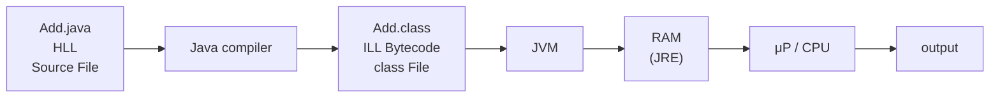

| Compile Phase / Compilation Time | Execution Phase / Execution Time / Runtime |
| --- | --- |
| Compile Time Mistakes / Compile Time Error | Execution Time Mistakes / Exceptions |
| Faulty coding by programmer | Faulty inputs by user |

---

## 📖 What is an Exception?

**What is an exception?**

Exceptions refer to such mistakes that occur during the execution of a program.

**What causes a program to generate an exception?**

Faulty inputs provided by the users to the program.

**When does an exception occur?**

During the execution of the program.

**What happens if an exception occurs?**

It disturbs the normal flow of the program resulting in abrupt termination. Hence, valuable resources may be lost.

**What is meant by exception handling?**

Exception handling refers to the process of handling the exception object in such a manner that it prevents abrupt termination. The main objective of exception handling is graceful termination of the program.

**List the keywords related to exception handling.**

`try` - `catch` - `finally` - `throw` - `throws`

---

<!-- Source: Page 2 -->

## 🏗️ Types of Architecture

### 1) 1-Tier Architecture / Stand-alone Architecture

(There was no need of exception handling. Hence 'C' language doesn't support exception handling.)

- Language context: **C**
- Years: 1940s, 1950s, 1960s, 1970s

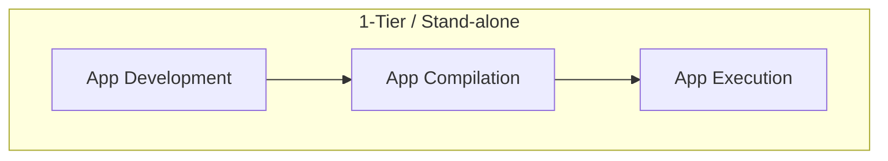

> **📌 Note:** Exception handling is low / no chance of occur.

### 2) 2-Tier Architecture / Client-Server Architecture

- Language context: **C++**
- Years: 1980s

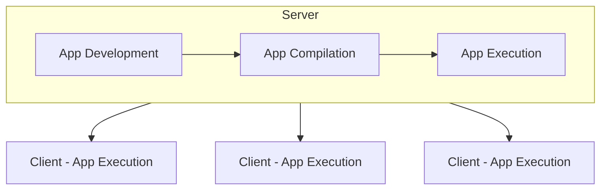

> **📌 Note:** Here, it was possible for exceptions to occur but however it could be rectified. Hence exception handling is not given much importance in C++.

### 3) N-Tier Architecture / Internet Architecture

- Language context: **Java**
- Years: 1990s

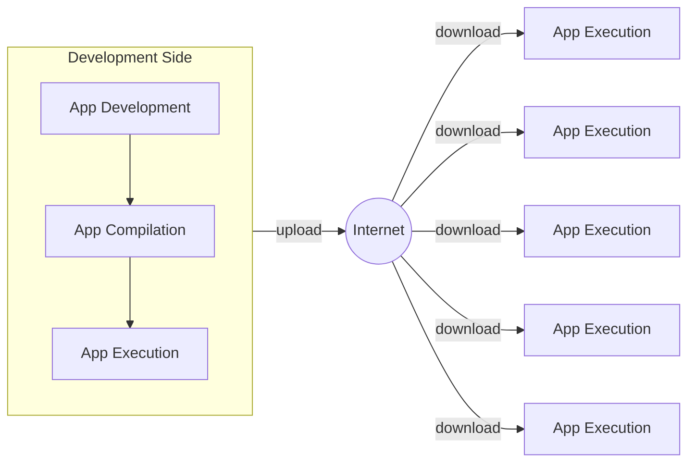

---

<!-- Source: Page 3 -->

> **📌 Note:** In this architecture, exception handling becomes extremely important, as the users of the application are spread across different parts of the world. Hence, any faulty input by any user cannot be corrected immediately by the developer. Therefore, exception handling becomes extremely important.

Date: **4/5/23**

## 🔄 Exception Handling Cases (C vs Java)

### 📋 Case 1

```text
┌─────────────────────────┐          ┌─────────────────────────┐
│ C Program               │          │ Java Program            │
│ connection is           │          │ connection is           │
│ Established             │          │ Established             │
│         ~               │          │         ~               │
│      ( Bug ) ───────► OS│          │         ~               │
│         ~               │          │         ~               │
│ connection is           │          │ connection is           │
│ Terminated              │          │ Terminated              │
└─────────────────────────┘          └─────────────────────────┘
```

In the C program, when a Bug occurs, control goes to the OS and the connection-termination statement may not be reached as intended. In the Java program diagram shown for Case 1, the flow continues from connection established to connection terminated.

### 📋 Case 2

```text
┌──────────────────────────────────┐
│ Java Program                     │
│ connection is Established        │
│         ~                        │
│      ( Bug ) ──► Runtime System  │
│         X  (Abrupt Termination)  │
│ connection is terminated         │  ← not reached
└──────────────────────────────────┘
          │
          ▼
 Default Exception Handler
 operating system
 ┌──────────────┐
 │ System crash │
 └──────────────┘
```

### 📋 Case 3

```text
┌──────────────────────────────────────────────┐
│ Java Program                                 │
│ Connection is Established                    │
│         ~                                    │
│      ( Bug ) ──► JVM                         │
│         │                                    │
│         ▼                                    │
│ User-Defined Exception Handler  ✓            │
│         │  (Normal Termination)              │
│         ▼                                    │
│ Connection is Terminated                     │
└──────────────────────────────────────────────┘
 Default Exception Handler / operating system
 ┌──────────────┐
 │ System crash │   ← avoided when handler succeeds
 └──────────────┘
```

---

<!-- Source: Page 4 -->

## 🧩 Example Without Exception Handling

```java
import java.util.Scanner;

class Launch {
    public static void main(String[] args) {
        System.out.println("connection is established");
        Scanner scan = new Scanner(System.in);

        System.out.println("Enter the numerator: ");
        int a = scan.nextInt();

        System.out.println("Enter the denominator: ");
        int b = scan.nextInt();

        int c = a / b; // exception may occur here
        System.out.println(c);
        System.out.println("Connection is Terminated");
    }
}
```

Lifecycle labels shown beside the program:

- App Development
- App Compilation
- App Execution

When the exception occurs at `int c = a / b;` and is not handled:

```text
Default Exception Handler
operating system
System Crash
```

### Internet / App Execution Diagram

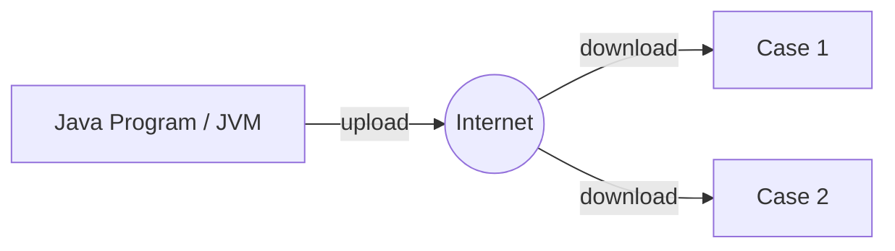

#### Case 1 — Normal Termination

```text
Connection is Established
Enter the numerator:
100
Enter the denominator:
2
50
Connection is Terminated
```

Result: **(Normal Termination)**

#### Case 2 — Abnormal Termination

```text
Connection is Established
Enter the numerator:
100
Enter the denominator:
0
Exception
ArithmeticException: / by zero
```

Result: **(Abnormal Termination)**

> **📌 Note:** `Connection is Terminated` is not printed in Case 2.

---

<!-- Source: Page 5 -->

## 🧩 Example With try-catch

```java
import java.util.Scanner;

class Launch {
    public static void main(String[] args) {
        System.out.println("Connection is established");
        Scanner scan = new Scanner(System.in);

        try {
            System.out.println("Enter the numerator : ");
            int a = scan.nextInt();

            System.out.println("Enter the denominator : ");
            int b = scan.nextInt();

            int c = a / b; // exception may occur here
            System.out.println(c);
        } catch (Exception e) {
            System.out.println("Please provide non-zero denominator");
        }
        System.out.println("Connection is closed");
    }
}
```

Labels shown:

- App Development
- App Compilation
- App Execution
- User-defined Exception Handler
- Risky / suspicious code → try block
- Handling code / Alternate code → catch block

When handled by user-defined handler, Default Exception Handler / OS / System Crash path is avoided.

### Case 1

```text
Connection is established
Enter the numerator:
100
Enter the denominator:
2
50
Connection is closed
```

Result: **(Normal Termination)**

### Case 2

```text
connection is established
Enter the numerator:
100
Enter the denominator:
0
Please provide non-zero denominator
connection is closed
```

Result: **(Normal Termination)**

---

<!-- Source: Page 6 -->

## 🔄 Exception Handling Flowchart

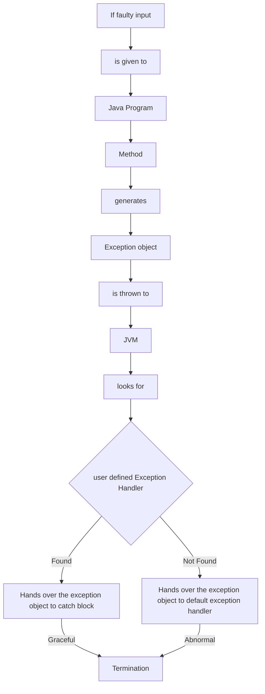

### Disadvantage of single try with single catch hierarchy

* The advantage of default exception handler is that it provides suitable message regarding the exception that is generated.
* However, the disadvantage of default exception handler is that abrupt termination of the program occurred.
* The advantage of user-defined exception handler is abrupt termination of the program would never occur.
* However, the disadvantage of user-defined exception handler is that a suitable message about the exception cannot be provided (using a single catch block).
* The above disadvantage can be overcome by using **single try with multiple catch** hierarchy.

---

<!-- Source: Page 7 -->

## 🔀 Single try with Single catch

```java
import java.util.Scanner;

class Demo {
    public static void main(String[] args) {
        System.out.println("Connection is established");
        Scanner scan = new Scanner(System.in);
        try {
            System.out.println("Enter the numerator:");
            int a = scan.nextInt();
            System.out.println("Enter the denominator:");
            int b = scan.nextInt();
            int c = a / b;
            System.out.println(c);

            System.out.println("Enter the size of the array:");
            int size = scan.nextInt();
            int[] arr = new int[size];

            System.out.println("Enter the element to be stored:");
            int elem = scan.nextInt();

            System.out.println("Enter the position at which the element has to be stored:");
            int pos = scan.nextInt();

            arr[pos] = elem;
            System.out.println(arr[pos]);
        } catch (Exception e) {
            System.out.println("Some problem occured");
        }
        System.out.println("connection is Terminated");
    }
}
```

Labels:

- App Development / App Compilation / App Execution
- Risky code → statements inside `try`
- Alternate code → `catch(Exception e)`

### Scenario 1

```text
Connection is established
Enter the numerator:
100
Enter the denominator:
2
50
Enter the size of array:
5
Enter the element to be stored:
25
Enter the position at which the element has to be stored:
1
25
Connection is Terminated
```

### Scenario 2

```text
Connection is established
Enter the numerator:
100
Enter the denominator:
0
Some problem occured
Connection is terminated
```

### Scenario 3

```text
Connection is established
Enter the numerator:
100
Enter the denominator:
2
50
Enter the size of array:
-5
Some problem occured
connection is Terminated
```

### Scenario 4

```text
Connection is established
Enter the numerator:
100
Enter the denominator:
2
50
Enter the element to be stored:
25
Enter the position at which the element has to be stored:
5
Some problem occured
connection is Terminated
```

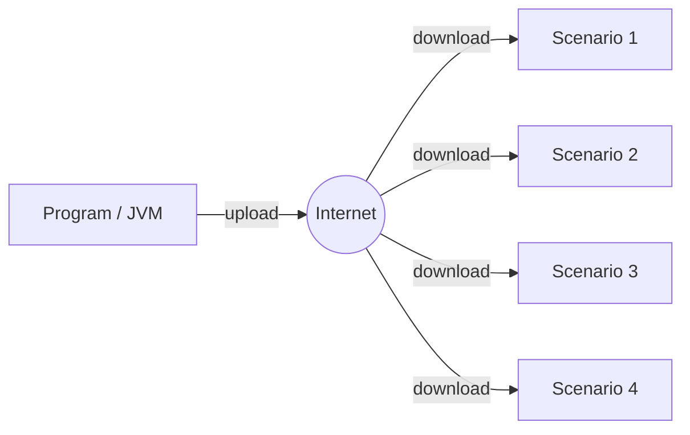

---

<!-- Source: Page 8 -->

## 🔀 Single try with Multiple catch

```java
import java.util.Scanner;

class Demo {
    public static void main(String[] args) {
        System.out.println("connection is established");
        Scanner scan = new Scanner(System.in);
        try {
            System.out.println("Enter the numerator :");
            int a = scan.nextInt();
            System.out.println("Enter the denominator :");
            int b = scan.nextInt();
            int c = a / b;
            System.out.println(c);

            System.out.println("Enter the size of the array");
            int size = scan.nextInt();
            int[] arr = new int[size];

            System.out.println("Enter the element to be inserted");
            int elem = scan.nextInt();

            System.out.println("enter the position at which it is to be inserted");
            int pos = scan.nextInt();

            arr[pos] = elem;
            System.out.println(arr[pos]);
        } catch (ArithmeticException e) {
            System.out.println("please provide non-zero denominator");
        } catch (NegativeArraySizeException e) {
            System.out.println("please provide the non-negative size");
        } catch (ArrayIndexOutOfBoundsException e) {
            System.out.println("please provide an index within the range");
        } catch (Exception e) {
            System.out.println("Some problem occurred");
        }
        System.out.println("Connection is Terminated");
    }
}
```

Labels:

- Risky code → statements inside `try`
- Multiple catch block / alternate code → specific catch blocks
- Generic catch block → `catch(Exception e)`

---

<!-- Source: Page 9 -->

### Multiple catch execution scenarios (Internet diagram)

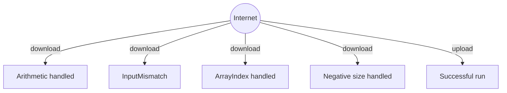

#### Download path — ArithmeticException handled

```text
Connection is established
Enter the numerator:
100
Enter the denominator:
0
Please provide a non-zero denominator.
connection is terminated
```

#### Download path — InputMismatchException

```text
Connection is established
Enter the numerator:
100
Enter the denominator:
2
50
Enter the size of the array:
5
Enter the element to be stored:
ABC
Some problem occurred
connection is terminated
```

> **📌 Note:** Input `ABC` → `InputMismatchException`

#### Download path — ArrayIndexOutOfBoundsException handled

```text
Connection is established
Enter the numerator:
100
Enter the denominator:
2
50
Enter the size of the array:
5
Enter the element to be stored:
25
Enter the position at which the element has to be stored:
5
Please provide an index value within the range of array.
connection is terminated.
```

#### Download path — NegativeArraySizeException handled

```text
Connection is established
Enter the numerator:
100
Enter the denominator:
2
50
Enter the size of the array:
-5
Please provide a positive array size.
connection is terminated.
```

#### Upload path — Successful execution

```text
connection is established
Enter the numerator:
100
Enter the denominator:
2
50
Enter the size of the array:
5
Enter the element to be stored:
25
Enter the position at which the element has to be stored:
1
25
connection is terminated
```

---

<!-- Source: Page 10 -->

## 📋 Multiple Catch Notes and Invalid Cases

> **📌 Note:** As noticed in the above example, a single `try` block can have multiple `catch` blocks.

* In the case of multiple catch blocks hierarchy, at the end of all the specific catch blocks we must have a generic catch block so that if the specific catch blocks failed to handle an exception, the generic catch block can handle it.
* The generic catch block must not be placed at the beginning of hierarchy because the generic catch block can handle all types of exception and hence the specific catch blocks will never be given a chance to handle an exception. Therefore it is a compilation error to do so.

### Invalid cases

#### Eg 1

```java
try {
    // ...
} catch (Exception e) {
    // ...
} catch (ArithmeticException e) { // X CE
    // ...
}
```

> **⚠️ Compilation Error:** `ArithmeticException has already been caught`

#### Eg 2

```java
try {
    // ...
} catch (ArithmeticException e) {
    // ...
} catch (ArithmeticException e) { // X CE
    // ...
}
```

> **⚠️ Compilation Error:** `ArithmeticException has already been caught`

Date: **5/5/23**

## ⚙️ Execution Control Flow in try-catch

```java
statement-1;
try {
    statement-2;
    statement-3;
    statement-4;
} catch (XXX e) {
    statement-5;
}
statement-6;
```

### 📋 Case 1

If there is no Exception raised.

* `statement-1, 2, 3, 4 & 6` will be executed.
* Resulting in **normal termination**.

### 📋 Case 2

If an exception is raised at statement-3 and the corresponding catch block is matched.

* `statement-1, 2, 5, & 6` will be executed.
* Resulting in **normal termination**.

### 📋 Case 3

If an exception is raised at statement-3 and the corresponding catch block is not matched.

* `statement-1, 2` will be executed.
* Resulting in **abnormal termination**.

### 📋 Case 4

If an exception is raised at statement-1 or statement-5 or statement-6.

* statement-1 or 5 or 6 is not a part of try block.
* Resulting in **abnormal termination**.

---

<!-- Source: Page 11 -->

## 🧠 Runtime Stack Mechanism

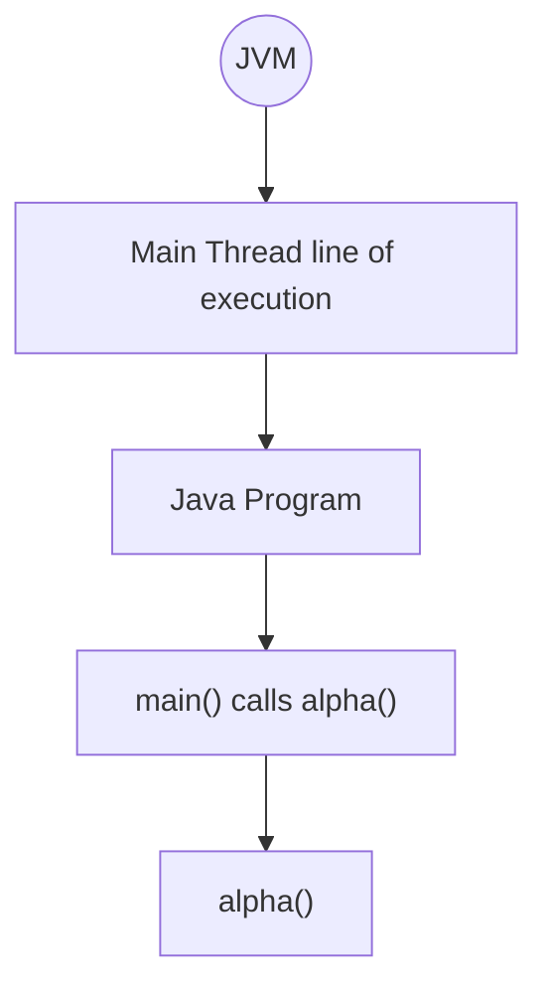

```text
Stack Area
┌─────────────────────────────────┐
│ Run-time Stack of main thread   │
│ ┌─────────────────────────────┐ │
│ │ alpha()                     │ │  ← Activation Record / Stack Frame for alpha()
│ ├─────────────────────────────┤ │
│ │ main()                      │ │  ← Activation Record / Stack Frame for main()
│ └─────────────────────────────┘ │
└─────────────────────────────────┘
```

### Program 1

```java
class Launch {
    public static void main(String[] args) {
        System.out.println("connection 1 is established");
        Demo d1 = new Demo();
        d1.alpha();
        System.out.println("connection 1 is terminated");
    }
}

class Demo {
    public void alpha() {
        System.out.println("connection 2 is established");
        Scanner scan = new Scanner(System.in);
        System.out.println("Enter the numerator : ");
        int a = scan.nextInt();
        System.out.println("Enter the denominator : ");
        int b = scan.nextInt();
        int c = a / b; // exception may occur here
        System.out.println(c);
        System.out.println("connection 2 is terminated");
    }
}
```

```text
Stack Area (when exception occurs in alpha)
┌─────────────────────────────────┐
│ Run-time Stack                  │
│ ┌─────────────────────────────┐ │
│ │ alpha()  ⚡ throwing         │ │──► JVM
│ ├─────────────────────────────┤ │
│ │ main()   X                  │ │
│ ├─────────────────────────────┤ │
│ │ Default exception handler   │ │
│ └─────────────────────────────┘ │
└─────────────────────────────────┘
```

**Output:**

```text
connection 1 is established
connection 2 is established
Enter the numerator:
100
Enter the denominator:
0
Exception in thread "main"
ArithmeticException: / by zero
    at Demo.alpha(Launch.java:22)
    at Launch.main(Launch.java:7)
```

### Program 2

```java
class Demo1 {
    public void alpha() {
        System.out.println("connection 2 is established");
        Scanner scan = new Scanner(System.in);
        System.out.println("Enter the numerator : ");
        int a = scan.nextInt();
        System.out.println("Enter the denominator : ");
        int b = scan.nextInt();
        int c = a / b;
        System.out.println(c);
        System.out.println("connection 2 is terminated");
    }
}

class Demo2 {
    public void beta() {
        System.out.println("connection 3 is established");
        Demo1 d1 = new Demo1();
        d1.alpha();
        System.out.println("connection 3 is terminated");
    }
}
```

---

<!-- Source: Page 12 -->

## 🔗 Exception Propagation

```text
Run-Time Stack
┌──────────────────┐
│ AR of alpha()    │  ⚡ Exception occurs here ──► JVM
├──────────────────┤
│ AR of beta()     │
├──────────────────┤
│ AR of gamma()    │
├──────────────────┤
│ AR of main()     │
└──────────────────┘
         │
         ▼
 Default Exception Handler
```

```java
class Demo3 {
    public void gamma() {
        System.out.println("connection 3 is established");
        Demo2 d2 = new Demo2();
        d2.beta();
        System.out.println("connection 3 is terminated");
    }
}

class Launch {
    public static void main(String[] args) {
        System.out.println("connection 1 is established");
        Demo3 d3 = new Demo3();
        d3.gamma();
        System.out.println("connection 1 is terminated");
    }
}
```

**Output:**

```text
connection 1 is established
connection 3 is established
connection 2 is established
connection 4 is established
Enter the numerator:
100
enter the denominator:
0
Exception in thread "main"
java.lang.ArithmeticException: / by zero
    at Demo1.alpha(Launch.java:12)
    at Demo2.beta(Launch.java:23)
    at Demo3.gamma(Launch.java:33)
    at Launch.main(Launch.java:43)
```


> Whenever an exception occurs within a method and the method does not handle it then the JVM would not directly handover the exception object to the default exception handler (DEH). Instead the JVM will keep propagating the exception object down the stack, checking if any of the caller methods have provided the user defined exception handler (UDEH). If none of the methods have provided UDEH only then the JVM will handover the exception object to the DEH.

---

<!-- Source: Page 13 -->

> ...If none of the methods have provided UDEH only then the JVM will handover the exception object to the DEH.

## 📦 What Does the Exception Object Contain?

```java
class Launch {
    public static void main(String[] args) {
        System.out.println("connection 1 is established");
        Demo d1 = new Demo();
        d1.alpha();
        System.out.println("connection 1 is terminated");
    }
}

class Demo {
    public void alpha() {
        System.out.println("connection 2 is established");
        int c = a / b; // exception occurs here
        System.out.println("connection 2 is terminated");
    }
}
```

**Exception Object contains:**

* Name of the Exception: `ArithmeticException`
* Description of the exception: `/ by zero`
* Stack Trace of the exception:
  * `Demo.alpha(Launch.java:12)`
  * `Launch.main(Launch.java:7)`

## 📋 Methods to Print Exception Information

**Throwable class** methods:

* `getMessage()`
* `toString()`
* `printStackTrace()`

1. `e.getMessage()` — Prints the description of the exception.
   * Eg: `/ by zero`
2. `e.toString()` — Prints the name and description of the exception.
   * Eg: `ArithmeticException: / by zero`
3. `e.printStackTrace()` — Prints the name & the description of the exception along with the stack trace.
   * Eg: `ArithmeticException: / by zero at Demo.alpha()`

---

<!-- Source: Page 14 -->

```java
class Launch {
    public static void main(String[] args) {
        int a = 100;
        int b = 0;
        try {
            int c = a / b;
            System.out.println(c);
        } catch (ArithmeticException e) {
            System.out.println(e.getMessage());
            System.out.println(e.toString());
            System.out.println(e);
            e.printStackTrace();
        }
    }
}
```

**Output:**

```text
/ by zero
java.lang.ArithmeticException: / by zero
java.lang.ArithmeticException: / by zero
java.lang.ArithmeticException: / by zero
    at Launch.main(Launch.java:10)
```

> **📌 Note:** `printStackTrace()` is the method used by default exception handler to print the information.

## 🛠️ Different Ways of Handling the Exception

Date: **6/5/23**

1. **Handling the Exception** [`try-catch`]
2. **Rethrowing the Exception** [`try - catch - throw - throws - finally`]
3. **Ducking the Exception** [`throws`]

### 1) Handling the Exception

```java
class Demo {
    public void alpha() {
        System.out.println("Connection 2 is established");
        Scanner scan = new Scanner(System.in);
        try {
            System.out.println("Enter the numerator:");
            int a = scan.nextInt();
            System.out.println("Enter the denominator:");
            int b = scan.nextInt();
            int c = a / b;
            System.out.println(c);
        } catch (Exception e) {
            System.out.println("Exception caught inside alpha()");
        }
        System.out.println("Connection 2 is terminated");
    }
}

class Launch {
    public static void main(String[] args) {
        System.out.println("Connection 1 is established");
        Demo d = new Demo();
        d.alpha();
        System.out.println("Connection 1 is terminated");
    }
}
```

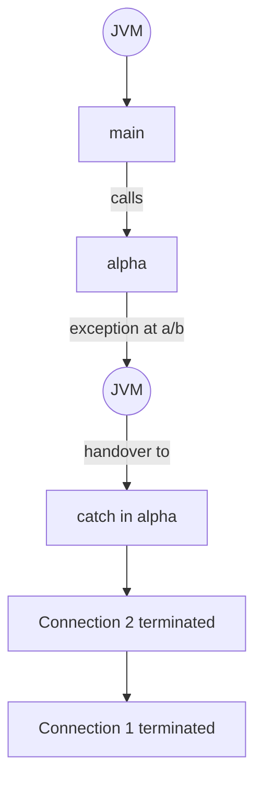

---

<!-- Source: Page 15 -->

Handling the exception object within the same method inside which exception occurs is only referred to as "handling the exception".

As noticed in the above program, if an exception is handled inside a method then JVM will not automatically propagate the exception object down the stack hierarchy.

```text
Stack Area
┌─────────────────────┐
│ Run-Time Stack      │
│ ┌─────────────────┐ │
│ │ AR for alpha()  │ │  exception handled locally ◄── JVM
│ ├─────────────────┤ │
│ │ AR for main()   │ │
│ └─────────────────┘ │
└─────────────────────┘
```

### 2) Rethrowing the Exception

```java
class Demo {
    public void alpha() throws Exception {
        System.out.println("Connection 2 established");
        Scanner scan = new Scanner(System.in);
        try {
            System.out.println("Enter the numerator:");
            int a = scan.nextInt();
            System.out.println("Enter the denominator:");
            int b = scan.nextInt();
            int c = a / b;
            System.out.println(c);
        } catch (Exception e) {
            System.out.println("Exception caught inside alpha()");
            throw e;
        } finally {
            System.out.println("Connection 2 terminated");
        }
    }
}

class Launch {
    public static void main(String[] args) {
        System.out.println("Connection 1 established");
        try {
            Demo d1 = new Demo();
            d1.alpha();
        } catch (Exception e) {
            System.out.println("Exception caught inside main()");
        }
        System.out.println("Connection 1 terminated");
    }
}
```

```text
Stack Area (rethrow)
┌─────────────────────┐
│ Run-Time Stack      │
│ ┌─────────────────┐ │
│ │ AR for alpha()  │ │ ──► JVM ──► AR for main()
│ ├─────────────────┤ │
│ │ AR for main()   │ │
│ └─────────────────┘ │
└─────────────────────┘
```

**Output (local handling / no rethrow path):**

```text
Connection 1 established
Connection 2 established
Enter the numerator:
100
Enter the denominator:
0
Exception caught inside alpha()
Connection 2 terminated
Connection 1 terminated
```

**Output (rethrowing):**

```text
Connection 1 established
Connection 2 established
Enter the numerator:
100
Enter the denominator:
0
Exception caught inside alpha()
Connection 2 terminated
Exception caught inside main()
Connection 1 terminated
```

---

<!-- Source: Page 16 -->

* Whenever a method wants to explicitly throw the exception object down the stack hierarchy (to the caller) after it has already been handled is referred to as **Rethrowing an Exception**.
* It can be achieved by using the **`throw`** keyword. Whenever a method is throwing an exception, it must also inform the caller of the method that an exception may be thrown by using the **`throws`** keyword in the signature of the method.
* The disadvantage of the **`throw`** keyword is that the statements below the throw keyword will not be executed. It can be overcome by placing the statements inside the **`finally`** block.

### 3) Ducking the Exception

```java
class Demo {
    public void alpha() throws Exception {
        System.out.println("connection 2 is established");
        Scanner scan = new Scanner(System.in);
        try {
            System.out.println("Enter the numerator : ");
            int a = scan.nextInt();
            System.out.println("Enter the denominator : ");
            int b = scan.nextInt();
            int c = a / b;
            System.out.println(c);
        } finally {
            System.out.println("connection 2 is terminated");
        }
    }
}

class Launch {
    public static void main(String[] args) {
        System.out.println("connection 1 is established");
        try {
            Demo d1 = new Demo();
            d1.alpha();
        } catch (Exception e) {
            System.out.println("Exception caught inside main()");
        }
        System.out.println("connection 1 is terminated");
    }
}
```

> **📌 Note:** Critical statement must be executed → place it in `finally`.

**Output:**

```text
connection 1 is established
connection 2 is established
Enter the numerator:
100
Enter the denominator:
0
connection 2 is terminated
Exception caught inside main()
connection 1 is terminated
```

---

<!-- Source: Page 17 -->

Whenever a method does not want to handle any exception and instead handovers the responsibility of handling the exception to the caller of the method by using **`throws`** keyword in the signature of the method this is known as **ducking an exception**.

As noticed in the above program, within the `alpha()` method catch block had not been provided. Since the `alpha()` method does not want to handle the exception. In case exception occurs, `alpha()` method would be abruptly executed and control would come out of `alpha()` method but if there are any critical statements within the `alpha()` method that should be executed irrespective of whether or not an exception occurred, then such statements must be placed under the **`finally`** block. However, it is invalid to have only a finally block without the try block. Hence **`finally`** must always be used at least with the **`try`** block.

## 🎯 Need for finally Block

Typical file operation steps:

1. Open the file
2. Read data from the file
3. **close the file** → Resource deallocation code / clean up code

### 📋 Case 1: clean up code inside try-block

```java
try {
    // open the file
    // Read data from the file   // exception may occur here
    // close the file
} catch (XXX e) {
    // ...
}
```

> **❌ Not Recommended**

### 📋 Case 2: clean up code inside catch-block

```java
try {
    // open the file
    // Read data from the file
} catch (XXX e) {
    // close the file
}
```

> **❌ Not Recommended**

### 📋 Case 3: clean up code inside finally-block

```java
try {
    // open the file
    // Read data from the file
} catch (XXX e) {
    // ...
} finally {
    // close the file
}
```

> Irrespective of whether or not an exception has occurred, finally block will always be executed.

> **✅ Highly Recommended**

---

<!-- Source: Page 18 -->

## 📌 Exception Handling Keywords

| Keyword | Purpose |
| --- | --- |
| `try` | To maintain risky code. |
| `catch` | To maintain handling code. |
| `finally` | To maintain clean up code. |
| `throw` | To handover the exception object to the JVM manually. |
| `throws` | To delegate the responsibility of handling the exception to the caller. |

Date near `throw`: **7/5/23**

### Exception Handling skeleton

```java
try {
    // Risky / suspicious code
} catch (Exception e) {
    // Handling / Alternate / Pre cautionary code.
} finally {
    // Resource deallocation / clean up code.
}
```

### Execution control flow in try-catch-finally

| Exception Raised | Exception Handled | finally block executed |
| --- | --- | --- |
| NO | — | Yes |
| Yes | Yes | Yes |
| Yes | No | Yes |

## 🎯 finally vs return

### Program 1

```java
class Launch {
    public static void main(String[] args) {
        try {
            System.out.println("Inside try");
            return;
        } catch (Exception e) {
            System.out.println("Inside catch");
        } finally {
            System.out.println("Inside finally");
        }
    }
}
```

**Output:**

```text
Inside try
Inside finally.
```

> **📌 Note:** finally block dominates return statement.

---

<!-- Source: Page 19 -->

### Program 2

```java
class Launch {
    public static void main(String[] args) {
        int res = alpha();
        System.out.println(res);
    }

    public static int alpha() {
        try {
            return 10;
        } catch (Exception e) {
            return 100;
        } finally {
            return 1000;
        }
    }
}
```

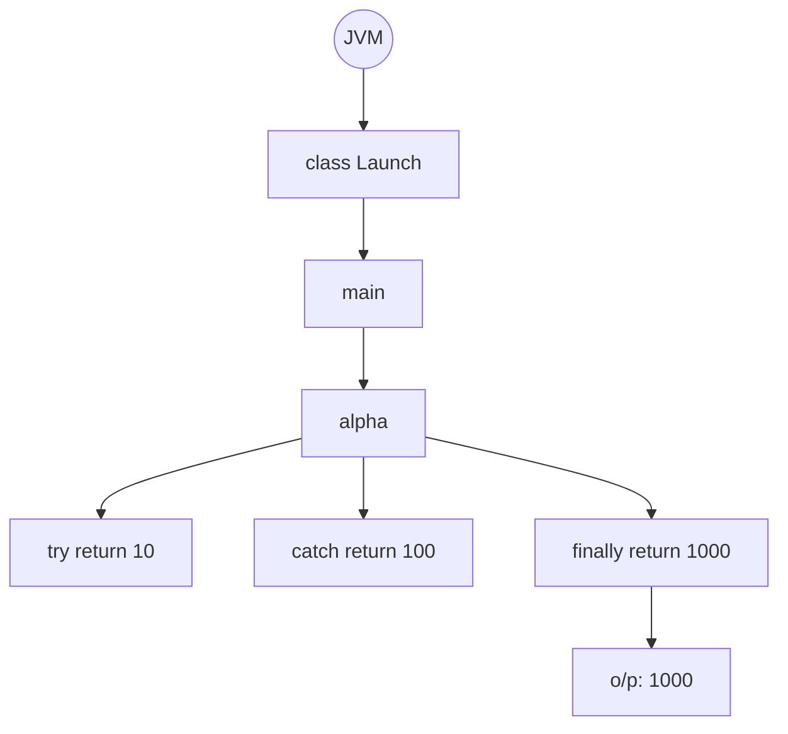

**Output:**

```text
1000
```

> **📌 Note:** finally block return statement dominates other return statements.

## 🚀 finally vs System.exit(0)

`System.exit(int status)`

* Status code = `0` → Indicates normal termination.
* Status code = any non-zero value → Indicates abnormal termination.

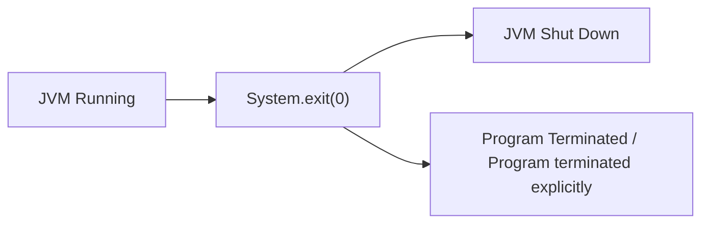

```java
class Launch {
    public static void main(String[] args) {
        try {
            System.out.println("Inside try");
            System.exit(0);
        } catch (Exception e) {
            System.out.println("Inside catch");
        } finally {
            System.out.println("Inside finally");
        }
    }
}
```

**Output:**

```text
Inside try
```

> **📌 Note:** `System.exit()` dominates finally block.

---

<!-- Source: Page 20 -->

## 🧬 Exception Hierarchy

Legend:

* Black box → Unchecked Exception
* Red box → Fully checked Exception
* Mixed / special marking → Partially checked Exception (`Throwable`, `Exception`)

```mermaid
flowchart BT
    Object[Object]
    Throwable[Throwable]
    Error[Error]
    Exception[Exception]

    Throwable --> Object
    Error --> Throwable
    Exception --> Throwable

    VirtualMachineError[VirtualMachineError] --> Error
    OutOfMemoryError[OutOfMemoryError] --> VirtualMachineError
    StackOverflowError[StackOverflowError] --> VirtualMachineError
    LinkageError[LinkageError] --> Error
    ExceptionInInitializerError[ExceptionInInitializerError] --> LinkageError
    AssertionError[AssertionError] --> Error

    RuntimeException[RuntimeException] --> Exception
    ArithmeticException[ArithmeticException] --> RuntimeException
    NullPointerException[NullPointerException] --> RuntimeException
    ClassCastException[ClassCastException] --> RuntimeException
    IndexOutOfBoundsException[IndexOutOfBoundsException] --> RuntimeException
    ArrayIndexOutOfBoundsException[ArrayIndexOutOfBoundsException] --> IndexOutOfBoundsException
    StringIndexOutOfBoundsException[StringIndexOutOfBoundsException] --> IndexOutOfBoundsException
    IllegalArgumentException[IllegalArgumentException] --> RuntimeException
    NumberFormatException[NumberFormatException] --> IllegalArgumentException
    ArrayStoreException[ArrayStoreException] --> RuntimeException
    NegativeArraySizeException[NegativeArraySizeException] --> RuntimeException

    IOException[IOException] --> Exception
    EOFException[EOFException] --> IOException
    FileNotFoundException[FileNotFoundException] --> IOException
    RemoteException[RemoteException] --> IOException
    InterruptedException[InterruptedException] --> Exception
    SQLException[SQLException] --> Exception
```

> **📌 Note:** In the handwritten diagram, `IOException` and its children, `InterruptedException`, and `SQLException` are shown as fully checked (red). `RuntimeException` / `Error` trees are unchecked (black). `Throwable` / `Exception` are treated as partially checked.

---

<!-- Source: Page 21 -->

## ❌ Demonstration of Runtime Error

### Eg 1: Recursion

```java
class Launch {
    public static void alpha() {
        alpha();
    }

    public static void main(String[] args) {
        alpha();
    }
}
```

```text
Run-Time Stack
┌──────────────────────────┐
│ AR for alpha()           │  ... grows until overflow
├──────────────────────────┤
│ AR for alpha()           │
├──────────────────────────┤
│ AR for alpha()           │
├──────────────────────────┤
│ AR for main()            │
└──────────────────────────┘
```

**Output:**

```text
Exception in thread "main" java.lang.StackOverflowError
    at Launch.alpha(Launch.java:5)
    at Launch.alpha(Launch.java:5)
    at Launch.alpha(Launch.java:5)
    ...
```

### Eg 2: Array

```java
class Launch {
    public static void main(String[] args) {
        int[] a = new int[1000000000];
    }
}
```

> **📌 Note:** `1000000000 * 4 = 4 GB` — Impossible to allocate contiguously on the heap.

**Output:**

```text
Exception in thread "main" java.lang.OutOfMemoryError: Java heap space
    at Launch.main(Launch.java:5)
```

## 📊 Difference Between Exception and Error

| Parameter | Exception | Error |
| --- | --- | --- |
| Source | Exceptions are caused due to the program code. | Errors are caused due to the lack of system resources. |
| Recovery | Exceptions are recoverable. | Errors are non-recoverable. |
| Means of Handling | Exceptions can be either handled using try-catch or declared using throws. | No means to handle error. |
| Consequence | Exceptions may result in abnormal termination of the program. | Errors always result in abnormal termination of the program. |

---

<!-- Source: Page 22 -->

| Types | Exceptions | Errors |
| --- | --- | --- |
| Types | Exceptions are classified as checked & unchecked type. | Errors are classified as unchecked type. |
| Examples | `ArithmeticException`, `IOException`, etc. | `StackOverflowError`, `OutOfMemoryError`, etc. |

## ✅ Checked Exceptions vs ❌ Unchecked Exceptions

### Example 1: Unchecked Exception

```java
class Launch {
    public static void main(String[] args) {
        int a = 10;
        int b = 0;
        int c = a / b; // ArithmeticException (Unchecked)
    }
}
```

Compilation: **Successful** ✓

**Output:**

```text
Exception in thread "main" java.lang.ArithmeticException: / by zero
    at Launch.main(Launch.java:5)
```

### Example 2: Checked Exception

```java
class Launch {
    public static void main(String[] args) {
        PrintWriter pw = new PrintWriter("abc.txt"); // FileNotFoundException (checked)
        pw.write("Hello, ABC!");
    }
}
```

> **📌 Note:** PrintWriter helps in sending data from a Java program to a file.

Compilation: **Failed** ✗

```text
error: Launch.java:6: error: unreported exception FileNotFoundException; must be caught or declared to be thrown
PrintWriter pw = new PrintWriter("abc.txt");
                 ^
```

## 🛠️ Handling the Checked Exception

### Solution 1: By using try-catch

The method owns up the responsibility of handling the exception by itself.

```java
import java.io.PrintWriter;

class Launch {
    public static void main(String[] args) {
        try {
            PrintWriter pw = new PrintWriter("abc.txt");
            pw.write("Hello, ABC!");
        } catch (FileNotFoundException e) {
            System.out.println(e);
        }
    }
}
```

> **✅ Recommended** — Results in normal termination

<!-- Source: Page 23 -->

### Solution 2: By using `throws` keyword

The method delegates the responsibility of handling the exception to the caller.

```java
class Launch {
    public static void main(String[] args) throws FileNotFoundException {
        PrintWriter pw = new PrintWriter("abc.txt");
        pw.write("Hello, ABC!");
    }
}
```

> **❌ Not Recommended** — Might result in normal | abnormal termination

---

## ↩️ Ducking (Checked vs Unchecked)

### Checked Exception

```java
class Launch {
    void alpha() throws FileNotFoundException {
        PrintWriter pw = new PrintWriter("sample.txt");
        pw.write("Hello, World!");
    }

    public static void main(String[] args) {
        alpha(); // Error: unreported Exception
    }
}
```

> **⚠️ Compilation Error:** unreported Exception — caller must handle or declare.

### Unchecked Exception

```java
class Launch {
    static void alpha() throws ArithmeticException {
        System.out.println(10 / 0);
    }

    public static void main(String[] args) {
        alpha(); // ✓ compiles
    }
}
```

> Compiler does not enforce handling/declaring unchecked exceptions.

<!-- Source: Page 24 -->

## 📊 Checked Exception vs Unchecked Exception (Detailed Comparison)

| Parameters | Checked Exception | Unchecked Exception |
| --- | --- | --- |
| Time of occurrence | Checked exceptions occur at runtime. | Unchecked exceptions occur at runtime. |
| Compiler Intervention | Checked exceptions are checked by the compiler to reduce the number of exceptions at runtime. | Unchecked exceptions are not checked by the compiler because compiler is not aware of such exceptions. |
| Consequence | Compiler enforces the method to either handle the exception or declare with `throws` keyword. | Compiler does not enforce any compulsion to tackle unchecked exceptions. |
| End Result | Facilitates in normal termination of the program. | Does not facilitate in normal termination of the program unless handled. |
| Origin | Except `RuntimeException`, `Error` and their respective subclasses, all other exceptions are checked. | `RuntimeException`, `Error` and their respective subclasses are unchecked. |
| Classification | Checked exceptions are categorized as fully checked and partially checked. | Unchecked exceptions are not further categorized. |
| Custom Exceptions | Custom checked exceptions can be created by extending from `Exception` class. | Custom unchecked exceptions can be created by extending from `RuntimeException` class. |
| When to use? | Should raise if the program **can recover** from an exception. | Should raise if the program **can't recover** from the exception. |
| Exception Propagation | To propagate a checked exception, declaring with `throws` keyword is mandatory. | To propagate an unchecked exception, declaring with `throws` keyword is not mandatory. |
| Exception Cause | Generally, they occur because of some problem outside the scope of the program. | Generally, they occur because of some problem within the scope of the program. |
