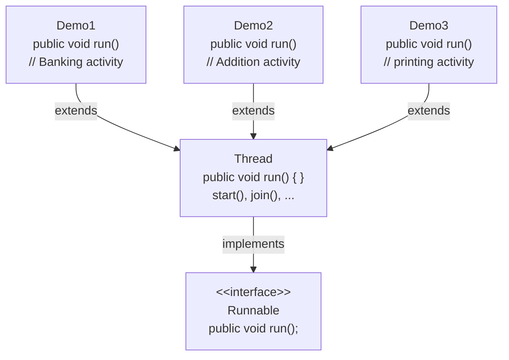
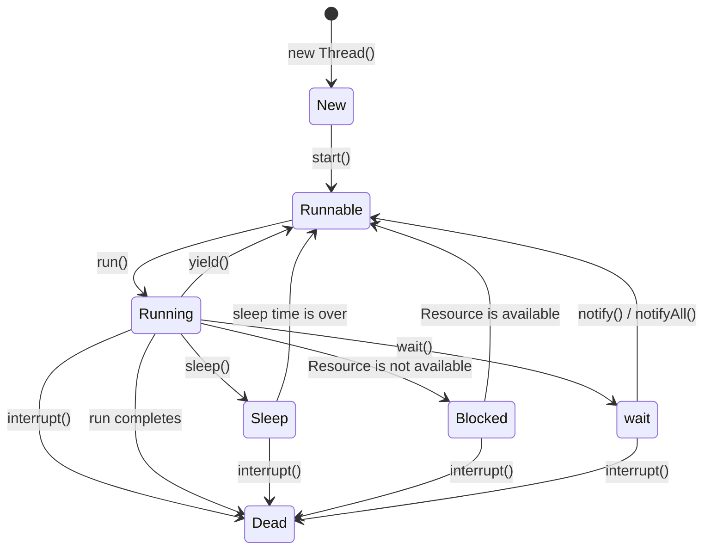

# 🧵 Multithreading in Java

> Digitized from handwritten mentor notes.

## 📚 Table of Contents

- [🧩 Nested try-catch-finally](#-nested-try-catch-finally)
- [🧵 Multithreading in Java](#-multithreading-in-java-1)
  - [🖥️ Evolution of Processing Systems](#️-evolution-of-processing-systems)
  - [📖 Definition of Multithreading](#-definition-of-multithreading)
  - [🧩 Program 1 — currentThread()](#-program-1--currentthread)
  - [🧩 Program 2 — setName() and setPriority()](#-program-2--setname-and-setpriority)
- [📌 NOTE — Main Thread](#-note--main-thread)
- [⚔️ Disadvantage of Single-Threaded Approach](#️-disadvantage-of-single-threaded-approach)
- [✅ Advantage of Multi-Threaded Approach](#-advantage-of-multi-threaded-approach)
  - [🧩 Approach 1 — Extending Thread Class](#-approach-1--extending-thread-class)
  - [📅 start() Method](#-start-method)
  - [⚠️ Disadvantage of Calling run() Manually](#️-disadvantage-of-calling-run-manually)
  - [🧬 Thread Hierarchy](#-thread-hierarchy)
  - [🔌 Approach 2 — Implementing Runnable](#-approach-2--implementing-runnable)
- [🔗 join() and isAlive() Methods](#-join-and-isalive-methods)
- [🧩 Achieving Multithreading Using a Single run() Method](#-achieving-multithreading-using-a-single-run-method)
- [⚔️ Demonstration of Race Condition](#️-demonstration-of-race-condition)
- [👻 Daemon Threads](#-daemon-threads)
- [🛑 Disadvantage of Multithreading — Shared Resource](#-disadvantage-of-multithreading--shared-resource)
  - [📋 Approach 1 — Using join()](#-approach-1--using-join)
  - [🔐 Approach 2 — Using synchronized Keyword](#-approach-2--using-synchronized-keyword)
- [🔒 Synchronization](#-synchronization)
  - [🔐 Case 1 — Synchronized Method](#-case-1--synchronized-method)
  - [🧱 Case 2 — Synchronized Block](#-case-2--synchronized-block)
- [🔄 Thread State Diagram](#-thread-state-diagram)
- [🧩 Program to Demonstrate Thread State Diagram](#-program-to-demonstrate-thread-state-diagram)
- [☠️ Program to Demonstrate Deadlock](#️-program-to-demonstrate-deadlock)
- [🏭 Producer-Consumer Problem / Bounded Buffer Problem](#-producer-consumer-problem--bounded-buffer-problem)
  - [⚠️ Problem Without Inter-Thread Communication](#️-problem-without-inter-thread-communication)
  - [📡 Solution Using wait() and notify()](#-solution-using-wait-and-notify)

---

<!-- Source: Page 1 -->

## 🧩 Nested try-catch-finally

*(Leftover structures from Exception Handling — all four patterns marked valid ✓.)*

### Structure 1 — Nested inside outer `try`

```java
// Nested try-catch-finally
try
{
    try
    {
    }
    catch (XXX e)
    {
    }
    finally
    {
    }
}
catch (XXX e)
{
}
finally
{
}
```

✓

### Structure 2 — Nested inside outer `catch`

```java
// Nested try-catch-finally
try
{
}
catch (XXX e)
{
    try
    {
    }
    catch (XXX e)
    {
    }
    finally
    {
    }
}
finally
{
}
```

✓

### Structure 3 — Nested inside outer `finally`

```java
// Nested try-catch-finally
try
{
}
catch (XXX e)
{
}
finally
{
    try
    {
    }
    catch (XXX e)
    {
    }
    finally
    {
    }
}
```

✓

### Structure 4 — Nested in try, catch, and finally

```java
// Nested try-catch-finally
try
{
    try
    {
    }
    catch (XXX e)
    {
    }
    finally
    {
    }
}
catch (XXX e)
{
    try
    {
    }
    catch (XXX e)
    {
    }
    finally
    {
    }
}
finally
{
    try
    {
    }
    catch (XXX e)
    {
    }
    finally
    {
    }
}
```

✓

---

## 🧵 Multithreading in Java

### 🖥️ Evolution of Processing Systems

#### 1940s, 1950s, 1960s — Single-Tasking System

```text
HDD                          Mother Board
┌──────────┐                 ┌─────────────────┐
│ Program1 │──┐              │       µp        │
│ Program2 │  │   LOADER     │        │        │
│ Program3 │  ├──►(LOADER)──►│        ▼        │
│ Program4 │──┘              │   ┌─────────┐   │
└──────────┘                 │   │  RAM    │   │
                             │   │ Process │   │
                             │   │ / Task  │   │
                             │   └─────────┘   │
                             └─────────────────┘

Path: Single-Tasking Operating System (STOS)

Sequential style of execution
[one program has to wait for another program to complete its execution]

Single-Tasking system using STOS & Single Processor
```

- **Adv:** Inexpensive (Single Processor)
- **Disadv:** Slow in execution

#### 1970s — Multi-Tasking with Multi-Processor

```text
HDD                          Mother Board
┌──────────┐                 ┌──────────────────────┐
│ Program1 │──┐              │  µp1   µp2   µp3     │
│ Program2 │  │   LOADER     │   │     │     │      │
│ Program3 │  ├──►(LOADER)──►│   ▼     ▼     ▼      │
│ Program4 │──┘   (STOS)     │ ┌────┐┌────┐┌────┐   │
└──────────┘                 │ │Proc││Proc││Proc│   │
                             │ │ess ││ess ││ess │   │
                             │ └────┘└────┘└────┘   │
                             │         RAM          │
                             └──────────────────────┘

Parallel style of execution
[Each processor will be executing a separate process]

Multi-Tasking system using Single-tasking OS & Multi-Processor
```

- **Adv:** Fast in execution
- **Disadv:** Expensive

---

<!-- Source: Page 2 -->

#### 1980s — Multi-Tasking OS & Single Processor

```text
HDD                          Mother Board
┌──────────┐                 ┌──────────────────────┐
│ Program1 │──┐              │         µp           │
│ Program2 │  │   LOADER     │    /    |    \       │
│ Program3 │  ├──►(LOADER)──►│   ▼     ▼     ▼      │
│ Program4 │──┘   (MTOS)     │ ┌────┐┌────┐┌────┐   │
└──────────┘                 │ │Proc││Proc││Proc│   │
                             │ └────┘└────┘└────┘   │
                             │         RAM          │
                             └──────────────────────┘

1 unit time of CPU Time = 1 µs
|────0.25µs────|────0.25µs────|────0.25µs────|────0.25µs────|
                    Time slicing

Concurrent style of Execution
(Single processor executing multiple processes concurrently)

Multi-Tasking system using Multi-Tasking OS & Single Processor
```

- **Adv:** Inexpensive, Fast in execution
- **Dis:** CPU time cannot be efficiently utilized

#### 1990s — Multi-Tasking with Multithreading

```text
HDD                          Mother Board
┌──────────┐                 ┌──────────────────────────┐
│ Program1 │──┐              │            µp            │
│ Program2 │  │   LOADER     │             │            │
│ Program3 │  ├──►(LOADER)──►│             ▼            │
│ Program4 │──┘   (MTOS)     │  ┌────────────────────┐  │
└──────────┘                 │  │ Process (subtasks) │  │
                             │  │  ○ ○ ○  ← thread   │  │
                             │  │ (0.2 µs per slice) │  │
                             │  └────────────────────┘  │
                             │           RAM            │
                             └──────────────────────────┘

Concurrent style of Execution
(Single processor executing multiple processes concurrently)

multi-tasking system with multi-threading using multi-tasking
operating system & single processor
```

- **Adv:** Efficient utilization of CPU time, Inexpensive, Fast in Execution

### 📖 Definition of Multithreading

**Date:** 12/05/23

Multithreading is a feature in Java that allows the concurrent execution of 2 or more parts (subtasks) of a program for maximum utilization of CPU time.

Each part of such a program will be executed by a separate thread. In other words, a **thread** is a line of execution within a program.

### 🧩 Program 1 — currentThread()

```java
class LaunchDemo
{
    public static void main(String[] args)
    {
        Thread t = Thread.currentThread();
        System.out.println(t);
    }
}
```

**Output:**

```text
Thread[main, 5, main]
```

**Breakdown:**

| Part | Meaning |
| --- | --- |
| `main` (first) | name of the thread |
| `5` | priority of the thread (default) |
| `main` (second) | name of the thread group |

### 🔄 Main Thread & Stack Area

```text
        OS / JVM
            │
    ┌───────▼────────┐
    │ Thread Scheduler│
    └───────┬────────┘
            │  line of execution / main thread
            │  ← t
    ┌───────▼────────────────────┐
    │        Stack Area          │
    │  ┌──────────────────────┐  │
    │  │ AR / SF of main()    │  │
    │  └──────────────────────┘  │
    │  Runtime stack for main    │
    │  thread                    │
    └────────────────────────────┘
```

---

<!-- Source: Page 3 -->

### 🧩 Program 2 — setName() and setPriority()

```java
class LaunchDemo
{
    public static void main(String[] args)
    {
        Thread t = Thread.currentThread();
        t.setName("GQT");
        t.setPriority(8);
        System.out.println(t);
    }
}
```

**Output:**

```text
Thread[GQT, 8, main]
```

## 📌 NOTE — Main Thread

- For a Java program to be executed, the JVM would automatically create a line of execution (thread) called as **main thread**.
- The JVM would then also create a runtime stack for this thread called as the **main stack**. It would then register that thread with the **thread scheduler**.
- It is on the main stack that the activation record of the `main()` method will be created. In other words, it is the main thread which would execute the contents of the main stack.

## ⚔️ Disadvantage of Single-Threaded Approach

```java
import java.util.Scanner;

class Demo
{
    public static void main(String[] args)
    {
        // Banking Activity
        System.out.println("Banking activity started");
        Scanner scan = new Scanner(System.in);
        System.out.println("Enter the account number:");
        int acc = scan.nextInt();
        System.out.println("Enter the password: ");
        int pwd = scan.nextInt();
        Thread.sleep(5000);
        System.out.println("collect your cash!");
        System.out.println("Banking activity completed");

        // Addition Activity
        System.out.println("Addition activity started");
        int num1 = 732642346;
        int num2 = 547675347;
        Thread.sleep(5000);
        int res = num1 + num2;
        System.out.println("the sum is:" + res);
        System.out.println("Addition activity completed");

        // Printing Activity
        System.out.println("Printing activity started");
        for (int i = 65; i <= 69; ++i)
        {
            System.out.println((char) i);
            Thread.sleep(5000);
        }
        System.out.println("Printing activity completed");
    }
}
```

---

<!-- Source: Page 4 -->

### 🔄 Single-Threaded Stack Area

```text
        OS / JVM
            │
    ┌───────▼────────┐
    │ Thread scheduler│
    └───────┬────────┘
            │ main thread
    ┌───────▼────────────────────┐
    │        Stack Area          │
    │  ┌──────────────────────┐  │
    │  │ Runtime stack for    │  │
    │  │ main thread          │  │
    │  │  AR / SF of main()   │  │
    │  └──────────────────────┘  │
    └────────────────────────────┘
```

- As noticed in the above program, it is executed by a single thread called the **main thread**.
- The disadvantage of the single-threaded approach is that independent subtask activities are forced to wait for each other. Hence increasing the waiting time of the application and resulting in inefficient utilization of CPU time.
- The above disadvantage can be overcome by creating multiple threads and multiple stacks as shown below.

## ✅ Advantage of Multi-Threaded Approach

### 🧩 Approach 1 — Extending Thread Class

```java
import java.util.Scanner;

class Demo1 extends Thread
{
    public void run()
    {
        try
        {
            System.out.println("Banking activity started");
            Scanner scan = new Scanner(System.in);
            System.out.println("Enter the account number:");
            int acc = scan.nextInt();
            System.out.println("Enter the password : ");
            int pwd = scan.nextInt();
            Thread.sleep(5000);
            System.out.println("collect your cash!");
            System.out.println("Banking activity completed");
        }
        catch (Exception e)
        {
            System.out.println("Banking activity interrupted");
        }
    }
}

class Demo2 extends Thread
{
    public void run()
    {
        try
        {
            System.out.println("Addition activity started");
            int num1 = 732642346;
```

---

<!-- Source: Page 5 -->

```java
            int num2 = 547675347;
            Thread.sleep(5000);
            int res = num1 + num2;
            System.out.println("The sum is : " + res);
            System.out.println("Addition activity completed");
        }
        catch (Exception e)
        {
            System.out.println("Addition activity interrupted");
        }
    }
}

class Demo3 extends Thread
{
    public void run()
    {
        try
        {
            System.out.println("Printing activity started");
            for (int i = 65; i <= 69; i++)
            {
                System.out.println((char) i);
                Thread.sleep(5000);
            }
            System.out.println("Printing activity completed");
        }
        catch (Exception e)
        {
            System.out.println("Printing activity interrupted");
        }
    }
}

class Demo
{
    public static void main(String[] args)
    {
        Demo1 d1 = new Demo1();
        Demo2 d2 = new Demo2();
        Demo3 d3 = new Demo3();

        d1.start();
        d2.start();
        d3.start();
    }
}
```

### 📅 Multi-Threaded Stack Area (after start())

```text
        OS → JVM
              │
    ┌─────────▼──────────┐
    │  Thread Scheduler  │
    └──┬────┬────┬────┬──┘
       │    │    │    │
     main  d1→  d2→  d3→
       │    │    │    │
┌──────▼────▼────▼────▼──────────────────────────────┐
│                    Stack Area                      │
│ ┌──────────┐ ┌──────────┐ ┌──────────┐ ┌─────────┐ │
│ │AR/SF of  │ │AR/SF of  │ │AR/SF of  │ │AR/SF of │ │
│ │ start()  │ │Demo1.run │ │Demo2.run │ │Demo3.run│ │
│ │AR/SF of  │ │   ()     │ │   ()     │ │   ()    │ │
│ │ main()   │ │          │ │          │ │         │ │
│ │Runtime   │ │Runtime   │ │Runtime   │ │Runtime  │ │
│ │stack for │ │stack for │ │stack for │ │stack for│ │
│ │main      │ │Demo1     │ │Demo2     │ │Demo3    │ │
│ │thread    │ │thread    │ │thread    │ │thread   │ │
│ └──────────┘ └──────────┘ └──────────┘ └─────────┘ │
└────────────────────────────────────────────────────┘
```

---

<!-- Source: Page 6 -->

### 📅 start() Method

**Date:** 13/5/23

> **📌 NOTE:** The `start()` method does the following:

- Register the thread with the Thread scheduler.
- Calls the `run()` method and loads the activation record in the respective stacks.

### ⚠️ Disadvantage of Calling run() Manually

- If the programmer directly calls the `run()` method, the activation record of the `run()` method will not be created on the extra stacks as expected. Rather, the activation record of the `run()` method would be created in the main stack on top of the main method's activation record.
- Activation records created on a specific stack can always be executed only by a single thread. Hence, in this case, all the activation records present on the main stack will be executed by the main thread. Therefore multithreading cannot be achieved.
- If activation records have to be created on the extra stacks then the programmer should not explicitly call the `run()` method. Instead the `run()` method should be implicitly called by the `start()` method.
- If the `run()` method is explicitly called then it would result in sequential style of execution and not concurrent style of execution.

```java
class Demo1 extends Thread
{
    public void run()
    {
        try
        {
            // Banking Activity
        }
        catch (Exception e)
        {
        }
    }
}

class Demo2 extends Thread
{
    public void run()
    {
        try
        {
            // Addition Activity
        }
        catch (Exception e)
        {
        }
    }
}

class Demo3 extends Thread
{
    public void run()
    {
        try
        {
            // Printing Activity
        }
        catch (Exception e)
        {
        }
    }
}

class Launch
{
    public static void main(String[] args)
    {
        Demo1 d1 = new Demo1();
        Demo2 d2 = new Demo2();
        Demo3 d3 = new Demo3();

        d1.run();
        d2.run();
        d3.run();
    }
}
```

---

<!-- Source: Page 7 -->

### 🔄 Stack Area When run() Is Called Manually

```text
        MTOS → JVM
              │
    ┌─────────▼──────────┐
    │  Thread Scheduler  │
    └──┬────┬────┬────┬──┘
     main  d1→  d2→  d3→
       │    │    │    │
┌──────▼────▼────▼────▼──────────────────────────────┐
│                    Stack Area                      │
│ ┌──────────────┐ ┌────────┐ ┌────────┐ ┌────────┐ │
│ │AR of Demo3.  │ │ (empty)│ │ (empty)│ │ (empty)│ │
│ │run()         │ │        │ │        │ │        │ │
│ │AR of Demo2.  │ │        │ │        │ │        │ │
│ │run()         │ │        │ │        │ │        │ │
│ │AR of Demo1.  │ │        │ │        │ │        │ │
│ │run()         │ │        │ │        │ │        │ │
│ │AR of main()  │ │        │ │        │ │        │ │
│ │Runtime stack │ │Runtime │ │Runtime │ │Runtime │ │
│ │for main      │ │stack   │ │stack   │ │stack   │ │
│ │thread        │ │Demo1   │ │Demo2   │ │Demo3   │ │
│ └──────────────┘ └────────┘ └────────┘ └────────┘ │
└────────────────────────────────────────────────────┘

(Calling run() manually piles ARs on the main stack;
 child stacks stay empty — sequential execution.)
```

### 🧬 Thread Hierarchy

**Date:** 15/5/23



> **📌 Note:** `Runnable` is a **Functional interface (Single-Abstract method)**.

### 🔌 Approach 2 — Implementing Runnable

**Approach 2:** Achieving multi-threading by implementing the `Runnable` interface.

```java
class Demo1 implements Runnable
{
    public void run()
    {
        // Banking activity
    }
}

class Demo2 implements Runnable
{
    public void run()
    {
        // Addition activity
    }
}
```

---

<!-- Source: Page 8 -->

```java
class Demo3 implements Runnable
{
    public void run()
    {
        // Printing activity
    }
}

class Launch
{
    public static void main(String[] args)
    {
        Demo1 d1 = new Demo1();
        Demo2 d2 = new Demo2();
        Demo3 d3 = new Demo3();
        // ↑ jobs

        // assigning jobs → workers
        Thread t1 = new Thread(d1);
        Thread t2 = new Thread(d2);
        Thread t3 = new Thread(d3);

        t1.start(); // Banking job
        t2.start(); // Addition job
        t3.start(); // Printing job
    }
}
```

### 📅 Stack Area with Runnable Workers (t1 / t2 / t3)

**Date:** 16/5/23

```text
        MTOS → JVM
              │
    ┌─────────▼──────────┐
    │  Thread scheduler  │
    └──┬────┬────┬────┬──┘
     main  t1→  t2→  t3→
       │    │    │    │
┌──────▼────▼────▼────▼──────────────────────────────┐
│                    Stack Area                      │
│ ┌──────────┐ ┌──────────┐ ┌──────────┐ ┌─────────┐ │
│ │AR/SF of  │ │SF of     │ │AR/SF of  │ │AR/SF of │ │
│ │ main()   │ │Demo1.run │ │Demo2.run │ │Demo3.run│ │
│ │          │ │   ()     │ │   ()     │ │   ()    │ │
│ │Runtime   │ │Runtime   │ │Runtime   │ │Runtime  │ │
│ │stack of  │ │stack for │ │stack for │ │stack for│ │
│ │main      │ │t1 child  │ │t2 child  │ │t3 child │ │
│ │thread    │ │thread    │ │thread    │ │thread   │ │
│ └──────────┘ └──────────┘ └──────────┘ └─────────┘ │
└────────────────────────────────────────────────────┘
```

> **📌 NOTE:** Two ways of achieving multi-threading:
>
> - Extending from the `Thread` class.
> - Implementing from the `Runnable` interface.

> It is recommended to achieve multi-threading by implementing the `Runnable` interface. So that the implementing class can also extend from another class. This wouldn't have been possible by extending the `Thread` class as multiple inheritance is not permitted in Java.

> **📌 NOTE:** In most of the programs, by default the main thread would be the first thread to begin its execution and the first thread to complete the execution.

---

<!-- Source: Page 9 -->

## 🔗 join() and isAlive() Methods

- However the default behaviour of the main thread is unacceptable in such programs where the main thread would first begin its execution and also allocate resources using which the child threads must execute.
- If the main thread is the first thread to complete its execution then all the resources allocated by the main thread would also be deallocated. Hence this would create a problem for the child threads to proceed with their execution.
- We can make one thread wait for another thread to complete its execution and then proceed with its own by using an inbuilt method called as **`join()`** method.
- We can verify if a thread is alive or not by using an inbuilt method called as **`isAlive()`** method.
- The **`isAlive()`** method would return **`true`** if the thread is alive and it would return **`false`** if the thread is **not alive**.

```java
class Demo1 extends Thread
{
    public void run()
    {
        // ...
    }
}

class Demo2 extends Thread
{
    public void run()
    {
        // ...
    }
}

class Demo3 extends Thread
{
    public void run()
    {
        // ...
    }
}

class Launch
{
    // main thread
    public static void main(String[] args) throws Exception
    // (due to checked exception thrown by join())
    {
        System.out.println("main thread has started its execution and allocated Resources");

        Demo1 d1 = new Demo1();
        Demo2 d2 = new Demo2();
        Demo3 d3 = new Demo3();

        d1.start();
        d2.start();
        d3.start();

        System.out.println(d1.isAlive()); // true
        System.out.println(d2.isAlive()); // true
        System.out.println(d3.isAlive()); // true

        d1.join(); // → main thread wait till d1 thread completes its execution & joins you
        d2.join();
        d3.join();

        System.out.println(d1.isAlive()); // false
        System.out.println(d2.isAlive()); // false
        System.out.println(d3.isAlive()); // false

        System.out.println("main thread has completed its execution and deallocated Resources");
    }
}
```

**Output:**

```text
main thread has started its execution and allocated Resources.
....................
....................
....................
main thread has completed its execution and deallocated Resources.
```

---

<!-- Source: Page 10 -->

## 🧩 Achieving Multithreading Using a Single run() Method

```java
class Demo extends Thread
{
    // BANK   ADD   PRINT
    public void run()
    {
        Thread t = Thread.currentThread();
        // → Gives the reference of currently executing thread.
        String name = t.getName();

        if (name.equals("BANK"))
        {
            banking();
        }
        else if (name.equals("ADD"))
        {
            adding();
        }
        else
        {
            printing();
        }
    }

    public void banking()
    {
        // Banking Activity
    }

    public void adding()
    {
        // Adding Activity
    }

    public void printing()
    {
        // Printing Activity
    }
}

class Launch
{
    // main thread
    public static void main(String[] args)
    {
        Demo d1 = new Demo();
        Demo d2 = new Demo();
        Demo d3 = new Demo();

        System.out.println(d1.getName()); // Thread-0
        System.out.println(d2.getName()); // Thread-1
        System.out.println(d3.getName()); // Thread-2

        d1.setName("BANK");
        d2.setName("ADD");
        d3.setName("PRINT");

        d1.start();
        d2.start();
        d3.start();
    }
}
```

---

<!-- Source: Page 11 -->

### 📅 Stack Area — BANK / ADD / PRINT

```text
        MTOS → JVM
              │
    ┌─────────▼──────────┐
    │  Thread Scheduler  │
    └──┬────┬────┬────┬──┘
     main BANK  ADD  PRINT
           d1→  d2→  d3→
       │    │    │    │
┌──────▼────▼────▼────▼──────────────────────────────┐
│                    Stack Area                      │
│ ┌──────────┐ ┌──────────┐ ┌──────────┐ ┌─────────┐ │
│ │AR of     │ │AR of     │ │AR of     │ │AR of    │ │
│ │ main()   │ │banking() │ │adding()  │ │printing │ │
│ │          │ │AR of     │ │AR of     │ │()       │ │
│ │          │ │ run()    │ │ run()    │ │AR of    │ │
│ │          │ │          │ │          │ │ run()   │ │
│ │Runtime   │ │Runtime   │ │Runtime   │ │Runtime  │ │
│ │Stack of  │ │Stack of  │ │Stack of  │ │Stack of │ │
│ │main      │ │d1 Thread │ │d2 Thread │ │d3 Thread│ │
│ │Thread    │ │          │ │          │ │         │ │
│ └──────────┘ └──────────┘ └──────────┘ └─────────┘ │
└────────────────────────────────────────────────────┘
```

---

## ⚔️ Demonstration of Race Condition

**Date:** 17/5/23

```java
class MSWord extends Thread
{
    public void run()
    {
        Thread t = Thread.currentThread();
        String name = t.getName();

        if (name.equals("TYPE"))
        {
            typing();
        }
        else if (name.equals("SPELL"))
        {
            spellChecking();
        }
        else
        {
            autoSaving();
        }
    }

    public void typing()
    {
        try
        {
            for (int i = 1; i <= 5; ++i)
            {
                System.out.println("Typing...");
                Thread.sleep(5000);
            }
        }
        catch (Exception e)
        {
            System.out.println("Typing interrupted");
        }
    }

    public void spellChecking()
    {
        try
        {
            for (int i = 1; i <= 5; ++i)
            {
                System.out.println("Spell Checking ....");
                Thread.sleep(5000);
            }
        }
        catch (Exception e)
        {
            System.out.println("spell checking interrupted");
        }
    }
```

---

<!-- Source: Page 12 -->

```java
    public void autosaving()
    {
        try
        {
            for (int i = 1; i <= 5; ++i)
            {
                System.out.println("Auto saving...");
                Thread.sleep(5000);
            }
        }
        catch (Exception e)
        {
            System.out.println("Auto saving interrupted");
        }
    }
}

class Launch
{
    public static void main(String[] args)
    {
        MSWord w1 = new MSWord();
        MSWord w2 = new MSWord();
        MSWord w3 = new MSWord();

        w1.setName("TYPE");
        w2.setName("SPELL");
        w3.setName("SAVE");

        w1.start();
        w2.start();
        w3.start();
    }
}
```

### 🔄 Thread Scheduler → MSWord Threads

```text
              Thread Scheduler
                     │
        ┌────────────┼────────────┐
        ▼            ▼            ▼
     ┌──────┐    ┌──────┐    ┌──────┐
     │ TYPE │    │SPELL │    │ SAVE │
     │Typing│    │Spell │    │Auto  │
     │      │    │check │    │saving│
     └──────┘    └──────┘    └──────┘
              MSWord
```

**Output (I):**

```text
Auto saving...
Typing...
Spell checking...
```

**Output (II):**

```text
Auto saving...
Spell checking...
Typing...
```

**Output (III):**

```text
Typing...
Spellchecking...
Auto saving...
```

> **📌 NOTE:**
>
> - The above program suffers from **race condition**.
> - **Race condition** is a phenomenon in multithreading where multiple threads fight amongst each other for CPU time and race towards completion. Hence the problem in the above program is, it produces different outputs every time the program is executed. This makes the application **inconsistent** and **unreliable**. In the above program, typing activity is the main activity whereas spell-checking and auto-saving are **subsidiary activities**.
> - The thread which is executing the main activity should be assisted with the threads executing the subsidiary activities.
> - The main activity thread should be the first thread to complete its execution and only after which the helper threads should finish their execution.

---

<!-- Source: Page 13 -->

## 👻 Daemon Threads

- The solution to the above problem can be provided by making use of daemon threads.
- In every application, there would be a main activity and other subsidiary activities. The subsidiary activities must only finish execution after the main activity finishes execution. This can be achieved by ensuring the subsidiary activities are executed by daemon threads.
- Daemon threads are such low-priority threads which only conclude their execution after the normal threads finish their execution.
- A thread can be converted into a daemon thread using the following steps:
  1. By making `setDaemon()` method as true.
  2. By setting a very low priority (`< 5`) by using `setPriority()`.
  3. By placing the activity which the daemon thread executes within an infinite loop.

```java
class MSWord extends Thread
{
    public void run()
    {
        Thread t = Thread.currentThread();
        String name = t.getName();

        if (name.equals("TYPE"))
        {
            typing();
        }
        else if (name.equals("SPELL"))
        {
            spellChecking();
        }
        else
        {
            autoSaving();
        }
    }

    public void typing()
    {
        try
        {
            for (int i = 1; i <= 5; ++i)
            {
                System.out.println("Typing....");
                Thread.sleep(3000);
            }
        }
        catch (Exception e)
        {
            System.out.println("Typing interrupted");
        }
    }

    public void spellChecking()
    {
        try
        {
            // ③ infinite loop
            for ( ; ; )
            {
                System.out.println("Spell checking....");
                Thread.sleep(3000);
            }
```

---

<!-- Source: Page 14 -->

```java
        }
        catch (Exception e)
        {
            System.out.println("Spell checking interrupted");
        }
    }

    public void autosaving()
    {
        try
        {
            // ③ infinite loop
            for ( ; ; )
            {
                System.out.println("Auto saving....");
                Thread.sleep(3000);
            }
        }
        catch (Exception e)
        {
            System.out.println("Auto saving interrupted");
        }
    }
}

class Launch
{
    public static void main(String[] args)
    {
        MSWord w1 = new MSWord();
        MSWord w2 = new MSWord();
        MSWord w3 = new MSWord();

        w1.setName("TYPE");
        w2.setName("SPELL");
        w3.setName("SAVE");

        // ①
        w2.setDaemon(true);
        w3.setDaemon(true);

        // ②
        w2.setPriority(3);
        w3.setPriority(3);

        w1.start();
        w2.start();
        w3.start();
    }
}
```

| Step | Action | Applied to |
| --- | --- | --- |
| ① | `setDaemon(true)` | `w2`, `w3` |
| ② | `setPriority(3)` (`< 5`) | `w2`, `w3` |
| ③ | infinite `for( ; ; )` | `spellChecking()`, `autosaving()` |

---

<!-- Source: Page 15 -->

## 🛑 Disadvantage of Multithreading — Shared Resource

```java
class Bathroom implements Runnable
{
    public void run()
    {
        Thread t = Thread.currentThread();
        String name = t.getName();
        try
        {
            System.out.println(name + " has entered the bathroom");
            Thread.sleep(5000);
            System.out.println(name + " is using the bathroom");
            Thread.sleep(5000);
            System.out.println(name + " has exited the bathroom");
        }
        catch (Exception e)
        {
            System.out.println("Bathroom activity interrupted");
        }
    }
}

class Launch
{
    public static void main(String[] args)
    {
        Bathroom b = new Bathroom(); // Job & Resource
        Thread t1 = new Thread(b);   // }
        Thread t2 = new Thread(b);   // } Worker
        Thread t3 = new Thread(b);   // }

        t1.setName("BOY");
        t2.setName("GIRL");
        t3.setName("OTHER");

        t1.start();
        t2.start();
        t3.start();
    }
}
```

### 🔄 Unsynchronized Bathroom Access

```text
              Thread Scheduler
                     │
        ┌────────────┼────────────┐
        ▼            ▼            ▼
     ┌──────────────────────────────┐
     │          BATHROOM            │
     │  BOY      GIRL      OTHER    │
     │  (1)      (2)       (3)      │
     │  (4)      (5)       (6)      │
     │  (7)      (8)       (9)      │
     └──────────────────────────────┘
```

**Date:** 18/5/23

**Output:**

```text
BOY has entered the bathroom
GIRL has entered the bathroom
OTHER has entered the bathroom
BOY is using the bathroom
GIRL is using the bathroom
OTHR is using the bathroom
BOY has exited the bathroom
GIRL has exited the bathroom
OTHER has exited the bathroom.
```

> **📌 NOTE:**
>
> - The **problem** in the above program is that a common shared resource (bathroom) is being accessed by 3 threads (boy, girl, other) and there is **no synchronization** between these threads.
> - In other words, if any one of the 3 threads starts accessing the bathroom resource, then the other 2 threads should not be

---

<!-- Source: Page 16 -->

allowed to access the same resource and they must wait.

```text
  No Synchronization              Synchronization
  ┌─────────────────┐            ┌─────────────────┐
  │      Demo       │            │    Bathroom     │
  │ BANK ADD PRINT  │            │ BOY GIRL OTHER  │
  │ banking()       │            │                 │
  │ adding()        │            │      run()      │
  │ printing()      │            │  (one at a time)│
  │   (concurrent)  │            │                 │
  └─────────────────┘            └─────────────────┘
```

The solution to the above problem can be provided:

### 📋 Approach 1 — Using join()

```java
class Launch
{
    public static void main(String[] args) throws Exception
    {
        Bathroom b = new Bathroom();
        Thread t1 = new Thread(b);
        Thread t2 = new Thread(b);
        Thread t3 = new Thread(b);

        t1.setName(" BOY ");
        t2.setName(" GIRL ");
        t3.setName(" OTHER ");

        t1.start();
        t1.join();
        t2.start();
        t2.join();
        t3.start();
    }
}
```

**Output:**

```text
BOY has entered the bathroom
BOY is using the bathroom
BOY has exited the bathroom
GIRL has entered the bathroom
GIRL is using the bathroom
GIRL has exited the bathroom
OTHER has entered the bathroom
OTHER is using the bathroom
OTHER has exited the bathroom
```

> As noticed in the output of the above program, the order of execution of threads is restricted; hence using the `join()` method, an efficient solution cannot be provided.

### 🔐 Approach 2 — Using synchronized Keyword

```java
class Bathroom implements Runnable
{
    synchronized public void run()
    {
        // Bathroom enter / use / exit body
    }
}

class Launch
{
    public static void main(String[] args)
    {
        Bathroom b = new Bathroom();
        Thread t1 = new Thread(b);
        Thread t2 = new Thread(b);
        Thread t3 = new Thread(b);

        t1.setName(" BOY ");
        t2.setName(" GIRL ");
        t3.setName(" OTHER ");

        t1.start();
        t2.start();
        t3.start();
    }
}
```

**Output:**

```text
BOY has entered the bathroom
BOY is using the bathroom
BOY has exited the bathroom
OTHER has entered the bathroom
OTHER is using the bathroom
OTHER has exited the bathroom
GIRL has entered the bathroom
GIRL is using the bathroom
GIRL has exited the bathroom
```

---

<!-- Source: Page 17 -->

## 🔒 Synchronization

```text
              (Thread scheduler)
                     │
     ┌───────────────┼───────────────┐
     │  BOY      GIRL       OTHER    │
     │ [open]   [open]     [open]    │  ← entry locks
     │  (1)      (7)        (4)      │
     │  (2)      (8)        (5)      │  } Semaphore
     │  (3)      (9)        (6)      │  } / monitor
     │ [closed] [closed]  [closed]   │  ← exit locks
     └───────────────────────────────┘
```

- When multiple threads are accessing a common shared resource, synchronization would be lacking between the threads.
- In order to achieve synchronization between the threads, the shared resource must be locked. Locks can be applied by making use of the **`synchronized`** keyword.
- Such statements which at any given point of time must be executed by only one thread are referred to as **'semaphore'** or **'monitor'**.

### synchronized keyword can be applied in 2 places:

### 🔐 Case 1 — Synchronized Method

When all the statements present inside the method must be locked, the method itself should be declared as synchronized.

**General syntax:**

```java
synchronized public void run()
{
    // statements
}
```

**Eg:**

```java
class Printer implements Runnable
{
    synchronized public void run()
    {
        Thread t = Thread.currentThread();
        String name = t.getName();
        try
        {
            System.out.println(name + " message printing is started");
            Thread.sleep(5000);
            System.out.println(name + " message printing is in progress");
            Thread.sleep(5000);
            System.out.println(name + " message printing is completed");
        }
        catch (Exception e)
        {
            System.out.println("Printing activity is interrupted");
        }
    }
}

class Launch
{
    public static void main(String[] args)
    {
        Printer p = new Printer();
        Thread t1 = new Thread(p);
        Thread t2 = new Thread(p);
        Thread t3 = new Thread(p);
```

---

<!-- Source: Page 18 -->

```java
        t1.setName("Kannada");
        t2.setName("Hindi");
        t3.setName("English");

        t1.start();
        t2.start();
        t3.start();
    }
}
```

**Output:**

```text
Kannada -----
Kannada -----
Kannada -----
English -----
English -----
English -----
Hindi -----
Hindi -----
Hindi -----
```

### 🧱 Case 2 — Synchronized Block

When only few statements (not all statements) present inside a method must be locked, then such statements must be placed within a **'synchronized block'**.

**General syntax:**

```java
public void run()
{
    // -----
    // -----
    synchronized (this)
    {
        // -----
        // -----
    }
    // -----
}
```

**Eg:**

```java
class Resource implements Runnable
{
    public void run()
    {
        try
        {
            for (int i = 1; i <= 5; ++i)
            {
                System.out.println(i);
                Thread.sleep(5000);
            }

            synchronized (this)
            {
                for (int i = 65; i <= 69; ++i)
                {
                    System.out.println((char) i);
                    Thread.sleep(5000);
                }
            }
        }
        catch (Exception e)
        {
            e.printStackTrace();
        }
    }
}

class Launch
{
    public static void main(String[] args)
    {
        Resource res = new Resource();
        Thread t1 = new Thread(res);
        Thread t2 = new Thread(res);
        Thread t3 = new Thread(res);

        t1.start();
        t2.start();
        t3.start();
    }
}
```

**Output:**

```text
1
1
1
2
2
2
3
3
3
4
4
4
5
5
5
A
B
C
D
E
A
B
C
D
E
A
B
C
D
E
```

*(Numbers 1–5 interleave — outside the lock. Letters A–E run as full exclusive blocks — inside `synchronized(this)`.)*

---

<!-- Source: Page 19 -->

## 🔄 Thread State Diagram

**Date:** 19/5/23



*(Top label: **Thread Scheduler** — curved arrow toward the Running region.)*

**States shown:** New, Runnable, Running, Dead, Sleep, Blocked, wait

| From | To | Label |
| --- | --- | --- |
| (create) | New | `new Thread()` |
| New | Runnable | `start()` |
| Runnable | Running | `run()` |
| Running | Runnable | `yield()` |
| Running | Dead | `interrupt()` |
| Running | Dead | (run completes / unlabeled) |
| Running | Sleep | `sleep()` |
| Sleep | Runnable | `sleep time is over` |
| Sleep | Dead | `interrupt()` |
| Running | Blocked | `Resource is not available` |
| Blocked | Runnable | `Resource is available` |
| Blocked | Dead | `interrupt()` |
| Running | wait | `wait()` |
| wait | Runnable | `notify()`, `notifyAll()` |
| wait | Dead | `interrupt()` |

## 🧩 Program to Demonstrate Thread State Diagram

```java
class Astra implements Runnable
{
    String res1 = new String("Brahmastra");
    String res2 = new String("Sarpastra");
    String res3 = new String("Pashupatastra");

    public void run()
    {
        // Rama → if ; Ravana → else
        Thread t = Thread.currentThread();
        String name = t.getName();
        if (name.equals("Rama"))
        {
            ramaAccResource();
        }
        else
        {
            ravanaAccResource();
        }
    }

    public void ramaAccResource()
    {
        try
        {
            synchronized (res1)
            {
                System.out.println("Rama has acquired " + res1);
                Thread.sleep(5000);
                synchronized (res2)
                {
                    System.out.println("Rama has acquired " + res2);
                    Thread.sleep(5000);
```

---

<!-- Source: Page 20 -->

```java
                    synchronized (res3)
                    {
                        System.out.println("Rama has acquired " + res3);
                    }
                }
            }
        }
        catch (Exception e)
        {
            System.out.println("Rama Interrupted");
        }
    }

    public void ravanaAccResource()
    {
        try
        {
            synchronized (res1)
            {
                System.out.println("Ravana has acquired " + res1);
                Thread.sleep(5000);
                synchronized (res2)
                {
                    System.out.println("Ravana has acquired " + res2);
                    Thread.sleep(5000);
                    synchronized (res3)
                    {
                        System.out.println("Ravana has acquired " + res3);
                    }
                }
            }
        }
        catch (Exception e)
        {
            System.out.println("Ravana Interrupted");
        }
    }
}

class Ramayana
{
    public static void main(String[] args)
    {
        Astra a = new Astra();
        Thread t1 = new Thread(a);
        Thread t2 = new Thread(a);

        t1.setName("Rama");
        t2.setName("Ravana");

        t1.start();
        t2.start();
    }
}
```

**Lock order (both threads):** `res1` → `res2` → `res3` (no circular wait)

### 📦 Resource Diagram

```text
        Rama                    Ravana
          \                       /
           \        a @1000      /
            \         │         /
             ┌────────▼────────┐
             │ res1 Brahmastra 🔒│
             │ res2 Sarpastra  🔒│
             │ res3 Pashupatastra🔒│
             └──────────────────┘
```

### 🔄 Thread Scheduler Walkthrough (Rama / Ravana)

```text
(Thread scheduler)
new [Rama, Ravana] --start()--> Runnable [Rama, Ravana, ...]
  --run()--> Running [...]
Running --sleep()--> sleep [Rama, Rama, Ravana] --5 sec--> Runnable
Running --res1--> Blocked [Ravana] ----> Runnable
Running ----------------------> Dead [Ravana, Rama]
```

---

<!-- Source: Page 21 -->

**Output (same-order acquisition):**

```text
Rama has acquired Brahmastra
Rama has acquired Sarpastra
Rama has acquired Pashupatastra
Ravana has acquired Brahmastra
Ravana has acquired Sarpastra
Ravana has acquired Pashupatastra
```

## ☠️ Program to Demonstrate Deadlock

```java
class Astra implements Runnable
{
    String res1 = new String("Brahmastra");
    String res2 = new String("Sarpastra");
    String res3 = new String("Pashupatastra");

    public void run()
    {
        Thread t = Thread.currentThread();
        String name = t.getName();

        if (name.equals("Rama"))
        {
            ramaAccResource();
        }
        else
        {
            ravanaAccResource();
        }
    }

    public void ramaAccResource()
    {
        try
        {
            synchronized (res1)
            {
                System.out.println("Rama has acquired " + res1);
                Thread.sleep(5000);
                synchronized (res2)
                {
                    System.out.println("Rama has acquired " + res2);
                    Thread.sleep(5000);
                    synchronized (res3)
                    {
                        System.out.println("Rama has acquired " + res3);
                    }
                }
            }
        }
        catch (Exception e)
        {
            System.out.println("Rama interrupted");
        }
    }

    public void ravanaAccResource()
    {
        try
        {
            synchronized (res3)
            {
                System.out.println("Ravana has acquired " + res3);
                Thread.sleep(5000);
```

---

<!-- Source: Page 22 -->

```java
                synchronized (res2)
                {
                    System.out.println("Ravana has acquired " + res2);
                    Thread.sleep(5000);
                    synchronized (res1)
                    {
                        System.out.println("Ravana has acquired " + res1);
                    }
                }
            }
        }
        catch (Exception e)
        {
            System.out.println("Ravana interrupted");
        }
    }
}

class Ramayana
{
    public static void main(String[] args)
    {
        Astra astra = new Astra();
        Thread t1 = new Thread(astra);
        Thread t2 = new Thread(astra);

        t1.setName("Rama");
        t2.setName("Ravana");

        t1.start();
        t2.start();
    }
}
```

| Thread | Lock order |
| --- | --- |
| Rama | `res1` → `res2` → `res3` |
| Ravana | `res3` → `res2` → `res1` |

### 📦 Deadlock Resource Diagram

```text
   Rama ──► res1 (Brahmastra) 🔒
            res2 (Sarpastra)  🔒
   Ravana ► res3 (Pashupatastra) 🔒
            (shared Astra object @4000)
```

**Output:**

```text
Rama has acquired Brahmastra
Ravana has acquired Pashupatastra
Rama has acquired Sarpastra
→ Program never terminates.
```

### 🔄 Deadlock Thread State Diagram

```text
new [Rama, Ravana]
  --start()--> Runnable/Ready [...]
  --run()--> Running [...]
Running --sleep()--> sleep [Rama, Ravana, Rama] --5 sec--> Runnable/Ready
Running --res3 / res2--> Blocked [Ravana, Rama]
  caption: "Threads waiting for each other to release the resources forever"
Running --> Dead   (never reached in this run)
```

> **📌 NOTE:**
>
> - **Deadlocks** refer to a phenomenon in multithreading wherein multiple threads are stuck in blocked state because they are mutually waiting for each other to release the resource in order to proceed with their execution. Since none of the threads would release the resource they would be permanently stuck in blocked state and execution will not proceed.
> - Deadlocks occur due to **cyclic dependencies** which exist between threads.
> - Deadlocks can be prevented by coding the application in such a way that **cyclic dependency** does not exist.

---

<!-- Source: Page 23 -->

### Deadlock Avoidance Examples

- **Eg 1:** Using `thread.join()` method we can make one thread wait for another thread to finish its execution.
- **Eg 2:** Avoid unnecessary locks.
- **Eg 3:** Avoid nested locks, etc.

## 🏭 Producer-Consumer Problem / Bounded Buffer Problem

*(Also called Read-Write Problem.)*

### 📦 Conceptual Diagram

```text
                    { thread scheduler }
                      /              \
                     P                C
                     │                │
        ┌────────────┐    ┌──────────────┐    ┌────────────┐
        │ Producer   │    │ Queue        │    │ Consumer   │
        │ extends    │ a  │ Factory /    │  b │ extends    │
        │ Thread     │───►│ Buffer       │◄───│ Thread     │
        │            │    │ x|1|2|3|4|5| │    │            │
        │ Queue a    │    │   6|7|..     │    │ Queue b    │
        │            │    │ void put(j){ │    │            │
        │ run():     │    │   x=j; }     │    │ run():     │
        │  i=1;      │    │ int get(){   │    │  while(true│
        │  while(true│    │   return x;} │    │   println( │
        │   a.put(i++)    └──────────────┘    │    b.get())│
        │  }         │                        │  }         │
        └────────────┘                        └────────────┘
```

### Naive Implementation

```java
class Queue
{
    int x;

    void put(int j)
    {
        x = j;
        System.out.println("I have put into x: " + x);
    }

    int get()
    {
        System.out.println("I have taken from x: " + x);
        return x;
    }
}

class Producer extends Thread
{
    Queue a;

    public Producer(Queue q)
    {
        a = q;
    }

    public void run()
    {
        int i = 1;
        while (true)
        {
            a.put(i++);
        }
    }
}

class Consumer extends Thread
{
    Queue b;

    public Consumer(Queue q)
    {
        b = q;
    }

    public void run()
    {
        while (true)
        {
            b.get();
        }
    }
}

class Launch
{
    public static void main(String[] args)
    {
        Queue q = new Queue();
        Producer p = new Producer(q);
        Consumer c = new Consumer(q);
        p.start();
        c.start();
    }
}
```

---

<!-- Source: Page 24 -->

### ⚠️ Problem Without Inter-Thread Communication

**Output:**

```text
I have put into x: 1
I have put into x: 2
I have put into x: 3
I have put into x: 4
I have put into x: 5
I have taken from x: 5
I have taken from x: 5
I have taken from x: 5
I have put into x: 6
:
```

- The problem in the above program is that when the producer thread gets the chance from TS (Thread Scheduler) it repeatedly keeps dumping values into `x` without checking if the consumer has consumed the values or not.
- If the consumer thread gets a chance from TS it keeps consuming only the latest value produced by the producer.
- In other words, all the values produced by the producer are not being consumed by the consumer. This problem exists because there is no **"inter-thread communication"** between the threads wherein the producer thread after producing a value should wait and notify the consumer thread and the consumer thread after consuming the value should also wait and notify the producer thread.
- Inter-thread communication can be achieved by making use of the `wait()` method and `notify()` methods.
- `wait()` and `notify()` should always be used in a synchronized environment; if not, **`IllegalMonitorStateException`** would be generated.

### 📡 Solution Using wait() and notify()

```java
class Queue
{
    int x;
    boolean value_is_present_in_x = false;

    synchronized public void put(int j)
    {
        try
        {
            if (value_is_present_in_x == true)
            {
                wait();
            }
            else
            {
                x = j;
                System.out.println("I have put into x: " + x);
                value_is_present_in_x = true;
            }
            notify();
        }
        catch (Exception e)
        {
            System.out.println("Producer interrupted");
        }
    }
```

---

<!-- Source: Page 25 -->

```java
    synchronized void get()
    {
        try
        {
            if (value_is_present_in_x == false)
            {
                wait();
            }
            else
            {
                System.out.println("I have taken from x: " + x);
                value_is_present_in_x = false;
                notify();
            }
        }
        catch (Exception e)
        {
            System.out.println("consumer interrupted");
        }
    }
}

class Producer extends Thread
{
    Queue a;

    public Producer(Queue q)
    {
        a = q;
    }

    public void run()
    {
        int i = 1;
        while (true)
        {
            a.put(i++);
        }
    }
}

class Consumer extends Thread
{
    Queue b;

    public Consumer(Queue q)
    {
        b = q;
    }

    public void run()
    {
        while (true)
        {
            b.get();
        }
    }
}

class Launch
{
    public static void main(String[] args)
    {
        Queue q = new Queue();
        Producer p = new Producer(q);
        Consumer c = new Consumer(q);
        p.start();
        c.start();
    }
}
```

### 📦 Queue Object State

```text
q ──► ┌─ Queue ──────────────────────────┐
      │ x:  0̸  1̸  2̸  3                    │
      │ value_is_present_in_x:             │
      │   false̸ true̸ false̸ false̸ true     │
      └────────────────────────────────────┘
```

*(Struck-through values = prior states over time.)*

### 🔄 Thread States with wait() / notify()

```text
new [P, C]  --start()-->  Runnable/Ready [P, C]
                --run()-->  Running [P, C]   ← TS above Ready/Running
                              │
                           wait()
                              ▼
                            wait [P / C]
                              │
                          notify()
                              ▼
                       Runnable/Ready
```

**Output:**

```text
I have put into x: 1
I have taken from x: 1
I have put into x: 2
I have taken from x: 2
I have put into x: 3
I have taken from x: 3
:
```

*(Alternating put/get continues indefinitely.)*
