# ☕ Object-Oriented Programming in Java

> Digitized from handwritten mentor notes.

## 📚 Table of Contents

- [🧠 Pillars of object orientation [Oops] :-](#🧠-pillars-of-object-orientation-oops-)
  - [Encapsulation — Grouping of Information](#encapsulation-—-grouping-of-information)
  - [Inheritance — Sharing of Information](#inheritance-—-sharing-of-information)
  - [Polymorphism — Redefining of Information](#polymorphism-—-redefining-of-information)
  - [Abstraction — Hiding of Information.](#abstraction-—-hiding-of-information)
- [🔐 Data Encapsulation in Java :-](#🔐-data-encapsulation-in-java-)
- [📖 In Real-world:](#📖-in-real-world)
  - [computer](#computer)
  - [Human](#human)
- [📖 In Java-world:](#📖-in-java-world)
  - [Object](#object)
- [📌 NOTE :](#📌-note)
  - [Advantages of encapsulation:](#advantages-of-encapsulation)
  - [Steps to implement encapsulation in Java:](#steps-to-implement-encapsulation-in-java)
- [🧩 Program 1:](#🧩-program-1)
  - [Book Object (diagram)](#book-object-diagram)
- [📌 NOTE:](#📌-note-1)
- [🧩 Program 2 ⓐ :](#🧩-program-2-ⓐ)
  - [Dog object (diagram)](#dog-object-diagram)
- [📖 General syntax of setters & getters :](#📖-general-syntax-of-setters-getters)
- [🧩 Program 2b:](#🧩-program-2b)
- [📌 NOTE:](#📌-note-2)
- [📝 Shadowing problem in Java:](#📝-shadowing-problem-in-java)
- [🧩 Program 2C :](#🧩-program-2c)
  - [Memory diagram (Stack / Heap)](#memory-diagram-stack-heap)
- [🧩 Program 2d:](#🧩-program-2d)
  - [output:](#output)
  - [Memory diagram (Stack / Heap)](#memory-diagram-stack-heap-1)
- [📝 "this" keyword in Java:](#📝-this-keyword-in-java)
  - [Memory diagram (`this` with multiple objects)](#memory-diagram-this-with-multiple-objects)
- [🧱 constructor | methods](#🧱-constructor-methods)
- [⚙️ 'static' keyword / modifier in Java](#⚙️-static-keyword-modifier-in-java)
- [🖥️ JVM Process](#🖥️-jvm-process)
  - [Till Java 7](#till-java-7)
  - [From Java 8](#from-java-8)
- [🖥️ Detailed architecture of JVM:](#🖥️-detailed-architecture-of-jvm)
- [🖥️ JVM is divided into 3 main categories:](#🖥️-jvm-is-divided-into-3-main-categories)
  - [class loader subsystem performs 3 activities:](#class-loader-subsystem-performs-3-activities)
  - [Runtime data area:](#runtime-data-area)
- [🖥️ Execution Engine:](#🖥️-execution-engine)
- [⚙️ static control flow:](#⚙️-static-control-flow)
- [📖 o/p:](#📖-op)
- [📌 NOTE:](#📌-note-3)
- [📖 Instance control flow :](#📖-instance-control-flow)
- [📖 O/p:](#📖-op-1)
- [📋 Accessibility Rules:](#📋-accessibility-rules)
- [📖 O/P:](#📖-op-2)
- [📖 Need of main() method:](#📖-need-of-main-method)
- [🖥️ class Loading:](#🖥️-class-loading)
  - [Method Area](#method-area)
  - [Stack Area](#stack-area)
  - [Heap Area](#heap-area)
- [⚙️ => Non-static block v/s constructor :](#⚙️-non-static-block-vs-constructor)
- [🧩 Program to count the number of objects of a class:](#🧩-program-to-count-the-number-of-objects-of-a-class)
  - [Memory diagram](#memory-diagram)
  - [Heap Area](#heap-area-1)
- [⚙️ Efficient Approach: When to use non-static block & constructor](#⚙️-efficient-approach-when-to-use-non-static-block-constructor)
- [⚙️ Multiple static & non-static blocks:](#⚙️-multiple-static-non-static-blocks)
- [⚙️ Application of static members @ when to use static member?](#⚙️-application-of-static-members-when-to-use-static-member)
  - [Non-static version:](#non-static-version)
  - [Method area / Stack area / Heap area (non-static version memory)](#method-area-stack-area-heap-area-non-static-version-memory)
- [⚙️ Static version:](#⚙️-static-version)
  - [Method area / Stack area / Heap area (static version memory)](#method-area-stack-area-heap-area-static-version-memory)
- [⚙️ Differences b/w static & non-static members](#⚙️-differences-bw-static-non-static-members)
  - [static blocks:](#static-blocks)
  - [Example-1:](#example-1)
  - [static methods | Instance methods](#static-methods-instance-methods)
  - [static variables | non-static variables](#static-variables-non-static-variables)
- [⚙️ static v/s non-static methods:-](#⚙️-static-vs-non-static-methods-)
- [📖 How to prevent the object creation of a class outside the class?](#📖-how-to-prevent-the-object-creation-of-a-class-outside-the-class)
- [🧱 Singleton design pattern:](#🧱-singleton-design-pattern)
  - [Method Area / Stack Area / Heap Area](#method-area-stack-area-heap-area)
- [🧬 Inheritance in Java :-](#🧬-inheritance-in-java-)
  - [Types of Relationship in Java](#types-of-relationship-in-java)
  - [Company - 1](#company-1)
  - [Company - 2](#company-2)
  - [Guesser game with Inheritance :](#guesser-game-with-inheritance)
  - [Inheritance in Real-Life :-](#inheritance-in-real-life-)
  - [Inbuilt inheritance in Java:](#inbuilt-inheritance-in-java)
- [📝 wrapper classes](#📝-wrapper-classes)
- [🧬 Rules of inheritance](#🧬-rules-of-inheritance)
  - [Rule 1 :](#rule-1)
  - [Rule 2 :](#rule-2)
  - [Rule 3 :](#rule-3)
  - [Rule 4 :](#rule-4)
  - [Rule 5 :](#rule-5)
  - [Rule 6 :](#rule-6)
  - [Rule 7 :](#rule-7)
  - [Eg 2:](#eg-2)
  - [Rule 8 :](#rule-8)
- [📊 Unified Modeling Language (UML) :-](#📊-unified-modeling-language-uml-)
  - [Software Development Life Cycle (SDLC) :](#software-development-life-cycle-sdlc)
  - [Design:](#design)
- [📊 class Diagram:](#📊-class-diagram)
- [📊 UML :](#📊-uml)
- [📊 Class Diagram:](#📊-class-diagram-1)
  - [Structure:](#structure)
  - [Visibility:](#visibility)
- [🔑 Access modifiers / Access specifiers in Java:](#🔑-access-modifiers-access-specifiers-in-java)
  - [Java Project](#java-project)
  - [Access levels:](#access-levels)
- [🔑 Following are the access modifiers in Java,](#🔑-following-are-the-access-modifiers-in-java)
- [🔑 Packages in Java](#🔑-packages-in-java)
- [🔑 Accessing package members :](#🔑-accessing-package-members)
- [⚙️ static import statement in Java: (7/4/23)](#⚙️-static-import-statement-in-java-7423)
- [🧬 Types of methods in Inheritance:](#🧬-types-of-methods-in-inheritance)
  - [1) Inherited methods:](#1-inherited-methods)
  - [2) Overridden methods:](#2-overridden-methods)
  - [3) Specialized Methods:](#3-specialized-methods)
- [📖 Vehical Hierarchy](#📖-vehical-hierarchy)
- [📖 Method Overriding in Java: 8/4/23](#📖-method-overriding-in-java-8423)
- [📋 Rules of method Overriding:](#📋-rules-of-method-overriding)
  - [Rule 1:](#rule-1-1)
  - [Rule 2:](#rule-2-1)
  - [Rule 3:](#rule-3-1)
  - [Rule 3:](#rule-3-2)
  - [Rule 4:](#rule-4-1)
  - [Rule 5:](#rule-5-1)
- [📊 Differences b/w method overloading & method overriding :-](#📊-differences-bw-method-overloading-method-overriding-)
- [🧬 Constructor execution in inheritance: (10/4/23)](#🧬-constructor-execution-in-inheritance-10423)
  - [Case 1:](#case-1)
  - [Case 2:](#case-2)
  - [Case 3:](#case-3)
  - [Case 4:](#case-4)
  - [Case 5:](#case-5)
- [🧩 Special cases of this & super keywords:](#🧩-special-cases-of-this-super-keywords)
  - [Eg 1:](#eg-1)
  - [Eg 2:](#eg-2-1)
  - [Eg 3:](#eg-3)
  - [Eg 4:](#eg-4)
- [🧬 static - inheritance :](#🧬-static-inheritance)
  - [Eg 1:](#eg-1-1)
- [🧩 Example 2:](#🧩-example-2)
- [🧬 Instance - Inheritance:](#🧬-instance-inheritance)
  - [Example 3:](#example-3)
  - [Steps:](#steps)
- [🧩 Example 4:](#🧩-example-4)
  - [Steps:](#steps-1)
- [🧩 Example 5:](#🧩-example-5)
- [📖 o/p:](#📖-op-3)
- [🔒 'final' keyword in Java:](#🔒-final-keyword-in-java)
  - [final class :](#final-class)
  - [final method :](#final-method)
- [🔒 final variable](#🔒-final-variable)
  - [NOTE 1:](#note-1)
  - [NOTE 2: final blank variable.](#note-2-final-blank-variable)
- [🔒 Sealed classes in Java : (JDK 15)](#🔒-sealed-classes-in-java-jdk-15)
- [🔗 "Has-A" relationship in Java: (Most commonly used Relationship)](#🔗-has-a-relationship-in-java-most-commonly-used-relationship)
  - ["Is-A" relationship:](#is-a-relationship)
  - ["Has-A" relationship:](#has-a-relationship)
  - [Types of Association in Java:](#types-of-association-in-java)
  - [Conventional "has-a" example:](#conventional-has-a-example)
  - [Standard as a example](#standard-as-a-example)
  - [Dependency Injection:](#dependency-injection)
- [🔗 One to One association using constructor injection:](#🔗-one-to-one-association-using-constructor-injection)
- [🔗 One - one association using setter injection:](#🔗-one-one-association-using-setter-injection)
  - [NOTE:](#note)
- [🔗 One - Many Association:](#🔗-one-many-association)
- [🔗 Many to One Association:](#🔗-many-to-one-association)
- [🔗 Many to many Association:](#🔗-many-to-many-association)
  - [Target object](#target-object)
  - [Dependent objects](#dependent-objects)
- [📖 Aggregation and Composition:](#📖-aggregation-and-composition)
  - [Types of Association :](#types-of-association)
- [🧩 Example 1:](#🧩-example-1)
- [🧩 Example 2:](#🧩-example-2-1)
- [📖 Assignment:](#📖-assignment)
  - [NOTE:](#note-1)
- [📖 Delegation Model :-](#📖-delegation-model-)
- [🎭 Polymorphism in Java](#🎭-polymorphism-in-java)
- [🎭 Non-polymorphic version:](#🎭-non-polymorphic-version)
- [🎭 Polymorphism](#🎭-polymorphism)
- [🎭 Polymorphic version:](#🎭-polymorphic-version)
- [📖 Dynamic method dispatch](#📖-dynamic-method-dispatch)
- [📖 Accessing specialized methods:](#📖-accessing-specialized-methods)
- [📌 NOTE:](#📌-note-4)
- [📌 NOTE:](#📌-note-5)
- [📖 Plane Hierarchy:](#📖-plane-hierarchy)
- [🎭 Non-Polymorphic version:](#🎭-non-polymorphic-version-1)
- [🎭 Polymorphic version without advantages:](#🎭-polymorphic-version-without-advantages)
- [🎭 Polymorphic version with advantages:](#🎭-polymorphic-version-with-advantages)
- [📖 Animal Hierarchy:](#📖-animal-hierarchy)
- [🎭 Non-polymorphic version](#🎭-non-polymorphic-version-2)
- [🎭 Polymorphic version without advantages:](#🎭-polymorphic-version-without-advantages-1)
- [🎭 Polymorphic version with advantages:](#🎭-polymorphic-version-with-advantages-1)
- [🎭 Types of Polymorphism:](#🎭-types-of-polymorphism)
- [🎭 Compile-Time Polymorphism / virtual / static / compile time binding / early binding (static binding)](#🎭-compile-time-polymorphism-virtual-static-compile-time-binding-early-binding-static-binding)
- [🎭 Run-Time Polymorphism:](#🎭-run-time-polymorphism)
- [🧬 Do static members participate in inheritance?](#🧬-do-static-members-participate-in-inheritance)
- [⚙️ Overriding with respect to static methods:](#⚙️-overriding-with-respect-to-static-methods)
  - [case 1:](#case-1-1)
  - [case 2:](#case-2-1)
  - [case 3:](#case-3-1)
  - [case 4:](#case-4-1)
- [📖 instanceof keyword in Java:](#📖-instanceof-keyword-in-java)
- [🧩 Abstraction in Java :](#🧩-abstraction-in-java)
  - [Plane Hierarchy:](#plane-hierarchy)
  - [Animal Hierarchy:](#animal-hierarchy)
  - [NOTE :](#note-2)
  - [Abstract classes :](#abstract-classes)
  - [Abstract methods :](#abstract-methods)
  - [NOTE:](#note-3)
  - [Car Hierarchy:](#car-hierarchy)
  - [Non-object oriented version:](#non-object-oriented-version)
  - [Non-object oriented version:](#non-object-oriented-version-1)
  - [Object oriented version:](#object-oriented-version)
  - [Bird Hierarchy:](#bird-hierarchy)
  - [Conclusions:](#conclusions)
  - [NOTE: Illegal abstract keyword combination.](#note-illegal-abstract-keyword-combination)
- [🧩 INTERFACES → "STANDARDISATION"](#🧩-interfaces-→-standardisation)
  - [Full-Stack Application](#full-stack-application)
  - [Rules of Interface:](#rules-of-interface)
  - [NOTE:](#note-4)
  - [Rule 7:](#rule-7-1)
  - [Eg 2:](#eg-2-2)
  - [Rule 8:](#rule-8-1)
  - [Rule 9:](#rule-9)
  - [Rule 10:](#rule-10)
  - [Rule 11:](#rule-11)
  - [Rule 12:](#rule-12)
  - [Rule 13:](#rule-13)
  - [Rule 14:](#rule-14)
  - [NOTE:](#note-5)
  - [Rule 15:](#rule-15)
  - [Interface static methods:](#interface-static-methods)
  - [Advantages of static methods:](#advantages-of-static-methods)
  - [Eg:-](#eg-)
  - [NOTE:](#note-6)
  - [Rule 16:](#rule-16)
  - [Rule 17:](#rule-17)
  - [Private interface methods:-](#private-interface-methods-)
  - [Rule 18:](#rule-18)
  - [NOTE:](#note-7)

---

<!-- Source: PDF 1, Page 1 -->

15/3/23

## 🧠 Pillars of object orientation [Oops] :-

```text
                    /\
                   /  \
                  /    \
                 / object - orientation \
                /________________________\
               |                          |
     _________/|\/|\/|\/|\/|\/|\/|\/|\/|\/|\_________
    |   E   |  |   I   |  |   P   |  |   A   |
    |   n   |  |   n   |  |   o   |  |   b   |
    |   c   |  |   h   |  |   l   |  |   s   |
    |   a   |  |   e   |  |   y   |  |   t   |
    |   p   |  |   r   |  |   m   |  |   r   |
    |   s   |  |   i   |  |   o   |  |   a   |
    |   u   |  |   t   |  |   r   |  |   c   |
    |   l   |  |   a   |  |   p   |  |   t   |
    |   a   |  |   n   |  |   h   |  |   i   |
    |   t   |  |   c   |  |   i   |  |   o   |
    |   i   |  |   e   |  |   s   |  |   n   |
    |   o   |  |       |  |   m   |  |       |
    |   n   |  |       |  |       |  |       |
    |_______|  |_______|  |_______|  |_______|
    |Grouping | |Sharing  | |Redefining| |Hiding of|
    |of Infor-| |of Infor-| |of Inform-| |Informa- |
    |mation   | |mation   | |ation     | |tion.    |
    |_________| |_________| |__________| |_________|
```

### Encapsulation — Grouping of Information
* Provides security
* Easy maintainability
* Improves modularity.

### Inheritance — Sharing of Information
* Promotes code reusability
* Increase profitability
* Reduces development time & effort

### Polymorphism — Redefining of Information
* Promotes code flexibility.
* Code size reduction
* Ease of use

### Abstraction — Hiding of Information.
* Provides security by displaying only the necessary details.
* Reduces the complexity of the code
* Avoids code duplication & increases readability.

## 🔐 Data Encapsulation in Java :-

Encapsulation refers to the process of providing security to the most important components of an object.

In Java, the most important component of a class/object are the data members.

Security to the data members can be provided by preventing direct access and providing controlled access.

Direct access can be prevented by declaring the data members as 'private'. Controlled access can be provided by using 'public setters and getters' @ accessors and mutators.

This is also referred to as data hiding as the data members are @ hidden from other classes.

---

<!-- Source: PDF 1, Page 2 -->

## 📖 In Real-world:

### computer

```text
              _______________
             /               \
            |   Mother board  |
            |    . - - - .    |   stick figure
            |   |  CPU   |    |   (user)
   Input    |    ' - - - '    |      O
   devices  |       ^  |      |     /|\
      |     |       |  v      |    / | \
      +---->|  Input devices  |------+----X----> CPU  (direct access blocked)
            |  output devices |------+----X----> CPU
      <-----+       |  ^      |      |
            |       v  |      |   Input devices / output devices
            |                 |   (controlled access OK)
             \_______________/
```

- Outer oval: computer
- Inner circle: Mother board
- Innermost (dashed): CPU
- Outside Mother board, inside computer: Input devices (above), output devices (below)
- Stick figure: curved arrows to/from Input devices & output devices (allowed)
- Stick figure: straight arrows directly to CPU marked with red **X** (blocked)

### Human

```text
              _______________
             /               \
            |      Skull      |
            |    . - - - .    |   stick figure
            |   | Brain  |    |      O
  sense     |    ' - - - '    |     /|\
  organs    |       ^  |      |    / | \
      |     |       |  v      |------+----X----> Brain  (direct access blocked)
      +---->|  sense organs   |------+----X----> Brain
            |  other organs   |
      <-----+       |  ^      |   sense organs / other organs
            |       v  |      |   (controlled access OK)
             \_______________/
```

- Outer oval: Human
- Inner circle: Skull
- Innermost (dashed): Brain
- Outside Skull, inside Human: sense organs (above), other organs (below)
- Stick figure: curved arrows to/from sense organs & other organs (allowed)
- Stick figure: straight arrows directly to Brain marked with red **X** (blocked)

## 📖 In Java-world:

### Object

```text
              _________________
             /                 \
            |     private       |   stick figure
            |   . - - - - - .   |        O
            |  | Data members | |       /|\
 setters()/ |   ' - - - - - '   |      / | \
 mutators --+------> | <--------+------+----X----> Data members  (blocked)
            |        |          |------+----X----
 getters()/ |        v          |
 accessors <+--------+----------+------ (controlled access OK)
             \_________________/
```

- Outer oval: Object
- Region labeled: private
- Inner dashed oval: Data members
- Above (inside Object): setters() / mutators — arrow from stick figure in, then into Data members
- Below (inside Object): getters() / accessors — arrow from Data members out to stick figure
- Stick figure: direct arrows to Data members marked with red **X**

* private is an access modifier
* setter & getters are methods.

## 📌 NOTE :
* Data encapsulation does not mean preventing access, it means providing controlled access.
* Encapsulation is also referred to as wrapping of data (variables) and code acting on the data (methods) together as a single unit (class).

```text
        ____________
       /            \____
      |  Data member |///|   <-- Data member (hatched)
      |--------------|///|
      |   methods    |///|   <-- methods (hatched differently)
       \____________/----
              ^
            class
```

```text
class
{
   data member
       +
   methods
}
```

### Advantages of encapsulation:
* security
* maintainability
* modularity.

### Steps to implement encapsulation in Java:
1) Declare the variables of a class as private.
2) provide public setter & getter methods to modify & view the variable's values.

---

<!-- Source: PDF 1, Page 3 -->

## 🧩 Program 1:

```java
class Book
{
    private int page_no;
    public void setData(int x)
    {
        //validation
        if(x > 0)
        {
            page_no = x;
        }
        else
        {
            S.o.p("Invalid Input");
        }
    }
    public int getData()
    {
        //validation
        if(page_no > 0)
        {
            return page_no;
        }
        else
        {
            S.o.p("Book is empty");
            return 0;
        }
    }
}

class Launch
{
    p s v m (string[] args)
    {
        Book b = new Book();
        // b.page_no = -100; X
        // s.o.p(b.page_no); X
        b.setData(100);
        S.o.p(b.getData());
    }
}
```

**Annotations (on page):**
- Box with `100` next to `(int x)`; arrow from that value to parameter `x`
- Arrow linking `x` and `page_no` in `page_no = x;`
- Dashed oval enclosing Book + Launch
- Reference `b` points to Book Object diagram
- Dashed arrow from `b.setData(100);` up to `setData` definition
- Dashed arrow from `S.o.p(b.getData());` up to `getData` definition
- Commented direct-access lines marked with red **X**

### Book Object (diagram)

```text
                    Book Object
                 _________________
                /                 \
               |  setData()        |     Launch (stick figure)
               |       |           |          O
               |       v           |         /|\
               |  . - private - .  |        / | \
               | | page_no       | |----------+----X----> page_no (blocked)
               | |   [ 100 ]     | |
               |  ' - - - - - - '  |
               |       |           |
               |  getData()        |----------+---------> (via getData / setData OK)
                \_________________/
```

## 📌 NOTE:
* Members declared with private modifier are accessible only within the enclosing class.
* Members declared with public modifier are accessible anywhere within the project.

---

<!-- Source: PDF 1, Page 4 -->

## 🧩 Program 2 ⓐ :

```java
class Dog
{
    private String breed;
    private float age;
    private int price;

    public void setBreed(String x)
    {
        //validation
        breed = x;
    }
    public void setAge(float y)
    {
        age = y;
    }
    public void setPrice(int z)
    {
        price = z;
    }
    public String getBreed()
    {
        return breed;
    }
    public float getAge()
    {
        return age;
    }
    public int getPrice()
    {
        return price;
    }
}

class Launch
{
    p s v m(String[] args)
    {
        Dog d = new Dog();
        d.breed = "BullDog";          // X
        d.age = 4.5f;                 // X
        d.price = 6500;               // X
        s.o.p(d.breed);               // X
        s.o.p(d.age);                 // X
        s.o.p(d.price);               // X
        // } Error: data members are declared as private
        d.setBreed("BullDog");
        d.setAge(4.5f);
        d.setPrice(6500);
        s.o.p(d.getBreed()); // BullDog
        s.o.p(d.getAge()); // 4.5
        s.o.p(d.getPrice()); // 6500
    }
}
```

### Dog object (diagram)

```text
d --> +----------------------------------+
      |         Dog object               |
      | breed  [ ~~null~~  Bull Dog ]    |
      | age    [ ~~0.0~~   4.5      ]    |
      | price  [ ~~0~~     6500     ]    |
      +----------------------------------+
```

*(Six direct-access lines grouped by a red brace; red note: "Error: data members are declared as private")*

---

<!-- Source: PDF 1, Page 5 -->

## 📖 General syntax of setters & getters :

setters : `void setXXX(T t)`

getters : `T getXXX()`

where,
* XXX ~> name of the data member
* T ~> datatype of the data member
* t ~> data member

## 🧩 Program 2b:

```java
class Dog
{
    private String breed;
    private float age;
    private int price;

    public void setDog(String x, float y, int z)
    {
        breed = x;
        age = y;
        price = z;
    }

    public String getBreed()
    {
        return breed;
    }

    public float getAge()
    {
        return age;
    }

    public int getPrice()
    {
        return price;
    }
}

class Launch
{
    p s v main(String[] args)
    {
        Dog d = new Dog();
        d.setDog("BullDog", 4.5f, 6500);
        s.o.p(d.getBreed());
        s.o.p(d.getAge());
        s.o.p(d.getPrice());
    }
}
```

## 📌 NOTE:
```text
return-type method-name( param1, param2, param3, .... )
{
    // body of the method
}
```

---

<!-- Source: PDF 1, Page 6 -->

17/03/23

* Setters are capable of accepting multiple values whereas getters are capable of returning only a single value.

```java
public ? getDog()   // X invalid syntax
{
    return breed;
    return age;
    return price;
}
```

## 📝 Shadowing problem in Java:

* It is a convention in Java that within a setter, the local variables should have the same name as that of the instance variables to improve readability.
* Because of this convention a name clash occurs b/w the local variables & the instance variables.
* Whenever there is a name clash b/w the 2 variables having the same name, the variable in the inner scope (local variables) will shadow the variable in the outer scope (instance variables). Hence this name clash is referred to as the shadowing problem.

## 🧩 Program 2C :

```java
class Dog
{
    private String breed;
    private float age;
    private int price;

    public void setDog(String breed, float age, int price)
    {
        breed = breed;   // instance variable? / local variable  (shadowing problem)
        age = age;       // values: Bulldog / 4.5f / 6500 on RHS (local)
        price = price;
    }

    public String getBreed()
    {
        return breed;  // -> null
    }

    public float getAge()
    {
        return age;
    }

    public int getPrice()
    {
        return price;
    }
}

class Launch
{
    // JVM (cloud) -> p s v m
    p s v m (String[] args)
    {
        Dog d = new Dog();
        d.setDog("Bull Dog", 4.5f, 6500);
        S.o.p(d.getBreed()); // null
        S.o.p(d.getAge());   // 0.0
        S.o.p(d.getPrice()); // 0
    }
}
```

**Annotations:** Cloud labeled "Shadowing problem" around the three self-assignments; LHS marked instance variable intent, RHS marked local variable with values Bulldog / 4.5f / 6500.

### Memory diagram (Stack / Heap)

```text
 Stack area                         Heap area
+------------------+               +------------------+
| SF of getPrice() |               |                  |
+------------------+               |   addr 1000      |
| SF of getAge()   |               |  breed [ null ]  |
+------------------+               |  age   [ 0.0  ]  |
| SF of getBreed() |               |  price [ 0    ]  |
+------------------+               |                  |
| SF of setDog()   |               +------------------+
|  breed [Bulldog] |                      ^
|  age   [4.5f]    |                      |
|  price [6500]    |                      |
+------------------+                      |
| SF of main()     |                      |
|  d [1000] -------+----------------------+
+------------------+
```

*(setDog updated locals on the stack; heap object stays at defaults)*

---

<!-- Source: PDF 1, Page 7 -->

The shadowing problem can be resolved by making use of 'this' keyword.

## 🧩 Program 2d:

```java
class Dog
{
    private String breed;
    private float age;
    private int price;

    public void setDog(String breed, float age, int price)
    {
        this.breed = breed;   // this.* = instance variable ; RHS = local variable
        this.age = age;
        this.price = price;
    }

    public String getBreed()
    {
        return breed;  // @ this.breed
    }

    public float getAge()
    {
        return age;
    }

    public int getPrice()
    {
        return price;
    }
}

class Launch
{
    // JVM (cloud) -> p s v m
    p s v m (String[] args)
    {
        Dog d = new Dog();
        d.setDog("BullDog", 4.5f, 65000);
        s.o.p(d.getBreed());
        s.o.p(d.getAge());
        s.o.p(d.getPrice());
    }
}
```

**Annotations:** Brace grouping `this.` side as instance variable; RHS as local variable; dashed flow from call args (BullDog, 4.5, 65000) to `setDog` parameters.

### output:
```text
Bull Dog
4.5
65000
```

### Memory diagram (Stack / Heap)

```text
 Stack area                              Heap area
+------------------------+              +---------------------------+
| (empty SF frames)      |              |         1000              |
+------------------------+              | breed [~~null~~ BullDog]  |
| SF of setDog()         |   this       | age   [~~0.0~~  4.5   ]  |
|  breed [BullDog]       |  [1000] ---> | price [~~0~~    65000 ]  |
|  age   [4.5]           |      |       +---------------------------+
|  price [65000]         |      |
+------------------------+      |
| SF of main()           |      |
|  d [1000] -------------+------+
+------------------------+
```

---

<!-- Source: PDF 1, Page 8 -->

27/3/23

## 📝 "this" keyword in Java:

"this" is a reference variable that refers to the current object - the object whose method or constructor is being called.

```java
Eg: class Dog
{
    private String breed;
    private float age;
    private int price;

    public void setDog(String breed, float age, int price)
    {
        this.breed = breed;
        this.age = age;
        this.price = price;
    }

    public String getBreed()
    {
        return breed;
    }

    public float getAge()
    {
        return age;
    }

    public int getPrice()
    {
        return price;
    }
}

class Launch
{
    p s v m(String[] args)
    {
        Dog d1 = new Dog();
        Dog d2 = new Dog();
        Dog d3 = new Dog();

        d1.setDog("Pug", 4.5f, 4444);
        d2.setDog("BullDog", 5.5f, 5555);
        d3.setDog("GermanShepherd", 6.5f, 6666);

        s.o.p(d1.getBreed());
        s.o.p(d1.getAge());
        s.o.p(d1.getPrice());

        s.o.p(d2.getBreed());
        s.o.p(d2.getAge());
        s.o.p(d2.getPrice());

        s.o.p(d3.getBreed());
        s.o.p(d3.getAge());
        s.o.p(d3.getPrice());
    }
}
```

### Memory diagram (`this` with multiple objects)

```text
 this
+--------+
|~~1000~~| ----+
|~~2000~~| ----|--+
|  3000  | ----|--|--+
+--------+     |  |  |
               v  v  v
 d1 [1000] --> +--1000 Dog---------------+
               | breed [~~null~~ Pug]    |
               | age   [~~0.0~~  4.5]    |
               | price [~~0~~    4444]   |
               +-------------------------+

 d2 [2000] --> +--2000 Dog---------------+
               | breed [~~null~~ BullDog]|
               | age   [~~0.0~~  5.5]    |
               | price [~~0~~    5555]   |
               +-------------------------+

 d3 [3000] --> +--3000 Dog---------------------+
               | breed [~~null~~ GermanShepherd]|
               | age   [~~0.0~~  6.5]           |
               | price [~~0~~    6666]          |
               +--------------------------------+
```

*(Red arrows from `this` addresses to each Dog object; `1000` and `2000` in the `this` box crossed out as `this` moves to the current object — finally `3000`.)*


---

<!-- Source: PDF 2, Page 1 -->

## 🧱 constructor | methods

| constructor | methods |
|---|---|
| A constructor is used to initialize an object. | A method is used to exhibit functionality of an object. |
| constructors are invoked implicitly by the new operator. | methods are invoked explicitly by the programmer. |
| constructor does not return any value. | A method may or may not return a value. |
| constructor can not have a return type. | A method must have a return type. |
| In case if a constructor is not present, a default constructor is provided by Java compiler. | In case of method, no default method is provided. |
| A constructor should have the same name as that of class. | A method can have any name. |
| constructors can't be inherited. | non-private methods can be inherited. |

**29/03/23**

## ⚙️ 'static' keyword / modifier in Java

`static` keyword can be applied to variables, blocks, methods and inner classes.

components of a class:
1) variables
2) blocks
3) methods

```text
class
{
  ┌─ static variables (class variables) ───> Associated with the type
  │  static blocks                           (class)
  │  static methods
  └─ valid (Directly)

       Invalid (Indirectly using the object)
            ↻ (curved arrow: non-static ↔ static)

  ┌─ non-static variables (Instance variables) ───> Associated with the
  │  non-static blocks                               object (instance)
  │  non-static methods
  │
  │  constructors
  └─
}
```

* `static` members belongs to the class itself, rather than to the instances (object) of that class. This means that we can access a `static` member of a class without using an object of that class directly by using the class name.

* `static` members are allocated memory only once and are shared by all instances of the class whereas non-static members are allocated memory separately for each instance.

---

<!-- Source: PDF 2, Page 2 -->

## 🖥️ JVM Process

### Till Java 7

```text
┌─────────────────────────────┐
│ Heap area                   │
│  ┌───────────────────────┐  │
│  │ Young generation      │  │
│  │ Old generation        │  │
│  └───────────────────────┘  │
├─────────────────────────────┤
│ non-Heap Area / method area │
│ (contiguous to Heap area)   │
│  ┌───────────────────────┐  │
│  │ Permanent generation  │  │
│  │ (permgen)             │  │
│  │ * class metadata      │  │
│  │ * Interned strings    │  │
│  │ * class statics       │  │
│  │ * methods &           │  │
│  │   constructors        │  │
│  │ * fixed in size       │  │
│  └───────────────────────┘  │
├─────────────────────────────┤
│ native memory               │
│ (provided by OS)            │
│  ┌───────────────────────┐  │
│  │ Other Internal data   │  │
│  │ structures such as    │  │
│  │ stack, etc            │  │
│  └───────────────────────┘  │
└─────────────────────────────┘
```

### From Java 8

```text
┌─────────────────────────────┐
│ Heap area                   │
│  ┌───────────────────────┐  │
│  │ * Interned strings    │  │
│  │ * class statics       │  │
│  └───────────────────────┘  │
├─────────────────────────────┤
│ Native memory               │
│  ↕                          │
│  ┌───────────────────────┐  │
│  │ Metaspace             │  │
│  │ (Previously called as │  │
│  │  method area)         │  │
│  │ * class metadata      │  │
│  │ * methods &           │  │
│  │   constructors        │  │
│  │ * expandable in size  │  │
│  └───────────────────────┘  │
└─────────────────────────────┘
```

## 🖥️ Detailed architecture of JVM:

```text
┌──────────────────────────────────────────────────────────────────────────┐
│ Class Loader Subsystem                                                   │
│                                                                          │
│  Loading ──────────► Linking ──────────► Initialization                  │
│  ┌────────────────┐  ┌────────────────┐  ┌────────────────┐              │
│  │ Bootstrap      │  │ verify         │  │ Initialization │              │
│  │ class loader   │  │       ↓        │  └────────────────┘              │
│  │       ↓        │  │ Prepare        │                                  │
│  │ Extension      │  │       ↓        │                                  │
│  │ class loader   │  │ Resolve        │                                  │
│  │       ↓        │  └────────────────┘                                  │
│  │ Application    │                                                      │
│  │ class loader   │                                                      │
│  └────────────────┘                                                      │
├──────────────────────────────────────────────────────────────────────────┤
│ Runtime Data Area                                    ↕                   │
│  ┌──────────┐ ┌──────────┐ ┌──────────┐ ┌────────────┐ ┌───────────────┐ │
│  │ Method   │ │ Heap     │ │ Stack    │ │ PC         │ │ Native method │ │
│  │ Area     │ │ Area     │ │ Area     │ │ Register   │ │ stack         │ │
│  └──────────┘ └──────────┘ └──────────┘ └────────────┘ └───────────────┘ │
├──────────────────────────────────────────────────────────────────────────┤
│ Execute Engine                                       ↕                   │
│  ┌────────────────────────────────────┐  ↔  ┌─────────────────────────┐  │
│  │ Java Interpreter │ Java In Time    │     │ Native method           │  │
│  │                  │ compiler        │     │ Interface JNI           │  │
│  │                  │ Garbage         │     └───────────┬─────────────┘  │
│  │                  │ collector       │                 ↕                │
│  └────────────────────────────────────┘     ┌───────────┴─────────────┐  │
│         ↕ (from Native method stack)        │ native method library   │  │
│                                             └─────────────────────────┘  │
└──────────────────────────────────────────────────────────────────────────┘
```

---

<!-- Source: PDF 2, Page 3 -->

...divided into 3 main parts...
1) class loader subsystem (3 activities)
2) runtime data area (5 components)
3) execution engine (3 components)
4) native method interface
5) native method library

```text
┌──────────────────────────────── JVM ─────────────────────────────────────┐
│ Class Loader Subsystem                                                   │
│                                                                          │
│  Loading ──────► Linking ──────► Initialization                          │
│  ┌────────────┐  ┌──────────┐   ┌────────────────┐                       │
│  │ Bootstrap  │  │ Verify   │   │ Initialization │ ②                    │
│  │ cl         │  │ Prepare ①│   └────────────────┘                       │
│  │ Extension  │  │ Resolve  │                                            │
│  │ cl         │  └──────────┘                                            │
│  │ Application│                                                          │
│  │ cl         │◄── java Launch / Dynamically Loaded                      │
│  └────────────┘                                                          │
│                                                                          │
│ JVM Runtime Data Area                                                    │
│  ┌─────────────────┐ ┌──────────────┐ ┌─────────────────┐                │
│  │ Method Area     │ │ Heap Area    │ │ Stack Area      │                │
│  │ class Launch    │ │  ┌───┐       │ │ SFAR of disp    │                │
│  │  static int a=10│ │  │ a │ 10    │ │ SFAR of main    │                │
│  │  main()         │ │  └───┘       │ │   d ──► 1000    │                │
│  │  (Byte code)    │ │  1000 Demo   │ │                 │                │
│  │ class Demo      │ │  (oval obj)  │ ├─────────────────┤                │
│  │  disp()         │ └──────────────┘ │ PC Register     │                │
│  │  (Byte code)    │                  │ Native method   │                │
│  └─────────────────┘                  │ stack           │                │
│                                       └─────────────────┘                │
│                                                                          │
│ Execution engine (Launch, main())                                        │
│  ┌──────────────────┐ ┌──────────────────┐ ┌──────────────────┐          │
│  │ Java Interpreter │ │ JIT compiler     │ │ Garbage          │          │
│  │ (non-hotspot     │ │ (Hotspot code)   │ │ collector        │          │
│  │  code)           │ │                  │ │                  │          │
│  └──────────────────┘ └──────────────────┘ └──────────────────┘          │
│           │                                                              │
│           ▼                                                              │
│  Java Native Interface JNI ──► Native method Library ──► Shut Down       │
└──────────────────────────────────────────────────────────────────────────┘
```

```text
stat.java (HLL)
```

```java
class Demo
{
    void disp()
    {
        // ...
    }
}
class Launch
{
    static int a=10;
    p s v m (...)
    {
        Demo d = new Demo();
        d.disp();
    }
}
```

```text
        │ javac stat.java
        ▼
┌─────────────────────────┐
│ Demo.class (Byte code)  │
│ Launch.class (Byte code)│
└───────────┬─────────────┘
            │ java Launch
            │ Dynamically Loaded
            ▼
      Application cl (JVM)
```

* static variables are allocated memory & assigned with default values.
* static variables will be initialized to their original value.
* static block will be executed.

---

<!-- Source: PDF 2, Page 4 -->

**30 / 3 / 23**

## 🖥️ JVM is divided into 3 main categories:

1) class loader subsystem (3 activities)
2) Runtime data area (5 areas)
3) Execution Engine (3 components)

### class loader subsystem performs 3 activities:

**1) Loading**

Loads the class files into the metaspace.

* i) Bootstrap class loader: Responsible for loading standard JDK classes.
* ii) Extension class loader: Responsible for loading classes that are an extension of the standard core Java class.
* iii) Application/System class loader: Responsible for an application specific class.

* class loader work on the principle of delegation heirarchy model that is, the request to load a class will be first delegated to its parent class loader. It only loads the class if the parent does not find or load the class.

**2) Linking**

Performs verification, preparation and (optionally) resolution.

* i) Verify:
  * Bytecode verifier will verify whether the generated bytecode is proper or not.
  * If a class fails verification then a verify err is thrown.
* ii) Prepare: Memory will be allocated for static variables and default value will be assigned.
* iii) Resolve: All symbolic memory referenced are replaced with the original references from method area.

**3) Initialization**

static variables will be assigned with their original values and static blocks will be executed.

### Runtime data area:

1. Method area — class metadata, code for methods/constructors.
2. Heap area — objects, instance variables, static members.
3. Stack area — stack frames for methods, local variables.
4. Program counter (PC) register — Address of instructions.
5. Native method stack — native method information.

---

<!-- Source: PDF 2, Page 5 -->

## 🖥️ Execution Engine:

The JVM then involves the main() method of the class & executes it using the execution engine. The execution engine executes the bytecodes loaded into the memory area using an interpreter and JIT compiler.

1) **Java Interpreter:** It interprets the non-hotspot bytecodes to MLL codes.
2) **JIT compiler:** It computes the hotspot bytecode to MLL code.
3) **Garbage collector:** It collects and removes unreferenced objects.

## ⚙️ static control flow:

```text
──────────────── Method area ────────────────
```

```java
class Demo
{
    static int a=10, b=20, c=30;

    static
    {
        s.o.p("Inside static block");
        a=100;
        b=200;
        c=300;
    }

    public static void disp1()
    {
        s.o.p("Inside static method");
        s.o.p(a);
        s.o.p(b);
        s.o.p(c);
    }

    int x=40, y=50, z=60;

    {
        s.o.p("Inside non-static block");
        x=45;
        y=55;
        z=65;
    }

    public void disp2()
    {
        s.o.p("Inside non-static method");
        s.o.p(a);
        s.o.p(b);
        s.o.p(c);
        s.o.p(x);
        s.o.p(y);
        s.o.p(z);
    }

    public Demo()
    {
        s.o.p("Inside constructor");
        x=400;
        y=500;
        z=600;
    }

    public static void main(String[] args)   // ← JVM
    {
        s.o.p("Inside main() method");
        disp1();   // → disp1()
    }
}   // JVM ← (dashed arrow back toward main)
```

```text
Annotations:
  (JVM) ──curved arrow──► public static void main(String[] args)
  disp1(); ──curved arrow──► public static void disp1()
  (JVM) ──dashed arrow──► main method (return / shut down)
```

---

<!-- Source: PDF 2, Page 6 -->

```text
HLL
 │  javac          Test.java
 ▼
┌──────────────┐
│ Java compiler│
└──────┬───────┘
       ▼
┌──────────────────────────┐
│ Demo.class               │
│ Byte code (ILL)          │
└──────┬───────────────────┘
       │ java Demo
       ▼
┌──────────────────────────┐
│ JVM                      │
│  class loader            │
│    → loading             │
│    → linking             │
│       * verify           │
│       * prepare          │
│       * Resolve          │
│    → Initialization      │
│  ──────────────────────  │
│  execution engine        │
│    → Demo.main()         │
│    → Shut Down           │
└──────────────────────────┘
```

```text
stack area:                 Heap Area:
┌─────────────────────┐     ┌─────────────────────┐
│ SF/AR of disp()     │     │ context of Demo     │
│ SF/AR of main()     │     │  a: ~~0~~ ~~10~~ 100│
│ SF/AR of static     │     │  b: ~~0~~ ~~20~~ 200│
│      block          │     │  c: ~~0~~ ~~30~~ 300│
└─────────────────────┘     │                     │
                            └─────────────────────┘
```

## 📖 o/p:

```text
Inside static block
Inside main() method
Inside static method
100
200
300
```

## 📌 NOTE:

Within a class.
* i) static() → static()
* ii) non-static() → non-static() & static()

---

<!-- Source: PDF 2, Page 7 -->

## 📖 Instance control flow :

```text
HLL
 │  javac Demo.java
 ▼
┌──────────────┐
│ Java compiler│
└──────┬───────┘
       ▼
┌──────────────────────────┐
│ Demo.class               │
│ Bytecode (ILL)           │
└──────┬───────────────────┘
       │ java Demo (jvm)
       ▼
┌──────────────────────────┐
│ JVM                      │
│  Class Loader            │
│    → Loading             │
│    → Linking             │
│       * verify           │
│       * prepare          │
│       * Resolve          │
│    → initialization      │
│  Execution Engine        │
│    → Demo.main();        │
│  Shut Down               │
└──────────────────────────┘
```

```java
class Demo extends Object
{
    static int a=10, b=20, c=30;
    static
    {
        s.o.p("Inside static block");
        a=100;
        b=200;
        c=300;
    }

    public static void disp1()
    {
        s.o.p("Inside static method");
        s.o.p(a);
        s.o.p(b);
        s.o.p(c);
    }

    int x=40, y=50, z=60;

    {
        s.o.p("Inside non-static block");
        x=45;
        y=55;
        z=65;
    }

    public void disp2()
    {
        s.o.p("Inside non-static method");
        s.o.p(a);
        s.o.p(b);
        s.o.p(c);
        s.o.p(x);
        s.o.p(y);
        s.o.p(z);
    }

    public Demo()
    {
        super();
        // --- non-static block ---
        s.o.p("Inside constructor");
        x=400;
        y=500;
        z=600;
    }

    public static void main(String[] args)   // ← jvm
    {
        s.o.p("Inside main method");
        disp1();
        Demo d1 = new Demo();
        d1.disp2();
        Demo d2 = new Demo();
        d2.disp2();
        d2.disp1();
    }
}
```

```text
Side annotations:
  class Object
  public Object()
```

```text
Stack Area (bottom → top):          Heap Area:
┌─────────────────────────┐         ┌─────────────────────┐
│ SF/AR of disp2()        │         │ Context of Demo     │
│ SF/AR of non-static     │         │  a: ~~10~~ → 100    │
│      block              │         │  b: ~~20~~ → 200    │
│ SF/AR of object()       │         │  c: ~~30~~ → 300    │
│ SF/AR of Demo()         │         ├─────────────────────┤
│ SF/AR of disp1()        │   d2──► │ Object @ 2000       │
│ SF/AR of main()         │         │  x: ~~40~~ ~~45~~ 400│
│   [1000] [2000]         │         │  y: ~~50~~ ~~55~~ 500│
│ SF/AR of static block   │         │  z: ~~60~~ ~~65~~ 600│
└─────────────────────────┘         ├─────────────────────┤
                              d1──► │ Object @ 1000       │
                                    │  x: ~~40~~ ~~45~~ 400│
                                    │  y: ~~50~~ ~~55~~ 500│
                                    │  z: ~~60~~ ~~65~~ 600│
                                    └─────────────────────┘
```

---

<!-- Source: PDF 2, Page 8 -->

## 📖 O/p:

```text
Inside static block
Inside main() method
Inside static method
100
200
300
Inside non-static block
Inside constructor
Inside non-static method
100
200
300
400
500
600
Inside non-static block
Inside constructor
Inside non-static method
100
200
300
400
500
600
Inside static method
100
200
300
```

---

<!-- Source: PDF 2, Page 9 -->

## 📋 Accessibility Rules:

**31/3/23**

```java
class Demo
{
    static int a=10, b=20, c=30;

    static
    {
        s.o.p("Inside static block");
        a=100;
        b=200;
        c=300;
        x=450;   // × compiler Error
        y=550;   // × compiler Error
        z=650;   // × compiler Error
    }

    public static void disp()
    {
        s.o.p("Inside static method");
        s.o.p(a);
        s.o.p(b);
        s.o.p(c);
        s.o.p(x);   // × compiler Error
        s.o.p(y);   // × compiler Error
        s.o.p(z);   // × compiler Error
    }

    int x=40, y=50, z=60;

    {
        s.o.p("Inside non-static block");
        x=45;
        y=55;
        z=65;
    }

    public void disp2()
    {
        s.o.p("Inside non-static method");
        s.o.p(a);
        s.o.p(b);
        s.o.p(c);
        s.o.p(x);
        s.o.p(y);
        s.o.p(z);
    }

    public Demo()
    {
        s.o.p("Inside constructor");
        x=400;
        y=500;
        z=600;
    }

    p s v m (String[] args)
    {
        s.o.p("Inside main() method");
        disp();
        Demo d = new Demo();
        d.disp2();
    }
}
```

**NOTE:** Byte code will not be generated as there are error in the program. Below diagram is only for explanation purpose.

```text
HLL
 │  javac Demo.java
 ▼
┌──────────────────────────┐
│ Demo.class               │
│ Byte code (ILL)          │
└──────┬───────────────────┘
       │ java Demo
       ▼
┌──────────────────────────┐
│ JVM                      │
│  class Loader            │
│    → loading             │
│    → Linking             │
│       * verify           │
│       * prepare          │
│       * Resolve          │
│    → Initialization  ×   │
│  Execution Engine        │
└──────────────────────────┘
```

## 📖 O/P:

```text
Inside static block
```

```text
Heap Area:
┌─────────────────────┐
│ a: ~~0~~ ~~10~~ 100 │
│ b: ~~0~~ ~~20~~ 200 │
│ c: ~~0~~ ~~30~~ 300 │
└─────────────────────┘

while static block is executing, memory for non-static variables
is not even allocated.
x=?  y=?  z=?
Because memory will be allocated only if object is created
```

---

<!-- Source: PDF 2, Page 10 -->

## 📖 Need of main() method:

```java
class Demo
{
  static int a=10, b=20, c=30;

  static
  {
    s.o.p("Inside static block");
    a=100;
    b=200;
    c=300;
  }

  public static void disp1()
  {
    s.o.p("Inside static method");
    s.o.p(a);
    s.o.p(b);
    s.o.p(c);
  }

  int x=40, y=50, z=60;

  {
    s.o.p("Inside non-static block");
    x=45;
    y=55;
    z=65;
  }

  public void disp2()
  {
    s.o.p("Inside non-static method");
    s.o.p(a);
    s.o.p(b);
    s.o.p(c);
    s.o.p(x);
    s.o.p(y);
    s.o.p(z);
  }

  public Demo()
  {
    s.o.p("Inside constructor");
    x=400;
    y=500;
    z=600;
  }
}
```

```text
HLL
 │
 ▼
javac Demo.java
 │
 ▼
┌──────────────┐
│ Java compiler│
└──────┬───────┘
       ▼
┌──────────────────┐
│ Demo.class       │
│ Byte code        │
└──────┬───────────┘
       │ java Demo
       ├────────────────────┬────────────────────┐
       ▼                    ▼                    │
  Till Java 6          From Java 7               │
       │                    │                    │
       ▼                    ▼                    │
┌──────────────┐      ┌──────────────┐           │
│ JVM          │      │ JVM          │           │
│ Class Loader │      │              │           │
│      ↓       │      └──────┬───────┘           │
│ Execution    │             ▼                   │
│ Engine       │      O/P: Error: main method    │
│ Demo.main();×│            not found in Demo    │
└──────┬───────┘            class.               │
       ▼                                         │
O/P: Inside static block                         │
┌────────────────────────────────┐               │
│ Exception: No such Method      │               │
│ Error: main()                  │               │
└────────────────────────────────┘               │
                                                 │
∴ main() method is optional.                     │
                              ∴ From JDK 7,      │
                                main() method    │
                                is mandatory.    │
```

<!-- Source: PDF 2, Page 11 -->

## 🖥️ class Loading:

```text
HLL
  |
  v
javac Launch.java
  |
  +---> Java compiler
         |
         +---> Demo.class  Bytecode (ILL)   [dynamically loaded]
         |
         +---> Launch.class Bytecode (ILL)
                  |
                  v
            Java Launch
                  |
                  v
        +---------------------------+
        |           JVM             |
        |  Class Loader             |
        |    - Loading              |
        |    - Linking              |
        |    - Initialization       |
        |         ^                 |
        |         | (cycle)         |
        |         v                 |
        |  Execution Engine         |
        |         |                 |
        |         v                 |
        |  Launch.main();           |
        |         |                 |
        |         v                 |
        |     shutdown              |
        +---------------------------+
```

```java
class Launch
{
	p s v m(String[] args)
	{
		s.o.p("Inside main() method");
		Demo.disp1();
		Demo d = new Demo();
		d.disp2();
		d.disp1();
	}
}
```

```java
class Demo extends Object
{
	static int a=10, b=20, c=30;
	static
	{
		s.o.p("Inside static block");
		a=100;
		b=200;
		c=300;
	}
	public static void disp1()
	{
		s.o.p("Inside static method");
		s.o.p(a);
		s.o.p(b);
		s.o.p(c);
	}
	int x=40, y=50, z=60;
	{
		s.o.p("Inside non-static block");
		x=45;
		y=55;
		z=65;
	}
	public void disp2()
	{
		s.o.p("Inside non-static method");
		s.o.p(a);
		s.o.p(b);
		s.o.p(c);
		s.o.p(x);
		s.o.p(y);
		s.o.p(z);
	}
	public Demo()
	{
		// super();
		// --- non-static block ---
		s.o.p("Inside constructor");
		x=400;
		y=500;
		z=600;
	}
}
```

**O/p :**

```text
Inside main() method
Inside static block
Inside static method
100
200
300
Inside non-static block
Inside constructor
Inside non-static method
100
200
300
400
500
600
Inside static method
100
200
300
```

### Method Area

```text
+------------------+
| class Launch     |
|   p s v m(...)   |
|                  |
| class Demo       |
+------------------+
```

### Stack Area

```text
+------------------------+
| SF/AR of disp1()       |  <-- top
+------------------------+
| SF/AR of disp2()       |
+------------------------+
| SF/AR of Object()      |
+------------------------+
| SF/AR of Demo()        |
+------------------------+
| SF/AR of disp1()       |
+------------------------+
| SF/AR of static block  |
+------------------------+
| AR/SF of main()        |
|   d [1000] ------------+----> Heap @1000
+------------------------+
```

### Heap Area

```text
context of Demo (static):
  a: ~~0~~ ~~10~~ 100
  b: ~~0~~ ~~20~~ 200
  c: ~~0~~ ~~30~~ 300

1000  Demo
  x: ~~0~~ ~~40~~ ~~45~~ 400
  y: ~~0~~ ~~50~~ ~~55~~ 500
  z: ~~0~~ ~~60~~ ~~65~~ 600
```

---

<!-- Source: PDF 2, Page 12 -->

**1/4/23**

* Java classes are not loaded into the memory at once, but when required by an application. Class loaders responsible for loading Java classes during run time dynamically into the JVM memory.

* Static members (variables & methods) can be accessed by using both the class name as well as the object reference.

* Static control flow of a class will come into action in any of the following scenarios:
  1) if an object of a class is created:
     ```java
     Demo d = new Demo();
     ```
  2) if a static method is invoked.
     ```java
     Demo.disp();
     ```
  3) if a static variable is accessed.
     ```java
     s.o.p(Demo.a);
     ```

* `Class.forName()` method would load the class & create a class object for the class provided as an argument

## ⚙️ => Non-static block v/s constructor :

**Before Compilation:**

```java
class Demo
{
	{
		s.o.p("Inside non-static block");
	}
	// Instance Initializer Block (IIB)

	public Demo()
	{
		s.o.p("Inside constructor");
	}
}
```

```text
        [ Java compiler ]
              ===>
```

**After compilation:**

```java
class Demo extends Object
{
	public Demo()
	{
		super();
		s.o.p("Inside non-static block");
		s.o.p("Inside constructor");
	}
}
```

## 🧩 Program to count the number of objects of a class:

```java
class Dog
{
	String breed;
	float age;
	int price;
	int count;
	public Dog()
	{
		breed = "Pug";
		age = 4.5f;
		price = 6666;
		++count;
	}
}

class Launch
{
	p s v m(String[] args)
	{
		Dog d1 = new Dog();
		Dog d2 = new Dog();
		Dog d3 = new Dog();
		s.o.p(d3.count); // 1
	}
}
```

### Memory diagram

```text
d1 [1000] ----->  1000 Dog
                  breed: ~~null~~ Pug
                  age:   ~~0.0~~  4.5
                  price: ~~0~~    6666
                  count: ~~0~~    1

d2 [2000] ----->  2000 Dog
                  breed: ~~null~~ Pug
                  age:   ~~0.0~~  4.5
                  price: ~~0~~    6666
                  count: ~~0~~    1

d3 [3000] ----->  3000 Dog
                  breed: ~~null~~ Pug
                  age:   ~~0.0~~  4.5
                  price: ~~0~~    6666
                  count: ~~0~~    1
```

---

<!-- Source: PDF 2, Page 13 -->

```java
class Dog
{
	String breed;
	float age;
	int price;
	static int count;
	public Dog()
	{
		breed = "Pug";
		age = 4.5f;
		price = 6666;
		++count;
	}
}

class Launch
{
	p s v m(...)
	{
		Dog d1 = new Dog();
		Dog d2 = new Dog();
		Dog d3 = new Dog();

		s.o.p(Dog.count); // 3
		/*
		<OR>
		d1.count
		<OR>
		d2.count
		<OR>
		d3.count
		*/
	}
}
```

### Heap Area

```text
count: ~~0~~ ~~1~~ ~~2~~ 3   (shared static)

d1 [1000] ----->  1000
                  breed: ~~null~~ Pug
                  age:   ~~0.0~~  4.5
                  price: ~~0~~    6666

d2 [2000] ----->  2000
                  breed: ~~null~~ Pug
                  age:   ~~0.0~~  4.5
                  price: ~~0~~    6666

d3 [3000] ----->  3000
                  breed: ~~null~~ Pug
                  age:   ~~0.0~~  4.5
                  price: ~~0~~    6666
```

```java
class Dog
{
	String breed;
	float age;
	int price;
	static int count;

	public Dog()
	{
		breed = "Pug";
		age = 4.5f;
		price = 6666;
		++count;
	}

	public Dog(String breed)
	{
		this.breed = breed;
		++count;
	}

	public Dog(String breed, float age)
	{
		this.breed = breed;
		this.age = age;
		++count;
	}

	public Dog(String breed, float age, int price)
	{
		this.breed = breed;
		this.age = age;
		this.price = price;
		++count;
	}
}

class Launch
{
	p s v m(...)
	{
		Dog d = new Dog();
		Dog d1 = new Dog("BullDog");
		Dog d2 = new Dog("GermanShepherd", 6.5f);
		Dog d3 = new Dog("Huskey", 4.5f, 9999);

		s.o.p(Dog.count); // 4
	}
}
```

## ⚙️ Efficient Approach: When to use non-static block & constructor

```java
class Dog
{
	String breed;
	float age;
	int price;
	static int count;

	{
		++count;
	}

	public Dog()
	{
		breed = "Pug";
		age = 4.5f;
		price = 6666;
	}

	public Dog(String breed)
	{
		this.breed = breed;
	}

	public Dog(String breed, float age)
	{
		this.breed = breed;
		this.age = age;
	}

	public Dog(String breed, float age, int price)
	{
		this.breed = breed;
		this.age = age;
		this.price = price;
	}
}

class Launch
{
	p s v m(...)
	{
		Dog d = new Dog();
		Dog d1 = new Dog("BullDog");
		Dog d2 = new Dog("GermanShepherd", 6.5f);
		Dog d3 = new Dog("Huskey", 4.5f, 9999);

		s.o.p(Dog.count); // 4
	}
}
```

---

<!-- Source: PDF 2, Page 14 -->

## ⚙️ Multiple static & non-static blocks:

```java
class Demo
{
	static
	{
		s.o.p("Inside 1st static block");
	}
	static
	{
		s.o.p("Inside 2nd static block");
	}
	static
	{
		s.o.p("Inside 3rd static block");
	}
	{
		s.o.p("Inside 1st non-static block");
	}
	{
		s.o.p("Inside 2nd non-static block");
	}
	{
		s.o.p("Inside 3rd non-static block");
	}
	p s v m(String[] args)
	{
		s.o.p("Inside main() method");
		Demo d1 = new Demo();
		Demo d2 = new Demo();
	}
}
```

**O/p:**

```text
Inside 1st static block
Inside 2nd static block
Inside 3rd static block
Inside main() method
Inside 1st non-static block
Inside 2nd non-static block
Inside 3rd non-static block
Inside 1st non-static block
Inside 2nd non-static block
Inside 3rd non-static block
```

**3/4/23**

## ⚙️ Application of static members @ when to use static member?

### Non-static version:

```java
class Farmer
{
	private float p;
	private float t;
	private float r;
	private float si;

	public void acceptInput()
	{
		Scanner scan = new Scanner(System.in);
		s.o.p("Enter the Principal amount: ");
		p = scan.nextFloat();
		s.o.p("Enter the time duration: ");
		t = scan.nextFloat();
		r = 2.5f;
	}

	public void compute()
	{
		si = (p * t * r) / 100;
	}

	public void disp()
	{
		s.o.p("The simple Interest is: " + si);
	}

	public void checkEligibility()
	{
		s.o.p("The applicant must be in between 18 years & 70 years");
	}
}

class FarmerApp
{
	p s v m(String[] args)
	{
		Farmer f1 = new Farmer();
		Farmer f2 = new Farmer();
		Farmer f3 = new Farmer();

		f1.checkEligibility();
		f1.acceptInput();
		f1.compute();
		f1.disp();

		f2.checkEligibility();
		f2.acceptInput();
		f2.compute();
		f2.disp();

		f3.checkEligibility();
		f3.acceptInput();
		f3.compute();
		f3.disp();
	}
}
```

---

<!-- Source: PDF 2, Page 15 -->

```text
HLL
  |
  v
javac FarmerApp.java
  |
  +---> Farmer.class Bytecode (ILL)
  +---> FarmerApp.class Bytecode (ILL)
            |
            v
      java FarmerApp
            |
            v
  +----------------------------------+
  |              JVM                 |
  |  class Loader                    |
  |       |                          |
  |  Runtime Data Area               |
  |       |                          |
  |  Execution engine                |
  |       |                          |
  |  FarmerApp.main();               |
  +----------------------------------+
            |
            v
      JVM shutdown
```

### Method area / Stack area / Heap area (non-static version memory)

**Method area:**

```text
class FarmerApp { p s v m(...) ... }
class Farmer { ... }
```

**Stack area:**

```text
disp()
compute()
acceptInput()
checkEligibility()
SF / AR of main()
  f3 [3000]
  f2 [2000]
  f1 [1000]
```

**Heap area:**

```text
3000:
  p:  ~~0.0~~ 75000.0
  r:  ~~0.0~~ 2.5
  t:  ~~0.0~~ 3.0
  si: ~~0.0~~ 5625.0

2000:
  p:  ~~0.0~~ 30000.0
  r:  ~~0.0~~ 2.5
  t:  ~~0.0~~ 1.0
  si: ~~0.0~~ 750.0

1000:
  p:  ~~0.0~~ 50000.0
  r:  ~~0.0~~ 2.5
  t:  ~~0.0~~ 1.5
  si: ~~0.0~~ 1875.0
```

## ⚙️ Static version:

```java
class Farmer
{
	private float p;
	private float t;
	private float si;
	static private float r;

	static
	{
		r = 2.5f;
	}

	public void acceptInput()
	{
		Scanner scan = new Scanner(System.in);
		s.o.p("Enter the principal amount");
		p = scan.nextFloat();
		s.o.p("Enter the time duration");
		t = scan.nextFloat();
	}

	public void compute()
	{
		si = (p * t * r) / 100;
	}

	public void disp()
	{
		s.o.p("the simple interest is : " + si);
	}

	public static void checkEligibility()
	{
		s.o.p("the applicant must be in 18 years & 70 years");
	}
}

class FarmerApp
{
	p s v m(String[] args)
	{
		Farmer.checkEligibility();
		Farmer f1 = new Farmer();
		Farmer f2 = new Farmer();
		Farmer f3 = new Farmer();

		f1.acceptInput();
		f1.compute();
		f1.disp();

		f2.acceptInput();
		f2.compute();
		f2.disp();

		f2.r = 3.5f;

		f3.acceptInput();
		f3.compute();
		f3.disp();
	}
}
```

```text
HLL
  |
  v
javac FarmerApp.java
  |
  +---> Farmer.class Bytecode (ILL)
  +---> FarmerApp.class Bytecode (ILL)
            |
            v
      java FarmerApp
            |
            v
  +----------------------------------+
  |              JVM                 |
  |  class Loader                    |
  |       |                          |
  |  Runtime Data Areas              |
  |       |                          |
  |  Execution Engine                |
  |       |                          |
  |  FarmerApp.main();               |
  +----------------------------------+
            |
            v
      JVM shutdown.
```

### Method area / Stack area / Heap area (static version memory)

**Method area:**

```text
class FarmerApp { psvm(...) ... }
class Farmer { ... }
```

**Stack area:**

```text
disp()
compute()
acceptInput()
checkEligibility()
SF/AR of main()
  f3 [3000]
  f2 [2000]
  f1 [1000]
```

**Heap area:**

```text
r (static shared): ~~0.0~~ ~~2.5~~ 3.5

3000:
  p:  ~~0.0~~ 75000.0
  t:  ~~0.0~~ 3.0
  si: ~~0.0~~ ~~5625.0~~ 7875.0

2000:
  p:  ~~0.0~~ 30000.0
  t:  ~~0.0~~ 1.0
  si: ~~0.0~~ 750.0

1000:
  p:  ~~0.0~~ 50000.0
  t:  ~~0.0~~ 1.5
  si: ~~0.0~~ 1875.0
```

---

<!-- Source: PDF 2, Page 16 -->

**NOTE:** For a static variable, only once memory will be allocated & it will be shared across all the objects of that class. It doesn't mean it's value is fixed or constant, it can be change by any of the objects of that class, but once it changed, it's value will be reflected to all the other objects.

```text
        static r
   +------------------+
   | ~~0.0~~ ~~2.5~~ 3.5 |
   +------------------+
      ^    ^    ^
      |    |    |
     (f1) (f2) (f3)
           |
      f2.r = 3.5f
```

1) `String country = "IND";`

```text
  (f1)           (f2)           (f3)
 +------+       +------+       +------+
 |country|      |country|      |country|
 | IND  |       |~~IND~~|      | IND  |
 |      |       | USA  |       |      |
 +------+       +------+       +------+

f2.country = "USA";
```

2) `final String country = "IND";`

```text
  (f1)           (f2)           (f3)
 +------+       +------+       +------+
 |country|      |country|      |country|
 | IND  |       | IND  |       | IND  |
 +------+       +------+       +------+

f2.country = "USA";  X CE
```

3) `static final String country = "IND";`

```text
        country
   +-------------+
   |    IND      |
   +-------------+
      ^    ^    ^
      |    |    |
     (f1) (f2) (f3)

f2.country = "USA";  X CE
```

3) `static String country = "IND";`

```text
        country
   +-------------+
   | ~~IND~~ USA |
   +-------------+
      ^    ^    ^
      |    |    |
     (f1) (f2) (f3)

f2.country = "USA";
```

* prime-minister -> static non-final
* country-capital -> static final
* father-name -> non-static final
* designation -> non-static non-final

---

<!-- Source: PDF 2, Page 17 -->

## ⚙️ Differences b/w static & non-static members

### static blocks:

static blocks will be executed at the time of class loading. Hence at the time of class loading, if we want to perform any activity we have to define that inside the static block.

### Example-1:

1). At the time of Java class loading the corresponding native libraries should be loaded, hence we have to define this activity inside static block. Eg: inbuilt Thread class.

2). After loading every database driver class in JDBC applications, we have to register the driver class with DriverManager. But inside every database class there is a static block to perform this activity & we are not responsible to register explicitly.

```java
class Demo
{
	static
	{
		s.o.p("Inside static block");
	}
	public static void main(String[] args)
	{
		s.o.p("Inside main method");
	}
}
```

**O/p:**

```text
Inside static block
Inside main method
```

**NOTE:** static blocks will be executed even before the main method executes.

| static blocks | Instance blocks |
| :--- | :--- |
| * Also called as Static Initialization Blocks (SIB) | * Also called as Instance Initialization Blocks (IIB) |
| * static blocks are executed at the time of class loading. | * Instance blocks are executed at the time of object creation before the constructor. |
| * static blocks are executed only once | * Instance blocks are executed everytime when an object is created |
| * static blocks can access only static variables & static methods of a class. | * Instance blocks can not only access static members but also non-static (instance) members. |
| * Within a static block, super & this keywords can't be used. (As they are associated with an object and not with a class). | * Within an instance block super and this keywords can be used. |
| * Used to initialize static variables and execute code before main method. | * Used to initialize instance variables and execute code every time an object is created through which constructed. |

---

<!-- Source: PDF 2, Page 18 -->

**NOTE:** `return` keyword can be used only inside a method and a constructor. It can not be used within a static or a non-static block.

### static methods | Instance methods

| static methods | Instance methods |
| :--- | :--- |
| * static methods does not require an object of a class to be called. They can be called either by using the class name or object reference. | * Instance methods require an object of a class to be called. They can be called only by using an object reference. |
| * Static methods can access only the static variables and other static methods of the class. non-static members of a class can't be directly accessed within a static method. | * Non-static methods can directly access both the static & non-static members of a class. |
| * Within a static method, this & super keyword can not be used. | * Within a non-static method this & super keywords can be used. |
| * Static methods are resolved using compile-time or early binding. | * Non-static methods are resolved using runtime or late binding. |
| * Generic methods (code that can be shared across all instances of a class) must be implemented as static methods. (utility methods) | * specific methods (code that would operate on instance variable of an object) must be implemented as non-static methods. |
| **Eg:** `String.join("-", "Raja", "Ram"); // Raja-Ram` | **Eg:** `String str = new String("Anju"); str.indexOf('u'); // 3` |

### static variables | non-static variables

| static variables | non-static variables |
| :--- | :--- |
| * static variables are also called as class variables. | * non-static variables are also called as instance variables / fields. |
| * static variables are declared within a class, but outside a method, constructor or any block with the static keyword. | * Instance variables are declared within a class, but outside a method, constructor or any block without the static keyword. |
| * static variables are allocated memory at the time of class loading and are deallocated once the class is unloaded. | * Instance variables are allocated memory at the time of object creation and are deallocated once the object is destroyed. |

---

<!-- Source: PDF 2, Page 19 -->

* Static variables are allocated memory only once throughout the program.
* Static variables can be accessed without creating an object of a class by using the class name.
* Static variables can be accessed within other static and non-static members of a class.
* Static variables are shared amongst all instances of a class.

* Instance variables are allocated memory everytime an object is created.
* Instance variables can be accessed only by creating an object of a class.
* Instance variables can be accessed only within other non-static members of a class.
* Instance variables are specific to that instance of class.

**4/4/23**

## ⚙️ static v/s non-static methods:-

```java
class Farmer
{
	float p;
	float t;
	float si;          // instance variables
	static float r;

	void compute()
	{
		si = (p * t * r) / 100;
	}

	static void checkEligibility()
	{
		s.o.p("Age must be > 18 & 70 years");
	}
}
```

```java
class Car
{
	void mileage()
	{
		// specific method / instance method
	}

	static void milesToKms(int mile)
	{
		// generic method / utility method
	}
}

Car.milesToKms(8);
Car maruti800 = new Car();
maruti800.mileage();
Car innova = new Car();
innova.mileage();
```

## 📖 How to prevent the object creation of a class outside the class?

```java
class Dog
{
	private String breed;
	private float age;
	private int price;

	private Dog()
	{
		// If the constructor is declared as private,
		// objects cannot be created outside the class.
		breed = "Pug";
		age = 4.5f;
		price = 6666;
	}

	public static Dog getInstance()
	{
		Dog d = new Dog();
		return d;
	}
}
```

```java
Dog d = new Dog(); // X CE
Dog m = Dog.getInstance();
Dog n = Dog.getInstance();
```

```text
m [1000] ----->  1000
                 breed: ~~null~~ Pug
                 age:   ~~0.0~~  4.5
                 price: ~~0~~    6666
                 (local d ~~1000~~ goes out of scope)

n [2000] ----->  2000
                 breed: ~~null~~ Pug
                 age:   ~~0.0~~  4.5
                 price: ~~0~~    6666
                 (local d ~~2000~~ goes out of scope)
```

---

<!-- Source: PDF 2, Page 20 -->

## 🧱 Singleton design pattern:

```text
javac Singleton.java
        |
        v
+------------------+   +----------------------+
| Dog.class        |   | Singleton.class      |
| Bytecode (ILL)   |   | Bytecode (ILL)       |
+------------------+   +----------------------+
        \                     /
         \                   /
          v                 v
           java Singleton
                 |
                 v
+----------------------------------+
|              JVM                 |
|  Class Loader                    |
|       |          ^               |
|       v          | (cycle)       |
|  JVM memory      |               |
|       |          |               |
|       v          |               |
|  Execution Engine ---------------+
|       |                          |
|       v                          |
|  Singleton.main();               |
|       |                          |
|       v                          |
|  shutdown                        |
+----------------------------------+
```

**Singleton.java**

```java
class Dog
{
	private static Dog d;
	private String breed;
	private float age;
	private int price;

	private Dog()
	{
		breed = "Pug";
		age = 4.5f;
		price = 6666;
	}

	public static Dog getInstance()
	{
		if(d == null)
		{
			d = new Dog();
		}
		return d;
	}
}

class Singleton
{
	p s v m(String[] args)
	{
		Dog m = Dog.getInstance();
		Dog n = Dog.getInstance();
		s.o.p(m == n); // true
	}
}
```

* Software design patterns are general, reusable solutions to common problems in S/W development

### Method Area / Stack Area / Heap Area

```text
Method Area                 Stack Area                 Heap Area
+------------------+     +-------------------+     +---------------------------+
| class Singleton  |     | SF of getInstance |     | d: ~~null~~ 1000 ----+    |
|   p s v m(...)   |     +-------------------+     |                      |    |
|                  |     | SF of main()      |     |                      v    |
| class Dog        |     |   n [1000] -------+-----+----> 1000 Dog             |
|                  |     |   m [1000] -------+-----+----> breed: ~~null~~ Pug  |
+------------------+     +-------------------+     |      age:   ~~0~~    4.5  |
                                                   |      price: ~~0~~    6666 |
                                                   +---------------------------+
```


---

<!-- Source: PDF 3, Page 1 -->

## 🧬 Inheritance in Java :-

5/4/23

### Types of Relationship in Java

```text
              Types of Relationship in Java
                 /                    \
                /                      \
   "Is-A" Relationship          "Has-A" Relationship
   student "is-a" Human         student "has-a" Book
   plane "is-a" vehicle         plane "has-a" Engine
   Deer "is-a" Animal           Deer "has-a" Heart
        │                              │
   ┌────┴────┐                    ┌────┴────┐
   │Inheritance│                    │Association│
   └─────────┘                    └─────────┘
```

### Company - 1

Indian Premier League · 6 months · 2 crore

```text
┌──────────── Cricketer ────────────┐
│ name                              │
│ country                           │
│ age                               │
│ dob                               │
│ height                            │
│ phone_no                          │
│ address                           │
│ matches                           │
│ runs                              │
│ wickets                           │
│ catches                           │
│ strike_rate                       │
│ centuries                         │
└───────────────────────────────────┘
```

champions league. · 6 months · 2 crores

```text
┌──────────── Footballer ───────────┐
│ name                              │
│ country                           │
│ age                               │
│ dob                               │
│ height                            │
│ phone_no                          │
│ address                           │
│ matches                           │
│ goals                             │
│ fouls                             │
│ free_kicks                        │
│ red_cards                         │
│ yellow_cards                      │
└───────────────────────────────────┘
```

### Company - 2

```text
                    ┌──────── Player ────────┐
                    │ name                   │
                    │ country                │
                    │ age                    │
                    │ dob                    │
                    │ height                 │
                    │ phone_no               │
                    │ address                │
                    │ matches                │
                    └───────────▲────────────┘
                                │
                    is-a ───────┼─────── is-a
                   extends      │      extends
              ┌─────────────────┴─────────────────┐
              │                                   │
┌────── Cricketer ──────┐           ┌────── Footballer ─────┐
│ runs                  │           │ goals                 │
│ wickets               │           │ fouls                 │
│ catches               │           │ free_kicks            │
│ strike_rate           │           │ red_cards             │
│ centuries             │           │ yellow_cards.         │
└───────────────────────┘           └───────────────────────┘
Indian Premier League               champions league.
(6 months 2 crores)                 (2 months 4 crores.)
```

<!-- Source: PDF 3, Page 2 -->

Inheritance refers to the process of coding a project not as a single class but as a hierarchy of classes.

Inheritance represents the "IS-A" relationship which is also known as a Parent-child relationship.

Inheritance is such a programming mechanism provided by most programming languages particularly object-oriented in which the objects of the child class acquires all the properties (data) and behaviors (methods) of an object of the Parent class.

### Guesser game with Inheritance :

```text
┌──────────────────────────────────────┐     Advantages:
│ class Speculator                     │     * Promotes Reusability
│ {                                    │     * Enhance Reliability
│     int temp;                        │     * Reduces code Redundancy
│     int speculatorNum()              │     * Less Development time & effort
│     {                                │     * Increase Profit
│         s.o.p("kindly guess a number");│   * Less maintenance cost
│         Scanner scan = new Scanner(System.in);│ * Supports code Extensibility
│         temp = scan.nextInt();       │
│     }                                │
│ }                                    │
└──────────────────▲───────────────────┘
                   │
         is-a ─────┼───── is-a
        extends    │    extends
     ┌─────────────┴─────────────┐
     │                           │
┌────┴────────────────┐   ┌──────┴───────────────┐
│ class Guesser       │   │ class Player         │
│   extends Speculator│   │   extends Speculator │
│ {                   │   │ {                    │
│ }                   │   │ }                    │
└─────────────────────┘   └──────────────────────┘
```

```java
class Speculator
{
	int temp;
	int speculatorNum()
	{
		s.o.p("kindly guess a number");
		Scanner scan = new Scanner(System.in);
		temp = scan.nextInt();
	}
}
```

```java
class Guesser extends Speculator
{
}
```

```java
class Player extends Speculator
{
}
```

### Inheritance in Real-Life :-

```text
┌─────────────┐   ┌─────────────┐   ┌─────────────┐
│ Windows 7   │   │ Innova 2010 │   │ Grand-father│
└──────▲──────┘   └──────▲──────┘   └──────▲──────┘
       │                 │                 │
┌──────┴──────┐   ┌──────┴──────┐   ┌──────┴──────┐
│ Windows 8   │   │ Innova 2017 │   │ Father      │
└──────▲──────┘   └──────▲──────┘   └──────▲──────┘
       │                 │                 │
┌──────┴──────┐   ┌──────┴──────┐   ┌──────┴──────┐
│ Windows 10  │   │ Innova 2020 │   │ son         │
└─────────────┘   └─────────────┘   └─────────────┘
```

### Inbuilt inheritance in Java:

#### String class:

```text
                    ┌──────── Object ────────┐
                    └──────────▲───────────┘
                               │
              ┌────────────────┼────────────────┐
              │                │                │
       ┌──────┴──────┐  ┌──────┴──────┐  ┌──────┴──────┐
       │ String      │  │ StringBuffer│  │ StringBuilder│
       └─────────────┘  └─────────────┘  └─────────────┘

Object { Parent class          "The class whose features
         Base class             are inherited"
         Super class }

String / StringBuffer / StringBuilder {
         child                 "The class that inherits
         derived                features from other class."
         subclass }
```

<!-- Source: PDF 3, Page 3 -->

## 📝 wrapper classes

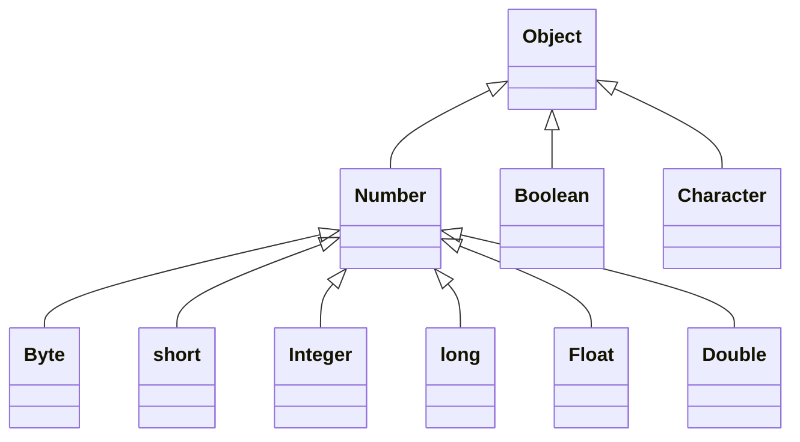
```mermaid
classDiagram
    Object <|-- Number
    Object <|-- Boolean
    Object <|-- Character
    Number <|-- Byte
    Number <|-- short
    Number <|-- Integer
    Number <|-- long
    Number <|-- Float
    Number <|-- Double
```

```text
                         ┌──────── Object ────────┐
                         └──────────▲───────────┘
                                    │
              ┌─────────────────────┼─────────────────────┐
              │                     │                     │
       ┌──────┴──────┐       ┌──────┴──────┐       ┌──────┴──────┐
       │ Number      │       │ Boolean     │       │ Character   │
       └──────▲──────┘       └─────────────┘       └─────────────┘
              │
   ┌──────┬───┴───┬───────┬──────┬───────┐
   │      │       │       │      │       │
┌──┴──┐┌──┴──┐┌───┴───┐┌──┴──┐┌──┴──┐┌───┴───┐
│Byte ││short││Integer││long ││Float││Double │
└─────┘└─────┘└───────┘└─────┘└─────┘└───────┘
```

## 🧬 Rules of inheritance

### Rule 1 :

* Single inheritance enables a child class to inherit from a single parent class.
* Single inheritance is permitted in Java.

```text
┌──────── Demo1 ────────┐
└──────────▲────────────┘
           │
┌──────────┴────────────┐
│ Demo2                 │
└───────────────────────┘
```

```java
class Demo1
{
	void disp1()
	{
		s.o.p("Learn from Leaders");
	}
}
class Demo2 extends Demo1
{
	void disp2()
	{
		s.o.p("Pioneering Edutainment");
	}
}
```

```java
class Launch
{
	p s v m(String[] args)
	{
		Demo2 d2 = new Demo2();
		d2.disp1(); // → method inherited from Demo1
		d2.disp2(); // → method defined in Demo2
	}
}
```

O/p:

```text
Learn from Leaders
Pioneering Edutainment.
```

### Rule 2 :

* In multi-level inheritance, a child class inherits from a parent class and the child class also acts as the parent class to another class.
* Multilevel inheritance is permitted in Java.

```text
┌──────── Demo 1 ───────┐
└──────────▲────────────┘
           │
┌──────────┴────────────┐
│ Demo 2                │
└──────────▲────────────┘
           │
┌──────────┴────────────┐
│ Demo 3                │
└───────────────────────┘
```

<!-- Source: PDF 3, Page 4 -->

```java
class Demo1
{
	void disp1()
	{
		s.o.p("Learn from Leaders");
	}
}
class Demo2 extends Demo1
{
	void disp2()
	{
		s.o.p("Pioneering Edutainment");
	}
}
class Demo3 extends Demo2
{
	void disp3()
	{
		s.o.p("Work is worship");
	}
}
```

```java
class Launch
{
	p s v m(String[] args)
	{
		Demo3 d3 = new Demo3();
		d3.disp1();
		d3.disp2();
		d3.disp3();
	}
}
```

O/p:

```text
Learn from Leaders
Pioneering Edutainment
Work is worship.
```

### Rule 3 :

* In hierarchical inheritance, one class serves as a parent class to more than one child class.
* Hierarchical inheritance is permitted in Java.

```text
              ┌──────── Demo1 ────────┐
              └──────────▲────────────┘
                         │
          ┌──────────────┼──────────────┐
          │              │              │
   ┌──────┴──────┐ ┌─────┴──────┐ ┌─────┴──────┐
   │ Demo2       │ │ Demo3      │ │ Demo4      │
   └─────────────┘ └────────────┘ └────────────┘
```

```java
class Demo1
{
}
class Demo2 extends Demo1
{
}
class Demo3 extends Demo1
{
}
class Demo4 extends Demo1
{
}
```

* Multilevel + Hierarchical inheritance

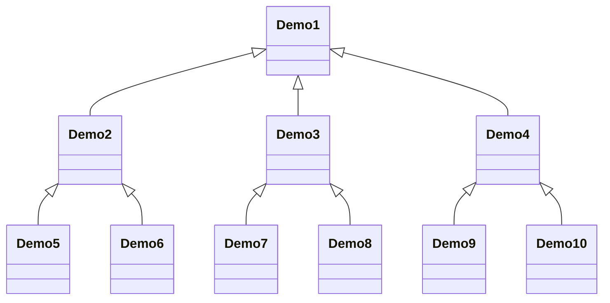
```mermaid
classDiagram
    Demo1 <|-- Demo2
    Demo1 <|-- Demo3
    Demo1 <|-- Demo4
    Demo2 <|-- Demo5
    Demo2 <|-- Demo6
    Demo3 <|-- Demo7
    Demo3 <|-- Demo8
    Demo4 <|-- Demo9
    Demo4 <|-- Demo10
```

```text
                         ┌────── Demo1 ──────┐
                         └─────────▲─────────┘
                                   │
              ┌────────────────────┼────────────────────┐
              │                    │                    │
       ┌──────┴──────┐      ┌──────┴──────┐      ┌──────┴──────┐
       │ Demo2       │      │ Demo3       │      │ Demo4       │
       └──────▲──────┘      └──────▲──────┘      └──────▲──────┘
              │                    │                    │
        ┌─────┴─────┐        ┌─────┴─────┐        ┌─────┴─────┐
        │           │        │           │        │           │
   ┌────┴────┐ ┌────┴────┐ ┌─┴────┐ ┌────┴────┐ ┌─┴────┐ ┌────┴────┐
   │ Demo5   │ │ Demo6   │ │Demo7 │ │ Demo8   │ │Demo9 │ │ Demo10  │
   └─────────┘ └─────────┘ └──────┘ └─────────┘ └──────┘ └─────────┘
```

<!-- Source: PDF 3, Page 5 -->

### Rule 4 :

* In multiple inheritance, a child class can inherit from more than one parent class.
* Multiple inheritance is not permitted in Java as it leads to ambiguity. This is popularly known as Diamond-shape problem.

```text
                    ┌──────── Object ────────┐
                    └──────────▲───────────┘
                               │
              ┌────────────────┴────────────────┐
              │                                 │
       ┌──────┴──────┐                   ┌──────┴──────┐
       │ Demo1       │  "Diamond-shape   │ Demo2       │
       └──────▲──────┘   problem"        └──────▲──────┘
              │                                 │
              └────────────────┬────────────────┘
                               │
                    ┌──────────┴──────────┐
                    │ Demo3               │
                    └─────────────────────┘
```

```text
┌──────── class Object ────────┐
│  { [ ] }                     │
└──────────────┬───────────────┘
               │
     ┌─────────┴─────────┐
     │                   │
┌────┴────────────────┐ ┌┴─────────────────────┐
│ class Demo1         │ │ class Demo2          │
│   extends Object    │ │   extends Object     │
│ {                   │ │ {                    │
│     int i=9;        │ │     int i=99;        │
│     [ ]             │ │     [ ]              │
│ }                   │ │ }                    │
└─────────┬───────────┘ └──────────┬───────────┘
          │                        │
          └───────────┬────────────┘
                      │
┌─────────────────────┴─────────────────────┐
│ class Demo3 extends Demo1, Demo2          │  ← compilation error
│ {                                         │
│     void disp()                           │
│     {                                     │
│         s.o.p(i);  ✗ Leads to ambiguity   │
│     }                                     │
│     [ ] [ ]                               │
│ }                                         │
└───────────────────────────────────────────┘
```

```java
class Object
{
	// [ ]
}
class Demo1 extends Object
{
	int i=9;
	// [ ]
}
class Demo2 extends Object
{
	int i=99;
	// [ ]
}
class Demo3 extends Demo1, Demo2 // compilation error
{
	void disp()
	{
		s.o.p(i); // ✗ Leads to ambiguity
	}
	// [ ] [ ]
}
```

### Rule 5 :

* Hybrid Inheritance is a combination of any two or more types of inheritance.
* Hybrid inheritance is conditionally permitted in Java.

<!-- Source: PDF 3, Page 6 -->

```text
              ┌──────── Demo1 ────────┐
              └──────────▲────────────┘
                         │ ✓
          ┌──────────────┼──────────────┐
          │                             │
   ┌──────┴──────┐               ┌──────┴──────┐
   │ Demo2       │               │ Demo3       │
   └──────▲──────┘               └──────▲──────┘
          │ ✓                           │ ✗
          └──────────────┬──────────────┘
                         │
              ┌──────────┴──────────┐
              │ Demo4               │
              └─────────────────────┘
```

```java
class Demo1 // ✓
{
}
class Demo2 extends Demo1 // ✓
{
}
class Demo3 extends Demo1 // ✓
{
}
class Demo4 extends Demo2, Demo3 // ✗
{
}
```

### Rule 6 :

* In Cyclic inheritance,
  - → A class inherits itself.
  - → Two classes inherits from each other forming a loop or a cycle.
* Cyclic inheritance is not permitted in Java.

```text
        ↻
┌──────── Demo1 ────────┐
└───────────────────────┘
```

```java
class Demo1 extends Demo1
{
}
```

```text
┌──────── Demo1 ────────┐
└──────────┬────────────┘
           │
           ▼
┌──────── Demo2 ────────┐
└──────────┬────────────┘
           │
           └──────► (back to Demo1)
```

```java
class Demo1 extends Demo2
{
}
class Demo2 extends Demo1
{
}
```

### Rule 7 :

* Private members of a class do not participate in inheritance.
* Private members are accessible only within the same class.
* This rule is implemented in order to preserve the pillar of encapsulation.
* However, the non-private members of the parent class can be inherited by the child class.

```text
┌──────── Parent ───────┐
└──────────▲────────────┘
           │
┌──────────┴────────────┐
│ child                 │
└───────────────────────┘
```

Eg1:

```java
class Parent
{
	private int acc_no = 12345;
	private int pwd = 1001;
}
class child extends Parent
{
	void accessProperties()
	{
		s.o.p(acc_no); // ✗
		s.o.p(pwd); // ✗
	}
}
```

<!-- Source: PDF 3, Page 7 -->

### Eg 2:

```java
class Parent
{
	private int acc_no = 12345;
	private int pwd = 1001;
	public String car = "Innova";
	protected String door_lock = "key";
	String food = "Burger"; // (default)
}
```

```java
class Child extends Parent
{
	void accessProperties()
	{
		s.o.p(acc_no); // ✗
		s.o.p(pwd); // ✗
		s.o.p(car); // ✓
		s.o.p(door_lock); // ✓
		s.o.p(food); // ✓
	}
}
```

> **NOTE:** The above rule holds good for both properties as well as methods.

### Rule 8 :

* Constructors of a class do not participate in inheritance.
* Though constructors do not get inherited, they will be executed because of the super() call.

```java
class Object
{
	public Object()
	{
	}
}

class Parent extends Object
{
	public Parent()
	{
		super(); // → calls Object()
		s.o.p("Parent constructor");
	}
}

class Child extends Parent
{
	public Child()
	{
		super(); // → calls Parent()
		s.o.p("Child constructor");
	}
}

class Launch
{
	p s v m(String[] args)
	{
		Child c = new Child(); // → calls Child()
	}
}
```

O/p :-

```text
Parent constructor
Child constructor.
```

---

<!-- Source: PDF 3, Page 8 -->

## 📊 Unified Modeling Language (UML) :-

### Software Development Life Cycle (SDLC) :

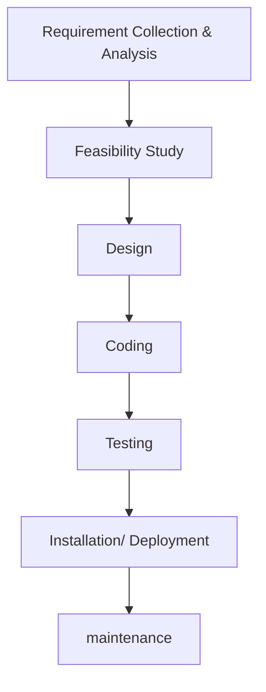
```mermaid
flowchart TD
    A[Requirement Collection & Analysis] --> B[Feasibility Study]
    B --> C[Design]
    C --> D[Coding]
    D --> E[Testing]
    E --> F[Installation/ Deployment]
    F --> G[maintenance]
```

```text
┌───────────────────────────────┐
│ Requirement Collection &      │
│ Analysis                      │
└───────────────┬───────────────┘
                │
                └──────► ┌──────────────────┐
                         │ Feasibility Study│
                         └────────┬─────────┘
                                  │
                                  └──────► ┌────────┐
                                           │ Design │
                                           └───┬────┘
                                               │
                                               └──────► ┌────────┐
                                                        │ Coding │
                                                        └───┬────┘
                                                            │
                                                            └──────► ┌─────────┐
                                                                     │ Testing │
                                                                     └────┬────┘
                                                                          │
                                                                          └──────► ┌───────────────────────┐
                                                                                   │ Installation/        │
                                                                                   │ Deployment           │
                                                                                   └──────────┬────────────┘
                                                                                              │
                                                                                              └──────► ┌─────────────┐
                                                                                                       │ maintenance │
                                                                                                       └─────────────┘
```

### Design:

* class Diagram
* Object Diagram
* Use case Diagram
* state Diagram
* Sequence Diagram
* Activity Diagram.

<!-- Source: PDF 3, Page 9 -->

## 📊 class Diagram:

6/4/23

```text
┌─────────────────────────────────────────────┐
│ Player                          ← class Name│
├─────────────────────────────────────────────┤
│ + name : String                             │
│ # age : int              Attributes         │
│ ~ isMarried : boolean    (has-part)         │
│ - weight : float                            │
│   ↑ visibility                              │
├─────────────────────────────────────────────┤
│ + game() : void          Operation          │
│ + workout() : void       (does-part)        │
└──────────────────────▲──────────────────────┘
                       │
                       │ ← Relationship
                       │
┌──────────────────────┴──────────────────────┐
│ Cricketer                                   │
├─────────────────────────────────────────────┤
│ ~ runs : int                                │
│ ~ team : String                             │
├─────────────────────────────────────────────┤
│ - running() : int                           │
│ - bowling() : void                          │
└─────────────────────────────────────────────┘
```

```java
class Player
{
	public String name;
	protected int age;
	boolean isMarried;
	private float weight;

	public void game()
	{
		s.o.p("Player plays a game");
	}
	public void workout()
	{
		s.o.p("Player is working out");
	}
}
```

```java
class Cricketer extends Player
{
	int runs;
	String team;

	private int running()
	{
		s.o.p("Cricketer is running");
		return 1;
	}
	private void bowling()
	{
		s.o.p("It's spin ball");
	}
}
```

## 📊 UML :

The Unified Modeling Language (UML) is a general purpose, development, modeling language in the field of software engineering that is intended to provide a standard way to visualize the design of a system.

<!-- Source: PDF 3, Page 10 -->

## 📊 Class Diagram:

In software engineering, a class diagram in the UML describes the structure of a system by showing the system's classes, their attributes, operations and the relationships among objects.

### Structure:

Each class is represented as a rectangle with 3 sections.

* The upper section contains the name of the class.
* The middle section contains the "has-part" of the class.
* The lower section contains the "does-part" of the class.

### Visibility:

There are 4 access modifiers in Java, namely

1) public
2) protected
3) \<default\>
4) private.

The visibility of the members in a class diagram can be represented with the following symbols:

| Visibility | modifier |
| :--- | :--- |
| + | public |
| # | protected |
| ~ | \<default\> |
| - | private |

<!-- Source: PDF 3, Page 11 -->

## 🔑 Access modifiers / Access specifiers in Java:

**Access modifiers (Java):**
- public, protected, \<default\>, private
- static, final, synchronized etc.

**Access Specifiers (Other languages — c, c++ etc):**
- AS → public, protected, \<default\>, private
- AM → static

### Java Project

```
┌──────────────────────── Java Project ────────────────────────┐
│                                                              │
│  ┌──────── Pack 1 ────────┐    ┌──────── pack 2 ────────┐  │
│  │ package pack1;         │    │ package pack2;         │  │
│  │                        │    │ import pack1.*;        │  │
│  │ public class Demo1     │    │                        │  │
│  │ {                      │    │ class Demo3            │  │
│  │   public int a;    ✓   │    │   extends Demo1        │  │
│  │   protected int b; ✓   │    │ {                      │  │
│  │   int c;           ✓   │    │   a;  ✓                │  │
│  │   private int d;   ✓   │    │   b;  ✓                │  │
│  │ }                      │    │   c;  ✗                │  │
│  │                        │    │   d;  ✗                │  │
│  │ class Demo2            │    │ }                      │  │
│  │   extends Demo1        │    │                        │  │
│  │ {                      │    │ class Demo4            │  │
│  │   a;  ✓                │    │ {                      │  │
│  │   b;  ✓                │    │   a;  ✓                │  │
│  │   c;  ✓                │    │   b;  ✗                │  │
│  │   d;  ✗                │    │   c;  ✗                │  │
│  │ }                      │    │   d;  ✗                │  │
│  └────────────────────────┘    │ }                      │  │
│                                └────────────────────────┘  │
└──────────────────────────────────────────────────────────────┘
```

* Access modifiers are keywords that are used to define accessibility (visibility) of members of a class.

### Access levels:

| Access Modifiers | Within the same class | Outside the class but in the same package (related/unrelated classes) | outside the package but in the related classes | outside the package & in unrelated classes |
| :--- | :---: | :---: | :---: | :---: |
| **public** | ✓ | ✓ | ✓ | ✓ |
| **protected** | ✓ | ✓ | ✓ | ✗ |
| **\<default\>** (no modifier) | ✓ | ✓ | ✗ | ✗ |
| **private** | ✓ | ✗ | ✗ | ✗ |

<!-- Source: PDF 3, Page 12 -->

## 🔑 Following are the access modifiers in Java,

- **(+) public :** public members are accessible everywhere in the project.
- **(#) protected :** protected members are accessible anywhere within the same package and outside the package in related class.
- **(~) default :** default members are accessible only within the same package (package - private modifier).
- **(-) private :** private members are accessible only within the same class.

> **NOTE:**

```
        ┌─────────────┐
        │   public    │  → strongest
       /───────────────\
      │   protected    │  → stronger
     /─────────────────\
    │   <default>       │  → strong
   /───────────────────\
  │     private         │  → weakest
  └─────────────────────┘

  ↓ Accessibility Decreases       ↑ Accessibility Increases
    <OR> More Restrictive           <OR> Less Restrictive
```

* There are two levels of access control:
  1. At the top-level : public & \<default\>
  2. At the member-level : public, protected, \<default\> & private

## 🔑 Packages in Java

* A package is a container of a group of related classes

**Syntax:** `package package_name;`

**naming convention for packages:** Packages are named in reverse order of domain names.

**Eg:** `package com.gqt.pack1;`

**import statement in Java:** The 'import' keyword is used to import inbuilt & user-defined packages.

<!-- Source: PDF 3, Page 13 -->

## 🔑 Accessing package members :

1) **Using fully-qualified name (without using import statement)**

```java
java.util.Scanner scan = new java.util.Scanner(System.in);
```

*(bracket under `java.util.Scanner` → fully-qualified class name)*

2) **Importing a specific package member.**

```java
import java.util.Scanner;
import java.util.ArrayList;

Scanner scan = new Scanner(System.in);
ArrayList al = new ArrayList();
```

3) **Importing an entire package.**

```java
import java.util.*;

Scanner scan = new Scanner(System.in);
ArrayList al = new ArrayList();
```

> **NOTE:** `import java.*;`
>
> It will only import the members of "java" package & not the members of its sub-packages (util, math etc)

* `java.lang` package contains classes that are fundamental to the design of java. Hence it is by default imported in every java program

## ⚙️ static import statement in Java: (7/4/23)

With the help of static import, we can access the static member of a class directly without using class name @ any object.

```java
class Launch
{
    psvm(String[] args)
    {
        s.o.p(Math.max(5,6)); //6
        s.o.p(Math.min(5,6)); //5
        s.o.p(Math.PI); //3.141592653589793
        s.o.p(Math.sqrt(25)); //5.0
        s.o.p(Math.cbrt(8)); //2.0
        s.o.p(Math.pow(2,3)); //8.0
        s.o.p(Math.abs(-25.6)); //25.6
        s.o.p(Math.ceil(8.6)); //9.0 (double)
        s.o.p(Math.floor(8.6)); //8.0
        s.o.p(Math.round(8.6)); //9 (int)
```

<!-- Source: PDF 3, Page 14 -->

```java
        s.o.p(Math.sin(0)); //0.0
        s.o.p(Math.cos(0)); //1.0
        s.o.p(Math.tan(0)); //0.0
        s.o.p(Math.toDegrees(45)); //2578.3100780887044
        s.o.p(Math.toRadians(45)); //0.78539
        s.o.p(Math.log(4.5)); //1.5040773967762742
        s.o.p(Math.log10(4.5)); //0.6532125137753437
        s.o.p(Math.random() * 100); //24.689646117047083
    }
}
```

From Java 5,

```java
import static java.lang.Math.*;
```

*(arrow from `*` → all static members from math class are imported.)*

```java
class Launch
{
    psvm(String[] args)
    {
        s.o.p(PI);
        s.o.p(max(5,6));
        s.o.p(min(5,6));
        s.o.p(sqrt(25));
        s.o.p(cbrt(8));
        s.o.p(pow(2,3));
        s.o.p(abs(25.6));
        s.o.p(ceil(8.6));
        s.o.p(floor(8.6));
        s.o.p(round(8.6));
        s.o.p(sin(0));
        s.o.p(cos(0));
        s.o.p(tan(0));
        s.o.p(toDegrees(45));
        s.o.p(toRadians(45));
        s.o.p(log(4));
        s.o.p(log10(4));
        s.o.p(random());
    }
}
```

<!-- Source: PDF 3, Page 15 -->

> **NOTE:** java.lang
>
> ```java
> final class Math
> {
>     static double PI = 3.1415...;
>     static max()
>     {
>         ---
>     }
>     static min()
>     static round()
>     static abs()
> }
> ```

> **NOTE:**
> * The Math class contains methods for performing basic numeric operation.
> * Math class is also called as utility class @ generic class.

## 🧬 Types of methods in Inheritance:

```
 Parent                    child
┌─────────────┐         ┌─────────────┐
│ height      │ - - - - │ height      │ ⎫ Inherited
│ skin-color  │ - - - - │ skin-color  │ ⎭
│ nose        │ - - - - │ nose        │ ⎫
│ eyes        │ - - - - │ eyes        │ ⎪ Overridden
│ hair        │ - - - - │ hair        │ ⎪
│ teeth       │ - - - - │ teeth       │ ⎭
│             │         │ code        │ ⎫
│             │         │ rain        │ ⎪
│             │         │ dance       │ ⎪ Specialized
│             │         │ paint       │ ⎪
│             │         │ kickboxing  │ ⎭
└─────────────┘         └─────────────┘
```

In the context of inheritance, we can categorize the method into 3 categories, namely,
1) Inherited methods
2) Overriden methods
3) Specialized methods

### 1) Inherited methods:

There are such methods which have been inherited from the parent class and used as it is.

**Advantage:** code Reusability.

### 2) Overridden methods:

There are such methods which have been inherited from the parent class and modified to suit the expectations of the child class.

**Advantages:** can change the behavior according to the expectations of the child class.

<!-- Source: PDF 3, Page 16 -->

### 3) Specialized Methods:

There are such methods which are present only in the child class and not in the parent class.

**Advantage:** Enhances the features & functionalities of the child class.

#### Plane Hierarchy:

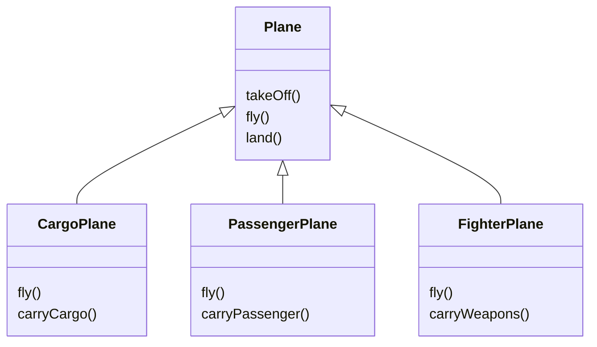
```mermaid
classDiagram
    class Plane {
        takeOff()
        fly()
        land()
    }
    class CargoPlane {
        fly()
        carryCargo()
    }
    class PassengerPlane {
        fly()
        carryPassenger()
    }
    class FighterPlane {
        fly()
        carryWeapons()
    }
    Plane <|-- CargoPlane
    Plane <|-- PassengerPlane
    Plane <|-- FighterPlane
```

```java
class Plane
{
    public void takeOff()
    {
        s.o.p("Plane is taking off...");
    }
    public void fly()
    {
        s.o.p("Plane is flying...");
    }
    public void land()
    {
        s.o.p("Plane is landing...");
    }
}

class CargoPlane extends Plane
{
    // Overridden method
    public void fly()
    {
        s.o.p("CargoPlane is flying at lower height...");
    }
    // Specialized method
    public void carryCargo()
    {
        s.o.p("CargoPlane is carrying goods...");
    }
}

class PassengerPlane extends Plane
{
    // Overridden method
    public void fly()
```

<!-- Source: PDF 3, Page 17 -->

```java
    {
        s.o.p("PassengerPlane is flying at medium height...");
    }
    // specialized method
    public void carryPassenger()
    {
        s.o.p("PassengerPlane carrying Passenger...");
    }
}

class FighterPlane extends Plane
{
    // Overriden method
    public void fly()
    {
        s.o.p("FighterPlane is flying at higher height...");
    }
    // Specialized method
    public void carryWeapons()
    {
        s.o.p("FighterPlane is carrying weapons...");
    }
}

class Launch
{
    p s v m (String[] args)
    {
        CargoPlane cp = new CargoPlane();
        PassengerPlane pp = new PassengerPlane();
        FighterPlane fp = new FighterPlane();

        cp.takeOff();
        cp.fly();
        cp.carryCargo();
        cp.land();

        s.o.p();

        pp.takeOff();
        pp.fly();
        pp.carryPassenger();
        pp.land();

        s.o.p();

        fp.takeOff();
        fp.carryWeapons();
        fp.land();
    }
}
```

<!-- Source: PDF 3, Page 18 -->

**O/p:**

```text
Plane is taking off...
CargoPlane is flying at lower height...
CargoPlane is carrying goods...
Plane is landing...

Plane is taking off...
PassengerPlane is flying at medium height...
PassengerPlane is carrying Passenger...
Plane is landing...

Plane is taking off...
FighterPlane is flying at higher height...
FighterPlane is carrying weapons...
Plane is landing...
```

#### Animal Hierarchy:

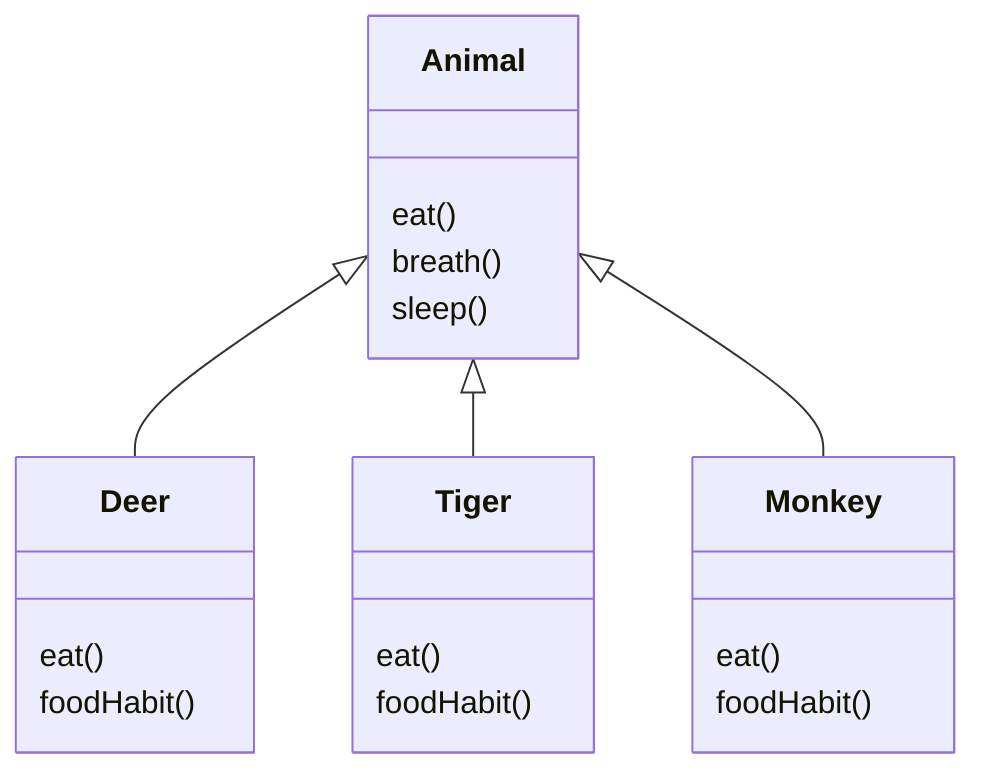
```mermaid
classDiagram
    class Animal {
        eat()
        breath()
        sleep()
    }
    class Deer {
        eat()
        foodHabit()
    }
    class Tiger {
        eat()
        foodHabit()
    }
    class Monkey {
        eat()
        foodHabit()
    }
    Animal <|-- Deer
    Animal <|-- Tiger
    Animal <|-- Monkey
```

```java
class Animal
{
    public void eat()
    {
        s.o.p("Animal is eating...");
    }
    public void breath()
    {
        s.o.p("Animal is breathing...");
    }
    public void sleep()
    {
        s.o.p("Animal is sleeping...");
    }
}
```

<!-- Source: PDF 3, Page 19 -->

```java
class Deer extends Animal
{
    // Overridden method
    public void eat()
    {
        s.o.p("Deer grazes & eats...");
    }
    // Specialized method
    public void foodHabit()
    {
        s.o.p("Deer is a Herbivorous Animal...");
    }
}

class Tiger extends Animal
{
    // Overridden method
    public void eat()
    {
        s.o.p("Tiger hunts & eats...");
    }
    // Specialized method
    public void foodHabit()
    {
        s.o.p("Tiger is a carnivorous Animal...");
    }
}

class Monkey extends Animal
{
    // Overridden method
    public void eat()
    {
        s.o.p("Monkey steals & eats...");
    }
    // Specialized method
    public void foodHabit()
    {
        s.o.p("Monkey is omnivorous Animal...");
    }
}

class Launch
{
    p s v m(String[] args)
    {
        Deer d = new Deer();
        Tiger t = new Tiger();
        Monkey m = new Monkey();

        d.eat();
        d.breath();
        d.sleep();
        d.foodHabit();
        s.o.p();
```

**O/P:**

```text
Deer grazes & eats...
Animal is breathing...
Animal is sleeping
Deer is a Herbivorous Animal...
```

<!-- Source: PDF 3, Page 20 -->

```java
        t.eat();
        t.breath();
        t.sleep();
        t.foodHabit();

        s.o.p();

        m.eat();
        m.breath();
        m.sleep();
        m.foodHabit();
    }
}
```

```text
Tiger hunts & eats...
Animal is breathing...
Animal is sleeping...
Tiger is a carnivorous Animal...

Monkey steals & eats...
Animal is breathing...
Animal is sleeping...
Monkey is Omnivorous Animal...
```

## 📖 Vehical Hierarchy

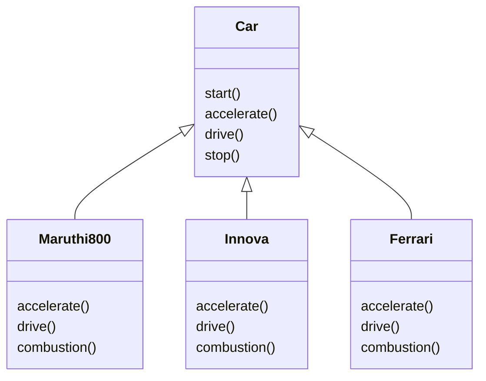
```mermaid
classDiagram
    class Car {
        start()
        accelerate()
        drive()
        stop()
    }
    class Maruthi800 {
        accelerate()
        drive()
        combustion()
    }
    class Innova {
        accelerate()
        drive()
        combustion()
    }
    class Ferrari {
        accelerate()
        drive()
        combustion()
    }
    Car <|-- Maruthi800
    Car <|-- Innova
    Car <|-- Ferrari
```

```java
class Car
{
    public void start()
    {
        s.o.p("car is starting...");
    }
    public void accelerate()
    {
        s.o.p("car accelerates upto its maximum speed...");
    }
    public void drive()
    {
        s.o.p("car is driven by shifting gear...");
    }
    public void stop()
    {
        s.o.p("car is stopping...");
    }
}
```

<!-- Source: PDF 3, Page 21 -->

```java
class Maruti800 extends car
{
	//Overridden method
	public void accelerate()
	{
		s.o.p("Maruti800 accelerates upto 120 km/hr");
	}

	// Overridden method
	public void drive()
	{
		s.o.p("Maruti800 is driven by manual gear system");
	}

	//specialized method.
	public void combustion()
	{
		s.o.p("maruti800 has petrol engine");
	}
}

class Innova extends car
{
	//overridden method
	public void accelerate()
	{
		s.o.p("Innova accelerates upto 140 km/hr");
	}

	//overridden method
	public void drive()
	{
		s.o.p("Innova is driven by automatic gear system");
	}

	//specialized method
	public void combustion()
	{
		s.o.p("Innova has diesel engine");
	}
}

class Ferrari extends car
{
	// overridden method
	public void accelerate()
	{
		s.o.p("Ferrari accelerates upto 340 km/hr");
	}

	// overridden method
	public void drive()
	{
		s.o.p("Ferrari is driven by turbo gear system");
	}

	//specialized method
	public void combustion()
	{
		s.o.p("Ferrari has white petrol engine");
	}
}
```

<!-- Source: PDF 3, Page 22 -->

```java
class Launch
{
	p s v m(String[] args)
	{
		Maruti800 m = new Maruti800();
		Innova i = new Innova();
		Ferrari f = new Ferrari();

		m.start();
		m.drive();
		m.accelerate();
		m.combustion();
		m.stop();
		s.o.p();

		i.start();
		i.drive();
		i.accelerate();
		i.combustion();
		i.stop();
		s.o.p();

		f.start();
		f.drive();
		f.accelerate();
		f.combustion();
		f.stop();
	}
}
```

**O/P:**

```text
car is starting
Maruti800 is driven by manual gear system.
Maruti800 accelerate upto 120 km/hr.
Maruti800 has a petrol engine.
car is stoping.

car is starting
Innova accelerate upto 180 km/hr.
Innova is driven by automatic gear system.
Innova has a diesel engine.
car is stopping.

car is starting
Ferrari accelerate upto 340 km/hr.
Ferrari is driven by turbo gear system.
Ferrari has a white engine.
car is stopping.
```

## 📖 Method Overriding in Java: 8/4/23

Method Overriding allows a child class to re-implement a method which is inherited from the parent class.

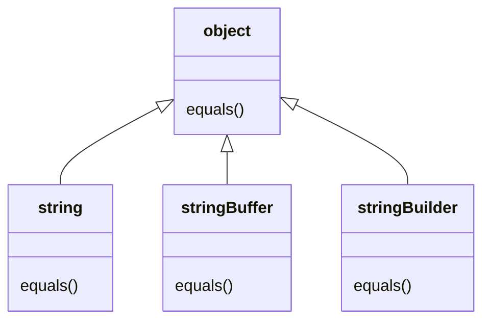
```mermaid
classDiagram
	class object {
		equals()
	}
	class string {
		equals()
	}
	class stringBuffer {
		equals()
	}
	class stringBuilder {
		equals()
	}
	object <|-- string
	object <|-- stringBuffer
	object <|-- stringBuilder
```

- **object** → `equals()` → compares the references of the objects
- **string** → `equals()` → compares data present in the objects
- **stringBuffer** → `equals()` → compares the reference of the objects
- **stringBuilder** → `equals()` → compares the reference of the objects

<!-- Source: PDF 3, Page 23 -->

## 📋 Rules of method Overriding:

### Rule 1:
Access level of the overriden method in the child class cannot be more restrictive - in other words, the child class overridden method must retain the same access modifier as that of the parent class of overriden method. However, it's possible to change the access modifier of the overriden method in the child class provided it is less restrictive.

Eg:

```java
class Animal
{
	protected void eat()
	{
		s.o.p("Animal is eating");
	}
}

class Monkey extends Animal
{
	/*
	  ✓ protected ──┐
	  ✗ <default> ──┤
	  ✗ private   ──┼──▶ [ ] void eat()
	  ✓ public    ──┘
	*/
	void eat()
	{
		s.o.p("Monkey steals and eats");
	}
}
```

### Rule 2:
Return type of the overriden method can not be changed (primitive return types).

Example:

```java
class Animal
{
	protected void eat()
	{
		s.o.p("Animal is eating");
	}
}

class Monkey extends Animal
{
	public int eat() // ✗ int (cannot change)
	{
		s.o.p("Monkey steals and eats");
		return 0;
	}
}
```

### Rule 3:
However, it is possible to change the return-type provided they are co-variant return types.

```java
class Plane
{
}

class Cargoplane extends Plane
{
}
```

<!-- Source: PDF 3, Page 24 -->

```java
class Animal
{
	public Plane eat() // CargoPlane ✗
	{
		S.o.p("Animal is eating");
		Plane p = new Plane();
		return p;
	}
}

class Monkey extends Animal
{
	public CargoPlane eat() // Plane ✗
	{
		S.o.p("Monkey is eating");
		CargoPlane cp = new CargoPlane();
		return cp;
	}
}
```

> **NOTE:** Covariant return types: It is possible to have different return type for overriding method in the child class provided overridden method & return type should be a sub-type of parent class method's return type. In this way, overriding method becomes variant with respect to return type. This was possible from JDK 1.5 onward.

### Rule 3:
The argument list should be exactly the same as that of the parent class method.

```java
class Animal
{
	public void eat(String name, int cost)
	{
		S.o.p("Animal is eating");
	}
}

class Monkey extends Animal
{
	public void eat(String name) // No error → overloaded method
	{
		S.o.p("Monkey steals and eats");
	}
}
```

### Rule 4:
Private members cannot be overridden as they don't participate in inheritance.

```java
class Animal
{
	private void eat()
	{
		S.o.p("Animal is eating");
	}
}
```

<!-- Source: PDF 3, Page 25 -->

```java
class Monkey extends Animal
{
	public void eat() // no error ---- specialized method
	{
		s.o.p("Monkey steals and eats");
	}
}
```

### Rule 5:
Constructor cannot be overridden as they don't participate in inheritance.

```java
class Animal
{
	Animal()
	{
		s.o.p("Parent constructor");
	}
}

class Monkey extends Animal
{
	// ✗ Animal()
	Animal()
	{
		s.o.p("Child constructor");
	}
}
```

> **NOTE:** In method overriding, the method in the parent class is called **overridden method** and the method in the child class is called **overriding method**.

Example:

```java
class Parent
{
	void disp() // ← Overridden
	{
		// ≡
	}
}

class child extends Parent
{
	void disp() // ← Overriding
	{
		// ≡
	}
}
```

## 📊 Differences b/w method overloading & method overriding :-

| Method Overloading | Method Overriding |
| :--- | :--- |
| * Methods have the same name but with **different** parameters | * Methods have the same name with **same** parameter. |
| * Occurs in the same class | * Occurs between parent class & child class. |
| * Return type must be same or different. | * Return types must be same or covariant. |
| * Facilitates ease of use | * Facilitates specific implementation for child classes. |

<!-- Source: PDF 3, Page 26 -->

| Method Overloading | Method Overriding |
| :--- | :--- |
| * comparatively high in performance | * comparatively low in performance. |
| * Promotes compile time polymorphism | * Promotes run-time polymorphism |
| * Static methods can be overloaded. | * Static methods can't be overridden |

## 🧬 Constructor execution in inheritance: (10/4/23)

### Case 1:
Whenever a child class object is created, the parent class constructor will be executed first followed by the child class constructor. It is because of the `super()` call.

```java
class Object
{
	public Object()
	{
	}
}

class Demo1 extends Object
{
	int a;
	int b;
	public Demo1()
	{
		super(); // → Object()
		a = 10;
		b = 20;
	}
	public Demo1(int i, int j)
	{
		super();
		a = i;
		b = j;
	}
}

class Demo2 extends Demo1
{
	int c;
	int d;
	public Demo2()
	{
		super(); // → Demo1()
		c = 30;
		d = 40;
	}
	public Demo2(int m, int n)
	{
		super();
		c = m;
		d = n;
	}
	void disp()
	{
		s.o.p(a);
		s.o.p(b);
		s.o.p(c);
		s.o.p(d);
	}
}

class Launch
{
	p s v m(String[] args) // JVM
	{
		Demo2 d2 = new Demo2(); // → Demo2()
		d2.disp();
	}
}
```

**Execution flow (dashed arrows):**
`new Demo2()` → `Demo2()` → `super()` → `Demo1()` → `super()` → `Object()` → back to `Demo1()` (a=10, b=20) → back to `Demo2()` (c=30, d=40) → back to `main` → `d2.disp()`

**Memory:**

```text
Stack:  d2 → 1000
Heap @1000 [Demo2]:
  a: ~~0~~ 10
  b: ~~0~~ 20
  c: ~~0~~ 30
  d: ~~0~~ 40
```

**O/P:**

```text
10
20
30
40
```

<!-- Source: PDF 3, Page 27 -->

### Case 2:
Whether a parameterized or zero-parameterized constructor of the child class is invoked, it is always the zero-parameterized constructor of the parent class that will be invoked implicitly.

```java
class Object
{
	public Object()
	{
	}
}

class Demo1 extends Object
{
	int a;
	int b;
	public Demo1()
	{
		super(); // → Object()
		a = 10;
		b = 20;
	}
	public Demo1(int i, int j)
	{
		super();
		a = i;
		b = j;
	}
}

class Demo2 extends Demo1
{
	int c;
	int d;
	public Demo2()
	{
		super();
		c = 30;
		d = 40;
	}
	public Demo2(int m, int n) // m=100, n=200
	{
		super(); // → Demo1() (zero-parameterized)
		c = m; // 100
		d = n; // 200
	}
	void disp()
	{
		s.o.p(a);
		s.o.p(b);
		s.o.p(c);
		s.o.p(d);
	}
}

class Launch
{
	psvm(string[] args) // JVM
	{
		Demo2 d2 = new Demo2(100, 200); // → Demo2(int m, int n)
		d2.disp();
	}
}
```

**Execution flow (dashed arrows):**
`new Demo2(100, 200)` → `Demo2(int m, int n)` → `super()` → `Demo1()` → `super()` → `Object()` → back → a=10, b=20 → back → c=100, d=200 → `d2.disp()`

**Memory:**

```text
d2 → 1000
Heap @1000 [Demo2]:
  a: ~~0~~ 10
  b: ~~0~~ 20
  c: ~~0~~ 100
  d: ~~0~~ 200
```

**O/P:**

```text
10
20
100
200
```

<!-- Source: PDF 3, Page 28 -->

### Case 3:
If the parameterized constructor of the parent class must be invoked from the child class constructor then **super() call should be invoked explicitly.**

```java
class Object
{
	public Object()
	{
	}
}

class Demo1 extends Object
{
	int a;
	int b;
	public Demo1()
	{
		super();
		a = 10;
		b = 20;
	}
	public Demo1(int i, int j) // i=100, j=200
	{
		super(); // → Object()
		a = i;
		b = j;
	}
}

class Demo2 extends Demo1
{
	int c;
	int d;
	public Demo2()
	{
		super();
		c = 30;
		d = 40;
	}
	public Demo2(int m, int n) // m=100, n=200
	{
		super(m, n); // → Demo1(int i, int j)  [explicit]
		c = m;
		d = n;
	}
	void disp()
	{
		s.o.p(a);
		s.o.p(b);
		s.o.p(c);
		s.o.p(d);
	}
}

class Launch
{
	p s v m(String[] args) // JVM
	{
		Demo2 d2 = new Demo2(100, 200); // → Demo2(int m, int n)
		d2.disp();
	}
}
```

**Execution flow (dashed arrows):**
`new Demo2(100, 200)` → `Demo2(int m, int n)` → `super(m, n)` → `Demo1(int i, int j)` → `super()` → `Object()` → back → a=100, b=200 → back → c=100, d=200 → `d2.disp()`

**Memory:**

```text
d2 → 1000
Heap @1000 [Demo2]:
  a: ~~0~~ 100
  b: ~~0~~ 200
  c: ~~0~~ 100
  d: ~~0~~ 200
```

**o/p:**

```text
100
200
100
200
```

<!-- Source: PDF 3, Page 29 -->

### Case 4:
`super()` call or `this()` call must always be the first statement within a constructor.

```java
class Demo1
{
	int a;
	int b;
	public Demo1()
	{
		a = 10;
		b = 20;
	}
	public Demo1(int i, int j)
	{
		a = i;
		b = j;
	}
}

class Demo2 extends Demo1
{
	int c;
	int d;
	public Demo2()
	{
		c = 30;
		d = 40;
	}
	public Demo2(int m, int n)
	{
		c = m;
		d = n;
		super(m, n); // ✗ Compilation Error
	}
	void disp()
	{
		s.o.p(a);
		s.o.p(b);
		s.o.p(c);
		s.o.p(d);
	}
}

class Launch
{
	p s v m (String[] args)
	{
		Demo2 d2 = new Demo2(100, 200);
		d2.disp();
	}
}
```

<!-- Source: PDF 3, Page 30 -->

### Case 5:
If the constructor of a class intends to invoke another constructor of the same class then `this()` call must be used.

```java
class Object
{
	public Object()
	{
	}
}

class Demo1
{
	int a, b;
	public Demo1()
	{
		super();
		a = 100;
		b = 200;
	}
	public Demo1(int i, int j) // i=10, j=20
	{
		this();
		a = i;
		b = j;
	}
}

class Demo2 extends Demo1
{
	int c, d;
	public Demo2()
	{
		super();
		c = 30;
		d = 40;
	}
	public Demo2(int x, int y) // x=10, y=20
	{
		super(x, y);
		c = x;
		d = y;
	}
	public Demo2(int m, int n, int o, int p) // m=10, n=20, o=30, p=40
	{
		this(m, n);
		c = o;
		d = p;
	}
	void disp()
	{
		s.o.p(a);
		s.o.p(b);
		s.o.p(c);
		s.o.p(d);
	}
}

class Launch
{
	p s v m (String[] args) // JVM
	{
		Demo2 d2 = new Demo2(10, 20, 30, 40);
		d2.disp();
	}
}
```

**Execution flow (dashed arrows):**

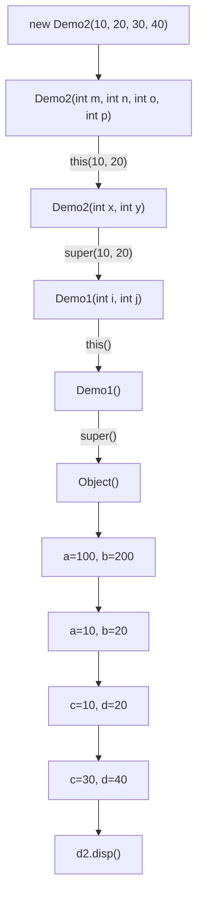
```mermaid
flowchart TD
	A["new Demo2(10, 20, 30, 40)"] --> B["Demo2(int m, int n, int o, int p)"]
	B -->|"this(10, 20)"| C["Demo2(int x, int y)"]
	C -->|"super(10, 20)"| D["Demo1(int i, int j)"]
	D -->|"this()"| E["Demo1()"]
	E -->|"super()"| F["Object()"]
	F --> E2["a=100, b=200"]
	E2 --> D2["a=10, b=20"]
	D2 --> C2["c=10, d=20"]
	C2 --> B2["c=30, d=40"]
	B2 --> G["d2.disp()"]
```

**Memory / value trace:**

```text
a: ~~0~~ ~~100~~ 10
b: ~~0~~ ~~200~~ 20
c: ~~0~~ ~~10~~ 30
d: ~~0~~ ~~20~~ 40
```

**O/P:**

```text
10
20
30
40
```

<!-- Source: PDF 3, Page 31 -->

## 🧩 Special cases of this & super keywords:

### Eg 1:

```java
class Demo1
{
	int i = 9;
}
class Demo2 extends Demo1
{
	int i = 99; // variable hiding
	void disp()
	{
		s.o.p(i); // 99
		s.o.p(super.i); // 9
	}
}
```

### Eg 2:

```java
class Demo1
{
	int i = 9;
}
class Demo2 extends Demo1
{
	int i = 99;
	void disp()
	{
		int i = 999;
		s.o.p(i); // 999
		s.o.p(this.i); // 99
		s.o.p(super.i); // 9
	}
}
```

### Eg 3:

```java
class Demo1
{
	int i = 9;
}
class Demo2 extends Demo1
{
	int i = 99;
}
class Demo3 extends Demo2
{
	int i = 999;
	void disp()
	{
		s.o.p(i); // 999
		s.o.p(super.i); // 99
		s.o.p(super.super.i); // ✗
	}
}
```

### Eg 4:

```java
class Demo1
{
	void disp()
	{
		s.o.p("Learn from Leaders");
	}
}
class Demo2 extends Demo1
{
	void disp()
	{
		s.o.p("Pioneering Edutainment");
		super.disp();
	}
}
```

## 🧬 static - inheritance :

(11/4/23)

### Eg 1:

```java
class Parent
{
	static int i = 100;
	static
	{
		sMethod1();
		s.o.p("Parent 1st static block");
	}
	public static void main(String[] args)
	{
		s.o.p("Parent main()");
		sMethod1();
	}
	public static void sMethod1()
	{
		s.o.p(j);
	}
	static
	{
		s.o.p("Parent 2nd static block");
	}
	static int j = 200;
}
```

```text
javac GAT.java
        │
        ▼
┌─────────────────────┐
│ Parent.class        │
│ Bytecode (ILL)      │
└─────────────────────┘
        │
        ▼
   java Parent
```

```text
Class Loader
      │
      ▼
Execution Engine
```

**Heap Area:**

```text
i | ~~0~~ 100
j | ~~0~~ 200
```

1) Memory allocation with default values for static variables.
2) Static variable assignments & static blocks execution sequentially.
3) Execution of main() method.

**O/P:**

```text
0
Parent 1st static block
Parent 2nd static block
Parent main()
200
```

<!-- Source: PDF 3, Page 32 -->

## 🧩 Example 2:

```text
javac E2T.java
      │
      ├──────────────────┐
      ▼                  ▼
┌──────────────┐   ┌──────────────┐
│ Parent.class │   │ child.class  │
│ Bytecode(ILL)│   │ Bytecode(ILL)│
└──────────────┘   └──────────────┘
                         │
                         ▼
                    java child
```

```java
class Parent
{
	static int i = 100;
	static
	{
		method1();
		s.o.p("Parent 1st static block");
	}
	p s v m(String[] args)
	{
		s.o.p("Parent main()");
		method1();
	}
	public static void method1()
	{
		s.o.p(i);
	}
	static
	{
		s.o.p("Parent 2nd static block");
	}
	static int j = 200;
}
```

```java
class child extends Parent
{
	static int x = 10;
	static
	{
		method2();
		s.o.p("child 1st static block");
	}
	p s v m(String[] args)
	{
		s.o.p("child main()");
		method2();
	}
	public static void method2()
	{
		s.o.p(y);
	}
	static
	{
		s.o.p("child 2nd static block");
	}
	static int y = 20;
}
```

**O/P:**

```text
0
Parent 1st static block
Parent 2nd static block
0
child 1st static block
child 2nd static block
child main()
20
```

**Heap Area:**

```text
i | ~~0~~ 100
j | ~~0~~ 200
x | ~~0~~ 10
y | ~~0~~ 20
```

1) memory allocation with default values for static variables from Parent to child.
2) static variable assignments & static blocks execution sequentially from Parent to child.
3) Execution of main() method (child class).

> **NOTE:** If the execution is done as **java Parent** then only the parent class static members will be executed. (output same as example 1).

<!-- Source: PDF 3, Page 33 -->

## 🧬 Instance - Inheritance:

### Example 3:

```java
class Parent
{
	int i = 100;
	{
		nsMethod1();
		s.o.p("Parent 1st instance block");
	}
	public Parent()
	{
		s.o.p("Parent constructor");
	}
	p s v m(String[] args)
	{
		s.o.p("Parent main()");
		Parent p = new Parent();
	}
	public void nsMethod1()
	{
		s.o.p(j);
	}
	{
		s.o.p("Parent 2nd instance block");
	}
	int j = 200;
}
```

```text
javac G.java
        │
        ▼
┌─────────────────────┐
│ Parent.class        │
│ Bytecode (ILL)      │
└─────────────────────┘
        │
        ▼
   java Parent

   (static-context)
         │
      object ──► instance control-flow sets in
```

**Heap area:**

```text
P → [1000] ──► 1000 Parent
                 i | ~~0~~ 100
                 j | ~~0~~ 200
```

**O/P:**

```text
Parent main()
0
Parent 1st instance block
Parent second instance block
Parent constructor
```

### Steps:

Within a static context, if an object is created then the instance control flow sets in as:

1) memory allocation with default values for instance variables.
2) Instance variable assignments & instance blocks execution **sequentially**.
3) Execution of constructor.

<!-- Source: PDF 3, Page 34 -->

## 🧩 Example 4:

```text
javac eg1.java
      │
      ├──────────────────┐
      ▼                  ▼
┌──────────────┐   ┌──────────────┐
│ Parent.class │   │ child.class  │
│ Bytecode(ILL)│   │ Bytecode(ILL)│
└──────────────┘   └──────────────┘
      │
      ▼
 java child
```

```java
class Parent
{
	int i = 100;
	{
		nsmethod1();
		s.o.p("Parent 1st instance block");
	}
	public Parent()
	{
		s.o.p("Parent constructor");
	}
	psvm(String[] args)
	{
		s.o.p("Parent main()");
		Parent p = new Parent();
	}
	public void nsmethod1()
	{
		s.o.p(j);
	}
	{
		s.o.p("Parent 2nd instance block");
	}
	int j = 200;
}
```

```java
class child extends Parent
{
	int x = 10;
	{
		namemethod2();
		s.o.p("child 1st instance block");
	}
	public child()
	{
		s.o.p("child constructor");
	}
	public static void main(String[] args)
	{
		s.o.p("child main()");
		child c = new child();
		s.o.p("Execution back to main()");
	}
	public void namemethod2()
	{
		s.o.p(y);
	}
	{
		s.o.p("child 2nd instance block");
	}
	int y = 20;
}
```

**O/P:**

```text
child main()
0
Parent 1st instance block
Parent 2nd instance block
Parent constructor
0
child 1st instance block
child 2nd instance block
child constructor
Execution back to main()
```

**Heap Area:**

```text
c → [1000] ──► 1000 child
                 i | ~~0~~ 100
                 j | ~~0~~ 200
                 x | ~~0~~ 10
                 y | ~~0~~ 20
```

### Steps:

1) Memory allocation for instance variables with default values from parent to child.
2) Instance variable assignment & instance block execution sequentially only for parent class.
3) Execution of Parent constructor.
4) Instance variable assignment & instance block execution sequentially only for child class.
5) Execution of child constructor.

<!-- Source: PDF 3, Page 35 -->

## 🧩 Example 5:

```java
class Parent
{
	static int i = 100;
	int k = 1000;
	static
	{
		smethod1();
		s.o.p("Parent 1st static block");
	}
	{
		smethod1();
		nsmethod1();
		s.o.p("Parent 1st instance block");
	}
	public Parent()
	{
		s.o.p("Parent constructor");
	}
	public Parent(int a) // a ← 10
	{
		this();
		s.o.p("Parent parameterized constructor");
	}
	p s v m(String[] args)
	{
		s.o.p("Parent main()");
	}
	public static void smethod1()
	{
		s.o.p(j);
	}
	public void nsmethod1()
	{
		s.o.p(j);
		s.o.p(l);
	}
	static int j = 200;
	int l = 2000;
	static
	{
		Parent p = new Parent(10);
		p.smethod1();
		s.o.p("Parent 2nd static block");
	}
	{
		s.o.p("Parent 2nd instance block");
	}
}
```

```java
class child extend Parent
{
	static int x = 300;
	int m = 3000;
	static
	{
		smethod2();
		s.o.p("child 1st static block");
	}
	{
		smethod2();
		nsmethod1();
		s.o.p("child 1st instance block");
	}
	public child()
	{
		s.o.p("child constructor");
	}
	p s v m(String[] args)
	{
		s.o.p("child main()");
		child c = new child();
		c.nsmethod2();
	}
	public static void smethod2()
	{
		s.o.p(j);
	}
	public void nsmethod2()
	{
		s.o.p(y);
		s.o.p(n);
	}
	static
	{
		s.o.p("child 2nd static block");
	}
	{
		s.o.p("child 2nd instance block");
	}
	static int y = 400;
	int n = 4000;
}
```

<!-- Source: PDF 3, Page 36 -->

## 📖 o/p:

```text
0
Parent 1st static block
200
200
0
Parent 1st instance block
Parent 2nd instance block
Parent constructor
Parent Parameterized constructor
200
Parent 2nd static block
200
child 1st static block
child 2nd static block
child main()
200
200
0
Parent 1st instance block
Parent 2nd instance block
Parent constructor
200
200
2000
child 1st instance block
child 2nd instance block
child constructor
400
4000
```

```text
javac E.java
      │
      ├──────────────────┐
      ▼                  ▼
┌──────────────┐   ┌──────────────┐
│ Parent.class │   │ child.class  │
└──────────────┘   └──────────────┘
      │
      ▼
 java child
```

(k | ~~0~~ ; l | ~~0~~)

**Heap Area:**

```text
i | ~~0~~ 100
j | ~~0~~ 200
x | ~~0~~ 300
y | ~~0~~ 400

p → [1000] ──► 1000 Parent
                 k | ~~0~~ 1000
                 l | ~~0~~ 2000

c → [2000] ──► 2000 child
                 k | ~~0~~ 1000
                 l | ~~0~~ 2000
                 m | ~~0~~ 3000
                 n | ~~0~~ 4000
```

<!-- Source: PDF 3, Page 37 -->

## 🔒 'final' keyword in Java:

```text
                    final
           ┌──────────┼──────────┐
           ▼          ▼          ▼
         class      method    variable
           │          │          │
 Inheritance is   Overriding is  Re-assignment
   prevented       prevented     is prevented.
           │          │          │
[Instantiation  [Inheritance  [Accessing is
 is permitted]  is permitted]   permitted]
```

### final class :

* If a final keyword is applied to a class then it can not be inherited. However, it can be instantiated

```java
final class Demo1
{
	void disp()
	{
		s.o.p("Inside Demo1");
	}
}
class Demo2 extends Demo1 // ✗
{

}
Demo1 d1 = new Demo1(); // ✓
```

* Example: All String-related classes → String, StringBuffer, StringBuilder.
  All Wrapper classes → Byte, Short, Integer, Long, Float, Double, Boolean etc.
  Math class etc.

### final method :

* If final keyword is applied to a method then it can not be overridden. However, it will be inherited.

(Eg: `getClass()` of Object class.)

```java
class Demo1
{
	final void disp()
	{
		s.o.p("Inside Demo1");
	}
}
class Demo2 extends Demo1
{
	void disp() // ✗
	{
		s.o.p("Inside Demo2");
	}
}
Demo2 d2 = new Demo2();
d2.disp(); // Inside Demo1
```

<!-- Source: PDF 3, Page 38 -->

## 🔒 final variable

If 'final' keyword is applied to a variable then its value can not be changed once initialized. It will be treated as a constant.

* It is a convention in Java to name the constants all in upper-case characters.

```java
class Demo
{
	final int NUM = 10;
	void disp()
	{
		NUM = 20; // ✗
		S.o.p(NUM); // 10 ✓
	}
}
```

Eg: Integer.MIN_VALUE
Integer.MAX_VALUE

```text
        int
       /   \
      ▼     ▼
-2147483648 ...... +2147483647
```

```java
Eg: class Integer
{
	public static final MIN_VALUE = -2147483648;
	public static final MAX_VALUE = 2147483647;
	≡
}
```

```java
S.o.p(Integer.MIN_VALUE);
S.o.p(Integer.MAX_VALUE);
```

### NOTE 1:

#### final Primitive variable

(value can not be changed)

```java
class Demo
{
	p s v m(...) // [10]
	{
		final int i = 10;
		i = 20; // ✗
	}
}
```

#### final Reference variable

(Address cannot be changed)

```java
class Dog
{
	int price = 6666;
}
class Demo
{
	p s v m(...)
	{
		final Dog d = new Dog();
		d.price = 8888; // ✓
		d = new Dog(); // ✗
	}
}
```

```text
d → [1000] ──► 1000
                 Price: ~~6666~~ 8888

           2000
                 Price: [ ]
```

<!-- Source: PDF 3, Page 39 -->

### NOTE 2: final blank variable.

#### Instance

```java
class Demo
{
	final int i;
	{
		i = 10;
	}
	// OR
	public Demo()
	{
		i = 10;
	}
}
```

#### static

```java
class Demo
{
	final static int i;
	static
	{
		i = 10;
	}
}
```

#### Local

```java
class Demo
{
	void disp()
	{
		final int i;
		i = 10;
		s.o.p(i);
	}
}
```

(12/4/23)

## 🔒 Sealed classes in Java : (JDK 15)

Sealed classes restrict which other classes may extend them. In other words, a class can now decide which other classes can extend it.

Eg: `sealed class Shape permits Square, Rectangle`

```java
sealed class Shape permits Square, Rectangle
{
	≡
}
class Square extends Shape // ✓
{
	≡
} // sealed / final / non-sealed
class Rectangle extends Shape // ✓
{
	≡
}
class Dog extends Shape // ✗
```

> **NOTE:** Every permitted subclass must either be declared itself as final, or sealed, or non-sealed.


---

<!-- Source: PDF 4, Page 1 -->

## 🔗 "Has-A" relationship in Java: (Most commonly used Relationship)

13/4/23

As a part of application development, we have to use few entities (classes) as per our application requirement.
Those classes can be used by using two types of relationships:
1) "Is-A" relationship (achieved through "extends" keyword)
2) "Has-A" relationship (no specific keyword - it is achieved through has-a variable)

### "Is-A" relationship:
- It is used to define inheritance b/w 2 entities in a Java application.
- It promotes code reusability.

### "Has-A" relationship:
- It is used to define association b/w 2 entities in a Java application.
- It promotes code reusability and and it also improves the communication b/w 2 entities & data navigation b/w 2 entities.

```text
        ┌─────────┐
        │ Animal  │
        └────▲────┘
             │
          "IS-A"
             │
        ┌────┴────┐      ◆ HAS-A ◆      ┌─────────┐
        │   Dog   │─────────────────────│  House  │
        └─────────┘                     └─────────┘
```

### Types of Association in Java:
1) one to one association
2) one to many association
3) many to one association
4) many to many association.

### Conventional "has-a" example:

```java
class Dog
{
    private String breed;
    private float age;
    private int price;
    // } "Has-A"  (fields grouped)

    public Dog(String breed, float age, int price)
    {
        this.breed = breed;
        this.age = age;
        // } dependency injection
```

<!-- Source: PDF 4, Page 2 -->

```java
        this.price = price;
    }
    public void setBreed(String breed)
    {
        this.breed = breed;
    }
    public void setAge(float age)
    {
        this.age = age;
    }
    public void setPrice(int price)
    {
        this.price = price;
    }
    // ↑ Dependency Injection (setters)
    public String getBreed()
    {
        return breed;
    }
    public float getAge()
    {
        return age;
    }
    public int getPrice()
    {
        return price;
    }
}
```

### Standard as a example

```java
// Dependent class
class Address
{
    int doorNo;
    int streetNo;
    String locality;
    int pincode;
    String city;
    String state;
    String country;
}
```

```java
// Target class
class Student extends Address  // Address (crossed out — do not use inheritance here)
{
    String name;
    float age;
    int roll-no;
    float cgpa;

    // has-a variable
    Address addr;       // → 1 : 1 association

    // has-a variable
    Address[] addrs;    // → 1 : M association
}
```

To achieve association b/w 2 entities, we have to declare either a single reference or an array of references of an entity in another entity.

### Dependency Injection:
The process of injecting the dependent object into the target object is called dependency injection. It can be performed in two ways
1) constructor injection
2) setter injection

In both of these type of injection we can,
- Inject a primitive value into an object
- Inject an object into another object

<!-- Source: PDF 4, Page 3 -->

```text
Student ── 1 ──◆ HAS-A ◆── 1 ── Address
              { multiplicity }
```

```text
Target object / Main object / container object          Dependent Object / Helper Object / Contained Object

    s                                              a
  [2000]──┐                                      [1000]──┐
          │                                              │
          ▼                                              ▼
    ┌──────────────┐  Dependency Injection        ┌──────────────────┐
    │ 2000 student │  1) constructor              │ 1000 Address     │
    │ name  [vijay]│  2) setter                   │ doorNo   [38]    │
    │ age   [18.0] │ ───────────▶                 │ streetNo [2]     │
    │ rollno [72]  │         addr→1000            │ locality [R.T. Nagar] │
    │ sgpa  [6.5]  │                              │ pincode  [560032]│
    │ addr  [1000]─┼─────────────────────────────▶│ city [Bangalore] │
    └──────────────┘                              │ state [Karnataka]│
                                                  │ country [India]  │
                                                  └──────────────────┘
```

## 🔗 One to One association using constructor injection:
It is a relationship b/w 2 entities where in one object of one entity is mapped to one object of another entity.

```text
Employee                    Employee ── 1 ──◆ HAS-A ◆── 1 ── Account
(Target object)
    │
 ◆ HAS-A ◆
    │
Account
(Dependent object)
```

```java
class Account
{
    private int accNo;
    private String accType;
    private String accName;

    public Account(int accNo, String accType, String accName)
    {
        this.accNo = accNo;
        this.accType = accType;
        this.accName = accName;
    }

    public int getAccNo()
    {
        return accNo;
    }

    public String getAccType()
    {
        return accType;
    }
```

<!-- Source: PDF 4, Page 4 -->

```java
    public string getAccname()
    {
        return accname;
    }
}

class Employee
{
    private int empId;
    private string empname;
    private string empAddr;

    // Has-a variable
    private Account acc;

    //Performing constructor injection to inject values
    public Employee(int empid, string empname, string empAddr, Account acc)
    {
        this.empId = empid;
        this.empname = empname;
        this.empAddr = empAddr;
        this.acc = acc;
    }

    public void disp()
    {
        s.o.p(" Employee Details : ");
        s.o.p(empId);
        s.o.p(empname);
        s.o.p(empAddr);
        s.o.p("Account Details : ");
        s.o.p(acc.getAccNo());
        s.o.p(acc.getAcctype());
        s.o.p(acc.getAccname());
    }
}

class Launch
{
    p s v m(string[] args)
    {
        Account a = new Account(1212, "savings", "Anjali");
        Employee e = new Employee(0326, "Anjali", "Mandya", a);
        e.disp();
    }
}
```

```text
    e                                           a
  [2000]──┐                                   [1000]──┐
          │                                           │
          ▼                                           ▼
    ┌─────────────────┐                         ┌─────────────────┐
    │ 2000  Employee  │                         │ 1000  Account   │
    │ empid  ∅→0326   │                         │ accNo   ∅→1212  │
    │ empname null→Anjali │                     │ acctype null→savings │
    │ empAddr null→Mandya │                     │ accname null→Anjali │
    │ acc    null→1000┼────────────────────────▶└─────────────────┘
    └─────────────────┘
```

<!-- Source: PDF 4, Page 5 -->

```text
O/P: Employee Details:
0326
Anjali
Mandya
Account Details:
1212
savings
Anjali
```

## 🔗 One - one association using setter injection:

```java
class Account
{
    private int accNo;
    private String accType;
    private String accName;

    public void setAccNo(int accNo)
    {
        this.accNo = accNo;
    }

    public void setAccType(String accType)
    {
        this.accType = accType;
    }

    public void setAccName(String accName)
    {
        this.accName = accName;
    }

    public int getAccNo()
    {
        return accNo;
    }

    public String getAccType()
    {
        return accType;
    }

    public String getAccName()
    {
        return accName;
    }
}

class Employee
{
    private int empId;
    private String empName;
    private String empAddr;

    //Has-a variable
    private Account acc;

    //Performing setter injection to inject values
    public void setEmpId(int empId)
    {
        this.empId = empId;
    }
```

<!-- Source: PDF 4, Page 6 -->

```java
    public void setEmpName(String empName)
    {
        this.empName = empName;
    }
    public void setEmpAddr(String empAddr)
    {
        this.empAddr = empAddr;
    }
    public void setAcc(Account acc)
    {
        this.acc = acc;
    }
    public void disp()
    {
        s.o.p("Employee Details : ");
        s.o.p(empId);
        s.o.p(empName);
        s.o.p(empAddr);
        s.o.p("Account Details : ");
        s.o.p(acc.getAccNo());
        s.o.p(acc.getAccType());
        s.o.p(acc.getAccName());
    }
}
class Launch
{
    p s v m(String[] args)
    {
        Employee e = new Employee();
        e.setEmpId(0326);
        e.setEmpName("Anjali");
        e.setEmpAddr("Mandya");

        Account a = new Account();
        a.setAccNo(1212);
        a.setAccType("savings");
        a.setAccName("Anjali");

        e.setAcc(a);
        e.disp();
    }
}
```

```text
O/p: Employee Details:
0326
Anjali
Mandya
Account Details:
1212
savings
Anjali
```

<!-- Source: PDF 4, Page 7 -->

17/4/23

### NOTE:
**when to use constructor injection & setter injection?**

**Ans:**
- **Constructor injection:** If the dependent object is ready at the time of target object creation, then we can perform constructor injection.
- **setter injection:** If the dependent object is not ready at the time of target object creation then we perform setter injection.

## 🔗 One - Many Association:
One to many association is a relationship b/w 2 entities where in one object of one entity is mapped to many objects of another entity.

```text
Department (1)                 Department (Target class)
      │                              1
   "Has-A"                           │
      ↓                           ◆ Has-A ◆
Employee (Many)                      │
                                     M
                              Employee (Dependent class)
```

```text
Target object                                    Dependent objects

    dept                                          emp1          emp2          emp3
  [5000]──┐                                     [1000]──┐     [2000]──┐     [3000]──┐
          │                                             │             │             │
          ▼                                             ▼             ▼             ▼
    ┌──────────────┐     Employee[]              ┌──────────┐  ┌──────────┐  ┌──────────┐
    │ 5000         │     ┌──────┐                │ 1000     │  │ 2000     │  │ 3000     │
    │ deptId [123] │     │ 4000 │                │ empId 18 │  │ empId 24 │  │ empId 42 │
    │ deptName BCCI│     ├──────┤                │ empName  │  │ empName  │  │ empName  │
    │ deptLoc Dubai│     │ 1000─┼───────────────▶│ Sachin   │  │ Virat    │  │ Zabi     │
    │ employees[]  │     ├──────┤                └──────────┘  └──────────┘  └──────────┘
    │ [4000] ──────┼────▶│ 2000─┼───────────────▶
    └──────────────┘     ├──────┤
  Dependency Injection   │ 3000─┼───────────────▶
  1) constructor         └──────┘
  2) setter
```

```java
//Dependent class
class Employee
{
    private int empId;
    private String empName;

    public Employee(int empId, String empName)
    {
        this.empId = empId;
        this.empName = empName;
    }

    public int getEmpId()
    {
        return empId;
    }
```

<!-- Source: PDF 4, Page 8 -->

```java
    public String getEmpName()
    {
        return empName;
    }
}

// Target class
class Department
{
    // Instance variable
    private int deptId;
    private String deptName;
    private String deptLoc;

    // has a variable
    Employee[] employees;

    // Performing constructor injection
    public Department(int deptId, String deptName, String deptLoc, Employee[] employees)
    {
        this.deptId = deptId;
        this.deptName = deptName;
        this.deptLoc = deptLoc;
        this.employees = employees;
    }

    // Rendering message to the user
    public void disp()
    {
        s.o.pl("Department Details: ");
        s.o.p(deptId);
        s.o.p(deptName);
        s.o.p(deptLoc);
        s.o.p("Employee Details: ");
        for(Employee emp : employees)
        {
            s.o.p(emp.getEmpId());
            s.o.p(emp.getEmpName());
        }
    }
}

class Launch
{
    p s v m(String[] args)
    {
        // creating dependent objects
        Employee emp1 = new Employee(18, "Sachin");
        Employee emp2 = new Employee(24, "Virat");
        Employee emp3 = new Employee(42, "Zabi");

        // creating an array to perform one-many Association.
        Employee[] e = new Employee[3];
```

<!-- Source: PDF 4, Page 9 -->

```java
        e[0] = emp1;
        e[1] = emp2;
        e[2] = emp3;

        // creating Target object using constructor injection.
        Department dept = new Department(123, "BCCI", "Dubai", e);
        dept.disp();
    }
}
```

13/4/23

## 🔗 Many to One Association:
It is a relationship b/w 2 entities where many objects of one entity are mapped to one object of another entity.

```text
Branch (Dependent object)          Employee (Target class)
         │                                M
      "Has-A"                             │
         │                             ◆ Has-A ◆
Employee (Target object)                  │
                                          1
                                   Branch (Dependent class)
```

```text
Target objects                                    Dependent object

 emp1                                              br
[2000]──┐                                        [1000]──┐
        ▼                                                ▼
  ┌──────────────┐  branch→1000                  ┌──────────────┐
  │ 2000         │──────────────────────────────▶│ 1000         │
  │ empId [18]   │                               │ bid  [12]    │
  │ empname Sachin│                              │ bloc [XLHK]  │
  │ branch [1000]│                               └──────────────┘
  └──────────────┘                                      ▲
                                                        │
 emp2                                                   │
[3000]──┐                                               │
        ▼                                               │
  ┌──────────────┐  branch→1000                         │
  │ 3000         │──────────────────────────────────────┤
  │ empId [24]   │                                      │
  │ empname Virat│                                      │
  │ branch [1000]│                                      │
  └──────────────┘                                      │
                                                        │
 emp3                                                   │
[4000]──┐                                               │
        ▼                                               │
  ┌──────────────┐  branch→1000                         │
  │ 4000         │──────────────────────────────────────┘
  │ empId [36]   │
  │ empname Rohit│
  │ branch [1000]│
  └──────────────┘
```

<!-- Source: PDF 4, Page 10 -->

```java
package com.gqt.entities;
// Dependent class
public class Branch
{
    private int bid;
    private String bloc;

    public Branch(int bid, String bloc)
    {
        this.bid = bid;
        this.bloc = bloc;
    }

    public int getBid()
    {
        return bid;
    }

    public String getBloc()
    {
        return bloc;
    }
}

// Target class
public class Employee
{
    // Instance variables
    private int empid;
    private String empname;

    // has-a variable
    private Branch branch;

    // Performing constructor injection
    public Employee(int empid, String empname, Branch branch)
    {
        this.empid = empid;
        this.empname = empname;
        this.branch = branch;
    }

    public void disp()
    {
        s.o.p("Employee Details: ");
        s.o.p("Emp Id: " + empid);
        s.o.p("Emp Name: " + empname);

        s.o.p("Branch Details: ");
        s.o.p("Branch Id: " + branch.getBid());
        s.o.p("Branch Loc: " + branch.getBloc());
    }
}
```

<!-- Source: PDF 4, Page 11 -->

```java
package com.gqt.test;
import com.gqt.entities.Branch;
import com.gqt.entities.Employee;

public class Launch
{
    p s v m(String[] args)
    {
        // Dependent object
        Branch br = new Branch(12, "YLHK");

        //Target objects
        Employee emp1 = new Employee(18, "Sachin", br);
        Employee emp2 = new Employee(24, "Virat", br);
        Employee emp3 = new Employee(36, "Rohit", br);

        emp1.disp();
        emp2.disp();
        emp3.disp();
    }
}
```

## 🔗 Many to many Association:
It is a relationship b/w 2 entities where many objects of one entity are mapped to many objects of another entity.

```text
┌─────────────────────┐
│ Project             │  (m)
│ Dependent object    │
└──────────┬──────────┘
           │
        "Has-A"
           │
┌──────────▼──────────┐
│ Employee            │  (m)
│ Target object       │
└─────────────────────┘
```

```text
┌──────────┐     M          ◆ Has-A ◆          M     ┌──────────┐
│ Employee │────────────────◇────────────────────────│ Project  │
└──────────┘                                         └──────────┘
 Target class                                         Dependent class
```

### Target object

```text
 emp1                emp2                emp3
  │                   │                   │
  ▼                   ▼                   ▼
┌──────────────┐   ┌──────────────┐   ┌──────────────┐
│ 4000         │   │ 5000         │   │ 6000         │
│ empid [6]    │   │ empid [12]   │   │ empid [14]   │
│ empname      │   │ empname      │   │ empname      │
│  [Sachin]    │   │  [Virat]     │   │  [Rohit]     │
│ projects[]   │   │ projects[]   │   │ projects[]   │
│   [3200] ────┼─┐ │   [3400] ────┼─┐ │   [3600] ────┼─┐
└──────────────┘ │ └──────────────┘ │ └──────────────┘ │
                 │                  │                  │
                 ▼                  ▼                  ▼
            ┌─────────┐        ┌─────────┐        ┌─────────────┐
            │  3200   │        │  3400   │        │    3600     │
            │0│ prj1 ─┼──┐     │0│ prj2 ─┼──┐     │0│ prj1 ─────┼──┐
            │1│ prj2 ─┼──┤     │1│ prj3 ─┼──┤     │1│ prj2 ─────┼──┤
            └─────────┘  │     └─────────┘  │     │2│ prj3 ─────┼──┤
                         │                  │     └─────────────┘  │
              Project[]  │                  │                      │
                         │                  │                      │
### Dependent objects
                         │                  │                      │
            prj1         │     prj2         │         prj3         │
             │           │      │           │          │           │
             ▼           │      ▼           │          ▼           │
        ┌──────────┐     │  ┌──────────┐    │    ┌──────────┐      │
        │  1000    │◄────┘  │  2000    │◄───┴────┤  3000    │◄─────┘
        │ pid [18] │◄───────┤ pid [23] │◄────────┤ pid [72] │
        │ pname    │   also │ pname    │  also   │ pname    │
        │ [Gmaps]  │  from  │ [Gmail]  │  from   │ [GDrive] │
        │ pmgr     │  3600  │ [Ramana] │  3600   │ [Kaushik]│
        │ [Sunil]  │        │ pmgr     │         │ pmgr     │
        └──────────┘        └──────────┘         └──────────┘
```

<!-- Source: PDF 4, Page 12 -->

```java
package com.gqt.entities;
//Dependent class
public class Project
{
    private int pid;
    private String pname;
    private String pmgr;

    public Project(int pid, String pname, String pmgr)
    {
        this.pid = pid;
        this.pname = pname;
        this.pmgr = pmgr;
    }

    public int getpid()
    {
        return pid;
    }

    public String getpname()
    {
        return pname;
    }

    public String getpmgr()
    {
        return pmgr;
    }
}

//Target class
public class Employee
{
    //Instance variables
    private int empid;
    private String empname;
    //Has-a variable
    private Project[] projects;

    public Employee(int empid, String empname, Project... projects)
    {
        this.empid = empid;
        this.empname = empname;
        this.projects = projects;
    }

    public void display()
    {
        s.o.p("Employee Details : ");
        s.o.p("Emp Id: " + empid);
        s.o.p("Emp name: " + empname);
```

<!-- Source: PDF 4, Page 13 -->

```java
        s.o.p(" Project Details : ");
        for(Project project : projects)
        {
            s.o.p(project.getpid());
            s.o.p(project.getpname());
            s.o.p(project.getpmgr());
        }
    }
}
```

```java
package com.gqt.test;
import com.gqt.entities.Employee;
import com.gqt.entities.Project;

public class Launch
{
    p s v m(String[] args)
    {
        Project prj1 = new Project(18, "Gmaps", "Senthil");
        Project prj2 = new Project(23, "Gmail", "Ramana");
        Project prj3 = new Project(72, "GDrive", "Kaushik");

        Employee emp1 = new Employee(6, "Sachin", prj1, prj2);
        Employee emp2 = new Employee(12, "Virat", prj2, prj3);
        Employee emp3 = new Employee(14, "Rohit", prj1, prj2, prj3);

        emp1.display();
        emp2.display();
        emp3.display();
    }
}
```

19/4/23

## 📖 Aggregation and Composition:
### Types of Association :

```text
                    ┌─────────────┐
                    │ Association │
                    └──────┬──────┘
              Weak         │         strong
                 ┌─────────┴─────────┐
                 ▼                   ▼
        ┌──────────────┐    ┌──────────────┐
        │ Aggregation  │    │ composition  │
        └──────────────┘    └──────────────┘
```

```text
Aggregation (Weak):                    composition (strong):

  ┌─────────────────┐                    ┌─────────────────────┐
  │ container object│                    │  container object.   │
  │                 │                    │  ┌───────────────┐  │
  │   ref ●─────────┼───▶ ┌───────────┐  │  │contained      │  │
  │                 │     │contained  │  │  │object         │  │
  └─────────────────┘     │object     │  │  └───────────────┘  │
                          └───────────┘  └─────────────────────┘
```

<!-- Source: PDF 4, Page 14 -->

## 🧩 Example 1:

```text
┌──────────────────┐   strongly associated          weakly associated
│ operating system │◄──────────◆───┐            ┌───◇──────────▶┌──────────┐
│ name             │     Has-A     │            │     Has-A     │ charger  │
│ size             │               │  ┌──────┐  │               │ brand    │
└──────────────────┘               └──│Mobile│──┘               │ voltage  │
 composite object                     └──────┘                  └──────────┘
                               main object /                     Aggregate object
                               Enclosing object
```

```java
// composite class
class OperatingSystem
{
    private String name;
    private int size;

    public OperatingSystem(String name, int size)
    {
        this.name = name;
        this.size = size;
    }

    public String getName()
    {
        return name;
    }

    public int getSize()
    {
        return size;
    }
}

// Aggregate class
class Charger
{
    private String brand;
    private int voltage;

    public Charger(String brand, int voltage)
    {
        this.brand = brand;
        this.voltage = voltage;
    }

    public String getBrand()
    {
        return brand;
    }

    public int getVoltage()
    {
        return voltage;
    }
}

// main class
class Mobile
{
    OperatingSystem os = new OperatingSystem("Android", 512);
    Charger c;

    public void setCharger(Charger c)
    {
        this.c = c;
    }
}
```

<!-- Source: PDF 4, Page 15 -->

```java
class Launch
{
    p s v m(String[] args)
    {
        Charger chg = new Charger("Samsung", 120);
        Mobile m = new Mobile();
        m.setCharger(chg);

        s.o.p(m.os.getName()); // Android
        s.o.p(m.os.getSize()); // 512
        s.o.p(m.c.getBrand()); // Samsung
        s.o.p(m.c.getVoltage()); // 120

        m = null;

        // s.o.p(m.os.getName());   \
        // s.o.p(m.os.getSize());    | NullPointerException
        // s.o.p(m.c.getBrand());    |
        // s.o.p(m.c.getVoltage()); /

        s.o.p(chg.getBrand()); // Samsung
        s.o.p(chg.getVoltage()); // 120
    }
}
```

```text
 m [2000] ──X──▶ ┌──────────────────────────┐ 2000 mobile
                 │ os ──▶ ┌────────────────┐│
                 │        │ operatingSystem││  (X on os / mobile = GC)
                 │        │ name: null̸ → Android ││
                 │        │ size: 0̸ → 512        ││
                 │        └────────────────┘│
                 │ c: null̸ → 1000 ──X──┐    │
                 └─────────────────────┘    │
                                            │
 chg [1000] ──────────────▶ ┌───────────────┘
                            ▼
                     ┌──────────────────┐ 1000 charger
                     │ brand: null̸ → Samsung │
                     │ voltage: 0̸ → 120      │
                     └──────────────────┘
```

## 🧩 Example 2:

```text
 Composite objects                              Aggregate object

┌─────────────┐  Has-A ◆                 ◇ Has-A  ┌─────────────┐
│ Heart       │◄─────────┐             ┌─────────▶│ Bike        │
│ heartBeat   │          │             │          │ brand       │
│ weight      │          │  ┌────────┐ │          │ mileage     │
└─────────────┘          └──│student │─┘          └─────────────┘
                            │        │
┌─────────────┐  Has-A ◆    │        │   ◇ Has-A  ┌─────────────┐
│ Brain       │◄────────────│        │───────────▶│ Book        │
│ color       │             └────────┘            │ author      │
│ weight      │           main object             │ title       │
└─────────────┘                                   └─────────────┘
```

<!-- Source: PDF 4, Page 16 -->

```java
// Composite class
class Heart
{
    private int heartBeat;
    private int weight;

    public Heart(int heartBeat, int weight)
    {
        this.heartBeat = heartBeat;
        this.weight = weight;
    }

    public int getHeartBeat()
    {
        return heartBeat;
    }

    public int getWeight()
    {
        return weight;
    }
}

// Composite class
class Brain
{
    private String color;
    private int weight;

    public Brain(String color, int weight)
    {
        this.color = color;
        this.weight = weight;
    }

    public String getcolor()
    {
        return color;
    }

    public int getWeight()
    {
        return weight;
    }
}

//Aggregate class
public class Bike
{
    private String brand;
    private int mileage;

    public Bike(String brand, int mileage)
    {
        this.brand = brand;
        this.mileage = mileage;
    }

    public String getBrand()
    {
        return brand;
    }
```

<!-- Source: PDF 4, Page 17 -->

```java
    public int getMileage()
    {
        return mileage;
    }
}

// Aggregate class
public class Book
{
    private String author;
    private String title;

    public Book(String author, String title)
    {
        this.author = author;
        this.title = title;
    }

    public String getAuthor()
    {
        return author;
    }

    public String getTitle()
    {
        return title;
    }
}

// Main class
public class Student
{
    // Composite object
    public Heart heart = new Heart(72, 232);
    public Brain brain = new Brain("gray", 150);

    // Aggregate object
    public Bike bike;
    public Book book;

    public void setBike(Bike bike)
    {
        this.bike = bike;
    }

    public void setBook(Book book)
    {
        this.book = book;
    }
}

public class Launch
{
    p s v m(String[] args)
    {
```

<!-- Source: PDF 4, Page 18 -->

```java
        // Aggregate object
        Bike bike = new Bike("Luna", 25);
        Book book = new Book("Ravi Belagere", "Heli Hogu Karana");

        Student student = new Student();
        student.setBike(bike);
        student.setBook(book);

        s.o.p(student.heart.getHeartBeat());
        s.o.p(student.heart.getWeight());
        s.o.p(student.brain.getcolor());
        s.o.p(student.brain.getWeight());
        s.o.p(student.bike.getBrand());
        s.o.p(student.bike.getMileage());
        s.o.p(student.book.getAuthor());
        s.o.p(student.book.getTitle());

        student = null;

        // s.o.p(student.heart.getHeartBeat());  \
        // s.o.p(student.heart.getWeight());     |
        // s.o.p(student.brain.getcolor());      |
        // s.o.p(student.brain.getWeight());     | NullPointerException
        // s.o.p(student.bike.getBrand());       | When the programmer attempts
        // s.o.p(student.bike.getMileage());     | to use the object reference
        // s.o.p(student.book.getAuthor());      | which has null value.
        // s.o.p(student.book.getTitle());       /

        s.o.p(bike.getBrand());
        s.o.p(bike.getMileage());
        s.o.p(book.getAuthor());
        s.o.p(book.getTitle());
    }
}
```

<!-- Source: PDF 4, Page 19 -->

```text
 student [3000] ──▶ ┌────────────────────────────────────┐ 3000 student
                    │ heart ──▶ ┌──────────────────────┐ │
                    │           │ heartBeat: 0̸ → 72    │ │
                    │           │ weight: 0̸ → 232      │ │
                    │           └──────────────────────┘ │
                    │ brain ──▶ ┌──────────────────────┐ │
                    │           │ color: null̸ → gray   │ │
                    │           │ weight: 0̸ → 150      │ │
                    │           └──────────────────────┘ │
                    │ bike: null̸ → 1000 ──X──┐           │
                    │ book: null̸ → 2000 ──X──┼───┐       │
                    └────────────────────────┘   │       │
                                                 │       │
 bike [1000] ──▶ ┌──────────────────┐◄───────────┘       │
                 │ 1000 Bike        │                    │
                 │ brand: null̸ → Luna │                    │
                 │ mileage: 0̸ → 25  │                    │
                 └──────────────────┘                    │
                                                         │
 book [2000] ──▶ ┌──────────────────────────┐◄───────────┘
                 │ 2000 Book                │
                 │ author: null̸ → Ravi Belagere │
                 │ title: null̸ → Heli Hogu Karana │
                 └──────────────────────────┘
```

## 📖 Assignment:
20/4/23

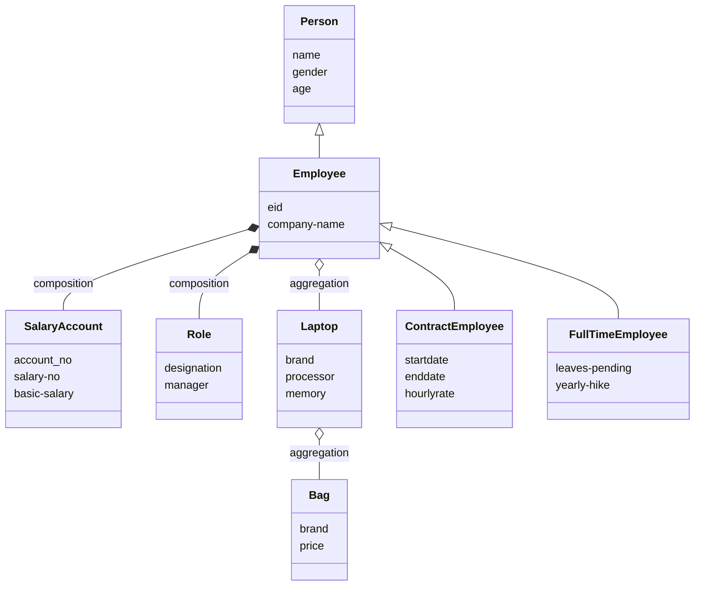
```mermaid
classDiagram
    class Person {
        name
        gender
        age
    }
    class Employee {
        eid
        company-name
    }
    class SalaryAccount {
        account_no
        salary-no
        basic-salary
    }
    class Role {
        designation
        manager
    }
    class Laptop {
        brand
        processor
        memory
    }
    class Bag {
        brand
        price
    }
    class ContractEmployee {
        startdate
        enddate
        hourlyrate
    }
    class FullTimeEmployee {
        leaves-pending
        yearly-hike
    }

    Person <|-- Employee
    Employee <|-- ContractEmployee
    Employee <|-- FullTimeEmployee
    Employee *-- SalaryAccount : composition
    Employee *-- Role : composition
    Employee o-- Laptop : aggregation
    Laptop o-- Bag : aggregation
```

### NOTE:
- Composition is a **tight-bound** "has-a" relationship (**strong Association**)
- Aggregation is a **loose-bound** "has-a" relationship (**weak Association**)

<!-- Source: PDF 4, Page 20 -->

- Tight-bound "has-a" relationship is when the enclosing object is inaccessible (destroyed) even the contained object becomes inaccessible.
- Loose-bound "has-a" relationship is when even if the enclosing object is inaccessible (destroyed) still the contained object remains accessible.

## 📖 Delegation Model :-
- Delegation means handover the responsibility for a particular task to another class or method.
- It is a technique where an object expresses certain behavior to outside world but in reality delegates the responsibility for implementing the behavior to an associated object.

```text
   (wash())              (wash())              (washing...)
      │                     │                      │
┌─────▼──────┐  Delegate ┌──▼──────────┐ Delegate ┌▼────────┐
│ Boss/Owner │──────────▶│ Supervisor  │─────────▶│ Worker  │
└────────────┘           └─────────────┘          └─────────┘
```

```java
class Owner
{
    p s v m(String[] args)
    {
        Supervisor s = new Supervisor();
        s.wash();
        s.dust();
        s.clean();
    }
}

class Supervisor
{
    Worker w = new Worker();
    public void wash()
    {
        w.wash();
    }
    public void dust()
    {
        w.dust();
    }
    public void clean()
    {
        w.clean();
    }
}

class Worker
{
    public void wash()
    {
        s.o.p("washing...");
    }
    public void dust()
    {
        s.o.p("dusting...");
    }
    public void clean()
    {
        s.o.p("cleaning...");
    }
}
```


---

<!-- Source: PDF 5, Page 1 -->

## 🎭 Polymorphism in Java
## 🎭 Non-polymorphic version:

```
              ┌──────────┐
              │  Parent  │
              │  cry()   │
              └────▲─────┘
                   │
       ┌───────────┼───────────┐
       │           │           │
 ┌─────┴────┐ ┌────┴─────┐ ┌───┴──────┐
 │  child1  │ │  child2  │ │  child3  │
 │  cry()   │ │  cry()   │ │  cry()   │
 └──────────┘ └──────────┘ └──────────┘
  c1 -> child1  c2 -> child2  c3 -> child3
```

```java
class Parent
{
	public void cry()
	{
		s.o.p("Parent doesn't cry");
	}
}

class Child1 extends Parent
{
	public void cry()
	{
		s.o.p("child1 cries with low voice");
	}
}

class Child2 extends Parent
{
	public void cry()
	{
		s.o.p("Child2 cries with moderate voice");
	}
}

class Child3 extends Parent
{
	public void cry()
	{
		s.o.p("Child3 cries with loud voice");
	}
}

class Launch
{
	p s v m(String[] args)
	{
		Child1 c1 = new Child1();
		Child2 c2 = new Child2();
		Child3 c3 = new Child3();

		c1.cry();
		c2.cry();
		c3.cry();
	}
}
```

*(instantiation block braced → **Tight Coupling**)*

- `c1.cry();` ⇒ Child1 cries with low voice
- `c2.cry();` ⇒ Child2 cries with moderate voice
- `c3.cry();` ⇒ Child3 cries with loud voice

<!-- Source: PDF 5, Page 2 -->

Relationship: ~~3 : 3~~
1 : 1

Hence, it is not polymorphic.

## 🎭 Polymorphism

```
        Poly                    Morph
       (many)              (Different Forms)

                    1 : Many
```

```
   Carbon                    H2O
     │                        │
     ├── Graphite             ├── Liquid
     ├── Coal                 ├── Solid
     └── Diamond              └── Gaseous
```

* In the above example, we can not achieve polymorphism because the relationship is 3:3 (or) 1:1 and not 1:M.
* This is because, in the above example tight-coupling exists and hence polymorphism can not be achieved.
* Tight-coupling refers to the process of creating child-type reference to child-type object.
* If polymorphism must be achieved we should have loose-coupling as shown below.
* Loose-coupling refers to the process of creating parent-type reference to child-type objects.

## 🎭 Polymorphic version:

```
              ┌──────────┐
   ref -----> │  Parent  │
              │  cry()   │
              └────▲─────┘
                   │
       ┌───────────┼───────────┐
       │           │           │
 ┌─────┴────┐ ┌────┴─────┐ ┌───┴──────┐
 │  Child1  │ │  Child2  │ │  Child3  │
 │  cry()   │ │  cry()   │ │  cry()   │
 └──────────┘ └──────────┘ └──────────┘
       ▲           ▲           ▲
       │           │           │
   (c1 ->      (c2 ->      (c3 ->
    child1)     child2)     child3)
```

<!-- Source: PDF 5, Page 3 -->

```java
class Parent
{
	public void cry()
	{
		s.o.p("Parent doesn't cry");
	}
}

class Child1 extends Parent
{
	public void cry()
	{
		s.o.p("child1 cries with low voice");
	}
}

class Child2 extends Parent
{
	public void cry()
	{
		s.o.p("child2 cries with moderate voice");
	}
}

class Child3 extends Parent
{
	public void cry()
	{
		s.o.p("child3 cries with loud voice");
	}
}

class Launch
{
	p s v m(String[] args)
	{
		Child1 c1 = new Child1();
		Child2 c2 = new Child2();
		Child3 c3 = new Child3();

		Parent ref;
		ref = c1;
		ref.cry();

		ref = c2;
		ref.cry();

		ref = c3;
		ref.cry();
	}
}
```

*(Parent ref assignments → **Loose coupling (OR) upcasting**)*

ref.cry(); →
- child1 cries with low voice
- child2 cries with moderate voice
- child3 cries with loud voice

```
┌──────────────┐
│ Relationship:│
│ 1 : 3        │
│ 1 : M        │
└──────────────┘

┌──────────────────────────┐
│ Hence, it is Polymorphic.│
└──────────────────────────┘
```

<!-- Source: PDF 5, Page 4 -->

Polymorphism refers to the "ability of an object to take on multiple forms".

## 📖 Dynamic method dispatch

* It is the mechanism by which a call to an overridden method is resolved at run-time rather than compile-time.
* When an overridden method is called through a parent reference, Java determines which version (Parent/child) of that method is to be executed based upon the type of the object being refered to at the time call occurs. Thus determination is made at the run-time.
* At run-time, it depends on the type of the object being refered to (not the type of the reference variable) that determines which version of the overridden method will be executed.

## 📖 Accessing specialized methods:

```
              ┌──────────┐
   ref -----> │  Parent  │
              │  cry()   │
              └────▲─────┘
                   │
       ┌───────────┼───────────┐
       │           │           │
 ┌─────┴────┐ ┌────┴─────┐ ┌───┴──────┐
 │  Child1  │ │  Child2  │ │  Child3  │
 │  cry()   │ │  cry()   │ │  cry()   │
 │  eat()   │ │  eat()   │ │  eat()   │
 └──────────┘ └──────────┘ └──────────┘
       ▲           ▲           ▲
       │           │           │
   (c1 ->      (c2 ->      (c3 ->
    child1)     child2)     child3)
```

```java
class Parent
{
	public void cry()
	{
		s.o.p("Parent doesn't cry");
	}
}

class Child1 extends Parent
{
	public void cry()
	{
		s.o.p("Child1 cries with low voice");
	}
	public void eat()
	{
		s.o.p("Child1 eats less food");
	}
}

class Child2 extends Parent
{
	public void cry()
	{
		s.o.p("Child2 cries with moderate voice");
	}
	public void eat()
	{
		s.o.p("Child2 eats sufficient food");
	}
}
```

<!-- Source: PDF 5, Page 5 -->

```java
class Child3 extends Parent
{
	public void cry()
	{
		s.o.p("child3 cries with loud voice");
	}
	public void eat()
	{
		s.o.p("child4 eats more food");
	}
}

class Launch
{
	p s v m(string[] args)
	{
		Child1 c1 = new Child1();
		Child2 c2 = new Child2();
		Child3 c3 = new Child3();

		Parent ref;

		ref = c1;
		ref.cry();
		ref.eat(); // X CE

		ref = c2;
		ref.cry();
		ref.eat(); // X CE

		ref = c3;
		ref.cry();
		ref.eat(); // X CE
	}
}
```

## 📌 NOTE:

* The error in the above program is because we are trying to access the specialized method of the child class using the parent-type reference directly.
* The limitation of parent-type reference to child object is that using parent type reference we can not access the specialized methods of the child objects directly. In otherwords, using parent type reference we can access only inherited methods and overridden methods.
* The error in the above program can be overcome by performing down-casting.
* Down-casting refers to the process of temporarily converting parent-type reference to child-type so that the specialized method of the child class can be accessed.

<!-- Source: PDF 5, Page 6 -->

```java
class Launch
{
	p s v m(String[] args)
	{
		Child1 c1 = new Child1();
		Child2 c2 = new Child2();
		Child3 c3 = new Child3();

		Parent ref;

		ref = c1;
		ref.cry();
		((Child1)(ref)).eat();

		ref = c2;
		ref.cry();
		((Child2)(ref)).eat();

		ref = c3;
		ref.cry();
		((Child3)(ref)).eat();
	}
}
```

## 📌 NOTE:

```
 Loose-coupling OR upcasting          Tight-Coupling OR Downcasting
                                      (OR circled)

 child c = new child();               Parent ref = new child();
 Parent ref = c;                      ((child)(ref)).eat();

         ┌──────────┐
         │  Parent  │
         │  cry()   │
         └────▲─────┘
        ↗     │     ↘
   (up)       │       (down)
        ↖     │     ↙
         ┌────┴─────┐
         │  child   │
         │  cry()   │
         │  eat()   │
         └──────────┘

 Advantage:                           Advantage:
 * Polymorphism can be achieved.      * Using parent-type reference, we can
 * code flexibility                     access the specialized method of
 * code reduction.                      the child class.
```

## 📖 Plane Hierarchy:

```
              ┌──────────────┐
   ref -----> │    Plane     │
              │  takeoff()   │
              │  fly()       │
              │  land()      │
              └──────▲───────┘
                     │
         ┌───────────┼───────────┐
         │           │           │
 ┌───────┴────┐ ┌────┴─────┐ ┌───┴──────────┐
 │ CargoPlane │ │Passenger │ │ FighterPlane │
 │ takeoff()  │ │  Plane   │ │  takeoff()   │
 │ fly()      │ │ takeoff()│ │  fly()       │
 │ land()     │ │ fly()    │ │  land()      │
 └────────────┘ │ land()   │ └──────────────┘
                └──────────┘
      cp ->         pp ->         fp ->
   (CargoPlane) (PassengerPlane) (FighterPlane)
      circled       circled         circled
```

<!-- Source: PDF 5, Page 7 -->

```java
class Plane
{
	public void takeOff()
	{
		s.o.p("Plane is taking off");
	}
	public void fly()
	{
		s.o.p("Plane is flying");
	}
	public void land()
	{
		s.o.p("Plane is landing");
	}
}

class CargoPlane extends Plane
{
	public void takeOff()
	{
		s.o.p("CargoPlane is taking off from a long-sized runway");
	}
	public void fly()
	{
		s.o.p("CargoPlane is flying at lower height");
	}
	public void land()
	{
		s.o.p("CargoPlane is landing on a long-sized runway");
	}
}

class PassengerPlane extends Plane
{
	public void takeOff()
	{
		s.o.p("PassengerPlane is taking off from a medium-sized runway");
	}
	public void fly()
	{
		s.o.p("PassengerPlane is flying at medium height");
	}
	public void land()
	{
		s.o.p("PassengerPlane is landing on a medium-sized runway");
	}
}

class FighterPlane extends Plane
{
	public void takeOff()
	{
		s.o.p("FighterPlane is taking off from a short-sized runway");
	}
	public void fly()
	{
		s.o.p("FighterPlane is flying at greater heights");
	}
	public void land()
	{
		s.o.p("FighterPlane is landing on a short-sized runway");
	}
}
```

<!-- Source: PDF 5, Page 8 -->

**(X / crossed out fragment at top):**
```java
class Launch
{
	p s v m(String[] args)
	{
		CargoPlane cp = new
```

## 🎭 Non-Polymorphic version:

```java
class Launch
{
	p s v m(...)
	{
		CargoPlane cp = new CargoPlane();
		PassengerPlane pp = new PassengerPlane();
		FighterPlane fp = new FighterPlane();

		cp.takeOff();
		cp.fly();
		cp.land();

		pp.takeOff();
		pp.fly();
		pp.land();

		fp.takeOff();
		fp.fly();
		fp.land();
	}
}
```

## 🎭 Polymorphic version without advantages:

```java
class Launch
{
	p s v m(...)
	{
		CargoPlane cp = new CargoPlane();
		PassengerPlane pp = new PassengerPlane();
		FighterPlane fp = new FighterPlane();

		Plane ref;

		ref = cp;
		ref.takeOff();
		ref.fly();
		ref.land();

		ref = pp;
		ref.takeOff();
		ref.fly();
		ref.land();

		ref = fp;
		ref.takeOff();
		ref.fly();
		ref.land();
	}
}
```
→ Repeated code (the three `ref.takeOff(); ref.fly(); ref.land();` blocks)

## 🎭 Polymorphic version with advantages:

```java
class Airport
{
	public void permit(Plane ref)
	{
		ref.takeOff();
		ref.fly();
		ref.land();
	}
}

class Launch
{
	p s v m(...)
	{
		CargoPlane cp = new CargoPlane();
		PassengerPlane pp = new PassengerPlane();
		FighterPlane fp = new FighterPlane();

		Airport a = new Airport();
		a.permit(cp);
		a.permit(pp);
		a.permit(fp);
	}
}
```

<!-- Source: PDF 5, Page 9 -->

## 📖 Animal Hierarchy:

Date: **21 | 4 | 23**

```
              ┌──────────────┐
   ref -----> │   Animal     │
              │  eat()       │
              │  sleep()     │
              │  foodHabit() │
              └──────▲───────┘
                     │
         ┌───────────┼───────────┐
         │           │           │
 ┌───────┴────┐ ┌────┴─────┐ ┌───┴──────┐
 │   Deer     │ │  Tiger   │ │  Monkey  │
 │  eat()     │ │  eat()   │ │  eat()   │
 │  sleep()   │ │  sleep() │ │  sleep() │
 │ foodHabit()│ │foodHabit()│ │foodHabit()│
 └────────────┘ └──────────┘ └──────────┘
       ▲             ▲            ▲
       │             │            │
   (d -> Deer)  (t -> Tiger) (m -> Monkey)
```

```java
class Animal
{
	public void eat()
	{
		s.o.p("Animal is eating");
	}
	public void sleep()
	{
		s.o.p("Animal is sleeping");
	}
	public void foodHabit()
	{
		s.o.p("Animal has a food habit");
	}
}

class Deer extends Animal
{
	public void eat()
	{
		s.o.p("Deer grazes and eats");
	}
	public void sleep()
	{
		s.o.p("Deer is sleeping under the tree ");
	}
	public void foodHabit()
	{
		s.o.p("Deer is an Herbivorous animal");
	}
}

class Tiger extends Animal
{
	public void eat()
	{
		s.o.p("Tiger hunts and eats");
```

<!-- Source: PDF 5, Page 10 -->

```java
	public void sleep()
	{
		s.o.p("Tiger is sleeping inside the cave");
	}
	public void foodHabit()
	{
		s.o.p("Tiger is carnivorous animal");
	}
}

class Monkey extends Animal
{
	public void eat()
	{
		s.o.p("Monkey steals and eat");
	}
	public void sleep()
	{
		s.o.p("Monkey is sleeping on the tree");
	}
	public void foodHabit()
	{
		s.o.p("Monkey is omnivorous animal");
	}
}
```

## 🎭 Non-polymorphic version

```java
class Launch
{
	p s v m(...)
	{
		Deer d = new Deer();
		Tiger t = new Tiger();
		Monkey m = new Monkey();

		d.eat();
		d.sleep();
		d.foodHabit();

		t.eat();
		t.sleep();
		t.foodHabit();

		m.eat();
		m.sleep();
		m.foodHabit();
	}
}
```

## 🎭 Polymorphic version without advantages:

```java
class Launch
{
	p s v m(...)
	{
		Deer d = new Deer();
		Tiger t = new Tiger();
		Monkey m = new Monkey();

		Animal ref;
		ref = d;
		ref.eat();
		ref.sleep();
		ref.foodHabit();

		ref = t;
		ref.eat();
		ref.sleep();
		ref.foodHabit();

		ref = m;
		ref.eat();
		ref.sleep();
		ref.foodHabit();
	}
}
```

## 🎭 Polymorphic version with advantages:

```java
class Forest
{
	psv permit(Animal ref)
	{
		ref.eat();
		ref.sleep();
		ref.foodHabit();
	}
}

class Launch
{
	psvm(...)
	{
		Deer d = new Deer();
		Tiger t = new Tiger();
		Monkey m = new Monkey();

		Forest f = new Forest();
		f.permit(d);
		f.permit(t);
		f.permit(m);
	}
}
```

<!-- Source: PDF 5, Page 11 -->

## 🎭 Types of Polymorphism:

```
                    ┌──────────────┐
                    │ Polymorphism │
                    └──────┬───────┘
               ┌───────────┴───────────┐
               │                       │
┌──────────────┴───────────┐ ┌─────────┴────────────────┐
│ Compile-Time Polymorphism│ │ Run-Time Polymorphism    │
│   method overloading     │ │   method overriding      │
└──────────────────────────┘ └──────────────────────────┘
```

## 🎭 Compile-Time Polymorphism / virtual / static / compile time binding / early binding (static binding)

```java
class Addition
{
	public int add(int a, int b)
	{
		return a+b;
	}
	public float add(int a, float b)
	{
		return a+b;
	}
	public float add(float a, int b)
	{
		return a+b;
	}
	public double add(double a, double b)
	{
		return a+b;
	}
}

class launch
{
	psvm(...)
	{
		Addition a = new Addition();
		a.add(45.5f, 75);
	}
}
```

*(call `a.add(45.5f, 75)` boxed and linked to `add(float a, int b)` → **resolved / binded at compile time**)*

Compiler binds the call based on:
-> Name of the method
-> Number of Parameters
-> Data Type of Parameters
-> Sequence of Parameters

## 🎭 Run-Time Polymorphism:

```java
class Parent
{
	public void cry()
	{
		s.o.p("Parent doesn't cry");
	}
}

class child1 extends Parent
{
	public void cry()
	{
		s.o.p("child1 cries with low voice");
	}
}

class child2 extends Parent
{
	public void cry()
	{
		s.o.p("child2 cries with moderate voice");
	}
}

class child3 extends Parent
{
	public void cry()
	{
		s.o.p("child3 cries with loud voice");
	}
}

class Launch
{
	psvm(string[] args)
	{
		Parent ref = new child1();
		ref.cry();

		ref = new child2();
		ref.cry();

		ref = new child3();
		ref.cry();
	}
}
```

*(each `ref.cry()` boxed and linked by dashed line to the matching child `cry()` method)*

```
ref ──X──► (child1)
    ──X──► (child2)
    ─────► (child3)
```

<!-- Source: PDF 5, Page 12 -->

* Run-Time Polymorphism is also called as real/true Polymorphism, dynamic polymorphism, Run-Time binding, dynamic binding, late binding, dynamic method dispatch, virtual method invocation.

## 🧬 Do static members participate in inheritance?

Ans: Yes, static members are inherited in Java.

```java
class Parent
{
	static int a=10;
	static void disp()
	{
		s.o.p("Parent - static method");
	}
}

class Child extends Parent
{
}

class Launch
{
	p s v m(...)
	{
		Child.disp(); // Parent - static method.
		s.o.p(Child.a); // 10
	}
}
```

## ⚙️ Overriding with respect to static methods:

* Static methods can not be overridden as they are resolved compile-time based on the type of the reference. This is known as method hiding where the parent class static method is hidden by child class static method.

### case 1:

```java
class Parent
{
	static void disp()
	{
		s.o.p("Parent - static method");
	}
}

class Child extends Parent
{
	void disp()
	{
		s.o.p("Child - instance method");
	}
}
```

**(X)** overridden method is static // This instance method cannot override the static method from parent.

### case 2:

```java
class Parent
{
	void disp()
	{
		s.o.p("Parent - instance method");
	}
}

class Child extends Parent
{
	static void disp()
	{
		s.o.p("Child - static method");
	}
}
```

**(X)** Overriding method is static // This static method cannot hide the instance method from parent.

<!-- Source: PDF 5, Page 13 -->

### case 3:

```java
class Parent
{
	void disp()
	{
		s.o.p("Parent - instance method");
	}
}

class Child extends Parent
{
	void disp()
	{
		s.o.p("Child - instance method");
	}
}
```

*(Child.disp → **method overriding**)*

```java
Parent ref = new Child();
ref.disp(); // Child - instance method
```

### case 4:

```java
class Parent
{
	static void disp()
	{
		s.o.p("Parent - static method");
	}
}

class Child extends Parent
{
	static void disp()
	{
		s.o.p("Child - static method");
	}
}
```

*(Child.disp → **method hiding**)*

```java
Parent ref1 = new Parent();
ref1.disp(); // Parent - static method

Child ref2 = new Child();
ref2.disp(); // Child - static method

Parent ref3 = new Child();
ref3.disp(); // Parent - static method
```

## 📖 instanceof keyword in Java:

The 'instanceof' operator is used to check whether an object is an instance of a particular class or not. It is also known as **type comparison operator**.

syntax: objectName instanceof className


---

<!-- Source: PDF 6, Page 1 -->

```java
CargoPlane cp = new CargoPlane();
FighterPlane fp = ~~new~~ null;
s.o.p(cp instanceof CargoPlane); //true
s.o.p(cp instanceof PassengerPlane); ---> Error
s.o.p(cp instanceof FighterPlane); ---> Error
s.o.p(cp instanceof Plane); //true
s.o.p(fp instanceof FighterPlane); //false
```

24/4/23

## 🧩 Abstraction in Java :

### Plane Hierarchy:

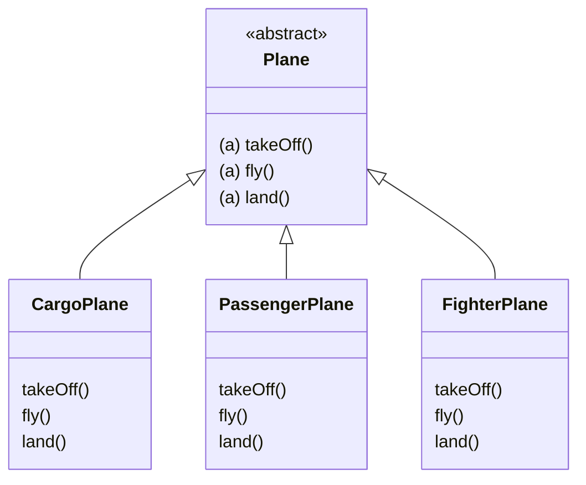
```mermaid
classDiagram
    class Plane {
        <<abstract>>
        (a) takeOff()
        (a) fly()
        (a) land()
    }
    class CargoPlane {
        takeOff()
        fly()
        land()
    }
    class PassengerPlane {
        takeOff()
        fly()
        land()
    }
    class FighterPlane {
        takeOff()
        fly()
        land()
    }
    Plane <|-- CargoPlane
    Plane <|-- PassengerPlane
    Plane <|-- FighterPlane
```

```
        ref ──→ (a) Plane
                  │
                 ✗  (not — cannot instantiate abstract Plane)
                  │
     ┌────────────┼────────────┐
     ▼            ▼            ▼
 CargoPlane  PassengerPlane  FighterPlane
     │            │            │
  cp → ○       pp → ○       fp → ○
```

```java
abstract class Plane
{
    abstract public void takeOff();
    abstract public void fly();
    abstract public void land();
}

class CargoPlane extends Plane
{
    public void takeOff()
    {
        s.o.p("CargoPlane is taking off from a long-sized runway");
    }
    public void fly()
    {
        s.o.p("CargoPlane is flying at lower heights");
```

---

<!-- Source: PDF 6, Page 2 -->

```java
    public void land()
    {
        s.o.p("cargoplane is landing on a long-sized runway");
    }
}

class PassengerPlane extends Plane
{
    public void takeOff()
    {
        s.o.p("PassengerPlane is taking off from medium-sized runway");
    }
    public void fly()
    {
        s.o.p("PassengerPlane is flying at medium heights");
    }
    public void land()
    {
        s.o.p("PassengerPlane is landing on a medium-sized runway");
    }
}

class FighterPlane extends Plane
{
    public void takeOff()
    {
        s.o.p("FighterPlane is taking off from small-sized run-way");
    }
    public void fly()
    {
        s.o.p("FighterPlane is flying at higher heights");
    }
    public void land()
    {
        s.o.p("FighterPlane is landing on a small-sized run-way");
    }
}

class Airport
{
    public void permit(Plane ref)
    {
        ref.takeOff();
        ref.fly();
        ref.land();
        // } overridden methods
        //   (Not specialized methods)
    }
}

class Launch
{
    p s v m (String[] args)
    {
        CargoPlane cp = new CargoPlane();
        PassengerPlane pp = new PassengerPlane();
        FighterPlane fp = new FighterPlane();
        Airport a = new Airport();
        a.permit(cp);
        a.permit(pp);
        a.permit(fp);
    }
}
```

---

<!-- Source: PDF 6, Page 3 -->

### Animal Hierarchy:

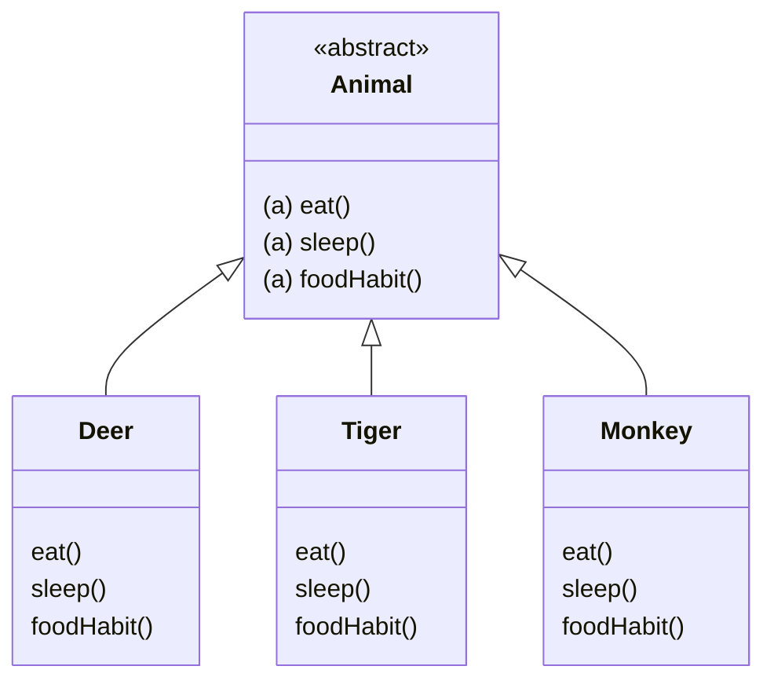
```mermaid
classDiagram
    class Animal {
        <<abstract>>
        (a) eat()
        (a) sleep()
        (a) foodHabit()
    }
    class Deer {
        eat()
        sleep()
        foodHabit()
    }
    class Tiger {
        eat()
        sleep()
        foodHabit()
    }
    class Monkey {
        eat()
        sleep()
        foodHabit()
    }
    Animal <|-- Deer
    Animal <|-- Tiger
    Animal <|-- Monkey
```

```
        ref ──→ (a) Animal
                  │
     ┌────────────┼────────────┐
     ▼            ▼            ▼
   Deer         Tiger        Monkey
 d → ○         t → ○        m → ○
```

```java
abstract class Animal
{
    abstract public void eat();
    // ~~{~~
    // ~~s.o.p(" Animal is eating...");~~
    // ~~}~~
    abstract public void sleep();
    abstract public void foodHabit();
}

class Deer extends Animal
{
    public void eat()
    {
        s.o.p(" Deer grazes and eats ");
    }
    public void sleep()
    {
        s.o.p(" Deer is sleeping under the tree ");
    }
    public void foodHabit()
    {
        s.o.p(" Deer is Herbivorous animal ");
    }
}

class Tiger extends Animal
{
    public void eat()
    {
        s.o.p(" Tiger hunts and eats ");
    }
    public void sleep()
    {
        s.o.p(" Tiger is sleeping in the cave ");
    }
    public void foodHabit()
    {
        s.o.p(" Tiger is carnivorous animal ");
    }
}
```

---

<!-- Source: PDF 6, Page 4 -->

```java
class Monkey extends Animal
{
    public void eat()
    {
        s.o.p(" Monkey steals and eats ");
    }
    public void sleep()
    {
        s.o.p(" Monkey sleep on the tree ");
    }
    public void foodHabit()
    {
        s.o.p(" Monkey is Omnivorous animal ");
    }
}

class Forest
{
    public void permit(Animal ref)
    {
        ref.eat();
        ref.sleep();
        ref.foodHabit();
    }
}

class Launch
{
    psvm(String[] args)
    {
        Forest f = new Forest();
        // ~~f.permit~~
        Deer d = new Deer();
        Tiger t = new Tiger();
        Monkey m = new Monkey();
        f.permit(d);
        f.permit(t);
        f.permit(m);
    }
}
```

### NOTE :

* Abstraction allows us to show only the relevant information and hide unnecessary details.
* This means that we hide the implementation details from the users & expose only the functionality to the end user. Therefore the users will only know "what it does" rather than "how it does".

#### Eg:

1. We know what email does but we don't know how the email server and the protocol to send the message.
2. We know what sms does but we don't know the internal processing of message delivery.
3. We know what the accelerator in a car does but we don't know how pressing the accelerator increases the speed.

---

<!-- Source: PDF 6, Page 5 -->

* In Java abstraction is achieved using abstract method, classes (0%-100%) and interfaces (100%). We can achieve 100% abstraction using interfaces.

### Abstract classes :

There are situations in which we want to define a super class that only defines a *generic* form without providing implementation, that will be shared by all of its subclasses, leaving the responsibility of providing the implementation details to each of its subclass. Such class must be declared with the 'abstract' keyword.

### Abstract methods :

Abstract methods are such methods which contains only the signature of the method but no implementation (method body).

The advantage of abstract methods is that abstract methods ensures that the methods in the child classes do not become specialized methods instead they remain as overridden methods. Hence, loose coupling & polymorphism can be achieved.

### NOTE:

If a class contains atleast one abstract method then the class must be declared as *abstract*.

### Car Hierarchy:

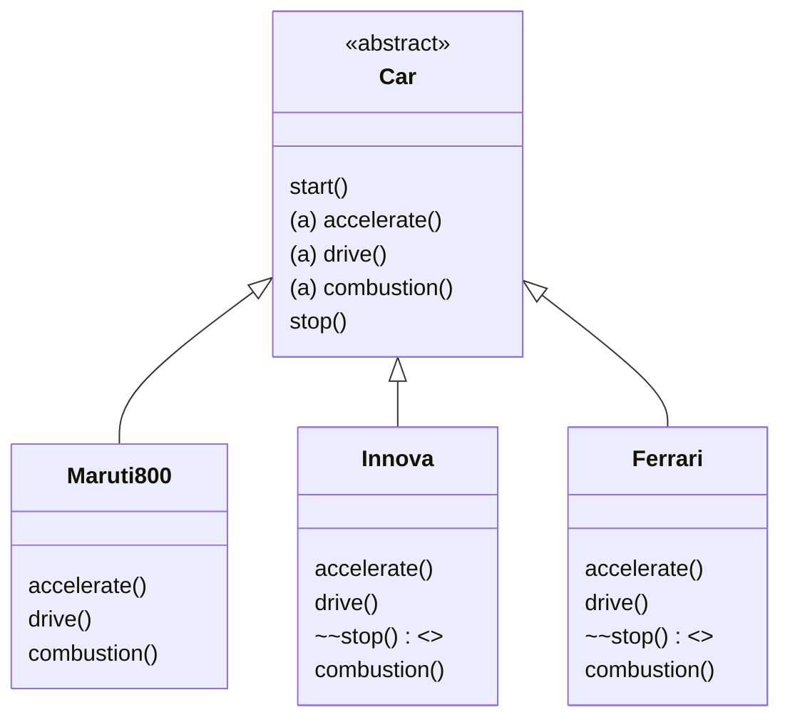
```mermaid
classDiagram
    class Car {
        <<abstract>>
        start()
        (a) accelerate()
        (a) drive()
        (a) combustion()
        stop()
    }
    class Maruti800 {
        accelerate()
        drive()
        combustion()
    }
    class Innova {
        accelerate()
        drive()
        ~~stop()~~
        combustion()
    }
    class Ferrari {
        accelerate()
        drive()
        ~~stop()~~
        combustion()
    }
    Car <|-- Maruti800
    Car <|-- Innova
    Car <|-- Ferrari
```

```
        ref ──→ (a) Car
                  │
     ┌────────────┼────────────┐
     ▼            ▼            ▼
 Maruti800      Innova       Ferrari
 m → ○         i → ○        f → ○
```

---

<!-- Source: PDF 6, Page 6 -->

```java
abstract class Car
{
    public void start()
    {
        s.o.p("car is starting");
    }
    abstract public void accelerate();
    abstract public void drive();
    abstract public void combustion();
    public void stop()
    {
        s.o.p("car is stopping");
    }
}

class Maruti800 extends Car
{
    public void accelerate()
    {
        s.o.p("Maruti800 accelerates upto 144 km/hr");
    }
    public void drive()
    {
        s.o.p("Maruti800 has manual gear system");
    }
    public void combustion()
    {
        s.o.p("Maruti800 has a Petrol Engine");
    }
}

class Innova extends Car
{
    public void accelerate()
    {
        s.o.p("Innova accelerates upto 179 km/hr");
    }
    public void drive()
    {
        s.o.p("Innova has automatic gear system");
    }
    public void combustion()
    {
        s.o.p("Innova has a Diesel Engine");
    }
}

class Ferrari extends Car
{
    public void accelerate()
    {
        s.o.p("Ferrari accelerates upto 340 km/hr");
    }
    public void drive()
    {
        s.o.p("Ferrari has Turbo gear system");
    }
    public void combustion()
    {
        s.o.p("Ferrari has a white-petrol Engine");
    }
}
```

---

<!-- Source: PDF 6, Page 7 -->

```java
class Road
{
    public void permit(Car ref)
    {
        ref.start();
        ref.accelerate();
        ref.drive();
        ref.combustion();
        ref.stop();
    }
}

class Launch
{
    p s v m(String[] args)
    {
        Maruti800 m = new Maruti800();
        Innova i = new Innova();
        Ferrari f = new Ferrari();
        Road r = new Road();
        r.permit(m);
        r.permit(i);
        r.permit(f);
    }
}
```

25/4/23

Design and develop an application to calculate area of different geometric shapes

### Non-object oriented version:

```
  square              Rectangle              circle
 ┌──────┐            ┌──────────┐           /──────\
 │      │ ↑ l        │          │ ↑ l      |   ·──→| r
 │      │            │          │           \──────/
 └──────┘            └──────────┘
   ← l →               ←  b  →

 Area = l * l        Area = l * b         Area = π * r * r
```

### Non-object oriented version:

```
┌─────────────┐  ┌─────────────┐  ┌─────────────┐
│   Square    │  │  Rectangle  │  │   circle    │
├─────────────┤  ├─────────────┤  ├─────────────┤
│ length      │  │ length      │  │ radius      │
│ area        │  │ breadth     │  │ area        │
│             │  │ area        │  │             │
├─────────────┤  ├─────────────┤  ├─────────────┤
│ acceptInput()│ │ acceptInput()│ │ acceptInput()│
│ compute()   │  │ compute()   │  │ compute()   │
│ disp()      │  │ disp()      │  │ disp()      │
└─────────────┘  └─────────────┘  └─────────────┘
   s → ○            r → ○            c → ○
```

---

<!-- Source: PDF 6, Page 8 -->

```java
import java.util.Scanner;
class Square
{
    float length;
    float area;

    public void acceptInput()
    {
        Scanner scan = new Scanner(System.in);
        s.o.p("Enter the length of square: ");
        length = scan.nextFloat();
    }

    public void compute()
    {
        area = length * length;
    }

    public void disp()
    {
        s.o.p("The area of square is : " + area);
    }
}

class Rectangle
{
    float length;
    float breadth;
    float area;

    public void acceptInput()
    {
        Scanner scan = new Scanner(System.in);
        s.o.p("Enter the length of rectangle: ");
        length = scan.nextFloat();
        s.o.p("Enter the breadth of rectangle: ");
        breadth = scan.nextFloat();
    }

    public void compute()
    {
        area = length * breadth;
    }

    public void disp()
    {
        s.o.p("The area of rectangle is: " + area);
    }
}

class Circle
{
    float radius;
    float area;
```

---

<!-- Source: PDF 6, Page 9 -->

```java
    public void acceptInput()
    {
        Scanner scan = new Scanner(System.in);
        s.o.p("Enter the radius of circle: ");
        radius = scan.nextFloat();
    }
    public void compute()
    {
        area = 3.14f * radius * radius;
    }
    public void disp()
    {
        s.o.p("Area of the circle is : " + area);
    }
}

class Launch
{
    p s v m(String[] args)
    {
        Square s = new Square();
        Rectangle r = new Rectangle();
        Circle c = new Circle();

        s.acceptInput();
        s.compute();
        s.disp();

        r.acceptInput();
        r.compute();
        r.disp();

        c.acceptInput();
        c.compute();
        c.disp();
    }
}
```

### Object oriented version:

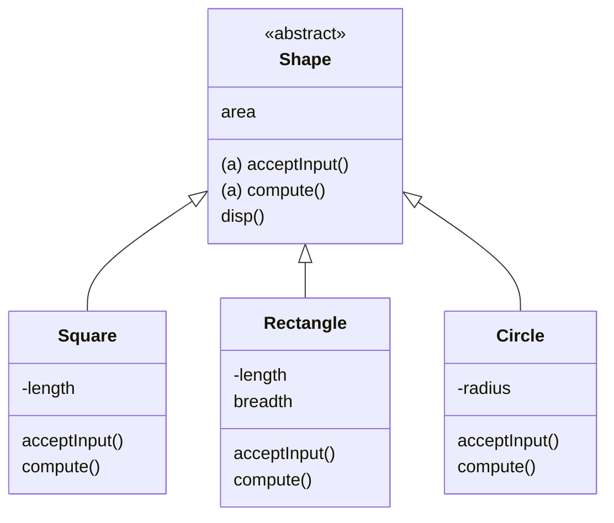
```mermaid
classDiagram
    class Shape {
        <<abstract>>
        area
        (a) acceptInput()
        (a) compute()
        disp()
    }
    class Square {
        -length
        acceptInput()
        compute()
    }
    class Rectangle {
        -length
        breadth
        acceptInput()
        compute()
    }
    class Circle {
        -radius
        acceptInput()
        compute()
    }
    Shape <|-- Square
    Shape <|-- Rectangle
    Shape <|-- Circle
```

```
        ref ──→ (a) Shape
                  │
     ┌────────────┼────────────┐
     ▼            ▼            ▼
   Square      Rectangle      Circle
  s → □       re → ▭         c → ○
```

---

<!-- Source: PDF 6, Page 10 -->

```java
import java.util.Scanner;
abstract class Shape
{
    public float area;
    abstract public void acceptInput();
    abstract public void compute();
    public void disp()
    {
        s.o.p("The area is : " + area);
    }
}

class Square extends Shape
{
    private float length;
    public void acceptInput()
    {
        Scanner scan = new Scanner(System.in);
        s.o.p("Enter the length of square: ");
        length = scan.nextFloat();
    }
    public void compute()
    {
        area = length * length;
    }
}

class Rectangle extends Shape
{
    private float length;
    private float breadth;
    public void acceptInput()
    {
        Scanner scan = new Scanner(System.in);
        s.o.p("Enter the length of the rectangle: ");
        length = scan.nextFloat();
        s.o.p("Enter the breadth of the rectangle: ");
        breadth = scan.nextFloat();
    }
    public void compute()
    {
        area = length * breadth;
    }
}

class Circle extends Shape
{
    private float radius;
    public void acceptInput()
    {
        Scanner scan = new Scanner(System.in);
        s.o.p("Enter the radius of the circle: ");
        radius = scan.nextFloat();
    }
```

<!-- Source: PDF 6, Page 11 -->

```java
    public void compute()
    {
        area = 3.141f * radius * radius;
    }
}

class Geometry
{
    public void permit(Shape ref)
    {
        ref.acceptInput();
        ref.compute();
        ref.disp();
    }
}

class Launch
{
    p s v m(String[] args)
    {
        Square s = new Square();
        Rectangle r = new Rectangle();
        Circle c = new Circle();

        Geometry g = new Geometry();

        g.permit(s);
        g.permit(r);
        g.permit(c);
    }
}
```

28/4/23

### Bird Hierarchy:

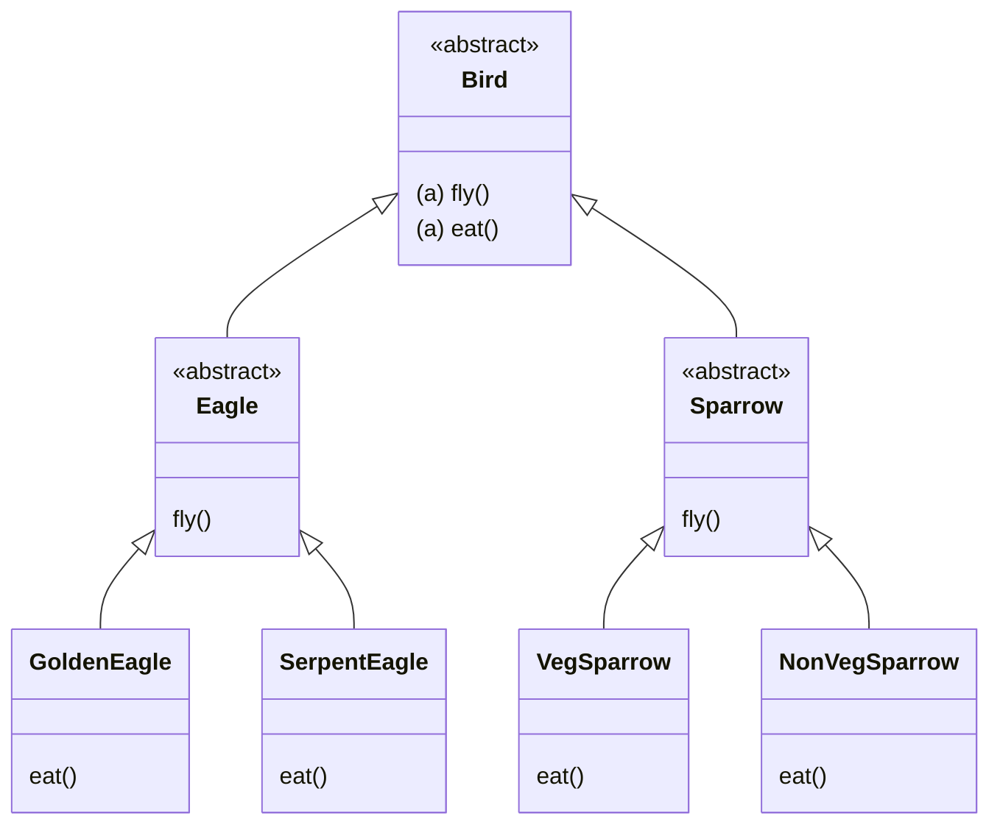
```mermaid
classDiagram
    class Bird {
        <<abstract>>
        (a) fly()
        (a) eat()
    }
    class Eagle {
        <<abstract>>
        fly()
    }
    class Sparrow {
        <<abstract>>
        fly()
    }
    class GoldenEagle {
        eat()
    }
    class SerpentEagle {
        eat()
    }
    class VegSparrow {
        eat()
    }
    class NonVegSparrow {
        eat()
    }
    Bird <|-- Eagle
    Bird <|-- Sparrow
    Eagle <|-- GoldenEagle
    Eagle <|-- SerpentEagle
    Sparrow <|-- VegSparrow
    Sparrow <|-- NonVegSparrow
```

```
        ref → (a) Bird
              ├─ (a) fly()
              └─ (a) eat()
                 /              \
          (a) Eagle          (a) Sparrow
            fly()               fly()
           /      \            /        \
    GoldenEagle  SerpentEagle  VegSparrow  NonVegSparrow
       eat()        eat()         eat()         eat()

    ge → (☁)    se → (☁)    vs → (☁)    nvs → (☁)
```

---

<!-- Source: PDF 6, Page 12 -->

```java
abstract class Bird
{
    abstract public void fly();
    abstract public void eat();
}

abstract class Eagle extends Bird
{
    public void fly()
    {
        s.o.p("Eagle flies at greater heights");
    }
}

abstract class Sparrow extends Bird
{
    public void fly()
    {
        s.o.p("Sparrow flies at low heights");
    }
}

final class GoldenEagle extends Eagle
{
    public void eat()
    {
        s.o.p("GoldenEagle hunts over the oceans and eats");
    }
}

final class SerpentEagle extends Eagle
{
    public void eat()
    {
        s.o.p("SerpentEagle hunts over the mountain and eats");
    }
}

final class VegSparrow extends Sparrow
{
    public void eat()
    {
        s.o.p("VegSparrow eats grains");
    }
}

final class NonVegSparrow extends Sparrow
{
    public void eat()
    {
        s.o.p("NonVegSparrow eats worms");
    }
}

class Sky
{
    public void permit(Bird ref)
    {
        ref.fly();
        ref.eat();
    }
}
```

---

<!-- Source: PDF 6, Page 13 -->

```java
class Launch
{
    p s v m(String[] args)
    {
        GoldenEagle ge = new GoldenEagle();
        SerpentEagle se = new SerpentEagle();
        VegSparrow vs = new VegSparrow();
        NonVegSparrow nvs = new NonVegSparrow();

        Sky s = new Sky();
        s.permit(ge);
        s.permit(se);
        s.permit(vs);
        s.permit(nvs);
    }
}
```

29/4/23

### Conclusions:

**1. When should a class be declared as abstract?**

Ans: A class should be declared as abstract if,
* it contains at least one abstract method.
* Only inheritance should be permitted but not instantiation.
* It's an incomplete class.

**2. What all can an abstract class contain?**

Ans: An abstract class can have everything that a normal Java class can have and in addition to that it can also have method signatures (abstract methods).

> Note: The only difference b/w a normal Java class and an abstract class is that **an abstract class can't be instantiated**.

**3. Can an abstract class contain main method?** ⊛ **or** can an abstract class be executed?

Ans: Yes, an abstract class can be executed as .class file will be generated for an abstract class too.

Eg:

```java
abstract class Launch
{
    p s v m(String[] args)
    {
        s.o.p("Abstract class main method");
    }
}
```

---

<!-- Source: PDF 6, Page 14 -->

**4). Can abstract class contain static members?**

Ans: An abstract class can also contain static members because to access static members we don't necessarily require an object of a class since we can access it only by using the class name.

**5). Can variables be declared as abstract?**

Ans: variables can not be declared as abstract.

```
        final                    abstract
       /  |  \                  /    |    \
  class methods variable    class method variable
                                   ✓      ✓      ✗
```

**6). Can constructors be declared as abstract?**

Ans: Constructors can not be declared as abstract.

Eg:

```java
class Maths
{
    abstract public Maths(int num1, int num2);  // ✗
}
```

**7). Can abstract methods be overloaded?**

Ans: Yes, we can overload abstract methods.

Eg:

```java
abstract class Maths
{
    abstract public void add(int a, int b);      // ✓
    abstract public void add(int a, float b);    // ✓
    abstract public void add(float a, int b);    // ✓
    abstract public void add(float a, float a);  // ✓
}
```

### NOTE: Illegal abstract keyword combination.

* abstract + static  ✗
* abstract + final   ✗
* abstract + private ✗

---

<!-- Source: PDF 6, Page 15 -->

## 🧩 INTERFACES → "STANDARDISATION"

### Full-Stack Application

#### Web Applications (Internet - 1990s)

```
User → [Front-End] ⇄ [Back-End] ⇄ [Database]
              request→     query→
             ←response    ←result
```

**Front-End:**
* HTML,
* CSS, Bootstrap,...
* JavaScript,
* Angular, React, ....

**Back-End:**
* Java, Python, C#,...
* Spring, Django, .Net,...
* Hibernate, etc.
* etc.

**Database:**
* SQL, NoSQL
* Oracle, MongoDB

```
Java 1.0  ──✗──→ Database
Java 1.1  ✗
Java 1.2  ─────→ JDBC API
```

**Programming Language** → **Java** → `(Driver)` → **Database (DBMS)**
                                              ↙   ↓   ↘
                                          Oracle Sybase DB2

**contract interface Connection**
```java
getConnection();
executeQuery();
close();
```

```java
class OracleDB implements Connection
{
    getConnection();     // / openConnection()
    executeQuery();      // / processQuery()
    close();             // / closeConnection()
}

class SybaseDB
{
    getConnection();
    runQuery();
    terminateConnection();
}

class DB2DB
{
    establishConnection();
    executeQuery();
    stopConnection();
}
```

---

<!-- Source: PDF 6, Page 16 -->

```java
interface connection
{
    void getConnection();
    void executeQuery();
    void close();
}
```

contract / protocol

1997 (Java 1.2)
JDBC API

```java
class OracleDB implements connection
{
    void getConnection() {   // ~~buildConnection()~~
        ≡
    }
    void executeQuery() {    // ~~runQuery()~~
        ≡
    }
    void close() {           // ~~terminateConnection()~~
        ≡
    }
}

class Sybase implements connection
{
    void getConnection() {   // ~~acceptConnection()~~
        ≡
    }
    void executeQuery() {    // ~~processQuery()~~
        ≡
    }
    void close() {           // ~~exitConnection()~~
        ≡
    }
}

class Informix implements connection
{
    void getConnection() {   // ~~openConnection()~~
        ≡
    }
    void executeQuery() {    // ~~operateQuery()~~
        ≡
    }
    void close() {           // ~~quitConnection()~~
        ≡
    }
}
```

```
Interface  ↔  Blueprint of the class
   ↕
class      ↔  Blueprint of the Object
   ↕
Object     ↔  Real-world entity
```

* Abstract classes (0% to 100%)
* Interface (100%)

### Rules of Interface:

**Rule #1:** An interface helps to achieve standardization.

**Rule #2:** An interface provides a contract for the implementing classes which promise to provide the implementation for the abstract method defined in the contract.

**Rule #3:** A class is a blueprint of an object and an interface is a blueprint of class.

**Rule #4:** Interfaces helps to achieve 100% abstraction as it contains only abstract methods (methods without implementation).

---

<!-- Source: PDF 6, Page 17 -->

**Rule #5:** An interface can have any number of implementing classes.

**Rule #6:** An interface can not be instantiated. But the reference of an interface can be created. Using interface type reference, we can access the overridden methods of the implementing classes.

Interfaces promotes loose-coupling & hence polymorphism can be achieved.

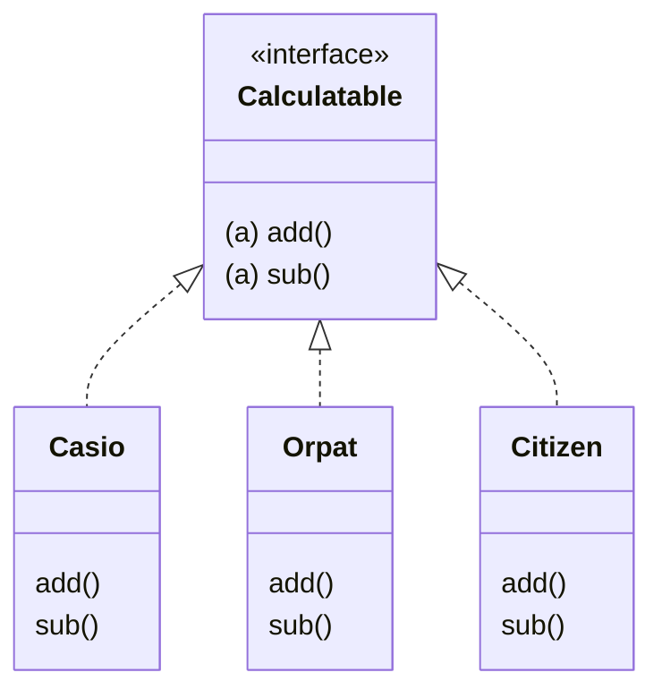
```mermaid
classDiagram
    class Calculatable {
        <<interface>>
        (a) add()
        (a) sub()
    }
    class Casio {
        add()
        sub()
    }
    class Orpat {
        add()
        sub()
    }
    class Citizen {
        add()
        sub()
    }
    Calculatable <|.. Casio
    Calculatable <|.. Orpat
    Calculatable <|.. Citizen
```

```
ref → <<interface>> Calculatable
              (a) add()
              (a) sub()
                    │
        ┌───────────┼───────────┐
        ▼           ▼           ▼
      Casio       Orpat      Citizen
      add()       add()       add()
      sub()       sub()       sub()

      cas → (☁ Casio)
      orp → (☁ orpat)
      cit → (☁ citizen)
```

```java
import java.util.Scanner;

interface Calculatable
{
    public void add();
    public void sub();
}

class Casio implements Calculatable
{
    public void add()
    {
        int a = 100;
        int b = 50;
        int c = a + b;
        s.o.p(c);
    }

    public void sub()
    {
        int a = 100;
        int b = 50;
        int c = a - b;
        s.o.p(c);
    }
}
```

---

<!-- Source: PDF 6, Page 18 -->

```java
class Orpat implements Calculatable
{
    public void add()
    {
        Scanner scan = new Scanner(System.in);
        s.o.p("Enter the first number");
        int a = scan.nextInt();
        s.o.p("Enter the second number");
        int b = scan.nextInt();
        int c = a + b;
        s.o.p(c);
    }
    public void sub()
    {
        Scanner scan = new Scanner(System.in);
        s.o.p("Enter the first number");
        int a = scan.nextInt();
        s.o.p("Enter the second number");
        int b = scan.nextInt();
        int c = a - b;
        s.o.p(c);
    }
}

class Citizen implements Calculatable
{
    public void add()
    {
        Scanner scan = new Scanner(System.in);
        s.o.p("Enter the first number");
        int a = scan.nextInt();
        s.o.p("Enter the second number");
        int b = scan.nextInt();
        int c = a - (-b);
        s.o.p(c);
    }
    public void sub()
    {
        Scanner scan = new Scanner(System.in);
        s.o.p("Enter the first number");
        int a = scan.nextInt();
        s.o.p("Enter the second number");
        int b = scan.nextInt();
        int c = a + (-b);
        s.o.p(c);
    }
}
```

---

<!-- Source: PDF 6, Page 19 -->

```java
class Math
{
    public void permit(Calculatable ref)
    {
        ref.add();
        ref.sub();
    }
}

class Launch
{
    p s v m(String[] args)
    {
        Casio cas = new Casio();
        Orpat orp = new Orpat();
        Citizen cit = new Citizen();
        Calculatable calc = new Calculatable();  // ✗
        Math m = new Math();

        m.permit(cas);
        m.permit(orp);
        m.permit(cit);
    }
}
```

30/4/23

### NOTE:

Using interface type reference we can access only the overridden methods of the implementing classes. But we can not directly access the specialized methods of the implementing classes. If specialized methods must be access then we must perform **down-casting**.

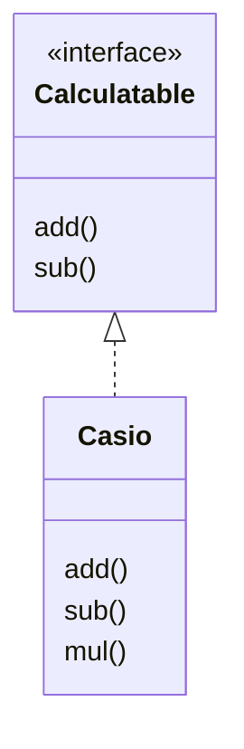
```mermaid
classDiagram
    class Calculatable {
        <<interface>>
        add()
        sub()
    }
    class Casio {
        add()
        sub()
        mul()
    }
    Calculatable <|.. Casio
```

```
ref → <<interface>> Calculatable
              add()
              sub()
                △
                │
              Casio
              add()
              sub()
              mul()   ← (specialized, in red)

      ~~ref~~
      cal → (☁ Casio)
```

```java
interface Calculatable
{
    public void add();
    public void sub();
}

class Casio implements Calculatable
{
    public void add()
    {
        int a = 100;
        int b = 50;
        int c = a + b;
        s.o.p(c);
    }
    public void sub()
    {
        int a = 100;
        int b = 50;
        int c = a - b;
        s.o.p(c);
    }
    public void mul()
    {
        int a = 100;
        int b = 50;
        int c = a * b;
        s.o.p(c);
    }
}

class Launch
{
    p s v m(String[] args)
    {
        Casio cal = new Casio();
        Calculatable ref;
        ref = cal;
        ref.add();
        ref.sub();
```

---

<!-- Source: PDF 6, Page 20 -->

```java
        ref.mul();                 // ✗  Error: mul() is a specialized method
        ((Casio)(ref)).mul();      // ✓  valid: Downcasting
    }
}
```

### Rule 7:

* A class can implement any number of interfaces. Hence, multiple inheritance in Java is indirectly achieved using interfaces. However, the same is not possible incase of extending multiple classes as it would lead to ambiguity (diamond shape problem).
* But however, incase of interfaces, there won't be any ambiguity even if same method is defined in multiple interfaces, because its implementation will be provided by the implementing classes & only the method signature will be provided in the interface.

#### Eg 1:

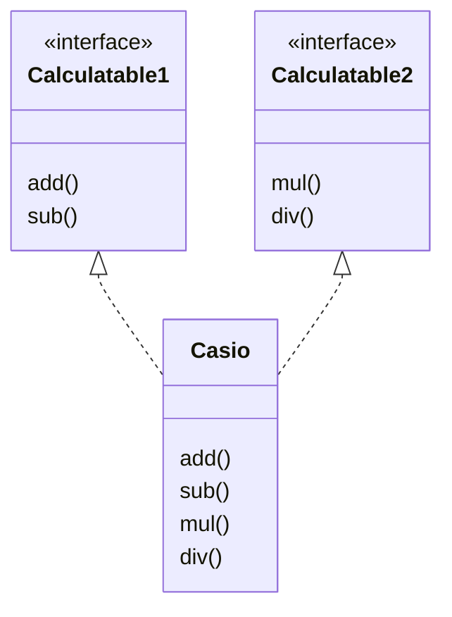
```mermaid
classDiagram
    class Calculatable1 {
        <<interface>>
        add()
        sub()
    }
    class Calculatable2 {
        <<interface>>
        mul()
        div()
    }
    class Casio {
        add()
        sub()
        mul()
        div()
    }
    Calculatable1 <|.. Casio
    Calculatable2 <|.. Casio
```

`cal → (☁ Casio)`

```java
interface Calculatable1
{
    public void add();
    public void sub();
}

interface Calculatable2
{
    public void mul();
    public void div();
}

class Casio implements Calculatable1, Calculatable2
{
    public void add()
    {
        int a = 100;
        int b = 50;
        int c = a + b;
        s.o.p(c);
    }
    public void sub()
    {
        int a = 100;
        int b = 50;
        int c = a - b;
        s.o.p(c);
    }
    public void mul()
    {
        int a = 100;
        int b = 50;
        int c = a * b;
        s.o.p(c);
    }
    public void div()
    {
        int a = 100;
        int b = 50;
        int c = a / b;
        s.o.p(c);
    }
}

class Launch
{
    p s v m(String[] args)
    {
        Casio cal = new Casio();
        cal.add();
        cal.sub();
        cal.mul();
        cal.div();
    }
}
```

<!-- Source: PDF 6, Page 21 -->

### Eg 2:

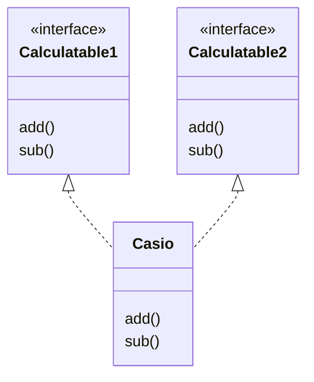
```mermaid
classDiagram
    class Calculatable1 {
        <<interface>>
        add()
        sub()
    }
    class Calculatable2 {
        <<interface>>
        add()
        sub()
    }
    class Casio {
        add()
        sub()
    }
    Calculatable1 <|.. Casio
    Calculatable2 <|.. Casio
```

`cal -> Casio`

```java
interface Calculatable1
{
    public void add();
    public void sub();
}

interface Calculatable2
{
    public void add();
    public void sub();
}

class Casio implements Calculatable1, Calculatable2
{
    public void add()
    {
        int a = 100;
        int b = 50;
        int c = a + b;
        s.o.p(c);
    }
    public void sub()
    {
        int a = 100;
        int b = 50;
        int c = a - b;
        s.o.p(c);
    }
}

class Launch
{
    p s v m(String[] args)
    {
        Casio cal = new Casio();
        cal.add();
        cal.sub();
    }
}
```

### Rule 8:
An interface can not implement another interface. This is because an interface can contain only method signature & not method implementations (body).

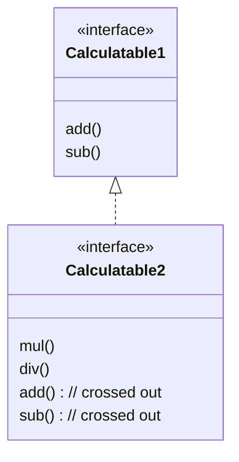
```mermaid
classDiagram
    class Calculatable1 {
        <<interface>>
        add()
        sub()
    }
    class Calculatable2 {
        <<interface>>
        mul()
        div()
        add()  // crossed out
        sub()  // crossed out
    }
    Calculatable1 <|.. Calculatable2
```

```java
interface Calculatable1
{
    public void add();
    public void sub();
}

interface Calculatable2 implements Calculatable1  // X Error
{
    public void mul();
    public void div();
}
```

---

<!-- Source: PDF 6, Page 22 -->

### Rule 9:
An interface can extend any number of interface. Hence, through this also multiple inheritance can be achieved in Java.

#### Eg 1:

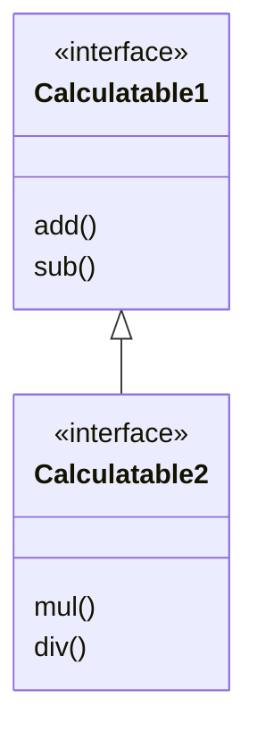
```mermaid
classDiagram
    class Calculatable1 {
        <<interface>>
        add()
        sub()
    }
    class Calculatable2 {
        <<interface>>
        mul()
        div()
    }
    Calculatable1 <|-- Calculatable2
```

```java
interface Calculatable1
{
    public void add();
    public void sub();
}

interface Calculatable2 extends Calculatable1
{
    public void mul();
    public void div();
}
```

#### Eg 2:

```mermaid
classDiagram
    class Calculatable1 {
        <<interface>>
        add()
        sub()
    }
    class Calculatable2 {
        <<interface>>
        mul()
        div()
    }
    class Calculatable3 {
        <<interface>>
        sqrt()
        pow()
    }
    Calculatable1 <|-- Calculatable3
    Calculatable2 <|-- Calculatable3
```

```java
interface Calculatable1
{
    public void add();
    public void sub();
}

interface Calculatable2
{
    public void mul();
    public void div();
}

interface Calculatable3 extends Calculatable1, Calculatable2
{
    public void sqrt();
    public void pow();
}
```

### Rule 10:
If a class is both extending from another class and implementing an interface then it must first extend the class and then implement the interface.

```mermaid
classDiagram
    class Maths {
        mul()
        div()
    }
    class Calculatable {
        <<interface>>
        add()
        sub()
    }
    class Casio {
        add()
        sub()
    }
    Maths <|-- Casio : extends
    Calculatable <|.. Casio : implements
```

---

<!-- Source: PDF 6, Page 23 -->

```java
class Math
{
    public void mul()
    {
        int a = 100;
        int b = 50;
        int c = a * b;
        s.o.p(c);
    }
    public void div()
    {
        int a = 100;
        int b = 50;
        int c = a / b;
        s.o.p(c);
    }
}

interface Calculatable
{
    public void add();
    public void sub();
}

class Casio extends Math implements Calculatable
{
    public void add()
    {
        int a = 100;
        int b = 50;
        int c = a + b;
        s.o.p(c);
    }
    public void sub()
    {
        int a = 100;
        int b = 50;
        int c = a - b;
        s.o.p(c);
    }
}
```

### Rule 11:
A class can partially implement an interface by declaring itself as abstract.

```mermaid
classDiagram
    class Calculatable {
        <<interface>>
        add()
        sub()
    }
    class Casio {
        add()
    }
    Calculatable <|.. Casio
```

```java
interface Calculatable
{
    public void add();
    public void sub();
}

abstract class Casio implements Calculatable
{
    public void add()
    {
        int a = 100;
        int b = 50;
        int c = a + b;
        s.o.p(c);
    }
}
```

### Rule 12:
* An interface can not only have method signatures but it can also have variables (constants).
* Methods inside an interface are by default public & abstract.
* Variables inside an interface are by default public, static & final.
  In otherwords, they are constants.

```mermaid
classDiagram
    class Calculatable {
        <<interface>>
        double PI
        add()
        sub()
    }
```

---

<!-- Source: PDF 6, Page 24 -->

```java
interface Calculatable
{
    double PI = 3.141;
    void add();
    void sub();
}
```

**After compilation →**

```java
interface Calculatable
{
    public static final double PI = 3.141;
    public abstract void add();
    public abstract void sub();
}
```

### Rule 13:
It is possible to declare an empty interface in Java. It is also called as Tagged interface @ marker interface.

```java
interface calculatable
{
}
```

### Rule 14:
* An interface can have multiple implementations.
* However, if a new functionality (abstract method) is added to the existing interface then all the implementing classes will be forced to provide the implementation for the new abstract method added in the interface or their code would break.

```mermaid
classDiagram
    class Calculatable {
        <<interface>>
        add()
        sub()
        mul()
    }
    note for Calculatable "New Functionality → mul()"
    class Casio {
        add()
        sub()
    }
    class Orpat {
        add()
        sub()
    }
    class Citizen {
        add()
        sub()
    }
    Calculatable <|.. Casio : X broken
    Calculatable <|.. Orpat : X broken
    Calculatable <|.. Citizen : X broken
```

* From Java 8, default methods (concrete methods) allow us to add new methods to an interface that are automatically available in the implementing classes.
* Therefore, we don't need to modify the implementing classes. This ensures backward compatibility.

```mermaid
classDiagram
    class Calculatable {
        <<interface>>
        add()
        sub()
        default mul()
    }
    note for Calculatable "New functionality with default implementation → default mul()"
    class Casio {
        add()
        sub()
    }
    class Orpat {
        add()
        sub()
    }
    class Citizen {
        add()
        sub()
    }
    Calculatable <|.. Casio : OK
    Calculatable <|.. Orpat : OK
    Calculatable <|.. Citizen : OK
```

---

<!-- Source: PDF 6, Page 25 -->

```java
interface Calculatable
{
    public void add();
    public void sub();
    default void mul()  // ← Not an access specifier
    {
        s.o.p("Default implementation of mul()");
    }
}
```

Default methods
(or) Defender methods
(or) Saviour methods
(or) Virtual Extension Methods.

```java
class Casio implements Calculatable
{
    public void add()
    {
        ≡
    }
    public void sub()
    {
        ≡
    }
}

class Orpat implements Calculatable
{
    public void add()
    {
        ≡
    }
    public void sub()
    {
        ≡
    }
}

class Citizen implements Calculatable
{
    public void add()
    {
        ≡
    }
    public void sub()
    {
        ≡
    }
    public void mul()
    {
        ≡
    }
}
```

### NOTE:
* Default methods are automatically inherited to the implementing classes.
* Default methods are implicitly 'public'
* Default methods can be overridden
* Default methods can be invoked only with the instance of the implementing class.

```java
Casio cas = new Casio();
cas.mul();
```

### Rule 15:
From Java 8, in addition to default methods, we can also define static methods in interfaces. These static methods can not be inherited & overridden in the implementation classes. In other words, it must be invoked only by using the interface name. This feature enables us to provide utility methods in the interface itself instead of creating a separate utility class.

---

<!-- Source: PDF 6, Page 26 -->

### Interface static methods:

```mermaid
classDiagram
    class Calculatable {
        <<interface>>
        add()
        sub()
        mul()
        div()
        static max()
        static min()
        static sqrt()
        static cbrt()
    }
    note for Calculatable "Utility/generic/Helper methods → static max, min, sqrt, cbrt\nNew functionality cloud: max(), min(), sqrt(), cbrt()"
    class Casio {
        add()
        sub()
        mul()
        div()
    }
    class Orpat {
        add()
        sub()
        mul()
        div()
    }
    class Citizen {
        add()
        sub()
        mul()
        div()
    }
    Calculatable <|.. Casio
    Calculatable <|.. Orpat
    Calculatable <|.. Citizen
```

2/5/23

### Advantages of static methods:
* They will be treated as utility/generic methods.
* They can be invoked without creating ~~using~~ the instance of implementing class.
* They are more secure as they can not be inherited and overridden.
* They ensures low degree of cohesion.

### Eg:-

```java
interface calculatable
{
    static void max()
    {
        int num1 = 50;
        int num2 = 25;
        if(num1 > num2)
        {
            s.o.p("The max is : " + num1);
        }
        else
        {
            s.o.p("The max is : " + num2);
        }
    }
}

class Casio implements calculatable
{
    p s v m(String[] args)
    {
        calculatable.max();  // correct
        max();               // Error
        Casio.max();         // Error

        Casio cas = new Casio();
        cas.max();           // Error
    }
}
```

### NOTE:
* Static methods are implicitly public.
* Static methods in interfaces are never inherited (static methods in classes are inherited).
* Static methods can be invoked only by using the interface name.

---

<!-- Source: PDF 6, Page 27 -->

### Rule 16:
An interface that contains exactly one abstract method is known as a functional interface. It can have any number of default & static methods but can contain only one abstract method.

#### Eg:

```java
interface Calculatable
{
    void add();  // <----- Functional Interface
}
```

* Functional interface is also known as Single Abstract Method interface or SAM interface. It is a new feature in Java which helps to achieve functional programming approach from Java 8.

### Rule 17:
* From Java 9, private methods can be added to interface.
* Private methods can be implemented as static or non-static.
* These private methods will improve code re-usability inside interfaces and will provide choice to expose only our intended methods implementations to users. These methods are only accessible within that interface only and can not be accessed or inherited from an interface to another interface or class.

### Private interface methods:-

```java
interface Calculatable
{
    default void add()
    {
        printInfo();
        s.o.p(10+20);
    }

    default void sub()
    {
        printInfo();
        s.o.p(10-20);
    }

    default void mul()
    {
        printInfo();
        s.o.p(10*20);
    }

    default void div()
    {
        printInfo();
        s.o.p(10/20);
    }

    private void printInfo()  // ← Java 9 onwards
    {
        s.o.p("This is an Interface Method");
        s.o.p("This method enhanced functionality");
        s.o.p("This method performs Calculation");
    }
}
```

* Code reusability
* Encapsulation
* Expose only intended method.

---

<!-- Source: PDF 6, Page 28 -->

```java
interface Calculatable
{
    static void add()
    {
        printInfo();
        s.o.p(10 + 20);
    }
    static void sub()
    {
        printInfo();
        s.o.p(10 - 20);
    }
    static void mul()
    {
        printInfo();
        s.o.p(10 * 20);
    }
    static void div()
    {
        printInfo();
        s.o.p(10 / 20);
    }

    private static void printInfo()
    {
        s.o.p("This is an interface method");
        s.o.p("This method enhances functionality");
        s.o.p("This method performs calculation");
    }
}
```

* Code reusability
* Encapsulation
* Expose only intended method.

### Rule 18:
3/5/23

* .class file will be generated for every interface by the compiler.
* From Java 8, it is possible to define main() method (static method) within an interface and execute the program.

can we execute a Java program without a class?
Yes, using an interface.

```
Test.java
┌─────────────────────────────────┐
│ interface Launch                │
│ {                               │
│     p s v main(String[] args)   │
│     {                           │
│         s.o.p("main() inside an interface");     │
│     }                           │
│ }                               │
└─────────────────────────────────┘
            │
            │ javac Test.java
            ▼
      [Java compiler]
            │
            ▼
      [Byte code.]
       Launch.class
            │
            │ java Launch
            │ (Java Launcher)
            ▼
         [JVM]
      [Launch main();]
            ║
            ▼
          [O/P]
   main() inside an interface.
```

### NOTE:
Difference b/w an abstract class and an interface.

| Abstract class | Interface. |
|----------------|------------|
