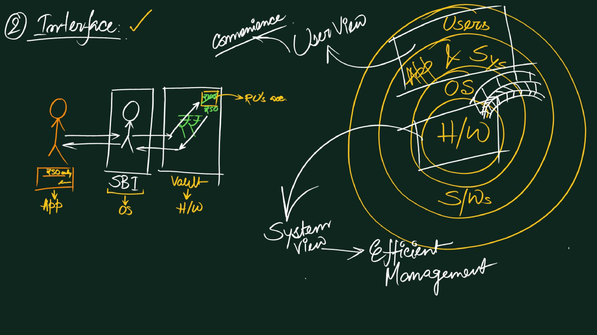
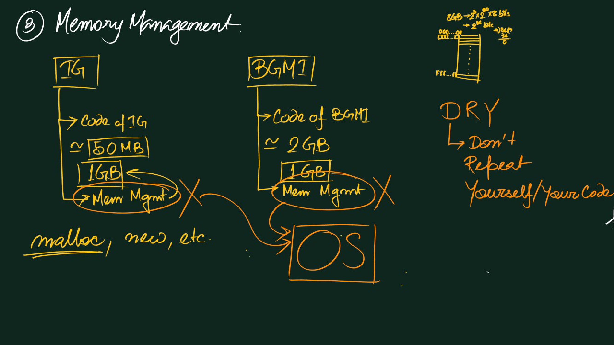
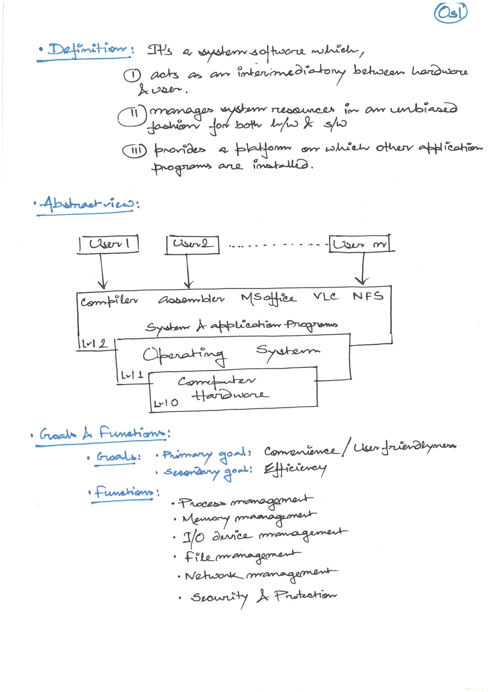

# 📘 **Class 1 – Operating Systems (OS)**
---
## 🖥️ **Topic 1: Understanding the Operating System (OS)**
---
### ✨ **Definition of Operating System**

An **Operating System (OS)** is a piece of software that manages all the resources of a computer system—both **hardware and software**—and provides an environment in which the user can execute programs **conveniently and efficiently**.

- It hides the **complexity of hardware**
- Acts as a **resource manager**
---
### ❓ **Why Do We Need an OS?**
---
#### 🚫 **1. Without an OS**

- **Bulky and Complex Applications**  
    Every application would need its own hardware-interaction code, making programs extremely large and complex.
- **Resource Exploitation by a Single App**  
    Apps like _Instagram_ or _BGMI_ could monopolize CPU, memory, or GPU, causing system instability.
- **No Memory Protection**  
    One application could overwrite another application’s memory.
---
#### ⚖️ **2. Efficient Resource Allocation**

- The OS ensures **fair and controlled distribution** of resources  
    _(e.g., Instagram gets 5%, BGMI gets 50%)_
- Prevents conflicts and maintains **system stability**
---
### 🛠️ **Key Functions of an OS**

- **Resource Management (Arbitration)**  
    Manages CPU, memory, storage, devices, files, security, and processes.    
- **Access to Hardware**  
    Provides controlled access to hardware components.
- **Interface / Bridge**  
    Acts as a bridge between the **user, applications, and hardware**.
- **Isolation & Protection**  
    Prevents apps from interfering with each other  
    _(e.g., Instagram cannot overwrite BGMI’s memory)_
- **Abstraction**  
    Hides hardware complexity so developers focus on application logic.
- **Program Facilitation**  
    Enables smooth execution of applications using isolation and protection.
---
### ⚖️ **Why is Resource Management Called Arbitration?**
---
#### 📖 **Arbitration – English Meaning**

- Comes from the word **arbiter**
- Means a **neutral judge or referee**
- Used when multiple parties want the same thing
---
#### 🖥️ **Arbitration in Operating Systems**

- System resources (CPU, memory, disk, I/O devices) are **limited**
- Multiple programs may request them **at the same time**
- The OS acts as a **neutral judge**
- It decides:

    - Who gets the resource        
    - For how long
    - In what order
---
#### 🧩 **Examples**

- When several processes are ready to run, the **OS scheduler arbitrates CPU time**
- When multiple programs want to write to a file or printer, the OS **prevents conflicts** and ensures fairness or priority
---
#### ✅ **Conclusion**
Resource management is called **arbitration** because the OS continuously makes **fair decisions and resolves conflicts**, just like an arbiter in real life.
---
## 👤⚙️ **Topic 2: User View and System View**
---
### 🔍 **What is a “View” in an Operating System?**
A **view** means the **perspective** from which the OS is observed.

- **User View** → Experience of the user or application developer
- **System View** → Internal resource management and hardware control
---
### 🌆 **City Analogy**

- **Tourist View** → Roads, attractions, easy navigation
- **City Planner View** → Traffic signals, water lines, power grids
Same city, **different perspectives**
---
## 👤 **1. User View of an OS**
Focuses on **convenience and responsiveness**

---
### 🧠 **Key Points & Examples**

- **Ease of Use**  
    Users run apps like Instagram or BGMI without worrying about CPU scheduling.
- **Abstraction of Hardware**  
    Clicking “Save” doesn’t require knowing how disk sectors work.
- **Interactivity & Interface**
    
    - Graphical interfaces: Windows, macOS, Android

    - Command-line interfaces: Linux terminal        
- **Performance & Reliability**  
    Users judge OS by **speed, stability, and smooth multitasking**
---
### 🚗 **Analogy**
Like driving a car—you care about the **steering wheel and dashboard**, not the engine timing.

---
## ⚙️ **2. System View of an OS**
Focuses on **efficient resource utilization and protection**

---
### 🧠 **Key Points & Examples**

- **Resource Manager / Arbiter**  
    Allocates CPU, memory, disk, and I/O devices fairly.
- **Process Coordination & Protection**  
    Prevents one process from overwriting another’s memory.
- **Scheduling & Control**  
    Selects which process runs next, manages interrupts, balances load.
- **Hardware Interaction**  
    Handles device drivers and low-level tasks invisible to users.
---
### 🏙️ **Analogy**
Like a city planner managing water supply, electricity, and traffic so citizens never see the complexity.

---
## 📊 **Summary Table**

| Aspect          | User View                     | System View                          |
| --------------- | ----------------------------- | ------------------------------------ |
| **Focus**       | Convenience, responsiveness   | Resource management & protection     |
| **Concern**     | “Can I run my apps smoothly?” | “How to allocate CPU/memory safely?” |
| **Example**     | Launching Instagram or BGMI   | Scheduling CPU time                  |
| **Abstraction** | Hides hardware complexity     | Works directly with hardware         |

---
## 🎯 **Takeaway**

- **User View** → Experience and ease of use
- **System View** → Engineering and resource control

An **Operating System** is both:
- A **service provider for users**
- An **arbiter for hardware resources**
---

![[class-01-img-06.jpg]]
___
